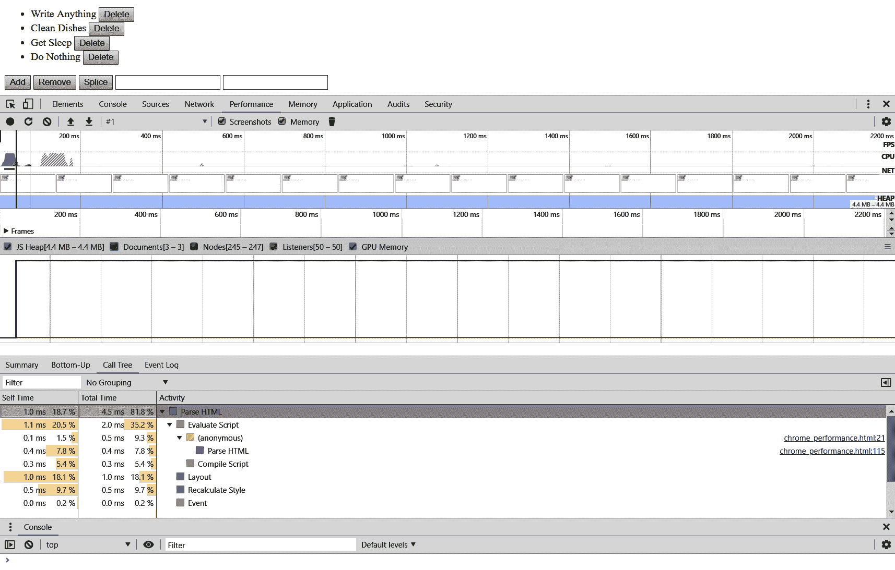
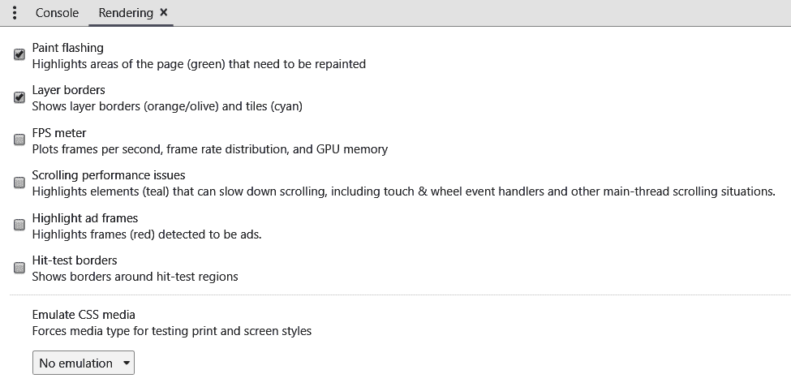
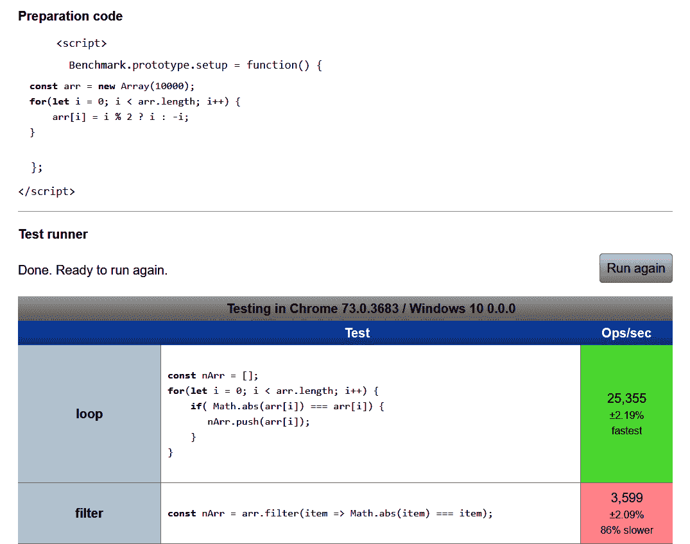

# 第一章：网络高性能工具

JavaScript 已经成为网络的主要语言。它不需要额外的运行时，也不需要编译过程来运行 JavaScript 应用程序。任何用户都可以打开一个网络浏览器并开始在控制台中输入来学习这种语言。除此之外，语言和**文档对象模型**（**DOM**）也有许多进步。所有这些都为开发人员提供了一个丰富的环境来创造。

除此之外，我们可以将网络视为*一次构建，随处部署*的环境。在一个操作系统上运行的代码也将在另一个操作系统上运行。如果我们想要针对所有浏览器，可能需要进行一些调整，但它可以被视为*一次开发，随处部署*的平台。然而，所有这些都导致了应用程序变得臃肿，使用了昂贵的框架和不必要的 polyfill。大多数工作职位都需要这些框架，但有时我们不需要它们来创建丰富的应用程序。

本章重点介绍我们将用来帮助构建和分析高性能网络应用程序的工具。我们将研究不同的现代浏览器及其独特的贡献。然后我们将深入研究 Chrome 开发者工具。总的来说，我们将学到以下内容：

+   每个浏览器中嵌入的不同开发工具

+   深入了解以下 Chrome 工具：

+   性能选项卡

+   内存选项卡

+   渲染器选项卡

+   jsPerf 和代码基准测试

# 技术要求

本章的先决条件如下：

+   一个网络浏览器，最好是 Chrome。

+   编辑器；最好使用 VS Code。

+   JavaScript 的知识和一些 DOM API。

+   相关代码可以在[`github.com/PacktPublishing/Hands-On-High-Performance-Web-Development-with-JavaScript/tree/master/Chapter01`](https://github.com/PacktPublishing/Hands-On-High-Performance-Web-Development-with-JavaScript/tree/master/Chapter01)找到。

# 不同环境的开发工具

有四种被认为是现代浏览器的浏览器。它们是 Edge、Chrome、Firefox 和 Safari。这些浏览器遵守最新的标准，并且正在积极开发。我们将看看它们各自的发展情况以及一些独特的功能。

Internet Explorer 接近于终止其生命周期。浏览器只会进行关键的安全修复。新应用程序应该尽量淘汰这个浏览器，但如果仍有客户群在使用它，我们可能需要为其开发。在本书中，我们不会专注于为其提供 polyfill。

# Edge

微软的 Edge 浏览器是他们对现代网络的看法。借助 EdgeHTML 渲染器和 Chakra JavaScript 引擎，在许多基准测试中表现良好。虽然 Chakra 引擎与 Chrome 或 Firefox 有不同的优化，但从纯 JavaScript 的角度来看，这是一个有趣的浏览器。

在撰写本书时，微软正在将 Edge 的渲染引擎更改为 Chromium 系统。这对 Web 开发人员有许多影响。首先，这意味着更多的浏览器将运行 Chromium 系统。这意味着在跨浏览器开发方面要担心的事情会减少。虽然需要支持当前形式的 Edge，但它可能会在未来一年内消失。

在功能方面，Edge 相对于其他浏览器来说比较轻。如果我们需要对其进行任何类型的性能测试，最好的选择是使用 jsPerf 或其他工具来分析代码，而不是使用内置工具。此外，Chakra 引擎利用不同的优化技术，因此在 Chrome 或 Safari 上有效的代码可能对 Edge 来说不够优化。在 Windows 上打开开发者工具，我们可以按下*F12*。这将弹出通常的控制台对话框，如下所示：


我们不会介绍 Edge 的任何有趣功能，因为他们的开发工具中的大多数，如果不是全部，功能与其他浏览器中的功能相同。

基于 Chromium 的最新 Edge 浏览器将支持 OS X 用户，这意味着与 Windows 或 Linux 相比，OS X 用户进行跨浏览器开发将变得更加容易。

# Safari

苹果的 Safari 浏览器基于 WebKit 渲染引擎和 JavaScriptCore 引擎。WebKit 引擎是 Chrome 的 Blink 引擎的基础，JavaScriptCore 引擎在 OS X 操作系统的一些地方使用。关于 Safari 的一个有趣的点是，如果我们运行 Windows 或 Linux，我们将无法直接访问它。

要访问 Safari，我们需要利用在线服务。BrowserStack 或 LambdaTest 以及其他一些服务都可以为我们完成这项工作。有了这些服务中的任何一个，我们现在可以访问我们可能没有的浏览器。感谢 LambdaTest，我们将利用他们的免费服务简要查看 Safari。

再次，我们会注意到 Safari 浏览器开发工具并不是太多。所有这些工具在其他浏览器中也都可用，并且通常在这些其他浏览器中更加强大。熟悉每个界面可以帮助在特定浏览器中进行调试，但不需要花费太多时间查看那些没有任何特定功能的浏览器。

# Firefox

Mozilla 的 Firefox 使用了 SpiderMonkey JavaScript 引擎和增强的 Gecko 引擎。当他们将他们的项目 Servo 代码的部分添加到 Gecko 引擎中时，Gecko 引擎得到了一些很好的改进，从而提供了一个不错的多线程渲染器。Mozilla 一直处于最新 Web 技术的前沿。他们是最早实现 WebGL 的之一，他们也是最早实现 WebAssembly 和**WebAssembly System Interface**（**WASI**）标准的之一。

接下来是关于着色器和着色器语言**OpenGL Shading Language**（**GLSL**）的一些技术讨论。建议您继续阅读以了解更多信息，但对于那些迷失方向的人来说，访问文档以了解更多关于这项技术的信息可能会有所帮助，网址为[`developer.mozilla.org/en-US/docs/Games/Techniques/3D_on_the_web/GLSL_Shaders`](https://developer.mozilla.org/en-US/docs/Games/Techniques/3D_on_the_web/GLSL_Shaders)。

如果我们在 Windows 中打开 DevTools，按*F12*，我们可能会看到**Shader Editor**选项卡。如果没有，可以转到右侧的三个点菜单，打开设置。在左侧，应该有一个带有默认开发者工具标题的复选框列表。继续选择**Shader Editor**选项。现在，如果我们进入此选项卡，应该会看到以下内容：


该选项卡正在请求画布上下文。基本上，该工具正在寻找一些项目：

+   一个画布元素

+   一个启用了 3D 的上下文

+   顶点和片段着色器

我们仓库中的一个名为`shader_editor.html`的文件包含了设置画布和着色器的必要代码，这样我们就可以利用着色器编辑器。这些着色器是在 Web 上以编程方式使用 GPU 的方法。它们利用了一个名为 OpenGL ES 3.0 的 OpenGL 规范的版本。这使我们能够使用该规范中的几乎所有内容，特别是顶点和片段着色器。

要使用这些着色器进行编程，我们使用一种称为**GL Shading Language**（**GLSL**）的语言。这是一种类似于 C 的语言，具有许多特定于它的功能，例如 swizzling。Swizzling 是利用矢量组件（最多四个）并以我们选择的任何形状或形式组合它们的能力。这看起来像下面这样的例子：

```js
vec2 item = vec2(1.0, 1.0);
vec4 other_item = item.xyxx;
```

这创建了一个四元素向量，并将*x*、*y*、*z*和*w*分量分别设置为两元素向量中的`x`、`y`、`x`和`x`项。命名可能需要一段时间才能习惯，但它确实使某些事情变得更容易。如上所示的一个例子，我们需要从两元素向量中创建一个四元素向量。在基本的 JavaScript 中，我们需要执行以下操作：

```js
const item = [1.0, 1.0];
const other_item = [item[0], item[1], item[0], item[0]];
```

我们可以利用 swizzling 的简写语法，而不是编写前面的内容。GLSL 系统中还有其他功能，我们将在后面的章节中进行介绍，但这应该让我们对这些语言有所了解。

现在，如果我们打开`shader_editor.html`文件并重新加载页面，我们应该会看到一个白色的页面。如果我们查看着色器编辑器，我们可以看到右侧我们正在将一个名为`gl_FragColor`的变量设置为一个四元素向量，其中所有元素都设置为`1.0`。如果我们将它设置为`vec4(0.0, 0.0, 0.0, 1.0)`会发生什么？我们现在应该在左上角看到一个黑色的框。这展示了向量的四个分量是颜色的红色、绿色、蓝色和 alpha 分量，范围从`0.0`到`1.0`，就像 CSS 的`rgba`系统一样。

除了单一的纯色之外，还有其他颜色组合吗？每个着色器都带有一些预先定义的全局变量。其中之一，在片段着色器中，称为`gl_FragCoord`。这是窗口空间中左下角的坐标，范围从`0.0`到`1.0`（这里应该有一个主题，说明在 GLSL 中哪些值被认为是好的）。如果我们将四元素向量的*x*元素设置为`gl_FragCoord`的*x*元素，将*y*元素设置为`gl_FragCoord`的*y*元素，我们应该会得到一个简单的白色框，但左侧和底部各有一个单像素的边框。

除了 swizzling 和全局变量，我们还可以在这些着色器中使用其他数学函数。让我们将这些*x*和*y*元素包装在`sin`函数中。如果我们这样做，我们应该在屏幕上得到一个漂亮的格子图案。这应该给出片段着色器实际在做什么的提示。它试图根据各种输入在 3D 空间中绘制该位置，其中一个输入是来自顶点着色器的位置。

然后它试图绘制构成我们用顶点着色器声明的网格内部的每个像素。此外，这些片段是同时计算的（或者尽可能多地由显卡来计算），因此这是一个高度并行化的操作。

这应该给我们一个很好的窥视 GLSL 编程世界的机会，以及 GLSL 语言除了 3D 工作之外可以为我们提供的可能性。现在，我们可以更多地尝试这些概念，并转向最后一个浏览器 Chrome。

# Chrome

谷歌的 Chrome 浏览器使用 Blink 引擎，并使用著名的 V8 JavaScript 运行时。这是 Node.js 内部使用的相同运行时，因此熟悉开发工具将在很多方面帮助我们。

Chrome 一直处于网络技术的前沿，就像 Firefox 一样。他们是第一个实现各种想法的人，比如 QUIC 协议，HTTP/3 标准就是基于它。他们创建了原生插件接口（NaCL），帮助创建了 WebAssembly 的标准。他们甚至是使 Web 应用程序开始变得更像本地应用程序的先驱，通过提供蓝牙、游戏手柄和通知等 API。

我们将特别关注 Chrome 附带的 Lighthouse 功能。Lighthouse 功能可以从 Chrome 浏览器的**审计**选项卡中访问。一旦我们在这里，我们可以使用各种设置来设置我们的审计：

+   首先，我们可以根据页面是在移动设备上运行还是在桌面上运行来审计我们的页面。然后我们可以审计我们网站的各种功能。

+   如果我们正在开发渐进式 Web 应用程序，我们可能会决定不需要 SEO。另一方面，如果我们正在开发营销网站，我们可能会决定不需要渐进式 Web 应用程序检查。我们可以模拟受限连接。

+   最后，我们可以从干净的存储开始。如果我们的应用程序利用了内置浏览器缓存系统，比如会话存储或本地存储，这将特别有帮助。

举例来说，让我们看看外部网站，并查看它在审核应用程序中的表现如何。我们将查看的网站是亚马逊，位于[`www.amazon.com`](https://www.amazon.com)。这个网站应该是我们要遵循的一个很好的例子。我们将把它作为桌面应用程序来查看，不进行任何限制。如果我们运行审核，我们应该得到类似以下的结果：


正如我们所看到的，主页在性能和最佳实践方面表现良好，但 Chrome 警告我们有关可访问性和 SEO 性能。在可访问性方面，似乎图片没有`alt`属性，这意味着屏幕阅读器将无法正常工作。此外，似乎开发人员的`tabindexes`高于 0，可能导致选项卡顺序不遵循正常页面流程。

如果我们想要设置自己的系统进行测试，我们需要在本地托管我们的页面。有许多出色的静态站点托管解决方案（我们将在本书后面构建一个），但如果我们需要托管内容，最简单的方法之一是下载 Node.js 并安装`static-server`模块。我们将在后面深入介绍如何启动和运行 Node.js，并如何创建我们自己的服务器，但目前这是最好的选择。

我们已经看过了主要的现代 Web 浏览器，我们应该瞄准它们。它们每个都有自己的能力和限制，这意味着我们应该在所有这些浏览器上测试我们的应用程序。然而，本书的重点将是 Chrome 浏览器及其附带的开发工具。由于 Node.js 是使用 V8 引擎构建的，并且许多其他新浏览器都是基于 Chromium 引擎构建的，比如 Brave，因此利用这一点是有意义的。我们将详细介绍 Chrome 开发工具给我们的三个特定功能。

# Chrome - 深入了解性能选项卡

除了 Firefox 内部的一些工具外，Chrome 已经成为用户和开发人员首选的广泛使用的浏览器。对于开发人员来说，这在很大程度上要归功于其出色的开发工具。接下来的部分将着眼于设计 Web 应用程序时对任何开发人员都重要的三个关键工具。我们将从性能工具开始。

这个工具允许我们在应用程序运行时运行性能测试。如果我们想要查看我们的应用程序在执行某些操作时的行为，这将非常有用。例如，我们可以分析我们的应用程序的启动状态，并查看可能的瓶颈位置。或者，当用户交互发生时，比如在表单上提交时，我们可以看到我们经过的调用层次结构来发布信息并将其返回给用户。除此之外，它甚至可以帮助我们分析在使用 Web Worker 时代码的性能以及我们的应用程序上下文之间的数据传输方式。

以下是撰写时最新版本 Chrome 的**性能**选项卡的屏幕截图：


有几个部分是我们感兴趣的。首先，我们开发工具标签下面的工具栏是我们的主要工具栏。左边的两个按钮可能是最重要的，记录和重新加载记录工具。这些将允许我们对我们的应用程序进行分析，并查看在我们的代码的关键时刻发生了什么。在这些之后是选择工具，用于获取之前可能运行过的配置文件。

接下来是两个选项，我通常都会随时打开：

+   首先，当应用程序发生关键事件时，屏幕截图功能会为我们抓取屏幕截图，比如内存增长或添加新文档。

+   下一个选项是内存分析器。它将告诉我们当前消耗了多少内存。

最后，还有删除操作。正如许多人所推测的那样，这将删除您当前正在使用的配置文件。

让我们在一个简单的测试应用程序上进行测试运行。从存储库中获取`chrome_performance.html`文件。这个文件展示了一个标准的待办事项应用程序，但它是用一个非常基本的模板系统和没有库来编写的。在本书中，不使用库将成为标准。

如果我们运行这个应用程序并从重新加载运行性能测试，我们应该得到以下结果：



页面加载几乎是瞬间完成的，但我们仍然可以在这里得到一些有用的信息。从上到下，我们得到以下信息：

+   一系列图片的时间轴，以及 FPS、CPU 使用率、网络使用率和堆使用率的图表。

+   不同统计数据的折线图，比如 JavaScript 堆使用、文档数量、文档节点数量、监听器数量以及我们正在使用的 GPU 内存。

+   最后，我们得到一个分栏部分，其中包含有关时间和时间分配的所有信息。

确保让分析器自行运行。在页面上的所有操作完成后，它应该会自动关闭。这应该确保您尽可能接近正确的应用程序运行信息。分析器可能需要运行几次才能得到准确的图片。内部垃圾收集器正在努力保留一些对象，以便稍后重用它们，因此获得准确的图片意味着看到低点是最有可能的应用程序基线，随后是**垃圾收集**（**GC**）。一个很好的指标是看到主要的 GC 和/或 DOM GC。这意味着我们又重新开始了。

在这个基本示例中，我们可以看到大部分时间都花在了 HTML 上。如果我们打开它，我们会看到评估我们的脚本占用了大部分时间。由于大部分时间都花在了评估脚本和将我们的模板化待办事项应用程序插入 DOM 中，让我们看看如果没有这种行为，统计数据会是什么样子。

注释掉除了我们的基本标签之外的所有内容，比如`html`、`head`和`body`标签。这次运行有一些有趣的元素。首先，文档的数量应该保持不变或减少。这将在后面提到。其次，节点的数量急剧减少，可能降到了大约 12 个。我们的 JavaScript 堆略微减少，监听器的数量显著减少。

让我们再加入一个`div`标签。文档、堆空间和监听器的数量保持不变，但节点的数量再次增加。让我们再添加另一个`div`元素，看看它对节点数量的影响。它应该增加四个。最后一次，让我们再添加另一个`div`元素。同样，我们应该注意到增加了四个 DOM 节点。这给了我们一些线索，了解 DOM 的运行方式以及如何确保我们的分析是正确的。

首先，节点的数量并不直接等于屏幕上的 DOM 元素数量。DOM 节点由几个基本节点组成。例如，如果我们添加一个`input`元素，我们可能会注意到节点的数量增加了超过四个。其次，可用的文档数量几乎总是高于单个文档。

虽然一些行为可以归因于性能分析器中的错误，但它也展示了幕后发生的事情，这些事情对开发人员是不可见的。当我们触及内存选项卡并查看调用层次时，我们会看到内部系统正在创建和销毁开发人员无法完全控制的节点，以及开发人员看不到但是浏览器优化的文档。

让我们再次添加我们的代码块，回到原始文档。如果需要的话，继续回滚 Git 分支（如果这是从存储库中拉取的），然后再次运行性能分析器。我们特别想查看调用树选项卡和解析 HTML 下拉菜单。应该有一个类似以下的层次结构：`解析 HTML > 评估脚本 > (匿名) > runTemplate > runTemplate`。

让我们改变代码，将我们的内部`for`循环转换为一个数组`map`函数，就像这样：

```js
const tempFun = runTemplate.bind(null, loopTemp);
loopEls = data.items.map(tempFun);
```

注释掉`loopEls`数组初始化和`for`循环。再次运行性能分析器，让我们看看这个调用堆栈是什么样子。我们会注意到，即使我们将其绑定到一个名为`tempFun`的新函数，它仍然会将`runTemplate`函数本身作为自己进行性能分析。这是我们在查看调用层次时必须牢记的另一个要点。我们可能会绑定、调用或应用函数，但开发工具仍会尝试维护函数的原始定义。

最后，让我们向我们的数据列表添加很多项目，看看这对我们的分析有什么影响。将以下代码放在数据部分下面：

```js
for(let i = 0; i < 10000; i++) {
    data.items.push({text : `Another item ${i}`});
}
```

现在我们应该得到一个与之前不同的画面：

+   首先，我们的时间几乎平均分配在 GPU 的布局和脚本的评估之间，现在看起来我们大部分时间都在运行布局引擎。这是有道理的，因为我们在脚本的末尾添加每个项目时，我们强制 DOM 来计算布局。

+   其次，评估脚本部分现在应该包含比之前简单的调用层次更多的部分。

+   我们还将开始看到函数的不同部分在性能分析器中注册。这表明，如果某些东西低于某个阈值（这实际上取决于机器甚至 Chrome 的版本），它将不会显示函数被认为足够重要以进行性能分析。

垃圾回收是环境清理我们不再使用的未使用项目的过程。由于 JavaScript 是一个内存管理环境，这意味着开发人员不像在 C++和 Rust 等语言中那样自己分配/释放内存，我们有一个程序来为我们做这些。特别是 V8 有两个 GC，一个叫做**Scavenger**的次要 GC，一个叫做**Mark-Compact**的主要 GC。

清道夫会检查新分配的对象，看看是否有任何准备清理的对象。大多数时候，我们的代码将被编写为在短时间内使用大量临时变量。这意味着它们在初始化变量的几个语句之后将不再需要。看下面的代码片段：

```js
const markedEls = [];
for(let i = 0; i < 10000; i++) {
    const obj = els[i];
    if( obj.marked ) {
        markedEls.push(Object.assign({}, obj));
    }
}
```

在这个假设的例子中，我们想获取对象并在它们标记为某个过程时对它们进行克隆。我们收集我们想要的对象，其余的现在没有用了。清道夫会注意到几件事情。首先，它似乎我们不再使用旧列表，所以它会自动收集这些内存。其次，它会注意到我们有一堆未使用的对象指针（除了 JavaScript 中的原始类型，其他都是按引用传递的），它可以清理这些。

这是一个快速的过程，它要么交织在我们的运行时中，称为停止-继续垃圾回收，要么会在与我们的代码并行运行，这意味着它将在另一个执行线程中的确切时间运行。

标记-压缩垃圾收集运行时间更长，但收集的内存更多。它将遍历当前仍在堆中的物品列表，并查看这些物品是否有零引用。如果没有更多的引用，它将从堆中删除这些对象。然后它将尝试压缩堆中的所有空隙，这样我们就不会有高度碎片化的内存。这对于诸如数组之类的东西特别有用。

数组在内存中是连续的，所以如果 V8 引擎能找到足够大的空间来放置数组，它就会放在那里。否则，它可能需要扩展堆并为我们的运行时分配更多内存。这就是标记-压缩 GC 试图防止发生的事情。

虽然不需要完全了解垃圾收集器的工作方式才能编写高性能的 JavaScript，但对它有一个良好的理解将有助于编写不仅易于阅读而且在你使用的环境中表现良好的代码。

如果你想了解更多关于 V8 垃圾收集器的信息，我建议你去这个网站[`v8.dev/blog`](https://v8.dev/blog)。看到 V8 引擎是如何工作的，以及新的优化如何导致某些编码风格比过去更高效，比如数组的 map 函数，总是很有趣。

我们没有详细介绍性能选项卡，但这应该给出了如何在测试代码时利用它的一个很好的概述。它还应该展示了 Chrome 的一些内部工作和垃圾收集器。

在下一节关于内存的讨论中将会有更多内容，但强烈建议对当前的代码库运行一些测试，并注意在运行这些应用程序时性能如何。

# Chrome-深入了解内存选项卡

当我们从性能部分转移到内存部分时，我们将重新审视性能工具中的许多概念。V8 引擎为开发既在 CPU 使用效率方面又在内存使用效率方面高效的应用程序提供了大量支持。测试内存使用情况以及内存分配位置的一个很好的方法是内存分析工具。

在撰写本文时的最新版本的 Chrome 中，内存分析器显示如下：


我们主要将关注被选中的第一个选项，即堆快照工具。时间轴上的分配仪表盘是可视化和回放堆是如何被分配的以及哪些对象导致分配发生的一个很好的方法。最后，分配抽样工具会定期进行快照，而不是提供连续的查看，使其更轻便，并能够在进行繁重操作时执行内存测试。

堆快照工具将允许我们看到堆上内存的分配位置。从我们之前的例子中，让我们运行堆快照工具（如果你还没有注释掉分配了 10,000 个 DOM 节点的`for`循环，现在注释掉它）。快照运行后，你应该会得到一个左侧有树形视图的表格。让我们去寻找在控制台中能够访问到的*global*物品之一。

我们目前按它们是什么或者它们属于谁来分组物品。如果我们打开（闭包）列表，我们可以找到`runTemplate()`函数被保存在那里。如果我们进入（字符串）列表，我们可以找到用来创建我们列表的字符串。一个可能提出的问题是为什么一些这些物品仍然被保存在堆上，即使我们不再需要它们。嗯，这涉及到垃圾收集器的工作方式以及谁当前正在引用这些物品。

查看当前存储在内存中的列表项。如果您点击每个列表项，它会显示它们被`loopEls`引用。如果我们回到我们的代码，可以注意到我们使用的唯一一行代码`loopEls`在以下位置：

```js
const tempFun = runTemplate.bind(null, loopTemp);
loopEls = data.items.map(tempFun);
```

将其移除并将基本的`for`循环放回。运行堆快照并返回(strings)部分。这些字符串不再存在！让我们再次更改代码，使用`map`函数，但这次不使用 bind 函数创建新函数。代码应该如下所示：

```js
const loopEls = data.items.map((item) => {
    return runTemplate(loopTemp, item);
});
```

再次更改代码后运行堆快照，我们会注意到这些字符串不再存在。敏锐的读者会注意到第一次运行中代码存在错误；`loopEls`变量没有添加任何变量类型前缀。这导致`loopEls`变量进入全局范围，这意味着垃圾收集器无法收集它，因为垃圾收集器认为该变量仍在使用中。

现在，如果我们把注意力转向列表中的第一项，我们应该观察到整个模板字符串仍然被保留。如果我们点击该元素，我们会注意到它被`template`变量所持有。然而，我们可以说，由于该变量是一个常量，它应该自动被收集。再次说明，V8 编译器不知道这一点，已经将它放在全局范围内。

我们可以通过两种方式解决这个问题。首先，我们可以使用老式技术，并将其包装在**立即调用的函数表达式**（**IIFE**）中，如下所示：

```js
(function() { })();
```

或者，如果我们愿意并且正在为支持它的浏览器编写我们的应用程序，我们可以将脚本类型更改为`module`类型。这两种解决方案都确保我们的代码现在不再是全局范围的。让我们将整个代码库放在 IIFE 中，因为这在所有浏览器中都受支持。如果我们运行堆转储，我们会看到那个字符串不再存在。

最后，应该触及的最后一个领域是堆空间的工作集和实际分配的数量。在 HTML 文件的顶部添加以下行：

```js
<script type="text/javascript" src="./fake_library.js"></script>
```

这是一个简单的文件，它将自身添加到窗口以充当库。然后，我们将测试两种情况。首先，运行以下代码：

```js
for(let i = 0; i < 100000; i++) {
    const j = Library.outerFun(true);
    const k = Library.outerFun(true);
    const l = Library.outerFun(true);
    const m = Library.outerFun(true);
    const n = Library.outerFun(true);
}
```

现在，转到性能部分，查看显示的两个数字。如果需要，可以点击垃圾桶。这会导致主要的垃圾收集器运行。应该注意左边的数字是当前使用的，右边的数字是已分配的。这意味着 V8 引擎为堆分配了大约 6-6.5 MB 的空间。

现在，以类似的方式运行代码，但让我们将每个运行分解成它们自己的循环，如下所示：

```js
for(let i = 0; i < 100000; i++) {
    const j = Library.outerFun(true);
}
```

再次检查性能选项卡。内存应该在 7 MB 左右。点击垃圾桶，它应该降到 5.8 MB 左右，或者接近基线堆应该在的位置。这给我们展示了什么？由于它必须为第一个`for`循环中的每个变量分配项目，它必须增加其堆空间。即使它只运行了一次，次要垃圾收集器应该已经收集了它，但由于垃圾收集器内置的启发式，它将保留该堆空间。由于我们决定这样做，垃圾收集器将保留更多的堆内存，因为我们很可能会在短期内重复这种行为。

现在，对于第二组代码，我们决定使用一堆`for`循环，每次只分配一个变量。虽然这可能会慢一些，V8 看到我们只分配了小块空间，因此可以减少主堆的大小，因为我们很可能会在不久的将来保持相同的行为。V8 系统内置了许多启发式规则，并且它会尝试根据我们过去的行为来猜测我们将要做什么。堆分配器可以帮助我们了解 V8 编译器将要做什么，以及我们的编码模式在内存使用方面最像什么。

继续玩内存标签，并添加代码。看看流行的库（尝试保持它们小，以便跟踪内存分配），注意它们决定如何编写代码以及它如何导致堆分配器在内存中保留对象，甚至保持更大的堆大小。

通常情况下，编写小函数有很多好处，但编写做一件事情非常出色的小函数对于垃圾收集器也非常有益。它将根据编码人员编写这些小函数的事实来制定启发式规则，并减少总体堆空间。这反过来会导致应用程序的内存占用也减少。请记住，我们的内存使用情况不是工作集大小（左侧数字），而是总堆空间（右侧数字）。

# Chrome-深入了解渲染标签

我们将在开发者工具中查看的最后一个部分将是渲染部分。这通常不是一个默认可用的标签。在工具栏中，您会注意到关闭按钮旁边有一个三点按钮。点击它，转到更多工具，然后点击渲染选项。

现在应该有一个标签项，靠近控制台标签，看起来像下面这样：



这个标签可以展示一些我们在开发应用程序时感兴趣的项目：

+   首先，在开发一个将有大量数据或大量事件的应用程序时，建议打开 FPS 计量器。这不仅可以让我们知道我们的 GPU 是否被利用，还可以告诉我们是否由于不断重绘而丢失帧数。

+   其次，如果我们正在开发一个有大量滚动的应用程序（考虑无限滚动的应用程序），那么我们将希望打开滚动性能问题部分。这可以通知我们，如果我们的应用程序中有一个或多个项目可能会导致滚动体验不流畅。

+   最后，绘制闪烁选项非常适合在我们的应用程序中有大量动态内容时使用。当发生绘制事件时，它会闪烁，并突出显示必须重新绘制的部分。

我们将通过一个应用程序，这个应用程序将会对大多数这些设置造成问题，并看看我们如何提高性能以改善用户体验。打开以下文件：`chrome_rendering.html`。

我们应该看到左上角有一个方框在变换颜色。如果我们打开**绘制闪烁**选项，现在每当方框颜色改变时，我们应该看到一个绿色方框出现。

这是有道理的。每次重新着色时，这意味着渲染器必须重新绘制该位置。现在取消以下行的注释：

```js
let appendCount = 0;
const append = function() {
    if( appendCount >= 100 ) {
        return clearInterval(append);
    }
    const temp = document.createElement('p');
    temp.textContent = `We are element ${appendCount}`;
    appendEl.appendChild(temp);
    appendCount += 1;
};
setInterval(append, 1000);
```

我们应该看到大约每隔 1 秒添加一个元素。有几件事情很有趣。首先，我们仍然看到每秒或更长时间自行着色的框被重新绘制。但是，除此之外，我们会注意到滚动条也在重新绘制自己。这意味着滚动条是渲染表面的一部分（有些人可能知道这一点，因为你可以用 CSS 来定位滚动条）。但同样有趣的是，当每个元素被添加时，它不必重新绘制整个父元素；它只在添加子元素的地方进行绘制。

那么，一个很好的问题是：如果我们在文档中添加一个元素会发生什么？注释掉正在改变 DOM 的代码行，并取消注释以下代码行以查看其效果：

```js
setTimeout(() => {
    const prependElement = document.createElement('p');
    prependElement.textContent = 'we are being prepended to the entire  
     DOM';
    document.body.prepend(prependElement);
}, 5000);
```

我们可以看到，在文档的生命周期中大约五秒钟后，我们添加的元素和那个红色框都被重新绘制了。这是有道理的。Chrome 必须重新绘制任何发生变化的东西。就我们的窗口外观而言，这意味着它必须改变框的位置，并添加我们在顶部添加的文本，导致两个项目都被重新绘制。

现在，我们可以看到一个有趣的事情，那就是如果我们用 CSS 将元素绝对定位会发生什么。这意味着，就我们所看到的而言，只有矩形的顶部部分和我们的文本元素需要重新绘制。但是，如果我们通过将位置设置为绝对来做到这一点，我们仍然会看到 Chrome 不得不重新绘制两个元素。

即使我们将`document.body.prepend`改为`document.body.append`，它仍然会同时绘制两个对象。Chrome 必须这样做，因为框是一个 DOM 对象。它无法只重绘对象的部分；它必须重绘整个对象。

一个要记住的好事是，当改变文档中的某些内容时，它会导致重新布局或重绘吗？添加一个列表项是否也会导致其他元素移动、改变颜色等？如果是，我们可能需要重新考虑我们的内容层次结构，以确保我们在文档中引起最少的重绘。

关于绘画的最后一点。我们应该看看画布元素是如何工作的。画布元素允许我们通过 2D 渲染上下文或 WebGL 上下文创建 2D 和 3D 图像。我们将专门关注 2D 渲染上下文，但应该注意这些规则也适用于 WebGL 上下文。

继续注释掉我们迄今为止添加的所有代码，并取消注释以下代码行：

```js
const context = canvasEl.getContext('2d');
context.fillStyle = 'green';
context.fillRect(10, 10, 10, 10);
context.fillStyle = 'red';
context.fillRect(20, 20, 10, 10);
setTimeout(() => {
    context.fillStyle = 'green';
    context.fillRect(30, 30, 10, 10);
}, 2000);
```

大约两秒后，我们应该看到一个绿色框被添加到我们小的对角线方块组中。这种绘画方式有趣的地方在于它只显示了对那个小绿色方块的重新绘制。让我们注释掉那段代码，并添加以下代码：

```js
const fillStyles = ['green', 'red'];
const numOfRunsX = 15;
const numOfRunsY = 10;
const totalRuns = numOfRunsX * numOfRunsY;
let currX = 0;
let currY = 0;
let count = 0;
const paint = function() {
    context.fillStyle = fillStyles[count % 2];
    context.fillRect(currX, currY, 10, 10);
    if(!currX ) {
        currY += 10;
    }
    if( count === totalRuns ) {
        clearInterval(paint);
    }
}
setInterval(paint, 1000);
```

大约每隔 1 秒，我们会看到它真正只在我们指定的位置进行重新绘制。这对于需要不断改变页面上的信息的应用程序可能会产生重大影响。如果我们发现需要不断更新某些内容，实际上在画布中完成可能比在 DOM 中更好。虽然画布 API 可能不适合成为一个丰富的环境，但有一些库可以帮助解决这个问题。

并不是每个应用都需要画布的重绘能力，大多数应用都不需要。然而，我们在本书中讨论的每一种技术都不会解决应用程序中发现的 100%的问题。其中一个问题是重绘问题，这可以通过基于画布的解决方案来解决。画布特别适用于绘图和基于网格的应用程序。

现在，我们将看一下滚动选项。当我们有一个很长的项目列表时，这可以帮助我们。这可能是在树视图中，在无限滚动应用程序中，甚至在基于网格的应用程序中。在某些时候，由于尝试一次渲染数千个元素，我们将遇到严重的减速问题。

首先，让我们使用以下代码将 1,000,000 个段落元素渲染到我们的应用程序中：

```js
for(let i = 0; i < 1000000; i++) {
    const temp = document.createElement('p');
    temp.textContent = `We are element ${i}`;
    appendEl.appendChild(temp);
}
```

虽然这可能看起来不像一个真实的场景，但它展示了如果我们必须立即将所有内容添加到 DOM 中，无限加载的应用程序将会变得不可行。那么我们该如何处理这种情况呢？我们将使用一种称为延迟渲染的东西。基本上，我们将把所有对象保存在内存中（在这种情况下；对于其他用例，我们将不断地为更多数据进行 REST 请求），并且我们将按照它们应该出现在屏幕上的顺序添加它们。我们需要一些代码来实现这一点。

以下示例绝不是实现延迟渲染的一种可靠方式。与本书中的大多数代码一样，它采用了一个简单的视图来展示一个观点。它可以很容易地进行扩展，以创建一个延迟渲染的真实系统，但这不是应该被复制和粘贴的东西。

开始延迟渲染的一个好方法是知道我们将拥有多少元素，或者至少想要在我们的列表中展示多少元素。为此，我们将使用 460 像素的高度。除此之外，我们将设置我们的列表元素具有 5 像素的填充，并且高度为 12 像素，底部有 1 像素的边框。这意味着每个元素的总高度为 23 像素。这也意味着一次可以看到 20 个元素（460 / 23）。

接下来，我们通过将我们拥有的项目数量乘以每个项目的高度来设置列表的高度。这可以在以下代码中看到：

```js
list.style.height = `${itemHeight * items.length}px`;
```

现在，我们需要保存我们当前所在的索引（屏幕上当前的 20 个项目），并在发生滚动事件时进行测量。如果我们注意到我们在阈值以上，我们就会移动到一个新的索引，并重置我们的列表以保存那组 20 个元素。最后，我们将无序列表的顶部填充设置为列表的总高度减去我们已经滚动的部分。

所有这些都可以在以下代码中看到：

```js
const checkForNewIndex = function(loc) {
    let tIndex = Math.floor(Math.abs(loc) / ( itemHeight * numItemsOnScreen 
     ));
    if( tIndex !== currIndex ) {
        currIndex = tIndex;
        const fragment = document.createDocumentFragment();
        fragment.append(...items.slice(currIndex * numItemsOnScreen, 
         (currIndex + 2) * numItemsOnScreen));
        list.style.paddingTop = `${currIndex * containerHeight}px`;
        list.style.height = `${(itemHeight * items.length) - (currIndex * 
         containerHeight)}px`;
        list.innerHTML = '';
        list.appendChild(fragment);
    }
}
```

现在我们拥有了所有这些，我们把这个函数放在什么地方呢？嗯，既然我们在滚动，逻辑上来说，把它放在列表的滚动处理程序中是有意义的。让我们用以下代码来做到这一点：

```js
list.onwheel = function(ev) {
    checkForNewIndex(list.getBoundingClientRect().y);
}
```

现在，让我们打开**滚动性能问题**选项。如果我们重新加载页面，我们会注意到它正在突出显示我们的列表，并声明`mousewheel`事件可能成为潜在的瓶颈。这是有道理的。Chrome 注意到我们在每次滚动事件上附加了一个非平凡的代码片段，因此它向我们显示我们可能会有问题。

现在，如果我们在常规桌面上，很可能不会有任何问题，但是如果我们添加以下代码，我们可以很容易地看到 Chrome 试图告诉我们的内容：

```js
const start = Date.now();
while( Date.now() < start + 1000 ) {; }
```

有了这段代码，我们可以看到滚动时出现了卡顿。既然我们现在能看到卡顿，并且它可能成为滚动的潜在瓶颈，下一个最佳选择是什么？将其放入`setInterval`中，使用`requestAnimationFrame`，甚至使用`requestIdleCallback`，最后一个是最不理想的解决方案。

渲染选项卡可以帮助解决应用程序中可能出现的许多问题，并且应该成为开发人员经常使用的工具，以找出是什么导致了应用程序的卡顿或性能问题。

这三个选项卡可以帮助诊断大多数问题，并且在开发应用程序时应该经常使用。

# jsPerf 和基准测试

我们已经来到了关于网络高性能的最后一节，以及我们如何轻松评估我们的应用程序是否以最佳效率运行。然而，有时我们会想要真正进行基准测试，即使这可能不会给出最好的结果。jsPerf 就是这样的工具之一。

创建 jsPerf 测试时必须非常小心。首先，我们可能会遇到浏览器进行的优化，这可能会使结果偏向于某种实现而不是另一种。接下来，我们必须确保在多个浏览器中运行这些测试。如前一节所述，每个浏览器都运行不同的 JavaScript 引擎，这意味着创建者们对它们进行了不同的实现。最后，我们需要确保在我们的测试中没有任何多余的代码，否则结果可能会被扭曲。

让我们看一些脚本，并根据在 jsPerf 中运行它们的结果来看看它们的效果。所以，让我们开始：

1.  转到[`jsperf.com`](https://jsperf.com)。如果我们想创建自己的测试，我们将需要使用 GitHub 账户登录，所以现在就去做吧。

1.  接下来，让我们创建我们的第一个性能测试。系统是不言自明的，但我们将讨论一些方面：

+   首先，如果我们需要添加一些 HTML 代码，以便进行 DOM 操作，我们会将其放在*准备代码 HTML*部分。

+   接下来，我们将输入我们所有测试中需要的任何变量。

+   最后，我们可以整合我们的测试用例。让我们运行一个测试。

1.  我们将首先查看的测试是利用循环与利用`filter`函数。对于这个测试，我们不需要任何 HTML，所以我们可以将这一部分留空。

1.  接下来，我们将输入所有测试用例都需要的以下代码：

```js
const arr = new Array(10000);
for(let i = 0; i < arr.length; i++) {
    arr[i] = i % 2 ? i : -1;
}
```

1.  然后，我们将添加两个不同的测试用例，`for`循环和`filter`函数。它们应该如下所示：

对于循环的情况：

```js
const nArr = [];
for(let i = 0; i < arr.length; i++) {
    if( Math.abs(arr[i]) === arr[i]) {
        nArr.push(arr[i]);
    }
}
```

对于 filter 的情况：

```js
const nArr = arr.filter(item => Math.abs(item) === item);
```

1.  现在，我们可以保存测试用例并运行性能测试器。点击运行按钮，观察测试运行器多次检查每段代码。我们应该看到如下内容：



嗯，正如预期的那样，`for`循环的性能优于`filter`函数。右侧的这三个数字的分解如下：

+   每秒操作次数，或者系统在一秒内可以运行多少基本指令。

+   每个特定测试用例的每次测试运行的差异。对于`for`循环，加减 2%。

+   最后，它会告诉我们它是否是最快的，或者比最快的慢了多少。对于 filter，它慢了 86%。

哇，这明显慢了很多！在这种情况下，我们可能会想出一种让 filter 运行更加高效的方法。一种方法是我们可以提前创建函数，而不是创建一个匿名函数。在我们的结果底部附近，我们将看到一个链接，可以让我们添加更多的测试。让我们回到测试用例中，为我们的新测试添加一个测试。

在底部附近应该有一个**添加代码片段**按钮。让我们点击这个按钮并填写细节。我们将称这个新的代码片段为`filterFunctionDefined`，它应该看起来像下面这样：

```js
const reducer = function(item) {
    return Math.abs(item) === item;
}
const nArr = arr.filter(reducer);
```

我们可以保存这个测试用例并重新运行结果。结果似乎几乎与常规的`filter`函数完全相同。其中一些原因是我们的浏览器为我们优化了我们的代码。我们可以在所有浏览器中测试这些结果，以便更好地了解我们的代码在每个浏览器中的运行情况。但是，即使我们在其他地方运行这个测试，我们也会看到结果是一样的；`filter`函数比普通的`for`循环慢。

这对于几乎每个基于数组的函数都是正确的。辅助函数很棒，但它们也比常规循环慢。我们将在下一章中详细介绍，但请提前意识到，浏览器提供给我们的大多数便利都会比直接以更简单的方式编写函数要慢。

让我们设置另一个测试，只是为了确保我们理解 jsPerf。

首先，创建一个新的测试。让我们对对象执行一个测试，并查看使用`for-in`循环与使用`Object.keys()`方法的差异。同样，我们不需要使用 DOM，因此在 HTML 部分不需要填写任何内容。

对于我们的测试设置，让我们创建一个空对象，然后使用以下代码填充它，其中包含一堆无用的数据：

```js
const obj = {};
for(let i = 0; i < 10000; i++) {
    obj[`item${i}`] = i;
}
```

接下来，让我们创建两个测试用例，第一个是调用`for in`，应该如下所示：

```js
const results = [];
for(let key in obj) {
    results.push([key, obj[key]]);
}
```

第二个测试用例是`Object.keys()`版本，如下所示：

```js
const results = [];
const keys = Object.keys(obj);
for(let i = 0; i < keys.length; i++) {
    results.push([keys[i], obj[keys[i]]);
}
```

现在，如果我们运行我们的测试，我们会注意到`keys`版本能够每秒执行大约 600 次操作，而`fo..in`版本能够每秒执行大约 550 次。这两者相差不大，因此浏览器的差异实际上可能会起作用。当我们开始出现轻微差异时，最好选择后来实现的或最有可能进行优化的选项。

大多数情况下，如果某些东西只是被实现，并且浏览器供应商同意添加某些东西，那么它可能处于早期开发阶段。如果性能结果在允许的公差范围内（通常在 5-10%的差异左右），那么最好选择更新的选项。它更有可能在未来进行优化。

所有这些测试都很棒，如果我们找到了真正想与人们分享的东西，这是一个很好的解决方案。但是，如果我们想自己运行这些测试而不必担心外部网站怎么办呢？嗯，我们可以利用 jsPerf 正在使用的基础库。它被称为 Benchmark.js，当我们需要为调试代码设置自己的系统时，它是一个很好的工具。我们可以在[`benchmarkjs.com/`](https://benchmarkjs.com/)找到它。

让我们获取源代码，并将其设置为 HTML 文件中的外部脚本。我们还需要将*Lodash*添加为依赖项。接下来，让我们编写与之前相同的测试，但是我们将在内部脚本中编写它们，并在屏幕上显示结果。我们还将只显示我们脚本的标题以及这些结果。

我们显然可以使这个更加花哨，但重点将是让库为我们正确地进行基准测试。

我们将有一些设置代码，其中将有一个对象数组。这些对象只有两个属性，测试的名称和我们想要运行的函数。在我们的`for`循环与`filter`测试的情况下，它看起来会像这样：

```js
const forTest = Object.assign({}, testBaseObj);
forTest.title = 'for loop';
forTest.fun = function() {
    const arr = [];
    for(let i = 0; i < startup.length; i++) {
        if( Math.abs(startup[i]) === startup[i] ) {
            arr.push(startup[i]);
        }
    }
}
const filterTest = Object.assign({}, testBaseObj);
filterTest.title = 'filter';
filterTest.fun = function() {
    const arr = startup.filter((item) => Math.abs(item) === item);
}
const tests = [forTest, filterTest];
```

从这里开始，我们设置了一个基准套件，并循环执行我们的测试，将它们添加到套件中。然后我们添加了两个监听器，一个用于完成循环，以便我们可以在列表中显示它，另一个用于完成，以便我们可以突出显示运行最快的条目。它应该如下所示：

```js
const suite = new Benchmark.Suite;
for(let i = 0; i < tests.length; i++) {
    suite.add(tests[i].title, tests[i].fun);
}
suite.on('cycle', function(event) {
    const el = document.createElement('li');
    el.textContent = event.target;
    el.id = event.target.name;
    appendEl.appendChild(el);
})
.on('complete', function() {
    const fastest = this.filter('fastest').map('name');
    document.getElementById(fastest[0]).style.backgroundColor = 'green';
})
.run({ 'async' : true });
```

如果我们设置了所有这些，或者运行了`benchmark.html`，我们将看到输出。我们可以从基准库中获得许多其他有趣的统计数据。其中之一是每个测试的标准偏差。在 Edge 中运行的`for`循环测试的情况下，大约为 0.004。另一个有趣的注释是我们可以查看每次运行所花费的时间。同样，以`for`循环为例，Edge 浏览器正在慢慢优化我们的代码，并且很可能将其放入缓存，因为时间不断减少。

# 总结

本章介绍了许多用于分析和调试代码的概念。它考虑了各种现代浏览器，甚至考虑了它们可能具有或不具有的特殊功能。我们特别关注了 Chrome 浏览器，因为许多开发人员将其用作主要的开发浏览器。除此之外，V8 引擎用于 Node.js，这意味着我们所有的 Node.js 代码将使用 V8 调试器。最后，我们看了一下如何利用 jsPerf 来找出某段代码的最佳实现方式。我们甚至研究了在我们自己的系统中运行它的可能性以及如何实现这一点。

展望未来，本书的剩余部分将不再具体讨论这些主题，但在本书的其余部分开发代码时应该使用这些工具。除此之外，我们将几乎在 Chrome 浏览器中运行所有的代码，除了当我们编写 GLSL 时，因为 Firefox 拥有最好的组件来实际测试这些代码。在下一章中，我们将探讨不可变性以及在开发中何时应该利用它。
