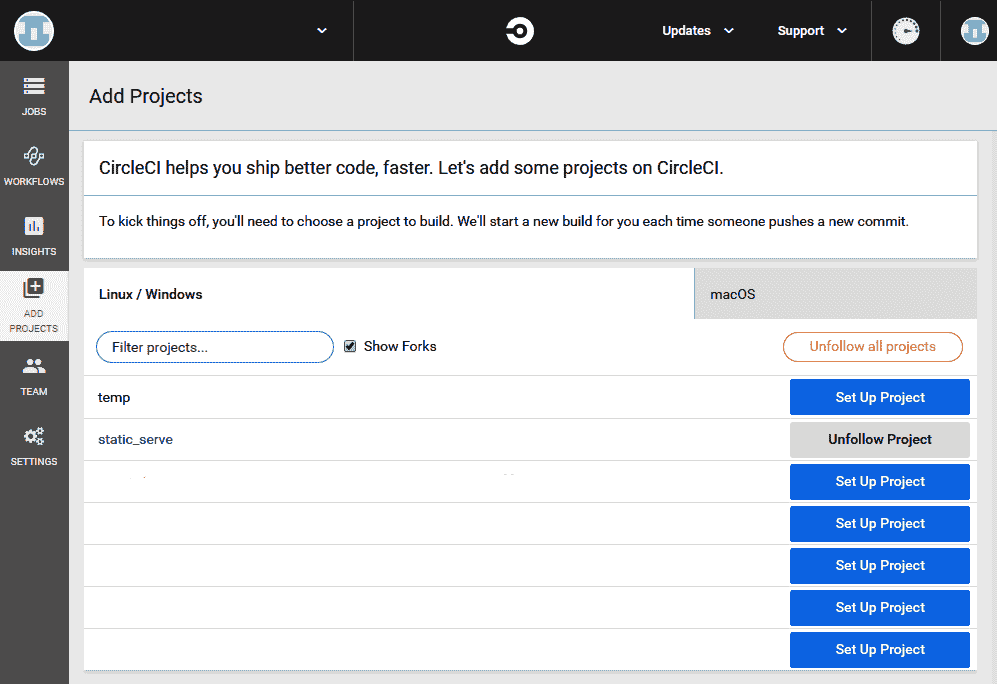
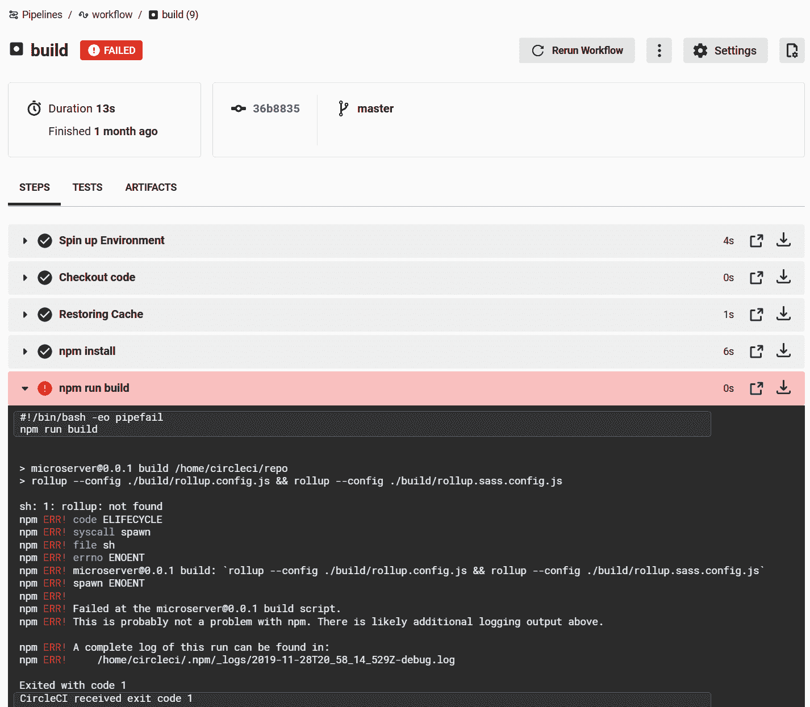

# 第十二章：构建和部署完整的 Web 应用程序

现在我们已经看到了 JavaScript 的服务器端和客户端代码，我们需要专注于另一个完全不同的问题；也就是说，构建我们的代码以进行部署，并将该代码部署到服务器上。

虽然我们在本地运行了我们的服务器，但我们从未在云环境中运行过，比如亚马逊的 AWS 或微软的 Azure。今天的部署不再像 5 年前那样。以前，我们可以通过**文件传输协议**（**FTP**）将我们的应用程序移动到服务器上。现在，即使对于小型应用程序，我们也使用持续部署系统。

在本章中，我们将探讨以下主题：

+   了解 Rollup

+   集成到 CircleCI

这些主题将使我们能够在典型的开发环境中开发几乎任何应用程序并将其部署。到本章结束时，我们将能够为 Web 应用程序实现典型的构建和部署环境。

让我们开始吧。

# 技术要求

对于本章，您将需要以下内容：

+   能够运行 Node.js 的机器

+   一个文本编辑器或 IDE，最好是 VS Code

+   一个 Web 浏览器

+   GitHub 的用户帐户

+   本章的代码可以在[`github.com/PacktPublishing/Hands-On-High-Performance-Web-Development-with-JavaScript/tree/master/Chapter12`](https://github.com/PacktPublishing/Hands-On-High-Performance-Web-Development-with-JavaScript/tree/master/Chapter12)找到。

# 了解 Rollup

RollupJS 是一个构建工具，它允许我们根据环境的不同方式准备我们的应用程序。在它之前有许多工具（Grunt、Gulp），许多工具正在与它竞争（Webpack、Parcel），并且将来还会有许多工具。我们将专注于 RollupJS 用于我们的特定用例（在第九章中构建我们的静态服务器应用程序的实际示例），但请注意，大多数构建工具在其架构方面是相似的。

RollupJS 给我们的是一种在构建生命周期的不同部分具有*钩子*的方式。大多数应用程序在构建过程中具有以下状态：

+   构建开始

+   依赖注入

+   编译

+   编译后

+   构建结束

这些状态在不同的构建系统中可能有不同的名称，并且有些甚至可能不止这些（正如我们将看到的，RollupJS 有），但这是典型的构建系统。

在大多数情况下，我们需要为我们的 JavaScript 应用程序做以下事情：

+   引入我们的 Node/browser 端需要的任何依赖项

+   将我们的 JavaScript 编译为单个文件（如果针对 HTTP/1）或将其编译为较早版本（如果我们针对更广泛的浏览器支持）

+   将 CSS 编译为单个文件，移动图片等

对于我们的应用程序来说，这将非常容易。在这里，我们将学习如何做以下事情：

+   将我们的 Node.js 代码构建成一个单一的可分发文件

+   准备我们的静态资产，如 CSS/图片

+   将 Rollup 添加到我们的 npm 构建流程中

# 将我们的静态服务器构建成一个单一的可分发文件

首先，我们需要创建一个我们准备好使用的文件夹。为此，可以在我们在第九章中工作的文件夹中工作，*实际示例-构建静态服务器*，或者从本书的 GitHub 存储库中拉取代码。然后运行`npm install -g rollup`命令。这将把 rollup 系统放入我们的全局路径，以便我们可以通过运行`rollup`命令来使用命令行。接下来，我们将创建一个配置文件。为此，我们将在我们的目录的基础（与我们的`package.json`文件的确切位置相同）中添加一个`rollup.config.js`文件，并将以下代码添加到其中：

```js
module.exports = {
    input: "./main.js",
    output: {
        file: "./dist/build.js",
        format: "esm"
    }
}
```

我们已经告诉 Rollup 我们应用程序的起点在`main.js`文件中。Rollup 将遵循这个起点并运行它以查看它依赖于什么。它依赖于什么，它将尝试将其放入一个单一的文件中，并在此过程中删除任何不需要的依赖项（这称为 tree-shaking）。完成后，它将文件放在`dist/build.js`中。

如果我们尝试运行这个，我们会遇到一个问题。在这里，我们正在为类使用私有变量，而 Rollup 不支持这一点，以及我们正在使用的 ESNext 的其他特性。我们还需要更改任何在函数外设置成员变量的地方。这意味着我们需要将`cache.js`更改为以下内容：

```js
export default class LRUCache {
    constructor(num=10) {
        this.numEntries = num;
        this.cache = new Map();
    }
}
```

我们还需要替换`template.js`中的所有构造函数，就像我们在`LRUCache`中所做的那样。

在进行了上述更改后，我们应该看到`rollup`对我们感到满意，并且现在正在编译。如果我们进入`dist/build.js`文件，我们将看到它将所有文件放在一起。让我们继续在我们的配置文件中添加另一个选项。按照以下步骤进行：

1.  运行以下命令将最小化器和代码混淆器插件添加到 Rollup 作为开发依赖项：

```js
> npm install -D rollup-plugin-terser
```

1.  安装了这个之后，将以下行添加到我们的`config.js`文件中：

```js
import { terser } from 'rollup-plugin-terser';
module.exports = {
    input: "./main.js",
    output: {
        file: "./dist/build.js",
        format: "esm",
        plugins: [terser()]
    }
}
```

现在，如果我们查看我们的`dist/build.js`文件，我们将看到一个几乎不可见的文件。这就是我们的应用程序的 Rollup 配置所需的全部内容，但还有许多其他配置选项和插件可以帮助编译过程。接下来，我们将看一些可以帮助我们将 CSS 文件放入更小格式的选项，并查看如果我们使用 Sass 会发生什么以及如何将其与 Rollup 编译。

# 将其他文件类型添加到我们的分发

目前，我们只打包我们的 JavaScript 文件，但大多数应用程序开发人员知道任何前端工作也需要打包。例如，以 Sass ([`sass-lang.com/`](https://sass-lang.com/))为例。它允许我们以一种最大程度地实现可重用性的方式编写 CSS。

让我们继续将我们为这个项目准备的 CSS 转换为 Sass 文件。按照以下步骤进行：

1.  创建一个名为`stylesheets`的新文件夹，并将`main.scss`添加到其中。

1.  将以下代码添加到我们的 Sass 文件中：

```js
$main-color: "#003A21";
$text-color: "#efefef";
/* header styles */
header {
    // removed for brevity
    background : $main-color;
    color      : $text-color;
    h1 {
        float : left;
    }
    nav {
        float : right;
    }
}
/* Footer styles */
footer {
    // removed for brevity
    h2 {
        float : left;
    }
    a {
        float : right;
    }
}
```

前面的代码展示了 Sass 的两个特性，使其更容易使用：

+   它允许我们嵌套样式。我们不再需要单独的`footer`和`h2`部分，我们可以将它们嵌套在一起。

+   它允许使用变量（是的，在 CSS 中我们有它们）。

随着 HTTP/2 的出现，一些文件捆绑的标准已经被淘汰。诸如雪碧图之类的项目不再建议使用，因为 HTTP/2 标准增加了 TCP 多路复用的概念。下载多个较小的文件可能比下载一个大文件更快。对于那些感兴趣的人，以下链接更详细地解释了这些概念：[`css-tricks.com/musings-on-http2-and-bundling/`](https://css-tricks.com/musings-on-http2-and-bundling/)。

Sass 还有很多内容，不仅仅是在他们的网站上可以找到的，比如 mixin，但在这里，我们想专注于将这些文件转换为我们知道可以在前端使用的 CSS。

现在，我们需要将其转换为 CSS 并将其放入我们的原始文件夹中。为此，我们将在我们的配置中添加`rollup-plugin-sass`。我们可以通过运行`npm install -D rollup-plugin-sass`来实现。添加了这个之后，我们将添加一个名为`rollup.sass.config.js`的新 rollup 配置，并将以下代码添加到其中：

```js
import sass from 'rollup-plugin-sass';
module.exports = {
    input: "./main-sass.js",
    output: {
        file: "./template/css/main.css",
        format: "cjs"
    },
    plugins: [
        sass()
    ]
}
```

一旦我们制作了我们的 rollup 文件，我们将需要创建我们目前拥有的`main-sass.js`文件。让我们继续做到这一点。将以下代码添加到该文件中：

```js
import main_sass from './template/stylesheets/main.scss'
export default main_sass;
```

现在，让我们运行以下命令：

```js
> rollup --config rollup.sass.config.js 
```

通过这样做，我们将看到模板文件夹内的`css`目录已经被填充。通过这样做，我们可以看到我们如何捆绑一切，不仅仅是我们的 JavaScript 文件。现在我们已经将 Rollup 的构建系统集成到了我们的开发流程中，我们将看看如何将 Rollup 集成到 NPM 的构建流程中。

# 将 rollup 引入 Node.js 命令

现在，我们可以只是让一切保持原样，并通过命令行运行我们的 rollup 命令，但是当我们将持续集成引入我们的流程时（接下来），这可能会使事情变得更加困难。此外，我们可能有其他开发人员在同一系统上工作，而不是让他们运行多个命令，他们可以运行一个`npm`命令。相反，我们希望将 rollup 集成到各种 Node.js 脚本中。

我们在第九章中看到了这一点，*实际示例-构建静态服务器*，使用了`microserve`包和`start`命令。但现在，我们想要集成两个新命令，称为`build`和`watch`。

首先，我们希望`build`命令运行我们的 rollup 配置。按照以下步骤来实现这一点：

1.  让我们清理一下我们的主目录，并将我们的 rollup 配置移动到一个构建目录中。

1.  这两个都移动后，我们将在`package.json`文件中添加以下行：

```js
"scripts": {
        "start": "node --experimental-modules main.js",
        "build": "rollup --config ./build/rollup.config.js && rollup --config ./build/rollup.sass.config.js",
}
```

1.  通过这一举措，我们可以运行`npm run build`，并在一个命令中看到所有内容都已构建完成。

其次，我们想要添加一个 watch 命令。这将允许 rollup 监视更改，并立即为我们运行该脚本。我们可以通过将以下行添加到我们的`scripts`部分中，轻松地将其添加到我们的`package.json`中：

```js
"watch": "rollup --config ./build/rollup.config.js --watch"
```

现在，如果我们输入`npm run watch`，它将以监视模式启动 rollup。通过这样做，当我们对 JavaScript 文件进行更改时，我们可以看到 rollup 自动重新构建我们的分发文件。

在我们进入持续集成之前，我们需要做的最后一个改变是将我们的主入口点指向我们的分发文件。为此，我们将更改`package.json`文件中的 start 部分，使其指向`dist/build.js`：

```js
"start": "node --experimental-modules dist/build.js"
```

有了这个，让我们继续检查一下，确保一切仍然正常运行，通过运行`npm run start`。我们会发现一些文件没有指向正确的位置。让我们通过对`package.json`文件进行一些更改来修复这个问题：

```js
"config": {
    "port": 50000,
    "key": "../selfsignedkey.pem",
    "certificate": "../selfsignedcertificate.pem",
    "template": "../template",
    "bodyfiles": "../publish",
    "development": true
}
```

有了这个，我们应该准备好了！Rollup 有很多选项，当我们想要集成到 Node 脚本系统时，甚至还有更多选项，但这应该让我们为本章的下一部分做好准备，即集成到 CI/CD 流水线中。我们选择的系统是 CircleCI。

# 集成到 CircleCI

正如我们之前提到的，过去几十年里，现实世界中的开发发生了巨大的变化。从在本地构建所有内容并从我们的开发机器部署到复杂的编排和依赖部署树，我们已经看到了一系列工具的崛起，这些工具帮助我们快速开发和部署。

我们可以利用的一个例子是 CI/CD 工具，比如 Jenkins、Travis、Bamboo 和 CircleCI。这些工具会触发各种钩子，比如将代码推送到远程存储库并立即运行*构建*。我们将利用 CircleCI 作为我们的选择工具。它易于设置，是一个易于使用的开发工具，为开发人员提供了一个不错的免费层。

在我们的情况下，这个构建将做以下三件事：

1.  拉取所有项目依赖项

1.  运行我们的 Node.js 构建脚本

1.  将这些资源部署到我们的服务器上，我们将在那里运行应用程序

设置所有这些可能是一个相当令人沮丧的经验，但一旦我们的应用程序连接起来，它就是值得的。我们将利用以下技术来帮助我们进行这个过程：

+   CircleCI

+   GitHub

考虑到这一点，我们的第一步将是转到 GitHub 并创建一个个人资料，如果我们还没有这样做。只需转到[`github.com/`](https://github.com/)，然后在右上角查找注册选项。一旦我们这样做了，我们就可以开始创建/分叉存储库。

由于这本书的所有代码都在 GitHub 上，大多数人应该已经有 GitHub 账户并了解如何使用 Git 的基础知识。

对于那些在 Git 上挣扎或尚未使用版本控制系统的人，以下资源可能会有所帮助：[`try.github.io/`](https://try.github.io/)。

现在，我们需要将所有代码都在的存储库分叉到我们自己的存储库中。要做到这一点，请按照以下步骤进行操作：

1.  转到本书的 GitHub 存储库[`github.com/PacktPublishing/Hands-On-High-Performance-Web-Development-with-JavaScript`](https://github.com/PacktPublishing/Hands-On-High-Performance-Web-Development-with-JavaScript)，并单击右上角的选项，将整个存储库分叉。

如果我们不想这样做，我们可以将存储库克隆到本地计算机。（这可能是更好的选择，因为我们只想要`Chapter12`目录的内容。）

1.  无论我们选择哪种选项，都可以将`Chapter12`目录移动到本地计算机的另一个位置，并将文件夹名称更改为`microserve`。

1.  回到 GitHub，创建一个新的存储库。将其设置为私有存储库。

1.  最后，回到我们的本地机器，并使用以下命令删除已经存在的`.git`文件：

```js
> rf -rf .git
```

对于使用 Windows 的人，如果你有 Windows 10 Linux 子系统，可以运行这些命令。或者，你可以下载 Cmder 工具：[`cmder.net/`](https://cmder.net/)。

1.  运行以下命令，将本地系统连接到远程 GitHub 存储库：

```js
> git init
> git add .
> git commit -m "first commit"
> git remote add origin 
  https://github.com/<your_username>/<the_repository>.git
> git push -u origin master
```

1.  命令行将要求输入一些凭据。使用我们设置个人资料时的凭据。

我们的本地文件应该已经连接到 GitHub。现在我们需要做的就是用 CircleCI 设置这个系统。为此，我们需要在 CircleCI 的网站上创建一个账户。

1.  转到[`circleci.com/`](https://circleci.com/)，点击“注册”，然后使用 GitHub 注册。

一旦我们的账户连接上了，我们就可以登录。我们应该会看到以下屏幕：



1.  点击“设置项目”以设置我们刚刚设置的存储库。

它应该会检测到我们的存储库中已经有一个 CircleCI 文件，但如果我们愿意，我们也可以从头开始。接下来的指示将是为了从头开始设置 CircleCI。为此，我们可以利用他们提供的 Node.js 模板。然而，我们主要需要做的是在`.circleci`目录中创建`config.yml`文件。我们应该有一个基本的东西，看起来像这样：

```js
version: 2
jobs:
  build:
    docker:
      - image: circleci/node:12.13
    working_directory: ~/repo
    steps:
      - checkout
      - restore_cache:
          keys:
            - v1-dependencies-{{ checksum "package.json" }}
            - v1-dependencies-
      - run: npm install
      - save_cache:
          paths:
            - node_modules
          key: v1-dependencies-{{ checksum "package.json" }}
```

CircleCI 配置文件的执行方式如下：

1.  我们声明要使用 Docker 中的`circleci/node:12.13`镜像

我们不会在这里讨论 Docker，但这是许多公司用来部署和托管应用程序的另一种技术。有关这项技术的更多信息可以在这里找到：[`docs.docker.com/`](https://docs.docker.com/)。

1.  我们希望在`~/repo`中运行所有命令。这将是我们几乎所有基本项目的情况。

1.  接下来，我们将该存储库检入到`~/repo`中。

1.  现在，如果我们还没有为这个存储库设置缓存，我们需要设置一个。这样可以确保我们只在需要时才拉取存储库。

1.  我们需要运行`npm install`命令来拉取所有的依赖项。

1.  最后，我们保存缓存。

这个过程被称为持续集成，因为当我们推送代码时，它会不断地为我们运行构建。如果我们想要，我们可以在 CircleCI 配置文件中添加不同的设置，但这超出了本书的范围。当构建完成时，我们还会通过电子邮件收到通知。如果需要，我们可以在以下位置进行调整：[`circleci.com/gh/organizations/<your_user>/settings`](https://circleci.com/gh/organizations/%3cyour_user%3e/settings)。

有了这个，我们已经创建了一个基本的 CircleCI 文件！现在，如果我们转到我们的仪表板，一旦我们推送这个 CircleCI 配置，它应该运行一个构建。它还应该显示我们之前列出的所有步骤。太棒了！现在，让我们连接我们的构建过程，这样我们就可以真正地使用我们的 CI 系统。

# 添加我们的构建步骤

通过我们的 CircleCI 配置，我们可以在流程中添加许多步骤，甚至添加称为 orbs 的东西。Orbs 本质上是预定义的包和命令，可以增强我们的构建过程。在本节中，我们将添加由 Snyk 发布的一个 orb：[`snyk.io/`](https://snyk.io/)。这将扫描并查找当前在 npm 生态系统中存在的不良包。我们将在设置构建后添加这个。

为了让我们的构建运行并打包成我们可以部署的东西，我们将在我们的 CircleCI 配置中添加以下内容：

```js
- run: npm install
- run: npm run build
```

有了这个，我们的系统将会像在本地运行一样构建。让我们继续尝试一下。按照以下步骤进行：

1.  将我们的配置文件添加到我们的`git`提交中：

```js
> git add .circleci/config.yml
```

1.  将此提交到我们的本地存储库：

```js
> git commit -m "changed configuration"
```

1.  将此推送到我们的 GitHub 存储库：

```js
> git push
```

一旦我们这样做，CircleCI 将启动一个构建。如果我们在 CircleCI 中的项目目录中，我们将看到它正在构建。如果我们点击作业，我们将看到它运行我们所有的步骤-我们甚至会看到它运行我们在文件中列出的步骤。在这里，我们将看到我们的构建失败！



这是因为当我们安装 Rollup 时，我们将其安装为全局项目。在这种情况下，我们需要将其添加为`package.json`文件中的开发依赖项。如果我们将其添加到我们的`package.json`文件中，我们应该有一个看起来像这样的`devDependency`部分：

```js
"devDependencies": {
    "rollup-plugin-sass": "¹.2.2",
    "rollup-plugin-terser": "⁵.1.2",
    "rollup-plugin-uglify": "⁶.0.3",
    "rollup": "¹.27.5"
}
```

现在，如果我们将这些文件提交并推送到我们的 GitHub 存储库，我们将看到我们的构建通过了！

通过一个通过的构建，我们应该将 Snyk orb 添加到我们的配置中。如果我们前往[`circleci.com/orbs/registry/orb/snyk/snyk`](https://circleci.com/orbs/registry/orb/snyk/snyk)，我们将看到我们需要设置的所有命令和配置。让我们继续修改我们的`config.yml`文件，以引入 Snyk orb。我们将在构建后检查我们的存储库。这应该看起来像这样：

```js
version: 2.1
orbs:
  snyk: snyk/snyk@0.0.8
jobs:  build:
    docker:
      - image: circleci/node:12.13
    working_directory: ~/repo
    steps:
      - checkout
      - run: npm install   
      - snyk/scan     
      - run: npm run build
```

有了上述配置，我们可以继续提交/推送到我们的 GitHub 存储库，并查看我们的构建的新运行。它应该失败，因为除非我们明确声明要运行它们，否则它不允许我们运行第三方 orbs。我们可以通过前往设置并转到安全部分来做到这一点。一旦在那里，继续声明我们要使用第三方 orbs。勾选后，我们可以进行另一个构建，我们将看到我们再次失败！

我们需要注册 Snyk 才能使用他们的 orb。前往 snyk.io 并使用 GitHub 帐户注册。然后，转到“帐户设置”部分。从那里，获取 API 令牌并转到“设置和上下文”部分。

创建一个新的上下文并添加以下环境变量：

```js
SNYK_TOKEN : <Your_API_Key>
```

为了利用 contexts，我们需要稍微修改我们的`config.yml`文件。我们需要添加一个工作流部分，并告诉它使用该上下文运行我们的构建作业。文件应该看起来像下面这样：

```js
version : 2.1
orbs:
    snyk: snyk/snyk@0.0.8
jobs:
  build:
    docker:
      - image: circleci/node:12.13
    working_directory: ~/repo
    steps:
      - checkout
      - restore_cache:
          keys:
            - v1-dependencies-{{ checksum "package.json" }}
            - v1-dependencies-
      - run: npm install
      - snyk/scan     
      - run: npm run build
      - save_cache:
          paths:
            - node_modules
          key: v1-dependencies-{{ checksum "package.json" }}
workflows:
  version: 2
  build_and_deploy:
    jobs:
      - build:
          context: build
```

有了这个变化，我们可以继续将其推送到远程存储库。我们将看到构建通过，并且 Snyk 将安全扫描我们的包！

上下文的概念是为了隐藏配置文件中的 API 密钥和密码。我们不希望将它们放在配置文件中，因为任何人都可以看到它们。相反，我们将它们放在诸如上下文之类的地方，项目的管理员将能够看到它们。每个 CI/CD 系统都应该有这样的概念，并且在有这样的项目时应该使用它。

随着我们的项目构建和扫描完成，我们所需要做的就是将我们的应用程序部署到一台机器上！

# 部署我们的构建

要部署我们的应用程序，我们需要部署到我们自己的计算机上。有许多服务可以做到这一点，比如 AWS、Azure、Netlify 等等，它们都有自己的部署方式。在我们的情况下，我们将部署到 Heroku。

按照以下步骤操作：

1.  如果我们还没有 Heroku 帐户，我们需要去注册一个。前往[`id.heroku.com/login`](https://id.heroku.com/login)，然后在表单底部选择“注册”。

1.  登录新帐户，然后点击右上角的“新建”按钮。

1.  在下拉菜单中，点击“创建新应用程序”。

1.  我们可以随意给应用程序取任何名字。输入一个应用程序名称。

1.  返回到我们的 CircleCI 仪表板，然后进入设置。创建一个名为“deploy”的新上下文。

1.  添加一个名为`HEROKU_APP_NAME`的新变量。这是我们在*步骤 3*中设置的应用程序名称。

1.  返回 Heroku，点击右上角的用户配置文件图标。从下拉菜单中，点击“帐户设置”。

1.  您应该会看到一个名为“API 密钥”的部分。点击“显示”按钮，然后复制显示的密钥。

1.  返回到我们的 CircleCI 仪表板，并创建一个名为`HEROKU_API_KEY`的新变量。值应该是我们在*步骤 8*中得到的密钥。

1.  在我们的`config.yml`文件中添加一个新的作业。我们的作业应该看起来像下面这样：

```js
version : 2.1
orbs:
  heroku: circleci/heroku@0.0.10
jobs:
  deploy:
    executor: heroku/default
    steps:
      - checkout
      - heroku/install
      - heroku/deploy-via-git:
          only-branch: master
workflows:
 version: 2
 build_and_deploy:
 jobs:
   - build:
       context: build
   - deploy
       context: deploy
       requires:
         - build

```

我们在这里做的是向我们的工作流程中添加了一个新的作业，即`deploy`作业。在这里，第一步是向我们的工作流程中添加官方的 Heroku orb。接下来，我们创建了一个名为`deploy`的作业，并按照 Heroku orb 中的步骤进行操作。这些步骤可以在[`circleci.com/orbs/registry/orb/circleci/heroku`](https://circleci.com/orbs/registry/orb/circleci/heroku)找到。

1.  我们需要将我们的构建部署回 GitHub，以便 Heroku 获取更改。为此，我们需要创建一个部署密钥。在命令提示符中运行`ssh-keygen -m PEM -t rsa -C "<your_email>"`命令。确保不要输入密码。

1.  复制刚生成的密钥，然后进入 GitHub 存储库的设置。

1.  在左侧导航栏中点击“部署密钥”。

1.  点击“添加部署密钥”。

1.  添加一个标题，然后粘贴我们在*步骤 12*中复制的密钥。

1.  勾选“允许写入访问”复选框。

1.  返回 CircleCI，点击左侧导航栏中的项目设置。

1.  点击“SSH 权限”，然后点击“添加 SSH 密钥”。

1.  在*步骤 11*中添加我们创建的私钥。确保在主机名部分添加`github.com`。

1.  添加以下行到我们构建作业的`config.yml`文件中：

```js
steps:
  - add_ssh_keys:
  fingerprints:
 - "<fingerprint in SSH settings>"
```

1.  在构建结束时，添加以下步骤：

```js
- run: git push
```

我们将遇到的一个问题是，我们的应用程序希望通过 HTTPS 工作，但 Heroku 需要专业许可证才能实现这一点。要么选择这个（这是一个付费服务），要么更改我们的应用程序，使其只能使用 HTTP。

通过这样做，我们成功地建立了一个几乎可以在任何地方使用的 CI/CD 流水线。我们还增加了一个额外的安全检查，以确保我们部署的代码是安全的。有了这些，我们就能够构建和部署用 JavaScript 编写的 Web 应用程序了！

# 总结

在本章中，我们学习了如何在利用构建环境（如 RollupJS）的同时构建应用程序。除此之外，我们还学习了如何通过 CircleCI 添加 CI 和 CD。

下一章，也是本书的最后一章，将介绍一个名为 WebAssembly 的高级概念。虽然代码不会是 JavaScript，但它将帮助我们了解如何将我们的 Web 应用程序提升到一个新的水平。
