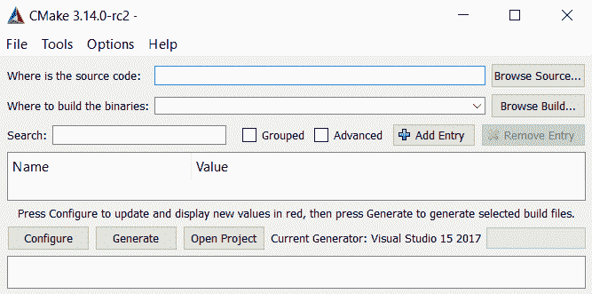
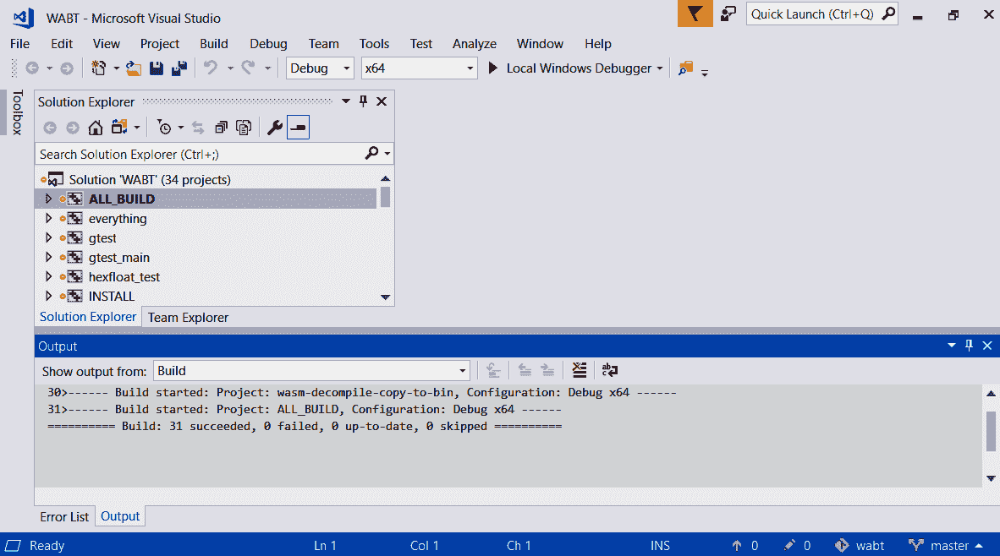
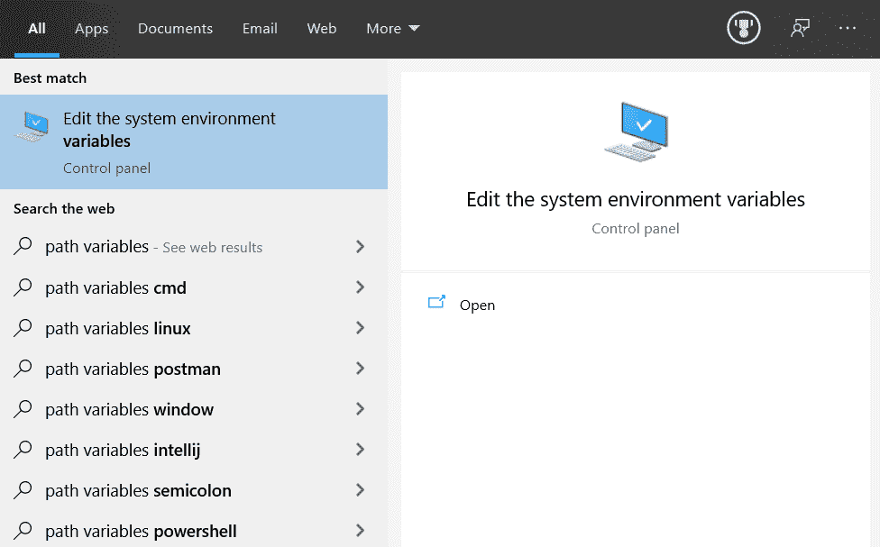
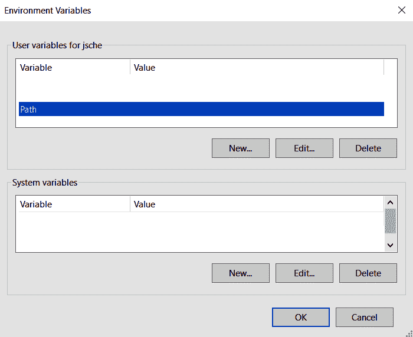

# 第十三章：WebAssembly - 简要了解 Web 上的本地代码

过去的几章都是关于如何在现代网络环境中利用 JavaScript。我们已经看过前端开发、后端开发，甚至通过持续集成和持续部署（CI/CD）构建和部署应用程序。现在，我们要退一步，看看两个可以帮助我们加快本地速度代码开发的主题。

WebAssembly 是 Web 上汇编的规范。汇编是计算机理解的语言的一对一映射。另一方面，WebAssembly 是一个虚拟计算机的一对一映射，可以运行这些指令。在本章中，我们将探讨 WebAssembly 以及如何将本地应用程序移植到浏览器中。

总体上，我们将探讨以下主题：

+   理解 WebAssembly

+   设置我们的环境来编写 WebAssembly

+   编写 WebAssembly 模块

+   移植 C 应用程序

+   查看一个主要应用程序

通过本章结束时，我们应该能够不仅在 WebAssembly 文本格式中开发，还能够在 Web 上使用 C。我们还将能够将二进制 WebAssembly 转换为其文本格式，以便诊断我们移植应用程序可能出现的问题。

# 技术要求

我们需要以下工具来完成本章内容：

+   编辑器，比如 VS Code。

+   在我们的计算机上构建和编译程序。这可能意味着在某些环境中需要管理员权限。

+   本章的代码可以在[`github.com/PacktPublishing/Hands-On-High-Performance-Web-Development-with-JavaScript/tree/master/Chapter13`](https://github.com/PacktPublishing/Hands-On-High-Performance-Web-Development-with-JavaScript/tree/master/Chapter13)找到。

# 理解 WebAssembly

WebAssembly 是一种可以在计算机上运行的指令集规范。在我们的情况下，这台计算机是虚拟的。为了理解这是如何转化为本地速度应用程序以及为什么指令被编写成这样，我们需要基本了解程序在计算机内部是如何运行的。为了理解 WebAssembly，我们将研究以下主题：

+   理解一个基本程序的流程

+   设置我们的环境来编写 WebAssembly 代码

# 理解程序

让我们来看一个非常基本的 C 程序：

```js
#include <stdio.h>
int main() {
   printf("Hello, World!");
   return 0;
}
```

这个程序有一个入口点。在我们的情况下，它是`main`函数。从这里，我们利用了在`stdio`头文件中声明的一个函数（头文件给出了函数声明，这样我们就不必完全导入所有代码到这个文件中）。我们利用`printf`函数将`Hello, World!`打印到控制台，然后我们用`return`和`0`来表示我们有一个成功的程序。

由于我们不会深入讨论我们将要编写的 C/C++代码，对于那些感兴趣的人，一个很好的资源是[`www.learn-c.org/`](https://www.learn-c.org/)。

虽然这是一个我们作为程序员通常理解的程序格式，但它需要被转换成计算机实际理解的格式。这意味着它需要被编译。这个编译过程涉及引入任何外部文件（在这种情况下是`stdio`）并将它们链接在一起。这也意味着我们需要将我们的每个指令转换成一个或多个计算机指令。

一旦链接和编译过程发生，我们通常会得到一个可以被计算机读取的二进制文件。如果我们用一个字节阅读器打开这个文件，我们会看到一堆十六进制数字。这些数字中的每一个对应于我们在文件中放置的指令、数据点等等。

现在，这只是对程序如何转换为计算机理解的东西以及我们创建的二进制代码如何被计算机理解的基本理解。在大多数机器上，程序作为一堆指令和数据运行。这意味着它一次从堆栈顶部拉出一条指令。这些指令可以是任何东西，从将这个数字加载到一个位置，或者将这两个数字加在一起。当它剥离这些指令时，它会丢弃它们。

我们可以将各种数据存储在这个堆栈的本地，或者我们可以在全局级别存储数据。那些存储在堆栈上的数据就是确切地那个——堆栈。一旦那个堆栈被耗尽，我们就再也无法访问那些变量了。

全球的数据被放置在一个叫做**堆**的位置。堆允许我们从系统中的任何地方获取数据。一旦我们的程序的堆栈被耗尽，如果我们的程序仍在运行，那些堆对象可以留在那里。

最后，我们为我们编写的每个函数得到一个堆栈。因为这个原因，我们可以把每个函数当作一个小程序来对待。这意味着它将执行一个任务或一些任务，然后它将被耗尽，我们将回到调用我们的函数的堆栈。当我们耗尽这个堆栈时，我们可以做两件事。我们可以做的第一件事是回到调用我们的函数的堆栈，没有数据。或者，我们可以返回一些数据（这是我们在大多数语言中看到的`return`语句）。

在这里，我们可以通过这两种机制之一共享数据，要么通过从我们的子函数之一返回值，要么通过将我们的结果放到堆上，以便其他人可以访问它们。把它放在堆上意味着它将持续存在于我们的程序的持续时间，但它也需要我们来管理，而如果我们通过堆栈返回值，它将在调用我们的函数耗尽时立即清理。大多数时候，我们将使用简单的数据，并通过堆栈返回它。对于复杂的数据，我们将把它放在堆上。

在我们看 WebAssembly 之前，有一件最后需要知道的事情：如果我们把数据放在堆上，我们需要告诉程序的其他部分在哪里找到这些数据。为了做到这一点，我们传递一个指向该位置的指针。这个指针只是一个地址，告诉我们在哪里找到这些数据。我们将在我们的 WebAssembly 代码中利用这一点。

计算机和程序工作的主题是非常有趣的。对于那些感兴趣的人，最好在社区大学参加正式课程。对于那些喜欢自学的人，以下资源非常有帮助：[`www.nand2tetris.org/`](https://www.nand2tetris.org/)。

现在，让我们设置我们的环境，以便我们可以在 WebAssembly 中编程。

# 设置我们的环境

要在 WebAssembly 中编程，我们需要在我们的机器上获取`wat2wasm`程序。这样做的最佳方法是下载 WebAssembly 程序套件的存储库，并将它们编译为我们的计算机。按照以下步骤来做到这一点：

1.  我们需要在我们的系统上获取一个叫做 CMake 的程序。对于 Linux/OS X，这意味着只需转到[`cmake.org/download/`](https://cmake.org/download/)并运行安装程序。对于那些在 Windows 上的人来说，这会有点冗长。前往[`visualstudio.microsoft.com/vs/`](https://visualstudio.microsoft.com/vs/)并获取 Visual Studio。确保为其获取 C/C++模块。有了 CMake 和 Visual Studio 在我们的机器上，我们现在可以继续并编译 WebAssembly 工具套件。

1.  前往[`github.com/WebAssembly/wabt`](https://github.com/WebAssembly/wabt)并克隆到一个易于访问的位置。

1.  打开 CMake GUI 工具。它应该看起来类似于以下内容：



1.  对于源代码，转到我们从 GitHub 下载的`wabt`文件夹。

1.  二进制文件的位置应该在我们在`wabt`文件夹中创建的`build`目录中。

1.  有了这个，我们可以点击“配置”按钮。这应该会填充屏幕中间的面板。

1.  现在，只需点击“生成”按钮。这应该会生成我们构建应用程序所需的文件。

1.  最后，我们将进入 Visual Studio 并构建项目。

1.  打开 Visual Studio，并从左上角的文件下拉菜单中打开项目。

1.  项目加载后，我们可以点击“构建”。这应该会构建我们在 WebAssembly 中使用的所有二进制文件。屏幕应该看起来像这样：



如果遇到问题，[`github.com/WebAssembly/wabt`](https://github.com/WebAssembly/wabt)存储库中包含了一些关于如何完成构建的优秀文档。前面的说明试图简化构建过程，但是要让这些项目正常运行可能会有一些困难。

现在我们已经构建了我们的二进制文件，让我们确保将它们放在路径上，以便我们可以轻松访问它们。在 Windows 上，我们可以这样做：

1.  转到搜索栏，输入“路径变量”。第一个选项应该允许我们设置环境变量：



1.  点击右下方的“环境变量...”选项：


1.  对于底部的框，找到路径变量并点击编辑...：



1.  点击“新建”，找到存放所有二进制文件的目录：


完成后，我们应该能够在命令行中输入`wat2wasm`并获取工具的帮助文档。现在，我们可以将 WebAssembly 的文本格式编译成浏览器期望的格式！

现在我们已经将 WebAssembly 二进制工具包添加到系统中，并且可以编译/反编译 WebAssembly 程序，让我们开始编写我们的第一个 WebAssembly 程序！

# 编写 WebAssembly 模块

WebAssembly 模块类似于 JavaScript 模块。我们需要明确地从其他 WebAssembly/JavaScript 模块中导入我们需要的任何内容。我们在 WebAssembly 模块中编写的任何内容，除非我们明确导出它，否则其他 WebAssembly 模块无法找到。我们可以将其视为 JavaScript 模块 - 它是一个沙盒环境。

让我们从 WebAssembly 模块的最基本和无用版本开始：

```js
(module)
```

有了这个，我们可以转到命令行并运行以下命令：

```js
> wat2wasm useless.wat
```

这段代码将生成一个带有`wasm`扩展名的文件。这是我们需要传递到 Web 浏览器以运行 WebAssembly 的文件。所有这些都告诉我们，WebAssembly 和 JavaScript 的 ESNext 一样，希望在模块中声明所有内容。更容易将其视为在 JavaScript 中加载时发生的情况：

```js
<script type="module"></script>
```

这意味着在 WebAssembly 上下文中加载的所有代码都不能溢出到我们设置的其他 WebAssembly 模块中。现在，要将此`wasm`文件加载到我们的浏览器中，我们需要利用第九章中使用的静态服务器，*实际示例 - 构建静态服务器*。

加载完毕后，按照以下步骤进行：

1.  创建一个基本的`index.html`文件，如下所示：

```js
<!DOCTYPE html>
<html>
    <head></head>
    <body>
        <script type="text/javascript">
        </script>
 </body>
</html>
```

1.  在我们的`script`元素中，我们将添加以下代码来加载模块：

```js
WebAssembly.instantiateStreaming(fetch('useless.wasm')).then(obj => {
    // nothing here
});
```

我们已经将我们的第一个 WebAssembly 模块加载到浏览器中。API 非常基于 Promise，因此我们需要利用 Fetch 接口。一旦我们获取了对象，它就加载到浏览器的 WebAssembly 上下文中，这意味着我们可以使用这个对象。这就是我们刚刚加载的 WebAssembly 模块！

让我们继续制作一个更有用的 WebAssembly 模块。让我们输入两个数字并将它们相加。按照以下步骤进行：

1.  创建一个名为`math.wat`的文件。

1.  将以下代码放入文件中：

```js
(module
    (func $add (param $p1 i32) (param $p2 i32) (result i32)
        local.get $p1
        local.get $p2
        i32.add
    )
    (export "add" (func $add))
)
```

1.  通过运行`wat2wasm math.wat`来编译。

1.  将新的`wasm`文件加载到浏览器中，并在`then`体中添加以下内容：

```js
console.log(obj.instance.exports.add(100,200));
```

1.  确保静态服务器正在运行，方法是进入文件夹并运行`static-server`命令。

对于那些直接跳到这一章的人，你可以通过运行`npm install -g static-server`来安装一个静态服务器。这将在全局安装这个静态服务器。然后，我们只需要在要部署文件的文件夹中运行`static-server`。现在我们已经做到了这一点，我们可以通过访问`localhost:9080`来打开我们的`index.html`文件。

如果我们打开浏览器，转到`localhost:9080`，并打开控制台，我们会看到数字 300 已经被打印出来。我们刚刚编写了我们的第一个可访问的 WebAssembly 模块！

让我们回顾一下我们在前面的代码中涵盖的一些概念。首先，我们定义了一个函数。我们声明这个函数的名称是`$add`（在 WebAssembly 中，所有变量都以美元符号开头）。然后，我们声明它将接受两个我们称为`$p1`和`$p2`的参数。最后，我们将输出一个结果；也就是一个 32 位整数。

现在，我们将两个参数存储在我们的堆栈上。最后，我们将它们相加并将其作为结果。还记得本章开头我们谈到程序是堆栈的吗？这展示了完全相同的概念。我们将两个变量加载到堆栈上。我们弹出它们，以便我们可以在`add`函数中使用它们，这将在堆栈上放置一个新值。最后，我们从堆栈中弹出该值，并将其返回给主函数体；在我们的情况下，是模块。

接下来，我们导出了这个函数，以便我们的 JavaScript 代码可以访问它。这确保了我们的 WebAssembly 代码被保存在我们的沙盒中，就像我们想要的那样。现在，正如我们之前提到的，返回的对象是 WebAssembly 上下文。我们获取实例并查看可用的导出项。在我们的情况下，这是`add`函数，现在我们可以在我们的 JavaScript 代码中使用它。

现在我们已经学会了如何将 WebAssembly 模块导出到 JavaScript 上下文中，你可能会想知道我们是否可以将 JavaScript 函数加载到 WebAssembly 上下文中。我们可以！让我们继续向我们的`index.html`文件中添加以下代码：

```js
const add = function(p1, p2) {
    return p1 + p2;
}
const importObject = { math : { add : add }};
WebAssembly.instantiateStreaming(fetch('math.wasm'), importObject).then(obj => {
    console.log(obj.instance.exports.add(100, 200));
    console.log(obj.instance.exports.add2(100, 200));
});
```

在这里，我们加载了从 JavaScript 上下文中获取的`add`函数，并创建了一个具有与 JavaScript 中`add`函数相同函数签名的关联函数。现在，我们创建了一个新的`add`函数称为`$add2`，具有类似的签名。我们将两个参数放入堆栈中并使用新的`call`指令。这个指令允许我们调用在我们上下文中声明的其他函数：

```js
(func  $add2 (param  $p1  i32) (param  $p2  i32) (result  i32)
  local.get $p1
  local.get $p2
  call  $externalAdd )
```

最后，我们导出这个函数，就像我们之前对`add`函数做的那样。现在，如果我们编译我们的代码，回到浏览器，重新加载页面，我们会看到数字 300 被打印出两次。

现在，我们知道如何在 JavaScript 中使用 WebAssembly 函数，以及如何将 JavaScript 函数加载到 WebAssembly 中。我们即将能够编写一个在 JavaScript 编程面试中经常被问到的程序。不过，在这之前，我们需要看一下堆空间和在 JavaScript 和 WebAssembly 之间利用内存。

# 在 WebAssembly 和 JavaScript 之间共享内存

到目前为止，我们一直在处理 WebAssembly 中的一种变量类型。这些被称为本地变量，或者堆栈变量。还有另一种类型，它将允许我们不仅在 WebAssembly 上下文中使用它们，还可以在 JavaScript 和 WebAssembly 之间共享它们。但首先，我们需要讨论堆栈和堆之间的区别。

全局/局部变量和堆/栈之间存在差异。现在，我们将保持简单，将全局变量视为在堆上，将局部变量视为在栈上。稍后，我们的应用程序将具有不在堆上的全局状态，但最好尝试将局部等同于栈，全局等同于堆的概念。

当我们谈论程序在典型计算机上运行时，我们谈到了堆栈。最好的想法是将其视为一堆木头。我们总是从顶部取出，总是从顶部添加。这在编程中也是一样的。我们在堆栈顶部添加，然后从顶部取出这些项目。例如，让我们看看我们创建的`add`函数。

我们抓取了两个参数并将它们添加到堆栈中。首先是参数一，然后是参数二。当我们调用`$externalAdd`，甚至是调用内置在 WebAssembly 中的`add`函数时，它会从堆栈中取出这两个项目，并用一个项目替换它们，即结果。当我们从函数返回时，我们会从本地函数堆栈中取出该项目，并将其弹出到调用我们的上下文的堆栈顶部。

堆就像其名字所暗示的那样。我们有一堆可以从任何地方抓取、更改和替换的东西。任何人都可以访问堆，向其中放入项目并从中读取。就像一堆衣服一样 - 我们可以搜索并找到我们需要的项目，或者我们可以在一天结束时向其中添加项目。

两者之间的主要区别在于栈会被清理。一旦函数返回，我们在其中创建的任何变量都会被清理。另一方面，堆会一直存在。由于任何人都可以访问它，我们必须明确地摆脱它；否则，它将永久存在。在垃圾收集环境中，最好的想法是，我们的环境不知道谁还在上面放了东西，所以它不知道什么需要清理，什么不需要清理。

在 WebAssembly 中，我们没有垃圾收集环境，因此我们必须在 JavaScript 或 WebAssembly 上下文中完成后重新收集堆。在我们的示例中，我们不会这样做，因此请注意这是我们在生产环境中想要做的事情。为此，我们可以将 JavaScript 中的`memory`对象设置为`null`。这将让垃圾收集器知道没有人再使用它了。

让我们学习如何在 JavaScript 和 WebAssembly 之间共享内存，以及这如何等同于堆。按照以下步骤进行：

1.  创建一个名为`sharing_resources.wat`的文件。

1.  将以下代码放入文件中：

```js
(module
   (import "js" "mem" (memory 1))
    (func $storeNumber
        (i32.store (i32.const 0) (i32.const 100))
    )
    (func $readNumber (result i32)
        (i32.load (i32.const 0))
    )
    (export "readNumber" (func $readNumber))
    (export "storeNumber" (func $storeNumber))
)
```

我们的第一个函数将数字`100`存储在内存位置`0`。如果我们要存储任意数量的数据，我们必须让调用我们的人知道我们存储了多少。但是，在这种情况下，我们总是知道只有一个数字。

我们的`read`函数只是从内存中读取该值并将其作为一个值返回。

1.  我们在`index.html`文件中的脚本部分应该如下所示：

```js
const memory = new WebAssembly.Memory({initial : 1});
const importObject = { js: {mem: memory}};
WebAssembly.instantiateStreaming(fetch('sharing_resources.wasm'), importObject).then(obj => {
    obj.instance.exports.storeNumber();
    console.log(obj.instance.exports.readNumber());
});
```

顶部部分应该看起来不同。首先，我们正在创建一个 JavaScript 和 WebAssembly 都可以共享的内存块。我们将只创建和加载一个内存块。在 WebAssembly 的上下文中，这是 64KB 的数据。

一旦我们的 WebAssembly 加载完成，我们存储该数字，然后读取它。现在，我们可以看到我们在 WebAssembly 中有一个全局状态，但是我们如何与 JavaScript 共享呢？好吧，代码的起始部分告诉了我们如何做。我们可以访问内存对象，所以我们应该能够获取它。让我们继续改变我们的脚本，以便我们可以直接在 JavaScript 中读取内存，而不是调用一个为我们执行此操作的函数。

以下代码应该可以做到这一点：

```js
function readNumber() {
    const bytes = new Uint32Array(memory.buffer, 0, 1);
    console.log('The number that was put here is:', bytes[0]);
}
```

现在，我们可以在 WebAssembly 加载完成后将其添加到 body 中：

```js
obj.instance.exports.storeNumber();
readNumber();
```

如果我们查看控制台，我们应该看到完全相同的输出！最后的测试是从 JavaScript 中存储一些东西并在 WebAssembly 中抓取它。我们可以通过将脚本更改为以下内容来实现这一点：

```js
const memory = new WebAssembly.Memory({initial : 1});
const storeByte = new Int32Array(memory.buffer, 0, 1);    
storeByte[0] = 200;
const importObject = {js: {mem: memory}};
WebAssembly.instantiateStreaming(fetch('sharing_resources.wasm'), importObject).then(obj => {
    console.log(obj.instance.exports.readNumber());
});
```

如果我们保存这个并返回到控制台，我们应该看到数字 200 被打印出来！

现在，我们知道如何在两个实例之间共享内存，以及如何利用这一点来做一些很酷的事情。让我们继续测试我们所有的技能，并创建每个程序员最喜欢的程序：FizzBuzz。

# 在 WebAssembly 中编写 FizzBuzz

FizzBuzz 是一个编程挑战，要求用户输入一个正数循环从 1 到一个选择的数字，并根据以下标准打印结果：

+   如果数字可以被 3 整除，则打印*Fizz*

+   如果数字可以被 5 整除，则打印*Buzz*

+   如果数字可以被 15 整除，则打印*FizzBuzz*

让我们继续准备我们的 JavaScript 环境。以下代码应该看起来很熟悉，除了我们的新日志函数：

```js
const memory = new WebAssembly.Memory({initial : 1});
const storeByte = new Int32Array(memory.buffer, 0, 1);   
function consoleLogString(offset, length) {
    const bytes = new Uint8Array(memory.buffer, offset, length);
    const string = new TextDecoder('utf8').decode(bytes);
    console.log(string);
}
const importObject = { console: {log: consoleLogString}, js: {mem: memory}};
WebAssembly.instantiateStreaming(fetch('fizzbuzz.wasm'), importObject).then(obj => {
    //obj.instance.exports.fizzbuzz(10);
});
```

此函数接受内存偏移和数据长度，并将其打印出来。正如我们之前提到的，我们需要知道数据在哪里以及其长度，才能从堆中读取它。现在，我们可以进入程序的核心。按照以下步骤操作：

1.  创建一个名为`fizzbuzz.wat`的新文件。

1.  我们知道我们需要导入我们的内存和`console`函数，就像我们一直在导入其他函数一样。我们还知道我们将创建一个名为`fizzbuzz`的函数，并将其导出，以便我们的 JavaScript 上下文可以利用它：

```js
(module
    (import "console" "log" (func $log (param i32 i32)))
    (import "js" "mem" (memory 1))
    (global $g (mut i32) (i32.const 0))
    (func $fizzbuzz (param $p i32)
        ;; content of the function
    )

    (export "fizzbuzz" (func $fizzbuzz))
)
```

前面代码的唯一有趣的部分是`global`部分。这是一个全局变量，可以被视为我们上下文的堆栈。它不在堆上，因此 JavaScript 上下文无法访问它。我们还可以看到声明前面的`mut`关键字。这告诉我们我们将从 WebAsembly 代码的各个部分更改全局变量。我们将利用这一点，使其保存我们的打印输出的长度。

1.  我们需要检查 FizzBuzz 的两种情况：

```js
(func $checkFizz (param $p1 i32))
(func $checkBuzz (param $p1 i32))
```

我们的两个函数都将接受一个数字。对于`checkFizz`函数，我们将测试它是否可以被 3 整除。如果可以，我们将在内存堆中存储单词*Fizz*，然后更新该全局变量为*Fizz*之后的位置。对于*Buzz*，我们将做完全相同的事情，只是我们将测试数字是否可以被 5 整除。如果是`true`，我们将在全局指针位置放置*Buzz*并更新它。

以下是`checkFizz`函数：

```js
local.get $p1
i32.const 3
i32.rem_s
(if (i32.eq (i32.const 0))
    (then
        (i32.store8 (global.get $g) (i32.const 70))
        (i32.store8 (i32.add (global.get $g) (i32.const 1)) 
         (i32.const 105))
        (i32.store8 (i32.add (global.get $g) (i32.const 2)) 
         (i32.const 122))
        (i32.store8 (i32.add (global.get $g) (i32.const 3)) 
         (i32.const 122))
        (global.set $g (i32.add (global.get $g) (i32.const 4)))
    )
)
```

在这里，我们获取传入的数字。然后，我们将`3`放在堆栈上并运行余数函数。如果结果等于`0`，那么我们将单词*Fizz*放入内存中。现在，放入内存的内容可能看起来不像单词*Fizz*，但是如果我们查看每个字母的 UTF8 十进制数，我们将看到这就是我们放入内存的内容。

如果我们回到 JavaScript 代码，我们会看到我们正在使用`TextDecoder`。这允许我们读取这些字节值并将它们转换为它们的字符串等价物。由于 WebAssembly 只理解整数和浮点数的概念，这是我们现在必须处理它的方式。

接下来是`checkBuzz`函数。它应该与前面的代码类似，除了可被`5`整除：

```js
(func $checkBuzz (param $p1 i32)
    local.get $p1
    i32.const 5
    i32.rem_s
    (if (i32.eq (i32.const 0))
        (then
            (i32.store8 (global.get $g) (i32.const 66))
            (i32.store8 (i32.add (global.get $g) (i32.const 1)) 
             (i32.const 117))
            (i32.store8 (i32.add (global.get $g) (i32.const 2)) 
             (i32.const 122))
            (i32.store8 (i32.add (global.get $g) (i32.const 3)) 
             (i32.const 122))
            (global.set $g (i32.add (global.get $g) (i32.const 4)))
        )
    )
)
```

1.  现在，我们可以编写`fizzbuzz`。我们将接受整数，然后从`1`到该值运行我们的`checkFizz`和`checkBuzz`函数：

```js
(func $fizzbuzz (param $p i32)
    (local $start i32)
    (local.set $start (i32.const 1))
    (block
        (loop
            (call $checkFizz (local.get $start))
            (call $checkBuzz (local.get $start))
            (br_if 1 (i32.eq (local.get $start) (local.get $p)))
            (local.set $start (i32.add (local.get $start) 
            (i32.const 1)))
            (br 0)
        )
    )
    i32.const 0
    global.get $g
    call $log
)
```

循环非常简单。`br_if`测试我们的`start`变量是否等于我们输入的值。如果是，它将等于`1`，并且将退出循环。否则，它将递增`start`变量一次。`(br 0)`是保持循环进行的部分。

完成循环后，我们将得到我们的全局变量，无论它最终在哪里，然后调用`log`函数。让我们编译并运行以下测试：

```js
obj.instance.exports.fizzbuzz(10);
```

通过这样做，我们应该得到以下输出：

```js
FizzBuzzFizzFizzBuzz
```

我们刚刚在纯 WebAssembly 中编写了一个非平凡的程序！到目前为止，您应该已经意识到为什么大多数人不会纯粹地编写 WebAssembly，因为本应该是一个简单的程序却花了我们相当多的代码。

在下一节中，我们将学习如何使用更高级的语言 C 来为 Web 编写程序。

# 为 Web 编写 C/C++

到目前为止，我们已经研究了编写 WebAssembly 的低级指令语言。虽然这可能是一个有趣的练习，但我们大多数项目的规模会更大，我们希望利用高级语言来实现我们的目标。虽然有一些类似于 JavaScript 的语言会编译成 WebAssembly（[`github.com/AssemblyScript/assemblyscript`](https://github.com/AssemblyScript/assemblyscript)），但大部分模块将使用 C、C++或 Rust 等系统语言编写。在本节中，我们将研究为浏览器编写 C/C++代码。

Rust 语言（[`www.rust-lang.org/`](https://www.rust-lang.org/)）为我们提供了一个比 C/C++更安全的选择。虽然长远来看使用它可能更好，但我们将坚持使用 C/C++，因为在可预见的未来，我们将广泛地将其编译为 WebAssembly，因为大多数程序目前都是用它编写的。

为了开始我们的 C/C++写作之旅，我们需要获取 Emscripten SDK 来编译为 WebAssembly。这可以在[`emscripten.org/index.html`](https://emscripten.org/index.html)找到。我们将主要遵循 Emscripten 提供的*入门*指南。按照以下步骤：

1.  首先，我们将克隆 Emscripten SDK，运行以下命令：

```js
> git clone https://github.com/emscripten-core/emsdk.git
```

1.  使用以下命令进入目录：

```js
> cd emsdk
```

1.  拉取最新更改和以下命令：

```js
> git pull
> emsdk latest install
> emsdk activate latest
> emsdk_env.bat
```

现在我们有了前面的命令来帮助我们，我们准备开始为 Web 编写 C 和 C++！让我们开始一个简单的模块：

```js
#include <stdio.h>
int main() {
   printf("Hello, World!\n");
   return 0;
}
```

这个基本的 C 程序是大家最喜欢的 Hello World 程序。要编译这个程序，请运行以下命令：

```js
> emcc hello_world.c
```

如果一切安装正确，我们应该得到以下两个文件：

+   `a.out.wasm`

+   `a.out.js`

有了这两个文件，我们可以利用一个`index.html`文件并加载它们，就像这样：

```js
<!DOCTYPE html>
<html>
    <head>    
    </head>
    <body>
        <script type="text/javascript" src="a.out.js"></script>
    </body>
</html>
```

我们应该在控制台上得到一个**Hello World!**的输出！让我们继续编写另一个 C 程序，就像我们之前写的 WebAssembly 程序一样 - FizzBuzz：

```js
#include <stdio.h>
void fizzbuzz(int num) {
    for(int i = 1; i <= num; i++) {
        if(i%3 == 0) {
            printf("Fizz");
        }
        if(i%5 == 0) {
            printf("Buzz");
        }
    }
    printf("\n");
}
```

如果我们编译并尝试运行它，我们会发现什么也找不到。文档说明应该在全局`Module`变量上，但如果我们检查那里，我们会发现没有`fizzbuzz`程序。幸运的是，Emscripten 为我们进行了死代码分析，并注意到我们的 C 程序没有`main`函数，也没有调用`fizzbuzz`函数，因此将其消除了。

为了处理这个问题，我们可以在`emcc`调用中添加一个参数：

```js
> emcc -s "EXPORTED_FUNCTIONS=['_fizzbuzz']" fizzbuzz.c
```

我们所有的函数都会在它们之前加上下划线。这有助于我们和系统区分在 JavaScript 系统中可能创建的内容和在 C/C++上下文中创建的内容。

有了这个，我们可以进入浏览器和我们的开发者控制台，输入以下内容：

```js
Module._fizzbuzz(10);
```

我们应该看到一个输出！我们刚刚编译了我们的第一个可以在 JavaScript 代码中使用的来自 C 的库函数。现在，如果我们想尝试一些更困难的东西怎么办？如果我们想在我们的 C/C++代码中运行一个 JavaScript 函数怎么办？

为了做到这一点，我们将不得不执行以下操作：

1.  我们需要在文件顶部放置一个`extern`声明（Emscripten 首先会在 JS 位置查找，但我们也可以传递一个命令行标志来告诉它在其他地方查找）：

```js
#include <stdio.h>
extern int add(int, int);
int main() {
    printf("%d\n", add(100, 200));
    return 1;
}
```

1.  接下来，我们将创建一个名为`external.js`的文件，用来存放我们的新函数：

```js
mergeInto(LibraryManager.library, {
    add: function(x, y) {
        return x + y;
    }
});
```

1.  现在，我们可以用以下代码行来编译我们的程序：

```js
> emcc -s extern.c --js-library external.js
```

之后，我们可以回到浏览器，看到它打印出了 300！现在，我们知道如何在我们的 C/C++程序中使用外部 JavaScript，并且可以从浏览器中获取我们的 C/C++代码。

一直以来，我们一直在覆盖我们的文件，但是有没有其他方法来处理这个问题呢？当然有 - 我们可以使用`emcc -o <file_name.js>`命令来调用`emcc`系统。因此，我们可以通过运行以下命令来编译我们的`extern.c`文件并将其命名为`extern.js`：

```js
> emcc --help
```

或者，我们可以去他们的网站：[`emscripten.org/`](https://emscripten.org/)。

现在我们能够为我们的浏览器编写和编译 C 代码，我们将把注意力转向利用这一功能。让我们实现一个海明码生成器，我们可以在 JavaScript 中使用，它是用 C 编写的，并且可以编译成 WebAssembly。

# 编写海明码生成器

现在，我们将要编写一段复杂的软件。海明码生成器创建了一段数据，当它在两个媒介之间传输时应该能够被恢复。这些媒介可以是任何东西，从计算机到另一个计算机，甚至是一个进程到另一个进程（尽管我们希望进程之间的数据传输不会被损坏）。我们将要添加的数据被称为海明码。

为了编写这个软件，我们需要了解海明码是如何生成的，以及我们如何使用验证器来确保从一个媒介传输到另一个媒介的数据是正确的。具体来说，我们将研究海明数据的创建和验证过程。我们不会研究数据的恢复，因为这与创建数据的过程几乎相反。

为了理解海明数据是如何创建的，我们需要查看位级别的数据。这意味着如果我们想要传输数字 100，我们需要知道它在位上是什么样子的。位是计算机的最低数据单元。一个位只能是 0 或 1。当我们将更多的位加在一起时，它们代表 2 的幂。以下的表格应该有助于展示这一点：

| **位 3** | **位 2** | **位 1** | **位 0** |
| --- | --- | --- | --- |
| 8 | 4 | 2 | 1 |
| 2³ | 2² | 2¹ | 2⁰ |

正如我们所看到的，每个位位置代表下一个 2 的幂。如果我们混合和匹配这些位，我们会发现我们可以表示所有正实数。还有一些方法可以表示负数甚至浮点数，但我们在这里不会涉及到这些。

对于那些好奇的人，关于浮点表示的文章可以在这里找到：[`www.cprogramming.com/tutorial/floating_point/understanding_floating_point_representation.html.`](https://www.cprogramming.com/tutorial/floating_point/understanding_floating_point_representation.html)

因此，如果我们想要以二进制形式看到这些数字，我们可以一个一个地查看它们。下表显示了左边的十进制表示和右边的二进制表示（十进制是我们习惯的）：

| 0 | 0000 |
| --- | --- |
| 1 | 0001 |
| 2 | 0010 |
| 3 | 0011 |
| 4 | 0100 |
| 5 | 0101 |
| 6 | 0110 |
| 7 | 0111 |
| 8 | 1000 |

希望这样能澄清位和二进制表示是如何工作的。现在，我们将继续讲解海明码的实际工作原理。海明码通过在数据传输过程中的特定位置添加所谓的奇偶校验位来工作。这些奇偶校验位将根据我们选择的奇偶校验类型，要么是 1，要么是 0。

我们可以选择的两种奇偶校验类型是偶校验和奇校验。偶校验意味着当我们为奇偶校验位的所有位位置相加时，它们需要是偶数。如果我们选择奇校验，我们需要为奇校验位置的所有位进行相加，并检查它们是否是奇数。现在，我们需要决定哪些位对应于每个奇偶校验位位置，甚至奇偶校验位的位置。

首先，我们将看看奇偶校验位放在哪里。奇偶校验位将位于每个 2 的幂的位置。就像我们在前面的表格中看到的那样，我们将在以下位位置放置我们的奇偶校验位：1、2、4、8 和 16。如果我们看前面的表格，我们会注意到这些对应于只有一个位设置的位。

现在，我们需要决定哪些数据位位置对应于我们的奇偶校验位位置。嗯，我们可以根据奇偶校验位的位置猜测这些位置。对于每个数据位，我们将查看它们是否在相应的奇偶校验位设置了。这可以在以下表格中看到：

| **数字（十进制格式）** | **它是奇偶校验位吗？** | **使用此数据的奇偶校验位** |
| --- | --- | --- |
| 1 | 是 | N/A |
| 2 | 是 | N/A |
| 3 | 否 | 1, 2 |
| 4 | 是 | N/A |
| 5 | 否 | 1, 4 |
| 6 | 否 | 2, 4 |
| 7 | 否 | 1, 2, 4 |
| 8 | 是 | N/A |

我们需要知道的最后一件事是如何将我们的数据与奇偶校验数据相结合。最好的方法是通过一个例子来看。让我们以数字 100 为例，并将其转换为二进制表示。我们可以手工完成这项工作，或者我们可以打开程序员计算器，大多数操作系统都有。

如果我们打开计算器并输入 100，我们应该得到它的以下二进制表示：1100100。现在，为了添加我们的奇偶校验位，我们需要根据我们是否在那里放置奇偶校验位来移动我们的数据位。让我们一步一步地来：

1.  第一位是否用作奇偶校验位？是的，所以我们将在那里放置一个 0，并将我们的数据向左移动一次。现在我们有 11001000。

1.  第二位是否用作奇偶校验位？是的，所以我们将在那里放置一个 0，并将我们的数据向左移动一次。现在我们有 110010000。

1.  第三位是否用作奇偶校验位？否，所以我们可以把我们原来的第一个数据位放在那里，即 0。我们的数据看起来和以前一样：110010000。

1.  第四位是否用作奇偶校验位？是的，所以我们将在那里放置一个 0，并将我们的数据向左移动一次。现在我们有 1100100000。

1.  第五位是否用作奇偶校验位？否，所以我们将把我们原来的第二个数据位放在那里，即 0。我们的数据看起来和以前一样：1100100000。

1.  第六位是否用作奇偶校验位？否，所以我们将把我们原来的第三个数据位放在那里，即 1。我们的数据看起来和以前一样：1100100000。

1.  第七位是否用作奇偶校验位？否，所以我们将把我们原来的第四个数据位放在那里，即 0。我们的数据看起来如下：1100100000。

1.  第八位是否用作奇偶校验位？是的，所以我们将把我们的数据向左移动一位，并在那里放置一个零。我们的数据如下：11000100000。

对于其余的数字，它们保持不变，因为我们没有更多的奇偶校验位要放置。现在我们有了我们的数据，我们必须设置我们的奇偶校验位。我们将在我们的示例和代码中使用偶校验。以下表格展示了最终数字以及我们必须将奇偶校验位设置为 1 或零的原因：

| **位位置** | **该位置的二进制** | **我们是否设置它？** | **奇偶校验的计数** |
| --- | --- | --- | --- |
| 1 | 00001 | 是 | 1 |
| 1 | 00010 | 是 | 3 |
| 0 | 00011 | N/A |  |
| 1 | 00100 | 是 | 1 |
| 0 | 00101 | N/A |  |
| 1 | 00110 | N/A |  |
| 0 | 00111 | N/A |  |
| 0 | 01000 | 否 | 2 |
| 0 | 01001 | N/A |  |
| 1 | 01010 | N/A |  |
| 1 | 01011 | N/A |  |

如前表所示，我们需要为 1、2 和 4 位置设置奇偶校验位。让我们看看第二位并经历这个过程。我们将寻找任何二进制表示中第二位设置的位位置。如果位在该位置被设置，我们将对其进行计数。在将所有这些数字相加后，如果它们相加得到奇数，我们需要设置奇偶校验位位置。对于第二位，我们可以看到 6、10 和 11 位置的数字有第二位设置，并且它们有一个 1。这就是为什么我们有三个计数，这意味着我们需要设置奇偶校验位以确保我们有偶校验。

这是很多信息要消化，重新阅读前面的部分可能有助于理解我们是如何得到最终的奇偶校验数的。如果想了解更多，请访问[`www.geeksforgeeks.org/hamming-code-in-computer-network/`](https://www.geeksforgeeks.org/hamming-code-in-computer-network/)。

现在，理论都讲完了，让我们开始编写 C 程序，能够创建奇偶校验数据并进行验证。

首先，让我们创建一个名为`hamming.c`的文件。我们将把它创建为一个纯库文件，所以我们不会有`main`函数。现在，让我们先梳理一下我们的函数，以便了解我们想要做什么。按照以下步骤进行：

1.  为了创建我们的数据，我们需要读取数据并将数据位移动到正确的位置，就像我们之前做的那样。让我们称这个函数为`placeBits`：

```js
void placeBits(int data, int* parity) {
}
// creation of true data point with parity bits attached
int createData(int data) {
    int num = 0;
    placeBits(data, &num);
    return num;
}
```

我们可以看到`placeBits`函数的方法签名有一些有趣。它接受一个`int*`。对于 JavaScript 开发人员来说，这将是一个新概念。我们传递的是数据的位置，而不是数据本身。这被称为按引用传递。现在，这个想法与 JavaScript 中的情况类似；也就是说，如果我们传递一个对象，我们传递的是对它的引用。这意味着当我们对数据进行更改时，我们将在原始函数中看到这些更改。这与前面的概念相同，但我们对此有更多的控制。如果我们不按引用传递，它将按值传递，这意味着我们会得到前面数据的副本，并且我们不会看到在`createData`函数中反映出的更改。

1.  现在，我们需要一个函数来确定我们是否为该位置设置了奇偶校验位。我们将称之为`createParity`。它的方法签名应该是这样的：

```js
void createParity(int* data) 
```

再次，我们传递的是数据的引用，而不是数据本身。

1.  对于我们的数据检查算法，我们将逐个检查每个奇偶校验位，并检查各自的数据位置。我们将称这个函数为`checkAndVerifyData`，它将具有以下方法签名：

```js
int checkAndVerifyData(int data)
```

现在，我们将传回一个`int`，而不是一个布尔值，其中`-1`表示数据有问题，`1`表示数据正常。在基本的 C 中，我们没有布尔值的概念，所以我们使用数字来表示真或假的概念（在`stdbool`头文件中有一个布尔值，但如果我们看一下它，它利用`0`表示`false`和`1`表示`true`的概念，所以它仍然利用了底层的数字）。我们还可以通过使每个负数表示特定的错误代码来使系统更健壮。在我们的情况下，我们只会使用`-1`，但这可以改进。

1.  现在，我们可以开始填写我们的函数。首先，我们将把我们的数据放在正确的位置，并确保我们有奇偶校验位的空间。这将如下所示：

```js
const int INT_SIZE = sizeof(int) * 8;
void placeBits(int data, int* parity) {
    int currentDataLoc = 1;
    int dataIterator = 0;
    for(int i = 1, j = 0; i < INT_SIZE; i++, j++) {
        if(ceil(log2(i)) == floor(log2(i))) continue; //we are at a 
         parity bit section
        *parity |= ((data & (currentDataLoc << dataIterator)) << (j 
         - dataIterator));
        dataIterator++;
    }
}
```

首先，我们创建了一个名为`INT_SIZE`的常量。这允许我们处理不同类型的环境（尽管 WebAssembly 应该是一个标准化的工作环境，但这使我们可以在其他地方使用这个 C 程序）。我们还使用了三个特殊函数：`ceil`，`floor`和`log2`。所有这些都可以在标准 C 库附带的数学库中找到。

我们通过在文件顶部导入头文件来实现这一点：

```js
#include <math.h>
```

迭代过程如下：

1.  它检查是否处于奇偶校验位部分。如果是，我们将跳过它并继续下一部分。

1.  如果我们不处于奇偶校验位部分，我们将获取我们在`dataIterator`处的数据位。这个计数器记录了我们在传入的数据中的位置。所有前面的操作都是位操作。`|`告诉我们我们正在进行按位或操作，这意味着如果左边（奇偶变量）、右边（我们的等式）或两者都是`1`，那么该位将被设置为`1`；否则，它将是`0`。

1.  我们对我们的数据进行按位与运算，与我们的`dataIterator`处设置的位进行比较。这将让我们知道我们是否在那里设置了一个位。最后，我们需要确保将该位移动已设置的奇偶校验位的数量（这是`j - dataIterator`）。

1.  如果我们到达这个`for`循环的底部，那么我们将检查一个数据位，所以我们需要增加我们的`dataIterator`。

如果位操作对您来说是新的，最好阅读一下[`developer.mozilla.org/en-US/docs/Web/JavaScript/Reference/Operators/Bitwise_Operators`](https://developer.mozilla.org/en-US/docs/Web/JavaScript/Reference/Operators/Bitwise_Operators)。

现在，我们可以使用以下代码填充我们的`createParity`方法：

```js
void createParity(int* data) {
    int parityChecks[4] = {1, 2, 4, 8};
    int bitSet[4] = {1, 2, 8, 128};
    for(int i = 0; i < 4; i++) {
        int count = 0;
        for(int j = 0; j < INT_SIZE; j++) {
            if((parityChecks[i] & (j+1)) != 0) {
                count += ((*data & (1 << j)) != 0) ? 1 : 0;
            }
        }
        if( count % 2 != 0 ) {
            *data |= bitSet[i];
        }
    }
}
```

这一部分可能会更加复杂，但它正在做我们之前手工完成的工作：

1.  首先，我们只处理数据的一定数量的位，所以我们只使用四个奇偶校验位。这些奇偶校验位对应于`0`，`1`，`2`和`4`位位置，即十进制数 1，2，4 和 8。

1.  接下来，这些位位于`1`，`2`，`4`和`8`位位置，分别表示为十进制的`1`，`2`，`8`和`128`。如果需要设置位于那里的奇偶校验位，这将使得更容易。

1.  现在，我们将循环遍历我们的每个奇偶校验检查，并查看我们新移动的数据是否在那里设置了一个位：

```js
if((parityChecks[i] & (j+1)) != 0) {
    count += ((*data & (1 << j)) != 0) ? 1 : 0;
}
```

我们正在检查当前查看的位是否是我们担心的奇偶校验位的数据位。如果是，如果数据位设置了，我们将增加计数器。我们将通过使用数据进行按位与来实现这一点。如果我们得到一个非零值，这意味着该位被设置，所以我们将增加计数器。

1.  在这个`for`循环结束时，如果我们没有偶校验，我们需要设置该位置的奇偶校验位以获得偶校验。

现在，让我们使用以下命令行操作编译我们的程序：

```js
> emcc -s "EXPORTED_FUNCTIONS=['_createData']" hamming.c
```

接下来，我们需要在浏览器的`index.html`页面中运行以下命令：

```js
Module._createData(100);
```

通过这样做，我们应该得到以下输出：`1579`。如果我们将这个十进制数放入我们的程序员计算器中，我们将得到以下二进制表示：`11000101011`。如果我们回头检查我们手工完成的工作，我们会发现我们得到了完全相同的结果！这意味着我们的海明数据生成器正在工作。现在，让我们制作验证工具。按照以下步骤进行操作：

1.  在我们的`checkAndVerifyData`方法中，我们将添加以下代码：

```js
int checkAndVerifyData(int data) {
    int verify = 0;
    int parityChecks[4] = {1, 2, 8, 128};
    for(int i = 0; i < 4; i++) {
        verify = checkRow(&data, parityChecks[i]);
        if(verify != 0) { // we do not have even parity
            return -1;
        }
    }
    return 1;
}
```

在这里，我们有一个`verify`变量，它将告诉我们数据是否正确。如果不正确，它将输出我们的错误状态，即`-1`。否则，我们将通过数据并看到它是正确的，所以我们将返回`1`。接下来，我们将利用奇偶校验位，正如我们已经知道的那样，它们保存在十进制数字`1`，`2`，`8`和`128`中。我们将循环遍历这些数字，并利用`checkRow`方法检查我们的海明数据。

1.  `checkRow`方法将利用与我们创建过程类似的概念。它如下所示：

```js
int checkRow(int* data, int loc) {
    int count = 0;
    int verifier = 1;
    for(int i = 1; i < INT_SIZE; i++) {
        if((loc & i) != 0 ){
            count += (*data & (verifier << (i - 1))) != 0 ? 1 : 0;
        }
    }
    return count % 2;
}
```

这应该与我们的`createParity`方法非常相似。我们将运行这个数字，并检查这是否是一个奇偶校验位数字。如果是，我们将在该位置使用按位 AND 操作一个已知具有该位设置的数字。如果不等于`0`，则该位已设置，并更新我们的计数器。我们将返回我们的计数器模`2`，因为这将告诉我们是否有偶校验。

这应该始终返回一个偶数（在我们的例子中是`0`）。如果不是，我们立即报错。让我们使用以下命令编译这个：

```js
> emcc -s "EXPORTED_FUNCTIONS=['_createData', '_checkAndVerifyData']" hamming.c
```

现在，我们可以进入浏览器，并使用从`createData`方法得到的数字。进入开发者控制台，并运行以下命令：

```js
Module._checkAndVerifyData(1579);
```

它应该打印出`1`，这意味着我们有良好的海明数据！现在，让我们尝试一个我们尚未手动解决的示例：数字`1000`。运行以下命令；我们应该得到相同的结果：

```js
Module._createData(1000); // produces 16065
Module._checkAndVerifyData(16065); //produces 1
```

现在，我们有一个在浏览器中运行的 C 语言编写的工作海明数据创建方法和验证工具！这应该帮助您了解如何将现有应用程序移植到浏览器中，以及如何利用这种强大的技术，使您能够以接近本机速度运行计算密集型应用程序。

本章的最后一部分将介绍当今正在使用的一个端口，并甚至查看一些涉及其中的代码。这个库被许多应用程序开发人员使用，被称为 SQLite。

# 在浏览器中查看 SQLite

SQLite 是一个嵌入式数据库，被成千上万的应用程序使用。与大多数数据库一样，SQLite 不需要服务器和连接系统，允许我们像使用其他库一样利用它。但是，阻止我们在浏览器中开发这种强大功能的是一种无需本机绑定即可导入的方法。要在 Node.js 中使用它，我们需要使用类似 node-gyp 的东西，然后创建底层 C 代码的 JavaScript 绑定。

我们有一种在浏览器中利用这个数据库而不需要这些本机绑定的方法，这要感谢 WebAssembly。要获取已经为我们编译的版本，请访问[`github.com/kripken/sql.js/`](https://github.com/kripken/sql.js/)，并将存储库拉入我们的本地系统。让我们继续设置我们的静态服务器，为我们带来所有文件。按照以下步骤进行：

1.  创建一个名为`sqlitetest`的新目录。

1.  在这个目录中，继续运行以下命令，从 GitHub 克隆存储库：

```js
> git clone https://github.com/kripken/sql.js.git
```

1.  有了这个，我们可以创建一个基本的`index.html`文件，并将以下代码添加到其中：

```js
<!DOCTYPE html>
<html>
    <head>
        <script src='sqljs/dist/sql-wasm.js'></script>
    </head>
    <body>
        <script type="module">
            initSqlJs({locateFile: () => `sqljs/dist/sql-wasm.wasm`
              }).then(function(SQL){
                console.log("SQL", SQL);
            });
        </script>
    </body>
</html>
```

如果我们查看开发者工具，我们会发现 SQLite 库已经在我们的浏览器中运行起来了！让我们继续创建一些表，并用一些数据填充它们：

1.  我们将创建一个简单的两表数据库。这两个表将如下所示：

| id | first_name | last_name | username |
| --- | --- | --- | --- |
| <auto_increment> | <text> | <text> | <text> |
| id | customer_id | op | timestamp |
| <auto_increment> | <foreign_key> | <text> | <integer> |

基本上，我们将模拟一个远程过程调用服务器，在这个服务器上，当客户进行调用时，我们将记录他们执行的操作和执行操作的时间戳。

要在我们的 SQLite 数据库中创建这些表，我们将运行以下代码：

```js
initSqlJs({locateFile: () => `sqljs/dist/sql-wasm.wasm` }).then(function(SQL){
    const db = new SQL.Database();
    db.run(`CREATE TABLE customer
        (id INTEGER PRIMARY KEY ASC,
        first_name TEXT,
        last_name TEXT,
        username TEXT UNIQUE)
    `);
    db.run(`CREATE TABLE rpc_operations
        (id INTEGER PRIMARY KEY ASC,
        customer_id INTEGER,
        op TEXT,
        timestamp INTEGER,
        FOREIGN KEY(customer_id) REFERENCES customer(id))`);
});
```

现在，我们有一个简单的两表数据库，里面包含我们需要的一切。

1.  让我们继续为每个表填充一些数据。我们可以使用以下命令来做到这一点：

```js
const insertCustomerData = `INSERT INTO customer VALUES (NULL, ?, ?, ?)`;
const insertRpcData = `INSERT INTO rpc_operations VALUES (NULL, ?, ?, time('now'))`;
const customers = [
    ['Morissa', 'Catford', 'mcatford0'],
    ['Aguistin', 'Blaxlande', 'ablaxlande1'] ];
const ops = [
    ['1', 'add'],
    ['2', 'subtract'] ]
for(let i = 0; i < customers.length; i++) {
    db.run(insertCustomerData, customers[i]);
}
for(let i = 0; i < ops.length; i++) {
    db.run(insertRpcData, ops[i]);
}
```

有了这段代码，我们已经输入了我们的测试数据。现在，让我们运行以下命令：

```js
const statement = db.prepare("SELECT * FROM customer c JOIN rpc_operations ro ON c.id = ro.customer_id WHERE c.username = $username");
statement.bind({$username : 'mcatford0'});
while(statement.step()) {
    const row = statement.getAsObject();
    console.log(JSON.stringify(row));
}
```

我们已成功在浏览器中运行了一个 SQL 数据库！

有关如何利用此功能的更多信息，请访问[`github.com/kripken/sql.js/`](https://github.com/kripken/sql.js/)。要获取 SQLite 参考文档，请访问[`www.sqlite.org/lang.html`](https://www.sqlite.org/lang.html)。

现在，在浏览器中运行 SQL 引擎是很棒的，但让我们看看一些基础 C 代码是如何转换成我们的浏览器能理解的东西的。如果我们前往[`www.sqlite.org/download.html`](https://www.sqlite.org/download.html)并下载最新版本，我们可以打开`sqlite3.c`代码库。现在我们有了代码库，让我们寻找一些可能在 WebAssembly 输出中看到的东西。按照以下步骤进行：

我们将利用我们在安装 wasm 二进制工具时收到的`wasm2wat`工具。进入`sqljs`文件夹的`dist`文件夹并运行以下命令：

```js
> wasm2wat sql-wasm-debug.wasm --output=sql-wasm.wat
```

现在，我们可以打开该文件以以人类可读的方式查看生成的 WebAssembly。正如我们所看到的，它并不那么易读，但在顶部附近，我们可以看到许多来自 Emscripten 的导入项。我们应该意识到所有这些都是 Emscripten 从他们的 JavaScript API 提供的函数，并且它们被用于将所有内容编译为 WebAssembly 并可用。

接下来，让我们转到文件底部。我们会注意到有许多命名的导出项。每个导出项应该对应于`c`文件中找到的一个函数。让我们继续看一个相对简单的函数：`sqlite3_data_count`。它应该如下所示：

```js
else
    i32.const 0
end
else
    i32.const 0
end)
```

如果指针为空，我们将在 C 代码中看到这种返回类型。如果结果为空，我们将返回 0。这是我们在将 C 程序移植到 Web 时进行调试的方法。虽然这并不容易，但在需要进行这种调试时，它可以帮助我们。

本章仅涵盖了已经移植的库的一小部分。每天都有更多的库被移植，以及可以编译为 WebAssembly 的语言。

关于 WebAssembly 的最后说明：虽然我们仍处于这项技术的起步阶段，但我们已经看到了许多进展。从能够利用多个线程到新支持的多返回值，我们开始看到这项技术真正起飞。

# 总结

在本章中，我们学习了如何阅读和编写 WebAssembly。我们还了解了程序如何被典型计算机理解。除此之外，我们编写了一个能够利用接近本机速度的程序。最后，我们看了一个现有的 WebAssembly 程序以及它与生成它的代码之间的关系。

到目前为止，我们已经对 Web 开发领域有了相当多的了解。我们已经研究了在浏览器中编码以及如何利用所有新功能来创建功能丰富的 Web 应用程序。除此之外，我们已经看到了 JavaScript 如何作为我们的服务器端代码利用 Node.js。最后，我们看了如何构建和部署我们的应用程序。到目前为止，我们应该能够轻松构建可扩展的应用程序，并利用许多现代功能来创建快速的应用程序。

感谢阅读，希望这些信息有助于创建下一代 Web 应用程序！跟上现代 Web 的发展，构建下一个令人惊叹的应用程序！

# 进一步阅读

对于那些感兴趣的人，以下链接展示了 Mozilla 在 WebAssembly 上的工作以及他们如何推动这项技术的发展：[`hacks.mozilla.org/`](https://hacks.mozilla.org/)。

其他使用 WebAssembly 创建的令人惊奇的项目可以在以下链接找到：

+   **Blazor**：[`dotnet.microsoft.com/apps/aspnet/web-apps/blazor`](https://dotnet.microsoft.com/apps/aspnet/web-apps/blazor)

+   **Unity**：[`blogs.unity3d.com/2018/08/15/webassembly-is-here/`](https://blogs.unity3d.com/2018/08/15/webassembly-is-here/)

+   **Qt**：[`doc.qt.io/qt-5/wasm.html`](https://doc.qt.io/qt-5/wasm.html)
