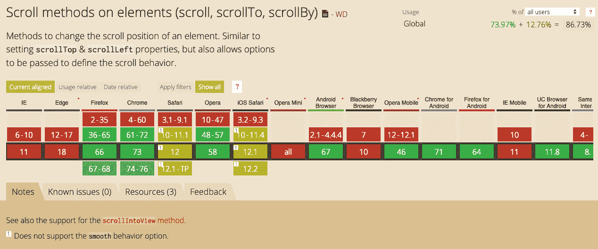

JavaScript 进入主流编程

JavaScript 可以在客户端和服务器端运行，这意味着使用 JavaScript 与 Python 的用例会有所不同。从不起眼的开始，JavaScript 以其怪癖、优势和局限性，现在成为我们所知的交互式网络的主要支柱之一，从丰富的前端交互到 Web 服务器。它是如何成为 Web 上最重要的普遍技术之一的？为了理解 JavaScript 在前端和后端都能添加功能的强大能力，我们首先需要了解前端是什么，以及它不是什么。了解 JavaScript 的起源有助于澄清 JavaScript 的“为什么”，所以让我们来看一下。

本章将涵盖以下主题：

+   国家超级计算应用中心（NCSA）和互动的需求

+   早期网络浏览器和 10 天的原型

+   进入 Ecma 国际

+   HTML、CSS 和 JavaScript——前端的最好伙伴

+   JavaScript 如何适应前端生态系统

# 第三章：技术要求

您可以在 GitHub 上找到本章中的代码文件[`github.com/PacktPublishing/Hands-on-JavaScript-for-Python-Developers`](https://github.com/PacktPublishing/Hands-on-JavaScript-for-Python-Developers)。

# NCSA 和互动的需求

与 21 世纪现在拥有的丰富媒介相比，早期互联网是一个相当无聊的地方。没有图形浏览器，只有相当基本的（和神秘的）命令，早期采用者只能在一段时间内完成某些学术任务。从 ARPANET（高级研究计划局网络）开始，它旨在通过成为第一个分组交换网络之一来促进基本通信和文件传输。此外，它是第一个实现传输控制协议/互联网协议（TCP/IP）套件的网络，我们现在认为它是理所当然的，因为它在所有现代网络应用程序的幕后运行。

为什么这很重要？早期互联网是为基本和简单的目的而设计的，但自那时以来它已经发展壮大。作为 Python 开发人员，您已经了解现代网络的强大之处，因此不需要对网络的完整历史有所了解。让我们跳到我们现在所知的前端的起源。

1990 年，蒂姆·伯纳斯-李（Tim Berners-Lee）进入：发明了万维网。通过自己构建第一个网络浏览器，并与欧洲核子研究组织（CERN）创建第一个网站，闸门打开了，世界从此改变。从学术上的摆弄开始，现在已经成为全球必需品，全球数百万人依赖于互联网。不用说，在 21 世纪的今天，我们使用网络和多种形式的数字通信来进行日常生活。

伯纳斯-李创建的项目之一是 HTML——超文本标记语言。作为网站的支柱，这种基本标记语言在计算机社区中引发了重大的增长和发展。只用了几年的时间（确切地说是 1993 年），第一个我们现在称之为浏览器的迭代版本 Mosaic 发布了。它是由伊利诺伊大学厄巴纳-香槟分校的 NCSA 开发的，并且是网络发展的重要组成部分。

# 早期网络浏览器和 10 天的原型

那么，为什么是 JavaScript？显然，网络需要的不仅仅是静态数据，所以在 1995 年，Netscape Communications 的 Brendan Eich 出现了。最初的想法并不是创建一个全新的语言，而是将 Scheme 整合到 Netscape 中。这个想法被 Sun Microsystems 与 Java 的合作所取代。决定了 Eich 正在创建的这种语言会有些类似于 Java，而不是 Scheme。这个想法的起源来自 Netscape Communications 的创始人 Marc Andreessen。他觉得需要一种语言来将 HTML 与“粘合语言”结合起来，帮助处理图像、插件和——是的——交互性。

Eich 在 10 天内创建了 JavaScript 的原型（最初称为 Mocha，然后是 LiveScript）。很难相信一个 10 天的原型已经成为网络的如此重要的一部分，但这就是历史记录的事实。一旦 Netscape 开发出了一个可供生产使用的版本，JavaScript 就在 1995 年与 Netscape Navigator 一起发布了。JavaScript 发布后不久，微软创建了自己的 JavaScript 版本，称为（毫不起眼地）JScript。JScript 于 1996 年与微软的 Internet Explorer 3.0 一起发布。

现在，有两种技术在同一个领域竞争。JScript 是从 Netscape 的 JavaScript 中进行了逆向工程，但由于这两种语言的特点，浏览器之间的战争开始了，导致网站经常出现“最佳在 Netscape Navigator 中查看”或“最佳在 Internet Explorer 中查看”的标签，这是由于在一个网站上支持这两种技术涉及的技术复杂性。早期版本之间的差异只增加了。一些网站在一个浏览器中可以完美运行，在另一个浏览器中却会出现严重故障，更不用说其他竞争对手对 Netscape 和微软浏览器造成的复杂性了！早期开发人员还发现这两种技术之间的差异只加剧了武器竞赛。如果你经历过性能下降（或者更糟糕的是，你在早期像我一样使用 JavaScript），你肯定感受到了竞争版本的痛苦。每家公司以及其他第三方都在竞相创建下一个最好的 JavaScript 版本。JavaScript 的核心必须在客户端进行解释，而浏览器之间的差异导致了混乱。必须采取一些措施，而 Netscape 有一个解决方案，尽管它并不完美。

我们将在下一节中了解这个解决方案。

# 进入 Ecma International

**欧洲计算机制造商协会**（**ECMA**）在 1994 年更名为 Ecma International，以反映其精炼的目的。作为一个标准组织，它的目的是促进各种技术的现代化和一致性。部分是为了应对微软的工作，Netscape 在 1996 年与 Ecma International 接触，以标准化这种语言。

JavaScript 在 ECMA-262 规范中有文档记录。你可能已经看到过**ECMAScript**或“基于 ECMAScript 的语言”这个术语。除了 JavaScript 之外，还有更多的 ECMAScript 语言！ActionScript 是另一种基于 ECMAScript 的语言，遵循与 JavaScript 类似的约定。随着 Flash 作为一种网络技术的衰落，我们不再在实践中看到 ActionScript，除了一些离散的用途，但事实仍然存在：Ecma International 创建了标准，并用于创建不同的技术，这有助于缓解浏览器之战——至少是一段时间。

关于 JavaScript，Ecma International 最有趣的部分也许是已经编码的各种版本。迄今为止，已经有九个版本，都有不同的差异。我们将在本书中使用 ECMAScript 2015（也称为 ES6），因为它是今天网页开发工作最稳定的基线。2016-2018 版本的功能可以被一些浏览器使用，并将被介绍。

# HTML、CSS 和 JavaScript——前端的最好伙伴

每个现代网站或 Web 应用程序的核心至少包括三种技术：HTML、**层叠样式表**（**CSS**）和 JavaScript。它们是前端的“最好的朋友”，并在以下截图中进行了说明：


图 1.1 - 最好的朋友：HTML、CSS 和 JavaScript

这三种技术的交汇处就是我们现代网站的所在。让我们在接下来的章节中来看看这些。

## HTML，被忽视的英雄

当我们思考网络时，网站的基本结构——骨架，可以说是 HTML。然而，由于其（有意的）简单性，它经常被忽视为一种简单的技术。想象一下网站就像是一个身体：HTML 是骨架；CSS 是皮肤；我们的朋友 JavaScript 是肌肉。

HTML 的历史与网络本身的历史密不可分，因为它随着网络本身的发展不断演进，具有先进的规范、特性和语法。但 HTML 是什么？它不是一个完整的编程语言：它不能进行逻辑操作或数据操作。然而，作为一种标记语言，它对我们使用网络非常重要。我们不会花太多时间讨论 HTML，但一些基础知识会让我们走上正确的轨道。

HTML 规范由**万维网联盟**（**W3C**）控制，其当前版本是 HTML5。HTML 的语法由称为标签的元素组成，这些标签具有特定的定义，并用尖括号括起来。在 JavaScript 中使用时，这些标签描述了 JavaScript 可以读取和操作的数据节点。

HTML 对我们在 JavaScript 中的重要性是什么？JavaScript 可以使用浏览器内部的**应用程序编程接口**（**API**）即**文档对象模型**（**DOM**）来操作 HTML。DOM 是页面上所有 HTML 的程序表示，并且它规定了 JavaScript 如何操作呈现页面上的元素。与 Python 不同，JavaScript 可以在前端对用户输入做出反应，而无需与服务器进行通信；它的执行逻辑可以在前端进行。想象一下当您在网站上的表单中输入信息时。有时，有必填字段，如果您尝试提交表单，JavaScript 可以阻止向服务器提交，并给出视觉提示——例如必填框上的红色轮廓和警告消息——并告知用户信息缺失。这是 JavaScript 使用 DOM 进行交互的一个例子。我们将在后面更深入地探讨这一点，在第七章中，*事件、事件驱动设计和 API*。

这是一个简单的 HTML5 样板的例子：

```js
<!doctype html>

<html lang="en">
<head>
  <meta charset="utf-8">

  <title>My Page</title>

</head>

<body>
  <h1>Welcome to my page!</h1>
  <p>Here’s where you can learn all about me</p>
</body>
</html>
```

它本身相当易读：在标题为`title`的标签中包含了一个包含页面简单标题的字符串。在`meta`标签中，除了标签的名称外，我们还有一个元素：`charset` *属性*。HTML5 还引入了*语义*标签，它们不仅为页面提供了视觉结构，还描述了标签的目的。例如，`nav`和`footer`用于表示页面上的导航和页脚部分。如果您想在我们进行的过程中尝试 HTML、CSS 和 JavaScript，您可以使用诸如 Codepen.io 或 JSFiddle.net 之类的工具。由于我们目前只使用客户端工作，您不需要在计算机上安装编译器或其他软件。您也可以使用您喜欢的文本编辑器在本地工作，然后在浏览器中加载您的 HTML。

对于我们在 JavaScript 中的需求来说，还有一组重要的属性是`class`和`id`。这些属性为 JavaScript 访问 HTML 提供了一个高效的通道。让我们在下面的代码块中看一个更加详细的 HTML 示例：

```js
<!doctype html>

<html lang="en">
<head>
  <meta charset="utf-8">

  <title>My Page</title>

</head>

<body>
  <h1 id="header">Welcome to my page!</h1>
  <label for="name">Please enter your name:</label>
  <form>
    <input type="text" placeholder="Name here" name="name" id="name" />
    <p class="error hidden" id="error">Please enter your name.</p>
    <button type="submit" id="submit">Submit</button>
  </form>
</body>
</html>
```

这将给我们一个非常简单的页面输出，如下所示：


图 1.2 - 一个简单的 HTML 页面

非常基础，对吧？为什么“请输入您的姓名”会重复显示？如果你注意到页面上的第二个`p`标签，它的一个类是`hidden`。然而，我们仍然可以看到它。我们需要 CSS 来帮助我们。

## CSS

如果 HTML 是我们页面的骨架，那么 CSS 就是它的“皮肤”，赋予它外观和感觉。在前端使用 JavaScript 时，必然会考虑到 CSS。在我们网站表单的示例中，红色轮廓和警告消息通常是通过切换 CSS 类触发的。以下是 CSS 的简短示例：

```js
.error {
  color: red;
  font-weight: bold;
}
```

在这个示例中，我们有一个 CSS 声明（`error`类，由其名称前面的句号表示为类），以及花括号内的两个 CSS 规则，用于字体颜色和字体粗细。现在完全掌握 CSS 结构和规则并不重要，但作为前端的 JavaScript 开发人员，你可能会与 CSS 互动。例如，切换我们的`error`类以使表单中的文本变红并加粗是 JavaScript 触发向用户发送消息的一种方式，告诉他们表单提交存在问题。

让我们将前面的 CSS 添加到我们之前的 HTML 工作中。我们可以看到这导致了以下变化：


图 1.3 - 添加一些 CSS

现在，我们可以看到红色和粗体的规则已经反映出来，但我们仍然可以看到段落。我们接下来的两个 CSS 规则是以下的：

```js
.hidden {
  display: none;
}

.show {
  display: block;
}
```

这更接近我们期望看到的内容。但为什么要创建一个段落然后用 CSS 隐藏它呢？

## JavaScript

现在，让我们来介绍 JavaScript。如果 JavaScript 是身体的肌肉，那么它就负责操纵骨骼（HTML）和皮肤（CSS）。我们的肌肉不能太多地改变我们的外貌，但它们肯定可以让我们处于不同的位置，扩展和收缩我们的弹性皮肤，并操纵我们的骨骼位置。通过 JavaScript，可以重新排列页面上的内容，更改颜色，创建动画等等。我们将深入探讨 JavaScript 如何与 HTML 和 CSS 交互，因为毕竟，JavaScript 就是我们现在阅读这本书的原因！

JavaScript 与 Python 相比最显著的一点是，为了对页面进行更改，Python 程序必须响应来自客户端的输入，然后浏览器会重新呈现 HTML。JavaScript 通过在浏览器中执行来避免这一点。

例如，在我们之前显示的页面中，如果用户尝试在不输入名称的情况下提交表单，JavaScript 可以移除`hidden`类并添加`show`类，此时错误消息就会显示。这是一个非常简单的例子，但它强调了 JavaScript 可以在浏览器中执行更改而无需回调服务器的想法。让我们把这些组合起来。

以下是 HTML 的示例：

```js
<!doctype html>

<html lang="en">
<head>
  <meta charset="utf-8">

  <title>My Page</title>

</head>

<body>
  <h1 id="header">Welcome to my page!</h1>
  <form>
    <label for="name">Please enter your name:</label>
    <input type="text" placeholder="Name here" name="name" id="name" />
    <p class="error hidden" id="error">Please enter your name.</p>
    <button type="submit" id="submit">Submit</button>
 </form>
</body>
</html>
```

以下是 CSS 的示例：

```js
.error {
  color: red;
  font-weight: bold;
}

.hidden {
  display: none;
}

.show {
  display: block;
}
```

现在，让我们写一些 JavaScript。目前可能还不太明白，但如果你在 JSFiddle 等编辑器中跟着做，尝试将以下 JavaScript 放入 JS 窗格中并点击运行：

```js
document.getElementById('submit').onclick = e => {
  e.preventDefault()
  if (document.getElementById('name').value === '') {
    document.getElementById('error').classList.toggle('hidden')
    document.getElementById('error').classList.toggle('show')
  }
}
```

现在，如果你运行这个并在不输入任何数据的情况下点击提交，我们的错误消息将显示。到目前为止非常简单，但恭喜你！你刚刚写了一些 JavaScript！那么，我们如何用 Python 来做到这一点呢？我们需要将表单提交到后端，评估提供的输入，并重新呈现带有错误消息的页面。

相反，欢迎来到与前端一起工作。

# JavaScript 如何适应前端生态系统

正如您所想象的那样，JavaScript 不仅仅是隐藏和显示元素。一个强大的应用程序不仅仅是一堆脚本标签——JavaScript 适应整个生命周期和生态系统，创造丰富的用户体验。我们将在第八章中使用 React 来深入探讨**单页应用程序**（**SPAs**），所以现在，让我们先打下基础。

如果您对 SPA 这个术语不熟悉，不用担心——您可能已经使用了至少几个，而没有意识到它们是什么。也许您使用谷歌的 Gmail 服务。如果是这样，稍微浏览一下，注意到页面似乎并没有进行硬刷新来从服务器获取信息。相反，它与服务器异步通信，并动态呈现内容。在等待从服务器加载内容的过程中，通常会出现一个小的旋转图标。从服务器异步加载内容并发送数据的基本范式称为**Ajax**。

Ajax，即**异步 JavaScript 和 XML**，只是一组用于客户端的技术和技巧，通过允许在后台获取和发送数据来简化用户体验。我们稍后将讨论使用 Ajax 从前端调用 API，但现在，让我们尝试一个小例子。

## 我们的第一个 Ajax 应用程序

首先，我们将使用 Flask 创建一个非常简单的 Python 脚本。如果您对 Flask 还不熟悉，不用担心——我们不会在这里详细介绍它。

这是一个`app.py`脚本的例子：

```js
from flask import Flask
import os

app = Flask(__name__, static_folder=os.getcwd())

@app.route('/')
def root():
    return app.send_static_file('index.html')

@app.route('/data')
def query():
    return 'Todo...'
```

这是我们的 HTML 和 JavaScript（`index.html`）：

```js
<!doctype html>

<html lang="en">
<head>
  <meta charset="utf-8">

  <title>My Page</title>

</head>

<body>
 <h1 id="header">Welcome to my page!</h1>
 <form>
   <label for="name">Please enter your name:</label>
   <input type="text" placeholder="Name here" name="name" id="name" />
   <button type="submit" id="submit">Submit</button>
 </form>
 <script>
   document.getElementById('submit').onclick = event => {
     event.preventDefault()
     fetch('/data')
       .then(res => res.text())
       .then(response => alert(response))
       .catch(err => console.error(err))
   }
 </script>
</body>
</html>
```

在我们分解这个之前，让我们尝试运行它，通过执行以下代码：

```js
$ pip install flask
$ export FLASK_APP=my_application
$ export FLASK_DEBUG=1
$ flask run
```

我们应该看到以下屏幕：


图 1.4 - 一个基本的 Flask 页面

让我们点击提交，然后应该出现以下屏幕：


图 1.5 - 将 Python 连接到 JavaScript！

我们成功地在 JavaScript 中显示了来自 Python 的文本 Todo…！让我们快速看一下我们是如何做到的。

我们的基本路由（`/`路由）将提供我们的静态`index.html`文件。太好了，现在我们可以看到我们的 HTML。但是第二个路由`/data`呢？它只是返回文本。到目前为止，它与任何基本的 Flask 应用程序并没有太大的不同。

现在，让我们看看我们的 JavaScript。首先要注意的一件事是：在我们的 HTML 文件中，我们可以用`<script>`标签包裹我们的 JavaScript。虽然将 JavaScript 存储在一个带有自己的脚本标签的单独文件中（我们会讨论到这一点），但在 HTML 中直接包含代码对于小型、快速和非生产调试目的非常方便。有时您会直接在 HTML 文件中插入代码，但这并不经常发生。现在，我们将打破最佳实践，玩一下以下片段：

```js
document.getElementById('submit').onclick = event => {
```

嗯。这是什么神秘的一行？这是一个 ES6 箭头函数的开头。我们稍后会更深入地讨论函数，但现在，让我们看看我们可以从这行中得到什么，如下所示：

+   `document.getElementById('submit')`：通过查看我们的 HTML，我们可以看到有一个带有 ID 属性`'submit'`的元素：按钮。所以，首先，我们要找到我们的按钮。

+   `.onclick`：这是一个动作动词。如果您猜到这个函数是设计为在用户点击按钮时执行操作，那么您是正确的。

至于函数的其余内容，我们可以猜到我们正在处理一个事件——涉及获取数据然后对其进行某些操作。那么，这个操作是什么？

`alert(response)`就是我们对它的处理！`alert`只是你在浏览器中看到的那些烦人的弹出消息之一，而且，我们用来显示 Flask 的数据！虽然不太*实用*，但希望你能看到我们的方向：前端并不是独立存在的——我们可以在客户端和服务器端之间来回通信，只需在任一端写几行代码。

在讨论 API 时，我们将更详细地查看`fetch`函数，但现在，让我们花一分钟来看看我们到目前为止所做的练习，如下所示：

1.  我们使用 Python 和 Flask 创建了一个小型的 Web 应用程序来提供一个简单的 HTML 页面。

1.  这个应用程序还有一个端点，用来提供一个非常简单的消息作为输出：待办事项……。

1.  使用 JavaScript，当用户点击提交按钮时我们采取了行动。

1.  点击提交按钮后，JavaScript 与 Python 应用程序通信以请求数据。

1.  返回的数据显示在警报窗口中向用户展示。

就是这样！我们成功发出了第一个 Ajax 调用。

### 实际中的 JavaScript

既然我们已经看到了 JavaScript 如何与 Python 一起使用的实际例子，让我们讨论一下它在前端领域的用途。剧透警告：我们将在下一章开始在服务器端使用 JavaScript。在我们的 Ajax 示例中遇到了一些神秘的命令，因此可能很容易忽视对 JavaScript 的使用和需求，但我们看到它是一种真正具有实际应用的语言。

JavaScript 之美的一部分在于它几乎被所有浏览器普遍采用。随着时间的推移，JavaScript 的语法和功能已经慢慢发展，但对于不同功能的支持，曾经在各个浏览器之间差异巨大，现在正在标准化。然而，仍然存在一些差异，但网上有一些有用的工具，可以及时更新浏览器可能支持或不支持的各种功能。其中一个网站是[caniuse.com](https://caniuse.com)，如下截图所示：



图 1.6：caniuse.com 的屏幕截图，显示了元素滚动方法的选择。

这个网站将 JavaScript 的各种方法和属性按照各种流行的浏览器分解成矩阵，以显示每个浏览器支持（或不支持）的情况。然而，总的来说，除非你使用的是尖端功能，否则你不需要太担心你的代码是否能在特定的浏览器上运行。

现在，我们已经展示了 JavaScript 与 Python 交互的示例，作为我们的后端使用 Flask，但我们可以使用几乎任何后端系统，只要它准备好接受入站的 HTTP 流量。Python、PHP、Ruby、Java——所有的可能性都在那里，只要后端期望与前端一起工作。

关于 jQuery 等库的一点说明：我们在本书中不会使用 jQuery。虽然它对于某些方法的快捷方式和简化很有用，但它的一个主要吸引点（至少对于像我这样的许多开发人员来说）是它在浏览器之间的底层标准化。还记得我们发出的 Ajax `fetch`调用吗？过去，Ajax 调用必须以两种不同的方式编写，每种方式对应一个主要类型的 JavaScript 解释器。然而，浏览器的标准化已经缓解了大部分跨浏览器的噩梦。jQuery 仍然提供许多有用的工具，特别是对于**用户界面**（**UI**）来说，比如可以使我们无需从头开始编写组件的插件。是否使用 jQuery 或类似的库取决于你或将由项目的需求决定。像 React 这样的库，我们将会讨论，旨在满足与 jQuery 等库非常不同的需求。

# 总结

JavaScript 在现代网络中占据着重要的地位。从 NCSA 的简单起步，它现在已经成为现代网络应用的一个组成部分，无论是用于 UI、Ajax 还是其他需求。它有官方规范，并不断发展，使得与 JavaScript 一起工作变得更加令人兴奋。与 HTML 和 CSS 协同工作，它可以做的远不止简单的交互，而且可以轻松地与（几乎）任何后端系统通信。它的目的是给我们带来不仅仅是静态页面，我们希望页面能够工作。如果你跟着编码，我们做了一个简单的 Ajax 应用，虽然现在这些命令对你来说可能毫无意义，但希望你能看到 JavaScript 是相当易读的。我们将在以后深入研究 JavaScript 的语法和结构。

我们还没有讨论过 JavaScript 后端的用途，但不用担心，下面就会讨论。

# 问题

试着回答以下问题来测试你的知识：

1.  哪个国际组织维护 JavaScript 的官方规范？

1.  W3C

1.  Ecma 国际

1.  网景

1.  Sun

1.  哪些后端可以与 JavaScript 通信？

1.  PHP

1.  Python

1.  Java

1.  以上所有

1.  谁是 JavaScript 的原始作者？

1.  Tim Berners-Lee

1.  Brendan Eich

1.  Linus Torvalds

1.  比尔·盖茨

1.  DOM 是什么？

1.  JavaScript 在内存中对 HTML 的表示

1.  一个允许 JavaScript 修改页面的 API

1.  以上两者

1.  以上都不是

1.  Ajax 的主要用途是什么？

1.  与 DOM 通信

1.  操作 DOM

1.  监听用户输入

1.  与后端通信

# 进一步阅读

以下是一些资源供您参考：

+   Thoriq Firdaus，Ben Frain 和 Benjamin LaGrone。*HTML5 和 CSS3：构建响应式网站。*伯明翰：Packt Publishing，2016 年。

+   浏览器战争：[`en.wikipedia.org/wiki/Browser_wars`](https://en.wikipedia.org/wiki/Browser_wars)

+   W3C：[`www.w3.org/`](https://www.w3.org/)
