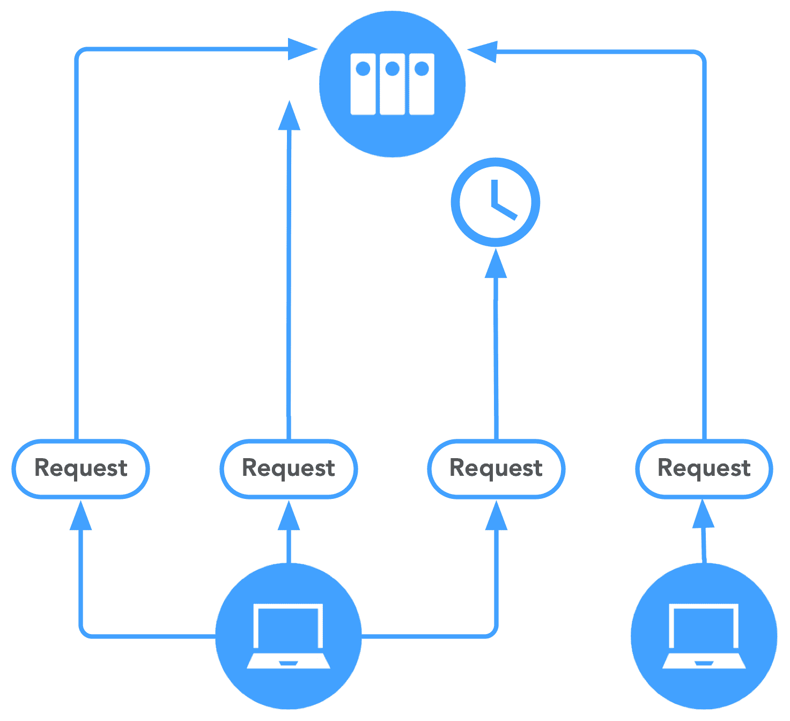
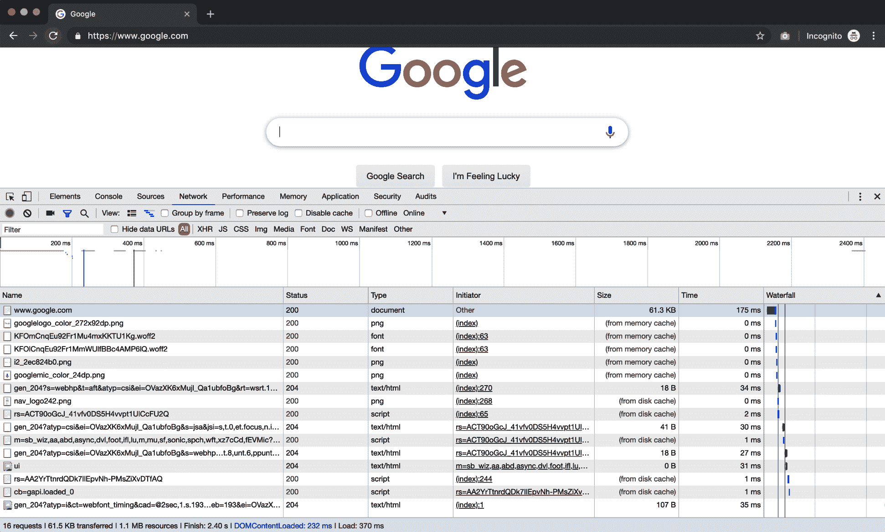
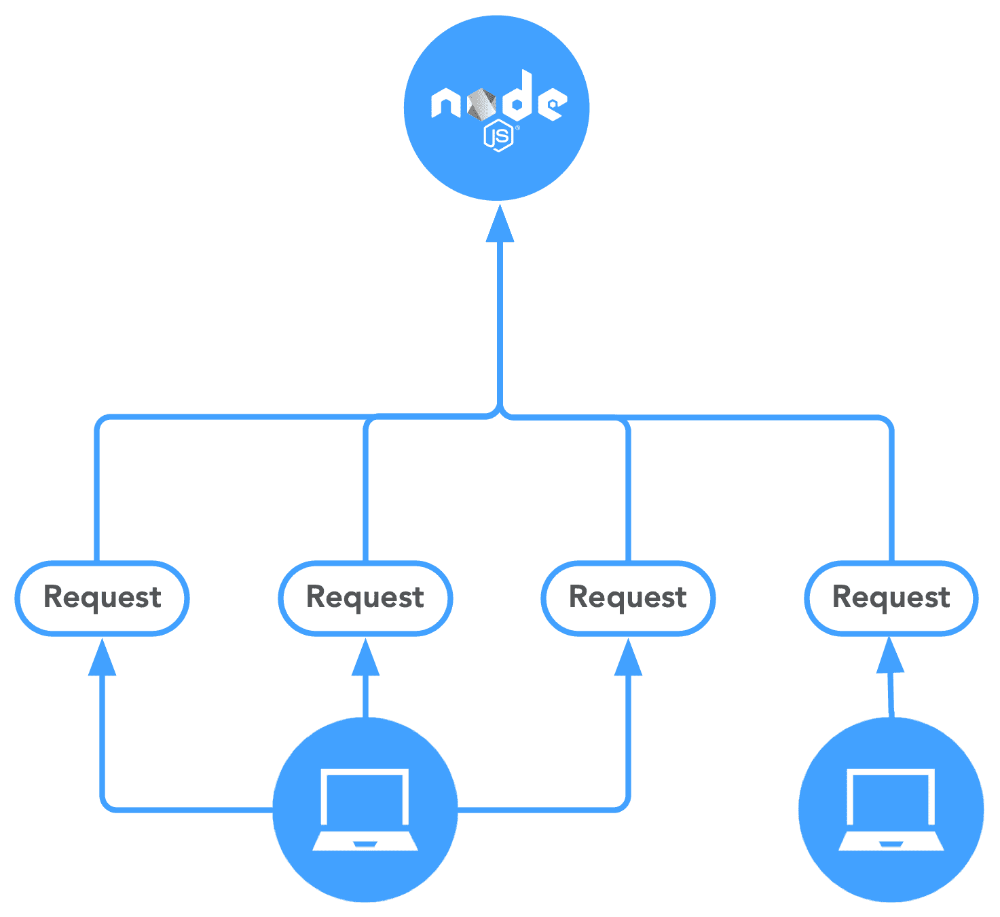

# 第二章：我们可以在服务器端使用 JavaScript 吗？当然可以！

我们通常不会认为 JavaScript 存在于服务器端，因为它的大部分历史只存在于浏览器端。然而，归根结底，JavaScript *是*一种语言——而语言可以对其应用程序（在一定程度上）是不可知的。虽然从一开始就可以使用一些不同的工具在服务器端使用 JavaScript，但是**Node.js**的引入使得在服务器端使用 JavaScript 成为主流。在这里，Python 和 JavaScript 之间的相似之处比在前端更多，但在实践中两种技术的使用仍然存在显著差异。让我们来看一下 Node.js 以及我们如何利用它在服务器端的力量——以及为什么我们想要这样做！

本章将涵盖以下主题：

+   为什么要在服务器端使用 JavaScript？

+   Node.js 生态系统

+   线程和异步性

# 技术要求

您可以在 GitHub 上找到本章中的代码文件：[`github.com/PacktPublishing/Hands-on-JavaScript-for-Python-Developers`](https://github.com/PacktPublishing/Hands-on-JavaScript-for-Python-Developers)。

# 为什么要在服务器端使用 JavaScript？

有许多服务器端语言：Java、PHP、Ruby、Go，还有我们的朋友 Python，只是举几个例子。那么，为什么我们要使用 JavaScript 作为服务器端语言呢？一个答案是为了减少上下文切换。理论上，同一个开发人员可以用最少的心理变化来编写 Web 应用程序的前端和后端。迄今为止，关于切换编程语言的成本的研究还很少，往往是高度个人化的，但一些研究表明，从一项任务切换到另一项任务，然后再切换回来，会降低生产力，增加完成任务所需时间。换句话说，从 JavaScript 切换到 Python 需要一些心理上的运动。当然，通过实践，这种心理负担变得不重要（想象一个可以实时听取一种语言并将其翻译成另一种语言的翻译员）。然而，随着技术变化的速度，达到那种流利程度更加困难。可以说，任务之间的一致性越大，切换任务所涉及的心理负担就越小。

让我们来看一下我们讨论过的编码语言在语法和风格方面的相似之处，还有一些历史。

## 语法相似之处

开发人员喜欢使用 Node.js 的原因之一是它在语法上几乎与前端 JavaScript 相同。

让我们来看一下我们已经写过的一些代码。

这里有一个 JavaScript 代码的例子：

```js
document.getElementById('submit').onclick = event => {
  event.preventDefault()
  fetch('/data')
    .then(res => res.text())
    .then(response => alert(response))
    .catch(err => console.error(err))
}
```

现在，让我们来看一下一些完全不同的 Node.js 代码，但是具有类似的语法，点符号、花括号等。这是一个例子：

```js
const http = require('http')

http.createServer((request, response) => {
  response.writeHead(200, {'Content-Type': 'text/plain'})
  response.end('Hello World!')
}).listen(8080)
```

乍一看，这两个代码片段可能看起来并不相似，所以让我们仔细看看。在我们的 JavaScript 示例中，看看`event.preventDefault()`，然后在我们的 Node.js 示例中，看看`response.end('Hello World!')`。它们都使用**点语法**来指定父对象的**方法**（或函数）。这两行完全做着不同的事情，但我们可以根据 JavaScript 的规则来阅读它们。点语法在 JavaScript 中是一个非常重要的概念，因为它本质上是一种面向对象的语言。就像在使用面向对象的 Python 处理对象时一样，我们可以访问 JavaScript 对象的类方法和属性。就像在 Python 中一样，JavaScript 中也有类、实例、方法和属性。

那么，这个 Node.js 示例到底在做什么呢？再次，我们可以看到 JavaScript 是一种相当易读的语言！即使不太了解 Node.js 的内部，我们也可以看到我们正在创建一个服务器，发送一些东西，并监听输入。如果我们再次与 Flask 示例进行比较，如下所示，我们正在做什么：

```js
from flask import Flask, Response

app = Flask(__name__)

@app.route('/')
def main():
    content = {'Hello World!'}
    return Response(content, status=200, mimetype='text/plain')

$ flask run --port=8080
```

这两个片段的工作原理并没有本质上的不同；它们是用两种不同的语言实现相同目标的两种不同方式。

让我们看一个在客户端 JavaScript 和 Node.js 中执行相同工作的函数。我们还没有详细讨论语法，所以暂时不要让语法成为绊脚石。

这是一个 JavaScript 示例：

```js
for (let i = 0; i < 100; i++) {
  console.log(i)
}
```

这是一个 Node.js 示例：

```js
for (let i = 0; i < 100; i++) {
  console.log(i)
}
```

仔细看看这两个。这不是一个把戏：事实上，它们是相同的。将 JavaScript 版本与以下代码片段中的基本 Python 循环进行比较：

```js
for x in range(100):
    print(x)
```

我们稍后将深入探讨 JavaScript 的语法，以及为什么它看起来比其 Pythonic 对应物更长，但现在，让我们承认 Python 代码与 JavaScript 有多么*不同*。

## 更多历史

Node.js，由 Ryan Dahl 创建，最初于 2009 年发布，是 JavaScript 的开源运行时，可以在浏览器之外运行。它可能看起来很新，但在其时间内已经获得了很大的立足点，包括主要的公司。然而，大多数人不知道的一个事实是，Node.js *不是* 服务器端 JavaScript 的第一个实现。这个区别再次属于 Netscape，几年前。然而，许多人认为这种语言发展不够，因此它在这方面的使用被限制到了不存在的程度。

Dahl 试图将服务器端和客户端更紧密地联系在一起。从历史上看，应用程序的两侧之间存在着相当大的关注点分离。JavaScript 可以与前端一起工作，但查询服务器是一个持续的过程。据说 Dahl 在创建 Node.js 时受到启发，因为他对文件上传进度条必须依赖与服务器的持续通信感到沮丧。Node.js 通过提供基于*事件循环的架构*来促进这种通信，呈现了一种更顺畅的执行方式。自从创建 Node.js 以来，Dahl 已经开始创建 Deno，这是一个类似于 Node.js 的 JavaScript 和 TypeScript 运行时。然而，对于我们的目的，我们将使用 Node.js。

我们稍后将深入探讨 Node.js 使用的回调范式，我们还将看到前端 JavaScript 也使用它。

让我们通过更仔细地观察它的谚语生命周期来看看 Node.js 是如何工作的。

# Node.js 生态系统

大多数语言不是范式：只编写自包含的代码。称为**包**的独立代码模块在软件工程和开发中被广泛使用。换个角度思考，即使是一个全新的 Web 服务器也没有软件来直接提供网站服务。您必须安装软件包，如 Apache 或 nginx，甚至才能到达网站的“Hello World！”步骤。Node.js 也不例外。它有许多工具可以使获取这些软件包的过程更简单。让我们从头开始看一个使用 Node.js 的基本“Hello World！”服务器示例。我们稍后将更详细地讨论这些概念，所以现在让我们只是进行基本设置。

## Node.js

当然，我们首先需要访问语言本身。你可以通过几种方法在你的机器上获取 Node.js，包括包管理器，但最简单的方法就是从官方网站下载：[`nodejs.org`](https://nodejs.org/)。安装时，确保包括**Node Package Manager**（**npm**）。根据你的环境，在安装完成后可能需要重新启动你的机器。

安装了 Node.js 之后，确保你可以访问它。打开你的终端并执行以下命令：

```js
$ node -v
```

你应该会看到返回的版本号。如果是这样，你就准备好继续了！

## npm

Node.js 的一个优势是其丰富的开源社区。当然，这并不是 Node.js 独有的，但这是一个吸引人的事实。就像 Python 有`pip`一样，Node.js 有`npm`。有数十万个软件包和数十亿次的下载，`npm`是世界上最大的软件包注册表。当然，随着软件包的增多，就会有一系列的相互依赖关系和保持它们更新的需求，因此 npm 提供了一个相当稳定的版本管理方法，以确保你使用的软件包在一起正常运行。

就像我们测试了 Node 版本一样，我们也会测试`npm`，就像这样：

```js
$ npm -v
```

如果由于某种原因你*没有*安装`npm`，那么现在是时候研究如何安装它了，因为最初安装 Node 时并没有带有`npm`。有几种安装它的方法，比如使用 Homebrew，但最好重新查看一下你是如何安装 Node 的。

## Express.js

Express 是一个快速、流行的 Web 应用程序框架。我们将把它作为我们 Node.js 工作的基础。我们稍后会详细讨论如何使用它，所以现在让我们快速搭建一个脚手架。我们将全局安装 Express 和一个脚手架工具，如下所示：

1.  使用命令行安装 Express 生成器，通过运行以下命令：`npm install -g express express-generator`。

1.  使用生成器创建一个新目录并搭建应用程序，通过运行以下命令：`express --view=hbs sample && cd sample`。

1.  你的`sample`目录现在应该包含一个类似这样的骨架：

```js
├── app.js
├── bin
│ └── www
├── package.json
├── public
│ ├── images
│ ├── javascripts
│ └── stylesheets
│ └── style.css
├── routes
│ ├── index.js
│ └── users.js
└── views
    ├── error.hbs
    ├── index.hbs
    └── layout.hbs
```

1.  现在，我们将通过运行以下命令来安装应用程序的依赖项：`npm install`。

1.  它将下载必要的软件包，然后我们将准备启动服务器，通过运行以下命令：`npm start`。

1.  访问`http://localhost:3000/`，你应该会看到以下截图中显示的有史以来最激动人心的页面：


图 2.1 - Express 欢迎页面

恭喜！这是你的第一个 Node.js 应用程序！让我们来看看它的内部：

打开`routes`目录中的`index.js`文件，你应该会看到类似于这样的内容：

```js
var express = require('express');
var router = express.Router();

/* GET home page. */
router.get('/', function(req, res, next) {
  res.render('index', { title: 'Express' });
});

module.exports = router;
```

值得注意的是，此时你可能会注意到一些 Node.js 示例和现代 JavaScript 之间的语法差异。如果你注意到了，这些行以分号结尾，而我们之前的示例没有。我们将在后面讨论不同版本的 JavaScript，但现在，如果这让你感到惊讶，就记住这个注释。

让我们来看一下`router.get`语句，在下面的代码块中有所说明：

```js
router.get('/', function(req, res, next) {
 res.render('index', { title: 'Express' });
});
```

`get`指的是程序响应的 HTTP 动词。同样，如果我们处理 POST 数据，行的开头将是`router.post`。因此，本质上，这是在说：“嘿，服务器，当你收到对主页的请求时，用`title`变量等于`Express`来渲染 index 模板。”别担心，我们将在第十三章*使用 Express*中详细介绍这个问题，但现在，让我们玩一下：

1.  在`res.render`行之前添加一行`console.log('hello')`。

1.  将`Express`改为`My Site`。

在对 Node.js 代码进行更改时，您需要重新启动本地服务器。您可以返回到您的终端，使用*Ctrl* + *C*退出 Express，然后使用`npm start`重新启动它。当然，也有处理这个问题的进程管理器，但是现在，我们使用的是一个非常基本的实现。

再次导航到`https://localhost:3000/`。您应该会看到以下内容：


图 2.2 - 更改后的 Express 页面

现在，让我们回到您的终端。当您访问本地主机时，您还触发了一个`console.log()`语句-一个调试打印语句。您应该会看到`hello`与 Express 提供的请求和响应一起显示在屏幕上，如下截图所示：


图 2.3 - console.log

使用控制台对我们来说将是非常宝贵的，无论是在客户端还是服务器端。这只是它可以做的一小部分！继续使用 *Ctrl* + *C* 退出。

# 线程和异步性

与传统的 Web 架构一样，了解在后端使用 Node.js 的*原因*是很重要的。

我们已经看了 Node.js 的运行方式，现在，让我们看看 Node 的客户端-服务器架构与传统范式有何不同。

## 传统的客户端-服务器架构

为了了解 Node.js 与传统架构的不同之处，让我们看一下以下请求图表：



图 2.4 - 传统的客户端-服务器图表

在传统的设置中，每个对服务器的请求（或连接）都会在服务器的内存中产生一个新的线程，占用系统的**随机存取内存**（**RAM**），直到达到可能的线程数量。之后，一些请求必须等待，直到有更多的内存可用。如果你不熟悉**线程**的概念，它们基本上是在计算机上运行的一小段命令。这种*多线程*范式意味着对服务器接收的每个新请求，都会在内存中创建一个新的唯一位置来处理该请求。

现在，请记住，一个*请求*不是一个完整的网页-一个页面可以有数十个请求，用于其他补充资产，如图像。在下面的截图中，看一下谷歌主页仅有 16 个请求：



图 2.5 - google.com 请求

为什么这很重要？简而言之：可伸缩性。每秒的请求越多，使用的内存就越多。我们都见过网站在负载下崩溃时会发生什么-一个令人讨厌的错误页面。这是我们都想要避免的事情。

## Node.js 架构

与这种范式相反，Node.js 是*单线程*的，允许进行数千次非阻塞的输入输出调用，而无需额外的开销，如下图所示：



图 2.6 - Node.js 客户端-服务器图表

然而，有一件事情需要早早注意到：这种范式并不是管理服务器上的流量和负载的万能解决方案。目前确实没有一个完全解决大量流量问题的银弹。然而，这种结构确实有助于使服务器更加高效。

Node.js 与 JavaScript 配合得如此完美的原因之一是它已经在处理**事件**的概念。正如我们将看到的，事件是 JavaScript 前端的一个强大基石，因此可以推断，通过将这个过程延续到后端，我们将看到与其他架构有些不同的方法。

# 总结

尽管在服务器上运行 JavaScript 的概念并不新鲜，但随着 Node.js 的流行、稳定性和功能的大大扩展，它的受欢迎程度也大大提高。早期，服务器端 JavaScript 被抛弃，但在 2009 年随着 Node.js 的创建再次光芒万丈。

Node.js 通过在客户端和服务器端使用相同的基本语法，减少了开发人员的上下文切换心智负担。同一个开发人员可以相当无缝地处理整个堆栈，因为客户端工作和如何在服务器上操作 Node.js 之间存在相当大的相似之处。除了方法上的差异，还有一种不同的基本范式来处理对服务器的请求，与其他更传统的实现相比。

JavaScript：不仅仅是客户端！

在下一章中，我们将深入探讨 JavaScript 的语法、语义和最佳实践。

# 问题

尝试回答以下问题来测试你的知识：

1.  真或假：Node.js 是单线程的。

1.  真或假：Node.js 的架构使其不受分布式拒绝服务（DDoS）攻击的影响。

1.  谁最初创建了 Node.js？

1.  Brendan Eich

1.  Linux Torvalds

1.  Ada Lovelace

1.  Ryan Dahl

1.  真或假：服务器端的 JavaScript 本质上是不安全的，因为代码暴露在前端。

1.  真或假：Node.js 本质上优于 Python。

# 进一步阅读

请参考以下链接以获取更多关于这个主题的信息：

+   为什么我要使用 Node.js？逐案教程：[`www.toptal.com/nodejs/why-the-hell-would-i-use-node-js`](https://www.toptal.com/nodejs/why-the-hell-would-i-use-node-js)

+   事件驱动架构：[`en.wikipedia.org/wiki/Event-driven_architecture`](https://en.wikipedia.org/wiki/Event-driven_architecture)
