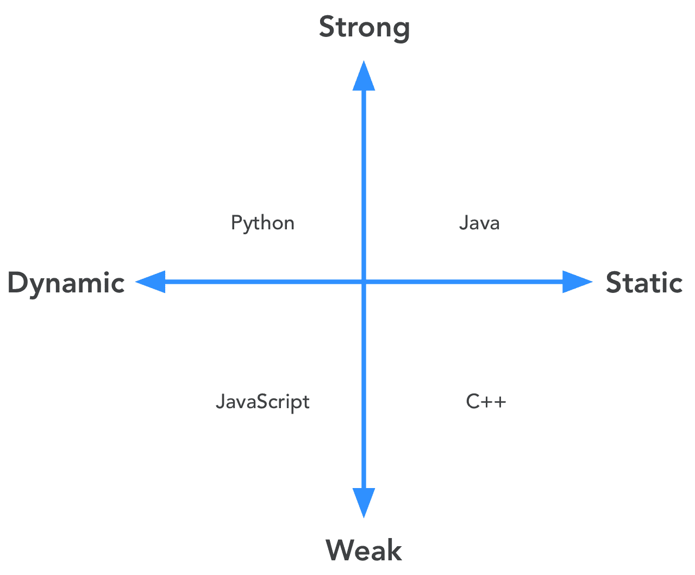
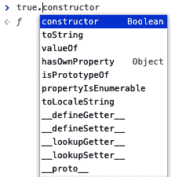
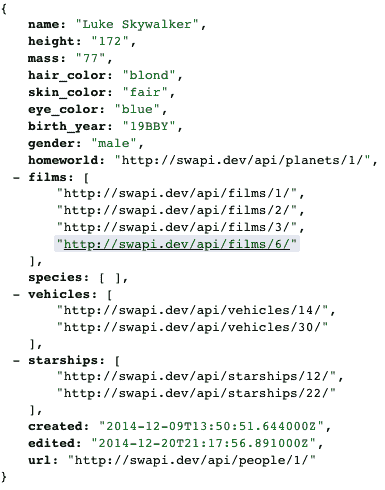

# 第四章：数据和你的朋友，JSON

现在是时候学习 JavaScript 如何内部处理数据的具体细节了。这些结构大多数（几乎）与 Python 相同，但在语法和用法上有所不同。我们在第三章中提到过，*Nitty-Gritty Grammar*，但现在是时候深入了解如何处理数据、使用方法和属性了。了解如何处理数据是使用 JavaScript 的基础，特别是在进行高级工作，比如处理 API 和 Ajax 时。

本章将涵盖以下主题：

+   数据类型 - JavaScript 和 Python 都是动态类型的！

+   探索数据类型

+   数组和集合

+   对象和 JSON

+   HTTP 动词

+   前端的 API 调用 - Ajax

# 技术要求

从 GitHub 上克隆或下载本书的存储库[`github.com/PacktPublishing/Hands-on-JavaScript-for-Python-Developers`](https://github.com/PacktPublishing/Hands-on-JavaScript-for-Python-Developers)，并查看`Chapter-4`的材料。

# 数据类型 - JavaScript 和 Python 都是动态类型的！

在第三章中，*Nitty-Gritty Grammar*，我们讨论了使用`typeof()`来确定变量的数据类型，并使用`let`和`const`来定义它们。关于 JavaScript 有一个有趣的事实，它与 Python 共享：它们都是动态类型的。与 Java 等静态类型语言相反，JavaScript 的变量类型可以在程序运行过程中改变。这就是为什么`typeof()`会有用的一个原因。

让我们看一个快速的例子，对比 JavaScript 和 Java：

| **Java** | **JavaScript** |
| --- | --- |

|

```js
int age;
age =  38;
age = "thirty-eight";
```

|

```js
let age
age = 38
age = "thirty-eight"
```

|

如果我们尝试运行 Java 代码，我们会得到一个错误，指出类型不兼容。在 Java 中，*变量*有一个类型。然而，当我们运行 JavaScript 代码时，一切都很顺利。在 JavaScript 中，*值*有一个类型。

还要知道 JavaScript 是*弱类型*的，这意味着在大多数情况下允许数据类型之间的隐式转换。如果我们回想一下第三章中的宽松和严格相等运算符，*Nitty-Gritty Grammar*，弱类型是为什么当前的最佳实践规定在尽可能使用严格相等检查。

如果我们看一下一些语言在强/弱和动态/静态方面的比较，我们可以将这些语言绘制在这样一个轴上：



图 4.1 - 类型的轴

JavaScript 风格通常倡导使用描述性名称而不是简写名称。这是可以接受的原因之一是，通常情况下，JavaScript 代码在进入生产之前会被*缩小*。这并不完全像编译，但它确实压缩空白并重命名变量以被压缩。当我们讨论 webpack 时，我们将在第十六章，*进入 webpack*中讨论一些这些构建过程。

好的，所以 JavaScript 是动态和弱类型的。这在实践中意味着什么？简短的答案是：要小心！在比较运算符中很容易混淆类型，甚至更糟糕的是，意外地将变量转换为不同的类型。在编写程序时，这给了我们更多的灵活性，但它也可能是一个诅咒。一些开发人员喜欢使用匈牙利命名法（[`frontstuff.io/write-more-understandable-code-with-hungarian-notation`](https://frontstuff.io/write-more-understandable-code-with-hungarian-notation)）来帮助区分变量类型，但这在 JavaScript 中并不常见。帮助自己和同事保持正确类型的最好方法可能是在变量名中明确表示类型。

# 探索数据类型

让我们深入研究原始数据类型，因为它们对我们在 JavaScript 中的工作至关重要。我们不仅需要知道我们正在使用的*是什么*，而且*为什么*也很重要。我们的**原始数据类型**是语言其余部分的构建块：布尔值、数字和字符串。JavaScript 的其余部分都是建立在这些原始数据类型之上的。我们将从布尔值开始。

## 布尔值

**布尔值**可能是最简单和最通用的数据类型，因为它与二进制逻辑的 1 和 0 紧密相关。在 JavaScript 中，布尔值简单地写为`true`或`false`。不建议使用`1`或`0`作为布尔值，因为它们将被解释为数字，从而导致严格的相等失败。布尔值是一种特定的数据类型，与 Python 不同，在语言的核心部分，布尔值继承自数字。

还记得第三章中的*Nitty-Gritty Grammar*吗，我们在那里学到几乎所有 JavaScript 中的东西都是对象吗？布尔值也是如此。正如您在下面的屏幕截图中所看到的，如果您在浏览器中打开 JavaScript 控制台，很可能会自动完成，以便查看对于布尔值可用的方法：



图 4.2 - Chrome 中的布尔自动完成

现在，我怀疑这些方法中没有一个对您特别有用，但这是一个方便的方法，可以检查对于给定变量可用的方法。

布尔值只能带我们走这么远 - 是时候看看**数字**了。

## 数字

JavaScript 没有整数、浮点数或双精度等不同类型的数字概念 - 一切都只是一个数字。所有基本算术方法都是内置的，`Math`对象提供了您期望在编程语言中找到的其余功能。这是一个例子：

```js
let myNumber = 2.14 myNumber = Math.floor(myNumber) // myNumber now equals 2
```

您还可以使用科学计数法，如下所示：

```js
myNumber = 123e5  // myNumber is 12300000
```

JavaScript 中的数字不仅仅是任意的数字，而是固有的浮点数。从技术上讲，它们存储为遵循国际 IEEE 754 标准的双精度浮点数。然而，这确实导致了一些…有趣的…怪癖。如果您得到奇怪的结果，例如下面来自 JavaScript 控制台的屏幕截图中的结果，请记住这一点：


图 4.3 - 浮点精度错误

一个经验法则是考虑您希望进行计算的精度。您可以使用数字的`toPrecision()`方法指定您的精度，然后使用`parseFloat()`函数，如下所示：

```js
let x = 0.2 + 0.1 // x = 0.30000000000000004
x = parseFloat(x.toPrecision(1)) // x = 0.3
```

`toPrecision()`返回一个字符串，这乍一看可能有些反直觉，但这有一个很好的理由。假设您需要您的数字有两位小数（例如，显示美元和美分）。如果您在数字上使用`toPrecision()`并返回一个数字，如果您对整数进行更多计算，它将仅呈现整数，除非您也操纵小数位。这其中是有一些方法的。

接下来是：**字符串**。我们需要向我们的程序添加一些内容！

## 字符串

啊，可敬的字符串数据类型。它具有一些您期望的基本功能，例如`length`属性和`slice()`和`split()`方法，但总是让我困惑的两个是`substr()`和`substring()`：

```js
"hello world".substr(3,5) // returns "lo wo" "hello world".substring(3,5) //  returns "lo"
```

这两种方法之间的区别在于第一个指定了`(start, length)`，而第二个指定了`(start, end index)`。记住区别的一个方便方法是`.substring()`在名称中有一个"i"，与索引相关 - 在字符串中停止的位置。

ES6 中的一个新添加使我们的生活更轻松，那就是模板文字。看看这个日志：

```js
const name = "Bob"
let age = 50
console.log("My name is " + name + " and I am " + age + " years old.")
```

它可以工作，但有点笨重。让我们使用模板文字：

```js
console.log(`My name is ${name} and I am ${age} years old.`)
```

在这个例子中有两个重要的事情需要注意：

+   字符串以反引号开始和结束，而不是引号。

+   要插入的变量被包含在`${ }`中。

模板文字很方便，但不是必需的。当您遇到问题时，在网上研究代码时，您肯定会看到以前的字符串连接方式的示例。但是，请记住，这对您来说也是一种选择。

让我们尝试一个练习！

## 练习-基本计算器

有了我们对布尔值、数字和字符串的了解，让我们构建一个基本的计算器。首先克隆存储库[`github.com/PacktPublishing/Hands-on-JavaScript-for-Python-Developers/tree/master/chapter-4/calculator/starter-code`](https://github.com/PacktPublishing/Hands-on-JavaScript-for-Python-Developers/tree/master/chapter-4/calculator/starter-code)。

您可以大部分时间安全地忽略 HTML 和 CSS，但是阅读 HTML 将有所帮助。让我们来看看 JavaScript：

```js
window.onload = (() => {
  const buttons = document.getElementsByTagName('button')
  const output = document.getElementsByTagName('input')[0]
  let operation = null
  let expression = firstNumber = secondNumber = 0

  output.value = expression

  const clickHandler = ((event) => {
    let value = event.target.value

    /** Write your calculator logic here.
        Use conditionals and math to modify the output variable.

        Example of how to use the operators object:
          operators'=' // returns 3

        Expected things to use:
          if/else
          switch() - https://developer.mozilla.org/en-
           US/docs/Web/JavaScript/Reference/Statements/switch
          parseFloat()
          String concatenation
          Assignment
    */

  })

  for (let i = 0; i < buttons.length; i++) {
    buttons[i].onclick = clickHandler
  }

  const operators = {
    '+': function(a, b) { return a + b },
    '-': function(a, b) { return a - b },
    '*': function(a, b) { return a * b },
    '/': function(a, b) { return a / b }
  };
})
```

这对于初学 JavaScript 的人来说并不是一个容易的练习，所以不要害怕查看解决方案代码并进行逆向工程：[`github.com/PacktPublishing/Hands-on-JavaScript-for-Python-Developers/tree/master/chapter-4/calculator/solution-code`](https://github.com/PacktPublishing/Hands-on-JavaScript-for-Python-Developers/tree/master/chapter-4/calculator/solution-code)。

接下来，让我们探索**数组**和 ES6 的一个新添加：**集合**。

# 数组和集合

任何编程语言都有一些关于数组或*项目集合*的概念，它们都共享一些共同的特征或用途。JavaScript 有一些这样的概念：**数组**和**集合**。这两种结构都包含项目，并且在许多方面它们的使用方式也相似，因为它们可以被枚举、迭代和显示以进行逻辑构建。

让我们首先看看数组。

## 数组

数组可以包含不同的数据类型。这是一个完全可行的数组：

```js
const myArray = ['hello',1,'goodbye',null,true,1,'hello',{ 0 : 1 }]
```

它包含字符串、数字、布尔值、`null`和一个对象。这没问题！虽然在实践中，您可能不会混合数据类型，但没有什么可以阻止您这样做。

使用`typeof()`对数组有一个怪癖：因为它们不是真正的原始值，`typeof(myArray)`将返回`object`。在编写 JavaScript 时，您应该记住这一点。

正如我们在第三章中看到的，*Nitty-Gritty Grammar*，`.push()`和`.pop()`是最有用的数组方法之一，分别用于向数组添加和删除项目。还有很多其他可用的方法。让我们来看看其中的一些。

要创建一个数组，我们可以像以前的代码一样做，也可以简单地写成`const myArray = []`。现在，虽然我们可以修改数组中的值，但我们可以将其声明为`const`，因为在大多数情况下，我们不希望让程序完全重新定义它。我们仍然可以操作数组中的值；我们只是不想破坏和重新创建它。让我们继续使用前面示例中的数组项：

```js
myArray.push('goodbye') // myArray is now ['hello',1,'goodbye',null,true,1,'hello',{ 0 : 1 }, 'goodbye']
myArray[3] // equals null
```

请记住，数组是从零开始索引的，所以我们的计数从`0`开始。

要从数组末尾删除一个元素，我们使用`.pop()`，如下所示：

```js
let myValue = myArray.pop() // myValue = 'goodbye'
```

要从数组开头删除一个对象，使用`.shift()`，如下所示：

```js
myValue = myArray.shift() // myValue now equals 'hello'
```

请注意，到目前为止介绍的所有这些方法都会直接改变原始数组。`.pop()`和`.shift()`返回被删除的值，而不是数组本身。这种区别很重要，因为并非所有的数组方法都是这样的。让我们来看看`slice`和`splice`：

```js
myValue =  myArray.slice(0,1) // myValue equals 1, and myArray is unchanged
myValue = myArray.splice(0,1,'oh no') // myValue = 1, and myArray equals ['oh no', 'goodbye', null, true, 1, 'hello',{ 0 : 1 }]
```

您可以在**MDN Web Docs**网站上查找这两种方法的参数。为了介绍这些方法，只需知道变量上的方法的行为可以从变异变为稳定。

集合与数组密切相关，但有一些细微的差别。让我们来看看。

## 集合

集合是 ES6 中引入的一种复合数据类型。集合是一个删除了重复项并禁止添加重复项的数组。尝试以下代码：

```js
const myArray = ['oh no', 'goodbye', null, true, 1, 'hello',{ 0 : 1 }]
myArray.push('goodbye')
console.log(myArray)

const mySet = new Set(myArray)
console.log(mySet)

mySet.add('goodbye')
console.log(mySet)
```

`myArray`的长度为 8，而`mySet`的长度为 7——即使在尝试添加`'goodbye'`之后也是如此。JavaScript 的集合`.add()`方法首先会测试确保正在添加的是唯一值。请注意`new`关键字和数据类型的大写；这不是创建集合的唯一方式，但很重要。在 ES5 及之前，声明新变量的常见做法是这样的，但现在除了少数情况外，这种做法被认为是遗留的。

在面试中，有一个常见的初级 JavaScript 问题，要求你对数组进行去重。您可以使用**set**一次性完成这个操作，而不是遍历数组并检查每个值。

虽然有许多可能的解决方案可以在不使用集合的情况下对数组进行去重，但让我们看一个使用`.sort()`方法的相当基本的例子。正如您可以从名称中期望的那样，这个方法将按升序对数组进行排序。如果您知道数组将包含相同数据类型的字符串或数字，则最好使用这种方法。

考虑以下数组：

```js
const myArray = ['oh no', 'goodbye', 'hello', 'hello', 'goodbye']
```

我们知道去重、排序后的数组应该如下所示：

```js
['goodbye', 'hello', 'oh no']
```

我们可以这样测试：

```js
const mySet = new Set(myArray.sort())
```

现在，让我们尝试不使用集合。这是一种使用去重函数的方法：

```js
const myArray = ['oh no', 'goodbye', 'hello', 'hello', 'goodbye']

function unique(a) {
 return a.sort().filter(function(item, pos, ary) {
   return !pos || item != ary[pos - 1]
 })
}

console.log(unique(myArray))
```

继续看一下：[`github.com/PacktPublishing/Hands-on-JavaScript-for-Python-Developers/blob/master/chapter-4/deduplicate/index.html`](https://github.com/PacktPublishing/Hands-on-JavaScript-for-Python-Developers/blob/master/chapter-4/deduplicate/index.html)。

输出是什么？我们应该得到一个长度为 3 的数组，如下所示：

```js
["goodbye", "hello", "oh no"]
```

原始方法稍微复杂一些，对吧？集合是一种更加用户友好的数组去重方式。对象是 JavaScript 中的另一种集合类型。正如承诺的那样，这里有一个更深入的介绍。

# 对象和 JSON

对象！对象是 JavaScript 的核心。如前所述，在《第三章》*Nitty-Gritty Grammar*中，几乎 JavaScript 中的所有东西，从本质上讲，都是对象。对象可能一开始会让人望而生畏，但在理论上它们很容易理解：

这是一个对象的骨架：

```js
const myObject = { key: value }
```

对象是一组*键/值对*。它们有很多用途，特别是用来包含和组织数据。让我们来看一下《第三章》中关于 Captain Picard 的例子，*Nitty-Gritty Grammar*：

```js
const captain = {
  "name": "Jean-Luc Picard",
  "age": 62,
  "serialNumber": "SP 937-215",
  "command": "NCC 1701-D",
  "seniorStaff": ['Riker','Data','Worf', 'Troi']
}
```

正如我们所见，我们可以使用点表示法来访问对象的属性，就像这样：

```js
captain.command // equals "NCC 1701-D"
```

我们还可以将其他数据类型用作值，就像`captain.seniorStaff`一样。

与其他所有东西一样，对象也有自己的方法。其中最方便的之一是`.hasOwnProperty()`：

```js
console.log(captain.hasOwnProperty('command')) // logs true
```

现在，让我们再次尝试数组去重，但这次让我们利用对象来创建一个哈希映射：

```js
const myArray = ['oh no', 'goodbye', 'hello', 'hello', 'goodbye']

function unique_fast(a) {
  const seen = {};
  const out = [];
  let len = a.length;
  let j = 0;
  for (let i = 0; i < len; i++) {
    const item = a[i];
    if (seen[item] !== 1) {
      seen[item] = 1;
      out[j++] = item;
    }
  }
  return out;
}

console.log(unique_fast(myArray))
```

让我们来看一下：[`github.com/PacktPublishing/Hands-on-JavaScript-for-Python-Developers/blob/master/chapter-4/deduplicate/hashmap.html`](https://github.com/PacktPublishing/Hands-on-JavaScript-for-Python-Developers/blob/master/chapter-4/deduplicate/hashmap.html)。现在，这种方法几乎比我们之前探讨的去重方法快了近一倍，虽然这并不是立即显而易见的。为什么呢？简而言之，对象的值可以立即在 O(1)时间内访问，而不是在 O(n)时间内遍历整个数组。如果您对大 O 符号不熟悉，这是一种计算代码复杂性的模糊方式，这里有一个很好的入门：[`www.topcoder.com/blog/big-o-notation-primer/`](https://www.topcoder.com/blog/big-o-notation-primer/)。

让我们将两种方法与一个长度为 24,975 的数组进行对比。

第一个实现，[`github.com/PacktPublishing/Hands-on-JavaScript-for-Python-Developers/blob/master/chapter-4/deduplicate/large.html`](https://github.com/PacktPublishing/Hands-on-JavaScript-for-Python-Developers/blob/master/chapter-4/deduplicate/large.html)，将在 5 到 8 毫秒之间（结果可能有所不同）。

然而，通过使用带有对象的哈希映射，我们可以将运行时间减少至少几毫秒：[`github.com/PacktPublishing/Hands-on-JavaScript-for-Python-Developers/blob/master/chapter-4/deduplicate/large_hashmap.html`](https://github.com/PacktPublishing/Hands-on-JavaScript-for-Python-Developers/blob/master/chapter-4/deduplicate/large_hashmap.html)。

现在，几毫秒可能看起来微不足道（并且不可能用肉眼区分），但想想一个需要反复运行的操作，针对相似长度的数据集。节省的时间会累积起来。

你可以查看[`stackoverflow.com/a/9229821/2581282`](https://stackoverflow.com/a/9229821/2581282)了解更多关于这个问题的想法和解释。

接下来，我们将研究一些使 JavaScript...嗯，*JavaScript*！它的继承和类的概念与其他语言有很大不同。让我们深入了解一下。

## 原型继承

JavaScript 中的继承确实是它的主要优势之一。JavaScript 使用**原型**继承，而不是经典的基于类的继承。（专业提示：它的发音是*pro-to-TYPE-al*而不是*pro-to-TYPICAL*。）这是因为它使用对象的原型作为模板。你还记得之前我们在控制台中使用字符串和数字的方法，并发现即使在简单的数据类型上，我们也有许多可用的方法吗？嗯，我们可以做得更多。

在 JavaScript 的原型继承概念中，原型链是基本的，它告诉我们在方法方面我们可以访问什么。让我们看一下图表：


图 4.4 - 原型链

那么，这意味着什么？考虑`Alice`：我们可以看到这个变量是一个字符串，因为它是从`String`原型继承而来的。因此，翻译成代码，我们可以这样说：

```js
const Alice = new String()
Alice.name = "Alice"
console.log(Alice.name)
```

我们在控制台中会得到什么？只是`Alice`。我们给了我们的`Alice`字符串对象`name`的*属性*。现在，让我们来看看原型中这个神秘的`sayHello()`方法。如果我们执行以下操作，你认为会发生什么？

```js
Alice.sayHello()
```

如果你猜到我们在`sayHello()`函数上会得到一个未定义的错误，那么你是正确的。我们还没有定义它。

这是我们通过修改`String`原型来实现的：

```js
String.prototype.sayHello = function() {
 console.log(`My name is ${this.name}.`)
}
const Alice = new String()
Alice.name = "Alice"
Alice.sayHello()
```

现在，在我们的控制台中，我们将得到`My name is Alice`。好的，发生了什么？

通过直接修改`String`原型并添加一个`sayHello()`方法，我们可以在任何字符串上使用这个方法并访问它的属性。就像我们之前使用点表示法一样，我们可以使用`this`关键字来引用我们正在工作的对象的属性。因此，在我们的原型中，`this.name`有效并等于`Alice.name`。

现在，你可能会想*这似乎有点危险*。我们正在修改一个基本数据类型，如果我们尝试在*没有*`name`属性的字符串上调用`.sayHello()`，我们将得到一个很大的错误。你是对的！有一种更好的方法可以做到这一点，而且仍然利用了原型继承的概念。看一下这个：

```js
function Person(name) {
  this.name = name

  this.sayHello = function() {
    console.log(`My name is ${this.name}.`)
  }
}

const Alice = new Person('Alice')
const Bob = new Person('Bob')

Alice.sayHello()
Bob.sayHello()
```

正如我们所期望的，我们得到了`My name is Alice.`和`My name is Bob.`。我们不需要两次定义`sayHello()`；相反，`Alice`和`Bob`从`Person`那里*继承*了这个方法。效率！

现在我们要谈谈杰森。杰森是谁？不，不，我们要检查的是基于对象的数据结构称为**JSON**。

## JSON

**JSON**（发音为*jay-sohn*或*jason*）代表**JavaScript 对象表示法**。如果你以前在现场看到过它，你可能知道它经常被用作方便的 API 传输格式。我们稍后会更详细地讨论 API，但现在让我们了解一下 JSON 是什么，以及它为什么有用。

让我们看看它是什么样子的。我们将使用**星球大战 API**（**SWAPI**）([`swapi.dev`](https://swapi.dev))作为一个方便的只读 API。看一下这个例子的结果：[`swapi.dev/api/people/1/?format=json`](https://swapi.dev/api/people/1/?format=json)：


图 4.5 - SWAPI 人物实例

JSON 的一个很棒的地方是它相当易读，因为它没有像 XML 那样有很多节点和格式。然而，在它的原始格式中，就像前面的截图一样，它仍然是一团糟。浏览器有很好的工具可以将 JSON 解析成易读的树形结构。花点时间找一个安装到你的浏览器上，然后访问之前的 API 调用。现在，你的响应应该格式化如下截图所示：



图 4.6 - SWAPI 格式化

现在更容易阅读了。向卢克·天行者问好！

这个 API 的作者之一的设计决定是，每个结果中只包含资源的唯一数据。例如，对于`homeworld`，它不会明确写出“塔图因”，而是提供了一个**URI**（**U****niform Resource Identifier**）用于一个*planet*资源。我们可以看到`homeworld`及其数据是键值对，就像其他对象一样，`films`是一个字符串数组，整个数据集是一个用大括号括起来的对象。这就是 JSON 的全部内容：格式正确的 JavaScript 对象。

现在是时候深入了解一些关于互联网如何工作的信息，以便更好地使用 JavaScript、API 和整个网络。

# HTTP 动词

让我们快速看一下允许我们与 API 来回通信的 HTTP 动词：

| **HTTP 动词** | **CRUD 等效** |
| --- | --- |
| POST | 创建 |
| GET | 读取 |
| PUT | 更新/替换 |
| PATCH | 更新/修改 |
| DELETE | 删除 |

虽然 API 中使用的实际动词取决于 API 的设计，但这些是许多 API 今天使用的标准 REST 术语。**REST**代表**REpresentational** **State** **Transfer**，是关于如何格式化 API 的标准描述。现在，REST 或 RESTful API 并不总是要使用 JSON 进行通信 - REST 对格式是不可知的。让我们看看实际中的 API 调用。

# 前端的 API 调用 - Ajax

**Ajax**（也拼写为 AJAX）代表**异步 JavaScript 和 XML**。然而，现在，你更可能使用 JSON 而不是 XML，所以这个名字有点误导。现在看代码：看一下[`github.com/PacktPublishing/Hands-on-JavaScript-for-Python-Developers/blob/master/chapter-4/ajax/swapi.html`](https://github.com/PacktPublishing/Hands-on-JavaScript-for-Python-Developers/blob/master/chapter-4/ajax/swapi.html)。在本地打开这个链接，在你的开发者工具中，你应该看到一个 JSON 对象，如下所示：


图 4.7 - SWAPI Ajax 结果

恭喜！你已经完成了你的第一个 Ajax 调用！让我们来分解一下下面的代码：

```js
fetch('https://swapi.co/api/people/1/')
  .then((response) => {
    return response.json()
  })
  .then((json) => {
    console.log(json)
  })
```

`fetch`是 ES6 中一个相当新的 API，它基本上取代了使用`XMLHttpRequest`进行 Ajax 调用的旧方法，这种语法相当简洁。也许不太明显的是`.then()`函数的作用，甚至它们是什么。

`.then()`是 Promise 的一个例子。我们现在不会详细讨论 Promise，但基本前提是建立在 JavaScript 的异步部分。基本上，Promise 说：“执行这段代码，我保证以后会提供更多的数据给你。不要在这里阻塞代码执行。”

在浏览器中本地打开[`github.com/PacktPublishing/Hands-on-JavaScript-for-Python-Developers/blob/master/chapter-4/ajax/swapi-2.html`](https://github.com/PacktPublishing/Hands-on-JavaScript-for-Python-Developers/blob/master/chapter-4/ajax/swapi-2.html)。你应该会看到“加载数据…”一闪而过，然后显示 JSON。您可以使用浏览器的开发者工具来限制您的互联网连接，以查看它的运行情况。

以下是 JavaScript 代码：

```js
fetch('https://swapi.co/api/people/1/')
  .then((response) => {
    return response.json()
  })
  .then((json) => {
    document.querySelector('#main').innerHTML = JSON.stringify(json)
  })
document.querySelector('#headline').innerHTML = "Luke Skywalker"
```

不要太担心`document.querySelector`行——我们将在第六章中详细介绍这些内容，*文档对象模型（DOM）*。现在，只需了解它们用于在 HTML 文档中放置信息。让我们使用开发者工具将连接节流到慢 3G 或类似的速度。当我们刷新时，我们应该看到“等待标题…”的闪烁，然后是“卢克·天行者”，接着是“加载数据…”，*然后*，几秒钟后，JSON 作为文本。

那么，这是如何工作的呢？将代码行从“等待标题…”更改为“卢克·天行者”是在 Ajax 调用之后。那么为什么标题在数据部分之前就改变了呢？答案是*Promise*。

使用`fetch`，我们确定我们本质上使用的是异步数据，因此`.then()`语句告诉我们在承诺语句解析*之后*我们可以做什么。它使程序可以继续进行程序的其他部分。事实上，我们可以进行多次 fetch 调用，这些调用可能在不同的时间返回，但仍然不会阻止用户使用程序。异步性是使用现代 JavaScript 时的一个基本概念，所以请花时间理解它。

接下来，让我们通过实际*使用*API 来获得一些经验！现在是真正动手并与不仅是本地代码而且外部代码互动的时候了。

## SWAPI 实验室

让我们通过这个 API 进行一些实践。我们现在要做的事情可能有些不够优雅，但它将向我们展示如何利用异步行为来获得优势。

您应该期望看到类似于这样的东西：


图 4.8 – SWAPI Promises result

请记住，由于我们使用了 Promise 并且必须迭代`films`数组，电影的顺序可能会有所不同。如果愿意，您可以选择按电影编号排序它们。

这个实验室将需要嵌套的 Promise 和一些我们尚未涵盖的语法，所以如果你想做这个实验，请给自己足够的时间来实验：

+   起始代码：[`github.com/PacktPublishing/Hands-on-JavaScript-for-Python-Developers/tree/master/chapter-4/ajax-lab/starter-code`](https://github.com/PacktPublishing/Hands-on-JavaScript-for-Python-Developers/tree/master/chapter-4/ajax-lab/starter-code)

+   解决方案代码：[`github.com/PacktPublishing/Hands-on-JavaScript-for-Python-Developers/tree/master/chapter-4/ajax-lab/solution-code`](https://github.com/PacktPublishing/Hands-on-JavaScript-for-Python-Developers/tree/master/chapter-4/ajax-lab/solution-code)

与任何实验室一样，请记住解决方案代码可能与您的代码不匹配，但它是作为思考过程的资源。

# 总结

数据是每个程序的核心，你的 JavaScript 程序也不例外：

+   JavaScript 是弱类型的，这意味着变量类型可以根据需要变化。

+   布尔值是简单的真/假语句。

+   数字之间没有区分整数、浮点数或其他类型的数字。

+   数组和集合可以包含大量数据，并且使我们组织数据更容易。

+   对象是高效存储数据的键值对。

+   API 调用实际上并不可怕！

我们仔细研究了数据类型、API 和 JSON。我们发现 JavaScript 中的数据非常灵活，甚至可以操作对象本身的原型。通过查看 JSON 和 API，我们成功地使用`fetch()`执行了我们的第一个 API 调用。

在下一章中，我们将进一步深入编写 JavaScript，制作一个更有趣的应用程序，并了解如何构建一个应用程序的细节！

# 问题

对于以下问题，请选择正确的选项：

1.  JavaScript 本质上是：

1.  同步的

1.  异步的

1.  两者都是

1.  `fetch()` 调用返回：

1.  `然后`

1.  下一个

1.  `最后`

1.  承诺

1.  通过原型继承，我们可以（全选）：

1.  向基本数据类型添加方法。

1.  从基本数据类型中减去方法。

1.  重命名我们的数据类型。

1.  将我们的数据转换为另一种格式。

```js
let x = !!1
console.log(x)
```

1.  从上面的代码中，预期输出是什么？

1.  1

1.  `false`

1.  `0`

1.  `true`

```js
const Officer = function(name, rank, posting) {
  this.name = name
  this.rank = rank
  this.posting = posting
  this.sayHello = () => {
    console.log(this.name)
  }
}

const Riker = new Officer("Will Riker", "Commander", "U.S.S. Enterprise")
```

1.  在上面的代码中，输出 `Will Riker` 的最佳方法是什么？

1.  `Riker.sayHello()`

1.  `console.log(Riker.name)`

1.  `console.log(Riker.this.name)`

1.  `Officer.Riker.name()`

# 进一步阅读

有关静态与动态类型语言的更多信息，您可以参考 [`android.jlelse.eu/magic-lies-here-statically-typed-vs-dynamically-typed-languages-d151c7f95e2b`](https://android.jlelse.eu/magic-lies-here-statically-typed-vs-dynamically-typed-languages-d151c7f95e2b)。

要了解更多关于匈牙利命名法的信息，请参考 [`frontstuff.io/write-more-understandable-code-with-hungarian-notation`](https://frontstuff.io/write-more-understandable-code-with-hungarian-notation)。
