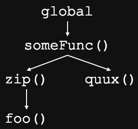
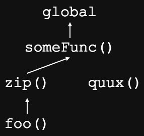

# 第五章：Hello World 以及更多：你的第一个应用

啊，那个古老的“Hello World!”脚本。虽然非常简单，但它是对任何语言的一个很好的第一次测试。不过，让我们做得更多一点，不仅仅是说 hello；让我们用几个小应用程序来动手。毕竟，编程不仅仅是理论。我们将看一下编码挑战中提出的一个常见问题，以及*我们的程序是如何工作的。

本章将涵盖以下主题：

+   控制台和警报消息的 I/O

+   在函数中处理输入

+   使用对象作为数据存储

+   理解作用域

# 技术要求

从[`github.com/PacktPublishing/Hands-on-JavaScript-for-Python-Developers`](https://github.com/PacktPublishing/Hands-on-JavaScript-for-Python-Developers)克隆或下载本书的存储库，并准备查看`Chapter-5`的材料。

# 控制台和警报消息的 I/O

到目前为止，我们已经看到了 JavaScript 如何向用户输出信息。考虑以下代码：

```js
const Officer = function(name, rank, posting) {
  this.name = name
  this.rank = rank
  this.posting = posting
  this.sayHello = () => {
    console.log(this.name)
  }
}

const Riker = new Officer("Will Riker", "Commander", "U.S.S. Enterprise")
```

现在，如果我们执行`Riker.sayHello()`，我们将在控制台中看到以下内容：


图 5.1 - 控制台输出

在存储库的`chapter-5`目录中自己看一看：[`github.com/PacktPublishing/Hands-on-JavaScript-for-Python-Developers/blob/master/chapter-5/alerts-and-prompts/console.html`](https://github.com/PacktPublishing/Hands-on-JavaScript-for-Python-Developers/blob/master/chapter-5/alerts-and-prompts/console.html)。

好的，太好了。我们有一些控制台输出，但这不是一个很有效的输出方式，因为用户通常不会打开控制台。有一种方便的输出方法，虽然不适用于完整的网络应用程序，但对于测试和调试目的很有用：`alert()`。以下是一个例子：

```js
const Officer = function(name, rank, posting) {
  this.name = name
  this.rank = rank
  this.posting = posting
  this.sayHello = () => {
    alert(this.name)
  }
}

const Riker = new Officer("Will Riker", "Commander", "U.S.S. Enterprise")

Riker.sayHello()
```

尝试从[`github.com/PacktPublishing/Hands-on-JavaScript-for-Python-Developers/blob/master/chapter-5/alerts-and-prompts/alert.html`](https://github.com/PacktPublishing/Hands-on-JavaScript-for-Python-Developers/blob/master/chapter-5/alerts-and-prompts/alert.html)运行上述代码。你看到了什么？


图 5.2 - 警报消息

太棒了！我们有一个那种你可能在网上见过的烦人的小弹出框。当使用不当时，它们可能很烦人，但在适当的时候，它们可以非常有用。

让我们看看一个类似的东西，它将从用户那里得到*输入*([`github.com/PacktPublishing/Hands-on-JavaScript-for-Python-Developers/blob/master/chapter-5/alerts-and-prompts/prompt.html`](https://github.com/PacktPublishing/Hands-on-JavaScript-for-Python-Developers/blob/master/chapter-5/alerts-and-prompts/prompt.html))：

```js
const Officer = function(name, rank, posting) {
  this.name = name
  this.rank = rank
  this.posting = posting

  this.ask = () => {
    const values = ['name','rank','posting']

    let answer = prompt("What would you like to know about this officer?")
    answer = answer.toLowerCase()

    if (values.indexOf(answer) < 0) {
      alert('Value not found')
    } else {
      alert(this[answer])
    }
  }
}

const Riker = new Officer("Will Riker", "Commander", "U.S.S. Enterprise")

Riker.ask()
```

当你加载页面时，你会看到一个带有输入字段的弹出框。输入`name`、`rank`或`posting`，然后查看结果。如果刷新并输入除这些选项之外的内容，你应该会得到一个值未找到的响应。

啊！但让我们也看看以下一行：

```js
answer = answer.toLowerCase()
```

由于这是前端 JavaScript，我们不知道用户会输入什么，所以我们应该考虑轻微的格式错误。数据净化是另一个话题，所以现在，让我们同意我们可以将整个字符串转换为小写以匹配预期的值。

到目前为止，一切都很好。现在，让我们看看`answer`是如何使用的。

# 在函数中处理输入

如果我们看一下前面的对象，我们会看到以下内容：

```js
if (values.indexOf(answer) < 0) {
  alert('Value not found')
} else {
  alert(this[answer])
}
...

```

由于我们正在处理任意输入，我们首先要做的是检查我们的答案数组，看看所请求的属性是否存在。如果不存在，就会弹出一个简单的错误消息。如果找到了，那么我们可以弹出该值。如果你还记得第三章中的内容，*Nitty-Gritty Grammar*，对象属性可以通过**点表示法**和**括号表示法**来访问。在这种情况下，我们正在使用一个变量作为键，所以我们*不能*这样做，因为它会被解释为键。因此，我们使用括号表示法来访问正确的对象值。

## 练习-斐波那契数列

对于这个练习，构建一个函数来接受一个数字。最终结果应该是斐波那契数列([`en.wikipedia.org/wiki/Fibonacci_number`](https://en.wikipedia.org/wiki/Fibonacci_number))中到指定数字的数字之和。序列的前几个数字是`[1, 1, 2, 3, 5, 8, 13, 21, 34, 55, 89]`。每个数字都是前两个数字的和；例如，`f[6] = 13`，因为`f[5] = 8`，`f[4] = 5`，因此`f[6] = 8+5 = 13`。你可以在[`github.com/PacktPublishing/Hands-on-JavaScript-for-Python-Developers/tree/master/chapter-5/fibonacci/starter-code`](https://github.com/PacktPublishing/Hands-on-JavaScript-for-Python-Developers/tree/master/chapter-5/fibonacci/starter-code)找到起始代码。不要太担心计算数字的最有效算法；只需确保不要硬编码值，而是依赖输入变量和公式。

## 斐波那契数列解决方案

让我们解剖一个可能的解决方案：

```js
function fibonacci(num) {
  let a = 1, b = 0, temp

  while (num >= 0) {
    temp = a
    a = a + b
    b = temp
    num--
  }

  return b
}

let response = prompt("How many numbers?")
alert(`The Fibonacci number is ${fibonacci(response)}`)

```

让我们先看看函数外的行。我们所做的只是简单地询问用户想要计算到序列的哪个点。然后，`response`变量被传递到`alert()`语句作为`fibonacci`的参数，`fibonacci`接受`num`作为参数。从那时起，`while()`循环在`num`上执行，将`num`递减，而`b`的值则根据算法递增，最后返回到我们的警报消息中。

就是这样了！现在，让我们尝试一个变体，因为我们永远不知道我们的用户会输入什么。如果他们输入的是一个字符串而不是一个数字会发生什么？我们应该适应这一点，至少呈现一个错误消息。

让我们来看看这个解决方案：

```js
function fibonacci(num) {
  let a = 1, b = 0, temp

  while (num >= 0) {
    temp = a
    a = a + b
    b = temp
    num--
  }

  return b
}

let response = prompt("How many numbers?")

while (typeof(parseInt(response)) !== "number" || !Number.isInteger(parseFloat(response))) {
  response = prompt("Please enter an integer:")
}

alert(`The Fibonacci number is ${fibonacci(response)}`)
```

你可以在 GitHub 上找到解决方案，网址是[`github.com/PacktPublishing/Hands-on-JavaScript-for-Python-Developers/tree/master/chapter-5/fibonacci/solution-code-number-check`](https://github.com/PacktPublishing/Hands-on-JavaScript-for-Python-Developers/tree/master/chapter-5/fibonacci/solution-code-number-check)。

如果我们进入`while()`循环，我们会看到我们的类型匹配魔法。首先，由于`response`本质上是一个字符串，我们决定不要相信类型强制转换，这就是我们之前的解决方案在做的事情。我们使用`parseInt()`方法将`response`直接转换为一个数字。太好了！但这并不能确保我们的用户一开始输入的是一个整数。记住，JavaScript 没有`int`和`float`的概念，所以我们必须进行一些操作，以确保我们的输入是一个整数，方法是使用`Number.isInteger`方法的否定。这确保了我们的输入是一个有效的整数。

在更深入地使用 JSON 之前，让我们看看如何将对象用作数据存储。

# 使用对象作为数据存储

这是一个我在编程面试中见过的有趣问题，以及解决它的最有效方法。它具有昂贵的输入时间，但具有 O(1)的*检索*时间，这通常被认为是算法复杂性成功的度量标准，当你可以预期读取的次数比写入的次数多时。

## 练习-乘法

考虑以下代码（[`github.com/PacktPublishing/Hands-on-JavaScript-for-Python-Developers/tree/master/chapter-5/matrix/starter-code`](https://github.com/PacktPublishing/Hands-on-JavaScript-for-Python-Developers/tree/master/chapter-5/matrix/starter-code)）：

```js
const a = [1, 3, 5, 7, 9]
const b = [2, 5, 7, 9, 14]

// compute the products of each permutation for efficient retrieval

const products = { }

// ...

const getProducts = function(a,b) {
  // make an efficient means of retrieval
  // ...
}

// bonus: get an arbitrary key/value pair. If nonexistent, compute it and store it.
```

那么，在使用对象的范例中，解决方案是什么？让我们来看看，分解一下，然后逆向工程我们使用对象作为数据存储的用法（*剧透警告：*你听说过 NoSQL 吗？）。

## 乘法解决方案

在我们开始之前，让我们将问题分解为两个步骤：给定两个数组，我们首先计算数组中每个项目的乘积，并将它们存储在一个对象中。然后，我们将编写一个函数来检索数组中给定两个数字的乘积。让我们来看看。

### 第一步 - 计算和存储

首先，我们的`makeProducts`函数将以两个数组作为参数。使用数组的`.forEach()`方法，我们将遍历第一个数组中的每个项目，将值命名为`multiplicant`：

```js
const makeProducts = function(array1, array2) {
  array1.forEach( (multiplicant) => {
    if (!products[multiplicant]) {
      products[multiplicant] = { }
    }
    array2.forEach( (multiplier) => {
      if (!products[multiplier]) {
        products[multiplier] = { }
      }
      products[multiplicant][multiplier] = multiplicant * multiplier
      products[multiplier][multiplicant] = products[multiplicant]
       [multiplier]
    })
  })
}
```

现在，我们的最终目标是有一个对象告诉我们“*x*和*y*的乘积是*z*”。如果我们将这个抽象成使用对象作为数据存储，我们可以得到这样的结构：

```js
{
  x: {
    y: z
  },
  y: {
    x: z
  }
}
```

在这个对象结构中，我们只需要指定`x.y`来检索我们的计算，它将是`z`。我们也不想假设一个顺序，所以我们也做相反的：`y.z`。

那么，我们如何构建这个数据对象呢？记住，如果我们不是调用文字键，我们可以使用**方括号表示法**与对象；在这里，我们使用一个变量：

```js
if (!products[multiplicant]) {
    products[multiplicant] = { }
}
```

我们的第一步是检查我们的对象中是否存在`multiplicant`键（在我们之前的理论讨论中是`x`）。如果不存在，将其设置为一个新对象。

现在，在我们的内部循环中，让我们对乘数做同样的事情：

```js
if (!products[multiplier]) {
    products[multiplier] = { }
}
```

太好了！我们已经为`x`和`y`都设置了键。现在，我们只需计算乘积并将其存储在两个位置，如下所示：

```js
products[multiplicant][multiplier] = multiplicant * multiplier
products[multiplier][multiplicant] = products[multiplicant][multiplier]
```

*注意决定将反向键值分配给正向键的值，而不是重新计算乘积*。为什么我们要这样做？事实上，为什么我们要为一个简单的数学运算费这么大劲？原因是：如果我们不是做简单的乘法，而是做一个*远远*更复杂的计算呢？也许一个如此复杂以至于需要一秒或更长时间才能返回的计算？现在我们可以看到，我们希望减少我们的时间，这样我们只需要做一次计算，然后可以重复读取它以获得最佳性能。

构建了这个函数之后，我们将在我们的数组上执行它：

```js
makeProducts(a,b)
```

这很容易调用！

### 第二步 - 检索

现在，让我们编写我们的检索函数：

```js
const getProducts = function(a,b) {
  // make an efficient means of retrieval
  if (products[a]) {
    return products[a][b] || null
  }
  return null
}
```

如果我们看这个逻辑，首先我们确保第一个键存在。如果存在，我们返回`x.y`或者如果`y`不存在则返回`null`。对象很挑剔，如果你试图引用一个不存在的*键*的*值*，你会得到一个错误。因此，我们首先需要存在性检查我们的键。如果键存在*并且*键/值对存在，返回计算出的值；否则，我们返回`null`。注意`return products[a][b] || null`的短路：这是一种有效的方式来表示“返回值或其他东西”。如果`products[a][b]`不存在，它将响应一个假值，然后`OR`操作将接管。高效！

看一下奖励问题的答案的解决方案代码。存在检查和计算的相同原则适用。

# 理解范围

在我们构建一个更大的应用程序之前，让我们讨论一下范围。简而言之，范围定义了我们何时何地可以使用变量或函数。JavaScript 中的范围被分为两个离散的类别：局部和全局。如果我们看看我们之前的乘法程序，我们可以看到有三个变量在任何函数之外；它们挂在我们程序的根级别：

```js
01: const a = [1, 3, 5, 7, 9]
02: const b = [2, 5, 7, 9, 14]
03: 
04: // compute the products of each permutation for efficient retrieval
05: 
06: const products = { }
07: 
08: const makeProducts = function(array1, array2) {
09:     array1.forEach( (multiplicant) => {
10:         if (!products[multiplicant]) {
11:             products[multiplicant] = { }
12:         }
13:         array2.forEach( (multiplier) => {
14:             if (!products[multiplier]) {
15:                 products[multiplier] = { }
16:             }
17:             products[multiplicant][multiplier] = multiplicant * 
                 multiplier
18:             products[multiplier][multiplicant] = products[multiplicant]
                 [multiplier]
19:         })
20:     })
21: }
22: 
23: const getProducts = function(a,b) {
24:     // make an efficient means of retrieval
25:     if (products[a]) {
26:         return products[a][b] || null
27:     }
28:     return null
29: }
30: 
31: makeProducts(a,b)
```

问题中的变量分别在第 1、2 和 6 行：`a`、`b`和`products`。太好了！这意味着我们可以在任何地方使用它们，比如第 10、11、14、15 行，以及更多地方，只要我们在它们被定义之后使用它们。现在，如果我们仔细看，我们还会看到我们在全局作用域中有一些函数：`makeProducts`和`getProducts`。同样，只要它们已经被定义，我们可以在任何地方使用它们。

好的，太好了——这是有道理的，因为 JavaScript 是从上到下读取的。但等等！如果你还记得第三章中的内容，*Nitty-Gritty Grammar*，函数声明被提升到顶部，因此可以在任何地方使用。

让我们重构我们的程序，利用提升和抽象我们的数学来成为理论上的长时间运行的过程。我们还将使用`Promises`作为一个很好的概念介绍。在我们深入研究之前，阅读使用`Promises`可能会有所帮助：[`developer.mozilla.org/en-US/docs/Web/JavaScript/Guide/Using_promises`](https://developer.mozilla.org/en-US/docs/Web/JavaScript/Guide/Using_promises)。

在[`github.com/PacktPublishing/Hands-on-JavaScript-for-Python-Developers/tree/master/chapter-5/matrix-refactored`](https://github.com/PacktPublishing/Hands-on-JavaScript-for-Python-Developers/tree/master/chapter-5/matrix-refactored)中查看`index.js`。我们将一步一步地分解这个过程。

首先，在浏览器中打开`index.html`。确保你的控制台是打开的。2 秒后，你会在控制台中看到一个简单的消息：9 x 2 = 18。如果你看一下`index.js`中的第 44 行，你会看到它在使用`getProducts`来计算`a[4]`和`b[0]`的乘积，它们分别是`9`和`2`。太棒了！到目前为止，我们的功能与添加了一个感知延迟是一样的。

让我们从头开始：

```js
1: const a = [1, 3, 5, 7, 9]
2: const b = [2, 5, 7, 9, 14]
3: 
4: // compute the products of each permutation for efficient retrieval
5: 
6: const products = {}
7: 
```

到目前为止，我们有相同的代码。那么我们的`makeProducts`函数呢？

```js
08: const makeProducts = async function(array1, array2) {
09:     const promises = []
10:     array1.forEach((multiplicant) => {
11:         if (!products[multiplicant]) {
12:             products[multiplicant] = {}
13:         }
14:         array2.forEach(async (multiplier) => {
15:             if (!products[multiplier]) {
16:                 products[multiplier] = {}
17:             }
18: 
19:             promises.push(new Promise(resolve => 
                 resolve(calculation(multiplicant, multiplier))))
20:             promises[promises.length - 1].then((val) => {
21:                 products[multiplicant][multiplier] = products[
                      multiplier][multiplicant] = val
22:             })
23:         })
24:     })
25:     return promises
26: }
```

嗯。好的，我们有一些相同的部分，但也有一些新的部分。首先，让我们考虑**`async`**。当与一个函数一起使用时，这个关键字意味着这个函数的使用者应该期望*异步行为*，而不是 JavaScript 通常的自上而下的行为。在我们深入研究新的 19-21 行之前，让我们看一下我们的`calculation`函数为什么是异步的：

```js
37: async function calculation(value1, value2) {
38:     await new Promise(resolve => setTimeout(resolve, 2000))
39:     return value1 * value2
40: }
```

这里又是第 37 行的`async`，现在我们在第 38 行看到一个新的关键字：`await`。`async`和`await`是指定我们可以异步工作的一种方式：在第 38 行，我们指定我们在继续之前正在等待这个`promise`**解析**。我们的`promise`在做什么？嗯，事实证明，并不多！它只是使用`setTimeout`延迟 2,000 毫秒。这个延迟旨在模拟一个长时间运行的过程，比如一个 Ajax 调用或者一个需要 2 秒才能完成的复杂过程（甚至是一个不确定的时间量）。

好的，太好了。到目前为止，我们基本上是在欺骗程序，让它期望在继续之前有 2 秒的延迟。让我们看看第 9 行：一个名为`promises`的新数组。现在，回到我们关于*作用域*的想法，你可以注意到我们的数组是在`makeProducts`内部定义的。这意味着这个变量只存在于函数的局部作用域内。与 products 相反，我们无法从这个函数的外部访问 promises。没关系——我们真的不需要。事实上，最好的做法是尽量减少在全局作用域中定义的变量数量。

现在，让我们看一下第 19 行，看起来更加微妙：

```js
promises.push(new Promise(resolve => resolve(calculation(multiplicant, multiplier))))
```

如果我们分解一下，首先我们看到了一些熟悉的东西：我们正在将一些东西推到我们的`promises`数组中。我们正在推送的是一个新的`Promise`，类似于第 38 行，但在这种情况下，我们不是在行内等待它，而是只是说“用`calculation()`的值解析这个`promise`——无论何时发生”。到目前为止，一切都很好。下一部分呢？

```js
20: promises[promises.length - 1].then((val) => {
21:     products[multiplicant][multiplier] = products[multiplier]
         [multiplicant] = val
22: })
```

现在，一些语法糖就出现了：现在我们在`promises`数组中有了我们的`promise`，我们可以使用`[promises.length - 1]`来访问它，因为`length`返回的是从`1`开始的完整长度。`.then()`子句是我们的魔法：它表示一旦`promise`完成，就对结果进行处理。在这种情况下，我们的*处理*是将`val`分配给产品的两个变体。最后，在第 25 行，我们返回`promises`数组。

我们的`getProducts`函数一点都没有改变！我们的检索函数的复杂性保持不变：高效。

这个怎么样？

```js
42: makeProducts(a,b).then((arrOfPromises) => {
43:     Promise.all(arrOfPromises).then(() => {
44:         console.log(`${a[4]} x ${b[0]} = ${getProducts(a[4], b[0])}`)
             // 18
45:     })
46: })
```

我们之前见过`.then`，所以它的参数是`makeProducts`的返回值，即`promises`数组。然后，我们可以在`.then`之前使用`.all()`来有效地表示“当`arrOfPromises`中的所有`promises`都已解决时，然后执行下一个函数”。下一个函数是记录我们的答案。你可以在第 44 行之后添加额外的产品检查；它们将与第 44 行同时返回，因为我们的“计算”中的延迟已经发生。

## 作用域链和作用域树

进一步深入作用域，我们有**作用域链**和**作用域树**的概念。让我们考虑以下例子：

```js
function someFunc() {
  let outerVar = 1;
  function zip() {
    let innerVar = 2;
  }
}
```

`someFunc`有哪些变量可以访问？`zip`有哪些变量可以访问？如果你猜到`someFunc`可以访问`outerVar`，但`zip`可以访问`innerVar`和`outerVar`，那么你是正确的。这是因为这两个变量存在于`zip`的作用域链中，但只有`outerVar`存在于`someFunc`的作用域中。清楚了吗？太好了。让我们看一些图表。

看一下以下代码：

```js
function someFunc() {
  function zip() {
    function foo() {
    }
  }
  function quux() {
  }
}
```

我们可以从上到下构建一个函数的**作用域树**的图表：



图 5.3 - 作用域树

这告诉我们什么？`quux`似乎独立存在于`someFunc`内部的小世界中。它可以访问`someFunc`的变量，但*不能*访问`zip`或`foo`。我们也可以通过**作用域链**从下到上来理解它：



图 5.4 - 作用域链

在这个例子中，我们看一下`foo`可以访问什么。从下到上，我们可以看到它与代码其他部分的关系。

## 闭包

现在，我们将进入**闭包**，这显然是 JavaScript 中一个可怕的话题。然而，基本概念是可以理解的：一个闭包就是一个函数，它在另一个函数内部，可以访问其父函数的作用域链。在这种情况下，它有三个作用域链：自己的作用域链，其中定义了自己的变量；全局的作用域链，其中可以访问全局作用域中的所有变量；以及父函数的作用域。

这是一个我们将解剖的例子：

```js
function someFunc() {
  let bar = 1;

  function zip() {
    alert(bar); // 1
    let beep = 2;

    function foo() {
      alert(bar); // 1
      alert(beep); // 2
    }
  }
}
```

哪些变量可以被哪些函数访问？这里有一个图表：


图 5.5 - 闭包

从下到上，`foo`可以访问`beep`和`bar`，而`zip`只能访问`bar`。到目前为止，一切都好，对吧？闭包只是一种描述每个嵌套函数可用作用域的方式。它们本身并不可怕。

## 一个闭包在实践中的基本例子

看一下以下函数：

```js
  function sayHello(name) {
    const sayAlert = function() {
      alert(greeting)
    }

    let greeting = `Hello ${name}`
    return sayAlert
  }

  sayHello('Alice')()
  alert(greeting)
```

首先，让我们看看这个有趣的构造：`sayHello('Alice')()`。由于我们的`sayAlert()`函数是`sayHello`的返回值，我们首先用一个括号对调用`sayHello`，并带上我们的参数，然后用第二对括号调用它的返回值（`sayAlert`函数）。注意`greeting`在`sayHello`的作用域内，当我们调用我们的函数时，我们会得到一个 Hello Alice 的警报。然而，如果我们尝试单独警报`greeting`，我们会得到一个错误。只有`sayAlert`可以访问`greeting`。同样，如果我们试图从函数外部访问`name`，我们会得到一个错误。

# 摘要

为了使我们的程序有用，它们通常依赖于用户或其他函数的输入。通过搭建我们的程序以使其灵活，我们还需要牢记作用域的概念：何时何地可以使用函数或变量。我们还看了一下对象如何用于有效存储数据以便检索。

让我们不要忘记闭包，这个看似复杂的概念实际上只是一种描述作用域的方式。

在下一章中，随着我们开始使用**文档对象模型**（**DOM**）并操纵页面上的信息，而不仅仅是与警报和控制台交互，我们将更多地探索前端。

# 问题

考虑以下代码：

```js
function someFunc() {
  let bar = 1;

  function zip() {
    alert(bar); // 1
    let beep = 2;

    function foo() {
      alert(bar); // 1
      alert(beep); // 2
    }
  }

  return zip
}

function sayHello(name) {
  const sayAlert = function() {
    alert(greeting)
  }

  const sayZip = function() {
    someFunc.zip()
  }

  let greeting = `Hello ${name}`
  return sayAlert
}
```

1.  如何获得警报 Hello Bob？

1.  `sayHello()('Bob')`

1.  `sayHello('Bob')()`

1.  `sayHello('Bob')`

1.  `someFunc()(sayHello('Bob'))`

1.  在前面的代码中，`alert(greeting)`会做什么？

1.  警报问候语。

1.  警报 你好 Alice。

1.  抛出错误。

1.  以上都不是。

1.  我们如何获得警报消息 1？

1.  `someFunc()()`

1.  `sayHello().sayZip()`

1.  `alert(someFunc.bar)`

1.  `sayZip()`

1.  我们如何获得警报消息 2？

1.  `someFunc().foo()`.

1.  `someFunc()().beep`。

1.  我们不能，因为它不在作用域内。

1.  我们不能，因为它没有定义。

1.  我们如何将`someFunc`更改为警报 1 1 2？

1.  我们不能。

1.  在`return zip`后添加`return foo`。

1.  将`return zip`更改为`return foo`。

1.  在`foo`声明后添加`return foo`。

1.  给定前面问题的正确解决方案，我们如何实际获得三个警报 1、1、2？

1.  `someFunc()()()`

1.  `someFunc()().foo()`

1.  `someFunc.foo()`

1.  `alert(someFunc)`

# 进一步阅读

+   MDN - 闭包：[`developer.mozilla.org/en-US/docs/Web/JavaScript/Closures`](https://developer.mozilla.org/en-US/docs/Web/JavaScript/Closures)

+   *轻松理解 JavaScript 闭包*：[`javascriptissexy.com/understand-javascript-closures-with-ease/`](http://javascriptissexy.com/understand-javascript-closures-with-ease/)
