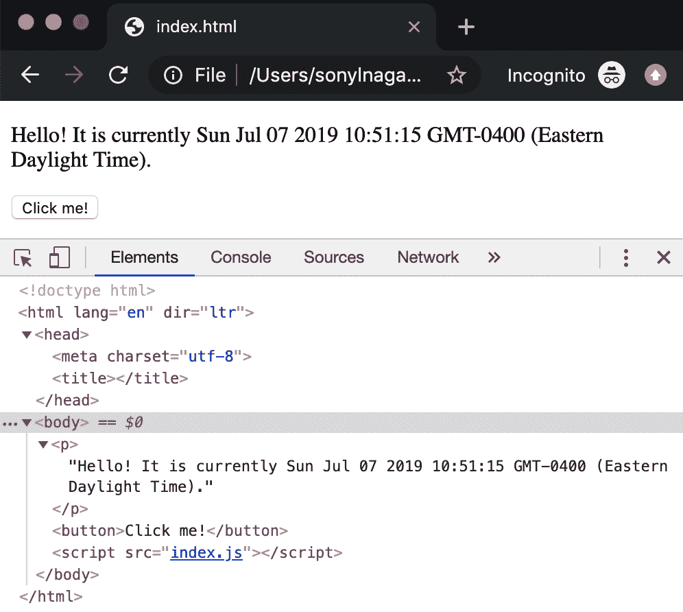
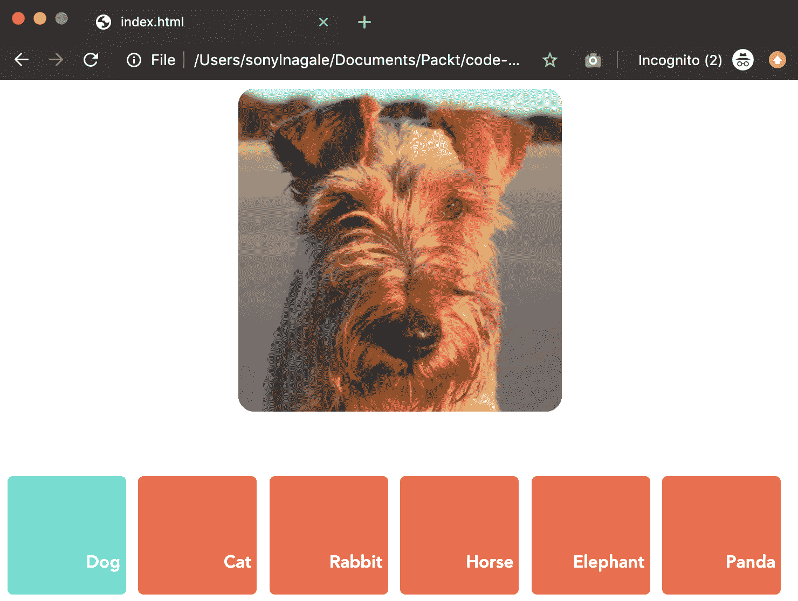
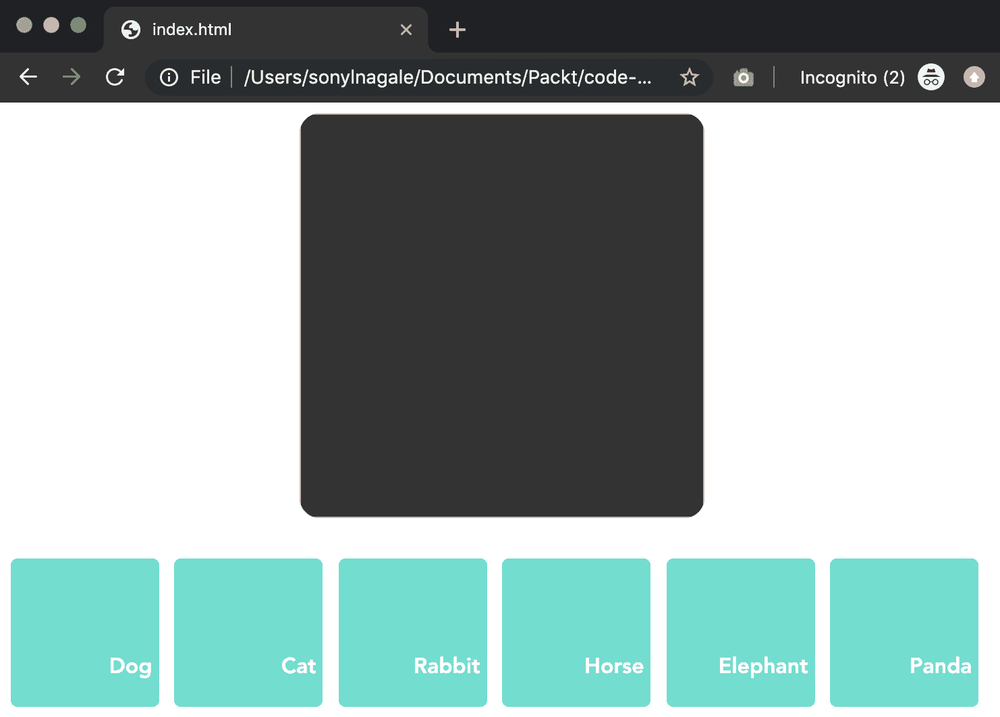

# 第六章：文档对象模型（DOM）

**文档对象模型**（**DOM**）是浏览器暴露给 JavaScript 的 API，允许 JavaScript 与 HTML 和间接与 CSS 进行通信。由于 JavaScript 的主要能力之一是动态更改页面上的内容，我们应该知道如何做到这一点。这就是 DOM 的作用。

在本章中，我们将学习如何使用这个强大的 API 来读取和更改页面上的内容。我相信你已经看到过不需要重新加载页面就可以更改内容的网站。这些程序使用*DOM 操作*，我们将学习如何使用它。

本章将涵盖以下主题：

+   选择器

+   属性

+   操作

# 技术要求

确保在`Chapter-6`目录中有[`github.com/PacktPublishing/Hands-on-JavaScript-for-Python-Developers`](https://github.com/PacktPublishing/Hands-on-JavaScript-for-Python-Developers) 存储库方便使用。

# 使用选择器

到目前为止，我们只使用了`console.log`和警报和提示来输入和输出信息。虽然这些方法对于测试很有用，但并不是你在日常生活中会使用的。我们使用的大多数 Web 应用程序，从搜索到电子邮件，都使用 DOM 与用户交互以获取输入和显示信息。让我们看一个小例子：[`github.com/PacktPublishing/Hands-on-JavaScript-for-Python-Developers/tree/master/chapter-6/hello`](https://github.com/PacktPublishing/Hands-on-JavaScript-for-Python-Developers/tree/master/chapter-6/hello)。

如果你在浏览器中打开 HTML，我们会看到一个非常简单的页面：


图 6.1 我们的基本页面

如果我们点击按钮，我们不会得到警报或控制台消息，而是会看到这个：


图 6.2 我们点击后页面的响应！

耶！这是我们第一个**DOM 操作**的实例。

## 解释 DOM 操作

让我们看看支持这个惊人示例的 JavaScript：

```js
document.querySelector('button').addEventListener('click', (e) => {
 document.querySelector('p').innerHTML = `Hello! It is currently ${
  new Date()}.`
})

```

首先要注意的是，我们正在操作`document`对象。`document`是 JavaScript 对浏览器页面的概念。记得我提到过 DOM 是浏览器暴露的 API 吗？这是你访问 DOM 的方式：`document`。

在我们分析 JavaScript 之前，让我们看看 DOM 和 HTML 有什么不同。这是我们页面的 HTML：

```js
<!DOCTYPE html>
<html lang="en" dir="ltr">

<head>
  <meta charset="utf-8">
  <title>Example</title>
</head>

<body>
  <p></p>
  <button>Click me!</button>
  <script src="index.js"></script>
</body>

</html>
```

如果我们现在使用控制台来检查元素而不是控制台，我们会看到这个：


图 6.3 我们页面的 DOM

如果你仔细观察并将这个截图与前面的 HTML 进行比较，你不会真的找到任何区别。然而，现在点击按钮，看看`<p>`标签会发生什么：



图 6.4 点击按钮后

啊！现在我们看到 HTML 和 DOM 之间的区别：在段落标签内添加了文本。如果我们重新加载页面，文本就会消失，我们又回到了起点。所以，我们看到的是什么都没有*在磁盘上*改变，只是*在内存中*改变。DOM 只存在于内存中。你可以在元素视图中通过更改值甚至删除整个**节点**来进行实验。节点是 DOM 对 HTML 标签的反映。你可能会听到*节点*和*标签*互换使用，但在使用 JavaScript 时，使用*节点*是一个好习惯，以保持与 JavaScript 的命名一致，我们稍后会看到。

回到我们的 JavaScript。到目前为止，我们已经讨论了`document`，它是 DOM 对 HTML 的内存解释。我们正在使用的`document`方法是一个强大的方法：`.querySelector()`。这个方法返回与我们传递给方法的参数的*第一个*匹配项。在这种情况下，我们要求`button`。由于页面上只有一个按钮，我们可以简单地使用标签名称。但是，`querySelector`比这更强大，因为我们也可以基于 CSS 选择器进行选择。例如，假设我们的按钮上有一个类，就像这样：

```js
<button class="clickme">Click me!</button>
```

然后我们可以这样访问按钮：

```js
document.querySelector('.clickme')
```

注意`clickme`前面的“`.`”，就像 CSS 选择器一样。同样，当访问具有 ID 的元素时，您将使用“`#`”。

现在我们已经可以访问我们的按钮，我们想对它做*一些*事情。在这种情况下，*一些*是指在点击按钮时采取行动。我们通过添加**事件监听器**来实现这一点。我们将在第七章中更深入地了解事件监听器，所以现在让我们只是浅尝辄止。

这是事件监听器的结构：


图 6.5 事件监听器结构

首先，我们的**事件目标**是我们要监听的节点；在这种情况下，我们的目标是按钮。然后我们使用`.addEventListener()`方法，并将`click`**事件**分配为我们要监听的事件。我们事件监听器的第二个参数是一个称为**事件处理程序**的函数。我们可以将实际的**事件对象**传递给我们的处理程序。事件处理程序通常不必是匿名的，但这是常见的做法，除非您需要为多个事件类型重复使用功能。我们的处理程序再次使用`querySelector`来定位`p`节点，并将其`innerHTML`属性设置为包含我们日期的字符串。

关于节点属性：节点的*属性*是 HTML 元素属性在 DOM 中的内存表示。这意味着有很多属性：`className`、`id`和`innerHTML`，只是举几个例子；当我们到达*属性*部分时，我们将更深入地了解它们。因此，这些代码行告诉浏览器：“嘿，当点击这个按钮时，将`p`标签的内容更改为这个字符串。”

现在我们已经俯视了这个问题，让我们深入研究涉及 DOM 操作的每个部分。

## 使用选择器

让我们考虑一个更复杂的页面。我们将打开一个示例页面，并使用为您提供的一些元素：

1.  在浏览器中打开[`github.com/PacktPublishing/Hands-on-JavaScript-for-Python-Developers/tree/master/chapter-6/animals`](https://github.com/PacktPublishing/Hands-on-JavaScript-for-Python-Developers/tree/master/chapter-6/animals)中的`index.html`：


图 6.6 动物页面

1.  如果您悬停在橙色按钮上，它将变为青绿色，并且当您单击它时，页面顶部的黑色框将显示动物：



图 6.7 选择的动物

1.  花一分钟玩一下页面，观察它的行为。还要尝试悬停在照片上；会发生什么？

现在让我们来看看 JavaScript。再次，它非常简单，但是我们的故事中有一些新的字符：

```js
01: const images = {
02:   'path': 'images/',
03:   'dog': 'dog.jpg',
04:   'cat': 'cat.jpg',
05:   'elephant': 'elephant.jpg',
06:   'horse': 'horse.jpg',
07:   'panda': 'panda.jpg',
08:   'rabbit': 'rabbit.jpg'
09: }
10: 
11: const buttons = document.querySelectorAll('.flex-item');
12: 
13: buttons.forEach((button) => {
14:   button.addEventListener('click', (e) => {
15:     document.querySelector('img').src = 
         `${images.path}${images[e.target.id]}`
16:   })
17: })
18: 
19: document.querySelector('#image').addEventListener('mouseover', (e) => {
20:   alert(`My favorite picture is ${e.target.src}`)
21: })
```

第 1-9 行包含一个数据存储对象。太棒了！我们在第五章中已经介绍了这种用法，*你的第一个应用程序：你好，世界！以及更多*。

第 11 行介绍了使用选择器的一种新方法：`.querySelectorAll()`。如前所述，当我们使用`.querySelector()`时，我们会得到与我们查询匹配的*第一个*项目。这种方法将返回所有匹配节点的数组。然后，我们可以在第 13 行对它们进行迭代，为每个节点添加一个点击处理程序。在第 15 行，我们定义了我们事件处理程序中的*发生了什么*：将唯一`img`节点的源设置为来自我们数据对象的路径和图像源的连接。

但等等！`e.target`是什么？我们将在第七章 *事件、事件驱动设计和 API*中深入探讨事件，但现在只需要知道`e.target`是*事件目标的 DOM 节点*。因此，在这个例子中，我们正在遍历所有`.flex-item`类的 DOM 节点。在每个节点上，我们正在分配一个事件处理程序，因此`e.target`等于 DOM 节点，`e.target.id`等于其`id`的 HTML 属性。

太棒了。让我们看看第 19 行，我们正在做类似的事情，但这次使用 CSS 选择器`id`——`image`。看一下 HTML：

```js
 <div class="flex-header"></div>
```

我们看到标签上有一个`image`的 ID，这意味着我们的 DOM 节点也会有这个 ID。现在，当我们移动（或悬停）在图像上时，我们将收到一个警报消息，说明图像文件的本地路径。

如果你对 CSS 不太熟悉，现在你可能会问自己：但是用 JavaScript 把橙色框变成蓝绿色的代码在哪里？哈！这是个陷阱问题！让我们看一下`style.css`文件中的 45-48 行：

```js
.flex-item:hover {
  cursor: pointer;
  background-color: turquoise;
}
```

如果你注意到了项目上的`：hover`伪类，我们可以看到改变光标从箭头到手的 CSS 规则（在大多数用户界面中表示可点击性），以及背景颜色的改变。惊喜！

这不是一本关于 CSS 的书；相反，我们将尽量避免过多的样式依赖。然而，重要的是要注意，通常 CSS 允许我们对 HTML 元素的一些表现方面进行更改。但是我们为什么要在意呢？毕竟，我们正在写*JavaScript*。答案很简单：计算开销。通过 JavaScript 修改元素比通过 CSS 更*昂贵*（也就是说，需要更多的处理能力）。如果你正在操作不需要逻辑的 CSS 属性，请尽可能使用 CSS。但是，如果你需要逻辑（比如在我们的例子中将变量拼接到显示图像中），那么 JavaScript 是正确的选择。

## 使用其他选择器

重要的是要注意，在 ES6 和 HTML5 的一部分之前，`querySelector`和`querySelectorAll`被标准化之前，有其他更常见的选择器，你肯定会在实际中遇到它们。其中一些包括`getElementById`、`getElementsByClassName`和`getElementsByTagName`。现在使用`querySelector`的变体被认为是标准做法，但是和所有 JavaScript 一样，有一个警告：从技术上讲，`querySelector`方法比`getElement`风格的方法稍微昂贵一点。通常情况下，与`querySelector`方法的强大和灵活性相比，这种开销是可以忽略的，但在处理大页面时，这是需要记在心里的事情。

现在，让我们看一看在选择了元素之后我们可以改变*什么*。这些是元素的**属性**。

# 属性

我们已经处理了一些属性：节点的`innerHTML`，图像的`src`和节点的`id`。我们有大量可用的属性，所以让我们来看看 CSS 是如何与 JavaScript 结合的。

光是为了论证，让我们把我们的动物程序改成使用 JavaScript 来改变目标的背景颜色，而不是 CSS（[`github.com/PacktPublishing/Hands-on-JavaScript-for-Python-Developers/tree/master/chapter-6/animals-2`](https://github.com/PacktPublishing/Hands-on-JavaScript-for-Python-Developers/tree/master/chapter-6/animals-2)）：

```js
const images = {
  'path': 'images/',
  'dog': 'dog.jpg',
  'cat': 'cat.jpg',
  'elephant': 'elephant.jpg',
  'horse': 'horse.jpg',
  'panda': 'panda.jpg',
  'rabbit': 'rabbit.jpg'
}

const buttons = document.querySelectorAll('.flex-item');

buttons.forEach((button) => {
  button.addEventListener('mouseover', (e) => {
    e.target.style.backgroundColor = 'turquoise'
  })
  button.addEventListener('click', (e) => {
    document.querySelector('img').src = 
     `${images.path}${images[e.target.id]}`
  })
})

document.querySelector('#image').addEventListener('mouseover', (e) => {
  alert(`My favorite picture is ${e.target.src}`)
})
```

如果我们检查我们的 mouseover 处理程序，我们可以注意到两件事：

+   事件的名称是`mouseover`，而不是`hover`。稍后再详细讨论。

+   我们正在修改目标的样式属性，但名称是`backgroundColor`，而不是 CSS 中的`background-color`。

CSS 中属性的驼峰命名规则在 JavaScript 中也是标准的。在实践中，这可能看起来有点违反直觉，因为你不必使用括号表示法和引号来处理属性名称中的连字符（这将被解释为无效的减法语句）。

然而，现在让我们运行程序并悬停在所有框上。你看到颜色从一种颜色变成另一种颜色了吗，就像这样吗？



图 6.8 所有的框都改变了！

是的，如果你猜到我们没有包括一个“重置”处理程序，你是对的。我们可以用`mouseout`事件来做到这一点。然而，你看到当你可以使用 CSS 时使用 CSS 是有道理的吗？

当然，没有必要记住 DOM 节点上可用的各种属性，但`id`、`className`、`style`和`dataset`可能是最有用的。

你问的这个`dataset`属性是什么？你可能不熟悉 HTML 中的数据属性，但它们非常方便。考虑 MDN 中的这个例子：

```js
<article id="electric-cars" data-columns="3" data-index-number="12314" data-parent="cars"> ... </article>
```

当你的后端可以将标记插入到 HTML 中，但与 JavaScript 分离时（几乎总是如此，并且可以说是你的结构应该被架构化的方式），`data-`属性就非常方便。要访问`article`的`data-index-number`，我们使用这个：

```js
article.dataset.indexNumber // "12314"
```

再次注意我们的驼峰命名法和`.dataset.`的新用法，而不是`data-`。

我们现在知道足够多的知识来对我们的元素进行更多的激动人心的工作。我们可以用选择器来定位元素并读取元素的属性。接下来，让我们看看**操作**。

# 操作

在使用 JavaScript 通过 DOM 工作时，我们不仅可以读取，还可以*操作*这些属性。让我们通过制作一个小程序来练习操作属性：便利贴创建者。

## 便利贴创建者

我们将制作一个便利贴创建者，它接受颜色和消息，并将带有序号的彩色框添加到 DOM 中。我们的最终产品可能看起来像这样：


图 6.9 最终产品

看一下起始代码：[`github.com/PacktPublishing/Hands-on-JavaScript-for-Python-Developers/tree/master/chapter-6/stickies/starter-code`](https://github.com/PacktPublishing/Hands-on-JavaScript-for-Python-Developers/tree/master/chapter-6/stickies/starter-code)。 [](https://github.com/PacktPublishing/Hands-on-JavaScript-for-Python-Developers/tree/master/chapter-6/stickies/starter-code)

你的目标是重新创建这个功能。这里有两种我们还没有涵盖的方法供你研究：

+   `document.createElement()`

+   `container.appendChild()`

## 解决方案代码

你做得怎么样？让我们看看解决方案代码：

```js
const container = document.querySelector('.container') // set .container to a variable so we don't need to find it every time we click
let noteCount = 1 // inital value

// access our button and assign a click handler
document.querySelector('.box-creator-button').addEventListener('click', () => {
  // create our DOM element
  const stickyNote = document.createElement('div')

  // set our class name
  stickyNote.className = 'box'

  // get our other DOM elements
  const stickyMessage = document.querySelector('.box-color-note')
  const stickyColor = document.querySelector('.box-color-input')

  // get our variables
  const message = stickyMessage.value
  const color = stickyColor.value

  // blank out the input fields
  stickyMessage.value = stickyColor.value = ''

  // define the attributes
  stickyNote.innerHTML = `${noteCount++}. ${message}`
  stickyNote.style.backgroundColor = color

  // add the sticky
  container.appendChild(stickyNote)
})
```

好了！其中一些行不应该是一个谜，但最有趣的是第 7 行（`const stickyNote = document.createElement('div')`）和第 28 行（`container.appendChild(stickyNote)`）。正如之前提到的，这是你需要研究的两种方法，以完成这个程序。第 7 行正在创建一个 DOM 节点——在内存中！我们可以对它进行操作，比如添加内容和样式，然后在第 28 行将其添加到 DOM 中。

# 总结

耶，我们终于进入了 DOM 并对其进行了操作！恭喜你迄今为止的成就！

现在，我们可以通过 JavaScript 动态地改变页面上的内容，而不仅仅是使用警报和控制台消息。以下是我们学到的内容的概述：

+   `querySelector`和`querySelectorAll`是我们进入 DOM 的神奇领域的门户。

+   DOM 只存在于内存中，作为 HTML 在页面加载时的动态表示。

+   这些方法的选择器将使用 CSS 选择器；旧方法不会。

+   节点的属性可以更改，但术语不同。

在下一章中，我们将更多地使用*events*。事件是 JavaScript 程序的核心，让我们学习它们的结构和用法。

# 问题

考虑以下代码：

```js
  <button>Click me!</button>
```

回答以下问题：

1.  选择按钮的正确语法是什么？

1.  `document.querySelector('点击我！')`

1.  `document.querySelector('.button')`

1.  `document.querySelector('#button')`

1.  `document.querySelector('button')`

看看这段代码：

```js
<button>Click me!</button>
<button>Click me two!</button>
<button>Click me three!</button>
<button>Click me four!</button>
```

回答以下问题：

1.  真或假：`document.querySelector('button')` 将满足我们对每个按钮放置点击处理程序的需求。

1.  正确

1.  错误

1.  要将按钮的文本从“点击我！”更改为“先点击我！”，我们应该使用什么？

1.  `document.querySelectorAll('button')[0].innerHTML = "先点击我！"`

1.  `document.querySelector('button')[0].innerHTML = "先点击我！"`

1.  `document.querySelector('button').innerHTML = "先点击我！"`

1.  `document.querySelectorAll('#button')[0].innerHTML = "先点击我！"`

1.  我们可以使用什么方法来添加另一个按钮？

1.  `document.appendChild('button')`

1.  `document.appendChild('<button>')`

1.  `document.appendChild(document.createElement('button'))`

1.  `document.appendChild(document.querySelector('button'))`

1.  我们如何将第三个按钮的类更改为`third`？

1.  `document.querySelector('button')[3].className = 'third'`

1.  `document.querySelectorAll('button')[2].className = 'third'`

1.  `document.querySelector('button[2]').className = 'third'`

1.  `document.querySelectorAll('button')[3].className = 'third'`

# 进一步阅读

有关更多信息，您可以参考以下链接：

+   MDN：*Document* *Object Model (DOM)*：[`developer.mozilla.org/en-US/docs/Web/API/Document_Object_Model`](https://developer.mozilla.org/en-US/docs/Web/API/Document_Object_Model)

+   MDN：*Document.createElement()*：[`developer.mozilla.org/en-US/docs/Web/API/Document/createElement`](https://developer.mozilla.org/en-US/docs/Web/API/Document/createElement)

+   MDN：*Node.appendChild()*：[`developer.mozilla.org/en-US/docs/Web/API/Node/appendChild`](https://developer.mozilla.org/en-US/docs/Web/API/Node/appendChild)
