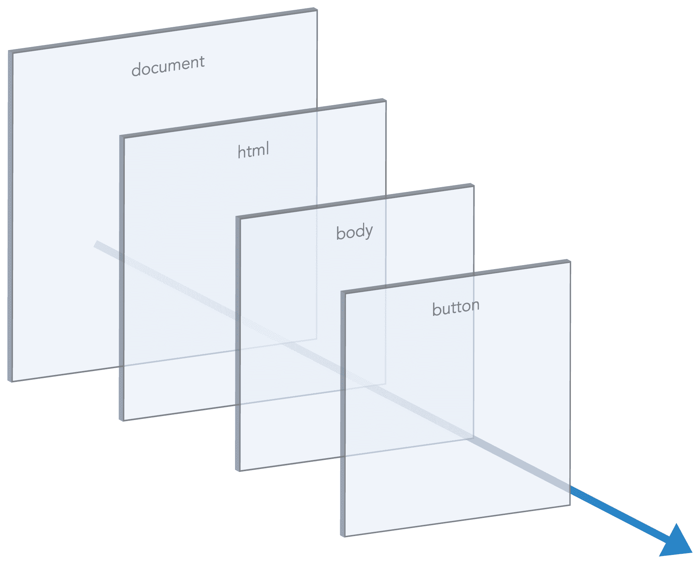
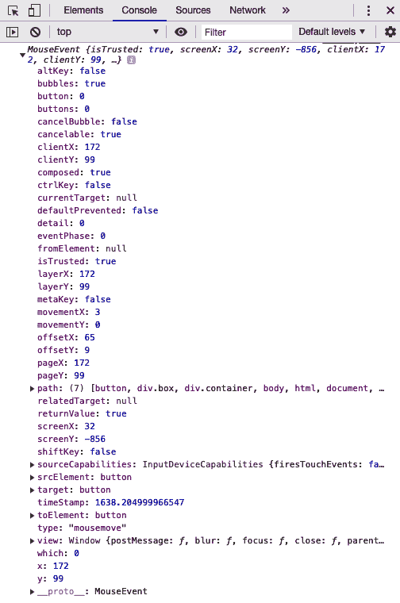

事件，事件驱动设计和 API

在前端应用的核心是*事件*。JavaScript 允许我们监听并对用户和浏览器事件做出反应，以直观地改变用户内容，从而创建优雅的用户界面和体验。我们需要知道如何使用这些被抛出的数据包。浏览器事件是我们的基础 - 它们使我们不仅仅拥有静态应用，而是动态的！通过理解事件，您将成为一个完整的 JavaScript 开发人员。

本章将涵盖以下主题：

+   事件生命周期

+   捕获事件并读取其属性

+   使用 Ajax 和事件来填充 API 数据

+   处理异步性

# 第十章：技术要求

准备好使用存储库的`Chapter-7`目录中提供的代码：[`github.com/PacktPublishing/Hands-on-JavaScript-for-Python-Developers/tree/master/chapter-7`](https://github.com/PacktPublishing/Hands-on-JavaScript-for-Python-Developers/tree/master/chapter-7)。

# 事件生命周期

当 JavaScript 中发生事件时，它不仅仅发生并消失 - 它经历了一个*生命周期*。这个生命周期有三个阶段：

+   **捕获**阶段

+   **目标**阶段

+   **冒泡**阶段

考虑以下 HTML：

```js
<!doctype html>
<html>

<head>
  <title>My great page</title>
</head>

<body>
  <button>Click here</button>
</body>

</html>
```

我们可以将其可视化如下：


图 7.1 - 事件生命周期

现在，还有一件重要的事情需要考虑，那就是事件发生时不仅仅影响到确切的目标，而是整个对象堆栈。在描述捕获、目标和冒泡之前，看一下我们代码的以下表示：



图 7.2 - 事件分层

如果我们把我们的页面想象成一个分层蛋糕，我们可以看到这个事件（由箭头表示）必须通过我们 DOM 的所有层才能到达按钮。这是我们的**捕获**阶段。当按钮被点击时，事件被*派发*到事件流中。首先，事件查看文档对象。然后它穿过 DOM 的各层直到到达预定目的地：按钮。

现在事件已经到达按钮，我们开始**目标**阶段。事件应该从按钮中捕获的任何信息都将被收集，比如事件类型（比如点击或鼠标悬停）和其他细节，比如光标的*X*/*Y*坐标。

最后，事件在冒泡阶段返回到文档的各层。**冒泡**阶段允许我们通过其父元素在*任何*元素上处理事件。

让我们在实践中看看并稍微玩一下我们的事件。找到以下目录并在浏览器中打开`index.html` - [`github.com/PacktPublishing/Hands-on-JavaScript-for-Python-Developers/tree/master/chapter-7/events`](https://github.com/PacktPublishing/Hands-on-JavaScript-for-Python-Developers/tree/master/chapter-7/events)：


图 7.3 - 事件游乐场

如果我们看一下这个页面并玩几分钟，我们会看到一些东西：

+   右侧的*X*/*Y*坐标将随着我们在页面上移动鼠标而改变。

+   当我们打开控制台时，它将显示有关我们的点击事件以及发生在哪个*阶段*的消息。

让我们看看`index.js`中的代码，网址是[`github.com/PacktPublishing/Hands-on-JavaScript-for-Python-Developers/blob/master/chapter-7/events/index.js`](https://github.com/PacktPublishing/Hands-on-JavaScript-for-Python-Developers/blob/master/chapter-7/events/index.js)。

从 1 到 5 行，我们只是设置了一个数据对象，将数字代码映射到一个字符串。到目前为止，一切都很顺利。现在，让我们看看第 32 行，那里写着`document.querySelector('html').addEventListener('click', logClick, true)`。这个可选的布尔参数对我们来说是新的；当它放入事件监听器中时，它只是表示“让我在*捕获*阶段监听”。因此，当我们在页面的任何地方点击时，我们将得到一个点击事件，其中包含信息点击事件在 HTML 上的捕获阶段触发。这个事件之前在未定义处被处理，因为这是对这个事件的第一次遭遇。它还没有冒泡或被定位。

让我们在下一节继续剖析这个例子，了解代码中这些神秘的部分。

# 捕获事件并读取其属性

我们将继续使用我们的`events`游乐场代码：[`github.com/PacktPublishing/Hands-on-JavaScript-for-Python-Developers/blob/master/chapter-7/events/index.js`](https://github.com/PacktPublishing/Hands-on-JavaScript-for-Python-Developers/blob/master/chapter-7/events/index.js)。

在 32-34 行，我们注册了三个点击事件监听器，如下所示：

```js
document.querySelector('html').addEventListener('click', logClick, true)
document.querySelector('body').addEventListener('click', logClick)
document.querySelector('button').addEventListener('click', logClick)
```

正如我们讨论过的，第一个事件监听在捕获阶段，因为我们包括了最后的布尔参数。

我们还有三个`mousemove`事件在 16-29 行。让我们看看其中一个：

```js
document.querySelector('button').addEventListener('mousemove', (e) => {
  document.querySelector('#x').value = e.x
  document.querySelector('#y').value = e.y
})
```

我希望大部分都是有意义的-我们正在使用一个新的事件类型`mousemove`，所以这个事件表示“当用户的鼠标移过按钮时，执行这段代码。”就是这么简单。我们要执行的代码是将 ID 为`x`和`y`的输入的值设置为*事件的 x 和 y 值*。这就是事件对象的魔力所在：它携带了*很多*信息。继续在这个函数内添加一行`console.log(e)`，看看记录了什么，如下面的截图所示：


图 7.4-记录事件

正如预期的那样，每当你的鼠标移动到“点击这里”上时，事件就会触发，并且鼠标事件被记录下来。打开其中一个事件。你会看到类似于以下内容：



图 7.5-鼠标事件

在这里，我们看到了关于事件的大量信息，包括（如预期的那样）我们鼠标在那个时候的*X*和*Y*坐标。这些属性中的许多将会很有用，但特别要注意的是`target`。事件的目标是我们放置事件监听器的节点。从`target`属性中，我们可以得到它的 ID，如果我们有一个事件处理程序用于多个节点，这将会很有用。

你还记得我们在第六章中的便利贴程序，*文档对象模型（DOM）*吗？现在让我们来增强它。

## 重新审视便利贴

让我们从第六章中的便利贴程序*文档对象模型（DOM）*中更仔细地看一下：[`github.com/PacktPublishing/Hands-on-JavaScript-for-Python-Developers/tree/master/chapter-7/stickies/starter-code`](https://github.com/PacktPublishing/Hands-on-JavaScript-for-Python-Developers/tree/master/chapter-7/stickies/starter-code)，并包括创建模态窗口的能力，当点击时显示有关便利贴的信息，并能够删除该便利贴，如下面的截图所示：


图 7.6-新的和改进的便利贴创建者

要成功编写这段代码，你需要使用一个新的 DOM 操作方法：`.remove()`。查看[`developer.mozilla.org/en-US/docs/Web/API/ChildNode/remove`](https://developer.mozilla.org/en-US/docs/Web/API/ChildNode/remove)获取文档。你可能还想看一下`visibility`的 CSS 属性来显示和隐藏模态窗口。

只是为了好玩，我还包括了一个小的 JavaScript 库，用于将颜色选择器用于便利贴颜色字段，作为包含第三方代码的简单示例。您不需要对`jscolor.js`脚本做任何操作；它将自动工作。

## 便利贴 - 解决方案 1

您是否得到了类似以下代码的东西？

```js
01: const container = document.querySelector('.container') // set 
    .container to a variable so we don't need to find it every time 
     we click
02: let noteCount = 1 // inital value
03: const messageBox = document.querySelector('#messageBox')
04: 
05: // access our button and assign a click handler
06: document.querySelector('.box-creator-button').addEventListener(
    'click', () => {
07:   // create our DOM element
08:   const stickyNote = document.createElement('div')
09: 
10:   // set our class name
11:   stickyNote.className = 'box'
12: 
13:   // get our other DOM elements
14:   const stickyMessage = document.querySelector('.box-color-note')
15:   const stickyColor = document.querySelector('.box-color-input')
16: 
17:   // get our variables
18:   const message = stickyMessage.value
19:   const color = stickyColor.style.backgroundColor
20: 
21:   // blank out the input fields
22:   stickyMessage.value = stickyColor.value = ''
23:   stickyColor.style.backgroundColor = '#fff'
24: 
25:   // define the attributes
26:   stickyNote.innerHTML = `${noteCount++}. ${message}`
27:   stickyNote.style.backgroundColor = color
28: 
29:   stickyNote.addEventListener('click', (e) => {
30:     document.querySelector('#color').innerHTML = 
        e.target.style.backgroundColor
31:     document.querySelector('#message').innerHTML = e.target.innerHTML
32: 
33:     messageBox.style.visibility = 'visible'
34: 
35:     document.querySelector('#delete').addEventListener('click', (event) => {
36:       messageBox.style.visibility = 'hidden'
37:       e.target.remove()
38:     })
39:   })
40: 
41:   // add the sticky
42:   container.appendChild(stickyNote)
43: })
44: 
45: document.querySelector('#close').addEventListener('click', (e) => {
46:   messageBox.style.visibility = 'hidden'
47: })
```

您可以在 GitHub 上找到这个代码文件：[`github.com/PacktPublishing/Hands-on-JavaScript-for-Python-Developers/tree/master/chapter-7/stickies/solution-code-1`](https://github.com/PacktPublishing/Hands-on-JavaScript-for-Python-Developers/tree/master/chapter-7/stickies/solution-code-1)。

这里有一些有趣的部分，比如我们的便利贴单击处理程序从第 29 行开始。大部分内容应该看起来很熟悉，只是增加了一些新的内容。首先，单击处理程序使用事件的目标属性来使用目标的属性设置消息框中的文本。我们不必在 DOM 中搜索以查找我们的属性。事实上，当事件对象已经将信息传递给我们时，这样做将是昂贵和浪费的操作。第 33 行修改了模态窗口的 CSS 以显示它，第 37 行在模态的删除按钮被单击时删除了便利贴。

这个效果相当不错！但是，由于事件生命周期的特性，我们可以使用另一个事件的特性来使我们的代码更加高效：*事件委托*。

## 便利贴 - 解决方案 2 - 事件委托

**事件委托**的原则是在父事件上注册一个事件监听器，让事件传播告诉我们哪个元素被点击了。还记得我们的事件生命周期图和事件传播的层次吗？我们可以利用这一点。看一下第 37 行，如下所示：

```js
container.addEventListener('click', (e) => {
 if (e.target.className === 'box') {
   document.querySelector('#color').innerHTML = 
    e.target.style.backgroundColor
   document.querySelector('#message').innerHTML = e.target.innerHTML
   messageBox.style.visibility = 'visible'
   document.querySelector('#delete').addEventListener('click', (event) => {
     messageBox.style.visibility = 'hidden'
     e.target.remove()
   })
 }
})
```

您可以在 GitHub 上找到这段代码：[`github.com/PacktPublishing/Hands-on-JavaScript-for-Python-Developers/blob/master/chapter-7/stickies/solution-code-2/script.js#L37`](https://github.com/PacktPublishing/Hands-on-JavaScript-for-Python-Developers/blob/master/chapter-7/stickies/solution-code-2/script.js#L37)。

在这段代码中，我们已经将点击监听器的附加从便利贴创建逻辑中移除，并将其抽象为附加到整个容器。当单击`container`时，我们检查目标是否具有`box`作为其类。如果是，我们执行我们的逻辑！这是事件监听器更有效的使用，特别是在动态创建的元素上使用时。有些情况下，事件委托将是您的最佳选择，有时任何一种都可以。

但现在我们有另一个问题：每次单击便利贴时，都会向删除按钮添加一个新的单击处理程序。这并不是很高效。看看是否可以重构代码以消除这个问题。

## 便利贴 - 解决方案 3

这是一个可能的解决方案：

```js
let target = {}

...

container.addEventListener('click', (e) => {
  if (e.target.className === 'box') {
    document.querySelector('#color').innerHTML = 
     e.target.style.backgroundColor
    document.querySelector('#message').innerHTML = e.target.innerHTML
    messageBox.style.visibility = 'visible'
    target = e.target
  }
})

document.querySelector('#delete').addEventListener('click', (event) => {
  messageBox.style.visibility = 'hidden'
  target.remove()
})
```

您可以在 GitHub 上找到这个解决方案：[`github.com/PacktPublishing/Hands-on-JavaScript-for-Python-Developers/blob/master/chapter-7/stickies/solution-code-3/script.js`](https://github.com/PacktPublishing/Hands-on-JavaScript-for-Python-Developers/blob/master/chapter-7/stickies/solution-code-3/script.js)。

虽然这使用了一个全局变量，但它仍然更高效。通过将整个程序封装在一个函数或类中，我们可以消除全局变量，但这对于这个概念来说并不重要。

现在是时候看一下 Ajax 以及事件如何与程序的生命周期联系起来了。让我们做一个实验！

# 使用 Ajax 和事件来填充 API 数据

让我们把所有东西都放在一起。在这个实验中，我们将使用 PokéAPI 创建一个简化的宝可梦游戏：[`pokeapi.co/`](https://pokeapi.co/)。

这就是我们的游戏最终的样子：[`sleepy-anchorage-53323.herokuapp.com/`](https://sleepy-anchorage-53323.herokuapp.com/)。请打开网站并尝试一下功能。

请抵制诱惑，暂时不要查看已完成的 JavaScript 文件。

这是当您访问上述 URL 并开始玩游戏时会看到的屏幕截图：


图 7.7 – 宝可梦游戏

所有的 HTML 和 CSS 都已经为您提供。您将在`main.js`文件中工作：[`github.com/PacktPublishing/Hands-on-JavaScript-for-Python-Developers/tree/master/chapter-7/pokeapi/starter-code`](https://github.com/PacktPublishing/Hands-on-JavaScript-for-Python-Developers/tree/master/chapter-7/pokeapi/starter-code)。

如果您不熟悉宝可梦，不用担心！这个游戏的逻辑很基本。（如果您熟悉这些游戏，请原谅这种简化的方法。）

这是我们将要做的事情：

1.  查询 PokéAPI 以获取所有可用的宝可梦。

1.  使用 API 提供的宝可梦名称和 API URL 的值填充选择列表。

1.  完成后，切换 CSS 属性以显示玩家的选择。

1.  允许每个玩家选择他们的宝可梦。

1.  为每个玩家创建功能，让他们使用自己宝可梦的招式对抗对方。

1.  根据从最大可能力量生成的随机数减少另一个玩家的宝可梦生命值。

1.  显示叠加文本，指出它是有效的。

1.  如果招式没有力量属性，显示叠加，表示它不起作用。

1.  当一个宝可梦的生命值为`0`或更低时，显示对手已经晕倒的叠加。

让我们逐步分解起始代码。

## 起始代码

让我们逐步看一下起始代码，因为它引入了我们的 JavaScript 的一个新的构造：类！如果您熟悉 Python 或其他语言中的类，这个 ES6 的介绍将是对 JavaScript 使用的一个受欢迎的提醒。让我们开始：

```js
class Poke {
  ...
}
```

首先，在 JavaScript ES6 中声明一个类时，我们只是创建一个对象！现在，对象的细节与我们习惯的有些不同，但许多原则是相同的。要创建类的实例，我们可以在完成类代码后说`const p = new Poke()`。

之后，有一些类的语法糖，比如构造函数、getter 和 setter。随意研究 JavaScript 中的类，因为它将帮助您实现整体目标。

我已经为您提供了构造函数的起始部分，当您创建一个类的实例时，它将被执行：

```js
constructor() {
    /**
      * Use the constructor as you would in other languages: Set up your 
        instance variables and globals
      */
  }
```

您的构造函数可能需要什么？也许您想要对经常使用的 DOM 元素或事件处理程序进行引用？然后，当然，问题就出现了：我们如何*引用*我们创建的变量？

答案是`this`。当使用一个全局变量到类时，您可以在`this.<variableName>`之前加上它，它将对所有方法可用。这里的好处是：它不是我们整个页面的纯全局变量，而只是我们类的全局变量！如果您回忆一下之前的一些代码示例，我们没有处理那一部分；这是一种处理的方法：

```js
choosePokemon(url, parent) {
…
const moves = data.moves.filter((move) => {
  const mymoves = move.version_group_details.filter((level) => {
    return level.level_learned_at === 1
  })
  return mymoves.length > 0
 })
}
```

由于每个宝可梦在游戏的不同阶段学习多个招式，这是在游戏开始时找到可用招式的逻辑。您不必修改它，但是看一下数组的`.filter()`方法。我们之前没有涉及它，但这是一个有用的方法。MDN 是一个很好的资源：[`developer.mozilla.org/en-US/docs/Web/JavaScript/Reference/Global_Objects/Array/filter`](https://developer.mozilla.org/en-US/docs/Web/JavaScript/Reference/Global_Objects/Array/filter)。

我们感兴趣的代码的下一部分是**setter**：

```js
set hp(event) {
  ...
  if (event.hp) {
    this[event.player].hp = event.hp
  }

  if (event.damage) {
    this[event.player].hp -= event.damage
  }
  const e = new CustomEvent("hp", {
    detail: {
      player: event.player,
      hp: this[event.player].hp
    }
  })
  document.dispatchEvent(e)
}
```

**setter**是一个处理设置或更改成员变量的类方法。通常与**getter**一起使用，这个概念允许我们在更改（或检索）变量时抽象出所需的操作逻辑。在这种情况下，我们使用一些游戏逻辑来看待生命值。但是然后我们进入了一个新的、美妙的想法：自定义事件。

## 自定义事件

使用`new CustomEvent()`指令，我们可以创建一个新的命名事件在我们的程序中使用。有时，用户交互或页面行为并不能完全满足我们的需求。自定义事件可以帮助满足这种需求。请注意在前面的代码中，`detail`对象包含要传递的事件数据，我们使用`document.dispatchEvent()`将其发送到事件流中。创建自定义事件的事件监听器与使用内置事件一样：使用`.addEventListener()`。我们将要使用`doMove()`函数。

## 解决方案代码

您尝试得怎么样？您可以在这里看到解决实验室的一种可能方式：[`github.com/PacktPublishing/Hands-on-JavaScript-for-Python-Developers/tree/master/chapter-7/pokeapi/solution-code`](https://github.com/PacktPublishing/Hands-on-JavaScript-for-Python-Developers/tree/master/chapter-7/pokeapi/solution-code)。

记住，解决编程问题有多种方法，所以如果您的解决方案与提供的方法不匹配，也没关系！主要目的是解决问题。

# 处理异步性

正如我们在使用 API 时所看到的，Ajax 调用的异步性需要一些创造性的方法。在我们的宝可梦游戏中，我们在调用完成时使用了加载旋转器；这是您在现代网络上到处都能看到的方法。让我们看一个游戏中的例子：

```js
toggleLoader() {
  /**
    * As this is visual logic, here's the complete code for this function
    */
  if (this.loader.style.visibility === 'visible' || 
  this.loader.style.visibility === '') {
    this.loader.style.visibility = 'hidden'
  } else {
    this.loader.style.visibility = 'visible'
  }
}
```

*这*部分代码所做的只是切换包含旋转图像的图层的可见性。这都是在 CSS 中（因为它不是技术上的图像，而是 CSS 动画）。让我们看看它是如何使用的：

```js
getPokemon() {
    fetch('https://pokeapi.co/api/v2/pokemon?limit=1000')
      .then((response) => {
        return response.json()
      })
      .then((data) => {
        const pokeSelector = document.querySelector('.pokeSelector.main')

        data.results.forEach((poke) => {
          const option = document.createElement('option')
          option.value = poke.url
          option.innerHTML = poke.name
          pokeSelector.appendChild(option)
        })

        const selector = pokeSelector.cloneNode(true)
        document.querySelector('.pokeSelector.clone').replaceWith(selector)

        this.toggleLoader()

        document.querySelector('#Player1').style.visibility = 'visible'
        document.querySelector('#Player2').style.visibility = 'visible'
      })
  }
```

在这里，我们看到在我们的异步 Promise 调用中使用`.then()`时，当一切都完成时切换加载程序！这是一个很好的小捆绑。如果您想复习如何使用`fetch`和一般的 Ajax 调用，请回顾一下第四章，*数据和您的朋友，JSON*，在*来自前端的 API 调用 - Ajax*部分。

在处理 Ajax 调用固有的异步特性时，重要的是要记住我们不知道调用何时会返回其数据，甚至*是否*会返回！我们可以通过**错误处理**使我们的代码更好。

## 错误处理

看一下这段代码：

```js
fetch('/profile')
  .then(data => {
    if (data.status === 200) {
      return data.json()
    }
    throw new Error("Unable to get Profile.")
  })
  .then(json => {
    console.log(json)
  })
  .catch(error => {
    alert(error)
  })
```

我们在这里有一些常见的嫌疑人：一个`fetch`调用和`.then()`处理我们的结果。现在，看一下`new Error()`和`.catch()`。就像大多数语言一样，JavaScript 有一种明确抛出错误的方法，我们`fetch`链的末尾的`.catch()`将在警报框中向用户呈现错误。在您的 Ajax 调用中包含错误处理总是最佳实践，以防您调用的服务没有响应，没有及时响应或发送错误。我们将在第九章中更多地讨论错误，*解密错误消息和性能泄漏*。

## 星球大战 API 探索实验室

让我们通过一些 Ajax 调用来动手。我们将使用流行的**星球大战 API**（**SWAPI**）：[`swapi.dev/`](https://swapi.dev/)。花几分钟时间熟悉文档和 API 的工作原理。

这是我们将要构建的内容：


图 7.8 - 星球大战探索

您可以在[`packtpublishing.github.io/Hands-on-JavaScript-for-Python-Developers/chapter-7/swapi/solution-code/`](https://packtpublishing.github.io/Hands-on-JavaScript-for-Python-Developers/chapter-7/swapi/solution-code/)上尝试该功能的功能。在尝试重新创建功能之后，试着抵制浏览解决方案代码的诱惑。

我们的代码应该做到以下几点：

1.  在页面加载时显示加载程序。这个加载程序作为 CSS 动画为您提供。

1.  调用`/people` SWAPI 端点来检索 API 中的所有人。*提示：您需要多次调用 SWAPI 才能获取所有人。*

1.  用人们的名字填充选择列表并隐藏加载器。

1.  当点击 Go 时，再次调用 SWAPI 以检索有关所选人员的详细信息并显示它们（至少是姓名）。

我们的方法将首先填充列表，然后准备用户操作，以便探索同步链接事件和异步动作依赖于用户输入的情况。

起始 HTML 和 CSS 不应该需要更改，我们的起始 JavaScript 文件几乎是空的！您准备好挑战了吗？祝你好运！

### 一个解决方案

如果您查看解决方案代码，您会发现创建此功能的一种方法。让我们来分解一下。

就像在我们的宝可梦游戏中一样，我们将使用一个类。它的构造函数将存储一些各种信息，并添加一个事件侦听器到 Go 按钮：

```js
class SWAPI {
  constructor() {
    this.loader = document.querySelector('#loader')
    this.people = []

    document.querySelector('.go').addEventListener('click', (e) => {
      this.getPerson(document.querySelector('#peopleSelector').value)
    })
  }
```

接下来，我们知道我们将多次调用 SWAPI，我们可以创建一个帮助函数来简化这项工作。它可能需要四个参数：SWAPI API URL，先前结果的数组（如果我们正在分页的话很有用！），以及类似 Promise 的`resolve`和`reject`参数：

```js
  fetchThis(url, arr, resolve, reject) {
    fetch(url)
      .then((response) => {
        return response.json()
      })
      .then((data) => {
        arr = [...arr, ...data.results]
```

最后一行可能是新的。`…`是扩展运算符，它将数组展开为其各个部分。有了这个 ES6 功能，我们就不需要迭代数组来将其连接到另一个数组或进行任何其他重新分配的操作。我们可以简单地展开结果并将它们与现有结果连接起来：

```js
        if (data.next !== null) {
          this.fetchThis(data.next, arr, resolve, reject)
        } else {
          resolve(arr)
        }
```

在许多 API 中，如果数据集很大，只会返回有限的结果，并提供下一页和上一页数据的链接。 SWAPI 的命名规范指定`.next`是要查找的属性，如果有另一页的话。否则，我们可以在我们的`resolve`函数中返回我们的结果：

```js
      })
      .catch((err) => {
        console.log(err)
      })
```

不要忘记错误处理！

```js
  }

  getPeople() {
    new Promise((resolve, reject) => {
        this.fetchThis('https://swapi.dev/api/people', this.people, 
        resolve, reject)
      })
      .then((response) => {
        this.people = response
        const peopleSelector = document.querySelector('#peopleSelector')

        this.people.forEach((person) => {
          const option = document.createElement('option')
          option.value = person.url
          option.innerHTML = person.name
          peopleSelector.appendChild(option)
        })
        this.toggleLoader()
        document.querySelector('#people').style.visibility = 'visible'
      })
      .catch((err) => {
        console.log(err)
      })
  }
```

尝试完整阅读`getPeople()`，以了解它的功能。其中一些是简单的操作，但`new Promise()`是这个函数的核心。我们不是在我们的 API 人员列表上硬编码页数来迭代，而是创建一个使用我们的`fetchThis`函数的新 Promise：

```js
  getPerson(url) {
    this.toggleLoader()
    fetch(url)
      .then((response) => {
        return response.json()
      })
      .then((json) => {
        document.querySelector('#person').style.visibility = 'visible'
        document.querySelector('#person h2').innerHTML = json.name
        this.toggleLoader()
      })
      .catch((err) => {
        console.log(err)
      })
  }
```

理论上，一旦点击按钮，我们可以使用相同的`fetchThis`函数来获取单个人，但仅仅为了我们的示例，这个解决方案将所有内容都处理在一个地方：

```js
  toggleLoader() {
    if (this.loader.style.visibility === 'visible' ||
    this.loader.style.visibility === '') {
      this.loader.style.visibility = 'hidden'
    } else {
      this.loader.style.visibility = 'visible'
    }
  }
}
```

然后，我们只需要实例化我们的类！

```js
const s = new SWAPI().getPeople()
```

此时，我们的程序已经完成并且可以运行！访问页面，您将看到我们的完全运行的页面。帝国皇帝感谢您帮助消灭叛军。我们已经看到了类、基于事件的编程以及我们利用事件的能力。

# 摘要

我们已经了解了事件、它们的生命周期以及事件驱动设计的工作原理。**事件**是由用户的动作（或基于程序逻辑的程序化触发）而触发的，并进入其**生命周期**。在事件生命周期中，我们的程序可以捕获事件对象本身携带的许多信息，例如鼠标位置或目标 DOM 节点。

通过了解 Ajax 如何与事件配合工作，您已经在成为一个完全成熟的 JavaScript 开发人员的道路上迈出了重要的一步。**Ajax**非常重要，因为它是 JavaScript 和外部 API 之间的通道。由于 JavaScript 是无状态的，客户端 JavaScript 没有会话的概念，因此 Ajax 调用在性质上需要是**异步**的；因此引入了诸如`fetch`之类的工具。

恭喜！我们已经涵盖了很多非常密集的材料。接下来是 JavaScript 中的框架和库。

# 问题

回答以下问题以评估您对事件的理解：

1.  这些中哪一个是事件生命周期的第二阶段？

1.  捕获

1.  目标

1.  冒泡

1.  事件对象为我们提供了以下哪些内容？- 选择所有适用的：

1.  触发的事件类型

1.  目标 DOM 节点，如果适用的话

1.  鼠标坐标，如果适用的话

1.  父 DOM 节点，如果适用的话

看看这段代码：

```js
container.addEventListener('click', (e) => {
  if (e.target.className === 'box') {
    document.querySelector('#color').innerHTML = 
     e.target.style.backgroundColor
    document.querySelector('#message').innerHTML = e.target.innerHTML
    messageBox.style.visibility = 'visible'
    document.querySelector('#delete').addEventListener('click', (event) => {
      messageBox.style.visibility = 'hidden'
      e.target.remove()
    })
  }
})
```

1.  在上述代码中使用了哪些 JavaScript 特性？选择所有适用的：

1.  DOM 操作

1.  事件委托

1.  事件注册

1.  样式更改

1.  当容器被点击时会发生什么？

1.  `box` 将可见。

1.  `#color` 将是红色。

1.  1 和 2 都是。

1.  没有足够的上下文。

1.  在事件生命周期的哪个阶段我们通常采取行动？

1.  目标

1.  捕获

1.  冒泡

# 进一步阅读

+   *JavaScript: 理解 DOM 事件生命周期*: [`medium.com/prod-io/javascript-understanding-dom-event-life-cycle-49e1cf62b2ea`](https://medium.com/prod-io/javascript-understanding-dom-event-life-cycle-49e1cf62b2ea)

+   w3schools.com – JavaScript 事件: [`www.w3schools.com/js/js_events.asp`](https://www.w3schools.com/js/js_events.asp)

+   MDN – 事件参考: [`developer.mozilla.org/en-US/docs/Web/Events`](https://developer.mozilla.org/en-US/docs/Web/Events)
