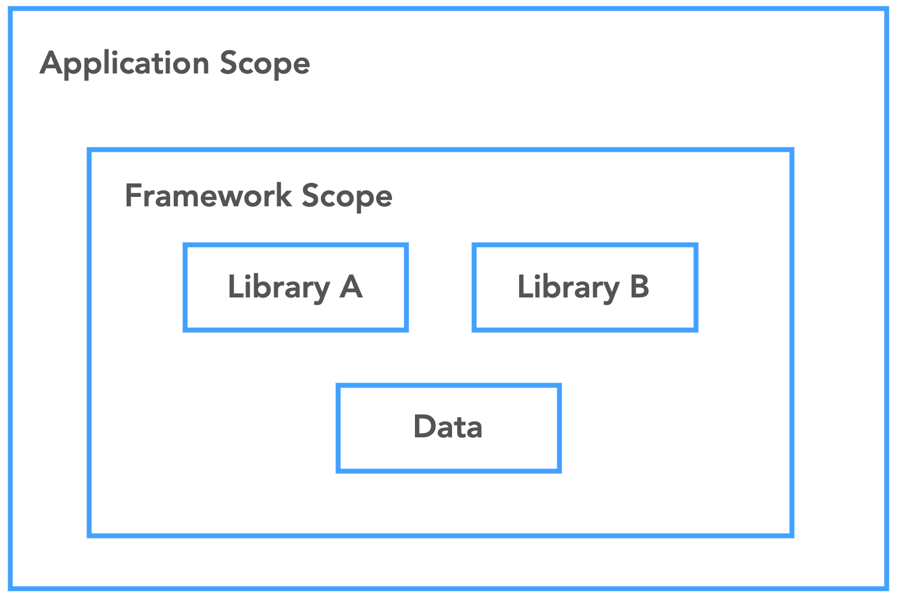
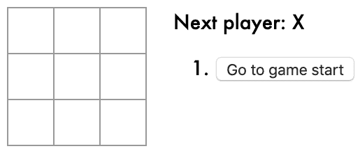
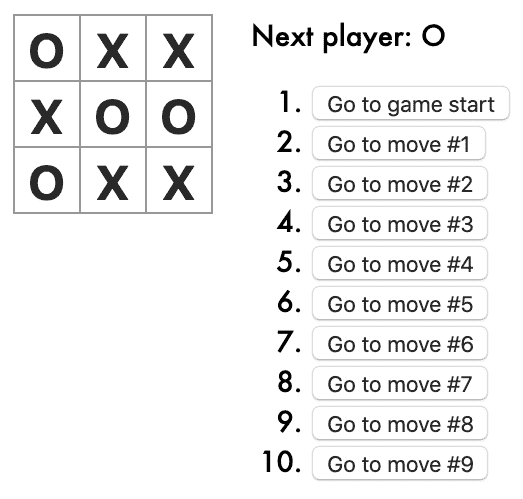

与框架和库一起工作

很少有语言存在于一个自包含的、整体的象牙塔中。几乎总是，特别是对于任何现代语言，程序中都会使用第三方代码来增加功能。使用第三方代码，比如库和框架，也是使用 JavaScript 的一个重要部分。让我们来看看我们工具包中一些更受欢迎的开源工具。

本章将涵盖以下主题：

+   jQuery

+   Angular

+   React 和 React Native

+   Vue.js

# 第十一章：技术要求

准备好使用存储库的`Chapter-8`目录中提供的代码：[`github.com/PacktPublishing/Hands-on-JavaScript-for-Python-Developers/tree/master/chapter-8`](https://github.com/PacktPublishing/Hands-on-JavaScript-for-Python-Developers/tree/master/chapter-8)。由于我们将使用命令行工具，还要准备好你的终端或命令行 shell。我们需要一个现代浏览器和一个本地代码编辑器。

# jQuery

创建或使用 JavaScript 库的主要原因之一是为了简化重复或复杂的任务。毕竟，你不能通过插件或库从根本上*改变*一种语言——你所能做的只是增加或改变现有的功能。

正如我们在第一章中讨论的那样，*JavaScript 进入主流编程*，JavaScript 的早期历史有点像是一个荒野西部的情景。浏览器之间的战争正在全面展开，功能没有标准化，甚至发起一个 Ajax 调用都需要两套不同的代码：一套是为了 Internet Explorer，另一套是为了其他浏览器。

2006 年，由 John Resign 创建了 jQuery。

浏览器之间的标准化不足是创建 jQuery 的动力。从 DOM 操作到 Ajax 调用，jQuery 的语法和结构是一种“一次编写，所有浏览器使用”的范式。随着 ES6 及更高版本的开发，JavaScript*正在*变得更加标准化。然而，有超过十年的 jQuery 代码存在，大多数 JavaScript 重的网站都在使用。由于这些传统应用程序，它仍然非常受欢迎，因此对我们的讨论很重要。它也是开源的，因此使用它不需要许可费。

## jQuery 的优势

考虑以下例子，它们做了同样的事情：

+   **JavaScript ES6**: `document.querySelector("#main").classList.add`

`("red")`

+   **jQuery**: `$("#main").addClass("red");`

正如你所看到的，jQuery 的构造要简短得多。太好了！简洁的代码通常是一件好事。所以，让我们来分解这个例子：


图 8.1 - jQuery 语法

1.  我们几乎所有的 jQuery 语句都是以`$`开头的。这是许多库中使用的一个惯例，实际上，你可以覆盖美元符号并使用任何你喜欢的东西，所以你可能会看到以`jQuery`开头的例子。

1.  我们的选择器是 CSS 选择器，就像我们在`document.querySelector()`中使用的一样。一个惯例是，如果你要存储通过 jQuery 选择的 DOM 节点以供以后使用，就用美元符号表示。所以，如果我们要将`#main`存储为一个变量，它可能看起来像这样：`const $main = $("#main")`。

1.  jQuery 有自己的一系列函数，通常是内部功能的可读性缩写。

关于 jQuery 的一个有趣的事实：你可以将 jQuery 与原生 JavaScript（即*不使用任何框架或库*）混合使用。事实上，“原生 JavaScript”这个术语是指非 jQuery 代码的一种常用方式。

此外，一些前端库，如 Bootstrap，在 Bootstrap 5 之前，是使用 jQuery 构建的，因此了解其用法可以帮助你了解其他库和框架。这并不是一个*坏*事，但在你探索前端开发的新世界时要注意这一点。

## jQuery 的缺点

使用 jQuery，就像使用任何库一样，需要在客户端上进行额外的下载。截至撰写本文时，jQuery 3.4.1 的压缩版本大小为 88 KB。尽管这在很大程度上可以忽略不计，并且将被浏览器缓存，但请记住，这必须在每个页面上执行和加载，因此不仅要考虑下载大小，还要考虑执行时间。Wes Bos 还有一些关于 ES6 和 jQuery 中作用域的很好的信息：[`wesbos.com/javascript-arrow-functions/`](https://wesbos.com/javascript-arrow-functions/)。

另外，虽然并非所有情况都是如此，但大部分 jQuery 的用法存在是为了标准化 ES5，所以你在网上和示例中看到的大部分代码都是 ES5。

## jQuery 的例子

让我们比较一下我们原始的星球大战探索第七章，“事件、事件驱动设计和 API”([`github.com/PacktPublishing/Hands-on-JavaScript-for-Python-Developers/tree/master/chapter-8/swapi`](https://github.com/PacktPublishing/Hands-on-JavaScript-for-Python-Developers/tree/master/chapter-8/swapi))与 jQuery 版本([`github.com/PacktPublishing/Hands-on-JavaScript-for-Python-Developers/tree/master/chapter-8/swapi-jQuery`](https://github.com/PacktPublishing/Hands-on-JavaScript-for-Python-Developers/tree/master/chapter-8/swapi-jQuery))。

现在，我承认这并不是最优雅的 jQuery 代码，但这样做是有原因的。让我们来分析一下。

首先是 HTML：

| **ES6** | **jQuery** |
| --- | --- |
| 无变化 | 添加`<script src="https://code.jquery.com/jquery-3.4.1.min.js"></script>` |

正如我们讨论过的，添加 JavaScript 库或框架本质上需要从本地文件下载另一个文件，并/或者需要额外的处理时间。通常，大小是可以忽略不计的，所以在这种情况下，唯一相关的因素是我们需要添加一行 HTML 来从全局内容传递网络加载 jQuery 文件。

CSS 不会有变化，这是预期的。所以让我们深入 JavaScript：

| **ES6** | **jQuery** |
| --- | --- |

|

```js
class SWAPI {
  constructor() {
    …
  }
}
```

|

```js
var swapi;

$(document).ready(function() {
  swapi = new SWAPI;
});
```

|

好了，现在我们看到了一些主要的区别。正如前面提到的，这并不一定是最理想的 jQuery 程序，但我认为它能传达出要点。首先，虽然 jQuery 和 ES6 是兼容的，但大多数情况下，jQuery 是在 ES6 不可用的地方使用的，或者代码尚未升级到 ES6。你会注意到大多数 jQuery 代码的第一件事是，在行尾使用分号，并使用`var`而不是`let`或`const`。这并不是 jQuery 独有的，而是 ES5 的约定。

ES5 通常使用对象原型的操作，而不是使用类，如下所示：

```js
SWAPI.prototype.constructor = function() {
  this.$loader = $('#loader');
  this.people = [];
};
```

类可以说是更干净的工作方式，因为它们在方法和用法上更加自包含和明确。然而，当 jQuery 流行时，这种约定还不存在，所以我们将使用 ES5 原型继承。

现在让我们一起看看使用 ES6 和 jQuery 进行 Ajax 调用的不同之处：

| **ES6** | **jQuery** |
| --- | --- |

|

```js
fetch(url)
  .then((response) => {
     return response.json()
  })
  .then((json) => {
    … 
  })
```

|

```js
$.get(url)
  .done(function(data) {
     …
  };
```

|

这是一个很好的例子，说明了为什么要使用 jQuery 以及它的创建如何促进了 ES6 的一些简化。在 ES5 中，进行 Ajax 请求需要两种不同的方法——一种是针对 Internet Explorer，另一种是针对其他浏览器——因为请求方法并没有标准化。jQuery 通过在幕后进行浏览器检测和代码切换来帮助开发人员，这样开发人员只需要编写一条语句。然而，使用`fetch`就不再需要这样做了。不过，我们可以看到 jQuery 代码稍微短一些，因为我们没有第一个`.then`函数来返回请求的 JSON。这是设计缺陷还是特性？实际上是后者，因为 API 可能返回许多不同类型的响应。`fetch`方法在幕后为您进行了一些转换，而 jQuery 则希望您基本上知道您的数据是什么以及如何处理它。

W3Schools 在 jQuery 上有很好的示例和参考资料：[`www.w3schools.com/jquery/`](https://www.w3schools.com/jquery/)。

如果您查看 jQuery 版本的其余代码，您会发现许多其他有趣的差异示例，但现在——从 jQuery 继续前进！让我们来看看一个完整的*web 框架*：Angular。

# Angular

Angular 由 Google 创建为*AngularJS*。在 2016 年，它被重写为版本 2，使其与 AngularJS 分离。它是开源的框架，而不是库，现在引发了一个问题：**框架**和**库**之间有什么区别？

*库*是一个工具包，用于更轻松地编写您的代码，用于不同的目的。使用建筑类比，库就像一套可以用来组装房子的砖头。相反，*框架*更类似于设计房子所使用的蓝图。它可能使用一些相同的砖头，也可能不使用！主要区别之一是，一般来说，库允许您按照自己想要的方式编写代码，而不会让库对如何构建代码的结构发表意见。另一方面，框架更具有意见，并要求您按照*该*框架的最佳实践来构建代码。这是一个模糊的（有时是过载的）术语，因此对于什么是库和什么是框架存在可以理解的争论。只需搜索*Stack Overflow*，您就会找到竞争性的定义。一个很好的简化陈述是，**框架**可以是一组具有指定使用模式的技术，而**库**更有可能是一种帮助操作数据的技术。

让我们考虑这个图表：



图 8.2 - 框架组成

正如我们所看到的，框架实际上可以由多个库组成。框架的设计模式通常决定了这些库的使用方式和时间。

Angular 使用*TypeScript*，这是一种开源的编程语言。最初由微软开发，它是 JavaScript 的一个超集，具有一些额外的功能，对一些开发人员来说是吸引人的。尽管 TypeScript 被归类为自己的语言，但它是 JavaScript 的超集，因此可以转换为普通 JavaScript，因此在浏览器中运行时不需要额外的工作，除了执行 Angular 构建过程。

## Angular 的优势

Angular，像大多数框架一样，对您的文件结构和代码语法有自己的看法（特别是在混合使用 TypeScript 时）。这可能听起来像一个缺点，但实际上在团队合作中非常重要：您已经有了关于如何处理代码的现有文件结构，这是一件*好*事情。

Angular 也不是独立存在的。它是**技术栈**的一部分，这意味着它是一个从前端到数据库的一揽子解决方案。您可能已经遇到过**MEAN**技术栈这个术语：**MongoDB, Express, Angular, 和 Node.js**。虽然您可以在这个技术栈之外使用 Angular，但它提供了一个易于设置的开发生态系统，被他人广泛理解。

如果您对**Model-View-Controller**（**MVC**）范例不熟悉，现在是熟悉它的好时机。许多技术堆栈跨越多种语言利用这种范例来分离代码库中的关注点。例如，程序中的**模型**与数据源（如数据库和/或 API）的数据获取和操作进行交互，而**控制器**管理模型、数据源和**视图**层之间的交互。**视图**主要控制全栈环境中信息的视觉显示。在全栈 MVC 社区内存在争议，就方法而言，所谓的“模型臃肿，控制器瘦身”方法和相反的方法之间存在争论。现在不重要去讨论这种区别，但您会在社区中看到这种争论。

谈到社区，事实上 Angular 开发人员已经形成了一个临时网络，相互帮助。单单讨论就很有价值，可以帮助您在这个领域中导航。

Angular 还有一些其他优点，比如双向数据绑定（确保模型和视图相互通信）和绑定到 HTML 元素的专门指令，但这些都是现在不重要讨论的细微差别。

## Angular 的缺点

Angular 的主要缺点是其陡峭的学习曲线。除了原始的 AngularJS 和更现代的 Angular 迭代之间的差异之外，Angular 不幸地在开发人员中的流行度正在下降。此外，它*相当*冗长和复杂。根据一些 Angular 开发人员的说法，诸如使用第三方库之类的任务可能会重复。

使用 TypeScript 而不是标准的 ES6 也是一个值得关注的问题。虽然 TypeScript 很有用，但它增加了使用 Angular 的学习曲线。也就是说，Angular 确实非常灵活。

## Angular 的例子

让我们用 Angular 构建一个小的“Hello World”应用程序。我们需要一些工具来开始我们的工作，比如`npm`。参考第二章，*我们可以在服务器端使用 JavaScript 吗？当然可以！*，来安装`npm`及其相关工具。如果您愿意，您也可以按照提供的代码在[`github.com/PacktPublishing/Hands-on-JavaScript-for-Python-Developers/tree/master/chapter-8/angular-example`](https://github.com/PacktPublishing/Hands-on-JavaScript-for-Python-Developers/tree/master/chapter-8/angular-example)进行操作。

以下是我们的步骤：

1.  首先安装 Angular CLI：`npm install -g @angular-cli`。

1.  使用`ng new example`创建一个新的示例项目。按照提示接受此安装的默认设置。

1.  进入刚刚创建的目录：`cd example`。

1.  启动服务器：`ng serve --open`。

此时，您的网络浏览器应该在`http://localhost:4200/`打开此页面：


图 8.3 - 示例起始页面

好的。这看起来是一个足够简单的页面供我们使用。这是我们的 CLI 创建的文件结构：

```js
.
├── README.md
├── angular-cli.json
├── e2e
│   ├── app.e2e-spec.ts
│   ├── app.po.ts
│   └── tsconfig.json
├── karma.conf.js
├── package-lock.json
├── package.json
├── protractor.conf.js
├── src
│   ├── app
│   │   ├── app.component.css
│   │   ├── app.component.html
│   │   ├── app.component.spec.ts
│   │   ├── app.component.ts
│   │   └── app.module.ts
│   ├── assets
│   ├── environments
│   │   ├── environment.prod.ts
│   │   └── environment.ts
│   ├── favicon.ico
│   ├── index.html
│   ├── main.ts
│   ├── polyfills.ts
│   ├── styles.css
│   ├── test.ts
│   └── tsconfig.json
└── tslint.json
```

让我们看一下生成的代码。打开`src/index.html`。您会看到：

```js
<!doctype html>
<html lang="en">
<head>
  <meta charset="utf-8">
  <title>Example</title>
  <base href="/">

  <meta name="viewport" content="width=device-width, initial-scale=1">
  <link rel="icon" type="image/x-icon" href="favicon.ico">
</head>
<body>
  <app-root></app-root>
</body>
</html>
```

就是这样！您看，这只是 Angular 创建我们刚刚查看的页面的模板，然后 JavaScript 完成其余工作。如果您在浏览器中查看页面的源代码，您会看到非常相似的内容，只是有一些脚本调用。所有 JavaScript 都是一次性下载或可能被分块成用于协同使用的块。

## 单页应用程序

值得讨论的是什么是 SPA。我们之前已经提到过这个话题，但现在让我们来看看为什么 Angular（以及我们即将介绍的 React 和 Vue）如此受欢迎和引人注目。想象一个标准的基于 HTML 的网站。它可能有一个一致的页眉、页脚和样式。然而，一个标准的网站需要在每次导航到不同页面时下载（或从本地缓存中提供）这些资产（更不用说检索 HTML 并重新呈现它了）。SPA 通过将所有相关数据打包到一个统一的包中，然后传输到浏览器中来消除这种冗余。浏览器然后解析 JavaScript 并呈现它。结果是一个快速、流畅的体验，基本上消除了页面加载时间的延迟。你已经使用过这些了。如果你使用 Gmail 或大多数现代在线电子邮件系统，你可能已经注意到页面加载时间是可以忽略的，或者最坏的情况下有一个小的加载图标。页面加载时间和表面上浪费的资源和内容重新下载是 SPA 旨在处理的一个问题。

既然我们已经讨论了 SPA 如何帮助提高我们的效率，让我们来看看我们的 Angular 示例背后的 JavaScript。

## JavaScript

首先，让我们打开`src/app/app.component.html`，看看第 2 行：`{{ title }}!`。

嗯，这些花括号是什么？如果你熟悉其他模板语言，你可能会认出这是一个模板标记，旨在在呈现之前被我们的呈现语言替换。那么，替换它的方法是什么？

现在让我们看看`src/app/app.component.ts`：

```js
import { Component } from '@angular/core';

@Component({
  selector: 'app-root',
  templateUrl: './app.component.html',
  styleUrls: ['./app.component.css']
})
export class AppComponent {
  title = 'app works!';
}
```

我们可以看到模板引用了`app.component.html`，而我们的`AppComponent`类将`title`指定为`app works!`。这正是我们在浏览器中看到的。欢迎来到模板系统的强大之处！

现在，我们不会深入讨论 Angular 的 SPA 特性，但是请查看[`angular.io/tutorial`](https://angular.io/tutorial)上的 Angular 教程以获取更多详细信息。

现在，让我们继续我们的 React 之旅。

# React 和 React Native

React 最初是由 Facebook 的 Jordan Walke 于 2013 年创建的，迅速发展成为目前使用最广泛的用户界面库之一。与 Angular 相比，React 并不试图成为一个完整的框架，而是专注于 Web 工作流的特定部分。由于 Web 页面本质上是*无状态*的（也就是说，没有真正的信息从页面传递到页面），SPA 旨在将某些状态的片段存储在 JavaScript 内存中，从而使后续视图能够填充数据。React 是这种类型架构如何工作的一个典型例子，同时又不包含整个框架范式。在 MVC 术语中，React 处理视图层。

## React 的优势

由于 React *本身*只处理视图，它依赖于其他库来补充其功能集，比如 React Router 和 Hooks。也就是说，React 的基本架构被设计为模块化，并且有附加组件用于执行工作流的其他部分。目前，了解 React Router、Hooks 或 Redux 并不重要，但要知道 React 只是完整网站中的一个部分。

那么，为什么这是一个优势呢？与一些其他 JavaScript 工具（如 Angular）不同，React 并不试图用自己的规则、法规或语言结构重新发明轮子。它感觉就像你在基本的 JavaScript 中编码，因为在大多数情况下，你确实是！

React 的另一个优势是它如何处理组件和模板。组件只是可重用的代码片段，可以在程序中的多个位置使用不同的数据来填充视图。React 还在[`reactjs.org/tutorial/tutorial.html`](https://reactjs.org/tutorial/tutorial.html)上有一个很好的逐步教程。我们将在*React 示例*部分对此进行分析。现在，当然，我们需要讨论一下缺点。

## React 的缺点

坦率地说，React 的学习曲线（尤其是它的新姐妹技术，如 Redux 和 Hooks，简化了基于状态的管理）是陡峭的。然而，对于社区来说，这甚至不被认为是一个主要的缺点，因为几乎所有的库和框架都是如此。然而，一个主要的缺点是它的快速发展速度。现在，你可能会想：“但是一个不断发展的技术是好事”！这是一个好想法，但在实践中，这可能有点令人生畏，特别是在处理重大变化时。

一些开发人员的另一个不喜欢的地方是在 JavaScript 中混合 HTML 和 JavaScript。它使用一种语法扩展，允许在 JavaScript 中添加 HTML，称为 JSX。对于纯粹主义者来说，将表示层代码混合到逻辑结构中可能会显得陌生和构架反模式。再次强调，JSX 有一个学习曲线。

现在是时候看一个经典的 React 示例应用程序了：井字棋。

## React 示例

您可以按照逐步教程构建此应用程序，网址为[`reactjs.org/tutorial/tutorial.html`](https://reactjs.org/tutorial/tutorial.html)，为了方便使用，您可以使用这个 GitHub 目录 - [`github.com/PacktPublishing/Hands-on-JavaScript-for-Python-Developers/tree/master/chapter-8/react-tic-tac-toe`](https://github.com/PacktPublishing/Hands-on-JavaScript-for-Python-Developers/tree/master/chapter-8/react-tic-tac-toe) - 完整的示例：

1.  克隆存储库并`cd`进入`react-tic-tac-toe`目录。

1.  执行`yarn start`。

不要对新的`yarn`命令感到惊讶。这是一个类似于`npm`的不同的包管理器。

1.  当`yarn start`完成后，它会为您提供一个类似于`http://localhost:3000/`的 URL。在浏览器中打开它。你应该看到这个：



图 8.4 - React 井字棋，开始

如果你不熟悉井字棋游戏，逻辑很简单。两名玩家轮流在 3x3 的网格中标记 X 或 O，直到一名玩家在横向、纵向或对角线上有三个标记。

让我们玩吧！如果你点击方框，你可能会得到以下结果：



图 8.5 - React 井字棋，可能的结束状态

请注意，示例还在屏幕右侧的按钮上保持状态历史。您可以通过单击按钮将播放倒带到这些状态中的任何一个。这是 React 如何使用**状态**来保持应用程序各部分的连续性的一个例子。

### 组件

为了说明可重用组件的概念，考虑一下井字棋网格的顶行代码。看一下`src/index.js`。

你应该在第 27 行看到这个：

```js
<div className="board-row">
  {this.renderSquare(0)}
  {this.renderSquare(1)}
  {this.renderSquare(2)}
</div>
```

`renderSquare`是一个相当简单的函数，它呈现 JavaScript XML，或**JSX**。如前所述，JSX 是 JavaScript 的扩展。它在标准 JavaScript 文件中引入了类似 XML 的功能，将 JavaScript 语法与一组 HTML 和 XML 结合起来构建我们一直在谈论的组件。它并不是自己的完全成熟的模板语言，但在某些方面，它实际上可能更强大。

这是`renderSquare`：

```js
renderSquare(i) {
  return (
    <Square
      value={this.props.squares[i]}
      onClick={() => this.props.onClick(i)}
    />
  );
}
```

到目前为止，一切都很好...看起来相当标准...除了一件事。什么是`Square`？那不是 HTML 标签！这就是 JSX 的威力：我们可以定义自己的可重用标签，就像我们一直在谈论的这些精彩的组件一样。把它们想象成我们可以用来组装自己应用程序的 LEGO®积木。从基本的构建块中，我们可以构建一个非常复杂的 SPA。

因此，`Square`只是一个返回标准 HTML 按钮的函数，具有一些属性，例如它的`onClick`处理程序。您可以在代码后面看到这个处理程序的作用：

```js
function Square(props) {
  return (
    <button className="square" onClick={props.onClick}>
      {props.value}
    </button>
  );
}
```

我们只是初步了解了 React，但我希望你已经感受到了它的强大。事实上，它有望成为生态系统中主导的前端框架。在撰写本文时，React 在技术世界的工作机会数量上远远超过了 Angular。

## React Native

谈论 React 而不提及 React Native 是不完整的。原生移动应用程序开发的一个困难之处在于，嗯，原生语言。Android 平台使用 Java，而 iOS 依赖 Swift 作为编程语言。我们不会在这里深入讨论移动开发（或 React Native），但重要的是要注意 React 和 React Native 之间存在重大差异。当我开始尝试 React 时，我以为组件在 React 和 React Native 之间是可重用的。在某种程度上，这是*轻微*正确的，但两者之间的差异超过了相似之处。

Native 的主要优势在于你不需要使用另一种语言；相反，你仍然在使用 JavaScript。话虽如此，Native 还存在额外的复杂性，特别是在处理移动设备的原生功能（如相机）时。因此，我建议您在项目生命周期中慎重考虑使用 React Native，并*不要*假设所有知识都可以从一个项目转移到另一个项目。

接下来，让我们讨论一下 JavaScript 世界的新成员：Vue.js。

# Vue.js

JavaScript 框架生态系统中的另一个新成员是 Vue.js（通常简称为 Vue）。由 Evan You 于 2014 年开发，这是另一个旨在为单页应用程序和用户界面提供高级功能的开源框架。Evan You 认为 Angular 中有值得保留的部分，但还有改进的空间。这是一个值得赞赏的目标！有人可能会说该项目成功做到了这一点，而其他人则认为其他项目更优秀。然而，本章的目标不是对任何技术进行评判，而是让您了解 JavaScript 的各种扩展，以使您的工作更轻松，并更符合现代标准。

与 React 不同，Vue 包含*路由*、*状态*和*构建工具*。它也有一个学习曲线，就像许多类似的技术一样，所以如果您选择探索 Vue，请确保给自己足够的空间和时间来学习。

我们将在官方指南的基本示例中研究 Vue 的基本示例[`vuejs.org/v2/guide/`](https://vuejs.org/v2/guide/)。如果你查看*声明性渲染*部分的课程，你会发现一个 Scrimba 课程。随意观看教程或从[`github.com/PacktPublishing/Hands-on-JavaScript-for-Python-Developers/tree/master/chapter-8/vue-tutorial`](https://github.com/PacktPublishing/Hands-on-JavaScript-for-Python-Developers/tree/master/chapter-8/vue-tutorial)访问代码，但以下是基础知识。

Vue 的 HTML 看起来与使用花括号标记进行内容替换的任何其他框架非常相似：

```js
<html>
   <head>
       <link rel="stylesheet" href="index.css">
       <script src="https://cdn.jsdelivr.net/npm/vue/dist/vue.js"></script>
   </head>
   <body>

       <div id="app">
           {{ message }}
       </div>

       <script src="index.js"></script>
   </body>
</html>
```

值得注意的是，花括号语法可能会与其他模板系统（如 Mustache）发生冲突，但我们暂时将继续使用内置的 Vue 技术。

由于你有`{{ message }}`标记，让我们看看它的功能。

如果你查看`index.js`文件，你会发现它非常简单：

```js
var app = new Vue({ 
    el: '#app',
    data: {
        message: 'Hello Vue!'
    }
});
```

这种基本结构应该看起来很熟悉：它是一个带有对象作为参数的类的实例化。请注意，数据元素包含一个带有值`Hello Vue`的消息键。这是传递给视图层的`{{ message }}`，因此我们的应用程序呈现我们的消息：


图 8.6 - Vue 的“Hello World”示例

到目前为止，它的能力似乎与我们探索过的其他工具类似，所以让我们深入探讨其优缺点。

## Vue.js 的特点

由于 Vue 在实践中唯一的竞争对手是 React，也许将这个比较留给你来决定就足够了：[`vuejs.org/v2/guide/comparison.html`](https://vuejs.org/v2/guide/comparison.html)。然而，让我们以更客观的眼光来分析比较的一些要点，因为即使是比较的作者也承认它对 Vue 有偏见（这是可以预料的）：

+   性能：理想情况下，任何框架或库对应用程序的加载时间或实例化时间只会增加可忽略的时间，但实际情况却有所不同。我相信我们都记得多秒级的 Ajax 或 Flash（甚至是 Java servlet！）加载器的日子，但总的来说，这些延迟已经被异步、分步加载模式所缓解。现代 Web 技术的一个标志性细节应该是对用户体验的不显眼和渐进式增强。在这一点上，Vue 在增强用户体验方面做得非常出色。

+   HTML + JavaScript + CSS：Vue 允许技术的混合和匹配，它可以使用标准的 HTML、CSS 和 JavaScript 与 JSX 和 Vue 特定的语法相结合来构建应用程序。这是一个利弊参半的问题，但这是技术的事实。

+   Angular 的思想：与 React 拒绝几乎所有 Angular 约定不同，Vue 从 Angular 中借鉴了一些学习要点。这可能使它成为一个值得考虑的框架，适合想要离开 Angular 的人，尽管对这种方法的价值/效果尚未定论。

现在，让我们来看一个 Vue 的例子。

## Vue.js 示例

让我们使用 Vue CLI 创建一个示例项目：

1.  使用`npm install -g @vue/cli`安装 CLI。

1.  在新目录中执行`vue create vue-example`。对于我们的目的，你可以在每个提示处按*Enter*使用默认选项。

1.  进入目录：`cd vue-example`。

1.  使用`yarn serve`启动程序：


图 8.7 - Vue 生成器主页

Vue 的 CLI 生成器在`vue-example`目录中为我们创建了许多文件：

```js
.
├── README.md
├── babel.config.js
├── package.json
├── public
│ ├── favicon.ico
│ └── index.html
├── src
│ ├── App.vue
│ ├── assets
│ │ └── logo.png
│ ├── components
│ │ └── HelloWorld.vue
│ └── main.js
└── yarn.lock
```

让我们来看看它为我们创建的部分：

1.  打开`src/App.vue`。我们将在脚本块中看到这个：

```js
import HelloWorld from './components/HelloWorld.vue'

export default {
 name: 'app',
 components: {
   HelloWorld
 }
}
```

我们在浏览器中看不到任何链接，但`import`行告诉我们内容在哪里。

1.  打开`src/components/HelloWorld.vue`。现在，我们在`<template>`节点中看到了页面的内容。随意更改一些标记并尝试不同的变量。

这就是 Vue 的要点！你会发现在学习了 Angular 和 React 之后，Vue 中的概念是一个逻辑的进步，不难掌握。

# 总结

前端框架是强大的工具，但它们并不是可以互换的。每种框架都有其优缺点，你使用它们不仅应该受到当下流行的影响，还应该考虑到社区支持、性能考虑和项目的长期性。选择一个框架是一个需要仔细思考和规划的复杂过程。目前，React 在采用率上有相当大的增长，但随着时间的推移，所有的框架都会受到青睐和抛弃。我们在这里所涵盖的只是每个框架的冰山一角，所以在承诺之前一定要做好你的研究。

在下一章中，我们将探讨调试 JavaScript，因为让我们面对现实吧：我们会犯错误，我们需要知道如何修复它们。

# 进一步阅读

+   浏览器之战：[`en.wikipedia.org/wiki/Browser_wars`](https://en.wikipedia.org/wiki/Browser_wars)

+   jQuery：[`en.wikipedia.org/wiki/JQuery`](https://en.wikipedia.org/wiki/JQuery)

+   理解 ES6 箭头函数对于 jQuery 开发人员：[`wesbos.com/javascript-arrow-functions/`](https://wesbos.com/javascript-arrow-functions/)

+   jQuery 教程和参考：[`www.w3schools.com/jquery/`](https://www.w3schools.com/jquery/)

+   Angular 教程：[`angular.io/tutorial`](https://angular.io/tutorial)

+   React 生态系统导航：[`www.toptal.com/react/navigating-the-react-ecosystem`](https://www.toptal.com/react/navigating-the-react-ecosystem)

+   React 教程：[`reactjs.org/tutorial/tutorial.html`](https://reactjs.org/tutorial/tutorial.html)

+   Vue 指南：[`vuejs.org/v2/guide/`](https://vuejs.org/v2/guide/)

+   Vue 与其他框架的比较：[`vuejs.org/v2/guide/comparison.html`](https://vuejs.org/v2/guide/comparison.html)
