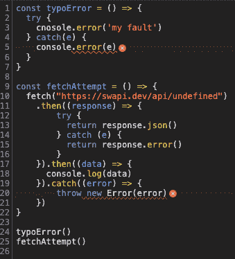
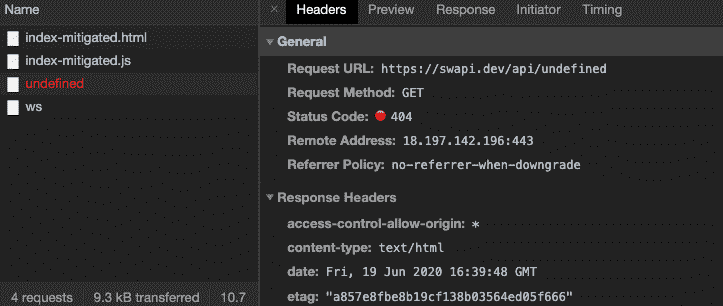
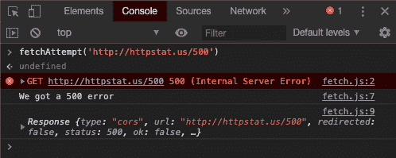
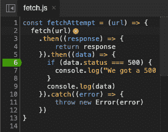
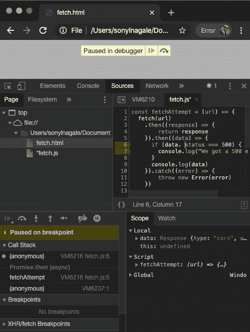
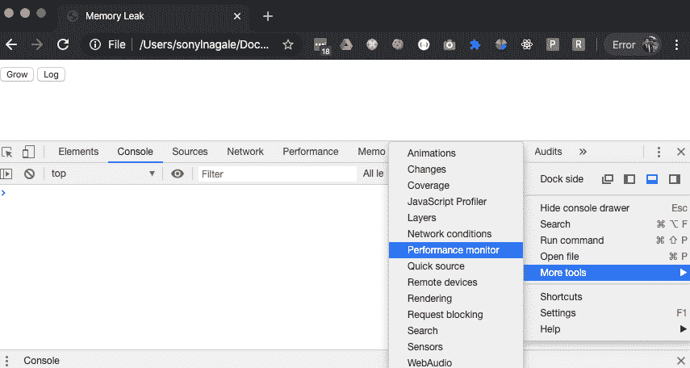

解读错误消息和性能泄漏

当然，没有一个好的语言是完整的，没有一种方法可以检测和诊断代码中的问题。JavaScript 提供了非常强大和直观的丰富错误消息，但在处理错误时有一些注意事项和技巧。

你可能知道，在自己的代码中找到问题（“bug”）是开发人员最沮丧的事件之一。我们以代码能够完成任务为傲，但有时我们没有考虑到边缘和特殊情况。此外，错误消息通过提供重要的诊断信息，给我们在编码过程中提供了重要的信息。幸运的是，有一些工具可以帮助我们理解 JavaScript 中发生的情况。

让我们来探索一下。

本章将涵盖以下主题：

+   错误对象

+   使用调试器和其他工具

+   适应 JavaScript 的性能限制

# 第十二章：技术要求

准备好在 GitHub 上的`Chapter-9`示例中进行工作，网址为[`github.com/PacktPublishing/Hands-on-JavaScript-for-Python-Developers/tree/master/chapter-9/`](https://github.com/PacktPublishing/Hands-on-JavaScript-for-Python-Developers/tree/master/chapter-9/)。

我们将在浏览器中使用开发者工具，为了说明的目的，指南和截图将来自 Google Chrome。但如果你熟悉其他浏览器中的工具，概念是相似的。如果你还没有这样做，你可能还想在 Chrome 中添加一个 JSON 解析扩展。

本章没有特定的硬件要求。

# 错误对象

让我们看一下[`github.com/PacktPublishing/Hands-on-JavaScript-for-Python-Developers/tree/master/chapter-9/error-object`](https://github.com/PacktPublishing/Hands-on-JavaScript-for-Python-Developers/tree/master/chapter-9/error-object)。打开`index.html`文件并检查 JavaScript 控制台。第一个函数`typoError`被调用并抛出了一个精彩的错误。

它应该看起来像这样：


图 9.1 - 错误控制台

现在，让我们看看`index.js`中我们函数的代码：

```js
const typoError = () => {
  cnosole.error('my fault')
}
```

好了！这只是一个简单的拼写错误，我们都犯过：应该是`console.error`而不是`cnosole.error`。如果你在代码中从未犯过拼写错误……你是一个独角兽。我们在控制台中看到的错误消息使我们很容易看到错误是什么，以及它存在于代码的哪一行：第 2 行。现在，有趣的是，在文件末尾调用`typoError()`之后，我们还调用了另一个函数*但它没有触发*。我们知道这是因为（剧透警告）它也抛出了错误，但我们没有看到它们。未捕获的引用错误是一个**阻塞错误**。

在 JavaScript 中，一些错误称为阻塞错误，将停止代码的执行。其他一些称为**非阻塞错误**，以这样的方式进行缓解，即使问题没有解决，代码仍然可以继续执行。处理错误的方法有几种，当面临潜在的错误向量时，你应该这样做。你还记得第七章吗，*事件、事件驱动设计和 API*，我们在`fetch()`调用中使用了`.catch()`块来优雅地处理 Ajax 错误？同样的原则也适用于这里。这显然是一个非常牵强的例子，但让我们继续缓解我们的错误，就像这样：

```js
const typoError = () => {
  try {
    cnosole.error('my fault')
  } catch(e) {
    console.error(e)
  }
}
```

对于拼写错误使用`try/catch`块是杀鸡用牛刀，但让我们假装它是更严重的问题，比如异步调用或来自另一个库的依赖。如果我们现在查看控制台输出，我们会看到我们的第二个函数`fetchAttempt`已经触发，并且也产生了错误。打开`index-mitigated.js`文件和相应的`index-mitigated.html`文件。

你应该在`index-mitigated.html`的控制台中看到这个：


图 9.2 - 非阻塞错误

在这里，我们看到我们的代码并没有在拼写错误处停止；我们已经通过 try/catch 将其变成了一个非阻塞错误。我们看到我们的`fetchAttempt`函数正在触发并给我们一个不同类型的错误：`404 Not Found`。由于我们输入了一个不存在的 URL（故意以`undefined`结尾），之后我们收到了另一个错误：来自我们的 promise 的`SyntaxError`。

乍一看，这个错误可能很难理解，因为它明确地谈到了 JSON 中的意外字符。在第七章中，*事件、事件驱动设计和 API*，我们使用了星球大战 API：`https://swapi.dev/`：

1.  让我们来看一下从`https://swapi.dev/api/people/1/`获取的示例响应的 JSON。这可能是一个很好的时机，确保你的浏览器中有一个 JSON 解析扩展：


图 9.3 - 来自 https://swapi.dev/api/people/1/的 JSON

1.  它是格式良好的 JSON，所以即使我们的错误指定了语法错误，实际上问题并不在于响应数据的语法。我们需要更深入地了解一下。让我们看看我们在 Chrome JavaScript 调试器中从`fetchAttempt`调用中得到的内容。让我们点击这里我们代码中的第二个错误的链接：


图 9.4 - 跟踪 404 的路径...

然后我们看到这个面板，有红色的波浪线和红色的标记表示错误：



图 9.5 - 调试器中的错误

1.  到目前为止，一切都很好。如果你在第 20 行上悬停在红色 X 上，工具提示会告诉我们有 404 错误。

1.  导航到网络选项卡。这个工具跟踪传入和传出的 HTTP 请求。

1.  点击名为 undefined 的调用，然后进入头部面板，就像这样：



图 9.6 - 头部选项卡

啊哈！现在我们知道问题所在了：JSON 错误是有帮助的，但是让我们走错了方向。错误不在于 JSON 本身，而是错误意味着响应根本就不是 JSON！这是一个 HTML 404 错误，所以没有 JSON 数据。我们的问题被确认为在获取一个不存在的地址的 URL 中，因此会呈现一个错误页面，这对于`fetch`的 JSON 解析器来说是没有意义的。

让我们花更多的时间来使用调试工具。

# 使用调试器和其他工具

许多 Web 开发人员选择使用 Google Chrome 作为他们的首选浏览器，因为它提供了丰富的开发工具。如果 Chrome 不是你的首选浏览器，这里有一些具有类似开发工具的浏览器。

## Safari

Safari 默认情况下不带开发者模式，所以如果你使用 Safari，切换到首选项的高级面板中的开发菜单：


图 9.7 - 在 Safari 中添加开发菜单

现在，你将拥有一个带有工具的开发菜单，这些工具可能会以与 Chrome 略有不同的方式呈现错误消息，但仍然可以访问。

## Internet Explorer 和 Microsoft Edge

真诚地并且只有一点点偏见，我建议*不要*在 JavaScript 开发中使用 Internet Explorer 或 Microsoft Edge。跨浏览器测试很重要，但我发现 IE 和 Edge 提供的开发工具有所欠缺。例如，让我们在 Edge 的开发工具中看一下完全相同的页面：


图 9.8 - Edge JavaScript 控制台

尽管我们用 try/catch 块减轻了错误，Edge 仍然将拼写错误视为阻塞错误。微软浏览器还有其他特殊之处，这些特殊之处可以追溯到我们之前学到的浏览器战争，所以一个好的经验法则是在 Chrome 中开发，然后在微软浏览器中测试，以确保跨浏览器兼容性。

虽然所有主要浏览器都有开发工具，但这里使用的示例将来自 Chrome。让我们更仔细地看看 JavaScript 控制台本身。

## JavaScript 控制台

控制台不仅是查看错误的地方，还可以用来执行代码。这对于快速调试特别有用，特别是在页面上可能包含另一个代码库的情况下。只要从顶层`window`对象访问，控制台就可以访问页面上加载的所有 JavaScript 的*作用域*。我们不希望访问函数的内部变量，但如果浏览器可以访问数据，我们就可以在控制台中访问它。

在`debugger`文件夹中打开`fetch.html`和`fetch.js`文件并查看。这是`fetch.js`文件：

```js
const fetchAttempt = (url) => {
  fetch(url)
    .then((response) => {
        return response
    }).then((data) => {
      if (data.status === 500) {
        console.log("We got a 500 error")
      }
      console.log(data)
      }).catch((error) => {
        throw new Error(error)
    })
}
```

这是一个简单的`fetch`请求，其中 URL 作为参数传递给我们的函数。在我们的 HTML 页面的控制台中，我们实际上可以执行这个函数，就像这样：



图 9.9 - 在控制台中执行代码

当你输入`fetchAttempt('http://httpstat.us/500')`时，你是否注意到控制台给出了自动完成的代码提示？这是另一个有用的工具，用于确定你是否可以访问你正在工作的级别的函数和变量。现在我们看到我们可以在控制台中执行代码，而不必修改我们的 JavaScript 文件。我们从控制台学到了什么？我们的`data.status`确实是`500`，所以我们从第 7 行抛出了控制台错误。从第 9 行，我们得到了我们的响应数据，它明确说明了`500`。可能不用说，但`console.log`，`console.error`和`console.info`函数在调试 JavaScript 时可能非常有价值。经常使用它们，但记得在将代码推送到生产级环境之前将它们删除，因为如果记录大对象或记录太频繁，它们可能会降低站点性能。

JavaScript 的一个棘手之处在于，你可能要处理数百行代码，有时还是来自第三方。幸运的是，大多数浏览器的工具允许在代码中设置*断点*，这会在指定的点中断代码的执行。让我们在控制台中看看我们之前的文件，并设置一些断点。如果我们点击第 7 行的错误，源面板将显示。如果你点击行号，你将设置一个断点，就像这样：



图 9.10 - 注意第 6 行上的箭头标记

在浏览器报错的那一行之前设置断点通常很有用，以便更彻底地跟踪传递给我们代码的变量。让我们再次运行我们的代码，刷新页面，看看会发生什么：

1.  在第 6 行和第 7 行设置断点。

1.  刷新页面。

1.  导航到控制台并执行我们之前的命令：`fetchAttempt('http://httpstat.us/500')`。

浏览器将再次拉起源选项卡，我们应该看到类似于这样的东西：



图 9.11 - 断点的结果

我们可以看到在作用域选项卡中，我们得到了在执行代码的上下文中定义的变量列表。然后，我们可以使用步骤按钮，如截图所示，继续移动到我们的断点并执行后续的代码行：


图 9.12 - 步骤按钮

当我们通过断点时，作用域面板将更新以显示我们当前的上下文，这比显式的`console.log`函数给我们更多的信息。

现在让我们看看如何改进 JavaScript 代码以提高性能的一些想法。

# 适应 JavaScript 的性能限制

与任何语言一样，有写 JavaScript 的方法，也有更好的写法。然而，在其他语言中不那么明显的是，您的代码对网站用户体验的直接影响。复杂、低效的代码可能会使浏览器变慢，消耗 CPU 周期，并且在某些情况下甚至会导致浏览器崩溃。

看一下 Talon Bragg 在[`hackernoon.com/crashing-the-browser-7d540beb0478`](https://hackernoon.com/crashing-the-browser-7d540beb0478)上的这个简单的四行代码片段：

```js
txt = "a";
while (1) {
    txt = txt += "a"; // add as much as the browser can handle
}
```

**警告**：*不要*在浏览器中尝试运行这个代码！如果您对此感到好奇，它最终会在浏览器中创建一个内存不足的异常，导致标签被关闭，并显示页面已经无响应的消息。为什么会这样？我们的`while`循环的条件是一个简单的真值，因此它将继续向字符串文本添加`"a"`，直到分配给该浏览器进程的内存耗尽。根据您的浏览器行为，它可能会崩溃标签、整个浏览器，或者更糟。我们都有不稳定程序的经验（Windows 蓝屏，有人吗？），但通常可以避免浏览器崩溃。除了编码最佳实践，如最小化循环和避免重新分配变量之外，还有一些特定于 JavaScript 的想法需要指出。W3Schools 有一些很有用的例子，可以在[`www.w3schools.com/js/js_performance.asp`](https://www.w3schools.com/js/js_performance.asp)找到，我想特别强调其中的一个。

在标准 JavaScript 应用程序中，最占用内存的操作之一是 DOM 访问。像`document.getElementById("helloWorld")`这样简单的一行代码实际上是一个相当昂贵的操作。作为最佳实践，如果您在代码中要多次使用 DOM 元素，您应该将其保存到一个变量中，并对该变量进行操作，而不是返回到 DOM 遍历。如果回想一下第六章：*文档对象模型（DOM）*，我们将便利贴 DOM 元素存储为一个变量：[`github.com/PacktPublishing/Hands-on-JavaScript-for-Python-Developers/blob/master/chapter-6/stickies/solution-code/script.js#L13`](https://github.com/PacktPublishing/Hands-on-JavaScript-for-Python-Developers/blob/master/chapter-6/stickies/solution-code/script.js#L13)。

## 内存面板

不要深入讨论计算机如何分配内存的细节，可以说，编写不当的程序可能会导致内存泄漏，因为它没有正确释放和回收内存，这可能导致程序崩溃。与一些低级语言相反，JavaScript 应该自动进行垃圾回收：自动内存管理的实践，通过销毁不需要的数据片段来释放内存。然而，有些情况下，编写不当的代码可能会导致垃圾回收无法处理的内存泄漏。

由于 JavaScript 在客户端运行，很难准确解释程序中到底发生了什么。幸运的是，有一些工具可以帮助。让我们通过一个将分配大量内存的程序示例来进行演示。看一下这个例子：[`github.com/PacktPublishing/Hands-on-JavaScript-for-Python-Developers/blob/master/chapter-9/memory-leak/index.html.`](https://github.com/PacktPublishing/Hands-on-JavaScript-for-Python-Developers/blob/master/chapter-9/memory-leak/index.html)

如果您查看包含的 JavaScript 文件，您会发现它非常简单，但非常强大：

```js
// Based on https://developers.google.com/web/tools/chrome-devtools/memory-problems

let x = []
const grow = (log = false) => {
  x.push(new Array(1000000).join('x'))
  if (log) {
    console.log(x)
  }
}

document.getElementById('grow').addEventListener('click', () => grow())
document.getElementById('log').addEventListener('click', () => grow(true))
```

让我们检查我们的代码，并看看当我们使用这个简单的脚本时会发生什么。请注意，这些说明可能会有所不同，具体取决于您的浏览器和操作系统版本：

1.  在 Chrome 中打开`index.html`页面。

1.  打开开发者工具。

1.  从“更多工具”菜单中，选择性能监视器：



图 9.13 - 调查性能监视器

您将看到一个带有移动时间线的面板：[`github.com/PacktPublishing/Hands-on-JavaScript-for-Python-Developers/blob/master/chapter-9/memory-leak/memory-leak.gif.`](https://github.com/PacktPublishing/Hands-on-JavaScript-for-Python-Developers/blob/master/chapter-9/memory-leak/memory-leak.gif)

1.  现在，点击几次 Grow 按钮。您应该看到 JavaScript 堆大小增加，可能达到 13MB 范围。但是，随着您不断点击，堆大小不应该超过已经存在的范围。

为什么会这样？在现代浏览器中，意外创建内存泄漏实际上变得有点困难。在这种情况下，Chrome 足够聪明，可以对内存进行一些技巧处理，不会因我们重复操作而导致内存大幅增加。

1.  然而，现在开始点击 Log 按钮几次。您将在控制台中看到输出以及堆大小的增加：


图 9.14 - 内存堆调查

注意图表的增长。然而，随着时间的推移，如果停止点击 Log，内存分配实际上会下降。这是 Chrome 智能垃圾回收的一个例子。

# 摘要

我们在编码时都会犯错误，知道如何找到、诊断和调试这些问题是任何语言中的关键技能。在本章中，我们已经看到了 Error 对象和控制台如何为我们提供丰富的诊断信息，包括错误发生的位置、对象上附加的详细信息以及如何阅读它们。不要忘记，有时错误可能在表面上看起来是一种方式（我们在*错误对象*部分的 JSON 错误），不要害怕尝试使用控制台语句和断点来跟踪代码。

由于 JavaScript 在客户端运行，因此重要的是要牢记用户的性能容量。在编写 JavaScript 时有许多最佳实践，例如重用变量（特别是与 DOM 相关的变量），因此请务必确保使您的代码 DRY（不要重复自己）。

在下一章中，我们将结束前端的工作，并了解 JavaScript 真正是前端的统治者。

# 问题

1.  内存问题的根本原因是什么？

1.  您程序中的变量是全局的。

1.  低效的代码。

1.  JavaScript 的性能限制。

1.  硬件不足。

1.  在使用 DOM 元素时，应将对它们的引用存储在本地，而不是始终访问 DOM。

1.  正确

1.  错误

1.  在多次使用时为真

1.  JavaScript 在服务器端进行预处理，因此比 Python 更高效。

1.  正确

1.  错误

1.  设置断点无法找到内存泄漏。

1.  正确

1.  错误

1.  将所有变量存储在全局命名空间中是个好主意，因为它们更有效地引用。

1.  正确

1.  错误

# 进一步阅读

有关更多信息，您可以使用以下链接：

+   使用 Chrome 的分配时间线隔离内存泄漏：[`blog.logrocket.com/isolating-memory-leaks-with-chromes-allocation-timeline-244fa9c48e8e/`](https://blog.logrocket.com/isolating-memory-leaks-with-chromes-allocation-timeline-244fa9c48e8e/)

+   垃圾回收：[`en.wikipedia.org/wiki/Garbage_collection_(computer_science)`](https://en.wikipedia.org/wiki/Garbage_collection_(computer_science))

+   JavaScript 性能：[`www.w3schools.com/js/js_performance.asp`](https://www.w3schools.com/js/js_performance.asp)

+   内存问题：[`developers.google.com/web/tools/chrome-devtools/memory-problems`](https://developers.google.com/web/tools/chrome-devtools/memory-problems)

+   Node.js 内存泄漏检测：[`medium.com/tech-tajawal/memory-leaks-in-nodejs-quick-overview-988c23b24dba`](https://medium.com/tech-tajawal/memory-leaks-in-nodejs-quick-overview-988c23b24dba)
