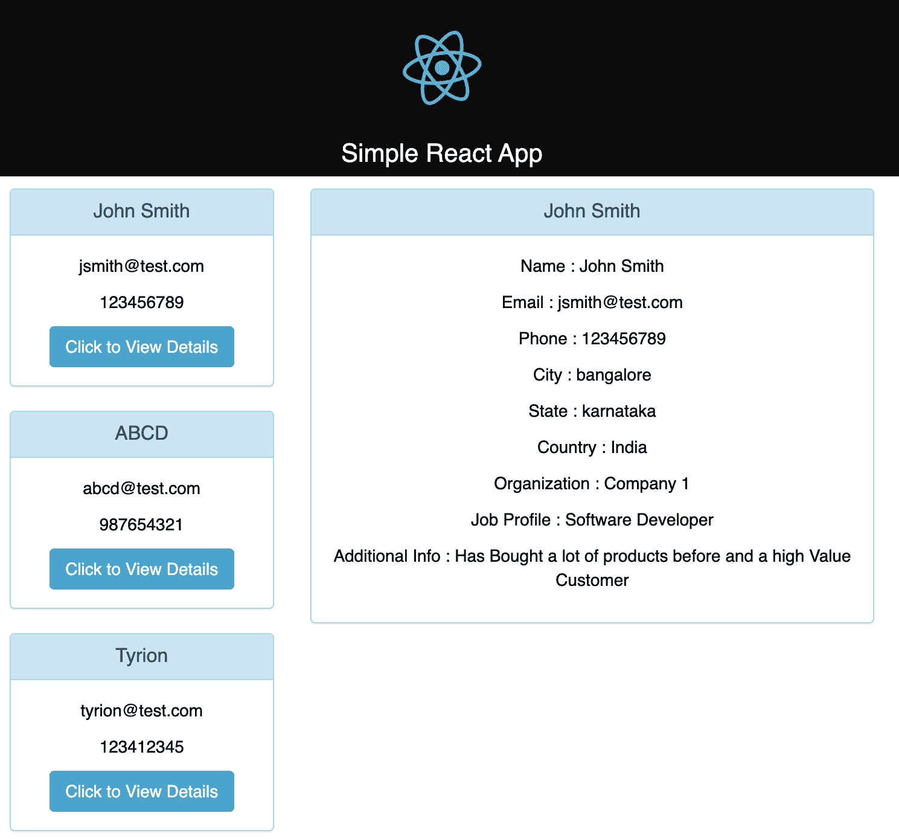
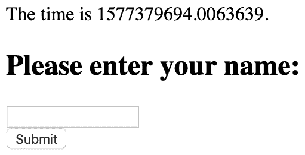
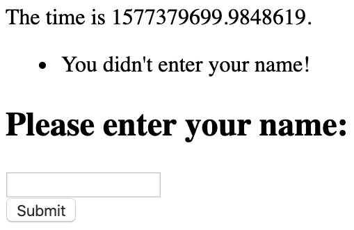
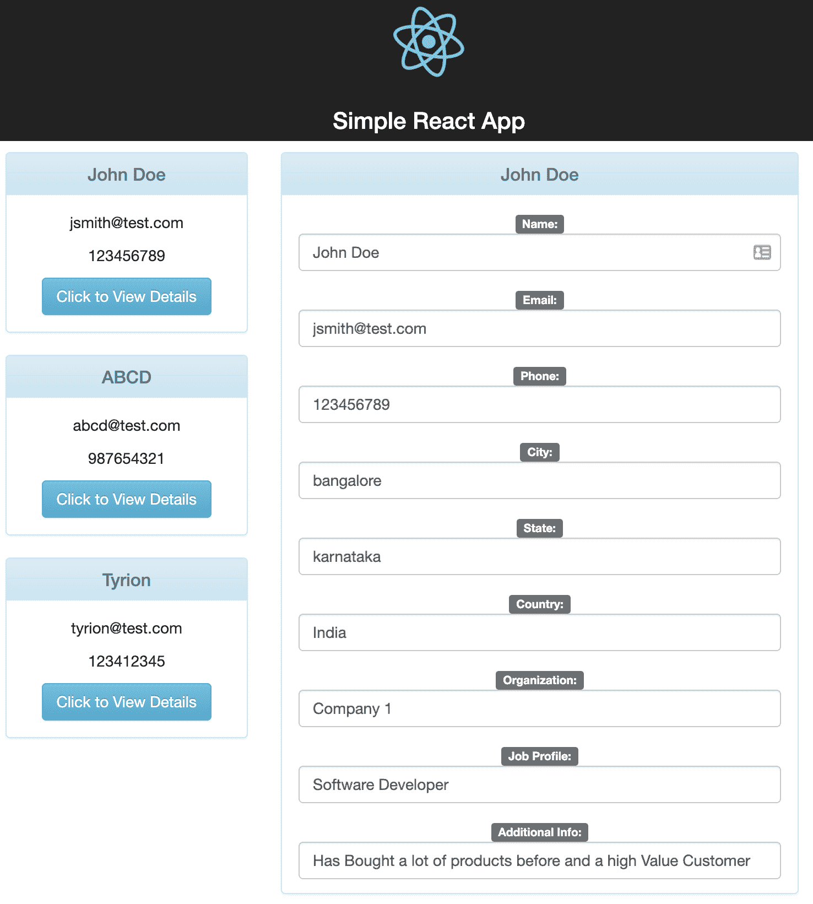

JavaScript，前端的统治者

如果您开始领会 JavaScript 对现代网站和 Web 应用程序功能的重要性，那么您正在走上正确的道路。没有 JavaScript，我们在网页上理所当然的大多数用户界面都不会存在。让我们更仔细地看看 JavaScript 如何将前端整合在一起。我们将使用一些 React 应用程序，并比较和对比 Python 应用程序，以进一步了解 JavaScript 在前端的重要性的原因和方式。

本章将涵盖以下主题：

+   构建交互

+   使用动态数据

+   了解现代应用程序

# 第十三章：技术要求

准备好使用存储库中`Chapter-10`目录中提供的代码进行工作，网址是[`github.com/PacktPublishing/Hands-on-JavaScript-for-Python-Developers/tree/master/chapter-10`](https://github.com/PacktPublishing/Hands-on-JavaScript-for-Python-Developers/tree/master/chapter-10)。由于我们将使用命令行工具，因此请确保您的终端或命令行 shell 可用。我们需要一个现代浏览器和一个本地代码编辑器。

# 构建交互

让我们看一个简单的**单页应用程序**（**SPA**）：

1.  导航到`chapter-10`中的`simple-reactjs-app`目录（`cd simple-reactjs-app`）。

1.  使用`npm install`安装依赖项。

1.  使用`npm start`运行应用程序。

1.  在`http://localhost:3000`访问应用程序。您会看到以下内容：



图 10.1 - 简单的 React 应用程序

当您单击详细按钮并检查网络选项卡时，您会发现页面不会重新加载，它只会从服务器加载 JSON 数据。这是单页应用程序功能的一个非常基本的示例：使用最少的服务器使用，用户体验的交互被简化，有助于高效、低开销的工作流程。您可能熟悉其他单页应用程序，如 Gmail、Google 地图和 Facebook，尽管底层技术有所不同。

在互联网技术时代，JavaScript 可能被视为理所当然，但它是这些应用程序工作的基础。没有 JavaScript，我们将有大量的页面重新加载和长时间等待，即使使用 Ajax 也是如此。

让我们通过比较和对比一个基本的 Python 示例和一个现代的 React 应用程序来看看如何使用动态数据。

# 使用动态数据

让我们首先看一个 Python Flask 示例：

1.  导航到`chapter-10`中的`flask`目录（`cd flask`）。

1.  您需要安装一些组件以进行设置。以下说明适用于 Python：

1.  使用`python3 -m venv env`创建虚拟环境。

1.  使用`. env/bin/activate`激活它。

1.  安装要求：`pip3 install -r requirements.txt`。

1.  现在您可以启动应用程序：`python3 app.py`。

1.  在`http://localhost:5000`访问页面。您会看到这个：



图 10.2 - 基本 Flask 应用程序

尝试输入和不输入您的姓名，并观察页面在这样做时重新加载的事实（我添加了时间戳，以便更容易看到页面重新加载可能发生得太快而看不到）。这是一个非常基本的 Flask 应用程序，有更有效的方法可以使用 Python 和 JavaScript 的组合进行验证工作，但在基本水平上，即使使用一些基于 Flask 的表单验证工具，我们所看到的验证和交互也是在后端进行的。每次我们点击提交时，服务器都会被访问。以下截图显示了如果您不输入字符串的服务器端验证：



图 10.3 - 基本 Flask 验证

请注意时间戳的更改，表示服务器重新渲染。

通过修改我们简单的 React 应用程序，让我们为我们的表单验证交互做得更好：

1.  导航到`reactjs-app-form`目录：`cd reactjs-app-form`。

1.  安装依赖项：`npm install`。

1.  启动服务器：`npm start`。

1.  在`http://localhost:5000`访问页面。这是我们简单应用的更新版本：



图 10.4 - 具有动态数据的简单应用

现在尝试使用它，并注意如果您更改一个主要字段，左侧的字段也会更改。此外，它会*在您编辑时*保存 JSON，因此如果您刷新页面，您的更改将保留。这要归功于 JavaScript 的强大功能：React 前端正在处理您在应用程序各个部分进行的所有更改，然后 Express 后端正在提供和保存 JSON 文件。在这种情况下，页面上标记的更新是实时发生的。当然，每次编辑时我们都会与服务器进行保存和读取操作，但这是因为应用程序的设计方式。要保持更改，创建一个保存按钮而不是在字段更改时进行保存将是微不足道的。

如果您想使用这个示例，您需要做一些事情：

1.  首先，在新的 shell 窗口中导航到目录（保留之前的实例运行）：`cd client`。

1.  执行`npm install`。

1.  开始程序：`npm start`。

然后，Express 服务器将收集由 React 运行过程创建的构建文件，与已经存在于目录中的预构建文件进行比较。

## 输入验证和错误处理

关于动态数据的一个重要部分是*输入验证*和*错误处理*。请注意，在我们的应用程序中，如果电子邮件字段为空或者我们没有输入有效的电子邮件，它将有一个红色轮廓。否则，它将有一个绿色轮廓。当您输入有效的电子邮件地址并选择下一个字段时，您会发现红色轮廓会在不与服务器交互的情况下（除了保存数据，正如我们之前讨论的那样）变为绿色。这是客户端验证，当创建流畅的用户体验时非常强大：用户不必点击保存并等待服务器响应，以查看他们是否输入了不正确的数据。

在处理电话字段时，您可能已经注意到一个细节：它被限制为数字。如果您查看`client/src/CustomerDetails.js`，我们在这里将类型限制为数字：

```js
<Input name="phone" type="number" value={this.state.customerDetails.data.phone || ''} onChange={this.handleChange} />
```

这里还有一些其他的 React 部分。让我们来看一下`handleChange`函数：

```js
handleChange(event) {
   const details = this.state.customerDetails
   details.data[event.target.name] = event.target.value
   this.validate(event.target)

   this.setState({ customerDetails: details })
   console.log(this.state.customerDetails)

   axios.post(`${CONSTANTS.API_ROOT}/api/save/` + 
   this.state.customerDetails.data.id, details)
     .then(() => {
       this.props.handler();
     })
 }
```

Axios 是一个简化 Ajax 调用的库，我在这里使用它而不是`fetch`只是为了演示。您可能会在 React 工作中看到 Axios 被使用，尽管您始终可以选择使用原始的`fetch`。但是，让我们专注于`this.validate(event.target)`这一行。

这是函数的内容：

```js
validate(el) {
   const properties = (el.name) ? el : el.props

   if (properties.name === 'email') {
     if (validateEmail(properties.value)) {
       this.setState({ validate: { email: true }});
     } else {
       this.setState({ validate: { email: false }});
     }
   }
 }
```

`validateEmail()`是一个神奇的函数！您可以在`client/src/validation.js`中找到它，它使用*正则表达式*来模式匹配输入字符串，以查看它是否看起来像一个正确格式的电子邮件地址。然后，根据函数返回`true`或`false`，我们设置一个验证状态，React 将使用它来设置电子邮件字段的边框颜色。

前端验证和错误处理对于流畅的用户体验非常重要，但这只是故事的一部分。另一部分是安全性。

## 安全和数据

正如您从浏览器中的开发者工具中了解的那样，如果您努力尝试，几乎可以规避任何前端限制。例如，对于我们的电话字段，尽管我们在前端限制了它，但我们总是可以检查 HTML 并输入任何我们想要的值。一个快速的提示是，也很重要在后端验证您的数据，以确保它格式正确。

企业数据泄露和黑客攻击的一个共同点是攻击者利用了系统中的弱点。很少是密码泄露的情况；更常见的是弱加密或甚至是前端问题。我们将在第十七章中进一步讨论安全性和密钥。您可以在[OWASP.org](https://OWASP.org)了解更多信息。

让我们继续回顾我们所学到的东西。

# 理解现代应用程序

在这一点上，毫不奇怪的是，所有现代 Web 应用程序都与 JavaScript 紧密联系在一起。没有它，交互就无法实时发生。服务器端有其位置和重要性，但用户看到和交互的关键是由 JavaScript 控制的。

就像 CSS 是 HTML 的补充一样，JavaScript 是这个组合中的第三个朋友，通过一系列标记和样式创建有意义的体验。作为 Web 应用程序的肌肉，它为我们提供丰富的交互和逻辑，并且是所有单页应用程序的基础。它真的是一个神奇而美丽的工具。

# 总结

通过 JavaScript，我们可以超越“网页”，创建完整的 Web 应用程序。从电子邮件系统到银行，再到电子表格，几乎任何您使用计算机的东西，JavaScript 都可以帮助您。

在下一章中，我们将使用 Node.js 在服务器端使用 JavaScript。我们不会完全抛弃前端，而是会看到它们如何联系在一起。
