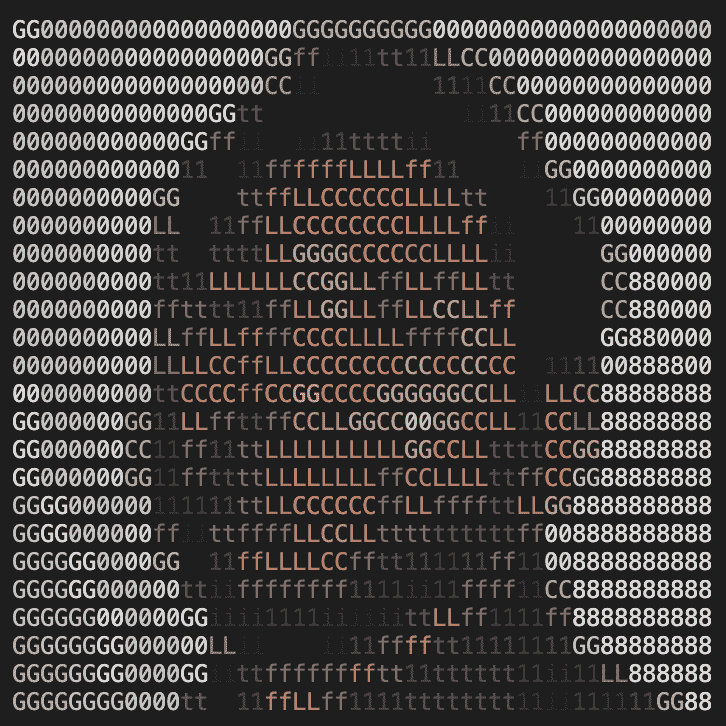
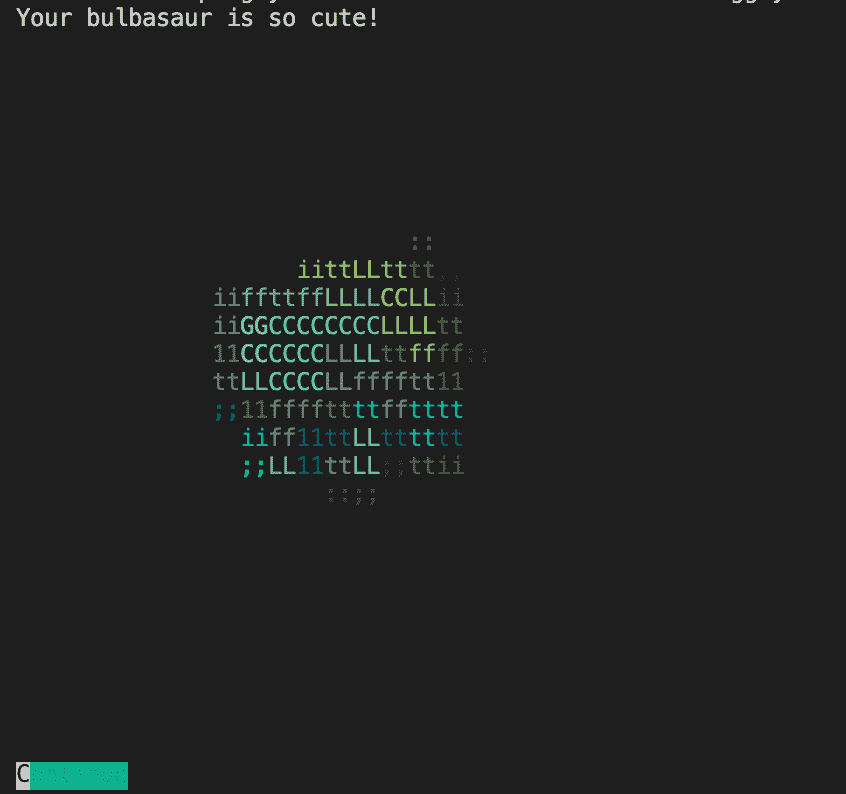
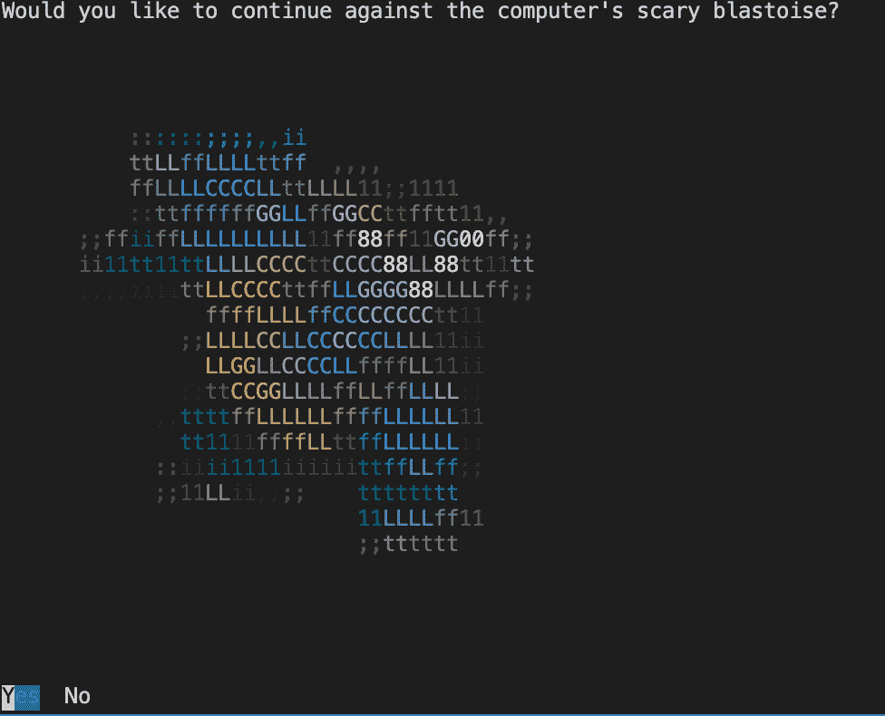

什么是 Node.js？

现在我们已经研究了 JavaScript 在前端的使用，让我们深入探讨它在“JavaScript 无处不在”范式中的作用，使用 Node.js。我们在第二章，*我们可以在服务器端使用 JavaScript 吗？当然可以！*中讨论了 Node.js，现在是时候更深入地了解我们如何使用它来创建丰富的服务器端应用程序了。

本章将涵盖以下主题：

+   历史和用法

+   安装和用法

+   语法和结构

+   Hello, World!

# 第十五章：技术要求

准备好在存储库的 `Chapter-11` 目录中使用提供的代码：[`github.com/PacktPublishing/Hands-on-JavaScript-for-Python-Developers/tree/master/chapter-11`](https://github.com/PacktPublishing/Hands-on-JavaScript-for-Python-Developers/tree/master/chapter-11)。由于我们将使用命令行工具，还需要准备好终端或命令行 shell。我们需要一个现代浏览器和一个本地代码编辑器。

# 历史和用法

Node.js 首次发布于 2009 年，已被行业中的大公司和小公司广泛采用。在 Node.js 中有成千上万的可用包，为用户和开发者社区创造了丰富的生态系统。与任何开源项目一样，社区支持对于技术的采用和长期性至关重要。

从技术角度来看，Node.js 是一个单线程事件循环的运行时环境。在实践中，这意味着它可以处理成千上万个并发连接，而无需在上下文之间切换时产生额外开销。对于那些更熟悉其他架构模式的人来说，单线程可能看起来有些违反直觉，过去它曾被视为 Node.js 感知到的断点的一个例子。然而，可以说 Node.js 系统的稳定性和可靠性已经证明了这种范式是可持续的。有办法增加服务器处理请求的能力，但应该注意的是，这比简单地向问题投入更多硬件资源要复杂一些。如何扩展 Node.js 超出了本书的范围，但涉及到底层库 libuv 的技术。

在撰写本文时，Node.js 最大的优势可能是推动 Twitter。根据 SimilarTech 的数据，其每月 43 亿次访问证明了其强大的力量。现在，我相信 Twitter 团队多年来在推动平台方面做了一些令人难以置信的架构工作，我们很少再看到著名的 Twitter “fail whale”；我认为依赖 Node.js 是一个有助于提供可持续性和可靠性的好事情。

继续使用它！

# 安装和用法

安装 Node.js 的最简单方法是使用 [`nodejs.org`](https://nodejs.org) 提供的安装程序。这些包将指导您在系统上安装 Node.js。确保还安装了 `npm`，Node 的包管理器。您可以参考第三章，*细枝末节的语法*，了解更多安装细节。

让我们试一试：

1.  打开一个终端窗口。

1.  输入 `node`。您将看到一个简单的 `>`，表示 Node.js 正在运行。

1.  输入 `console.log("Hi!")` 并按 *Enter*。

就是这么简单！通过两次按 *Ctrl + C* 或输入 `.exit` 来退出命令提示符。

所以，这相当基础。让我们做一些更有趣的事情。这是 `chapter-11/guessing-game/guessing-game.js` 的内容：

```js
const readline = require('readline')
const randomNumber = Math.ceil(Math.random() * 10)

const rl = readline.createInterface({
 input: process.stdin,
 output: process.stdout
});

askQuestion()

function askQuestion() {
 rl.question('Enter a number from 1 to 10:\n', (answer) => {
   evaluateAnswer(answer)
 })
}

function evaluateAnswer(guess) {
 if (parseInt(guess) === randomNumber) {
   console.log("Correct!\n")
   rl.close()
   process.exit(1)
 } else {
   console.log("Incorrect!")
   askQuestion()
 }
}
```

使用 `node guessing-game.js` 运行程序。从代码中您可能能够看出，程序将在 1 到 10 之间选择一个随机数，然后要求您猜测它。您可以在命令提示符中输入数字来猜测这个数字。

让我们在下一节中分解这个示例。

# 语法和结构

Node.js 的伟大之处在于您已经知道如何编写它！举个例子：

| **JavaScript** | **Node.js** |
| --- | --- |
| **`console.log("Hello!")`** | **`console.log("Hello!")`** |

这不是一个技巧：它是相同的。Node.js 在语法上几乎与基于浏览器的 JavaScript 相同，甚至包括 ES5 和 ES6 之间的区别，正如我们之前讨论过的。根据我的经验，Node.js 中仍然存在大量使用 ES5 风格的代码，因此您会看到使用`var`而不是`let`或`const`的代码，以及大量使用分号。您可以查看第三章，*细枝末节的语法*，了解更多关于这些区别的信息。

在我们的猜数字游戏示例中，我们看到了一个对我们来说是新的东西 - 第一行：

`const readline = require('readline')`

Node.js 是一个*模块化*系统，这意味着并非所有语言的部分都会一次性引入。相反，当发出`require()`语句时，将包含模块。其中一些模块将内置到 Node.js 中，如`readline`，而另一些将通过 npm 安装（更多内容将在后面介绍）。我们使用`readline.createInterface()`方法创建一种使用我们的输入和输出的方式，然后我们猜数字游戏程序的其余代码应该是有些意义的。它只是会一遍又一遍地问问题，直到输入的数字等于程序生成的随机数：

```js
function evaluateAnswer(guess) {
 if (parseInt(guess) === randomNumber) {
   console.log("Correct!\n")
   rl.close()
   process.exit(1)
 } else {
   console.log("Incorrect!")
   askQuestion()
 }
}
```

让我们看一个例子，从文件系统中读取文件，这是我们无法从普通的客户端 Web 应用程序中做到的。

## 客户查找

查看`customer-lookup`目录，[`github.com/PacktPublishing/Hands-on-JavaScript-for-Python-Developers/tree/master/chapter-11/customer-lookup`](https://github.com/PacktPublishing/Hands-on-JavaScript-for-Python-Developers/tree/master/chapter-11/customer-lookup)，并使用`node index.js`运行脚本。这很简单：

```js
const fs = require('fs')
const readline = require('readline')

const rl = readline.createInterface({
 input: process.stdin,
 output: process.stdout
});

const customers = []

getCustomers()
ask()

function getCustomers() {
 const files = fs.readdirSync('data')

 for (let i = 0; i < files.length; i++) {
   const data = fs.readFileSync(`data/${files[i]}`)
   customers.push(JSON.parse(data))
 }
}

function ask() {
 rl.question(`There are ${customers.length} customers. Enter a number to 
 see details:\n`, (customer) => {
   if (customer > customers.length || customer < 1) {
     console.log("Customer not found. Please try again")
   } else {
     console.log(customers[customer - 1])
   }
   ask()
 })
}
```

其中一些看起来很熟悉，比如`readline`接口。不过，我们正在使用一些新的东西：`const fs = require('fs')`。这是引入文件系统模块，以便我们可以处理存储在文件系统上的文件。如果您查看数据目录，您会发现四个基本的 JSON 文件。

在`getCustomers()`函数中，我们要做三件事：

1.  使用`readdirSync`获取数据目录中文件的列表。在处理文件系统时，您可以以同步或异步方式与系统进行交互，类似于与 API 和 Ajax 进行交互。为了方便起见，在本例中，我们将使用同步文件系统调用。

1.  现在`files`将是数据目录中文件的列表。循环遍历文件并将内容存储在`data`变量中。

1.  将解析后的 JSON 推送到`customers`数组中。

到目前为止一切顺利。`ask()`函数也应该很容易理解，因为我们只是查看用户输入的数字是否存在于数组中，然后返回相关文件中的数据。

现在让我们看看如何在 Node.js 中使用开源项目来实现一个（相当愚蠢的）目标：创建照片的文本艺术表示。

## ASCII 艺术和包

我们将使用 GitHub 存储库中的指令[`www.npmjs.com/package/asciify-image`](https://www.npmjs.com/package/asciify-image)：



图 11.1 - 我的 ASCII 艺术表示！

以下是逐步安装步骤：

1.  创建一个名为`ascii-art`的新目录。

1.  `cd ascii-art`

1.  `npm init`。您可以接受 npm 提供的默认值。

1.  `npm install asciify-image`

现在，让我们来玩一些游戏：

1.  在`ascii-art`目录中放置一张图片，比如一个大小不超过 200 x 200 像素的 JPEG。命名为`image.jpg`。

1.  在目录中创建`index.js`并打开它。

1.  输入此代码：

```js
const asciify = require('asciify-image')

asciify(__dirname + '/image.jpg', { fit: 'box', width: 25, height: 25}, (err, converted) => {
 console.log(err || converted)
})
```

1.  使用`node index.js`执行程序，并查看你美妙的艺术作品！根据你的终端颜色，你可能需要使用一些选项来改变颜色以在浅色背景上显示。这些选项在之前链接的 GitHub 存储库中有文档记录。

我们在这里展示了什么？首先，我们使用 npm 初始化了一个项目，然后安装了一个依赖项。如果你注意到了，运行这些命令为你创建了一些文件和目录。你的目录结构应该看起来接近这样：

```js
.
├── image.jpg
├── index.js
├── node_modules

├── package-lock.json
└── package.json
```

`node_modules`目录里会有更多的文件。如果你熟悉 Git 等源代码控制，你会知道`node_modules`目录应该始终被*忽略*，不要提交到源代码控制。

让我们来看看`package.json`，它看起来会类似于这样：

```js
{
 "name": "ascii-art",
 "version": "1.0.0",
 "description": "",
 "main": "index.js",
 "dependencies": {
   "asciify-image": "⁰.1.5"
 },
 "devDependencies": {},
 "scripts": {
   "test": "echo \"Error: no test specified\" && exit 1"
 },
 "author": "",
 "license": "ISC"
}
```

如果我们稍微分析一下，我们会发现这个 npm 入口点到我们的程序实际上相当简单。有关项目的一些元数据，一个带有版本的依赖对象，以及一些我们可以用来控制我们的项目的脚本。

如果你熟悉 npm，你可能已经使用`npm start`命令来运行一个项目，而不是手动输入`node`。然而，在我们的`package.json`中，我们没有一个启动脚本。让我们添加一个。

修改`scripts`对象看起来像这样：

```js
"scripts": {
   "test": "echo \"Error: no test specified\" && exit 1",
   "start": "node index.js"
 },
```

不要忘记注意你的逗号，因为这是有效的 JSON，如果逗号使用不当，它将会中断。现在，要启动我们的程序，我们只需要输入`npm start`。

这是 npm 脚本的一个非常基本的例子。在 Node.js 中，习惯使用`package.json`来控制所有构建和测试的脚本。你可以按自己的喜好命名你的命令，并像这样执行它们：`npm run my-fun-command`。

对于我们接下来的技巧，我们将从头开始创建一个“Hello, World!”应用程序。然而，它将做的不仅仅是打招呼。

# 你好，世界！

创建一个名为`hello-world`的新目录，并使用`npm init`初始化一个 node 项目，类似于我们之前的做法。在第十三章，*使用 Express*中，我们将使用 Express，一个流行的 Node.js 网络服务器。然而，现在，我们将使用一种非常简单的方法来创建一个页面。

开始你的`index.js`脚本如下：

```js
const http = require('http')

http.createServer((req, res) => {
 res.writeHead(200, {'Content-Type': 'text/plain'})
 res.end("Hello, World!")
}).listen(8080)

```

与`fs`和`readline`一样，`http`内置在 Node 中，所以我们不必使用`npm install`来获取它。相反，这将直接使用。在你的`package.json`文件中添加一个启动脚本：

```js
"scripts": {
   "test": "echo \"Error: no test specified\" && exit 1",
   "start": "node index.js"
 },
```

然后启动它！


图 11.2 - 执行 npm start

好的，我们的输出并不是特别有用，但是如果我们阅读我们的代码，我们可以看到我们已经做到了这一点：“创建一个监听端口`8080`的 HTTP 服务器。发送一个 200 OK 消息并输出'Hello, World!'”。现在让我们打开浏览器并转到[`localhost:8080`](http://localhost:8080)。我们应该看到一个简单的页面向我们问候。

太好了！到目前为止很容易。用*Ctrl* + *C*停止你的服务器，然后让我们继续编码。

如果我们能够使用我们在上一个例子中使用的 ASCII 艺术生成器来要求用户输入，然后在浏览器中显示图像，那该多好啊？让我们试试看。

首先，我们需要运行`npm install asciify-image`，然后让我们尝试这段代码：

```js
const http = require('http')
const asciify = require('asciify-image')

http.createServer((req, res) => {
 res.writeHead(200, {'Content-Type': 'text/html'})
 asciify(__dirname + '/img/image.jpg', { fit: 'box', width: 25, height: 25
  }, (err, converted) => {
   res.end(err || converted)
 })
}).listen(8080)
```

这与我们之前输出到命令行的方式类似，但是我们使用`http`服务器`res`对象来发送一个回复。用`npm start`启动你的服务器，让我们看看我们得到了什么：


图 11.3 - 原始输出

好吧，这与我们想要看到的完全不一样。这就是问题所在：我们发送给浏览器的是*ANSI 编码的文本*，而不是实际的 HTML。我们需要做一些工作来转换它。再次退出服务器然后…

等一下。为什么我们必须不断地启动和停止服务器？事实证明，我们*不* *真的*必须这样做。有一些工具可以在文件更改时重新加载我们的服务器。让我们安装一个叫做**supervisor**的工具：

1.  `npm install supervisor`

1.  修改你的`package.json`启动脚本以读取`supervisor index.js`。

现在使用`npm start`启动服务器，当你编码时，服务器将在保存后重新启动，使开发速度更快。

回到代码。我们需要一个将 ANSI 转换为 HTML 的包。使用`npm install`安装`ansi-to-html`，然后让我们开始：

```js
const http = require('http')
const asciify = require('asciify-image')
const Convert = require('ansi-to-html')
const convert = new Convert()

http.createServer((req, res) => {
 res.writeHead(200, {'Content-Type': 'text/html'})
 asciify(__dirname + '/img/image.jpg', { fit: 'box', width: 25, height: 25 
  }, (err, converted) => {
   res.end(convert.toHtml(err || converted))
 })
}).listen(8080)
```

如果刷新浏览器，你会看到我们离成功更近了！


图 11.4 - 这是 HTML！

现在我们只需要一点 CSS：

```js
const css = `
<style>
body {
 background-color: #000;
}
* {
 font-family: "Courier New";
 white-space: pre-wrap;
}
</style>
`
```

将其添加到我们的`index.js`中，并连接到输出，如下所示：

```js
asciify(__dirname + '/img/image.jpg', { fit: 'box', width: 25, height: 25 }, (err, converted) => {
   res.write(css)
   res.end(convert.toHtml(err || converted))
 })
```

现在刷新，我们应该能看到我们的图片！


图 11.5 - ANSI 转 HTML

太棒了！比只打印“Hello, World!”要令人兴奋多了，你不觉得吗？

让我们通过重新访问我们在第七章中的宝可梦游戏来增强我们的 Node.js 技能，*事件，事件驱动设计和 API*，但这次是在 Node.js 中。

## Pokéapi，重访

我们将使用 Pokéapi ([`pokeapi.co`](https://pokeapi.co)) 制作一个小型终端**命令行界面**（**CLI**）游戏。由于我们在[`github.com/PacktPublishing/Hands-on-JavaScript-for-Python-Developers/tree/master/chapter-7/pokeapi/solution-code`](https://github.com/PacktPublishing/Hands-on-JavaScript-for-Python-Developers/tree/master/chapter-7/pokeapi/solution-code)中有游戏的基本逻辑，我们只需要开始并将游戏逻辑从前端移植到后端的 Node.js 中完成游戏。

从头开始一个新项目，如下所示：

1.  `mkdir pokecli`

1.  `npm init`

1.  `npm install asciify-image axios terminal-kit`

1.  从[`pokeapi.co`](https://pokeapi.co)复制 Pokéapi 标志到一个新的`img`目录，使用浏览器中的 Save Image。

1.  创建一个新的`index.js`文件。

1.  修改`package.json`，添加一个启动脚本，如下所示：`"start": "node index.js"`。

你的文件结构应该是这样的，减去`node_modules`目录：

```js
.
├── img
│   └── pokeapi_256.png
├── index.js
├── package-lock.json
└── package.json
```

让我们开始在我们的`index.js`上工作。首先，我们需要包括我们正在使用的包：

```js
const axios = require('axios')
const asciify = require('asciify-image')
const term = require('terminal-kit').terminal
```

接下来，由于我们将使用 API 来检索和存储我们的宝可梦，让我们创建一个新对象将它们存储在顶层，这样我们就可以访问它们：

```js
const pokes = {}
```

现在我们将使用 Terminal Kit ([`www.npmjs.com/package/terminal-kit`](https://www.npmjs.com/package/terminal-kit)) 来创建一个比标准的`console.log`输出和`readline`输入更好的 CLI 体验：

```js
function terminate() {
 term.grabInput(false);
 setTimeout(function () { process.exit() }, 100);
}
term.on('key', (name, matches, data) => {
 if (name === 'CTRL_C') {
   terminate();
 }
})
term.grabInput({ mouse: 'button' });
```

我们在这里做的第一件事是创建一个终止函数，它将在停止`term`捕获输入后退出我们的 Node.js 程序，以进行清理。下一个方法指定当我们按下*Ctrl* + *C*时，程序将调用`terminate()`函数退出。*这是我们程序的一个重要部分，因为`term`默认情况下不会在按下 Ctrl + C 时退出。*最后，我们告诉`term`捕获输入。

开始我们的游戏，从 Pokéapi 标志的闪屏开始：

```js
term.drawImage(__dirname + '/img/pokeapi_256.png', {
 shrink: {
   width: term.width,
   height: term.height * 2
 }
})
```

我们可以直接使用`term`而不是`asciify-image`库（不用担心，我们以后会用到）：


图 11.6 - Pokéapi 闪屏

接下来，编写一个函数，使用 Axios Ajax 库从 API 中检索信息：

```js
async function getPokemon() {
 const pokes = await axios({
   url: 'https://pokeapi.co/api/v2/pokemon?limit=50'
 })

 return pokes.data.results
}
```

Axios ([`www.npmjs.com/package/axios`](https://www.npmjs.com/package/axios)) 是一个使请求比`fetch`更容易的包，通过减少所需的 promise 数量。正如我们在之前的章节中看到的，`fetch`很强大，但确实需要一些 promise 解析的链接。这次，让我们使用 Axios。请注意，该函数是一个`async`函数，因为它将返回一个 promise。

用`start()`函数开始我们的游戏：

```js
async function start() {
 const pokemon = await getPokemon()
}
```

我们将保持简单。请注意，此函数还使用了 async/await 模式，并调用我们的函数，该函数使用 API 检索宝可梦列表。此时，通过使用`console.log()`输出`pokemon`的值来测试我们的程序是一个好主意。您需要在程序中调用`start()`函数。您应该看到 50 只宝可梦的漂亮 JSON 数据。

在我们的`start()`函数中，我们将要求玩家选择他们的宝可梦并显示消息：

```js
term.bold.cyan('Choose your Pokémon!\n')
```

现在我们将使用我们的`pokemon`变量使用`term`创建一个网格菜单，询问我们的玩家他们想要哪个宝可梦，如下所示：

```js
term.gridMenu(pokemon.map(mon => mon.name), {}, async (error, response) => {
   pokes['player'] = pokemon[response.selectedIndex]
   pokes['computer'] = pokemon[(Math.floor(Math.random() *
    pokemon.length))]
})
```

您可以阅读`term`的文档，了解有关网格菜单的选项更多的信息。现在我们应该运行我们的代码，为了做到这一点，在程序的末尾添加对`start()`函数的调用：

```js
start()
```

如果我们用`npm start`运行我们的代码，我们将看到这个新的添加：


图 11.7 - 菜单

通过箭头键，我们可以在网格周围导航，并通过按*Enter*来选择我们的宝可梦。在我们的代码中，我们正在为我们的`pokes`对象的两个条目分配值：`player`和`computer`。现在，`computer`将是从我们的`pokemon`变量中随机选择的条目。

我们需要更多的信息来玩我们的宝可梦，所以我们将创建一个辅助函数。将其添加到我们的`start`函数中：

```js
await createPokemon('player')
await createPokemon('computer')
```

现在我们将编写`createPokemon`函数如下：

```js
async function createPokemon(person) {
 let poke = pokes[person]

 const myPoke = await axios({
   url: poke.url,
   method: 'get'
 })
 poke = myPoke.data
 const moves = poke.moves.filter((move) => {
   const mymoves = move.version_group_details.filter((level) => {
     return level.level_learned_at === 1
   })
   return mymoves.length > 0
 })
 const move1 = await axios({
   url: moves[0].move.url
 })
 const move2 = await axios({
   url: moves[1].move.url
 })
 pokes[person] = {
   name: poke.name,
   hp: poke.stats[5].base_stat,
   img: await createImg(poke.sprites.front_default),
   moves: {
     [moves[0].move.name]: {
       name: moves[0].move.name,
       url: moves[0].move.url,
       power: move1.data.power
     },
     [moves[1].move.name]: {
       name: moves[1].move.name,
       url: moves[1].move.url,
       power: move2.data.power
     }
   }
 }
}
```

让我们解释一下这个函数在做什么。首先，我们将从 API 中获取有关我们的宝可梦的信息（一次为玩家，一次为计算机）。由于游戏玩法复杂，宝可梦的移动部分有点复杂。对于我们的目的，我们将简单地为我们的宝可梦在`pokes`对象中分配前两个可能的移动。

对于图像，我们使用了一个小的辅助函数：

```js
async function createImg(url) {
 return asciify(url, { fit: 'box', width: 25 })
   .then((ascii) => {
     return ascii
   }).catch((err) => {
     console.error(err);
   });
}
```

我们几乎完成了我们游戏的开始部分！我们需要在`start`中的`gridMenu`方法中添加几行：

```js
term.gridMenu(pokemon.map(mon => mon.name), {}, async (error, response) => {
   pokes['player'] = pokemon[response.selectedIndex]
   pokes['computer'] = pokemon[(Math.floor(Math.random() * 
    pokemon.length))]
   await createPokemon('player')
   await createPokemon('computer')
   term(`Your ${pokes['player'].name} is so 
    cute!\n${pokes['player'].img}\n`)
   term.singleLineMenu( ['Continue'], (error, response) => {
     term(`\nWould you like to continue against the computer's scary
     ${pokes['computer'].name}? \n ${pokes['computer'].img}\n`)
     term.singleLineMenu( ['Yes', 'No'], (error, response) => {
       term(`${pokes['computer'].name} is already attacking! No time to 
       decide!`)
     })
   })
 })
```

现在我们可以玩了！



图 11.8 - 介绍你的宝可梦！

程序继续进行计算机选择宝可梦：



图 11.9 - 可怕的敌人宝可梦

目前，我们还没有包括使用移动和生命值进行实际游戏。这可以成为您根据第七章*事件、事件驱动设计和 API**s*的逻辑来完成`play()`函数的挑战。

完整的代码在这里：[`github.com/PacktPublishing/Hands-on-JavaScript-for-Python-Developers/tree/master/chapter-11/pokecli`](https://github.com/PacktPublishing/Hands-on-JavaScript-for-Python-Developers/tree/master/chapter-11/pokecli)。

恭喜！我们做得比“Hello, World!”要多得多。

# 总结

我们在本章中学到，Node.js 是一种完整的编程语言，能够做几乎所有与后端相关的事情。我们将在第十八章*，Node.js 和 MongoDB*中使用 Node.js 进行数据库操作，但是目前，我们可以放心地说它可以做现代编程语言所期望的事情。

Node.js 的好处在于它的语法和结构*是*普通的 JavaScript！一些术语不同，但总的来说，如果你能读写 JavaScript，你就能读写 Node.js。就像每种语言一样，术语和用法上有差异，但事实是 Node.js 和 JavaScript 是同一种语言！

在下一章中，我们将讨论 Node.js 和 Python 以及在何种情况下使用其中之一是有意义的。

# 进一步阅读

有关更多信息，您可以参考以下内容：

+   libuv：[`en.wikipedia.org/wiki/Libuv`](https://en.wikipedia.org/wiki/Libuv)

+   市场份额和 Web 使用统计：[`www.similartech.com/technologies/nodejs`](https://www.similartech.com/technologies/nodejs)
