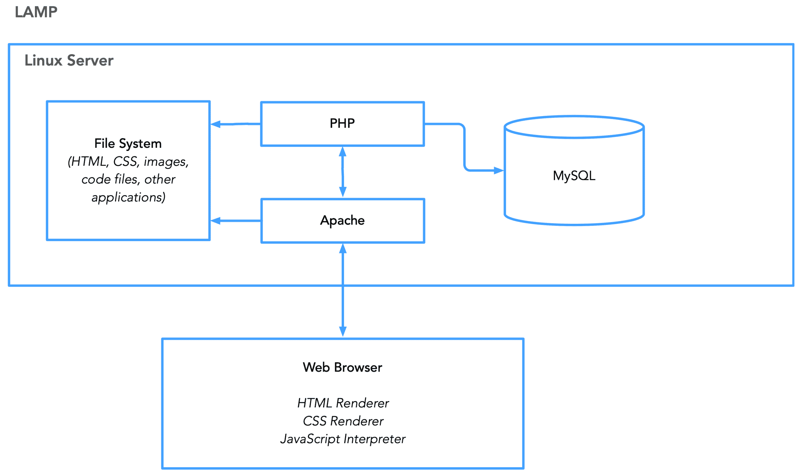
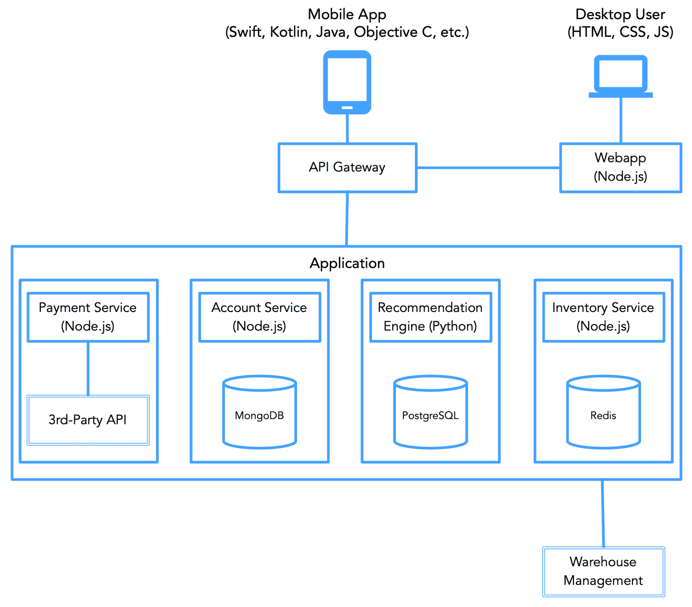
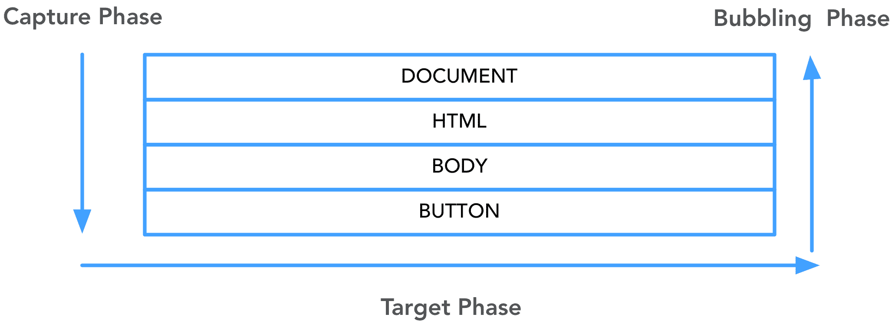
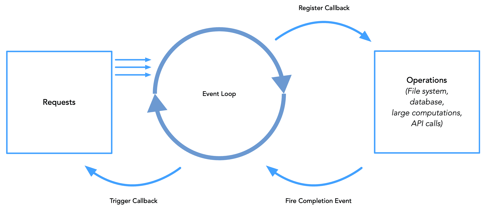

# 第十二章：Node.js 与 Python

为什么开发人员会选择 Node.js 而不是 Python？它们可以一起工作吗？我们的程序是什么样子的？这些问题等等都是 Python 和 Node.js 之间一些差异的核心，了解何时以及在何处使用特定的语言非常重要。例如，有些任务更适合某种语言，而不适合其他语言，技术人员有责任为适当的语言进行倡导。让我们调查在选择 Node.js 与 Python 时的用例和不同的考虑因素。

本章将涵盖以下主题：

+   Node.js 和 Python 之间的哲学差异

+   性能影响

# 技术要求

准备好使用存储库中`Chapter-12`目录中提供的代码，网址为[`github.com/PacktPublishing/Hands-on-JavaScript-for-Python-Developers/tree/master/chapter-12`](https://github.com/PacktPublishing/Hands-on-JavaScript-for-Python-Developers/tree/master/chapter-12)。由于我们将使用命令行工具，请确保你的终端或命令行 shell 可用。我们需要一个现代浏览器和一个本地代码编辑器。

# Node.js 和 Python 之间的哲学差异

通常会有一个你熟悉、使用并且感到舒适的主要语言。然而，重要的是要意识到并非所有编程语言都是为相同的目的而创建的。这就是为什么使用合适的工具非常重要。就像你不会用小刀来建造房子一样，你可能也不会用台锯来把树枝削成棍子，用于篝火做棉花糖。

如果你在这个行业呆了一段时间，你可能听说过“堆栈”这个术语。在技术上，堆栈是用于创建程序或多个程序的生态系统的技术的架构组合。过去，应用程序往往是大规模的**单体应用**，以“一款应用程序统治它们所有”为思维方式构建的。在今天的世界中，单体应用的使用正在减少，而更多地采用多个更小的应用程序和**微服务**。通过这种方式，工作流程的不同部分可以分布到完全独立的进程中，大大提高了整个系统的稳定性。

让我们以办公软件为例。你肯定不会试图在 Microsoft Excel 中写下你的下一部畅销小说，你可能也不想在 Microsoft Word 中做税务。这些程序之间存在着“关注点分离”。它们在工作流程中很好地协同工作并形成一个统一的整体，但每个程序都有自己的作用。

同样，Web 应用程序中的不同技术部分都有自己的用途和关注点。用于 Web 应用程序的更传统的堆栈之一称为**LAMP**（**Linux, Apache, MySQL 和 PHP**）。



图 12.1 - LAMP 堆栈

你可以看到，当讨论具体的 Web 应用程序时，我们将 Web 浏览器和客户端堆栈视为已知但未列在 LAMP 缩写中。在这种情况下，LAMP 只是服务器端组件。

随着 Web 的发展，支持它的基础技术及其堆栈也在发展。现在你可能会听到的两种更常见的堆栈是**MEAN**（**MongoDB, Express, Angular 和 Node.js**）和**MERN**（**MongoDB, Express, React 和 Node.js**）。这两者之间唯一的区别是 Angular 与 React。它们在一个稳定的系统中实质上扮演着相同的角色。我们将在第十三章中探讨 Express，这是 Node.js 的普遍 Web 服务器框架，以及在第十八章中探讨 MongoDB，现在让我们专注于“为什么选择 Node.js？”。

在选择项目的语言时，有许多因素需要考虑。其中一些如下：

+   项目类型

+   预算

+   上市时间

+   性能

这些可能听起来是非常基本的因素，但我确实见过选择的技术不适合项目类型的情况。

对于那些沉浸在软件网络端的人来说，选择在后端使用 JavaScript 还是其他语言似乎是一个不言而喻的选择。JavaScript 是现代网络使用的基础，因此听起来，顺理成章地，应该在客户端和服务器端都使用它。

然而，Python 已经存在更长时间，而且在开发社区中肯定已经牢固地占据了一席之地，特别是在数据科学和机器学习的兴起中，Python 占据着主导地位。Flask 和 Django 是出色的 Web 框架，功能强大。那么，为什么我们要使用 Node.js 呢？

决定使用什么技术栈的第一步是了解*项目类型*。在我们今天的讨论范围内，让我们将我们的项目类型限制在合理的用例范围内。我们不会打开物联网/连接设备的潘多拉魔盒，因为这些大多数是用 Java 编写的。让我们也排除机器学习和数据科学作为可能的用例，因为在该领域已经确定 Python 更适合这些用例。然而，实际上有一个关于用 JavaScript 开发桌面和移动应用程序的论点。

首先，让我们考虑一下我们的项目是否是一个 Web 应用程序。在大多数情况下，Node.js 会是一个比 Python 更合理的选择，原因有很多，我们已经探讨过：它的异步性质、上下文切换较少、性能等等。我很难想象出一个使用 Python 后端的 Web 应用程序的充分用例，它会比 Node.js 更优越。我相信一些情况确实存在，但总的来说，即使在处理更大、更复杂的系统时，今天的偏好也不是拥有一个单一的后端应用程序，而是拥有一组*微服务*相互交互，并进行数据交接。

让我们来看一个可能的**高级架构**（**HLA**）图表。如果你正在处理复杂的应用程序，了解系统的 HLA 是非常有用的。即使你只是在应用程序的一部分上积极工作，了解其他系统的需求和结构也是非常宝贵的。在这个例子中，我们有一个可能的电子商务网站架构，还有一个移动应用程序：



图 12.2 – 高级架构

我们可以看到可能有多个微服务，包括一些*不是*Node.js 或 JavaScript 的。Python 更适合作为一个微服务，为整体应用程序提供推荐，因为这需要数据分析，而 Python 和 R 在这方面做得比 Node.js 更好。此外，你可以看到在应用程序中，可以有多个不同的数据源，从第三方到不同的数据库类型。

那么，我们的项目呢？我们是在构建一个庞大的生态系统还是其中的一个特定部分？在这个例子中，Web 应用程序、支付服务、账户服务和库存服务都是 Node.js，因为使用设计用于异步通信的技术是有意义的。然而，推荐引擎可以是一个*完全独立的堆栈*，没有任何问题，因为它包含在微服务的整体生态系统中。只要应用程序的各个部分适当地相互通信，每个服务几乎可以是独立的。

为什么这很重要？简单地说，这是使更小、更灵活的团队能够并行工作，创建比单一应用程序更快、更稳定的软件的好方法。让我们来看一个例子：你打开一个大型零售商的网站来购物，但是你没有看到主页，而是看到了以下内容：

图 12.3 – 500！错误，错误，危险，危险！

任何 Web 应用程序开发人员的梦魇：由于代码问题导致的全面中断。相反，如果网站在大部分时间内正常运行，但是在结账时可能会显示“抱歉，我们的支付处理系统目前离线。我们已保存您的购物车以便以后使用。”或者说推荐引擎的 Python 部分崩溃了——我们可以改为提供静态的物品集合。为了创造一个大型微服务生态系统的真实用户体验，重要的是考虑最终用户的立场*以及*业务目标。在我们的电子商务商店的情况下，我们不希望整个应用程序因为一个小错误而崩溃。相反，如果出现问题，我们可以智能地降级体验。这是一个常被称为容错计算的原则的例子，在设计大型应用程序时，将单体应用程序分解为微服务以提高容错性是非常有力的。

在我们讨论预算考虑之前，我想向你展示一些 JavaScript 在桌面领域的强大示例。让我们运行一个示例代码片段，该代码片段在 GitHub 存储库[`github.com/PacktPublishing/Hands-on-JavaScript-for-Python-Developers/tree/master/chapter-12/electron`](https://github.com/PacktPublishing/Hands-on-JavaScript-for-Python-Developers/tree/master/chapter-12/electron)中为您提供：

1.  使用`npm install`安装依赖项。

1.  使用`npm start`运行应用程序。

您应该看到一个*本机应用程序*启动——我们在第七章中创建的 Pokémon 游戏，*事件、事件驱动设计和 API*：


图 12.4 – 这是一个桌面应用程序！

这是如何发生的？我们利用了一个很棒的工具：Electron。您可以在[`electronjs.org/`](https://electronjs.org/)了解更多关于 Electron 的信息，但要点是它是一个容器工具，用于将 HTML、CSS 和 JavaScript 呈现为桌面应用程序。您可能已经在不知不觉中使用了 Electron：Spotify、Slack 和其他流行的桌面应用程序都是使用 Electron 构建的。

让我们快速看一下内部结构：

```js
.
├── fonts
│   ├── pokemon_solid-webfont.woff
│   └── pokemon_solid-webfont.woff2
├── images
│   └── pokemon-2048x1152.jpg
├── index.html
├── main.js
├── package-lock.json
├── package.json
├── poke.js
├── preload.js
├── renderer.js
└── style.css
```

如果我们将其与第七章中的 PokéAPI 项目进行比较，*事件、事件驱动设计和 API*（[`github.com/PacktPublishing/Hands-on-JavaScript-for-Python-Developers/tree/master/chapter-7/pokeapi/solution-code`](https://github.com/PacktPublishing/Hands-on-JavaScript-for-Python-Developers/tree/master/chapter-7/pokeapi/solution-code)），我们会发现有很多相似之处。

**等等。**

不仅相似……这与我们用于浏览器的代码*完全相同*！`main.js`已重命名为`poke.js`以避免命名冲突，但这只是一个小细节。是的：您刚刚成功地使用现有代码创建了一个桌面应用程序。

所以，回到预算问题：如果你需要一个 Web 应用程序*和*一个桌面应用程序呢？你现在应该已经明白，使用 JavaScript，你可以同时拥有现代 Web 应用程序*和*一个桌面应用程序，只需进行最小的更改。细微之处比我们在这里做的要多一些，但是 Electron 的强大应该是显而易见的。一次编写，多次使用——这不就是 DRY 编码的口头禅吗？

然而，这个论点也有反面。由于 Python 的成熟程度比 Node.js 更长，Python 开发人员的小时费用可能会更具成本效益。然而，我认为这是一个次要的问题。

同样，作为次要关注点，*上市时间*确实是在选择技术时出现的一个问题。不幸的是，这里的数字并不确定。因为 Node.js 是 JavaScript，理论上可以快速迭代开发。然而，Python 的明确和简单的语法有时会更快地编写。这是一个非常难解决的问题，因此最好考虑时间方面的另一个部分：技术债务。技术债务是工程团队的大敌，它简单地意味着以牺牲最佳解决方案为代价，实施了更快的解决方案。此外，技术的淘汰也会导致技术债务。您还记得 Y2K 吗？当发现世界上许多主要应用程序依赖于两位数年份时，人们担心从 1999 年到 2000 年的变化会对计算机系统造成严重破坏。幸运的是，只发生了一些小故障，但技术债务的问题出现了：许多这些系统是用已经变得陈旧的语言编写的。找到程序员来开发这些修复程序是困难且昂贵的。同样，如果您选择一种技术是因为它更快，您可能会发现自己在预算和时间方面付出两三倍于最初投资的代价来重构应用程序以满足持续的需求。

让我们把注意力转向性能。这里有很多要考虑的，所以让我们继续到下一节，讨论为什么在讨论 Node.js 时性能总是需要考虑的。

# 性能影响

当 Node.js 首次开始流行时，人们对其单线程性质表示担忧。单线程意味着一个 CPU，一个 CPU 可能会被大量的流量压倒。然而，大部分情况下，所有这些线程问题都已经被服务器技术、托管和 DevOps 工具的进步所缓解。话虽如此，单线程性质本身也不应该成为阻碍：我们将在稍后讨论为什么*Node 事件循环*在任何关于 Node.js 性能的讨论中扮演着重要角色。

简而言之，要真正在性能上有所区别，我们应该专注于*感知*性能。Python 是一种易于理解、强大、面向对象的编程语言；这是毋庸置疑的。然而，它不会在浏览器中运行。这个位置被 JavaScript 占据了。

为什么这很重要，它与性能有什么关系？简而言之：*Python 无法对浏览器中的更改做出反应*。每次页面 UI 更改时执行 Ajax 请求是可能的，但这对浏览器和服务器在计算上都非常昂贵。此外，您必须使浏览器在每次更改时等待来自服务器的响应，导致非常卡顿的体验。因此，在浏览器中我们能做的越多，越好。在需要与服务器通信之前，使用浏览器中的 JavaScript 来处理逻辑是目标。

在使用 Node.js 的讨论中隐含着您可能从上一节中得出的一个想法：*Node.js 也不在浏览器中运行！*这是真的！然而，Node.js 基于 Chrome 解释器，因此其设计中隐含的是异步性的概念。Node.js 的事件循环是为事件设计的，而事件的内在特性是它们是异步的。

让我们回顾一下第七章中的以下图表，*事件、事件驱动设计和 API*：



图 12.5 - 事件生命周期

如果您还记得，这个图表代表了浏览器事件的三个阶段：捕获、目标和冒泡。DOM 事件特指在浏览器中由用户或程序本身引起的操作、交互或触发器。

同样，Node.js 的事件循环有一个生命周期：



图 12.6 - Node.js 事件循环

让我们来解释一下。单线程事件循环在 Node 应用程序的生命周期内运行，并接受来自浏览器、其他 API 或其他来源的传入请求，并执行其工作。如果是一个简单的请求或被指定为同步的，它可以立即返回。对于更密集的操作，Node 将注册一个*回调*。记住，这是一个传递给另一个函数以在其完成工作时执行的函数的术语。到目前为止，我们已经在 JavaScript 中广泛使用这些作为*事件处理程序*。Node.js 事件循环提供了一种有效的方式来访问和为我们的应用程序提供数据。

如果你对线程和进程的概念不太熟悉，没关系，因为我们不会在这里深入讨论。然而，指出一些关于 Node 使用进程和线程的事实是很重要的。一些计算机科学家指出，Node 的单线程特性在本质上是不可扩展的，无法承受成熟的 Web 应用程序所需的流量。然而，正如我之前提到的，我们的应用程序并不孤立存在。任何需要设计成可扩展性的应用程序都不会只独自在服务器上运行。随着云技术的出现，比如亚马逊 AWS，很容易整合多个虚拟机、负载均衡器和其他虚拟工具，以适当地分配应用程序的负载。是的，Python 可能更适合作为一个单一盒子应用程序来接收成千上万的传入请求，但是这种性能基准已经过时，不符合当今技术的状态。

## 买方自负

现在我们已经爱上了 Node，让我们回到手头任务的正确工具的想法。Node 并不是解决世界所有计算问题的灵丹妙药。事实上，它特意*不*设计成瑞士军刀。它有它的用途和位置，但它并不试图成为所有人的一切。Java 的“做任何事情”的特性可能被认为是它的弱点，因为虽然你可以编写一次 Java 代码并为几乎任何架构编译它，但为了适应这一点，已经做出了限制、考虑和权衡。Node.js 和 JavaScript 本质上试图留在自己的领域。

那么，有什么问题吗？我们知道 JavaScript 快速、强大、有效和易懂。像任何技术一样，总会有细微差别，JavaScript 和 Node 的一个细微差别就是在一些 Linux 系统中，当你首次以超级用户身份登录时，会出现这样的座右铭：“伴随着伟大的力量而来的是伟大的责任。”尽管这句话的出处模糊不清，但在执行任何对他人有影响的事情时，思考这一点是很重要的。（不要用催眠术做坏事！）

开玩笑的话，异步环境可能会出现非常真实的问题。我们知道，我们可以轻松地通过我们自己的客户端 JavaScript 代码将用户的浏览器崩溃，只需将其放入一个无限循环中。考虑以下代码：

```js
let text = ''

while (1) {
  text += '1'
}
```

很好。如果你在浏览器中运行这个代码，*最好*的情况是浏览器会识别出一个无限循环，并提示你退出脚本，因为页面无响应。第二种情况是浏览器崩溃，最坏的情况是用户的整个机器可能因为内存不足而崩溃。伴随着伟大的力量……

同样，通过不正确地处理状态和事件，我们可以严重影响用户在 Node 中的体验。例如，如果您的前端代码依赖于一个 Node 进程，而该进程从未返回会怎么样？幸运的是，在大多数情况下，内置了 Ajax 保障措施，以防止这种情况发生，即 HTTP 请求将在一定时间后默认关闭并在必要时报错。话虽如此，有许多方法可以强制连接保持打开状态，从而对用户的浏览器造成绝对混乱。有很多正当的理由来做这件事，比如长轮询实时数据，这就是它们存在的原因。另一方面，也有可能意外地给用户造成重大问题。像超时请求这样的故障保护措施存在是为了保护您，但任何优秀的工程师都会告诉您：不要依赖故障保护措施——避免在设计过程中出现错误。

# 总结

Python 很棒。Node 也很棒。两者都很棒。那么为什么我们要进行这次对话呢？虽然这两种技术都很强大和成熟，但每种技术在技术生态系统中都有其作用。并非所有语言都是平等的，也并非所有语言以相同的方式处理问题。

总之，我们已经学到了以下内容：

+   Node.js 是异步的，并且与基于事件的思想很好地配合，比如浏览器中的 JavaScript 对页面事件的反应。

+   Python 已经确立了自己作为数据分析和机器学习领域的领导者，因为它能够快速处理大型数据集。

+   对于 Web 工作，这些技术可能是可以互换的，但是复杂的架构可能会涉及两者（甚至更多）。

在下一章中，我们将开始使用 Express，这是 Node.js 的基础 Web 服务器。我们将创建自己的网站并与它们一起工作。

# 进一步阅读

以下是一些关于这些主题的更多阅读：

+   stateofjs：[`2019.stateofjs.com/`](https://2019.stateofjs.com/)

+   Node.js 与 Python：[`www.similartech.com/compare/nodejs-vs-python`](https://www.similartech.com/compare/nodejs-vs-python)

+   Pattern — 微服务架构：[`microservices.io/patterns/microservices.html`](https://microservices.io/patterns/microservices.html)

+   Amazon API Gateway：[`aws.amazon.com/api-gateway/`](https://aws.amazon.com/api-gateway/)

+   Electron：[`electronjs.org/`](https://electronjs.org/)

+   Y2K bug：[`www.britannica.com/technology/Y2K-bug`](https://www.britannica.com/technology/Y2K-bug)

+   Node.js 多线程：[`blog.logrocket.com/node-js-multithreading-what-are-worker-threads-and-why-do-they-matter-48ab102f8b10/`](https://blog.logrocket.com/node-js-multithreading-what-are-worker-threads-and-why-do-they-matter-48ab102f8b10/)
