# 第十三章：使用 Express

正如我们讨论过的，后端的 JavaScript 对于创建 Web 应用程序和利用 JavaScript 在前端和后端都非常有用。与前端交互的服务器端应用程序最基本的工具之一是基本的 Web 服务器。为了提供 API、数据库访问和其他不适合由浏览器处理的功能，我们首先需要设置一个软件来处理这些交互。

Express.js（或者只是 Express）是一个 Web 应用程序框架，被认为是 Node.js 的*事实标准*Web 服务器。它享有很高的流行度和易用性。让我们使用它来构建一个完整的 Web 应用程序。

本章将涵盖以下主题：

+   搭建脚手架：使用`express-generator`

+   路由和视图

+   在 Express 中使用控制器和数据

+   使用 Express 创建 API

# 技术要求

准备好在[`github.com/PacktPublishing/Hands-on-JavaScript-for-Python-Developers/tree/master/chapter-13`](https://github.com/PacktPublishing/Hands-on-JavaScript-for-Python-Developers/tree/master/chapter-13)的 GitHub 存储库中使用代码编辑器和浏览器。在*路由和视图*部分，我们将讨论一些使用代码编辑器的最佳实践。

命令行示例以 macOS/Linux 风格呈现。Windows 用户可能需要查阅文档以了解 Windows 命令行的一些细微差别。

# 搭建脚手架：使用 express-generator

要开始，我们需要再次使用我们的**命令行界面**（**CLI**）。如果你还记得第二章中的内容，*我们可以在服务器端使用 JavaScript 吗？当然可以！*，我们曾经在命令行上查看了 Node 和`npm`。让我们再次检查我们的版本，以便我们可以对我们的应用程序做出一些决定。在你的命令行上运行`node -v`。如果你的版本是 v8.2.0 或更高，你可以选择使用`npx`来安装某些只在项目生命周期中运行一次的包，比如 express-generator。然而，如果你的版本较低，你也可以使用`npm`来安装一次性使用的包以及在你的项目中使用的包。

在本章中，我们将继续使用`npx`，所以如果你需要快速查看`npm`与`npx`的文档，请确保给自己一些时间来做。实质上，要使用`npm`安装一次性包，这些包不应该存在于你的代码库中，例如 Express 生成器或 React 应用程序创建器，你可以在系统上全局安装该包，如下所示：`npm install -g express-generator`。然后，你将使用 Express 运行该程序。然而，这被认为是`npm`的传统用法，因为在今天的环境中，`npx`更受青睐。

让我们从头开始创建我们的 Express 应用程序，以建立肌肉记忆，而不是继续第二章中的内容，*我们可以在服务器端使用 JavaScript 吗？当然可以！*。按照以下步骤开始使用 Express web 服务器：

1.  在一个方便的位置，使用`mkdir my-webapp`创建一个新目录。

1.  使用`cd my-webapp`进入其中。

1.  `npx express-generator --view=hbs` express 生成器将创建多个文件和目录：

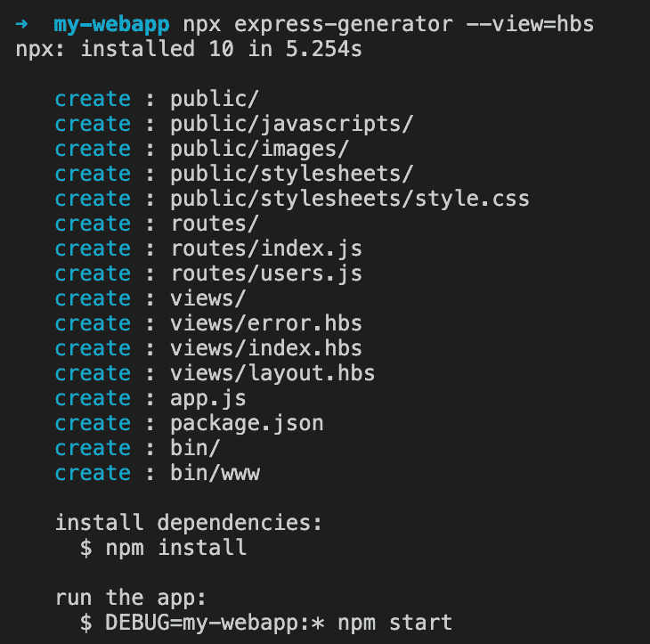

图 13.1 - 创建我们的 Express 脚手架

我们将设置我们的应用程序使用 Handlebars 作为我们的模板，而不是默认选项 Jade。Express 支持多种模板语言（并且可以扩展使用任何模板语言），但为了方便起见，我们将使用类似于我们在第八章中使用的 React 和 Vue 前端框架的 Handlebars，它使用基本的花括号标记。

1.  使用`npm install`来安装我们的依赖项。（请注意，即使之前使用过`npx`，在这里你也要使用`npm`。）这将需要几秒钟的时间，并将下载许多包和其他依赖项。另一个需要注意的是，你需要互联网连接，因为`npm`会从互联网上检索包。

1.  现在，我们准备使用`npm start`来启动我们的应用程序：


图 13.2 - 我们的应用程序开始

1.  好了！现在，让我们在 Web 浏览器中访问我们的 Express 网站：

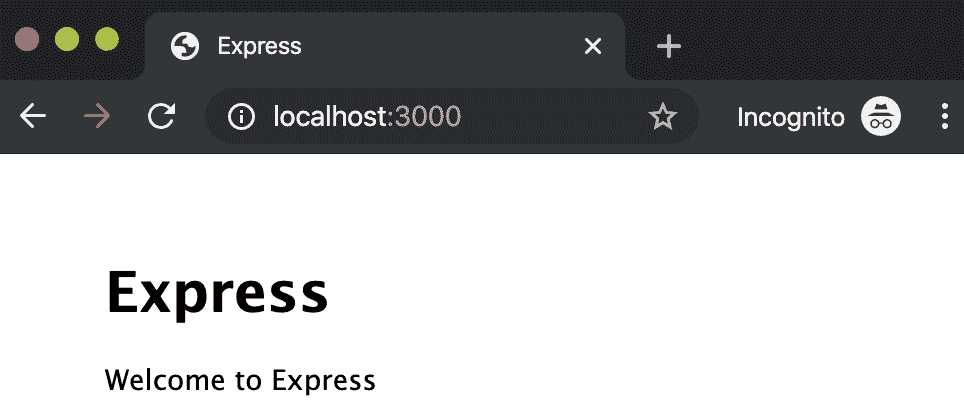

图 13.3 - Express 欢迎页面

太棒了！现在我们到了这一步，让我们比在第二章中所做的更进一步，*我们可以在服务器端使用 JavaScript 吗？当然可以！*。

## RESTful 架构

许多 Web 应用程序的核心是一个 REST（或 RESTful）应用程序。**REST**是**REpresentational State Transfer**的缩写，它是一种处理大多数 Web 技术固有的**无状态**的设计模式。想象一下一个不需要登录或太多数据的标准网站——只是静态的 HTML 和 CSS，就像我们在之前的章节中创建的那样，但更简单：没有 JavaScript。如果我们从状态的角度来看待这样的网站，我们会发现一堆 HTML 并不知道我们的用户旅程，不知道我们是谁，而且，坦率地说，它也不关心。这样的网站就像印刷材料：你通过观看、阅读和翻页来与它交互。你不会改变它的任何内容。一般来说，你真正修改书的状态的唯一方式就是用书签保存你的位置。老实说，这比基本的 HTML 和 CSS 更具交互性。

为了处理用户和数据，REST 被用作一种功能范式。在处理 API 时，我们已经使用了两个主要的 HTTP 动词：GET 和 POST。这是我们将要使用的两个主要动词，但我们将再看看另外两个：PUT 和 DELETE。

如果你熟悉**创建、读取、更新和删除**（**CRUD**）的概念，这就是标准的 HTTP REST 动词的翻译方式：

| **概念** | **HTTP 动词** |
| --- | --- |
| 创建 | 创建 |
| 读取 | 获取 |
| 更新 | PUT 或 PATCH |
| 删除 | 删除 |

更多信息，你可以查看 Packt REST 教程：[`hub.packtpub.com/what-are-rest-verbs-and-status-codes-tutorial/`](https://hub.packtpub.com/what-are-rest-verbs-and-status-codes-tutorial/)。

现在，可能只使用 GET，或者只使用 GET 和 POST 来创建一个完整的应用程序是可能的，但出于安全和架构的原因，你不会想这样做。现在，让我们同意遵循最佳实践，并在这个已建立的范式内工作。

现在，我们将创建一个 RESTful 应用程序。

# 路由和视图

路由和视图是 RESTful 应用程序的 URL 的基础，它们作为逻辑的路径，以及向用户呈现内容的方式。路由将决定代码的哪些部分对应于应用程序界面的 URL。视图确定显示什么，无论是向浏览器、另一个 API 还是其他编程访问。

为了进一步了解 Express 应用程序的结构，我们可以检查它的路由和视图：

1.  首先，让我们在你喜欢的 IDE 中打开 Express 应用程序。我将使用 VS Code 进行工作。如果你使用 VS Code、Atom、Sublime 或其他具有命令行工具的 IDE，我强烈建议安装它们。例如，使用 Atom，你可以在命令提示符中输入`atom .`来启动多面板 Atom 编辑界面，并在 Atom 中打开该目录。

1.  同样，VS Code 会用`code .`来做到这一点。这是它的样子：

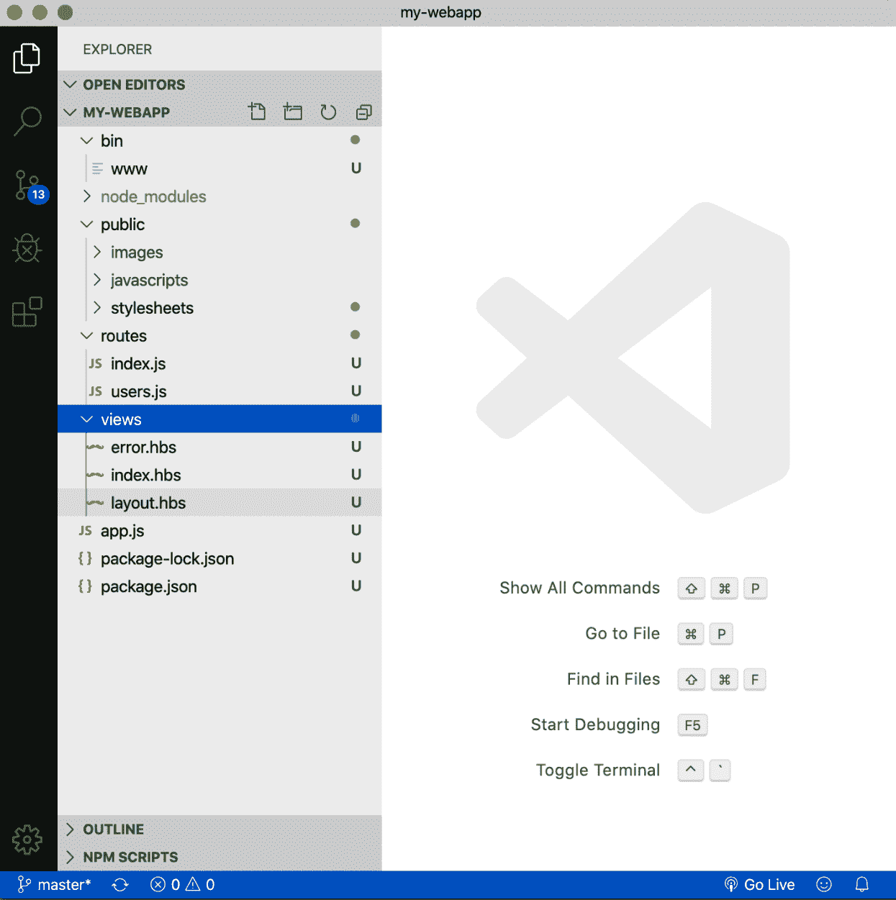

图 13.4 - VS Code

我已经展开了左侧的目录，这样我们就可以看到层次结构的第一层。

1.  打开`app.js`。

你会注意到这段代码的语法是 express-generator 为我们创建的***ES5***，而不是 ES6。暂时，我们不要担心将其转换为 ES6；我们稍后会做。当我们在第一个 Node.js REST 应用程序上工作时，请记住有几种不同的方法可以实现我们的目标，我们将首先采用更冗长的路径来使功能正常工作，然后对其进行迭代，使其更灵活和更 DRY。

1.  现在，你不需要对`app.js`做任何更改，但是花点时间熟悉它的结构。它可能比较陌生的一个方面是文件开头的`require()`语句。类似于前端框架中使用的`import`，`require()`是 Node 的一种方式，用于从其他文件中引入这些部分。在这种情况下，前几行是通过`npm`安装的模块，如下所示：

```js
var express = require('express');
```

请注意，`('express')`前面没有路径。它只是简单地陈述。这表明所引用的模块不是我们代码的本地模块。然而，如果你看一下`indexRouter`的`require`语句，我们会看到它*有*一个路径：`'./routes/index'`。它没有`.js`扩展名，但对于我们的模块使用来说，路径是正确的。

现在，让我们检查一下我们的`routes/index.js`文件。

## 路由

如果你打开`routes/index.js`，你会看到为我们生成的以下几行代码：

```js
var express = require('express');
var router = express.Router();

/* GET home page. */
router.get('/', function(req, res, next) {
    res.render('index', { title: 'Express' });
});

module.exports = router;
```

这里没有太多令人惊讶的地方：正如我们开始了解的那样，Express 文件以`require`语句开头，特别是对于`express`本身。在下一个代码块中，我们开始看到我们的 REST 服务的开端：`GET home page`。看一下注释后面的`router.get()`方法。它*明确*地告诉路由器，当收到 URL 为`/`的 GET 请求时，执行此代码。

我们可以通过在这里添加一些 GET 路径来验证这一事实，只是为了好玩。让我们尝试修改我们的代码如下。在`router.get()`块之后，但在`module.exports`之前，让我们在路由器上注册更多的路由：

```js
/* GET sub page. */
 router.get('/hello', function(req, res, next) {
     res.render('index', { title: 'Hello! This is a route!' });
 });
```

现在，我们必须用*Ctrl + C*停止我们的 Express 服务器，用`npm start`重新启动它，并在`http://localhost:3000/hello`上访问我们的新页面：

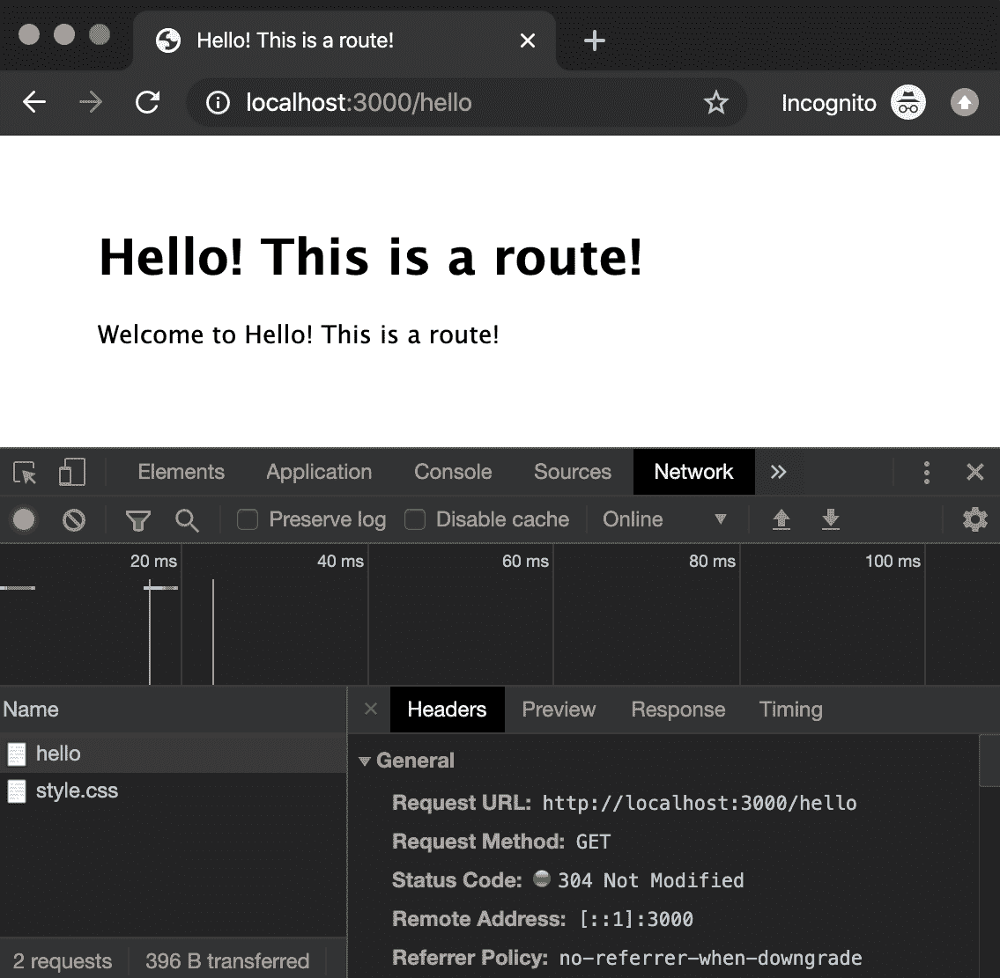

图 13.5 - 一个新的路由，打开了网络选项卡，显示我们正在进行 GET 请求

到目前为止，这应该看起来相当基本。现在，让我们做点不一样的事情。让我们使用这个视图并为 Ajax POST 请求创建一个表单：

1.  创建一个名为`public/javascripts/index.js`的新文件。

1.  编写一个基本的`fetch`请求到端点`/hello`，POST JSON 为`{ message: "This is from Ajax" }`，如下所示：

```js
fetch('/hello', {
 method: 'POST',
 body: JSON.stringify({ message: "This is from AJAX" }),
 headers: {
   'Content-Type': 'application/json'
 },
});
```

1.  像这样在`views/index.hbs`中包含这个文件：

```js
<h1>{{title}}</h1>

<p>Welcome to {{title}}</p>

<p id="data">{{ data }}</p>

<script src="/javascripts/index.js"></script>
```

请注意，我们不需要在路径中包含`public`。这是因为 Express 已经理解到`public`中的文件应该静态提供，而不需要 Express 的干预或解析，与必须运行的 Node 文件相反。

1.  如果现在重新加载页面，你不会看到任何令人兴奋的事情发生，因为我们还没有编写处理 POST 请求的路由。编写如下：

```js
/* POST to sub page. */
router.post('/hello', function(req, res, next) {
  res.send(req.body);
});
```

1.  重新加载页面，你会看到... 什么也没有。在网络选项卡中没有 POST，当然也没有渲染。发生了什么？

Node 有几个工具用于在代码更改时重新启动 Express 服务器，以便引擎会自动刷新，而无需我们杀死并重新启动它，就像我们以前做的那样，但这次没有。这些工具随时间而变化，但我喜欢的是 Supervisor：[`www.npmjs.com/package/supervisor`](https://www.npmjs.com/package/supervisor)。只需在项目目录中执行`npm install supervisor`即可在项目中安装它。

1.  现在，打开项目根目录中的`package.json`文件。你应该看到一个类似于这样的文件，但可能有一些版本差异：

```js
{
 "name": "my-webapp",
 "version": "0.0.0",
 "private": true,
 "scripts": {
 "start": "node ./bin/www"
 },
 "dependencies": {
 "cookie-parser": "~1.4.4",
 "debug": "~2.6.9",
 "express": "~4.16.1",
 "hbs": "~4.0.4",
 "http-errors": "~1.6.3",
 "morgan": "~1.9.1",
 "supervisor": "⁰.12.0"
 }
}
```

这是运行`npm install`时安装的核心内容。运行时，您会看到一个`node_modules`目录被创建，并且有许多文件写入其中。

如果您正在使用诸如 Git 之类的版本控制，您将*不*想提交`node_modules`目录。使用 Git，您会在`.gitignore`文件中包含`node_modules`。

1.  我们接下来要做的事情是修改我们的启动脚本，现在使用 Supervisor：

```js
"scripts": {
     "start": "supervisor ./bin/www"
 },
```

要使用它，我们仍然使用`npm start`，要退出它，只需按下*Ctrl + C*。值得注意的是，Supervisor 最适合本地开发工作，而不是生产工作；还有其他工具，比如 Forever，可以用于这个目的。

1.  现在，让我们运行`npm start`，看看会发生什么。您应该看到一些以按下 rs 重新启动进程结束的控制台消息。在大多数情况下，不需要发出`rs`，但如果需要，可以使用它：

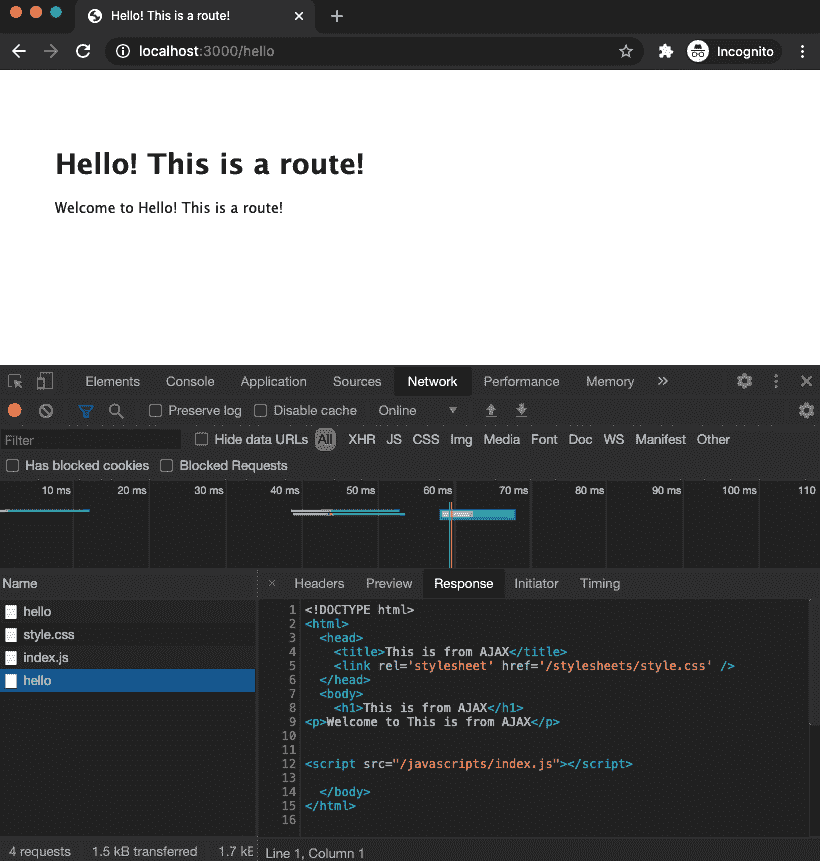

图 13.6 - 来自 Ajax 的响应！

1.  由于我们从前端 JavaScript 发送了`这是来自 AJAX`，我们在响应 HTML 中看到了它的反映！现在，如果我们想要在我们的页面中看到它，我们会在我们的前端 JavaScript 中这样做：

```js
fetch('/hello', {
 method: 'POST',
 body: JSON.stringify({ message: "This is from AJAX" }),
 headers: {
   'Content-Type': 'application/json'
 },
}).then((res) => {
 return res.json();
}).then((data) => {
 document.querySelector('#data').innerHTML = data.message
});
```

我们将看到以下内容：

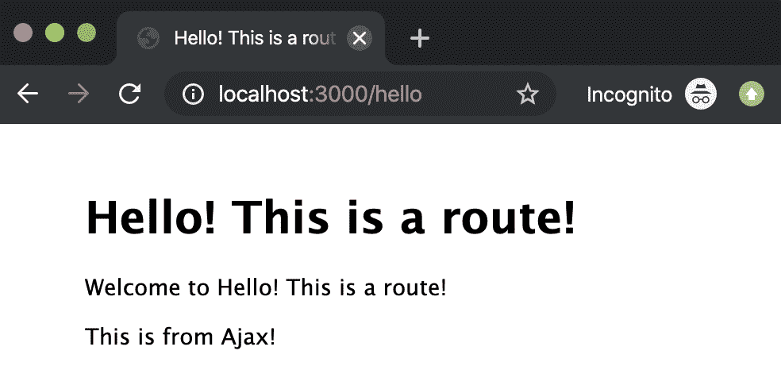

图 13.7 - 来自 Ajax 的消息！

接下来，让我们了解如何保存数据。

## 保存数据

对于我们的下一步，我们将在本地数据存储中持久化数据，这将是一个简单的本地 JSON 文件：

1.  继续并使用*Ctrl + C*退出 Express。让我们安装一个简单的模块，它可以在本地存储中保存数据：`npm install data-store`。

1.  让我们修改我们的路由以使用它，就像这样：

```js
var express = require('express');
var router = express.Router();

const store = require('data-store')({ path: process.cwd() + '/data.json' });

/* GET home page. */
router.get('/', function(req, res, next) {
 res.render('index', { title: 'Express', data: 
 JSON.stringify(store.get()) });
});

/* GET sub page. */
router.get('/hello', function(req, res, next) {
 res.render('index', { title: 'Hello! This is a route!' });
});

/* POST to sub page. */
router.post('/hello', function(req, res) {
 store.set('message', { message: `${req.body.message} at ${Date.now()}` })

 res.set('Content-Type', 'application/json');
 res.send(req.body);
});

module.exports = router;
```

1.  注意`store`的包含以及在`hello`和`/`路由中的使用。让我们还修改我们的`index.hbs`文件，就像这样：

```js
<h1>{{title}}</h1>
<p>Welcome to {{title}}</p>

<button id="add">Add Data</button>
<button id="delete">Delete Data</button>

<p id="data">{{ data }}</p>
<script src="/javascripts/index.js"></script>

```

1.  我们稍后会使用`删除数据`按钮，但现在我们将使用`添加数据`按钮。在`public/javascripts/index.js`中添加一些保存逻辑，就像这样：

```js
const addData = () => {
 fetch('/hello', {
   method: 'POST',
   headers: {
     'Content-Type': 'application/json'
   },
   body: JSON.stringify({ message: "This is from Ajax" })
 }).then((res) => {
   return res.json()
 }).then((data) => {
     document.querySelector('#data').innerHTML = data.message
 })
}
```

1.  现在我们将添加我们的点击处理程序：

```js
document.querySelector('#add').addEventListener('click', () => {
 addData()
 window.location = "/"
})
```

1.  如果您刷新`/`页面并点击添加数据按钮，您应该会看到类似这样的东西：

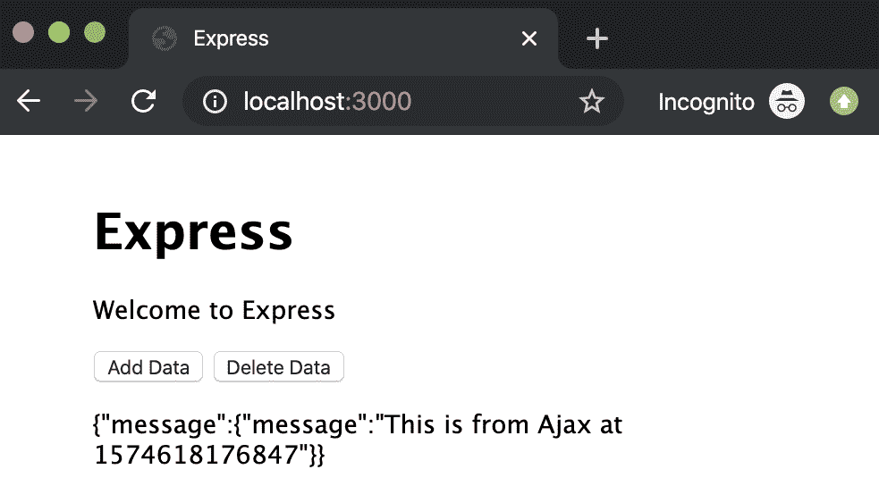

图 13.8 - 添加数据

1.  现在，再次刷新该页面。注意消息是持久的。在您的文件系统中，您还应该注意到一个包含数据的`data.json`文件。

现在我们准备使用删除方法更多地工作一下。

## 删除

我们已经探讨了 GET 和 POST，现在是时候处理另一个基础 REST 动词了：**DELETE**。

顾名思义，它的目标是从数据存储中删除数据。我们已经有了我们的按钮来这样做，所以让我们把它连接起来：

1.  在我们的前端 JavaScript 中，我们将添加以下内容：

```js
const deleteData = () => {
 fetch('/', {
   method: 'DELETE',
   headers: {
     'Content-Type': 'application/json'
   },
   body: JSON.stringify({ id: 'message' })
 })
}
document.querySelector('#delete').addEventListener('click', () => {
 deleteData()
 window.location = "/"
})
```

1.  现在，在路由中添加这个路由：

```js
/* DELETE from json and return to home page */
router.delete('/', function(req, res) {
 store.del(req.body.id);

 res.sendStatus(200);
});
```

那应该是我们需要的全部。刷新您的索引页面，并尝试使用添加和删除按钮。相当容易，对吧？在第十八章中，*Node.js 和 MongoDB*，我们将讨论在一个完整的数据库中持久化和操作我们的数据，但现在，我们可以使用 GET、POST 和 DELETE 的知识。我们将使用 PUT 来处理实际数据库。

## 视图

我们在*Routers*部分涉及了视图的操作，现在让我们深入了解一下。应用程序的**视图层**是表示层，这就是为什么它包含我们的前端 JavaScript。虽然并非所有的后端 Node 应用程序都会提供前端，但了解如何使用它是很方便的。每当我设置一个简单的 Web 服务器时，我都会使用 Express 及其对前端和后端功能的功能。

由于我们有多种前端模板语言可供选择，让我们以 Handlebars 作为逻辑和结构的示例。

如果我们愿意，我们可以在我们的前端代码中提供一些条件逻辑。请注意，这个逻辑是由后端渲染的，所以这是一个很好的例子，说明何时在后端渲染数据（对于前端来说更高效），何时通过 JavaScript 来做（这在表面上更灵活）。

让我们修改我们的`views/index.hbs`文件，就像这样：

```js
{{#if data }}
 <p id="data">{{ data }}</p>
{{/if}}
```

让我们还修改`routes/index.js`：

```js
/* GET home page. */
router.get('/', function(req, res, next) {
 res.render('index', { title: 'Express', data: 
 JSON.stringify(Object.entries(store.get()).length > 0 ? store.get() :
  null) });
});
```

现在，我们使用三元运算符来简化我们的显示逻辑。由于我们从存储中获取的数据是 JSON，我们不能简单地测试它的长度：我们必须使用`Object.entries`方法。如果你认为我们可以将`store.get()`保存到一个变量中而不是写两次，你是对的。然而，在这种情况下，我们不需要占用额外的内存空间，因为我们立即返回它而不是对它进行操作。在这种情况下，性能影响是可以忽略不计的，但这是需要记住的一点。

现在，如果我们删除我们的数据，我们会看到这个：

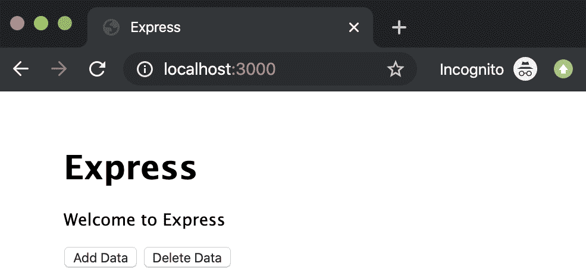

图 13.9 - 删除数据后

看起来比看到一个空对象的花括号要少混乱一些。当然，我们可以通过编写更复杂的条件在前端进行条件工作，但为什么在后端可以发送适当的数据时要做这项工作呢？当然，对于这两种情况都有情况，但在这种情况下，最好让每个部分都做自己的工作。

你可以在这里找到我们完成的工作：[`github.com/PacktPublishing/Hands-on-JavaScript-for-Python-Developers/tree/master/chapter-13/my-webapp`](https://github.com/PacktPublishing/Hands-on-JavaScript-for-Python-Developers/tree/master/chapter-13/my-webapp)。

现在让我们把注意力转向如何使用**控制器**将数据实际传入 Express。

# 控制器和数据：在 Express 中使用 API

正如你可能在网络上听到的那样，Express 很棒，因为它对你如何使用它没有太多的意见，同时，人们说 Express 很难使用，因为它的意见不够明确！虽然 Express 通常不设置为传统的模型-视图-控制器设置，但将功能拆分出路由并放入单独的控制器中可能是有益的，特别是如果你可能在路由之间有类似的功能，并且想要保持代码的 DRY。

如果你对**模型-视图-控制器**（**MVC**）范式不太熟悉，不用担心——我们不会详细讨论它，因为这是一个非常沉重的话题，有着自己的争论和惯例。现在，我们只是定义一些术语：

+   **模型**是应用程序的一部分，处理数据操作，特别是与数据库之间的通信。

+   **控制器**处理来自路由的逻辑（即用户的 HTTP 请求路径）。

+   **视图**是向最终客户端提供标记的表示层，由控制器路由。

这就是 MVC 范式的样子：

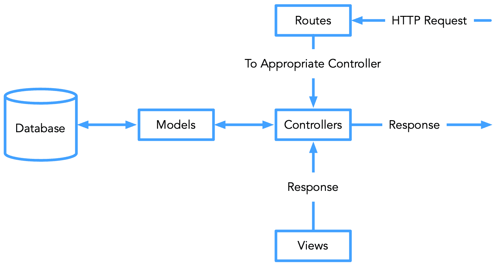

图 13.10 - MVC 范式

让我们来看一个示例应用程序。在[`github.com/PacktPublishing/Hands-on-JavaScript-for-Python-Developers/tree/master/chapter-13/controllers`](https://github.com/PacktPublishing/Hands-on-JavaScript-for-Python-Developers/tree/master/chapter-13/controllers)是一个使用 Express 的应用程序。

这是一个使用控制器和模型的 API。正如我们将看到的，这种结构将简化我们的工作流程。这仍然是一个相当简单的例子，但这会让你了解为什么控制器和模型会派上用场。让我们来调查一下：

1.  继续运行`npm install`，然后运行`npm start`来运行应用程序。它应该可以在你的浏览器中访问`http://localhost:3000`，但如果你有其他东西在运行，Node 会警告你并指定一个不同的端口。你会看到以下内容：

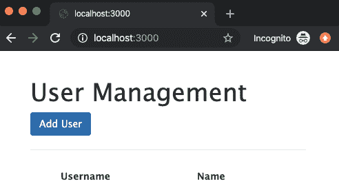

图 13.11 - 我们的示例 Express 应用程序

1.  到目前为止非常简单。继续点击添加用户几次，然后尝试一下功能。这使用后端的随机用户 API 来创建用户并将它们持久化到文件系统数据存储中。

1.  查看`public/javascripts`目录中的客户端 JavaScript。这应该看起来很熟悉。如果我们记得`fetch()`调用的结构，它返回一个 promise，所以我们可以使用`.then()`范式来对我们的事件做出反应。

1.  在`public/javascripts/index.js`中，我们可以看到当我们点击添加用户时创建用户的机制：

```js
document.querySelector('.add-user').addEventListener('click', (e) => {
  fetch('/user', {
    method: 'POST'
  }).then( (data) => {
    window.location.reload()
  })
})
```

这不应该有什么意外：我们在事件处理程序中使用 JavaScript 的`fetch`来调用带有 POST 的`/user`路由。**路由**基本上是 Express（或其他）应用程序中的一个端点：它包含一些逻辑来对事件做出反应。那么，这个逻辑是什么？

1.  打开`routes/user.js`：

```js
var express = require('express');
var router = express.Router();

const UsersController = require('../controllers/users');

/* GET all users. */
router.get('/', async (req, res, next) => {
  res.send(await UsersController.getUsers());
});

/* GET user. */
router.get('/:user', async (req, res, next) => {
  const user = await UsersController.getUser(req.params.user);
  res.render('user', { user: user });
});

/* POST to create user. */
router.post('/', async (req, res, next) => {
  await UsersController.createUser();
  res.send(await UsersController.getUsers());
});

/* DELETE user. */
router.delete('/:user', async (req, res, next) => {
  await UsersController.deleteUser(req.params.user);
  res.sendStatus(200);
});

module.exports = router;
```

首先，让我们将其结构与其他示例进行比较。首先，我们将看到用户控制器的`require()`语句。这里有一个`router.post()`方法语句，它使用`async`/`await`进行对控制器的异步调用。然后，我们的控制器将调用我们的模型来进行数据库工作。

到目前为止，有许多文件和路径需要执行。在我们在代码中迷失之前，让我们看一下前端方法（例如添加用户点击处理程序）如何与我们的 Express 后端通信的图表：

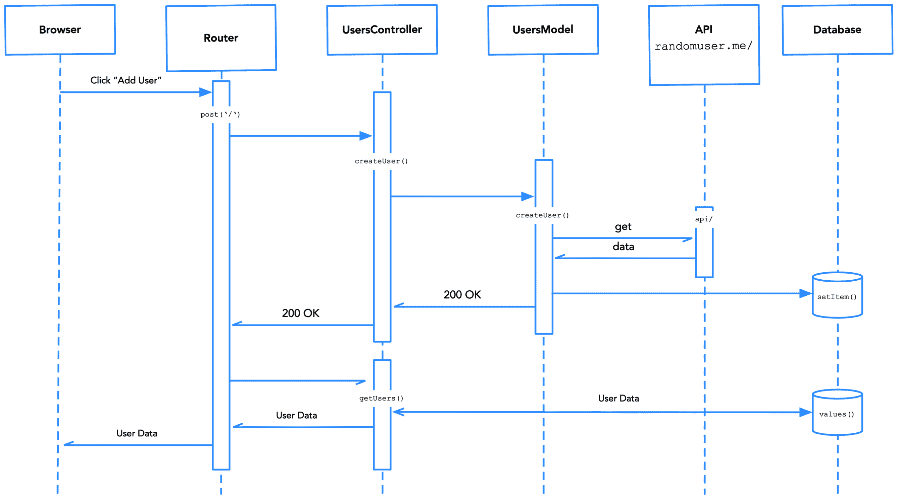

图 13.14 - 端到端通信

从左到右，从上到下阅读，我们可以看到每个步骤在过程中扮演的角色。对于从 API 检索信息这样基本的事情，它可能*看起来*有点复杂，但这种架构模式的一部分力量在于每个层可以由不同的一方编写和控制。例如，模型层通常由数据库专家掌握，而不是其他类型的后端开发人员。

当您跟踪控制器和模型的代码时，请考虑代码每一层的关注点分离如何使设计更加模块化。例如，我们使用一个 LocalStorage 数据库来存储我们的用户。如果我们想要将 LocalStorage 替换为更强大的系统，比如 MongoDB，我们实际上只需要编辑一个文件：模型。事实上，甚至模型也可以被抽象化为具有统一数据处理程序，然后使用适配器进行特定数据库方法的调用。

这对我们来说可能有点太多了，但接下来让我们把目光转向使用我们刚学到的原则来创建一个星际飞船游戏。我们将使用这个 Node.js 后端来制作 JavaScript 游戏的前端最终项目。

在下一节中，我们将开始创建我们游戏的 API。

# 使用 Express 创建 API

谁不喜欢像《星球大战》或《星际迷航》中的美丽星舰战斗呢？我碰巧是科幻小说的忠实粉丝，所以让我们一起来构建一个使用存储、路由、控制器和模型来跟踪我们游戏过程的 RESTful API。虽然我们将专注于应用程序的后端，但我们将建立一个简单的前端来填充数据和测试。

您可以在[`github.com/PacktPublishing/Hands-on-JavaScript-for-Python-Developers/tree/master/chapter-13/starship-app`](https://github.com/PacktPublishing/Hands-on-JavaScript-for-Python-Developers/tree/master/chapter-13/starship-app)找到一个正在进行中的示例应用程序。让我们从那里开始，您可以使用以下步骤完成它：

1.  如果您还没有克隆存储库，请克隆它。

1.  进入`cd starship-app`目录并运行`npm install`。

1.  使用`npm start`启动项目。

1.  在浏览器中打开`http://localhost:3000`。如果您已经在端口 3000 上运行任何项目，`start`命令可能会提示您使用其他端口。这是我们的基本前端：

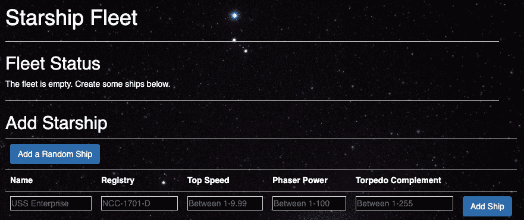

图 13.15 - 星舰舰队

1.  随意添加和销毁飞船，无论是随机还是手动。这将是我们游戏的设置。

1.  现在，让我们解开代码在做什么。这是我们的文件结构：

```js
.
├── README.md
├── app.js
├── bin
│ └── www
├── controllers
│ └── ships.js
├── data
│ └── starship-names.json
├── models
│ └── ships.js
├── package-lock.json
├── package.json
├── public
│ ├── images
│ │ └── bg.jpg
│ ├── javascripts
│ │ └── index.js
│ └── stylesheets
│ └── style.css
├── routes
│ ├── index.js
│ ├── ships.js
│ └── users.js
└── views
 ├── error.hbs
 ├── index.hbs
 └── layout.hbs
```

1.  打开`public/javascripts/index.js`。让我们首先检查随机飞船创建的事件处理程序：

```js
document.querySelector('.random').addEventListener('click', () => {
 fetch('/ships/random', {
   method: 'POST'
 }).then( () => {
   window.location.reload();
 })
})
```

到目前为止一切都很顺利。这应该看起来很熟悉。

1.  让我们来看看这条路线：`/ships/random`。打开`routes/ships.js`（我们可以猜测`/ships/`的路由将在`ships.js`文件中，但我们可以通过阅读`app.js`文件中的路由来确认这一点，因为我们已经学过了）。阅读`/random`路线：

```js
router.post('/random', async (req, res, next) => {
 await ShipsController.createRandom();
 res.sendStatus(200);
});
```

我们首先注意到的是这是一个`async`/`await`结构，因为我们将在前端使用`fetch`，（剧透）后端使用数据库。

1.  让我们接下来看一下控制器方法：

```js
exports.createRandom = async () => {
 return await ShipsModel.createRandom();
}
```

1.  很容易。现在是模型方法：

```js
exports.createRandom = async () => {
 const shipNames = require('../data/starship-names');
 const randomSeed = Math.ceil(Math.random() * 
  shipNames.names.length);

 const shipData = {
   name: shipNames.names[randomSeed],
   registry: `NCC-${Math.round(Math.random()*10000)}`,
   shields: 100,
   torpedoes: Math.round(Math.random()*255+1),
   hull: 0,
   speed: (Math.random()*9+1).toPrecision(2),
   phasers: Math.round(Math.random()*100+1),
   x: 0,
   y: 0,
   z: 0
 };

 if (storage.getItem(shipData.registry) || storage.values('name') 
 == shipData.name) {
   shipData.registry = `NCC-${Math.round(Math.random()*10000)}`;
   shipData.name = shipNames.names[Math.round(Math.random()*
    shipNames.names.length)];
 }
  await storage.setItem(shipData.registry, shipData);
 return;
}
```

好的，这有点复杂，所以让我们来解开这个。前几行只是从一个为你提供的种子文件中选择一个随机名称。我们的`shipData`对象由几个键/值对构成，每个对应于我们新创建的船只的特定属性。之后，我们检查我们的数据库，看看是否已经有一个同名或注册号的船只。如果有，我们将再次随机化。 

然而，与每个应用程序一样，都有改进的空间。这里有一个挑战给你。

## 挑战

你的第一个任务是：你能想出如何改进代码，使得在重新随机化时，优雅地检查*新*随机化是否也存在于我们的数据库中吗？提示：你可能想创建一个单独的辅助函数或两个。

也许你得到了类似于这样的东西（[`github.com/PacktPublishing/Hands-on-JavaScript-for-Python-Developers/tree/master/chapter-13/starship-app-solution1`](https://github.com/PacktPublishing/Hands-on-JavaScript-for-Python-Developers/tree/master/chapter-13/starship-app-solution1)）：

```js
const eliminateExistingShips = async () => {
 const shipNames = require('../data/starship-names');
 const ships = await storage.values();

 const names = Object.values(ships).map((value, index, arr) => {
   return value.name;
 });

 const availableNames = shipNames.names.filter((val) => {
   return !names.includes(val);
 });

 const unavailableRegistryNumbers = Object.values(ships).map((value, index, 
 arr) => {
   return value.registry;
 });

 return { names: availableNames, unavailableRegistries: 
 unavailableRegistryNumbers };
}
```

并使用它，执行以下命令：

```js
exports.createRandom = async () => {
 const { names, unavailableRegistries } = await eliminateExistingShips();

 const randomSeed = Math.ceil(Math.random() * names.length);

 const shipData = {
   name: names[randomSeed],
   registry: `NCC-${Math.round(Math.random() * 10000)}`,
   shields: 100,
   torpedoes: Math.round(Math.random() * 255 + 1),
   hull: 0,
   speed: (Math.random() * 9 + 1).toPrecision(2),
   phasers: Math.round(Math.random() * 100 + 1),
   x: 0,
   y: 0,
   z: 0
 };

 while (unavailableRegistries.includes(shipData.registry)) {
   shipData.registry = `NCC-${Math.round(Math.random() * 10000)}`;
 }
 await storage.setItem(shipData.registry, shipData);
 return;
}
```

那么，我们在这里做什么呢？首先，让我们看一下`Objects.map`的用法：

```js
const names = Object.values(ships).map((value, index, arr) => {
   return value.name;
});
```

在这里，我们正在使用`ships`对象的`.map()`方法来创建一个*只包含*现有船只名称的新数组。基本上，我们所做的就是将对象的每个名称返回到我们的数组中，所以现在我们有了一个可枚举的数据类型。

接下来，我们想要*消除*已使用的名称，所以我们将使用数组的`.filter()`函数，只有在它不包含在我们之前创建的数组中时才返回该值：

```js
const availableNames = shipNames.names.filter((val) => {
   return !names.includes(val);
});
```

我们与我们的名称一样处理我们的注册号，并返回一个对象。

现在，这里有一个新技巧：解构一个对象。看看这个：

```js
 const { names, unavailableRegistries } = await eliminateExistingShips();
```

我们在这里做的是一举两得地分配两个变量！由于我们的`eliminateExistingShips()`方法返回一个对象，我们可以使用*解构*将其分解为单独的变量。这并不是完全必要的，但它通过减少我们使用点符号的次数来简化我们的代码。

继续。

## 船只属性

这是我们为游戏定义的船只属性及其描述。这个属性表对我们将构建的所有船只都是相同的，无论是随机还是手动：

| **name** | 一个字符串值。 |
| --- | --- |
| **registry** | 一个字符串值。 |
| **shields** | 一个护盾强度的数字，初始化为 100。随着船只受到损害，这个数字会减少。 |
| **torpedos** | 一个数字，表示船只拥有的鱼雷数量。在我们的游戏中，每次发射鱼雷时，这个数字会减少 1。 |
| **hull** | 从 0 开始，一个数字，表示护盾耗尽后船只所承受的船体损伤。当这个数字达到 100 时，船只被摧毁。希望每个人都能到达逃生舱！ |
| **speed** | 从 warp 1 到 9.99，我们的船只有一个可变速度。 |
| **phasers** | 没有战斗相位器的船只是不完整的！定义一个从 1 到 100 的随机数字，以指定船只的相位器造成的伤害。 |
| **x, y, and z** | 我们船只在三维空间中的坐标，从[0,0,0]开始。对于我们的游戏玩法，我们将坐标上限设定为[100,100,100]。我们不希望我们的船只在太空中迷失！ |

对于我们的数据库，我们并没有做任何复杂的事情；我们使用了一个名为`node-persist`的 Node 包。它使用文件系统上的一个目录来存储值。它很基础，但能完成任务。我们将在第十八章 *Node.js 和 MongoDB* 中介绍真正的数据库。请注意，这些方法也是`async`/`await`函数，因为我们期望代码与数据库交互时会有轻微的延迟（在这种情况下，是我们的文件系统）。

好了！由于我们的函数只返回空值，它将触发我们控制器方法的完成，然后返回一个`200 OK`消息到前端。根据我们的前端代码，页面将重新加载，显示我们的新飞船。

这里有第二个改进的空间：你能否使用 DOM 操作在不刷新页面的情况下将你的飞船添加到页面上？你将需要修改整个堆栈的所有级别来实现你的目标，通过将随机值返回到前端。

在你开始之前，让我们问自己一个重要的问题：*在我们当前的结构下这样做是否有意义*？如果你的思维过程导致了一个过于复杂的解决方案，就像我的一样，答案是否定的。很明显，处理 DOM 更新的最佳方式是利用我们拥有的另一个工具：一个框架。我们现在暂且不管它，但在我们的最终项目中第十九章 *将所有内容整合在一起* 中，我们将重新讨论它。

接下来，让我们看看星舰战斗将如何进行。如果我们回到我们的飞船路由，我们会看到这个路由：

```js
router.get('/:ship1/attack/:ship2', async (req, res, next) => {
 const damage = await ShipsController.fire(req.params.ship1, 
 req.params.ship2);
 res.sendStatus(200);
});
```

如果你能从路由的构造中猜出来，路由将以第一艘飞船的名称作为参数（`ship1`），然后是`attack`字符串，然后是第二艘飞船的名称。这是一个 RESTful 路由的例子，以及 Express 如何处理路径参数。在我们的控制器调用中，我们使用这些参数和控制器的`.fire()`方法。在控制器中，我们看到这样的内容：

```js
exports.fire = async (ship1, ship2, weapon) => {
 const target = await ShipsModel.getShip(ship2);
 const source = await ShipsModel.getShip(ship1);
 let damage = calculateDamage(source, target, weapon);

 if (weapon == 'torpedo' && source.torpedoes > 0) {
   ShipsModel.fireTorpedo(ship1);
 } else {
   damage = 0
 }

 return damage;
}
```

现在我们玩得很开心。你可以追踪不同的模型部分，但我想指出使用`calculateDamage`辅助函数。你会在文件的顶部找到它。

对于伤害计算，我们将使用以下内容：


或者，用英语说，“计算目标被源命中的几率是通过从三维空间中两艘飞船之间的距离中减去 100 来计算的，得到 0%到 100%之间的几率。为了计算这个值，将 100 减去*x*、*y*和*z*坐标增量的平方和的平方根四舍五入。”（是的，我不得不查找三维空间距离的计算。如果这对你来说很陌生，不用担心。）

然后，让*R[1]*成为 0 到 100 之间的伪随机值，四舍五入。在 JavaScript 中，就像所有编程语言一样，随机数在技术上只是一个*伪随机*数：


或者，“源头的相位炮可能造成的伤害是通过将源头的相位功率乘以一个`Math.random()`数四舍五入得到的。”

然而，如果源头发射了鱼雷（并且还有鱼雷剩余），那么*possibledamage* *= 125*。

让*R[2]*成为 0 到 100 之间的伪随机数，四舍五入：


如果*chance*减去随机数大于 0，伤害将发生为*possibledamage*。否则，不会发生伤害。

好了，现在我们有了计算。你能想出用 JavaScript 代码来实现这个吗？

就是这样：

```js
const calculateDamage = (ship1, ship2, weapon) => {
 const distanceBetweenShips = Math.sqrt(Math.pow(ship2.x - ship1.x, 2) + 
 Math.pow(ship2.y - ship1.y, 2) + Math.pow(ship2.z - ship1.z, 2));
 const chanceToStrike = Math.floor(100-distanceBetweenShips);
 const didStrike = (Math.ceil(Math.random()*100) - chanceToStrike) ? true : 
 false;
 const damage = (didStrike) ? ((weapon == 'phasers') ? 
 Math.ceil(Math.random()*ship1.phasers) : TORPEDO_DAMAGE) : 0;
 return damage;
}
```

为了完成我们的游戏，我们需要创建一个机制来实际发射并在前端注册伤害。

# 总结

本章我们涵盖了很多内容，从路由到控制器再到模型。请记住，并非每个应用都遵循这种范式，但这是一个很好的基准，可以帮助你开始处理后端服务与前端的关系。

我们应该记住，使用`express-generator`可以帮助搭建应用程序，使用`npm`或`npx`。路由和视图是我们应用程序的前线，决定代码的路由和最终客户端所看到的内容（无论是 JSON 还是 HTML）。我们使用 API 来探索 API 的固有异步行为，并创建了*自己的*API！

在下一章中，我们将讨论 Express 与 Django 或 Flask 不同类型的框架。我们还将研究如何连接我们的前端和后端框架。

# 进一步阅读

+   教程：REST 动词和状态码：[`hub.packtpub.com/what-are-rest-verbs-and-status-codes-tutorial/`](https://hub.packtpub.com/what-are-rest-verbs-and-status-codes-tutorial/)

+   如何在 Node 和 Express 中启用 ES6（及更高版本）语法：[`www.freecodecamp.org/news/how-to-enable-es6-and-beyond-syntax-with-node-and-express-68d3e11fe1ab/`](https://www.freecodecamp.org/news/how-to-enable-es6-and-beyond-syntax-with-node-and-express-68d3e11fe1ab/)

+   在 Express 4 中处理 GET 和 POST 请求：[`codeforgeek.com/handle-get-post-request-express-4/`](https://codeforgeek.com/handle-get-post-request-express-4/)

+   如何设计 REST API：[`restfulapi.net/rest-api-design-tutorial-with-example/`](https://restfulapi.net/rest-api-design-tutorial-with-example/)
