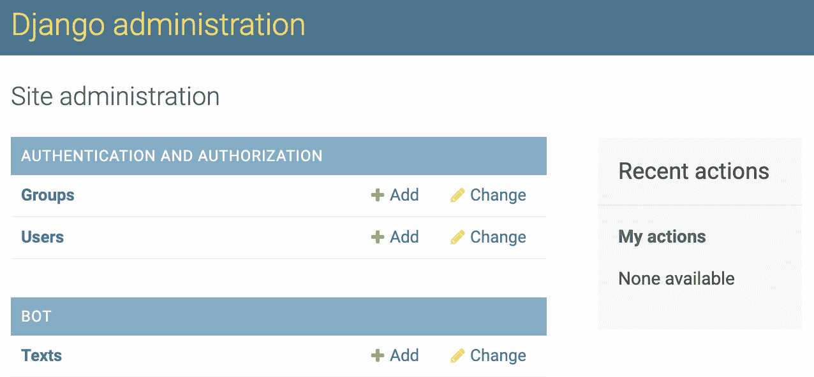
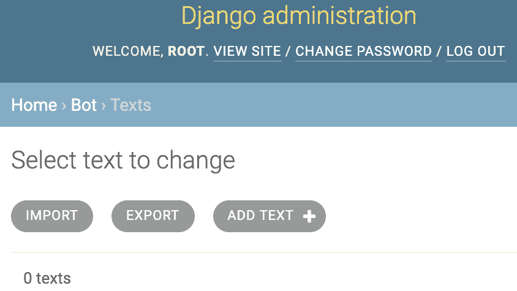
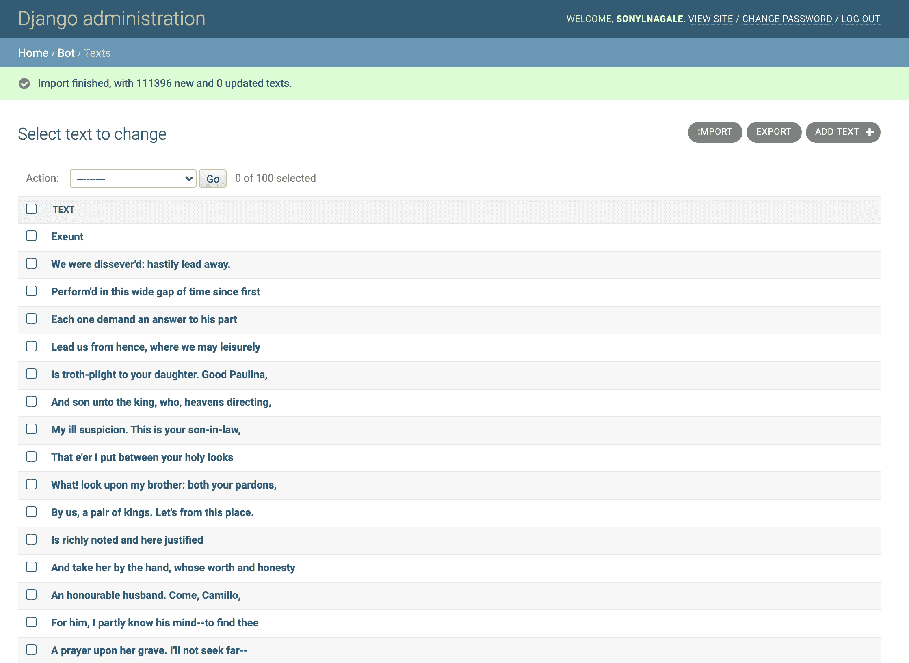

React 与 Django

到目前为止，我们已经使用了相当多的 Express，但 Django 提供了标准 Express 应用程序所没有的功能。它具有内置的脚手架、数据库集成和模板工具，提供了一种诱人的后端解决方案。然而，正如我们所学到的，JavaScript 在前端解决方案方面具有更强大的功能。那么，我们如何将这两者结合起来呢？

我们要做的是创建一个 Django 后端，为了将两种伟大的技术联系在一起，为 React 应用提供服务。

本章将涵盖以下主题：

+   Django 设置

+   创建 React 前端

+   将所有内容整合在一起

# 第十八章：技术要求

准备好使用存储库中`chapter-14`目录中提供的代码，该存储库位于[`github.com/PacktPublishing/Hands-on-JavaScript-for-Python-Developers/tree/master/chapter-14`](https://github.com/PacktPublishing/Hands-on-JavaScript-for-Python-Developers/tree/master/chapter-14)。由于我们将使用命令行工具，还需要准备好终端或命令行 shell。我们需要一个现代浏览器和本地代码编辑器。

# Django 设置

有几种不同的方法可以结合 React 和 Django，复杂程度和集成级别各不相同。我们将采取的方法是将 React 编写为 Django 应用程序的前端，加载一个模板，让 React 处理前端。然后，我们将使用标准的 Ajax 调用与 Django 路由和数据存储逻辑进行交互。这是一种将这两种技术结合在一起的中间方法，略微保持它们完全分开，但也不为每个路由创建一个 React 应用程序。我们将保持简单。

## 请告诉我们我们将要劳作在什么上？说！

我们的应用将是一个聊天机器人，将使用大师剧作家莎士比亚的话语来回应输入！首先，我们将使用一个简单的 Django 实例的数据库加载莎士比亚的完整文本；接下来，我们将编写我们的路由来搜索匹配的文本；最后，我们将创建我们的 React 应用程序，成为用户和 Django 后端之间的桥梁。我们不会在我们的 Python 中使用复杂的机器学习或语言处理，尽管如果你愿意，你可以随时将我们的机器人推向更高一步！

请注意，我们将使用 Python 3。有关安装和设置 Django 的更详细信息，包括使用虚拟环境，请访问官方文档[`docs.djangoproject.com/en/3.0/topics/install/`](https://docs.djangoproject.com/en/3.0/topics/install/)。

首先，让我们使用以下步骤设置 Django：

1.  创建一个新的虚拟环境：`python -m venv shakespeare`。

1.  启动`venv`：`source shakespeare/bin/activate`。

1.  安装 Django：`python -m pip install Django`。

1.  使用`django-admin startproject shakespearebot`开始一个新项目。

1.  测试我们的 Django 设置：`cd shakespearebot ; python manage.py runserver`。

1.  如果我们访问[`127.0.0.1:8000/`](http://127.0.0.1:8000/)，我们应该看到默认的 Django 欢迎页面。

1.  我们需要一个应用程序来使用：`python manage.py startapp bot`。

1.  在`settings.py`中将 bot 应用添加到`INSTALLED_APPS`：`'bot.apps.BotConfig'`。

接下来，我们将需要我们的莎士比亚数据集：

1.  在书的 GitHub 存储库的`chapter-14`目录中包含一个名为`Shakespeare_data.csv.zip`的文件。解压缩此文件，你就可以随时查阅莎士比亚的所有作品。我们将使用一个基本模型将这个 CSV 导入 Django。

1.  在`bot`目录中编辑`models.py`如下：

```js
from django.db import models

class Text(models.Model):
  PlayerLine = models.CharField(max_length=1000)

   def __str__(self):
       return self.PlayerLine
```

我们将保持数据库简单，只摄取文本行，而不是行周围的任何其他数据。毕竟，我们只会对语料库进行简单的文本搜索，没有比这更复杂的操作。在导入数据的下一步之前，让我们包含一个 Django 模块，以使我们的生活更轻松：`pip install django-import-export`。这个模块将允许我们通过几次点击而不是命令行过程轻松导入我们的文本。

现在我们有一个模型，我们需要在`admin.py`中注册它：

```js
from import_export.admin import ImportExportModelAdmin
from django.contrib import admin
from .models import Text

@admin.register(Text)
class TextAdmin(ImportExportModelAdmin):
   pass
```

让我们登录到 Django 的管理部分，确保一切正常运行。我们首先必须运行我们的数据库命令：

1.  准备数据库命令：`python manage.py makemigrations`。

1.  接下来，使用`python manage.py migrate`执行更改。

1.  使用`python manage.py createsuperuser`创建一个管理用户，并按照提示操作。请注意，当您创建密码时，您将看不到输入，尽管它正在使用您的输入。

1.  重新启动 Django：`python manage.py runserver`。

1.  访问[`127.0.0.1/admin`](http://127.0.0.1/admin)，并使用刚刚创建的凭据登录。

我们将在我们的管理面板中看到我们的机器人应用程序：



图 14.1 - Django 的站点管理面板

太好了，那只是一个检查点。我们还有更多的工作要做！因为我们有`django-import-export`，让我们把它连接起来：

在`settings.py`文件中进行以下操作：

1.  将`import_export`添加到`INSTALLED_APPS`。

1.  在设置部分的末尾加上这行代码，正确地设置我们的静态文件路径：`STATIC_ROOT = os.path.join(os.path.dirname(os.path.abspath(__file__)), 'static')`。

1.  运行`python manage.py collectstatic`。

现在，您可以继续在管理面板中点击“文本”，您将看到可用的“导入”和“导出”按钮：



图 14.2 - 是时候导入我们的文本了！

点击“导入”按钮，并按照步骤导入包含莎士比亚文本的 CSV 文件：



图 14.3 - 导入完成**注意：**导入会花一些时间，但不会像威尔一开始写作那样长！请务必在预览后确认导入。

## 路由我们的请求

在我们开始 React 之前，我们需要构建的下一个部分是我们的 API，它将为我们的前端提供内容。让我们看看步骤：

1.  在`bot/views.py`中，设置我们将用于测试的索引路由，以及我们将用于提供信息的 API 路由：

```js
from django.http import HttpResponse
from django.template import Context, loader
from bot.models import Text
import random
import json

def index(request):
   template = loader.get_template("bot/index.html")
   return HttpResponse(template.render())

def api(request):
   if request.method == 'POST':
       data = json.loads(request.body.decode("utf8"))
       query = data['chattext']
       responses = Text.objects.filter(PlayerLine__contains=" %s " 
       % (query))

   if len(responses) > 0:
       return HttpResponse(responses[random.randint(0,
       len(responses))])

   else:
       return HttpResponse("Get thee to a nunnery!")
```

所有这些都应该是简单的 Python，所以我们不会详细介绍。基本上，当我们向 API 发送 POST 请求时，Django 将在数据库中搜索包含通过 Ajax 发送的单词的文本行。如果找到一个或多个，它将随机返回一个给前端。如果没有，我们总是希望处理我们的错误情况，因此它将以哈姆雷特著名的一句话作为回应：“去修道院吧！”

1.  创建一个文件`bot/urls.py`，并插入以下代码：

```js
from django.urls import path

from . import views

urlpatterns = [
 path('', views.index, name='index'),
 path('api', views.api, name='api'),
]
```

1.  编辑`shakespearebot/urls.py`如下：

```js
from django.contrib import admin
from django.urls import path, include
import bot

urlpatterns = [
   path('admin/', admin.site.urls),
   path('api/', include('bot.urls')),
   path('', include('bot.urls')),
]
```

1.  还有一件事：在`shakespearebot/settings.py`中，按照以下方式移除 CSRF 中间件：

```js
'django.middleware.csrf.CsrfViewMiddleware',
```

1.  现在是有趣的部分：我们用于测试的前端。创建一个名为`bot/`的文件

`templates/bot/index.html`并添加以下 HTML 设置：

```js
<!DOCTYPE html>

<html>

<head>
 <style>
 textarea {
 height: 500px;
 width: 300px;
 }
 </style>
</head>

<body>
 <form method="POST" type="" id="chat">
 <input type="text" id="chattext"></textarea>
 <button id="submit">Chat</button>
 <textarea id="chatresponse"></textarea>
 </form>

</body>

</html>
```

在这里，我们可以看到一些基本的表单和一些样式 - 没有太多内容，因为这只是一个用来测试我们对 API 理解是否正确的页面。

1.  在表单之后插入这个脚本：

```js
<script>
   document.getElementById('submit').addEventListener('click', (e) 
   => {
     e.preventDefault()

     let term = document.getElementById('chattext').value.split('
      ')
     term = term[term.length - 2] || term[0]

     fetch("/api", {
       method: "POST",
       headers: {
         'Content-Type': 'application/json'
       },
       body: JSON.stringify({ chattext: term })
     })
       .then(response => response.text())
       .then(data => document.querySelector('#chatresponse').value
        += `\n${data}\n`)
   })
 </script>
```

到目前为止，fetch 调用的结构应该很熟悉，所以让我们快速浏览一下：当点击按钮时，将文本按空格分割，选择倒数第二个单词（最后一个“单词”可能是标点符号），或者如果是一个单词条目，则是单词本身。将这个术语发送到 API，并等待响应。

如果一切正常工作，我们应该会看到一个非常激动人心的页面：


图 14.4 - 这是一个开始！

虽然不多，但这应该足以测试我们的后端。尝试在聊天框中输入几个单词，单击聊天，然后看看会发生什么。希望您能听到很久以前在阿文长听到的一些话。

# 创建 React 前端

如前所述，有几种不同的方法可以使用 Django 和 React。我们将分别设置我们的前端，并让 React 做自己的事情，让 Django 做自己的事情，并让它们在中间握手。正如我们将看到的，这种方法确实有其局限性，但这是一个基本介绍。我们以后会变得更加复杂。

让我们开始吧，首先创建一个新的 React 应用程序：

1.  切换到`shakespearebot`目录（而不是`bot`）并执行`npx create-react-app react-frontend`。

1.  继续执行`cd react-frontend && yarn start`并在`http://localhost:3000`访问开发服务器，以确保一切正常。您应该在前述 URL 收到 React 演示页面。使用*Ctrl* + *C*停止服务器。

1.  执行`yarn build`。

现在，这里的事情有点受限制。我们现在所做的是执行创建站点的生产优化构建。这是设计为发布代码，而不是开发代码，因此限制在于您无法编辑代码并在不再次运行构建的情况下反映出来。考虑到这一点，让我们构建并继续我们的设置。

在我们的`shakespearebot`目录中，我们将对`settings.py`和`urls.py`进行一些编辑：

1.  在`settings.py`的`TEMPLATES`数组中，将`DIRS`更改为`'DIRS': [os.path.join(BASE_DIR, 'react-frontend')],`。

1.  同样在`settings.py`中，修改`STATIC_URL`和`STATICFILES_DIRS`变量如下：

```js
STATIC_URL = '/static/'
STATICFILES_DIRS = (
 os.path.join(BASE_DIR, 'react-frontend', 'build', 'static'),

)
```

1.  在`urls.py`中添加一行，以便`urlpatterns`数组读取如下：

```js
urlpatterns = [
   path('admin/', admin.site.urls),
   path('api/', include('bot.urls')),
   path('', include('bot.urls')),
]
```

1.  在`bot`目录中，是时候将我们的前端指向我们的静态目录了。首先，编辑`urls.py`，创建一个`urlpatterns`部分如下：

```js
urlpatterns = [
    path('api', views.api, name='api'),
    path('', views.index, name='index'),
]
```

1.  接下来，我们的视图将需要我们静态目录的路径。`bot/views.py`需要更改`index`路由以使用我们的 React 前端：

```js
def index(request):
    return render(request, "../react-frontend/build/index.html")
```

那应该是我们需要的。继续通过运行`python manage.py runserver`在根级别启动服务器，然后访问`http://127.0.0.1:8000`并祈祷吧！您应该看到 React 欢迎页面！如果是这样的话，恭喜；我们已经准备好继续了。如果您遇到任何问题，请随时查阅 GitHub 存储库上的第二个航点目录。

完成我们的脚手架后，让我们看一个 React 与 Django 完整交互的示例。

# 将所有内容整合在一起

我们将使用一个完整的带有前端和后端的莎士比亚机器人。继续导航到`shakespearebot-complete`目录。在接下来的步骤中，我们将设置我们的应用程序，导入我们的数据，并与前端交互：

1.  首先，使用`python manage.py migrate`运行 Django 迁移并使用`python manage.py createsuperuser`创建用户。

1.  使用`python manage.py runserver`启动服务器。

1.  在`http://localhost:8000/admin`登录。

1.  转到`http://localhost:8000/admin/bot/text/`并导入`Shakespeare_text.csv`文件（这将需要一些时间）。

1.  在导入过程中，我们可以继续使用`cd react-frontend`命令检查我们的前端。

1.  使用`yarn install`安装我们的依赖项。

1.  使用`yarn start`启动服务器。

1.  现在，如果您导航到`http://localhost:3000`，我们应该看到我们的前端：


图 14.5 - 我们完整的 Shakespearebot

1.  使用*Ctrl* + *C*停止开发服务器。

1.  执行`yarn build`。

1.  导入完成后，我们可以访问我们的前端，然后我们应该能够通过在框中输入文本并单击“立即说话”按钮与莎士比亚互动。在[`localhost:8000/`](http://localhost:8000/)尝试一下。

有趣！它有点粗糙，肯定可以从前端的一些 CSS 工作和后端的智能方面通过自然语言处理中受益，但这并不是我们目前的目标。我们取得了什么成就？我们利用了我们的 Python 知识，并将其与 React 结合起来创建了一个完整的应用程序。在下一节中，我们将更仔细地研究应用程序的 React 部分。

## 调查 React 前端

我们的 React 前端目录结构非常简单：

```js
.
├── App.css
├── App.js
├── App.test.js
├── components
│   ├── bot
│   │ └── bot.jsx
│   ├── chatpanel
│   │ ├── chatpanel.css
│   │ └── chatpanel.jsx
│   └── talkinghead
│       ├── shakespeare.png
│       ├── talkinghead.css
│       └── talkinghead.jsx
├── css
│   ├── parchment.jpg
│   └── styles.css
├── index.css
├── index.js
├── logo.svg
├── serviceWorker.js
└── setupTests.js
```

就像任何其他 React 应用程序一样，我们将从我们的根组件开始，这种情况下是`App.js`：

```js
import React from 'react';
import Bot from './components/bot/bot';
import './App.css';
import './css/styles.css'

function App() {
 return (
   <>
     <h1>Banter with the Bard</h1>
     <Bot />
   </>
 );
}

export default App;
```

到目前为止很简单：一个组件。让我们看看`components/bot/bot.jsx`：

```js
import React from 'react'
import TalkingHeadLayout from '../talkinghead/talkinghead'
import ChatPanel from '../chatpanel/chatpanel'
import { Col, Row, Container } from 'reactstrap'

export default class Bot extends React.Component {
 constructor() {
   super()

   this.state = {
     text: [
       "Away, you starvelling, you elf-skin, you dried neat's-tongue, 
        bull's-pizzle, you stock-fish!",
       "Thou art a boil, a plague sore.",
       "Speak, knave!",
       "Away, you three-inch fool!",
       "I scorn you, scurvy companion.",
       "Thou sodden-witted lord! Thou hast no more brain than I have in 
        mine elbows",
       "I am sick when I do look on thee",
       "Methink'st thou art a general offence and every man should beat 
        thee."
     ]
   }

   this.captureInput = this.captureInput.bind(this)
 }
```

到目前为止，除了常规设置外，没有什么特别令人兴奋的事情：我们导入了`reactstrap`，我们将用它来进行一些布局帮助，并在状态中定义了一个包含一些莎士比亚式的侮辱的文本数组。我们的最后一行涉及`captureInput`方法。这是什么：

```js
captureInput(e) {
   const question = document.querySelector('#question').value
   fetch(`/api?chattext="${question}"`)
     .then((response) => response.text())
     .then((data) => {
       this.setState({
         text: `${data}`
       })
     })
 }
```

很棒！我们知道这在做什么：这是对同一服务器的标准 Ajax 调用，其中包含一个带有我们问题的 GET 请求。这与我们在 Python 中所做的有点不同，因为我们使用 GET 而不是 POST 来简化设置，但这只是一个微不足道的区别。

接下来的部分只是我们的渲染：

```js
render() {
   const { text } = this.state

   return (
     <div className="App">
       <Container>
         <Row>
           <Col>
             <ChatPanel speak={this.captureInput} />
           </Col>
           <Col>
             <TalkingHeadLayout response={text} />
           </Col>
         </Row>
       </Container>
     </div>
   )
 }
}
```

我们的说话头有一点动画效果，我们是通过`components/talkinghead/talkinghead.jsx`中的一个 Node.js 模块来实现的：

```js
import React from 'react'
import ReactTypingEffect from 'react-typing-effect';

import './talkinghead.css'
import TalkingHead from './shakespeare.png'

export default class TalkingHeadLayout extends React.Component {
 render() {
   return (
     <div id="talkinghead">
       <div className="text">
         <ReactTypingEffect text={this.props.response} speed="50" 
          typingDelay="0" />
       </div>
       
     </div>
   )
 }
}
```

这基本上就是我们应用程序的全部内容了！

在本章中，我们玩得有点开心，让我们回顾一下我们学到了什么。

# 摘要

虽然我们的重点大多是通过选择 Node.js 和 Express 而不是 Python 和 Django 来摆脱 Python，但将它们整合起来是可行的。我们在这里使用了一个特定的范例：一个 React 应用程序作为静态构建的应用程序嵌入到 Django 应用程序中。Django 应用程序将 HTTP 请求路由到 API`bot`应用程序（如果 URL 中包含`/api`），或者对于其他所有内容，路由到 React`react-frontend`应用程序。

将 Django 与 React 整合起来并不是世界上最容易的事情，这只是如何将它们耦合在一起的一种可能的范例，我称之为*紧密耦合*的脚手架。如果我们的 React 和 Django 应用程序完全分开，并且只通过 Ajax 进行 XHR 调用进行交互，那可能是一个更贴近实际情况的场景。然而，这将涉及为两个部分分别设置，而今天我们构建的是一个整个应用程序的单一服务器。

在下一章中，我们将在一个更直接的互补技术应用中使用 Express 和 React。
