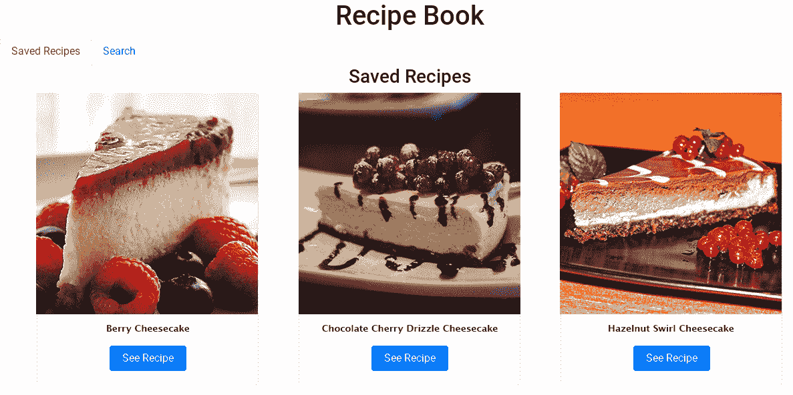
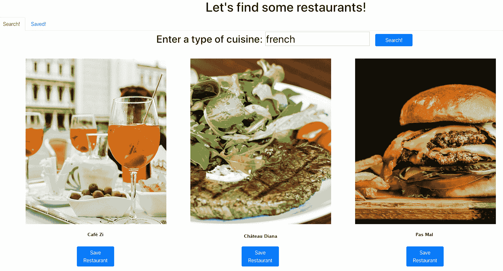

# 第十五章：将 Node.js 与前端结合

现在我们知道了前端框架和 Node.js，让我们将两端连接起来。我们将构建三个小应用程序，以演示我们的知识几乎实现全栈功能。毕竟，前端和后端都想要彼此了解！这将是我们首次尝试同时使用这些技术，所以一定要给自己足够的空间和时间来学习，因为这些是重要但非常重的话题。

本章将涵盖以下主题：

+   理解架构握手

+   前端和 Node.js：React 和图像上传

+   使用 API 和 JSON 创建食谱书

+   使用 Yelp 和 Firebase 创建餐厅数据库

# 技术要求

准备好使用存储库的`Chapter-15`目录中提供的代码：[`github.com/PacktPublishing/Hands-on-JavaScript-for-Python-Developers/tree/master/chapter-15`](https://github.com/PacktPublishing/Hands-on-JavaScript-for-Python-Developers/tree/master/chapter-15)。由于我们将使用命令行工具，还要准备好您的终端或命令行 shell。我们需要一个现代浏览器和一个本地代码编辑器。

# 理解架构握手

既然我们在前端和后端都有了 JavaScript 的经验，让我们讨论一下将这两个部分绑在一起到底意味着什么。我们知道前端的 JavaScript 非常适合用户交互、视觉、数据验证和其他与用户体验相关的部分。后端的 Node.js 是一个强大的服务器端语言，可以帮助我们做几乎任何其他服务器端语言需要做的事情。那么，理论上将这两端结合起来是什么样子呢？

也许你会想知道为什么一个应用程序会有*两端。我们知道 Python、Node.js 和 JavaScript 都执行不同的任务，并且在前端或后端执行，但背后的理论是什么？答案是：软件工程中有一个被称为*关注分离*的原则，基本上是指程序的每个部分应该做一项或几项任务，并且做得很好。与其使用单片应用程序，实际上，一个对规模有良好反应的模块化系统的概念更高效。在本章中，我们将创建三个应用程序来使用这个原则。

# 前端和 Node.js - React 和图像上传

让我们从将 React 和 Node 绑定在一起开始。准备好跟随解决方案代码一起进行，网址是[`github.com/PacktPublishing/Hands-on-JavaScript-for-Python-Developers/tree/master/chapter-15/photo-album`](https://github.com/PacktPublishing/Hands-on-JavaScript-for-Python-Developers/tree/master/chapter-15/photo-album)。我们将构建一个类似于这样的相册应用程序：


图 15.1 - 我们的相册

我们将首先探索架构布局，然后我们将审查 React 代码，最后我们将检查 Express 后端。

## 架构

这个应用程序将使用后端的 Node.js 来存储我们上传的文件，并在前端使用 React。但是我们该如何做呢？从概念上讲，我们需要告诉 React 使用 Express 应用程序来提供 React 信息并消耗我们发送的文件。为了实现这一点，我们在`package.json`文件中使用了一个*代理*。它基本上看起来像这样：


图 15.2 - 代理

如果您对代理的概念不熟悉，基本上它在计算中的意思与英语中的意思相同：一个代理人代表另一个代理人执行操作。它本质上是一个中间人，正如这个图表所示，它可以被认为是我们目的的中间人。由于 React 和前端 JavaScript 无法与文件系统交互或执行我们在第十二章中学到的其他重要操作，*Node.js vs Python*，以及第十三章 *使用 Express*，我们需要使用我们的能力将前端和后端*连接*在一起。因此，代理的概念。

让我们看一下`package.json`中的一行：

```js
"proxy": "http://localhost:3001",
```

这告诉 React 将某些请求路由到我们的 Express 应用程序。如果您正在从 GitHub 上跟随代码，这意味着我们实际上需要执行一些不同的`npm`命令：

1.  首先，在`photo-album`目录中安装 Express 的包：`npm install`。

1.  启动 Express 服务器：`npm start`。

1.  在另一个终端窗口中，`cd`进入`client`目录并运行`npm install`。

1.  现在，使用`npm start`启动 React 应用程序。

当我们访问`http://localhost:3000`时，我们的相册应用程序已经准备好使用。尝试通过选择文件并点击上传来上传照片。UI 也会刷新并显示您刚刚上传的照片。恭喜！这是一个端到端的应用程序！

那么这段代码在做什么呢？让我们来分析一下。

首先，我们来看一下 JavaScript。

## 调查 React JSX

打开`client/src/components/upload/Upload.jsx`。我们将首先检查`render()`方法的内容：

```js
<p><button id="upload" onClick={this.upload}>Upload Photo</button></p>
<div id="uploadForm" className="w3-modal">   <form method="post"
 encType="multipart/form-data">
     <p><input type="file" name="filetoupload" /></p>
     <p><button type="submit" onClick={this.uploadForm}>Upload</button></p>
   </form>
</div>
```

太好了，这是一个基本的 HTML 表单。这个表单中唯一与 React 相关的部分是点击处理程序。让我们看一下表单的`onClick`方法：`this.uploadForm`。如果我们查看该方法，我们将看到我们上传表单的真正功能：

```js
 uploadForm(e) {
 e.preventDefault();
 const formData = new FormData()

 formData.append('file', document.querySelector('input').files[0]);

 fetch("http://localhost:3000/upload", {
   method: 'POST',
   body: formData
 })
   .then(() => {
     this.props.reload()
   })
}
```

您准备好查看 Node.js Express 路由了吗？

## 解密 Express 应用程序

打开`routes/upload.js`。它非常简单：

```js
const express = require('express');
const formidable = require('formidable');
const router = express.Router();
const fs = require('fs');

router.post('/', (req, res, next) => {
  const form = new formidable.IncomingForm().parse(req)
    .on('fileBegin', (name, file) => {
      file.path = __dirname + '/../public/images/' + file.name
    })
    .on('file', () => {
      res.sendStatus(200)
    })
});

module.exports = router;
```

为了让我们的生活变得更轻松，我们使用了一个名为 Formidable 的表单处理程序包。当通过 Ajax 收到 POST 请求到`/upload`端点时，它将运行此代码。当通过 Ajax 接收到表单时，我们的承诺会监听文件并触发`fileBegin`和`file`事件，这将把文件写入磁盘，然后发出成功信号。这是我们在`Upload.jsx`中使用的上传表单的方法，以及我们的应用程序的两个方面如何联系在一起，以执行前端 JavaScript 无法单独执行的操作——访问服务器的文件系统。

使用前端上传几张图片。您会注意到它们将存储在`public/images`中，就像我们在代码中读到的那样。请注意，这个系统非常简单：它不会检查是否是图像文件，而是盲目地接受我们发送的内容并将其存储在文件系统中。在实践中，**这是危险的**。在处理用户输入时，*始终*需要预防攻击和可能的恶意文件。虽然保护您的 Web 应用程序的方法有些超出了本书的范围，但需要牢记的一个基本原则是：*不要相信用户*。我们已经研究了在前端验证输入的方法，虽然这很有用，但在后端也检查它同样重要。一些可能的威胁减少方法包括列出某些文件扩展名，黑名单其他文件扩展名，并使用沙盒环境来运行上传文件的分析代码，以确定它是否是无害的图像文件。

现在我们已经上传了我们的图片，让我们继续进行应用程序的检索方面。打开`routes/gallery.js`：

```js
var express = require('express');
const fs = require('fs');

var router = express.Router();

router.get('/', (req, res, next) => {
 fs.readdir(`${__dirname}/../public/images`, (err, files) => {
     if (err) {
       res.json({
         path: '',
         files: []
       });
       return;
     }

     const data = {
       path: 'images/',
       files: files.splice(1,files.length) // remove the .gitignore
     };
     res.json(data);
 });
});

router.delete('/:name', (req, res) => {
 fs.unlink(`${__dirname}/../public/images/${req.params.name}`, (err) => {
   res.json(1)
 });
});

module.exports = router;
```

希望这不会太难解释。在我们的 GET 路由中，我们首先检查文件系统，看看我们是否可以访问文件。如果出现某种原因的错误，比如权限不正确，我们将向前端发送错误并中止。否则，我们将格式化我们的返回数据并发送！非常简单。

我们的下一个方法定义了 DELETE 功能，它是一个简单的文件系统 unlink 方法。这个功能的前端并不是很复杂：如果你点击我们画廊中的一张图片，它将删除这张照片。当然，在实践中，你可能希望有一些更好的用户界面和确认消息，但对于我们的目的来说，这已经足够了。

欢迎来到你的第一个端到端应用程序！

继续进行我们的下一个应用程序！

# 使用 API 和 JSON 创建食谱

使用后端的美妙之一是促进应用程序、文件系统和 API 之间的通信。以前，我们所做的所有工作都局限于前端，没有持久性。现在我们将制作一个食谱应用程序，以 JSON 格式保存我们的信息。别担心，我们将在第十八章中使用数据库，*Node.js 和 MongoDB*。现在，我们将使用本地文件。这是我们要构建的内容：



图 15.3 - 我们的食谱册

首先，我们将使用第三方 API 设置凭据，然后继续编写代码。

## 设置应用程序

在[`github.com/PacktPublishing/Hands-on-JavaScript-for-Python-Developers/tree/master/chapter-15/recipe-book/`](https://github.com/PacktPublishing/Hands-on-JavaScript-for-Python-Developers/tree/master/chapter-15/recipe-book/)上克隆起始代码。确保在该目录和`client`内执行`npm install`。我们还需要做一些设置来访问我们的 API。要访问 Edamam API，请在[`developer.edamam.com/`](https://developer.edamam.com/)注册免费 API 密钥以获取食谱搜索 API。

在我们项目的根目录，创建一个`.env`文件，并填写如下内容：

```js
APPLICATION_ID=<your id>
APPLICATION_KEY=<your key>
```

请注意，这些都是构造为环境变量，没有分号或空格。

我们接下来要做的一步是确保我们的应用程序可以读取这些变量。在`app.js`的末尾附近，你会看到这个：

```js
console.log(process.env.APPLICATION_ID, process.env.APPLICATION_KEY);
```

`process.env.<variable name>`的构造方式是我们如何访问`.env`中的环境变量的。提供这种访问的机制是`dotenv`包；你可以看到它包含在`package.json`中；文件中的环境变量默认情况下不包括在内。

为什么我们要使用环境文件？正如我们将在第十七章中学到的那样，*安全和密钥*，我们不希望在我们可能提交到 GitHub 或类似平台的代码中暴露我们的 API 密钥，因为那样会允许任何人使用（和滥用）我们的密钥。我们必须保持它们的安全性，如果你注意到`.gitignore`文件中，我已经列出了`.env`不要在 Git 中提交，这就是为什么你必须自己创建这个文件。这是敏感信息的最佳实践。虽然这可能会使开发人员之间共享代码变得有点棘手，但最好还是将敏感信息与我们的代码分开。

让我们测试我们的 API。

## 测试 API

如果你阅读`routes/tests.js`，你可以看到我们到底在做什么：

```js
const https = require('https');

require('dotenv').config();

https.get(`https://api.edamam.com/search?app_id=${process.env.APPLICATION_ID}&app_key=${process.env.APPLICATION_KEY}&q=cheesecake`, (res) => {
 console.log("Got response: " + res.statusCode)

 res.setEncoding('utf8')
  res.on("data", (chunk) => {
   console.log(chunk)
 })
}).on('error', (e) => {
 console.log("Got error: " + e.message);
})
```

我们的`fetch`调用是硬编码为搜索`cheesecake`（我最喜欢的甜点...问我食谱），如果我们用`node routes/tests.js`运行它，我们将在控制台中看到一堆 JSON 返回。如果你遇到任何问题，请确保检查你的 API 密钥。

## 深入代码

既然我们知道我们的 API 调用是有效的，让我们切换到我们的前端。看一下`client/src/components/search/Search.jsx`及其`render`函数：

```js
render() {
 return (
   <h2>Search for: <input type="text" id="searchTerm" />
     <button onClick={this.submitSearch}>Search!</button></h2>
 )
}
```

到目前为止，这是一个简单的表单。接下来，让我们看看`submitSearch`方法：

```js
 submitSearch(e) {
 e.preventDefault()

 fetch(`http://localhost:3000/search?q=${document.querySelector('#searchTerm').value}`)
   .then(data => data.json())
   .then((json) => {
     this.props.handleSearchResults(json)
   })
}
```

我们再次使用代理来从表单提交我们的搜索。在获得结果后，我们将 JSON 传递给来自父组件`RecipeBook`的`props`的`handleSearchResults`方法。我们稍后会看一下，但现在让我们切换回 Express 应用程序，看看我们的搜索路由在做什么。看一下`routes/search.js`。

GET 路由实际上非常简单：

```js
router.get('/', (req, res, next) => {
 https.get(`https://api.edamam.com/search?app_id=${process.env.APPLICATION_ID}&app_key=${process.env.APPLICATION_KEY}&q=${req.query.q}`, (data) => {

   let chunks = '';

   data.on("data", (chunk) => {
     chunks += chunk
   })

   data.on("end", () => {
     res.send(JSON.parse(chunks))
   })

   data.on('error', (e) => {
     console.log("Got error: " + e.message);
   })
 })
});
```

这应该看起来有点类似于我们的测试文件。我们再次使用我们的`.env`文件来进行搜索查询，但这次我们传递了查询字符串参数进行搜索并处理错误。我们的`data.on("end")`处理程序将我们的结果传递回 React，以便在`RecipeBook.jsx`中使用`handleSearchResults`方法：

```js
handleSearchResults(data) {
 const recipes = []

 data.hits.forEach( (item) => {
   const recipe = item.recipe

   recipes.push({
     "title": recipe.label,
     "url": recipe.url,
     "image": recipe.image
   })
 })

 this.setState({
   recipes: recipes
 })
}
```

我们正在解析出我们应用程序所需的数据，并将其分配给组件的状态。到目前为止一切顺利！

接下来是食谱书的`render`方法，用于显示我们的搜索结果：

```js
<Search handleSearchResults={this.handleSearchResults} />

{
 recipes.length > 0 ? (
   <>
     <p>Search Results</p>
     <div className="card-columns">
       {
         recipes.map((recipe, i) => (
           <Recipe recipe={recipe} key={i} search="true" 
            refresh={this.refresh} />
         ))
       }
     </div>
   </>
 ) : <p></p>
```

我们使用另一个三元运算符来有条件地呈现我们的结果，如果有的话，作为`<Recipe>`组件。我们的 key 属性只是 React 希望项目具有的唯一标识符，但`refresh`属性是一个有趣的属性。让我们看看它在`Recipe`组件中是如何使用的。

我们的`Recipe`组件的`render`方法相当标准：它使用一些 Bootstrap 组件来呈现我们漂亮的小卡片，但除此之外并不引人注目。`save`方法才是我们真正想要调查的内容：

```js
save(e) {
   e.preventDefault()

   const recipe = { [this.props.recipe.title]: this.props.recipe }

   fetch('http://localhost:3000/recipes', {
     method: 'POST',
     headers: {
       'Accept': 'application/json',
       'Content-Type': 'application/json'
     },
     body: JSON.stringify(recipe)
   })
   .then(json => json.json())
   .then( (data) => {
     this.props.refresh(data)
   })
 }
```

`const recipe`声明可能看起来有点奇怪，让我们来解开它。这是创建一个对象键/值对，对于键，我们使用了食谱的标题。因为它是一个变量，我们希望使用方括号来表示它应该被解释。我们不能使用点属性作为键，所以我们的标题将是一个字符串。

这是一个构造中食谱的示例可能是这样的：

```js
{"Strawberry Cheesecake Parfaits": {"title":"Strawberry Cheesecake Parfaits", "image":"https://www.edamam.com/web-img/d4c/d4c3a4f1db4e8c413301ae1f324cf32a.jpg", "url":"http://honestcooking.com/strawberry-cheesecake-parfaits/"}}
```

它包含了我们之前在`RecipeBook.jsx`中映射对象时指定的所有信息。我们过程的下一步是使用另一个`fetch`请求将食谱保存到文件系统中。

回到 Express，这次是到`routes/recipes.js`！

让我们逐部分查看文件。在我们的 Express 方法之外，我们有一个`readData`方法，它检查我们的`recipes.json`文件是否存在：

```js
const readData = () => {
 if (!fs.existsSync(__dirname + "/../data/recipes.json")) {
   fs.writeFileSync(__dirname + "/../data/recipes.json", '[]')
 }

 return JSON.parse(fs.readFileSync(__dirname + "/../data/recipes.json"))
}
```

如果没有，它将创建一个包含空数组的文件。然后将文件的内容（无论是空的还是非空的）返回给调用函数。

我们的 GET 方法从`readData`中消耗数据，并将其发送到响应中，这次是到`RecipeBook.jsx`：

```js
router.get('/', (req, res, next) => {
 const recipes = readData()
 res.json(recipes)
})
```

`RecipeBook.render`方法的第二部分（我们没有看到）类似于搜索结果的 JSX，并且消耗了这个 JSON。

我们的`save`方法与我们的`readData`方法有些相似：

```js
router.post('/', (req, res) => {
 let recipes = readData()
 const data = req.body
 recipes.push(data)
 fs.writeFileSync(__dirname + "/../data/recipes.json",JSON.stringify(recipes))
 res.json(recipes)
})
```

请注意，它还将 JSON 发送到响应，因此当项目保存时，它还会在`RecipeBook.jsx`中填充保存的食谱。可能不用说，但请注意我们再次使用`readData`方法，而不是重写相同的逻辑，使我们的代码保持 DRY。

这就是我们应用程序的逻辑！我们成功地将 API、Node.js、Express 和 React 组合成了一个端到端的应用程序。接下来，我们将创建一个更符合实际的应用程序：我们将创建一个餐厅搜索应用程序，将其保存到一个云数据库中，并通过 JavaScript 访问。

# 使用 Yelp 和 Firebase 创建餐厅数据库

到目前为止，我们的应用程序相当简单，只是在文件系统上存储信息。然而，在大多数情况下，您可能希望它是某种数据库，而不是静态文件。我们将使用 Firebase，这是一个与 JavaScript 兼容良好的基于云的 NoSQL 数据库，但首先让我们设置 React 脚手架。

## 开始行 - 创建一个 React 应用程序

我们之前已经进行了几次这样的设置，所以这应该不足为奇：

1.  使用`npx create-react-app restaurant-finder`创建一个新的 React 应用程序，我们准备好了！

1.  使用`npm start`测试您的设置，并访问`http://localhost:3000`。

## 使用 Firebase 进行设置

我们要做的第一件事是设置我们的 Firebase 帐户。

请记住，Firebase 的用户界面（与大多数网站一样）会定期更改，因此我不会为注册过程向您展示截图。如果您在设置过程中遇到任何问题，可以查阅文档。以下是步骤：

1.  转到[`firebase.google.com`](https://firebase.google.com)。

1.  如果您还没有 Google 帐户，您需要创建一个，然后访问控制台。

1.  创建一个名为`restaurant-database`的新项目。

1.  您可以选择为项目启用 Google Analytics；这取决于您。

1.  在项目概述页面上，我们将使用</>按钮访问网页应用程序的设置说明。

1.  在下一个屏幕上，创建一个应用程序昵称（您可以再次使用`restaurant-database`），您不需要设置 Firebase Hosting。

1.  下一个屏幕将向您显示包含您的 Firebase 配置的代码，但*我们不会完全按照说明进行*，因为我们可以使用 Node 模块来帮助我们！不过，请复制`firebaseConfig`变量中的信息：我们以后会用到它。

1.  当您的数据库创建好后，转到 UI 中的数据库选项卡，选择实时数据库，并在**测试模式**下启动它。

然后您应该看到类似于这样的屏幕：


图 15.4 - Firebase 的基本测试模式视图

接下来，我们将返回到命令行，并准备好使用 Firebase。安装 Firebase 工具包：`npm install firebase`。

安装就是这样！接下来，在我们项目的根目录创建一个`.env`文件，并输入您之前从`firebaseConfig`中复制的凭据，类似于这样：

```js
REACT_APP_apiKey=<key>
REACT_APP_authDomain=restaurant-database-<id>.firebaseapp.com
REACT_APP_databaseURL=https://restaurant-database-<id>.firebaseio.com
REACT_APP_projectId=restaurant-database-<id>
REACT_APP_storageBucket=restaurant-database-<id>.appspot.com
REACT_APP_messagingSenderId=<id>
REACT_APP_appId=<id>
```

请注意`REACT_APP_`的前缀，等号，引号和缺少尾随逗号。填写您的配置类似。 

在我们进一步之前，让我们测试我们的数据库。

## 测试我们的数据库

现在我们将创建一些 React 组件。在`src`中创建一个`components`目录，在其中创建两个名为`database`和`finder`的目录。我们将首先创建我们的数据库引用：

1.  在数据库目录中，创建一个`database.js`文件。请注意，它是`js`，而不是`jsx`，因为我们实际上不会渲染任何数据。相反，我们将返回一个变量给`jsx`组件。您的文件应该如下所示：

```js
import * as firebase from 'firebase'

const app = firebase.initializeApp({
 apiKey: process.env.REACT_APP_apiKey,
 authDomain: process.env.REACT_APP_authDomain,
 databaseURL: process.env.REACT_APP_databaseURL,
 projectId: process.env.REACT_APP_projectId,
 storageBucket: process.env.REACT_APP_storageBucket,
 messagingSenderId: process.env.REACT_APP_messagingSenderId,
 appId: process.env.REACT_APP_appId
})

const Database = app.database()

export default Database
```

请注意每个变量上的`process.env`前缀以及尾随逗号。`process.env`指定应用程序应查看`dotenv`提供的环境变量。

1.  接下来，我们有`Finder.jsx`。在`finder`目录中创建此文件：

```js
import React from 'react'
import Database from '../database/database'

export default class Finder extends React.Component {
 constructor() {
   super()

   Database.ref('/test').set({
     helloworld: 'Hello, World'
   })
 }

 render() {
   return <h1>Let's find some restaurants!</h1>
 }
}
```

我们的`App.js`文件将如下所示：

```js
import React from 'react'
import Finder from './components/finder/Finder'
import './App.css'

function App() {
 return (
   <div className="App">
     <Finder />     
   </div>
 );
}

export default App;
```

1.  现在，由于我们刚刚创建了我们的环境变量，我们需要停止并重新启动我们的 React 应用程序。这对于我们大部分的 React 工作来说并不是必需的，但在这里是必需的。

1.  继续访问`http://localhost:3000`上的应用程序。我们应该只在页面上看到“让我们找一些餐馆”，但是如果我们转到 Firebase，我们会看到这个：


图 15.5 - 我们在 Firebase 中有数据！

数据似乎被截断了，但您可以单击它并查看整个语句。

万岁！我们的 Firebase 正在运行。现在是我们应用程序的其余部分。

## 创建我们的应用程序

我们可以从`Finder.jsx`中删除测试插入。这就是我们要做的事情：



图 15.6 - 餐厅查找器

为了实现这一点，我们将使用 Yelp API。首先，您需要转到[`www.yelp.com/developers`](https://www.yelp.com/developers)并注册 Yelp Fusion API 密钥。一旦您拥有它，我们将把它存储在一个新的`.env`文件中的新`api`目录中。

Yelp Fusion API 并不在所有国家/地区都可用，所以如果你无法访问它，请在 GitHub 的`Chapter-15`文件夹中寻找替代 API 使用示例。

Yelp API 是一个 REST API，不允许来自前端 JavaScript 的连接，以保护你的密钥。因此，就像我们的食谱书一样，我们将创建一个小的 API 层来处理我们的请求。不同于我们的食谱书，这将会相当简单，所以我们不会使用 Express。让我们看看步骤：

1.  在项目的根目录，我们将安装一些工具供我们使用：`npm install yelp-fusion dotenv react-bootstrap`。

1.  在项目的根目录创建一个名为`api`的目录，并在其中创建一个`api.js`文件。

1.  我们也将在我们的`api`目录中有一个`.env`文件：

```js
Yelp_Client_ID=<your client id>
YELP_API_Key=<your api key>
```

1.  如果你使用 Git，*不要忘记将这些添加到*`.gitignore`*条目*。

我们的`api.js`文件将会相当简单：

```js
const yelp = require('yelp-fusion');
const http = require('http');
const url = require('url');
require('dotenv').config();

const hostname = 'localhost';
const port = 3001;

const client = yelp.client(process.env.YELP_API_Key);

const server = http.createServer((req, res) => {
 const { lat, lng, value } = url.parse(req.url, true).query

 client.search({
   term: value,
   latitude: lat,
   longitude: lng,
   categories: 'Restaurants'
 }).then(response => {
   res.statusCode = 200;
   res.setHeader('Content-Type', 'application/json');

   res.write(response.body);
   res.end();
 })
   .catch(e => {
     console.error('error',e)
   })
 });

 server.listen(port, hostname, () => {
   console.log(`Server running at http://${hostname}:${port}/`);
 });
```

到目前为止，很多内容应该都很熟悉：我们将包括一些包，比如之前使用过的 Yelp API，我们将定义一些变量来帮助我们。接下来，我们将使用`http`的`createServer`方法创建一个非常简单的服务器来响应我们的 API 请求。在其中，我们将使用`url`的`parse`方法来获取我们的查询字符串参数，然后将其传递给我们的 API。

接下来的部分，`client.search`，可能会让人感到陌生。这是从 Yelp 文档中提取的，专门设计以符合他们 API 的要求。一旦我们有了异步响应，我们就将其发送回我们的请求应用程序。不要忘记处理错误！然后我们在端口`3001`上启动服务器。你可以使用`node api.js`启动这个服务器，然后你会看到关于它运行的控制台错误消息。

现在让我们把注意力转向我们应用程序的 React 部分：

1.  在我们的`src`目录中，当我们完成时，将会有这样的文件结构：

```js
.
├── App.css
├── App.js
├── App.test.js
├── components
│   ├── database
│   │ └── database.js
│   ├── finder
│   │ └── Finder.jsx
│   ├── restaurant
│   │ ├── Restaurant.css
│   │ └── Restaurant.jsx
│   └── search
│       └── Search.jsx
├── index.css
├── index.js
├── logo.svg
├── serviceWorker.js
└── setupTests.js
```

许多这些文件在我们之前搭建应用程序时已经创建好了，但`components`目录的一些部分是新的。

1.  创建这些文件，我们将从探索`Restaurant.jsx`开始：

```js
import React from 'react'
import { Button, Card } from 'react-bootstrap'
import Database from '../database/database'

import './Restaurant.css'

export default class Restaurant extends React.Component {
 constructor() {
   super();

   this.saveRestaurant = this.saveRestaurant.bind(this)
 }

 saveRestaurant(e) {
   const { restaurant } = this.props

   Database.ref(`/restaurants/${restaurant.id}`).set({
     ...restaurant
   })
 }

 render() {
   const { restaurant } = this.props

   return (
     <Card>
       <Card.Img variant="top" src={restaurant.image_url} 
        alt={restaurant.name} />
       <Card.Body>
         <Card.Title>{restaurant.name}</Card.Title>
         {!this.props.saved && <Button variant="primary" 
         onClick={this.saveRestaurant}>Save Restaurant</Button>}
      </Card.Body>
     </Card>
   )
 }
}
```

大部分内容都不是新的，我们的食谱书的结构可以帮助我们理清思路。不过，我们应该拆分`saveRestaurant`方法，因为它使用了一些有趣的部分：

```js
saveRestaurant(e) {
   const { restaurant } = this.props

   Database.ref(`/restaurants/${restaurant.id}`).set({
     ...restaurant
   })
 }
```

首先，我们可以推断出我们将从组件的`props`中获取餐厅的数据。这将直接来自我们的搜索结果。因此，我们需要稍微处理一下我们的数据。

这是我们从`props`中得到的搜索结果的样子：

```js
{id: "CO3lm5309asRY7XG5eXNgg", alias: "rahi-new-york", name: "Rahi", image_url: "https://s3-media1.fl.yelpcdn.com/bphoto/rPh_LboeIOiTVeXCuas5jA/o.jpg", is_closed: false, ...}
id: "CO3lm5309asRY7XG5eXNgg"
alias: "rahi-new-york"
name: "Rahi"
image_url: "https://s3-media1.fl.yelpcdn.com/bphoto/rPh_LboeIOiTVeXCuas5jA/o.jpg"
is_closed: false
url: "https://www.yelp.com/biz/rahi-new-york?adjust_creative=-YEyXjz9iO0W5ymAnPt6kA&utm_campaign=yelp_api_v3&utm_medium=api_v3_business_search&utm_source=-YEyXjz9iO0W5ymAnPt6kA"
review_count: 448
categories: (3) [{...}, {...}, {...}]
rating: 4.5
coordinates: {latitude: 40.7360271, longitude: -74.0005436}
transactions: (2) ["delivery", "pickup"]
price: "$$$"
location: {address1: "60 Greenwich Ave", address2: "", address3: null, city: "New York", zip_code: "10011", ...}
phone: "+12123738900"
display_phone: "(212) 373-8900"
distance: 1305.5181202902097
```

1.  我们将其保存到 Firebase 中：

```js
Database.ref(`/restaurants/${restaurant.id}`).set({
  ...restaurant
})
```

我们使用*展开运算符*（三个点）来将对象扩展为其组成的键/值对，以避免在我们的数据库中出现嵌套对象。我们还有一点点 CSS 来格式化我们的卡片。

让我们把注意力转向`Search`组件：

```js
import React from 'react'
import { Button } from 'react-bootstrap'
import Restaurant from '../restaurant/Restaurant'

export default class Search extends React.Component {
 constructor() {
   super()

   this.state = {
     businesses: []
   }
```

在我们的构造函数中，我们做了一些有趣的事情：*浏览器地理定位*。

你是否见过某些网站询问你的位置时弹出的小警告窗口？这就是这些网站的做法。如果浏览器支持地理定位，我们将使用它并从浏览器中设置我们的纬度和经度。否则，我们将简单地将其设置为`null`：

```js
   if (navigator.geolocation) {
     navigator.geolocation.getCurrentPosition((position) => {
       this.setState({
         lng: position.coords.longitude,
         lat: position.coords.latitude
       })
     })

   } else {
     this.setState({
       lng: null,
       lat: null
     })
   }

   this.search = this.search.bind(this)
   this.handleChange = this.handleChange.bind(this)
 }

 handleChange(e) {
   this.setState({
     val: e.target.value
   })
 }

```

搜索端点的构建应该看起来很熟悉：

```js
 search(event) {
   const { lng, lat, val } = this.state

   fetch(`http://localhost:3000/businesses/search?
   value=${val}&lat=${lat}&lng=${lng}`)
     .then(data => data.json())
     .then(data => this.handleSearchResults(data))
 }

 handleSearchResults(data) {
   this.setState({
     businesses: data.businesses
   })
 }

 render() {
   const { businesses } = this.state

   return (
     <>
       <h2>Enter a type of cuisine: <input type="text" onChange=
       {this.handleChange} /> <Button id="search" onClick={this.search}>
       Search!</Button></h2>
       <div className="card-columns">
         {
           businesses.length > 0 ? (
             businesses.map((restaurant, i) => (
               <Restaurant restaurant={restaurant} key={i} />
             ))
           ) : <p>No results</p>
         }
       </div>
     </>
   )
 }
}
```

当你在我们的代码中前进时，如果你得到纬度或经度的空值，你可能需要完全退出 React 应用程序并重新启动它。

类似于我们的食谱书通过代理调用我们的 Express 应用程序，不要忘记将这行添加到你的`package.json`文件中：`"proxy": "http://localhost:3001"`。这样我们就可以使用`fetch`。这些是我们传递给`api.js`的值，用于向 Yelp API 发送请求。

我们的应用程序快要完成了！接下来是我们开始的`Finder`组件：

1.  首先，我们有我们的导入：

```js
import React from 'react'
import Database from '../database/database'
import { Tabs, Tab } from 'react-bootstrap'
import Search from '../search/Search'
import Restaurant from '../restaurant/Restaurant'

```

1.  接下来，我们有一些非常标准的部分：

```js
export default class Finder extends React.Component {
 constructor() {
   super()

   this.state = {
     restaurants: []
   }

   this.getRestaurants = this.getRestaurants.bind(this)
 }

 componentDidMount() {
   this.getRestaurants()
 }
```

1.  作为一个新的部分，让我们来看看我们如何从 Firebase 中检索信息：

```js
 getRestaurants() {

   Database.ref('/restaurants').on('value', (snapshot) => {
     const restaurants = []

     const data = snapshot.val()

     for(let restaurant in data) {
       restaurants.push(data[restaurant])
     }
     this.setState({
       restaurants: restaurants
     })
   })
 }
```

关于 Firebase 的一个有趣之处是它是一个实时数据库；你不总是需要执行查询来检索最新的数据。在这个构造中，我们告诉数据库不断更新我们组件的状态，以反映`/restaurants`的值的变化。当我们保存一个新的餐馆并转到我们的“已保存！”选项卡时，我们将看到我们的新条目。

1.  我们在这里使用了其他组件，将其完整地呈现出来：

```js
 render() {

   const { restaurants } = this.state
   return (
     <>
       <h1>Let's find some restaurants!</h1>

       <Tabs defaultActiveKey="search" id="restaurantsearch">
         <Tab eventKey="search" title="Search!">
           <Search handleSearchResults={this.handleSearchResults} 
        />
         </Tab>
         <Tab eventKey="saved" title="Saved!">
           <div className="card-columns">
             {
               restaurants.length > 0 ? (
                 restaurants.map((restaurant, i) => (
                   <Restaurant restaurant={restaurant} saved={true} 
                    key={i} />
                 ))
               ) : <p>No saved restaurants</p>
             }
           </div>
         </Tab>
       </Tabs>
     </>
   )
 }
}
```

当一切都完成时，我们将保持我们的`api.js`文件运行，并使用`npm start`启动我们的 React 应用程序，我们的应用程序就完成了！

是时候结束本章了。

# 总结

在本章中，我们涵盖了很多内容。JavaScript 在前端和后端的强大功能向我们展示，我们确实可以用它来满足许多应用程序需求，不仅仅是 Python。我们使用了很多 React，但请记住，任何前端都可以在这里替代：Vue、Angular，甚至是无框架的 HTML、CSS 和 JavaScript 都可以用来创建强大的 Web 应用程序。

在使用 JavaScript 和 API 时需要注意的一点是，有些情况下我们需要一个中间件层，例如在保存文件或使用密钥访问 REST API 时。将 Express 与基本的 Node.js 脚本结合起来与 API 进行交互，这只是 JavaScript 和 Node.js 结合所能实现的开始。

在下一章中，我们将探讨 webpack，这是一个工具，允许我们将 JavaScript 应用逻辑地组合和打包以进行部署。
