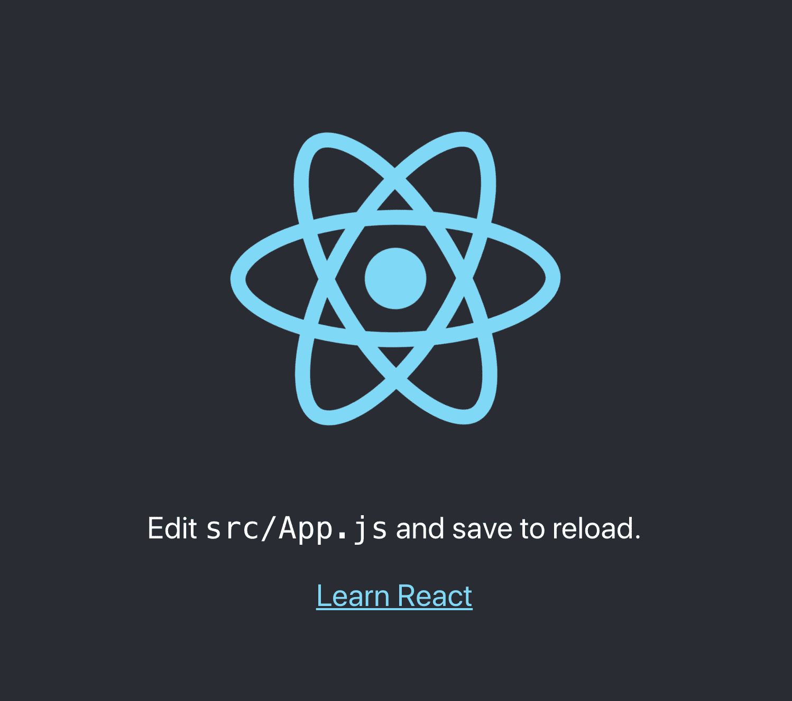
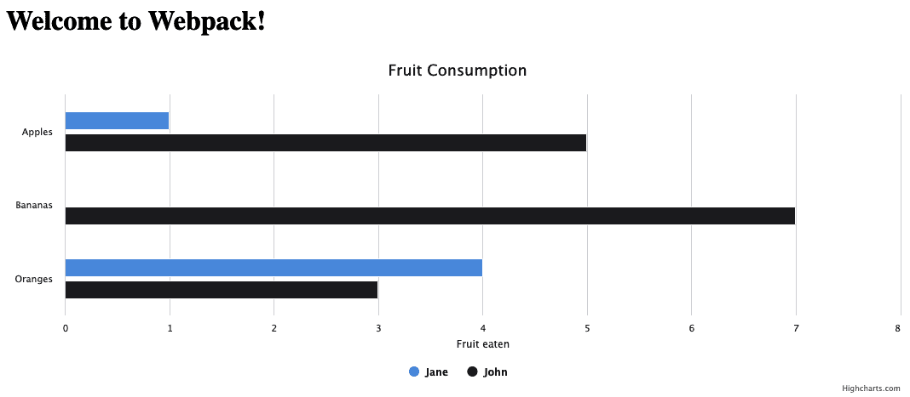

进入 Webpack

所以，现在你有了漂亮的前端和后端代码。太棒了！它看起来在你的笔记本上如此漂亮……那么下一步是什么？将它发布到世界上！听起来很容易，但当我们有像 React 这样的高级 JavaScript 使用时，我们可能还想采取一些额外步骤，以确保我们的代码以最高效率运行，所有依赖项都得到解决，并且一切都与现代技术兼容。此外，下载大小是一个重要考虑因素，所以让我们探讨一下 webpack，这是一个帮助解决这些问题的工具。

在本章中，我们将涵盖以下几点：

+   捆绑和模块的需求

+   使用 webpack

+   部署

# 第二十章：技术要求

准备好使用存储库的`Chapter-16`目录中提供的代码：[`github.com/PacktPublishing/Hands-on-JavaScript-for-Python-Developers/tree/master/chapter-16`](https://github.com/PacktPublishing/Hands-on-JavaScript-for-Python-Developers/tree/master/chapter-16)。因为我们将使用命令行工具，还要准备好你的终端或命令行 shell。我们需要一个现代浏览器和一个本地代码编辑器。

# 捆绑和模块的需求

理想情况下，一切都会在网站上无缝运行，无需采取任何额外步骤。你拿起你的源文件，放在一个 web 服务器上，然后：一个网站。然而，情况并非总是如此。例如，对于 React，我们需要运行`npm run build`来为我们的项目生成一个输出分发目录。我们可能还有其他类型的非源文件，比如 SASS 或 TypeScript，需要转换成浏览器可以理解的原生文件格式。

那么，*模块*是什么？有**模块化编程**的概念，它将大型程序按照关注点和封装（作用域）分离成更小、更独立的模块。模块化编程背后的思想有很多：作用域、抽象、逻辑设计、测试和调试。同样，一个捆绑是浏览器可以轻松使用的一块代码，通常由一个或多个模块构成。

现在是有趣的部分：*我们已经使用过模块*！让我们来看看我们在第十一章中编写的一些 Node.js 代码，*什么是 Node.js？：*

```js
const readline = require('readline')
const randomNumber = Math.ceil(Math.random() * 10)

const rl = readline.createInterface({
 input: process.stdin,
 output: process.stdout
});

askQuestion()

function askQuestion() {
 rl.question('Enter a number from 1 to 10:\n', (answer) => {
   evaluateAnswer(answer)
 })
}

function evaluateAnswer(guess) {
 if (parseInt(guess) === randomNumber) {
   console.log("Correct!\n")
   rl.close()
   process.exit(1)
 } else {
   console.log("Incorrect!")
   askQuestion()
 }
}
```

在第一行，我们使用了一个叫做`readline`的模块，如果你还记得我们的程序，它将被用来从命令行接收用户输入。我们在 React 中也使用了它们——每当我们需要使用`npm install`时，我们都在使用模块的概念。那么这为什么重要呢？让我们考虑从头开始标准的`create-react-app`安装：

1.  使用`npx`创建一个新的 React 项目：`npx create-react-app sample-project`。

1.  进入目录并安装依赖项：`cd sample-project ; npm install`。

1.  使用`npm start`启动项目。

如果你还记得，这给我们一个非常有趣的起始页面：



图 16.1 – React 起始页面

当我们运行`npm install`时，我们到底得到了什么？让我们看看我们的文件结构：

```js
.
├── README.md
├── package-lock.json
├── package.json
├── public
│   ├── favicon.ico
│   ├── index.html
│   ├── logo192.png
│   ├── logo512.png
│   ├── manifest.json
│   └── robots.txt
├── src
│   ├── App.css
│   ├── App.js
│   ├── App.test.js
│   ├── index.css
│   ├── index.js
│   ├── logo.svg
│   ├── serviceWorker.js
│   └── setupTests.js
└── yarn.lock
```

到目前为止还算简单。然而，在这个清单中，我故意排除了`node_modules`目录。这个目录有 18 个文件。尝试在我们项目的根目录运行这个命令，不排除那个目录：`tree`。享受观看繁忙的行数——32,418 个文件！这些都是从哪里来的？是我们的朋友`npm install`！

## package.json

我们的项目结构在一定程度上由我们的`package.json`文件控制以管理依赖项。大多数捆绑工具，比如 webpack，将利用这个文件中的信息来创建我们的依赖图和一小块一小块的模块。让我们来看看它：

*package.json*

```js
{
 "name": "sample-project",
 "version": "0.1.0",
 "private": true,
 "dependencies": {
   "@testing-library/jest-dom": "⁴.2.4",
   "@testing-library/react": "⁹.3.2",
   "@testing-library/user-event": "⁷.1.2",
   "react": "¹⁶.13.1",
   "react-dom": "¹⁶.13.1",
   "react-scripts": "3.4.1"
 },
 "scripts": {
   "start": "react-scripts start",
   "build": "react-scripts build",
   "test": "react-scripts test",
   "eject": "react-scripts eject"
 },
 "eslintConfig": {
   "extends": "react-app"
 },
 "browserslist": {
   "production": [
     ">0.2%",
     "not dead",
     "not op_mini all"
   ],
   "development": [
     "last 1 chrome version",
     "last 1 firefox version",
     "last 1 safari version"
   ]
 }
}
```

这是一个标准的基本包文件；它只包含六个依赖项：一半用于测试，一半用于 React。现在，有趣的部分是：每个依赖项又有自己的依赖项，这就是为什么我们在`node_modules`目录中单独有 32,400 个文件。通过使用模块，我们不必手动构建或管理依赖项；我们可以遵循 DRY 原则，并利用其他人（或我们自己）以模块形式编写的现有代码。正如我们在比较 Python 和 Node.js 时讨论的那样，`npm install`类似于 Python 中的`pip install`，我们在 Python 程序中使用`import`关键字来使用包，而在 Node.js 中我们使用`require`。

当我们使用`npm install`将一个新的包安装到我们的项目中时，它会在`package.json`中添加一个条目。这是一个文件，如果你进行任何编辑，你需要非常小心。一般来说，你不应该需要做太多更改，尤其是应该避免对依赖项进行实质性的更改。利用`install`命令来完成这些。

## 构建流水线

让我们看看当我们准备将 React 项目部署时会发生什么。运行`npm run build`并观察输出。你应该会看到类似以下的输出：

```js
Creating an optimized production build...
Compiled successfully.

File sizes after gzip:

  39.39 KB  build/static/js/2.deae54a5.chunk.js
  776 B     build/static/js/runtime-main.70500df8.js
  650 B     build/static/js/main.0fefaef6.chunk.js
  547 B     build/static/css/main.5f361e03.chunk.css

The project was built assuming it is hosted at /.
You can control this with the homepage field in your package.json.

The build folder is ready to be deployed.
You may serve it with a static server:

  yarn global add serve
  serve -s build

Find out more about deployment here:

  bit.ly/CRA-deploy
```

如果你查看构建目录，你会看到精简的 JavaScript 文件，打包好以便高效部署。有趣的部分在于：`create-react-app` *使用 webpack 进行构建*！`create-react-app`设置处理了这些部分。修改`create-react-app`的内部 webpack 设置有点棘手，所以现在让我们来看看如何在 React 的用例之外直接使用 webpack。

# 使用 webpack

现在，webpack 是许多模块化工具之一，可以在你的程序中使用。此外，与 React 脚本不同，它在 React 之外也有用途：它可以用作许多不同类型应用的打包工具。让我们动手创建一个小的、无用的示例项目：

1.  创建一个新的目录并进入其中：`mkdir webpack-example ; cd webpack-example`。

1.  我们将使用 NPM，所以我们需要初始化它。我们也会接受默认值：`npm init -y`。

1.  然后我们需要安装 webpack：`npm install webpack webpack-cli --save-dev`。

请注意，我们在这里使用`--save-dev`，因为我们不需要将 webpack 构建到我们的生产级文件中。通过使用开发依赖，我们可以帮助减少我们的捆绑大小，这是一个可能会拖慢应用程序的因素。

如果你在这里的`node_modules`目录中查看，你会看到我们已经从依赖中安装了超过 3.5 千个文件。我们的项目目前相当无聊：没有任何内容！让我们修复这个问题，创建一些文件，如下所示：

*src/index.html*

```js
<!DOCTYPE html>
<html lang="en">
<head>
 <meta charset="UTF-8">
 <meta name="viewport" content="width=device-width, initial-scale=1.0">
 <title>Webpack Example</title>
</head>
<body>
 <h1>Welcome to Webpack!</h1>
 <script src="index.js"></script>
</body>
</html>
```

*src/index.js*

```js
console.log('hello')
```

到目前为止，非常令人兴奋和有用，对吧？如果你在浏览器中打开我们的首页，你会看到控制台中的预期内容。现在，让我们将 webpack 引入其中：

1.  将`package.json`的`scripts`节点更改为以下内容：

```js
"scripts": {
    "test": "echo \"Error: no test specified\" && exit 1",
    "dev": "webpack --mode development",
    "build": "webpack --mode production"
  },
```

1.  运行`npm run dev`。你应该会看到类似这样的输出：

```js
> webpack --mode development

Hash: 21e0ae2cc4ae17d2754f
Version: webpack 4.43.0
Time: 53ms
Built at: 06/14/2020 1:37:27 PM
  Asset      Size  Chunks             Chunk Names
main.js  3.79 KiB    main  [emitted]  main
Entrypoint main = main.js
[./src/index.js] 20 bytes {main} [built]
```

现在去查看你新创建的`dist`目录：

```js
dist
└── main.js
```

如果你打开`main.js`，你会发现它看起来与我们的`index.js`*非常*不同！这是 webpack 在幕后做一些模块化的工作。

等等。我们从一行代码变成了 100 行。为什么这样做更好呢？对于这样简单的例子来说可能并不是，但请再给我一点时间。让我们尝试`npm run build`并比较输出：`main.js`现在是一行，被精简了。

查看我们的`package.json`文件，除了我们操作的脚本节点之外，还有一些值得注意的部分：

```js
{
 "name": "webpack-example",
 "version": "1.0.0",
 "description": "",
 "main": "index.js",
 "scripts": {
   "test": "echo \"Error: no test specified\" && exit 1",
   "dev": "webpack --mode development",
   "build": "webpack --mode production"
 },
 "keywords": [],
 "author": "",
 "license": "ISC",
 "devDependencies": {
   "webpack": "⁴.43.0",
   "webpack-cli": "³.3.11"
 }
}
```

我们看到一个`"main"`节点指定了一个`index.js`作为我们的主入口点，或者说 webpack 开始查找其依赖的地方。

在使用 webpack 时，有三个重要的概念需要理解：

+   **入口**：webpack 开始工作的地方。

+   **输出**：webpack 将输出其完成的产品的地方。如果我们查看前面测试的输出，我们会看到`main.js 3.79 KiB main [emitted] main`。webpack 更加优雅地将其定义为“emitting”其捆绑包，而不是“spits out”这个短语。

+   **加载器**：如前所述，webpack 可以用于各种不同的目的；然而，默认情况下，webpack 只处理 JavaScript 和 JSON 文件。因此，我们使用*加载器*来做更多的工作。我们将在一分钟内使用一个加载器来操作`index.html`文件。

模式和插件的概念也很重要，尽管有点更容易理解：模式，正如我们在`package.json`中添加脚本时所看到的，定义了我们是否希望对我们的环境进行开发、生产或“无”优化。模式比这更复杂，但现在我们不会变得疯狂——webpack 相当复杂，因此对其有一个表面理解是一个很好的开始。插件基本上做着加载器无法做的事情。尽管我们会保持简单，现在我们将添加一个能够理解 HTML 文件的加载器。准备好……输出并不是你所想象的那样：

1.  运行`npm install html-loader --save-dev`。

1.  现在我们已经到了需要一个配置文件的地步，所以创建`webpack.config.js`。

1.  在`webpack.config.js`中输入以下内容：

```js
module.exports = {
  module: {
    rules: [
      {
        test: /\.html$/i,
        loader: 'html-loader',
      },
    ],
  },
};
```

1.  修改`index.js`如下：

```js
import html from './index.html'

console.log(html)
```

1.  通过修改`index.html`，将脚本标签更改为以下内容：

1.  重新运行`npm run dev`，然后在浏览器中打开该页面。

如果我们查看控制台，我们会看到我们的 HTML！哇！几乎所有的东西都在那里，除了我们的`<script>`标签在`src`中显示为`"[Object object]"`。现在你应该问自己：“我们刚刚完成了什么？”。

事实证明，加载器*不是*我们想要的！当你想要插件时，却使用加载器，反之亦然，这是一个常见的错误。现在让我们撤销我们所做的，并安装一个*会*做我们期望的 HTML 插件：将`index.html`插入`dist`目录，并优化`main.js`文件：

1.  实际上，我们并不想要或需要 HTML 加载器来完成这个任务：`npm uninstall html-loader`。

1.  安装正确的插件：`npm install html-webpack-plugin --save-dev`。

1.  完全用这个配置替换`webpack.config.js`的内容：

```js
var HtmlWebpackPlugin = require('html-webpack-plugin');
var path = require('path');

module.exports = {
 entry: './src/index.js',
 output: {
   path: path.resolve(__dirname, './dist'),
   filename: 'index_bundle.js'
 },
 plugins: [new HtmlWebpackPlugin({
   template: './src/index.html'
 })]
};
```

1.  将`index.js`修改回原始的一行：`console.log('hello')`。

1.  从`src/index.html`中删除`<script>`标签。它将为我们构建。

1.  执行`npm run dev`。

1.  最后，在浏览器中打开`dist/index.html`。

这应该更符合你的喜好，也是你使用 webpack 所期望的。然而，这只是一个非常基本的例子，所以让我们看看是否可以做一些更花哨的事情。编辑文件如下：

*src/index.html*

```js
<!DOCTYPE html>
<html lang="en">
<head>
 <meta charset="UTF-8">
 <meta name="viewport" content="width=device-width, initial-scale=1.0">
 <title>Webpack Example</title>
</head>
<body>
 <h1>Welcome to Webpack!</h1>
<div id="container"></div>
</body>
</html>
```

*src/index.js*

```js
import Highcharts from 'highcharts'

// Create the chart
Highcharts.chart('container', {
 chart: {
   type: 'bar'
 },
 title: {
   text: 'Fruit Consumption'
 },
 xAxis: {
   categories: ['Apples', 'Bananas', 'Oranges']
 },
 yAxis: {
   title: {
     text: 'Fruit eaten'
   }
 },
 series: [{
   name: 'Jane',
   data: [1, 0, 4]
 }, {
   name: 'John',
   data: [5, 7, 3]
 }]
});
```

在这个例子中，我们使用了 Highcharts，一个图表库。这是他们的样板例子，直接从他们的网站上取出；我没有对它做任何花哨的事情，除了修改第一行为`import Highcharts from 'highcharts'`。这意味着我们将使用一个模块，所以让我们安装它——`npm install highcharts`：

1.  将此脚本添加到你的`package.json`的`scripts`节点中：`"watch": "webpack --watch -- mode development"`。

1.  运行`npm run watch`。

1.  在浏览器中加载`dist/index.html`：



图 16.2 - 使用 Highcharts 的 Webpack

更有趣，不是吗？还有，花点时间看看`index_bundle.js`文件，并注意更大的文件和缩小的代码。如果你用`watch`编辑`src`中的文件，webpack 会即时为你重新打包文件。如果你使用支持热重载的实时服务器，比如 Visual Studio Code，它也会为你刷新页面——对于快速开发很方便！

现在是时候尝试我们一直在构建的东西了。让我们尝试为部署构建我们的项目。

# 部署我们的项目

到目前为止，我们已经做了很多开发工作，现在是时候尝试对我们的项目进行生产构建了。运行`npm run build`，嗯，它并不是那么开心，是吧？你应该会收到一些像这样的警告：

```js
WARNING in asset size limit: The following asset(s) exceed the recommended size limit (244 KiB).
This can impact web performance.
Assets: 
  index_bundle.js (263 KiB)

WARNING in entrypoint size limit: The following entrypoint(s) combined asset size exceeds the recommended limit (244 KiB). This can impact web performance.
Entrypoints:
  main (263 KiB)
      index_bundle.js

WARNING in webpack performance recommendations: 
You can limit the size of your bundles by using import() or require.ensure to lazy load some parts of your application.
For more info visit https://webpack.js.org/guides/code-splitting/
Child HtmlWebpackCompiler:
     1 asset
    Entrypoint HtmlWebpackPlugin_0 = __child-HtmlWebpackPlugin_0
    [0] ./node_modules/html-webpack-plugin/lib/loader.js!./src/index.html 522 bytes {0} [built]
```

那么，这是在告诉我们什么？还记得我说过捆绑大小会影响性能吗？让我们尝试优化一下，这样我们就不会再收到这些消息了。我们将研究一些开发技术来做到这一点。

## 块

简而言之，块是将大文件拆分成较小块的方法。我们可以通过在我们的`webpack.config.js`文件的插件节点之后添加这个部分来轻松完成这一部分：

```js
optimization: {
   splitChunks: {
     chunks: 'all',
   }
 }
```

现在，继续构建；它会*稍微*开心一点：

```js
Built at: 06/14/2020 3:46:38 PM
                 Asset       Size  Chunks                    Chunk Names
            index.html  321 bytes          [emitted]         
        main.bundle.js   1.74 KiB       0  [emitted]         main
vendors~main.bundle.js    262 KiB       1  [emitted]  [big]  vendors~main
Entrypoint main [big] = vendors~main.bundle.js main.bundle.js
```

不幸的是，它仍然会抱怨。我们将 1.74 KB 削减到一个单独的文件中，但我们仍然有一个 262 KB 的`vendors`捆绑包。如果你在`dist`中查看，现在你会看到两个`js`文件以及 HTML 中的两个`<script>`标签。

它之所以不进一步拆分是因为供应商（Highcharts）捆绑包已经相当自包含，所以我们需要探索其他方法来实现我们的需求。然而，如果我们有很多自己的代码，可能会进一步将其拆分为多个块。

那么，我们的下一个选择是什么？我们调整优化！

试试这个：

```js
optimization: {
   splitChunks: {
     chunks: 'async',
     minSize: 30000,
     maxSize: 244000,
     minChunks: 2,
     maxAsyncRequests: 6,
     maxInitialRequests: 4,
     automaticNameDelimiter: '~',
     cacheGroups: {
       defaultVendors: {
         test: /[\\/]node_modules[\\/]/,
         priority: -10
       },
       default: {
         minChunks: 2,
         priority: -20,
         reuseExistingChunk: true
       }
     }
   }
 }
```

如果你注意到，这里的选项更加明确，包括块的最大大小，重用现有的供应商块，以及最小数量的块。让我们试试看。

没有变化，对吧？

让我们尝试一些不同的东西：修改`index.js`以使用 promises 和**webpack 提示**来将 Highcharts 依赖项拆分为自己的捆绑包：

```js
import( /* webpackChunkName: "highcharts" */ 'highcharts').then(({ default: Highcharts }) => {
 // Create the chart
 Highcharts.chart('container', {
   chart: {
     type: 'bar'
   },
   title: {
     text: 'Fruit Consumption'
   },
   xAxis: {
     categories: ['Apples', 'Bananas', 'Oranges']
   },
   yAxis: {
     title: {
       text: 'Fruit eaten'
     }
   },
   series: [{
     name: 'Jane',
     data: [1, 0, 4]
   }, {
     name: 'John',
     data: [5, 7, 3]
   }
   ]
 });
})
```

我们从`npm run build`的输出现在应该更像这样：

```js
Version: webpack 4.43.0
Time: 610ms
Built at: 06/14/2020 4:38:41 PM
                        Asset       Size  Chunks                    Chunk Names
highcharts~c19dcf7a.bundle.js    262 KiB       0  [emitted]  [big]  highcharts~c19dcf7a
                   index.html  284 bytes          [emitted]         
      main~d1c01171.bundle.js   2.33 KiB       1  [emitted]         main~d1c01171
Entrypoint main = main~d1c01171.bundle.js
```

嗯...这*仍然*没有达到我们想要的效果！虽然我们为 Highcharts 有一个单独的块，但它仍然是一个庞大的、单一的文件。那么，我们该怎么办？

## 投降

举起白旗。承认失败。

几乎。

在这里，每个供应商包可能不同，每个导入都将是独特的；我们想做的是尝试找到适合我们需求的*最小块*的供应商库。在这种情况下，导入所有 Highcharts 正在创建一个庞大的文件。然而，让我们看看`node_modules/highcharts`。在`es-modules`目录中，有一个有趣的文件：`highcharts.src.js`。这是我们想要的更模块化的文件，所以让我们尝试导入它而不是一次导入整个库：

```js
import( /* webpackChunkName: "highcharts" */ 'highcharts/es-modules/highcharts.src.js').then(({ default: Highcharts }) => {

...
```

现在看看如果我们使用`npm run build`会发生什么：

```js
Version: webpack 4.43.0
Time: 411ms
Built at: 06/14/2020 4:48:43 PM
                        Asset       Size  Chunks             Chunk Names
highcharts~47c7b5d6.bundle.js    170 KiB       0  [emitted]  highcharts~47c7b5d6
                   index.html  284 bytes          [emitted]  
      main~d1c01171.bundle.js   2.33 KiB       1  [emitted]  main~d1c01171
Entrypoint main = main~d1c01171.bundle.js
```

啊哈！好多了！所以，在这种情况下，答案是晦涩的。Highcharts 捆绑可以被解开，以便只添加代码的特定部分。这在所有情况下*都不会*起作用，特别是在源代码未包含的情况下；然而，这是我们目前的一种方法：将包含的包裁减到最小需要的集合。还记得我们在 React 中有选择地包含库的部分吗？这里的想法也是一样的。

## 部署，完成

现在我们该怎么办？你真正需要做的就是将你的`dist`目录的内容放在一个 Web 服务器上供全世界查看！让你的辛勤工作展现出来。

# 总结

Webpack 是我们的朋友。它模块化，最小化，分块，并使我们的代码更有效，同时在某些部分没有得到适当优化时警告我们。有方法可以消除这些警报，但总的来说，倾听它们并至少*尝试*解决它们是一个好主意。

然而，一个仍然没有答案的燃烧问题是：增加下载文件的数量会增加加载时间吗？这是一个常见的误解，它始于互联网早期：更多的文件==更长的加载时间。然而，事实是，多个浏览器可以同时打开许多非阻塞流，从而比一个巨大的文件实现更高效的下载。这是所有多个文件的解决方案吗？不是：例如，CSS 图像精灵仍然是更有效地使用图像资源。为了性能，我们必须在提供最佳用户体验的同时，与最佳开发者体验相结合。整本书都是关于这个主题的，所以我不会试图给你所有的答案。我只会留下这个：

优化，优化，优化。

在下一章中，我们将处理编程的所有部分都非常重要的一个主题：安全性。
