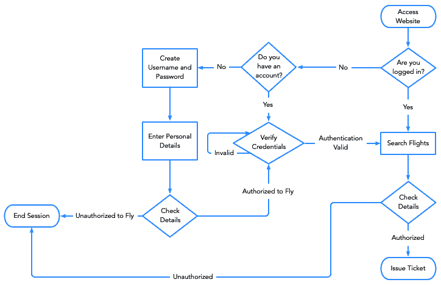
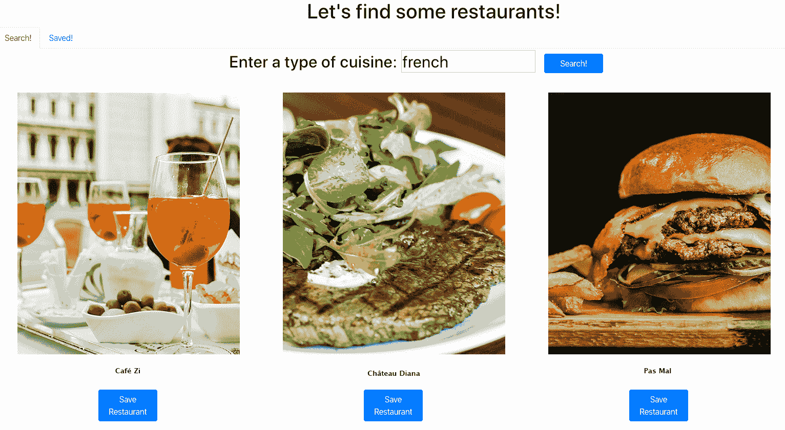
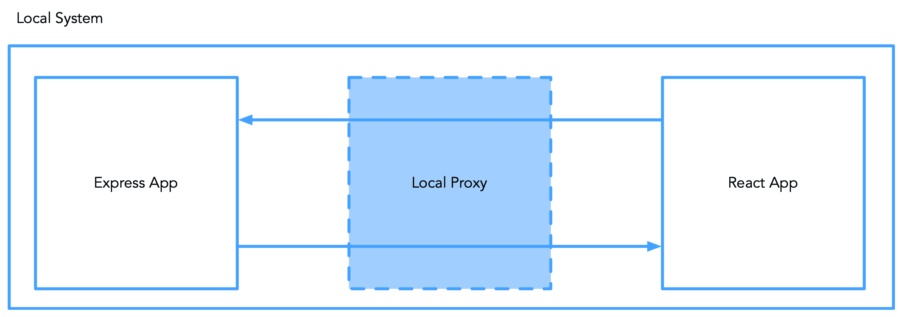

安全和密钥

安全性并不是一件简单的事情。在设计应用程序时，从一开始就牢记安全性是很重要的。例如，如果您意外地将您的密钥提交到存储库中，您将不得不进行一些技巧，要么从存储库的历史记录中删除它，要么更有可能的是，您将不得不撤销这些凭据并生成新的凭据。

我们不能让我们的数据库凭据在前端 JavaScript 中对世界可见，但是前端可以与数据库进行交互的方法。第一步是实施适当的安全措施，并了解我们可以将凭据放在哪里，无论是前端还是后端。

本章将涵盖以下主题：

+   身份验证与授权

+   使用 Firebase

+   `.gitignore`和凭据的环境变量

# 第二十二章：技术要求

准备好使用存储库的`Chapter-17`目录中提供的代码：[`github.com/PacktPublishing/Hands-on-JavaScript-for-Python-Developers/tree/master/chapter-17`](https://github.com/PacktPublishing/Hands-on-JavaScript-for-Python-Developers/tree/master/chapter-17)。由于我们将使用命令行工具，还需要准备您的终端或命令行 shell。我们需要一个现代浏览器和一个本地代码编辑器。

# 身份验证与授权

在我们开始探讨 JavaScript 安全性时，了解**身份验证**和**授权**之间的重要区别至关重要。简而言之，*身份验证*是一个系统确认和承认您是您所说的人的过程。想象一下去商店买一瓶葡萄酒。您可能会被要求提供证明您达到或超过当地法定饮酒年龄的身份证明。店员通过您的身份证对您进行了*身份验证*，以证明*是的，您就是**您**，因为我，店员，已经将您的面孔与身份证中的照片相匹配*。第二种情况是当您乘坐航空公司的飞机时。当您通过安检时，他们也会出于同样的原因检查您的身份证：您是否是您所说的人？

然而，这两种用例最终都与*授权*有关。授权表示：*我知道你就是你所说的那个人*。现在，你是否被允许做你想做的事情？在我们的葡萄酒例子中，如果你在美国年满 21 岁，或者在世界上大多数其他地方年满 18 岁，你就被*授权*消费酒精饮料。现在，机场的安全人员并不真正关心你的年龄有任何真正的原因；他们只关心你是否是你所说的那个人，以及你是否有一张有效的登机牌。然后你就被*授权*进入机场的安全区并登机。

让我们进一步延伸我们的航空公司例子。在当今旅行安全加强的时代，身份验证和授权过程既不是开始也不是结束于安全人员。如果您在线预订商业航班机票，该过程看起来更像是这样：



图 17.1 - 航空公司网站的身份验证和授权

在使用航空公司的网站时，您可能拥有一个帐户并被*授权*继续登录，或者您可能已经登录并被*授权*搜索航班。如果您已经登出，您必须*验证*才能搜索航班。要预订航班，您可能需要一些特定的细节，比如签证，以便被*授权*预订该航班。您可能也被列入旅行到某个国家的观察名单或黑名单，因此您的旅程可能会在开始之前就结束。有很多步骤，但其中许多是在幕后发生的；例如，当您输入您的姓名预订机票时，您可能不知道您的姓名已被搜索对全球记录，以查看您是否被授权飞行。您的签证号码可能已被交叉引用，以查看您是否被授权飞往该国家。

就像你需要经过身份验证和授权才能飞行一样，你的网络应用程序也应该被设计成允许身份验证和授权。考虑一下我们在第十五章中的餐厅查找应用，*将 Node.js 与前端结合使用*，它允许我们在 Firebase 中搜索并保存不同的餐厅：



图 17.2 - 我们的餐厅应用

如果你还记得，我们在实时数据库部分以*开放权限*启动了我们的 Firebase 应用：


图 17.3 - 我们的 Firebase 安全规则

显然，这对于生产网站来说*不是一个好主意*。因此，为了缓解这个问题，让我们返回 Firebase 并设置一些身份验证和授权！

# 使用 Firebase

为了方便起见，我在 GitHub 存储库的`Chapter-17`目录中复制了我们的餐厅查找应用。不要忘记在第十五章中的餐厅查找应用中的`.env`文件中包含你自己的环境变量。在我们继续之前，花点时间来设置和运行它。

我们需要做的下一件事是去 Firebase 配置它以使用身份验证。在 Firebase 控制台中，访问身份验证部分并设置一个登录方法；例如，你可以设置 Google 身份验证。这里有一系列你可以使用的方法，所以继续添加一个或多个。

接下来，我们将在实时数据库部分设置我们的规则，如下所示：

```js
{
  "rules": {
    "restaurants": {
      "$uid": {
        ".write": "auth != null && auth.uid == $uid",
        ".read": "auth != null && auth.uid == $uid"
      }
    }
  }
}
```

我们在这里说的是，如果经过身份验证的数据不是`null`，并且用户 ID 与你尝试写入和读取的数据库位置的用户 ID 匹配，那么用户就被允许从你的数据库的`restaurants/<user id>`部分读取和写入。

现在我们的规则已经设置好了，让我们尝试保存一个餐厅：

1.  通过在根目录执行`npm start`来启动应用，并访问`http://localhost:3000`。

1.  搜索餐厅。

1.  尝试保存这个餐厅。

1.  见证一个史诗般的失败。

你应该看到一个类似以下的错误页面：


图 17.4 - 错误，错误！

另外，如果我们进入开发者工具并检查网络选项卡的 WS 选项卡（**WS**代表**WebSockets**，这是 Firebase 通信的方式），我们可能会看到类似以下的内容：


图 17.5 - WebSockets 通信检查器

太棒了！我们现在证明了我们的 Firebase 规则起作用，并且不允许保存到`/restaurants/<user_id>`，因为我们没有经过身份验证。是时候设置这个了。

我们要做的第一件事是稍微改变我们的`App.js`脚本。在编写 React 时有一些不同的约定，我们将继续使用基于类的方法。我们的`App.js`脚本将如下所示：

```js
import React from 'react'
import cookie from "react-cookies"

import Finder from './components/finder/Finder'
import SignIn from './components/signIn/SignIn'

import './App.css'

export default class App extends React.Component {
 constructor() {
   super()

   this.state = {
     user: cookie.load("username")
   }

   this.setUser = this.setUser.bind(this)
 }

 setUser(user) {
   this.setState({
     user: user
   })

   cookie.save("username", user)
 }

 render() {
   const { user } = this.state
   return (
     <div className="App">
       { (user) ? <Finder user={user} /> : <SignIn setUser={this.setUser}
     /> }
     </div>
   )
 }
}
```

首先要注意的是，我们包含了一个新的`npm`模块：`react-cookies`。虽然从浏览器中读取 cookie 很容易，但有一些模块可以让它变得更容易一点。当我们检索用户的 ID 时，我们将把它存储在一个 cookie 中，这样浏览器就记住了用户已经经过身份验证。

为什么我们需要使用 cookie？如果你还记得，网络本质上是*无状态*的，所以 cookie 是一种从应用程序的一个部分传递信息到另一个部分，从一个会话到另一个会话的手段。这是一个基本的例子，但重要的是要记住不要在 cookie 中存储任何敏感信息；在身份验证工作流程中，令牌或用户名可能是你想要放入其中的最多的信息。

我们还引入了一个新组件`SignIn`，如果用户变量不存在，也就是说，如果用户没有登录，它会有条件地渲染。让我们来看看这个组件：

```js
import React from 'react'
import { Button } from 'react-bootstrap'
import * as firebase from 'firebase'

const provider = new firebase.auth.GoogleAuthProvider()

export default class SignIn extends React.Component {
 constructor() {
   super()

   this.login = this.login.bind(this)
 }

 login() {
   const self = this

   firebase.auth().signInWithPopup(provider).then(function (result) {
     // This gives you a Google Access Token. You can use it to access the
     // Google API.
     var token = result.credential.accessToken;
     // The signed-in user info.
     self.props.setUser(result.user);
     // ...
   }).catch(function (error) {
     // Handle Errors here.
     var errorCode = error.code;
     var errorMessage = error.message;
     // The email of the user's account used.
     var email = error.email;
     // The firebase.auth.AuthCredential type that was used.
     var credential = error.credential;
     // ...
   });
 }
 render() {
   return <Button onClick={this.login}>Sign In</Button>
 }
}
```

这里有两件事需要注意：

+   我们正在使用`GoogleAuthProvider`来进行我们的`SignIn`机制。如果你在设置 Firebase 时选择了不同的认证方法，这个提供者可能会有所不同，但代码的其余部分应该是相同或相似的。

+   `signInWithPopup`方法几乎直接从 Firebase 文档中复制过来。这里唯一的改变是创建`self`变量，这样我们就可以在另一个方法中保持对`this`的作用域。

当这个被渲染时，如果用户还没有登录，它将是一个简单的按钮，上面写着**登录**。它将激活一个弹出窗口，用你的 Google 账号登录，然后像以前一样继续。不是很可怕，对吧？

接下来，我们需要处理我们的用户。你是否注意到在`App.js`中，我们将`user`传递给了 Finder？这将使在我们的基本应用程序中轻松地传递一个对我们用户的引用，就像在`Finder.jsx`中一样：

```js
getRestaurants() {
   const { user } = this.props

   Database.ref(`/restaurants/${user.uid}`).on('value', (snapshot) => {
     const restaurants = []

     const data = snapshot.val()

     for(let restaurant in data) {
       restaurants.push(data[restaurant])
     }
     this.setState({
       restaurants: restaurants
     })
   })
 }
```

这是在这种情况下唯一改变的方法，如果你仔细看，改变是从`this.props`中解构`user`并在我们的数据库引用中使用它。如果你记得我们的安全规则，我们不得不稍微改变我们的数据库结构，以适应我们认证用户的简单*授权*：

```js
{
  "rules": {
    "restaurants": {
      "$uid": {
        ".write": "auth != null && auth.uid == $uid",
        ".read": "auth != null && auth.uid == $uid"
      }
    }
  }
}
```

我们在安全规则中所说的是，格式为`restaurants.$uid`的节点是我们将存储每个单独用户的餐厅的地方。我们的 Firebase 结构现在看起来像这样：


图 17.6 - 我们的 Firebase 结构可能是这样的一个例子

在这个结构中，我们看到`restaurants`内部的`TT8PYnjX6FP1YikssoHnINIpukZ2`节点。那是认证用户的**uid**（**用户 ID**），在那个节点内，我们找到用户保存的餐厅。

这个数据库结构很简单，但提供了简单的授权。我们的规则规定“给用户 TT8 权限查看和修改他们自己节点内的数据，仅此而已。”

我们之前已经讨论了我们的`.env`变量，所以让我们更深入地看一下它们。我们将把我们的应用部署到 Heroku，创建一个公开可见的网站。

# .gitignore 和凭据的环境变量

由于我们一直在使用`.env`文件，我特意指出这些文件*绝对不应该*提交到仓库中。事实上，一个好的做法是在创建任何敏感文件之前向你的`.gitignore`文件添加一个条目，以确保你永远不会意外提交你的凭据。即使你后来从仓库中删除它，文件历史仍然保留，你将不得不使这些密钥失效（或*循环使用*），以便它们不会在历史中暴露出来。

虽然 Git 的完整部分超出了我们在这里的工作范围，但让我们看一个`.gitignore`文件的例子：

```js
# See https://help.github.com/articles/ignoring-files/ for more about ignoring files.

# dependencies
/node_modules
/.pnp
.pnp.js

# testing
/coverage

# production
/build

# misc
.DS_Store
.env*

npm-debug.log*
yarn-debug.log*
yarn-error.log*
```

其中有几个是由`create-react-app`脚手架创建的条目。特别注意`.env*`。星号（或*星号*，或*通配符*）是一个正则表达式通配符，指定任何以`.env`开头的文件都被忽略。你可以有`.env.prod`，它也会被忽略。**一定要忽略你的凭据文件！**

我还喜欢将`/node_modules`改为`*node_modules*`，以防你有自己的子目录和它们自己的 node 模块。

在`.env`文件中存储变量很方便，但也可以创建内存中的环境变量。为了演示这个功能，我们将把项目部署到 Heroku，一个云应用平台。让我们开始吧：

1.  在[`heroku.com`](https://heroku.com)创建一个新账户。

1.  根据提供的文档安装 Heroku **命令行界面**（**CLI**）。一定要遵循登录说明。

1.  在餐厅查找器目录中初始化一个新的仓库：`git init`。

1.  执行`heroku create --ssh-git`。它会提供你的 Heroku 端点的 Git URL，以及`https://` URL。继续访问 HTTPS URL。你应该会看到一个欢迎消息：


图 17.7 - 哦耶！我们有一个空白的 Heroku 应用程序！

我们现在可以继续组织我们应用的逻辑。

## 重新组织我们的应用

接下来，我们要做的与第十五章中的*将 Node.js 与前端结合*不同的事情，就是稍微重新组织我们的文件。这并不是完全必要的，但在部署生产级别的代码时，它提供了前端和后端之间的一个很好的逻辑区分。我们之前的应用和我们要在这里创建的应用之间还有一个语义上的区别：我们不会提供一个正在运行的开发 React 应用，而是一个静态的生产版本。

如果你还记得，我们之前的餐厅结构是这样的：



图 17.8 – 代理与应用的区别，解释。

我们之前实际上是使用 React 应用作为 Web 服务器，并通过它代理到 Express 后端，以便使用 Yelp API。然而，现在我们将使用 Express 作为主要的 Web 服务器，并提供一个 React 应用的生产级别构建。

我们之前的应用逻辑如下：

```js
IF NOT a React page,
 Serve from proxy
ELSE
 Serve React
```

我们要颠倒这个逻辑，并声明以下内容：

```js
IF NOT an Express route,
 Serve from static build
ELSE
 Serve API
```

下面是要做的事情：

1.  创建一个新的`client`目录。

1.  如果你还有`yarn.lock`文件，请删除它。我们将专注于使用 NPM 而不是`yarn`。

1.  将所有文件移动到 client 目录中，除了 API 目录。

1.  接下来，我们要在根目录下创建一个新的`package.json`：`npm install dotenv express yelp-fusion`。

如果你注意到了，我们还安装了 Express，这是之前没有做的。我们将使用它来更轻松地路由我们的请求。

在我们的`package.json`中，在*根*级别，添加这些脚本：

```js
"postinstall": "cd client && npm install && npm run build",
"start": "node api/api.js"
```

由于我们正在处理 Heroku，我们还可以从`package.json`中删除`proxy`行，因为一切都将在同一服务器上运行，不需要代理。现在，我们的`package.json`中的`postinstall`行怎么样？我们要做的是创建我们应用的*生产就绪*版本。`create-react-app`通过`npm run build`脚本免费为我们提供了这个功能。当我们部署到 Heroku 时，它将运行`npm install`，然后运行`postinstall`，以创建我们的 React 应用的生产版本。

现在我们准备向我们的项目添加一个新的元数据，以便 Heroku 可以提供我们的应用：**Procfile**。

Procfile 会告诉 Heroku 如何处理我们的代码。你的 Procfile 会是这样的：

```js
web: npm start
```

实质上，它所做的就是告诉 Heroku 从哪里开始运行程序：运行`npm start`。

我们的目录结构现在应该是这样的：

```js
.
├── Procfile
├── api
│   └── api.js
├── client
│   ├── README.md
│   ├── package-lock.json
│   ├── package.json
│   ├── public
│   └── src
├── package-lock.json
└── package.json
```

我们接下来的重要步骤是修改我们的`api.js`文件，如下所示：

```js
const yelp = require('yelp-fusion');
const express = require('express');
const path = require('path');

const app = express();

require('dotenv').config();

const PORT = process.env.PORT || 3000;

const client = yelp.client(process.env.YELP_API_Key);
```

到目前为止，这看起来与之前相似，只是增加了 Express。但是看看接下来的一行：

```js
app.use(express.static(path.join(__dirname, '../client/build')));
```

啊哈！这是我们的秘密酱：这行表示使用`client/build`目录作为静态资源，而不是 Node.js 代码。

继续，我们正在定义我们的 Express 路由来处理格式为`/search`的请求：

```js
app.get('/search', (req, res) => {
 const { lat, lng, value } = req.query

 client.search({
   term: value,
   latitude: lat,
   longitude: lng,
   categories: 'Restaurants'
 }).then(response => {
   res.statusCode = 200;
   res.setHeader('Content-Type', 'application/json');
   res.setHeader('Access-Control-Allow-Origin', '*');

   res.write(response.body);
   res.end();
 })
   .catch(e => {
     console.error('error', e)
   })
});
```

对于我们秘密酱的下一部分，如果路由*不*匹配`/search`，将其发送到静态的 React 构建：

```js
app.get('*', (req, res) => {
 res.sendFile(path.join(__dirname + '../client/build/index.html'));
});

app.listen(PORT, () => console.log(`Server listening on port ${PORT}`));
```

将所有内容添加到你的 Git 仓库：`git add`。现在你可以执行`git status`来确保你的`.env`文件没有被*包含*。

接下来，提交你的代码：`git commit -m "Initial commit`。如果你需要关于 Git 的帮助，Heroku 文档提供了参考资料。接下来，部署到 Heroku：`git push heroku master`。这会花一些时间，因为 Heroku 不仅会使用 Git 部署你的代码，还会创建你的代码的生产版本。

访问构建脚本提供的 URL，希望你会看到一个很棒的错误消息：


图 17.9 – 哦不！一个错误！实际上这不是坏事！

太好了！这告诉我们的是应用程序正在运行，但我们缺少一些重要的部分：我们的环境变量。对您`.env`文件中的每个条目执行`heroku config:set <entry>`（根目录和`client`中）。

当您刷新页面时，您将看到“登录”按钮。但是，如果您单击它，将不会发生任何事情。它可能会在一秒钟内弹出一个弹出窗口，但不会弹出身份验证窗口。我们需要返回到 Firebase 控制台，将我们的 Firebase URL 添加为*已授权*URL。

在 Firebase 控制台中，转到身份验证部分，并将您的 Heroku URL 输入到已授权域部分。返回到您的 Heroku 应用程序，刷新，然后瞧！身份验证面板可以正常工作。如果您转到 Saved！，甚至会看到您保存的餐馆。

这并不难！Heroku 存储环境变量的方法与我们的`.env`文件并没有太大的不同，但它可以在不需要太多工作的情况下为我们处理。但是，我们还需要配置最后一个部分：我们的搜索*不起作用*。如果您查看控制台错误消息，您应该会看到一条说明拒绝连接到`localhost:3000`的提示。我们需要采取最后一步来将我们的代码从使用`localhost`抽象出来。

在`src/components/search/Search.jsx`中，您可能会认出这种方法：

```js
search(event) {
   const { lng, lat, val } = this.state

   fetch(`http://localhost:3000/businesses/search?value=${val}&lat=${lat}&lng=${lng}`)
     .then(data => data.json())
     .then(data => this.handleSearchResults(data))
 }
```

好了！我们已经将我们的`fetch`调用硬编码为`localhost`和我们的代理路径。让我们将其更改为以下内容：

```js
fetch(`/search?value=${val}&lat=${lat}&lng=${lng}`)
```

提交您的更改并再次推送到 Heroku。在开发过程中，您还可以使用`heroku local web`来生成一个浏览器并测试您的更改，而无需提交和部署。

幸运的话，您应该拥有一个完全功能的前后端应用程序，并且凭据已经安全存储在 Heroku 环境变量中！恭喜！

# 总结

在本章中，我们学习了身份验证、授权以及两者之间的区别。请记住，通常仅执行其中一个是不够的：大多数需要凭据的应用程序需要两者的组合。

Firebase 是一个有用的云存储数据库，您可以将其与现有的登录系统一起使用，不仅可以作为开发资源，还可以扩展到生产级别的使用。最后，请记住这些要点：因为 JavaScript 是客户端的，我们必须以不同的方式保护敏感信息，而不是纯粹的后端应用程序：

1.  进行身份验证和授权以确定谁可以使用哪些资源。

1.  将我们的敏感数据与我们的公共数据分开。

1.  **永远不要将密钥和敏感数据提交到存储库中！**

我们每个人都有责任成为良好的数字公民，但也存在不良行为者。保护自己和您的代码！

在下一章中，我们将把 Node.js 和 MongoDB 联系在一起，以持久化我们的数据。我们将重新审视我们的星际飞船游戏，但这次将使用持久存储。
