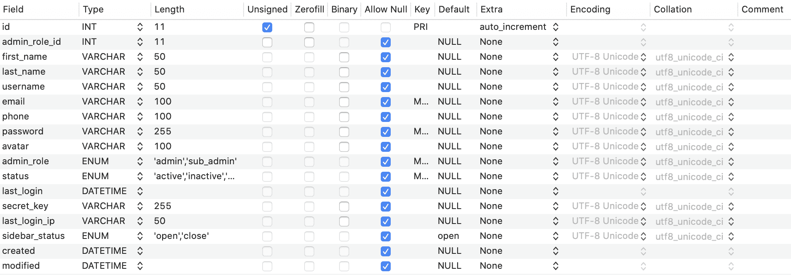
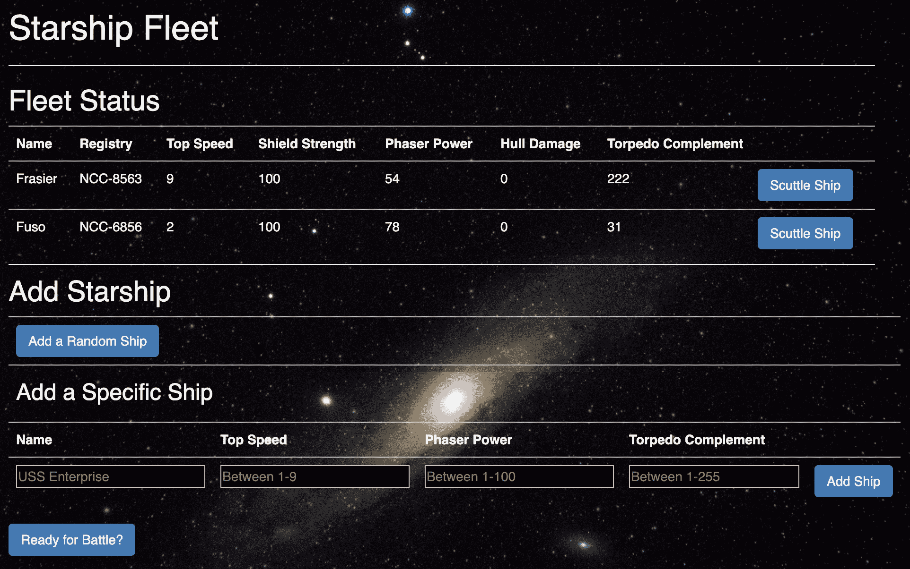
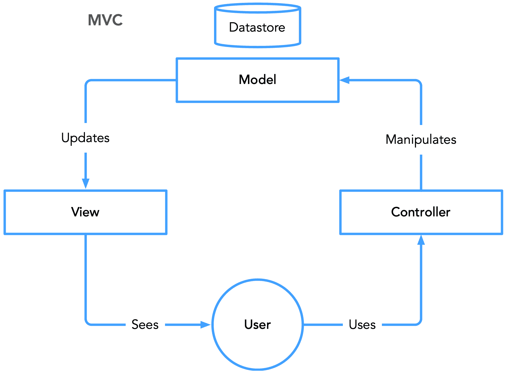

# 第十八章：Node.js 和 MongoDB

您可能已经听说过**MEAN**堆栈：MongoDB、Express、Angular 和 Node.js，或者**MERN**堆栈：MongoDB、Express、React 和 Node.js。我们尚未讨论的缺失部分是 MongoDB。让我们探讨一下这个 NoSQL 数据库如何可以直接从 Express 中使用。我们将构建我们在第十三章中开始的星际飞船游戏的下一个迭代，*使用 Express*，只是这次使用 MongoDB 并且加入了一些测试！

我们将在本章中涵盖以下主题：

+   使用 MongoDB

+   使用 Jest 进行测试

+   存储和检索数据

+   将 API 连接在一起

# 技术要求

准备好使用存储库的`chapter-18`目录中提供的代码：[`github.com/PacktPublishing/Hands-on-JavaScript-for-Python-Developers/tree/master/chapter-18`](https://github.com/PacktPublishing/Hands-on-JavaScript-for-Python-Developers/tree/master/chapter-18)。由于我们将使用命令行工具，还要确保您的终端或命令行 shell 可用。我们需要一个现代浏览器和一个本地代码编辑器。

# 使用 MongoDB

MongoDB 的基本前提是，它与其他类型的结构化键/值对数据库不同的地方在于它是*无模式*的：您可以插入无结构数据的任意**文档**，而不必担心数据库中的另一个条目是什么样子。在 NoSQL 术语中，文档对我们来说已经很熟悉了：一个 JavaScript 对象！

这是一个文件：

```js
{
 "first_name": "Sonyl",
 "last_name": "Nagale",
 "role": "author",
 "mood": "accomplished"
}
```

我们可以看到它是一个基本的 JavaScript 对象；更具体地说，它是 JSON，这意味着它也可以支持嵌套数据。这是一个例子：

```js
{
 "first_name": "Sonyl",
 "last_name": "Nagale",
 "role": "author",
 "mood": "accomplished",
 "tasks": {
  "write": {
   "status": "incomplete"
  },
  "cook": {
   "meal": "carne asada"
  },
  "read": {
   "book": "Le Petit Prince"
  },
  "sleep": {
   "time": "8"
  }
 },
 "favorite_foods": {
  "mexican": ["enchiladas", "burritos", "quesadillas"],
  "indian": ["saag paneer", "murgh makhani", "kulfi"]
 }
}
```

那么这与 MySQL 有什么不同呢？考虑一下这个 MySQL 模式：



图 18.1 - 一个 MySQL 数据库表结构的示例

如果您熟悉 SQL 数据库，您会知道数据库表中的每个字段类型必须是特定类型的。在从 SQL 类型数据库检索时，我们使用**结构化查询语言**（**SQL**）。正如我们的表结构化一样，我们的查询也是结构化的。

在使用数据库表之前，我们需要创建数据库表，在 SQL 中，建议不要在创建后更改其结构，而不进行一些额外的清理工作。以下是我们将创建我们之前的表的方法：

```js
CREATE TABLE `admins` (
 `id` int(11) unsigned NOT NULL AUTO_INCREMENT,
 `admin_role_id` int(11) DEFAULT NULL,
 `first_name` varchar(50) COLLATE utf8_unicode_ci DEFAULT NULL,
 `last_name` varchar(50) COLLATE utf8_unicode_ci DEFAULT NULL,
 `username` varchar(50) COLLATE utf8_unicode_ci DEFAULT NULL,
 `email` varchar(100) COLLATE utf8_unicode_ci DEFAULT NULL,
 `phone` varchar(100) COLLATE utf8_unicode_ci DEFAULT NULL,
 `password` varchar(255) COLLATE utf8_unicode_ci DEFAULT NULL,
 `avatar` varchar(100) COLLATE utf8_unicode_ci DEFAULT NULL,
 `admin_role` enum('admin','sub_admin') COLLATE utf8_unicode_ci DEFAULT
  NULL,
 `status` enum('active','inactive','deleted') COLLATE utf8_unicode_ci 
  DEFAULT NULL,
 `last_login` datetime DEFAULT NULL,
 `secret_key` varchar(255) COLLATE utf8_unicode_ci DEFAULT NULL,
 `last_login_ip` varchar(50) COLLATE utf8_unicode_ci DEFAULT NULL,
 `sidebar_status` enum('open','close') COLLATE utf8_unicode_ci DEFAULT
  'open',
 `created` datetime DEFAULT NULL,
 `modified` datetime DEFAULT NULL,
 PRIMARY KEY (`id`),
 KEY `email` (`email`),
 KEY `password` (`password`),
 KEY `admin_role` (`admin_role`),
 KEY `status` (`status`)
) ENGINE=InnoDB DEFAULT CHARSET=utf8 COLLATE=utf8_unicode_ci;
```

现在，对于 MongoDB，我们*不会*构建具有预定义数据类型和长度的表。相反，我们将将 JSON 块插入到我们的数据库中作为**文档**。MongoDB 的理念与我们在第十七章中使用 Firebase 时非常相似，*安全和密钥*，插入 JSON 并对其进行查询，即使有多个嵌套的 JSON 对象，而不是存储、交叉连接和查询多个表。

假设我们有以下两个文档：

```js
{
  "first_name": "Sonyl",
  "last_name": "Nagale",
  "admin_role": "admin",
  "status": "active"
},
{
  "first_name": "Jean-Luc",
  "last_name": "Picard",
  "admin_role": "admin",
  "status": "inactive"
}
```

我们如何将它们插入到我们的数据库中？这将使用 MySQL：

```js
INSERT INTO
    admins(first_name, last_name, admin_role, status)
  VALUES
    ('Sonyl', 'Nagale', 'admin', 'active'),
    ('Jean-Luc', 'Picard', 'admin', 'inactive')
```

使用 MongoDB 的答案实际上比 SQL 要容易得多，因为我们可以轻松地放置数组，而不必担心数据类型或数据排序！我们可以只是把文档塞进去，而不必担心其他任何事情，这更有可能是我们从前端接收到的方式：

```js
db.admins.insertMany([
{
  "first_name": "Sonyl",
  "last_name": "Nagale",
  "admin_role": "admin",
  "status": "active"
},
{
  "first_name": "Jean-Luc",
  "last_name": "Picard",
  "admin_role": "admin",
  "status": "inactive"
}]
)
```

例如，要从前述的`admins`表中获取所有活动管理员，我们在 MySQL 中会写出类似于这样的内容：

```js
SELECT
  first_name, last_name 
FROM 
  admins 
WHERE 
  admin_role = "admin" 
AND 
  status = "active"
```

`first_name`和`last_name`字段被预定义为`VARCHAR`类型（可变字符），最大长度为 50 个字符。`admin_role`和`status`是`ENUM`（枚举类型），具有预定义的可能值（就像站点上的下拉选择列表）。然而，这是我们如何在 MongoDB 中构造我们的查询：

```js
db.admins.find({ status: 'active', admin_role: 'admin'}, { first_name: 1, last_name: 1})
```

我们在这里不会深入研究 MongoDB 的语法，因为这有点超出了本书的范围，我们只会使用简单的查询。话虽如此，在我们开始之前，我们应该了解更多。

以下是我们在制作游戏时将使用的 mongo 命令列表：

+   `find`

+   查找一个

+   `insertOne`

+   `updateOne`

+   `updateMany`

相当容易管理，对吧？我们可以将许多 MongoDB 命令分解为以下一般的句法结构：

`<dbHandle>.<collectionName>.<method>(query, projection)`

在这里，`query` 和 `projection` 是指导我们使用 MongoDB 的对象。例如，在我们前面的语句中，`{ status: 'active', admin_role: 'admin' }` 是我们的查询，指定我们希望这些字段等于这些值。这个例子中的 projection 指定了我们想要返回的内容。

让我们深入我们的项目。

## 入门

我们可以做的第一件事是从 [`MongoDBdb.com`](https://mongodb.com) 下载 MongoDB Community Server。当你安装好后，从我们的 GitHub 仓库中导航到 `chapter-18/starships` 目录，让我们尝试启动它：

```js
npm install
mkdir -p data/MongoDB
mongod --dbpath data/MongoDB
```

如果一切安装正确，你应该会看到一大堆通知消息，最后一条消息类似于 `[initandlisten] waiting for connections on port 27017`。如果一切不如预期，花些时间确保你的安装工作正常。一个有用的工具是 MongoDB Compass，一个连接到 MongoDB 的 GUI 工具。确保检查权限，并且适当的端口是打开的，因为我们将使用端口 `27017`（MongoDB 的默认端口）进行连接。

本章将是一个实验，将我们的星际飞船游戏提升到一个新的水平。这是我们将要构建的内容：



图 18.2 – 创建我们的舰队

然后，我们将把它连接到 MongoDB，并在这个界面上实际执行游戏：


图 18.3 – 攻击敌人！

我们将使用简化版本的 MERN，使用原生 JavaScript 而不是 React，依赖于 Express 以一种比 React 更少受控的方式呈现我们的 HTML。也许 *JEMN stack* 是一个好的名字？

在我们开始编写实际代码之前，让我们检查项目的设置并开始测试！

## 使用 Jest 进行测试

在 `starships` 目录中，你会找到完成的游戏。让我们来剖析一下。

这是目录列表：

```js
.
├── README.md
├── app.js
├── bin
│   └── www
├── controllers
│   └── ships.js
├── jest-MongoDBdb-config.js
├── jest.config.js
├── models
│   ├── MongoDB.js
│   ├── setup.js
│   └── ships.js
├── package-lock.json
├── package.json
├── public
│   ├── images
│   │   └── bg.jpg
│   ├── javascripts
│   │   ├── index.js
│   │   └── play.js
│   └── stylesheets
│       ├── micromodal.css
│       └── style.css
├── routes
│   ├── enemy.js
│   ├── index.js
│   ├── play.js
│   ├── ships.js
│   └── users.js
├── tests
│   ├── setup.model.test.js
│   ├── ships.controller.test.js
│   └── ships.model.test.js
└── views
    ├── enemy.hbs
    ├── error.hbs
    ├── index.hbs
    ├── layout.hbs
    └── play.hbs
```

我们将采取一种与我们其他项目有些不同的方法，在这里实现一个非常轻量级的**测试驱动开发**（**TDD**）循环。TDD 是在编写能够工作的代码之前编写失败的测试的实践。虽然我们没有实现真正的 TDD，但使用测试来引导我们的思维过程是我们将要做的事情。

我们将使用 Jest 作为我们的测试框架。让我们来看一下步骤：

1.  在 `tests` 目录中，创建一个名为 `test.test.js` 的新文件。第一个 `test` 是我们测试套件的名称，以 `.test.js` 结尾的约定表示这是一个要执行的测试套件。在文件中，创建这个测试脚本：

```js
describe('test', () => {
 it('should return true', () => {
   expect(1).toEqual(1)
 });
});
```

1.  使用 `node_modules/.bin/jest test.test.js` 运行测试（确保你已经运行了 `npm install`！）。你将会得到类似以下的测试套件输出：

```js
$ node_modules/.bin/jest test.test.js
 PASS  tests/test.test.js
  test
    ✓ should return true (2ms)

Test Suites: 1 passed, 1 total
Tests:       1 passed, 1 total
Snapshots:   0 total
Time:        0.711s, estimated 1s
Ran all test suites matching /test.test.js/i.
```

我们刚刚编写了我们的第一个测试套件！它简单地说“我期望 1 等于 1。如果是，通过测试。如果不是，测试失败。”对于五行代码来说，相当强大，对吧？好吧，也许不是，但这将为我们的所有其他测试提供支架。

1.  让我们来看一下 MongoDB 模型：`models/mongo.js`*:* 

```js
const MongoClient = require('mongodb').MongoClient;
const client = new MongoClient("mongodb://127.0.0.1:27017", { useNewUrlParser: true, useUnifiedTopology: true });

let db;
```

1.  到目前为止，我们只是在设置我们的 MongoDB 连接。确保你现在仍然有你的 MongoDB 连接运行着：

```js
const connectDB = async (test = '') => {
 if (db) {
   return db;
 }

 try {
   await client.connect();
   db = client.db(`starships${test}`);
 } catch (err) {
   console.error(err);
 }

 return db;
}
```

1.  与所有良好的数据库连接代码一样，我们在一个 *try/catch* 块中执行我们的代码，以确保我们的连接正确建立：

```js
const getDB = () => db

const disconnectDB = () => client.close()

module.exports = { connectDB, getDB, disconnectDB }
```

预览：我们将在测试和模型中使用这个 `MongoDB.js` 文件。`module.exports` 行指定了从这个文件导出并暴露给我们程序的其他部分的函数。我们将在整个程序中一贯使用这个导出指令：当我们想要暴露一个方法时，我们会使用一个导出。

1.  返回到 `test.test.js` 并在文件开头包含我们的 MongoDB 模型：

```js
const MongoDB = require('../models/mongo')
```

1.  现在，让我们在我们的测试套件中变得更加花哨一点。在我们的`describe`方法*内*增加以下代码：

```js
let db

beforeAll(async () => {
   db = await MongoDB.connectDB('test')
})

afterAll(async (done) => {
   await db.collection('names').deleteMany({})
   await MongoDB.disconnectDB()
   done()
})
```

并在我们简单的测试之后添加以下情况：

```js
it('should find names and return true', async () => {
   const names = await db.collection("names").find().toArray()
   expect(names.length).toBeGreaterThan(0)
})
```

然后使用与之前相同的命令运行它：`node_modules/.bin/jest test.test.js`。

这里发生了什么？首先，在我们的测试套件中的每个单独的测试之前，我们正在指定按照我们在 MongoDB 模型中编写的方法连接到数据库。在一切都完成之后，拆除数据库并断开连接。

当我们运行它时会发生什么？一个史诗般的失败！

```js
$ node_modules/.bin/jest test.test.js
 FAIL  tests/test.test.js
  test
    ✓ should return true (2ms)
    ✕ should find names and return true (9ms)

  ● test > should find names and return true

    expect(received).toBeGreaterThan(expected)

    Expected: > 0
    Received:   0

      20 |   it('should find names and return true', async () => {
      21 |     const names = await db.collection("names"
                ).find().toArray()
    > 22 |     expect(names.length).toBeGreaterThan(0)
         |                          ^
      23 |   })
      24 | });

      at Object.<anonymous> (tests/test.test.js:22:26)

Test Suites: 1 failed, 1 total
Tests:       1 failed, 1 passed, 2 total
Snapshots:   0 total
Time:        1.622s, estimated 2s
Ran all test suites matching /test.test.js/i.
```

我们应该期望出现错误，因为我们还没有向名为`names`（或任何其他数据）的集合中*插入*任何信息！欢迎来到 TDD：我们编写了一个在编写代码之前就失败的测试。

显然，我们在这个过程中的下一步是实际插入一些数据！让我们这样做。

# 存储和检索数据

让我们使用我编写的一个测试套件来确保我们的 MongoDB 连接更加健壮，并包括将数据插入数据库，然后测试以确保它存在：

1.  检查`test/setup.model.test.js`：

```js
const MongoDB = require('../models/mongo')
const insertRandomNames = require('../models/setup')

describe('insert', () => {
 let db

 beforeAll(async () => {
   db = await MongoDB.connectDB('test')
 })

 afterAll(async (done) => {
   await db.collection('names').deleteMany({})
   await MongoDB.disconnectDB()
   done()
 })

 it('should insert the random names', async () => {
   await insertRandomNames()

   const names = await db.collection("names").find().toArray()
   expect(names.length).toBeGreaterThan(0)
 })

})
```

1.  如果我们运行`node_modules/.bin/jest setup`，我们会看到成功，因为我们的设置模型中存在`insertRandomNames()`方法。所以让我们来看看我们的设置模型（`models/setups.js`）并看看它是如何填充数据库的：

```js
const fs = require('fs')
const MongoDB = require('./mongo')

let db

const setup = async () => {
 db = await MongoDB.connectDB()
}

const insertRandomNames = async () => {
 await setup()

 const names = JSON.parse(fs.readFileSync(`${__dirname}/../
  data/starship-names.json`)).names

 const result = await db.collection("names").updateOne({ key: 
  "names" }, { $set: { names: names } }, { upsert: true })

 return result
}

module.exports = insertRandomNames
```

1.  还不错！我们有一个导出的方法，根据我提供的“随机”星际飞船名称的 JSON 文件将名称插入到数据库中。文件被读取，然后按以下方式放入数据库中：

```js
db.collection("names").updateOne({ key: "names" }, { $set: { names: names } }, { upsert: true })
```

由于我们并没有深入了解 MongoDB 本身的细节，可以说这行代码的意思是“在`names`集合中（即使它还不存在），将`names`键设置为相等的 JSON。根据需要更新或插入”。

现在，我们可以用我提供的“随机”星际飞船名称的 JSON 文件来填充我们的数据库。执行`npm run install-data`。

到目前为止，一切都很好！在这个项目中有很多文件，所以我们不会遍历*所有*文件；让我们检查一个代表性的样本。

## 模型，视图和控制器

**模型-视图-控制器**（**MVC**）范式是我们在 Express 中使用的。虽然在 Express 中并不是真正必要的，但我发现逻辑上的关注点分离比单一类型的不可区分的文件更有用且更容易使用。在我们走得太远之前，我会提到 MVC 可能被认为是一种过时的模式，因为它确实在层之间创建了一些额外的依赖关系。话虽如此，将逻辑分离为离散的角色的架构范式背后的思想在 MVC 中是合理的。你可能会听到**MV***的使用，这基本上应该被理解为“模型，视图和将它们绑定在一起的任何东西”。在某些框架中，这些天 MV*更受欢迎。

MVC 结构将程序的逻辑分为三个部分：

1.  **模型**处理数据交互。

1.  **视图**处理表示层。

1.  **控制器**处理数据操作，并充当模型和视图之间的粘合剂。

这是设计模式的一个可视化表示：



图 18.4 - MVC 范例的生命周期

关于这种关注点分离的更重要的部分之一是，视图层和控制器层*永远*不应直接与数据存储交互；这一荣誉是为模型保留的。

现在让我们来看一个视图：

*views/index.hbs*

```js
<h1>Starship Fleet</h1>

<hr />

<h2>Fleet Status</h2>
{{#if ships.length}}
 <table class="table">
   <tr>
     <th>Name</th>
     <th>Registry</th>
     <th>Top Speed</th>
     <th>Shield Strength</th>
     <th>Phaser Power</th>
     <th>Hull Damage</th>
     <th>Torpedo Complement</th>
     <th></th>
   </tr>
 {{#each ships}}
   <tr data-ship="{{this.registry}}">
     <td>{{this.name}}</td>
     <td>{{this.registry}}</td>
     <td>{{this.speed}}</td>
     <td>{{this.shields}}</td>
     <td>{{this.phasers}}</td>
     <td>{{this.hull}}</td>
     <td>{{this.torpedoes}}</td>
     <td><a class="btn btn-primary scuttle">Scuttle Ship</a></td>
   </tr>
 {{/each}}
 </table>
{{else}}
 <p>The fleet is empty. Create some ships below.</p>
{{/if}}
```

Express 控制我们的视图，我们使用 Handlebars 来处理我们的模板逻辑和循环。虽然语法简单，但 Handlebars 功能强大，可以极大地简化我们的生活。在这种情况下，我们正在测试并循环遍历`ships`变量，以创建我们拥有的`ships`的表格，或者发送一条消息说舰队是空的。我们的视图如何获得`ships`？它是通过我们的**控制器**通过我们的**路由**提供给视图的。对于这部分，它看起来是这样的：

*routes/index.js*

```js
var express = require('express');
var router = express.Router();
const ShipsController = require('../controllers/ships');

/* GET home page. */
router.get('/', async (req, res, next) => {
 res.render('index', { ships: await ShipsController.getFleet() });
});

module.exports = router;
```

为什么我们在这里使用`var`而不是`const`或`let`？为什么要使用分号？答案是：在撰写本文时，Express 脚手架工具仍然使用`var`和分号。标准化始终是最佳实践，但在这个例子中，我想引起注意。随时根据新的语法进行标准化。

现在是`getFleet`方法：

*controllers/ships.js*

```js
exports.getFleet = async (enemy = false) => {
 return await ShipsModel.getFleet(enemy)
}
```

因为这是一个简单的例子，我们的控制器除了从模型获取信息外并没有做太多事情，模型查询 MongoDB。让我们来看看：

*models/ships.js*

```js
exports.getFleet = async (enemy) => {
 await setup()

 const fleet = await db.collection((!enemy) ? "fleet" :
 "enemy").find().toArray();
 return fleet.sort((a, b) => (a.name > b.name) ? 1 : -1)
}
```

设置函数规定了与 MongoDB 的连接（注意异步/等待设置！），我们的舰队要么来自敌人，要么来自我们的舰队集合。`return`行包含了一个方便的方法，按字母顺序对舰队进行排序。

在这个例子中，我们将保持控制器相当简单，并依靠模型来完成大部分工作。这是一个风格上的决定，尽管选择应用程序的一边来完成大部分工作是很好的。

现在是时候从头到尾查看程序了。

# 将 API 连接在一起

为了进一步了解游戏玩法，我们将逐步介绍从船只发射鱼雷的步骤：

1.  在`public/javascripts/play.js`中找到前端 JavaScript：

```js
document.querySelectorAll('.fire').forEach((el) => {
 el.addEventListener('click', (e) => {
   const weapon = (e.target.classList.value.indexOf('fire-torpedo') 
   > 0) ? "torpedo" : "phasers"
   const target = e.target.parentNode.getElementsByTagName
   ('select')[0].value
```

1.  在我们的界面上为`fire`按钮创建了一个点击处理程序，并确定了我们的武器和目标船只：

```js
fetch(
`/play/fire?  attacker=${e.target.closest('td').dataset.attacker}&target=${target}&weapon=${weapon}`)
.then(response => response.json())
.then(data => {
```

这一行可能需要一些解释。我们正在从我们的 JavaScript 向我们的 Node 应用程序进行 AJAX 调用，带有特定的查询字符串参数：`attacker`，`target`和`weapon`。我们也期望从我们的应用程序返回 JSON。

1.  记住，我们的反引号允许我们*组合*一个带有`${ }`中变量的字符串：

```js
const { registry, name, shields, torpedoes, hull, scuttled } = data.target
```

1.  我们使用**对象解构**从`data.target`中提取每个信息片段。这比逐个定义它们或甚至使用循环更有效，对吧？

```js
if (scuttled) {
       document.querySelector(`[data-ship=${registry}]`).remove()
       document.querySelectorAll(`option[value=${registry}]`).
        forEach(el => el.remove())

       const titleNode = document.querySelector("#modal-1-title")

       if (data.fleet.length === 0) {
         titleNode.innerHTML = "Your fleet has been destroyed!"
       } else if (data.enemyFleet.length === 0) {
         titleNode.innerHTML = "You've destroyed the Borg!"
       } else {
         titleNode.innerHTML = `${name} destroyed!`
       }

       MicroModal.show('modal-1')
       return
     }
```

1.  如果`scuttled`为`true`，我们的目标船只已被摧毁，因此让我们向用户传达这一点。无论哪种情况，我们都将编辑我们船只的值：

```js
     const targetShip = document.querySelector(`[data-
      ship=${registry}]`)

     targetShip.querySelector('.shields').innerHTML = shields
     targetShip.querySelector('.torpedoes').innerHTML = torpedoes
     targetShip.querySelector('.hull').innerHTML = hull

   })
 })
})
```

这就是前端代码。如果我们查看我们的`app.js`文件，我们可以看到我们对`/play`的 AJAX 调用转到`playRouter`，从`app.use`语句。因此，我们的下一站是路由器：

*routes/play.js*

```js
const express = require('express');
const router = express.Router();
const ShipsController = require('../controllers/ships');

router.get('/', async (req, res, next) => {
 res.render('play', { fleet: await ShipsController.getFleet(), enemyFleet:
  await ShipsController.getFleet(true) });
});

router.get('/fire', async (req, res, next) => {
 res.json(await ShipsController.fire(req.query.attacker, req.query.target, 
  req.query.weapon));
});

module.exports = router;
```

由于我们的 URL 是从`/play/fire`构建的，我们知道第二个`router.get`语句处理我们的请求。继续到控制器及其`fire`方法：

*controllers/ships.js*

```js
exports.fire = async (ship1, ship2, weapon) => {
 let target = await ShipsModel.getShip(ship2)
 const source = await ShipsModel.getShip(ship1)
 let damage = calculateDamage(source, target, weapon)
  target = await ShipsModel.registerDamage(target, damage)

 return { target: target, fleet: await this.getFleet(false), enemyFleet: 
  await this.getFleet(true) }
}
```

在前面的代码中，我们看到了控制器和模型之间的粘合剂。首先，我们获取目标和源船只。你为什么认为我决定在目标上使用`let`，在源上使用`const`？如果你认为目标需要是可变的，你是对的：当我们在目标上使用`registerDamage`方法时，重写变量会比创建新变量更有效。

在查看我们的模型的`registerDamage`方法之前，请注意到迄今为止的返回路径是控制器将返回到返回到我们前端脚本的路由。

继续前进！

*models/ships.js*

```js
exports.registerDamage = async (ship, damage) => {
 const enemy = (!ship.registry.indexOf('NCC')) ? "fleet" : "enemy"
  const target = await db.collection(enemy).findOne({ registry:
   ship.registry })

 if (target.shields > damage) {
   target.shields -= damage
 } else {
   target.shields -= damage
   target.hull += Math.abs(target.shields)
   target.shields = 0
 }

 await db.collection(enemy).updateOne({ registry: ship.registry }, { $set: { shields: target.shields, hull: target.hull } })
  if (target.hull >= 100) {
   await this.scuttle(target.registry)
   target.scuttled = true
 }

 return target
}
```

现在*这里*是我们实际与我们的数据库通信的地方。我们可以看到我们正在检索我们的目标，注册对其护盾和可能对其船体的损坏，将这些值设置在 MongoDB 中，并最终通过控制器将目标船的信息返回到我们的前端 JavaScript。

让我们来看看这一行：

```js
await db.collection(enemy).updateOne({ registry: ship.registry }, { $set: { shields: target.shields, hull: target.hull } })
```

我们将更新集合中的一个项目，以说明它是敌船还是我们的舰队，并设置护盾强度和船体损坏。

## 导出函数

到目前为止，您可能已经注意到一些模型方法，比如`registerDamage`，是以`exports`为前缀的，而其他一些方法，比如`eliminateExistingShips`，则没有。在复杂的 JavaScript 应用程序中，良好的设计方面之一是封装那些不打算在特定上下文之外使用的函数。当以`exports`为前缀时，可以从不同的上下文中调用函数，比如从我们的控制器中。如果它不打算暴露给应用程序的其他部分；本质上，它是一个私有函数。导出变量的概念类似于作用域的概念，我们确保保持应用程序的整洁，并且只公开程序的有用部分。

如果我们看一下`eliminateExistingShips`，我们可以看到它只是一个辅助函数，由`createRandom`使用，以确保我们不会将相同的船只注册编号或名称分配给两艘不同的船只。我们可以在`createRandom`中看到这种用法：

```js
const randomSeed = Math.ceil(Math.random() * names.length);

const shipData = {
  name: (!enemy) ? names[randomSeed] : "Borg Cube",
```

*更多代码...然后：*

```js
while (unavailableRegistries.includes(shipData.registry)) {
  shipData.registry = `NCC-${Math.round(Math.random() * 10000)}`;
}
```

为了确保我们船只的注册编号在我们的舰队中是唯一的，我们将使用`while`循环来不断更新船只的注册编号，直到它不是已经存在的编号。使用`eliminateExistingShips`辅助函数，我们返回并解构已经存在于我们舰队中的名称和注册，以便我们不会创建重复的注册。

我们并不经常使用`while`循环，因为它们经常是程序中的阻塞点，并且很容易被滥用。话虽如此，这是`while`循环的一个很好的用例：它确保我们的程序在船只注册是唯一的情况下才能继续。通过一个随机化乘数为 10,000，很少会出现连续两次或更多次生成重复的随机注册，因此`while`循环是合适的。

因此，导出还是不导出，这是个问题。答案取决于我们是否需要在其直接范围之外使用该函数。如果在程序的其他部分中没有使用该函数，则不应该导出它。在这种情况下，我们需要确定船只的详细信息是否已经存在于舰队中，这在我们的`ships`模型中确实只有用，因此我们将不导出它。

## 改进我们的程序

当您阅读`ships`模型和控制器时，我相信您可以找到改进的地方。例如，我为了了解船只是在我们的舰队还是敌方舰队而编写的开关方式有点死板：它无法容纳在一场战斗中有三个单独的舰队。每个程序员都会创造**技术债务**，或者代码中的小错误或低效。这就需要**重构**，即改变代码使其更好。不要被愚弄以为您曾经写过*完美的程序*——这样的东西是不存在的。改进和持续迭代是编程过程的一部分。

然而，重构有一个重要的警告，那就是通常所谓的**合同**。当设计一个由前端使用的后端，并且不同的团体正在编写系统的不同部分时，重要的是要与彼此和整个程序的前提和需求保持同步。

让我们以前端 JavaScript 代码为例。如果我们枚举它正在使用的端点，我们将看到正在使用四个端点：

+   `/ships`

+   ``/ships/${e.currentTarget.closest('tr').dataset.ship}``

+   `/ships/random`

+   `/play/fire?attacker=${e.target.closest('td').dataset.attacker}&target=${target}&weapon=${weapon}``

至少，在重构后端代码时，我们应该假定有一个合同义务，即不更改这些端点的路径，也不更改要接收的数据类型的期望。

我们可以帮助我们的代码更具未来性，使用一种名为 JSDoc 的松散标准进行*内联文档*。从代码注释创建文档是一种长期以来的做法，为了促进标准，许多语言都存在注释结构。在 API 等情况下，通常会运行一个辅助程序来针对源代码生成独立的文档，通常作为一个小型的 HTML/CSS 微型网站。您可能已经遇到了与类似风格的在线文档无关的程序。有很大的可能性，这些无关的文档站点是通过相同的机制从代码生成的。

为什么在关于 MongoDB 的章节中这很重要？嗯，文档不仅仅是数据库使用的需要；相反，当创建任何具有多个移动部分的程序时，它是重要的。考虑前面列表中的最后一个端点：`/play/fire?attacker=${e.target.closest('td').dataset.attacker}&target=${target}&weapon=${weapon}`。

fire 端点接受三个参数：`attacker`、`target`和`weapon`。但这些参数是什么？它们是什么样子的——是对象？字符串？布尔值？数组？此外，如果我们要接受用户生成的数据，我们需要比以前更加小心，因为**GIGO**：**垃圾进，垃圾出**。如果我们用坏数据填充我们的数据库，我们最好能期望的是一个破碎的程序。事实上，我们最坏的期望是安全**妥协**：数据库或服务器凭据泄露或恶意代码执行。让我们谈谈安全。

## 安全

如果您熟悉 SQL，您可能熟悉一种称为**SQL 注入**的安全漏洞。关于 Web 应用程序安全最佳实践的良好信息可以在[owasp.org](http://owasp.org)找到。**开放 Web 应用程序安全项目**（**OWASP**）是一个社区驱动的倡议，旨在记录和教育用户有关 Web 应用程序中存在的安全漏洞，以便我们可以更有效地对抗恶意黑客。如果您的电子邮件、社交帐户或网站曾被黑客入侵，您就会知道随之而来的痛苦——数字身份盗窃。OWASP 关于 SQL 注入的列表在这里：[`owasp.org/www-community/attacks/SQL_Injection`](https://owasp.org/www-community/attacks/SQL_Injection)。

那么，如果我们使用的是 MongoDB 这种 NoSQL 数据库，为什么要谈论 SQL 呢？因为*MongoDB 中不存在 SQL 注入*。"太好了！"你可能会说，"我的安全问题解决了！"不幸的是，情况并非如此。重构以提高应用程序效率的想法，重构以减轻安全入侵向量是负责任地管理 Web 应用程序的重要部分。我曾在一家公司工作，那家公司被黑客入侵了——原因是因为在 URL 中插入了不到五个字符。这使得黑客能够破坏 Web 应用程序的操作并执行任意的 SQL 命令。对所有用户生成的内容进行消毒和重构是 Web 安全的重要部分。现在，我们还没有为这个应用程序做到这一点，因为我相信你不会黑自己的机器。

等等。我刚刚不是说 MongoDB 中不存在 SQL 注入吗？是的，NoSQL 数据库有它们等效的攻击方法：**代码和命令注入**。因为我们没有对用户输入进行消毒或验证完整性，所以我们的应用程序可能会存储和使用已提交并存储在我们的数据库中的任意代码。虽然本书不涵盖 JavaScript 安全的完整介绍，但请记住这一点。长话短说就是要消毒或验证您的用户生成的输入的有效性。

就这样，让我们结束这一章。只要记住，在野外编写 MongoDB 应用程序时要注意安全！

# 总结

JavaScript 并不孤立存在！MongoDB 是 JavaScript 的绝佳伴侣，因为它设计为面向对象，并依赖于友好的 JavaScript 查询语法。我们已经学习了 TDD 的原则，使用了 MVC 范式，并且扩展了我们的游戏。

在进行编码练习时，一定要考虑使用诸如 MongoDB 这样的数据库时的用例：虽然 MongoDB 的语法不容易受到 SQL 注入的影响，但仍然容易受到其他类型的注入攻击，这可能会危及您的应用程序。

希望我们的星际飞船游戏足够有趣，让您继续开发它。我们的下一个（也是最后一个）章节将汇集 JavaScript 开发原则，并完善我们的游戏。
