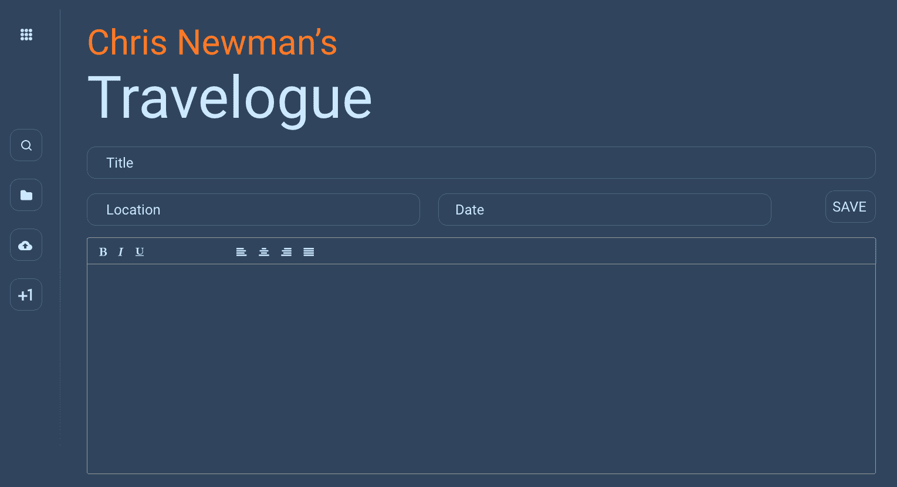
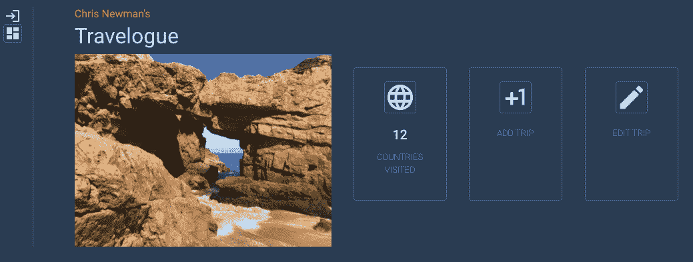

将所有内容整合在一起

终于！我们现在可以构建网站的前端和后端，并在两侧使用 JavaScript！为了将所有内容整合在一起，让我们构建一个小型 Web 应用程序，该应用程序使用带有 React 前端和 MongoDB 的 Express API。

对于我们的最终项目，我们将利用我们的技能创建一个基于数据库的旅行日志或旅行日志，包括照片和故事。我们的方法是从最初的视觉布局一直到前端和后端代码。如果您的 HTML/CSS 技能不太好，不用担心：代码已经为您提供了多个实例，因此您可以从任何地方开始处理项目。

本章将涵盖以下主题：

+   项目简介

+   脚手架 - React

+   后端 - 设置我们的 API

+   数据库 - 所有 CRUD 操作

# 第二十四章：技术要求

准备好使用存储库的`chapter-19`目录中提供的代码，网址为[`github.com/PacktPublishing/Hands-on-JavaScript-for-Python-Developers/tree/master/chapter-19`](https://github.com/PacktPublishing/Hands-on-JavaScript-for-Python-Developers/tree/master/chapter-19)。由于我们将使用命令行工具，还需要准备终端或命令行 shell。我们需要一个现代浏览器和一个本地代码编辑器。

# 项目简介

从头到尾开始一个真实的 Web 项目时，重要的是要提前收集**要求**。这可以以许多形式呈现：口头描述，功能的项目列表，视觉线框图，完整的设计文档，或者这些的任何组合。在审查要求时，重要的是要尽可能明确，以减少误传、冗余或被放弃的工作，以及简化的工作流程。对于这个项目，我们将从视觉 comp 开始。

如果您曾经与平面设计师合作过，您可能熟悉术语 comp。视觉 comp，简称*全面布局*，是设计工件，是所需项目最终状态的高保真视觉表示。例如，印刷项目的 comp 将是一个数字文件，其中包含所有所需的资产，可立即发送给打印机使用。对于数字作品，您可能会收到 Adobe Photoshop、XD 或 Sketch 文件，或者许多其他类型的设计文档格式。

让我们先看一下视觉效果，以便随后确定我们的要求：


图 19.1 - 主页

我们的应用程序将具有*已登录*和*已注销*状态。注销时，用户将看到封面页面，并可以使用导航按钮浏览旅行日志的条目。作为挑战，在页面加载时显示一个随机条目。

左上角的登录按钮将引导到下一个屏幕，即登录屏幕：


图 19.2 - 登录

登录页面可以简单也可以复杂。也许输入任何用户名和密码组合都可以工作，或者为了增加挑战，您可以整合 Google 或 Facebook 身份验证。您甚至可以编写自己的身份验证，使用您的数据库存储凭据。

一旦经过身份验证，我们在左侧栏有一个新按钮：仪表板按钮。这是带我们到应用程序的各个部分的地方：


图 19.3 - 仪表板

当单击“访问过的国家”按钮时，我们将显示由 D3.js 图形库提供支持的矢量地图：


图 19.4 - 旅行地图

突出显示的国家由数据库提供的 JSON 清单控制。

最后但同样重要的是，用户需要能够撰写条目并插入照片：



图 19.5 - 新条目/编辑条目屏幕

我们将使用一个名为 Quill 的 JavaScript 所见即所得（WYSIWYG）编辑器。

在构建应用程序时，可以随意对其外观和感觉进行一些自定义-使其成为您自己的！您可能还想添加一些其他功能，例如媒体库来管理上传的照片，或者搜索功能。

现在我们已经有了关于我们的视觉布局的想法，让我们开始着手项目的前端。

# 脚手架 - React

我们的项目非常适合使用 React 来进行前端开发，因此让我们为前端制定我们的要求：*一个单一的 React 应用程序，具有可重用的组件和**Hooks 和 context**用于状态保存*。与我们以前使用 React 的方式相比，Hooks 是一个新概念。在 React 16.8 中添加的 Hooks 是允许您在函数组件中操作状态和上下文以进行状态管理的函数。

除了我们手工制作的 React 应用程序，我们还将整合一些额外的预构建库，以简化我们的项目并利用现成的工具。D3.js 是一个强大的图形和数据可视化库，我们将利用它来制作我们的地图。Quill 是一个富文本编辑器，它将允许您使用文本格式编写条目，并上传和放置照片。

由您决定是要从`npx create-react-app`开始，还是使用 GitHub 存储库的`chapter-19`目录中的`Step 1`文件夹中提供的脚手架代码。

我将对要使用的其他包提出一些建议；在项目进行过程中，可以随意添加或删除包。我将使用以下内容：

+   引导（用于布局）

+   `d3`，`d3-queue`和`topojson-client`（用于我们的地图）

+   `node-sass`（使用 Sass 创建更高效的样式表）

+   `quill`和`react-quilljs`（一个所见即所得的编辑器）

+   `react-router-dom`（一个使 URL 路径设置变得容易的 React 扩展）

+   `react-cookie`（一个方便使用 cookie 的包）

如果您从头开始，现在可以使用`create-react-app`脚手架进行设置，或者开始使用`Step 1`目录。在本章的其余部分，将为您提供逐步跟随的说明。

在`Step 1`目录中，您将找到以下内容：

```js
.
├── README.md
├── package-lock.json
├── package.json
├── public
│ ├── favicon.ico
│ ├── index.html
│ ├── logo192.png
│ ├── logo512.png
│ ├── manifest.json
│ ├── robots.txt
│ └── uploads
├── src
│ ├── App.css
│ ├── App.js
│ ├── App.test.js
│ ├── components
│ │ ├── Dashboard
│ │ │ └── Dashboard.js
│ │ ├── Editor
│ │ │ └── Editor.js
│ │ ├── Header
│ │ │ └── Header.js
│ │ ├── Login
│ │ │ └── Login.js
│ │ ├── Main
│ │ │ └── Main.js
│ │ ├── Map
│ │ │ └── Map.js
│ │ └── Toolbar
│ │ ├── Toolbar.js
│ │ ├── dashboard.svg
│ │ └── login.svg
│ ├── index.css
│ ├── index.js
│ ├── logo.svg
│ ├── serviceWorker.js
│ ├── setupTests.js
│ └── styles
│ └── _App.scss
└── yarn.lock
```

这是一个标准的`create-react-app`脚手架，与我们以前所做的有一些不同。让我们来看一个组件：标题。

## 函数组件

这是我们的`Header.js`文件的代码：

```js
import React from 'react'

function Header() {
 return (
   <>
     <h2>Chris Newman's</h2>
     <h1>Travelogue</h1>
   </>
 )
}
export default Header
```

您应该注意到一些事情：首先，文件名以`js`结尾，而不是`jsx`。其次，我们的组件是一个返回 HTML 的函数，而不是扩展`React.Component`的类。虽然在 React 中，基于类和函数的组件都是有效的，但在使用 React 时，特别是使用最新的方法来利用状态和上下文时，函数组件被认为更现代。我们现在不会深入讨论函数和面向对象编程之间的区别，但可以说有一些需要注意的区别。您可以在本章末找到有关这些区别的有用资源。

## 下一步

要将应用程序推进到下一个阶段，考虑我们制定的功能要求。一个很好的下一步可能是实现一个登录系统。在这一点上，您可能既不想也不需要实际验证凭据，因此一个虚拟的登录页面就足够了。您可以在`Login/Login.js`中找到标记。

我们要采取的方法是使用**Hooks**和**context**。由于这是一个相当复杂的主题，我们在这里不会详细介绍所有细节，但有很多文章解释了这些概念。这是其中一个：[`www.digitalocean.com/community/tutorials/react-crud-context-hooks`](https://www.digitalocean.com/community/tutorials/react-crud-context-hooks)。

我们将通过一个上下文示例和一些 Hooks 示例来帮助您入门：

1.  首先，我们需要创建一个`UserContext.js`文件，它将帮助我们在用户交互的整个生命周期中跟踪我们的登录状态。代码本身非常简单：

```js
import React from 'react'

export const loggedIn = false

const UserContext = React.createContext(loggedIn)

export default UserContext
```

1.  React 的**Context API**是一种向多个组件提供有状态信息的方法。注意我说的“提供”？这正是我们接下来需要做的：提供我们的`App.js`上下文。我们将组件包装如下：

```js
import React, { useState } from 'react'
import './styles/_App.scss'
import Main from './components/Main/Main';
import UserContext, { loggedIn } from './components/UserContext'

function App() {

 const loginHook = useState(loggedIn)

 return (
   <UserContext.Provider value={loginHook}>
     <div className="App">
       <Main />
     </div>
   </UserContext.Provider>
 )
}

export default App
```

注意我们如何导入`UserContext`并在`UserContext.Provider`标签中包装我们的`App`组件，并向其提供`loginHook`有状态值，从而传递给其子组件。

1.  我们的`Main.js`文件也需要一些更改。看一下这段代码：

```js
function Main() {
 const [loggedIn, setLoggedIn] = useContext(UserContext)
 const [cookies, setCookie] = useCookies(['logged-in'])
...
```

我们需要从 React 和`react-cookies`中分别导入`useContext`和`useCookies`，然后我们可以使用这些**Hooks**来处理我们的登录状态。除了内部上下文之外，我们还将在 cookie 中存储我们的登录状态，以便返回会话时保持登录状态。我们还需要从 React 中导入`useEffect`作为下一步：

```js
const setOrCheckLoggedIn = (status) => {
   if (cookies['logged-in'] === 'true' || status) {
     setLoggedIn(true)
   }

   if (status && cookies['logged-in'] !== 'true') {
     setCookie('logged-in', true)
   }
 }

 useEffect(() => {
 setOrCheckLoggedIn()
 })
```

您是否还记得在以前的章节中，我们是如何直接使用`componentDidMount()`来对 React 组件的挂载状态做出反应的？使用 React Hooks，我们可以使用`useEffect` Hook 来处理我们组件的状态。在这里，我们将确保我们的用户上下文（`loggedIn`）和`logged-in` cookie 被适当设置。

1.  我们的`setOrCheckLoggedIn`函数还需要传递给其他组件，即`Toolbar`和`Login`。将其设置为`doLogin`属性。

从这一点开始，当我们包括`UserContext`的上下文时，我们可以依赖`loggedIn`状态变量来确定我们的用户是否已登录。例如，我们简单的`Login`组件的逻辑可以利用这些 Hooks 如下：

```js
import React, { useContext } from 'react'
import UserContext from '../UserContext'

const Login = (props) => {

 let [loggedIn, setLoggedIn] = useContext(UserContext)

 const logMeIn = () => {
   loggedIn = !loggedIn
   props.doLogin(loggedIn)
 }

 return (
   <>
     <div className="Login">
       <h1>Log In</h1>

       <p><input type="text" name="username" id="username" /></p>
       <p><input type="password" name="password" id="password"
       /></p>
       <p><button type="submit" onClick={logMeIn}>Go</button></p>
     </div>
   </>
 )
}

export default Login
```

相当简单！首先，我们获取我们的上下文，并在点击`Go`按钮时，翻转上下文。您应该在`Toolbar.js`文件中也加入类似的逻辑，以便登录图标也能处理登出。

现在，我们需要一个后端与我们的前端进行交互，并与 MongoDB 数据库进行交易，该数据库将存储我们的故事条目和可能的用户身份验证数据。还需要创建一个端点来上传图像，因为仅有前端代码是*无法*写入服务器文件系统的。

# 后端 - 设置我们的 API

让我们列出我们需要使我们的旅行日志工作的端点：

+   *读取（GET）：*像大多数 API 一样，我们需要一个端点来读取条目。对于这一点，我们不会强制进行身份验证或登录。

+   *写入（POST）：*此端点将用于创建新的旅行和编辑现有的旅行。

+   *上传（POST）：*我们需要一个端点从我们的前端调用以上传照片。

+   *登录（POST）（可选）：*如果您想自己处理身份验证，创建一个登录端点，可以使用数据库或社交媒体登录端点的凭据。

+   *媒体（GET）（可选）：*有一个列出所有上传到服务器的媒体文件的 API 将是有用的。

+   *国家（GET）（可选）：*为列出您访问过的国家提供一个特定的端点也是一个好主意，以支持您的世界地图。

在工作过程中，您可能会发现自己创建更多的端点，这很正常！从头到尾规划您的 API 总是一个好主意，但如果您需要在途中进行更改以便通过辅助端点或其他部分更轻松地完成工作，那也是可以的。

我们准备好进入我们存储库中的`Step 3`目录了。

## API 作为代理 - 第 3 步

因为我们正在使用 React 前端，我们将重新考虑使用 Express 作为后端，React 代理我们的 API 请求，如下所示：

1.  我们需要做的第一件事是告诉我们的系统通过在我们的`package.json`中添加这一行来使用代理：`"proxy": "http://localhost:5000"`。

1.  添加后，重新启动 React（您会注意到我们的前端主页已经改变；我们马上就会解决这个问题），然后在`api`目录中，执行`npm install`，然后在`api`目录中执行`npm start`。

1.  我们应该测试我们的后端，确保我们的 API 有响应。将这作为一个测试添加到`App.js`文件的导入后：

```js
fetch('/api')
 .then(res => res.text())
 .then(text => console.log(text))
```

这个非常基本的`fetch`调用应该调用我们 API 中的`routes/index.js`组件的`get`方法：

```js
router.get('/', (req, res) => {
 res.sendStatus(200)
})
```

此时，我们的控制台应该显示`OK`。如果你在这个阶段遇到任何问题，最好现在调试它们。

1.  我们知道我们将设置一个数据库来处理我们的数据，但目前，我们可以搭建我们的 API 方法，就像你在`routes/index.js`中看到的那样：

```js
router.get('/article', (req, res) => {
 res.send({ story: "A story from the database" })
})

router.post('/article/edit', (req, res) => {
 res.sendStatus(200)
})

router.post('/media/upload', (req, res) => {
 res.sendStatus(200)
})

router.get('/media', (req, res) => {
 res.send({ media: "A list of media" })
})

router.post('/login', (req, res) => {
 res.sendStatus(200)
})

router.get('/countries', (req, res) => {
 res.send({ countries: "A list of countries" })
})
```

现在我们已经在**步骤 2**中搭建了我们的登录系统，我对`步骤 3`目录进行了一些修改。如前所述，我们的主页有点不同，因为它是旅行日志的首页，用于在用户注销时显示故事。

1.  接下来检查`Story/Story.js`组件：

```js
import React from 'react'

function Story() {

 fetch('/api/article')
   .then(res => res.json())
   .then(json => console.log(json))

 return (
   <div className="Story">
     <h1>Headline</h1>
...
```

是的，另一个虚拟 API 调用到我们的后端！这个调用也是一个简单的 GET 请求，所以让我们做一些更复杂的事情。

1.  继续登录到网站，你会在你的仪表板上看到一些不同的东西：



图 19.6 - 我们的仪表板正在成形...

1.  很好，现在我们有一个完整的仪表板。点击“添加行程”按钮，你将看到一个编辑器，如下所示：


图 19.7 - 我们的文本编辑器

如果你在编辑器中输入富文本并保存它，你会在控制台中看到来自 API 的提交数据的响应。从那里，我们需要与我们的 API 一起工作，将数据保存到我们的数据库中。所以...最后，但并非最不重要的，我们需要设置我们的数据库。

# 数据库 - 所有 CRUD 操作

当然，我们需要一个数据存储库来进行创建、读取、更新和删除功能，所以让我们返回到 MongoDB 来存储这些文档。如果需要刷新你在设置方面的记忆，你可以参考第十八章，*Node.js 和 MongoDB*。

要从头开始设置数据库，有助于考虑你打算使用的数据库结构。虽然 MongoDB 不需要模式，但计划你的 MongoDB 文档仍然是一个好主意，这样你就不会在各个部分之间的功能或命名上随意。

以下是每个集合可能看起来像的一个想法：

```js
settings:  {
  user
    firstname
    lastname
    username
    password
  title
  URL
  media directory
}

entry: {
  title
  location
  date
    month
    day
    year
  body
}

location: {
  city
  region
  country
  latitude
  longitude
  entries
}
```

保持数据库简单是好的，但记住你总是可以扩展它。

# 总结

当然，我不能只是*交给*你一个最终项目，对吧？在这一章中，我们搭建了我们的旅行日志 - 其余的就看你了。还有一些功能尚未完成，以便拥有一个完全功能的项目。毕竟，我们还没有完全遵守我们的视觉设计，对吧？以下是一些关于要实现哪些功能的想法，以完成项目：

+   将信息持久化到数据库。

+   工作在图像上传和保存上。

+   编辑现有文章。

+   创建`countries`端点以填充 D3.js 地图。

+   启用真正的登录。

+   简化用户旅程。

完成后，这个项目将成为你的作品集中的一个作品，展示了*你*，一个 Python 开发者，如何掌握 JavaScript。从数据类型、语法、循环和 Node.js 的开始，到最终创建一个完全功能的项目，你已经走了很长的路。

我由衷地感谢你陪伴我走过这段旅程！继续学习，**长寿繁荣**。

# 进一步阅读

关于函数式编程和面向对象编程之间的区别的有用资源可以在[`www.geeksforgeeks.org/difference-between-functional-programming-and-object-oriented-programming/`](https://www.geeksforgeeks.org/difference-between-functional-programming-and-object-oriented-programming/)找到。
