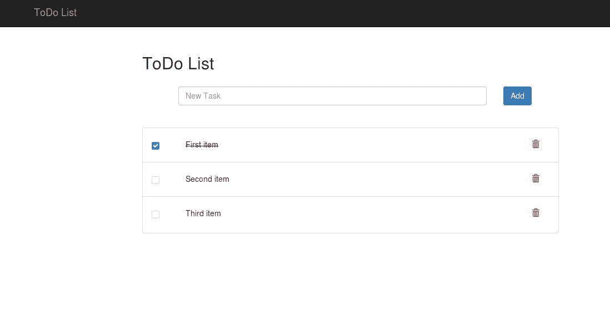
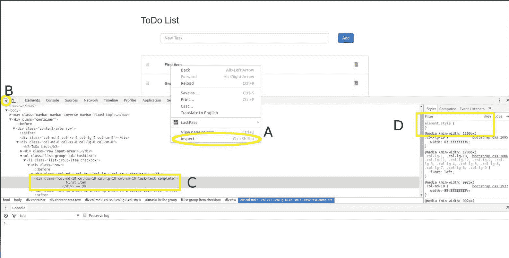

# 第一章：构建待办事项清单

```js
Hi there!
```

在本书中，我们将使用 JavaScript 构建一些非常有趣的应用程序。JavaScript 已经从在浏览器中用于表单验证的简单脚本语言发展为一种强大的编程语言，几乎在任何地方都有应用。请查看以下用例：

+   想要设置一个服务器来处理数百万请求和大量 I/O 操作？您可以使用 Node.js 的单线程非阻塞 I/O 模型轻松处理重负载。使用 Node.js 框架（如**Express**或**Sails**）在服务器上编写 JavaScript。

+   想要构建大规模的 Web 应用程序？现在是成为前端开发人员的激动人心的时刻，因为有很多新的 JavaScript 框架，如**React**、**Angular 2**、**Vue.js**等，可用于加快开发流程并轻松构建大规模应用程序。

+   想要构建移动应用程序？选择**React Native**或**NativeScript**，您可以使用 JavaScript 编写的单个代码库构建跨 iOS 和 Android 的真正本地移动应用程序。还不够？使用**PhoneGap**或**Ionic**简单地使用 HTML、CSS 和 JavaScript 创建移动应用程序。就像 Web 应用程序一样！

+   想要构建桌面应用程序？使用**Electron**使用 HTML、CSS 和 JavaScript 构建跨平台本地桌面应用程序。

+   JavaScript 在构建**虚拟现实**（**VR**）和**增强现实**（**AR**）应用程序中也扮演着重要角色。查看**React VR**、**A-Frame**用于构建 WebVR 体验以及**Argon.js**、**AR.js**用于向 Web 应用程序添加 AR。

JavaScript 也在迅速发展。随着**ECMAScript 2015**（**ES6**）的引入，语言中引入了许多新的功能，简化了开发人员的许多工作，为他们提供了以前只能使用 TypeScript 和 CoffeeScript 实现的功能。甚至在 JavaScript 的新规范（ES7 及更高版本）中还添加了更多功能。现在是成为 JavaScript 开发人员的激动人心的时刻，本书旨在建立坚实的基础，以便您将来可以适应前面提到的任何 JavaScript 平台/框架。

本章面向那些了解 HTML、CSS 和 JavaScript 基本概念，但尚未学习新主题（如 ES6、Node 等）的读者。本章将涵盖以下主题：

+   **文档对象模型**（**DOM**）操作和事件监听器

+   介绍 ES6 JavaScript 的实际用法

+   使用 Node 和 npm 进行前端开发

+   使用 Babel 将 ES6 转译为 ES5

+   使用 npm 脚本设置自动化开发服务器

如果您觉得对这些主题感到舒适，可以跳到下一章，我们将在那里处理一些高级工具和概念。

# 系统要求

JavaScript 是网络的语言。因此，您可以使用带有网络浏览器和文本编辑器的任何系统构建 Web 应用程序。但是，我们确实需要一些工具来构建现代复杂的 Web 应用程序。为了获得更好的开发体验，建议使用具有至少 4GB RAM 的 Linux 或 Windows 机器或 Mac 机器。在开始之前，您可能希望在系统中设置以下一些应用程序。

# 文本编辑器

首先，您需要一个友好的 JavaScript 文本编辑器。文本编辑器在编写代码时非常重要。根据它们提供的功能，您可以节省大量的开发时间。有一些非常好的文本编辑器支持多种语言。在本书中，我们将使用 JavaScript，因此我建议获取其中一个开源的 JavaScript 友好的文本编辑器：

+   Atom：[`atom.io`](http://atom.io)

+   Visual Studio Code：[`code.visualstudio.com`](https://code.visualstudio.com/)

+   Brackets：[`brackets.io/`](http://brackets.io/)

您也可以尝试 Sublime Text：[`www.sublimetext.com/`](https://www.sublimetext.com/)，这是一个很棒的文本编辑器，但与前面提到的不同，Sublime Text 是商业软件，您需要付费才能继续使用。还有另一个商业产品 WebStorm：[`www.jetbrains.com/webstorm/`](https://www.jetbrains.com/webstorm/)，它是一个专门为 JavaScript 打造的全功能**集成开发环境**（**IDE**）。它配备了各种用于调试和与 JavaScript 框架集成的工具。您可能想试试看。

我建议在本书的项目中使用**Visual Studio Code**（**VSCode**）。

# Node.js

这是本书中我们将一直使用的另一个重要工具，Node.js。Node.js 是建立在 Chrome 的 V8 引擎上的 JavaScript 运行时。它让您可以在浏览器之外运行 JavaScript。Node.js 变得非常流行，因为它让您可以在服务器上运行 JavaScript，并且由于其非阻塞 I/O 方法，它非常快速。

Node.js 的另一个优点是它有助于创建命令行工具，可用于各种用途，如自动化、代码脚手架等，本书中我们将使用其中许多。在撰写本书时，Node.js 的最新**长期支持**（**LTS**）版本是 6.10.2。我将在本书中一直使用这个版本。您可以在阅读本书时安装最新的 LTS 版本。

# 对于 Windows 用户

在 Windows 上安装非常简单；只需下载并安装最新的 LTS 版本：[`nodejs.org/en/`](https://nodejs.org/en/)。

# 对于 Linux 用户

最简单的方法是通过遵循提供的说明，通过软件包管理器安装最新的 LTS 版本：[`nodejs.org/en/download/package-manager/`](https://nodejs.org/en/download/package-manager/)。

# 对于 Mac 用户

使用 Homebrew 安装 Node.js：

+   从以下网址安装 Homebrew：[`brew.sh/`](https://brew.sh/)

+   在终端中运行以下命令：`brew install node`

安装了 Node.js 之后，在终端（Windows 用户的命令提示符）中运行`node -v`，以检查是否已正确安装。这应该会打印出您已安装的当前版本。

# 谷歌浏览器

最后，在您的系统中安装最新版本的谷歌浏览器：[`www.google.com/chrome/`](https://www.google.com/chrome/)。您可以使用 Firefox 或其他浏览器，但我将使用 Chrome，所以如果您使用 Chrome，跟随起来会更容易。

既然我们的系统中已经安装了所有必要的工具，让我们开始构建我们的第一个应用程序！

# 待办事项应用

让我们来看看我们即将构建的应用程序：



我们将构建这个简单的待办事项应用，它允许我们创建任务列表，标记已完成的任务，并从列表中删除任务。

让我们从本书的代码文件中使用第一章的起始代码开始。起始代码将包含三个文件：`index.html`、`scripts.js`和`styles.css`。在 Web 浏览器中打开`index.html`文件，以查看待办事项应用的基本设计，如前面的屏幕截图所示。

JavaScript 文件将是空的，我们将在其中编写脚本来创建应用程序。让我们来看看 HTML 文件。在`<head>`部分中，包含了对`styles.css`文件和 BootstrapCDN 的引用，在`<body>`标签的末尾，包括了 jQuery 和 Bootstrap 的 JS 文件以及我们的`scripts.js`文件：

+   Bootstrap 是一个 UI 开发框架，可以帮助我们更快地构建响应式 HTML 设计。Bootstrap 带有一组需要 jQuery 运行的 JavaScript 代码。

+   jQuery 是一个简化 DOM 遍历、DOM 操作、事件处理等 JavaScript 函数的 JavaScript 库。

Bootstrap 和 jQuery 通常一起用于构建 Web 应用程序。在本书中，我们将更多地专注于使用 JavaScript。因此，它们两者都不会被详细介绍。但是，你可以在 w3school 的网站上详细学习 Bootstrap：[`www.w3schools.com/bootstrap/default.asp`](https://www.w3schools.com/bootstrap/default.asp) 和 jQuery：[`www.w3schools.com/jquery/default.asp`](https://www.w3schools.com/jquery/default.asp)。

在我们的 HTML 文件中，最后包含的 CSS 文件中的样式将覆盖之前文件中的样式。因此，如果我们打算重写框架的默认 CSS 属性，最好的做法是在默认框架的 CSS 文件（在我们的情况下是 Bootstrap）之后包含我们自己的 CSS 文件。在本章中我们不需要担心 CSS，因为我们不打算编辑 Bootstrap 的默认样式。我们只需要专注于我们的 JS 文件。JavaScript 文件必须按照起始代码中给定的顺序包含：

```js
<script src="https://code.jquery.com/jquery-3.2.1.min.js"></script>
<script src="https://maxcdn.bootstrapcdn.com/bootstrap/3.3.7/js/bootstrap.min.js" integrity="sha384-Tc5IQib027qvyjSMfHjOMaLkfuWVxZxUPnCJA7l2mCWNIpG9mGCD8wGNIcPD7Txa" crossorigin="anonymous"></script>
<script src="scripts.js"></script>
```

我们首先包含 jQuery 代码，然后包含 Bootstrap JS 文件。这是因为 Bootstrap 的 JS 文件需要 jQuery 来运行。如果我们先包含 Bootstrap JS，它将在控制台中打印一个错误，说 Bootstrap 需要 jQuery 来运行。尝试将 Bootstrap 代码移动到 jQuery 代码上方，并打开浏览器的控制台。对于谷歌浏览器，在 Windows 或 Linux 上是*Ctrl*+*Shift*+*J*，在 Mac 上是*command*+*option*+*J*。你将收到类似于这样的错误：


因此，我们目前通过按正确的顺序包含 JS 文件来管理依赖关系。然而，在更大的项目中，这可能会非常困难。在下一章中，我们将看一种更好的方式来管理我们的 JS 文件。现在，让我们继续构建我们的应用程序。

我们的 HTML 文件的 body 部分分为两个部分：

+   导航栏

+   容器

通常我们使用导航栏来为我们的 Web 应用程序的不同部分添加链接。由于在这个应用程序中我们只处理单个页面，所以我们只会在导航栏中包含页面标题。

我已经在 HTML 元素中包含了许多类，比如`navbar`、`navbar-inverse`、`navbar-fixed-top`、`container`、`col-md-2`、`col-xs-2`等等。它们用于使用 Bootstrap 对元素进行样式设置。我们将在后面的章节中讨论它们。现在，让我们只专注于功能部分。

# Chrome DevTools

在 body 部分，我们有一个输入字段和一个按钮来添加新任务，以及一个无序列表来列出任务。无序列表将有一个复选框来标记任务已完成，以及一个删除图标来从列表中删除任务。你可能会注意到列表中的第一项使用删除线标记为已完成。如果你使用 Chrome DevTools 检查元素，你会注意到它有一个额外的类`complete`，它使用 CSS 在文本上添加了删除线，这在我们的`styles.css`文件中定义。

使用 Chrome DevTools 检查元素，右键单击该元素并选择检查。你也可以在 Windows 或 Linux 上点击*Ctrl*+*Shift*+*C*，或者在 Mac 上点击*command*+*shift*+*C*，然后将鼠标悬停在元素上以查看其详细信息。你也可以直接编辑元素的 HTML 或 CSS 以查看页面上的变化。从列表中的第一项的`div`中删除`complete`类。你会发现删除线已经消失了。在 DevTools 中直接进行的更改是临时的，在刷新页面时会被清除。查看以下图片，了解在 Chrome 中检查元素的工具列表：



+   **A**：右键单击检查元素

+   **B**：点击光标图标，通过将鼠标悬停在元素上选择不同的元素

+   **C**：直接编辑页面的 HTML

+   **D**：直接编辑与元素相关的 CSS

Chrome DevTools 的另一个不错的功能是，你可以在你的 JavaScript 代码中的任何地方写入`debugger`，Google Chrome 会在调用`debugger`的地方暂停脚本的执行。一旦执行暂停，你可以将光标悬停在源代码中的变量上，它会显示弹出窗口中包含的变量的值。你也可以在控制台选项卡中输入变量的名称来查看其值。

这是 Google Chrome 调试器的截图：


随意探索 Chrome 开发者工具的不同部分，以更多地了解它为开发人员提供的工具。

# 开始使用 ES6

现在你对开发者工具有了一个很好的了解，让我们开始编码部分。你应该已经熟悉了 JavaScript ES5 语法。因此，在本章中，让我们探索 JavaScript 的 ES6 语法。ES6（ECMAScript 2015）是 ECMAScript 语言规范的第六个主要版本。JavaScript 是 ECMAScript 语言规范的一种实现。

在撰写本书时，ES8 是 JavaScript 语言的最新版本。然而，为了简单和易于理解，本书仅关注 ES6。一旦掌握了 ES6 的知识，你可以轻松地在互联网上了解 ES7 及更高版本引入的最新功能。

在撰写本书时，所有现代浏览器都支持大部分 ES6 功能。然而，旧版浏览器不了解新的 JavaScript 语法，因此它们会抛出错误。为了解决这种向后兼容性问题，我们需要在部署应用程序之前将 ES6 代码转译为 ES5。让我们在本章末尾详细了解这一点。最新版本的 Chrome 支持 ES6；因此，现在我们将直接使用 ES6 语法创建我们的 ToDo List。

我将详细解释新的 ES6 语法。如果你在理解普通 JavaScript 语法和数据类型方面遇到困难，请参考以下 w3schools 页面中的相应部分：[`www.w3schools.com/js/default.asp.`](https://www.w3schools.com/js/default.asp)

在文本编辑器中打开`scripts.js`文件。首先，我们将创建一个包含我们的 ToDo List 应用程序方法的类，是的！在 ES6 中，类是 JavaScript 的一个新添加。使用类在 JavaScript 中创建对象很简单。它让我们将代码组织为模块。在脚本文件中创建一个名为`ToDoClass`的类，并刷新浏览器：

```js
class ToDoClass {
  constructor() {
    alert('Hello World!');
  }
}
window.addEventListener("load", function() {
  var toDo = new ToDoClass();
});
```

你的浏览器现在会弹出一个警报，显示“Hello World!”。这是代码的作用。首先，`window.addEventListener`将在窗口上附加一个事件监听器，并等待窗口完成加载所有所需的资源。一旦加载完成，将触发`load`事件，调用我们事件监听器的回调函数，初始化`ToDoClass`并将其赋值给变量`toDo`。在初始化`ToDoClass`时，它会自动调用构造函数，创建一个显示“Hello World!”的警报。我们可以进一步修改我们的代码以利用 ES6。在`window.addEventListener`部分，你可以将其重写为：

```js
let toDo;
window.addEventListener("load", () => {
  toDo = new ToDoClass();
});
```

首先，我们用新的箭头函数`() => {}`替换匿名回调函数`function () {}`。其次，我们用`let`而不是`var`定义变量。

# 箭头函数

箭头函数是在 JavaScript 中定义函数的更清晰和更简洁的方式，它们简单地继承其父级的`this`对象，而不是绑定自己的。我们很快会看到更多关于`this`绑定的内容。让我们先看看使用新语法。考虑以下函数：

```js
let a = function(x) {
}
let b = function(x, y) {
}
```

等效的箭头函数可以写成：

```js
let a = x => {}
let b = (x,y) => {}
```

你可以看到，当我们必须将唯一的单个参数传递给函数时，`()`是可选的。

有时，我们在函数中只需在一行中返回一个值，例如：

```js
let sum = function(x, y) {
  return x + y;
}
```

如果我们想在箭头函数中直接在一行中返回一个值，我们可以直接忽略`return`关键字和`{}`花括号，并将其写为：

```js
let sum = (x, y) => x+y;
```

就是这样！它将自动返回`x`和`y`的和。但是，这只能在您想要立即在一行中返回值时使用。

# let、var 和 const

接下来，我们有`let`关键字。ES6 有两个用于声明变量的新关键字，`let`和`const`。使用它们声明的变量的作用域有所不同。使用`var`声明的变量的作用域在定义它的函数内部，并且如果没有在任何函数内部定义，则为全局，而`let`的作用域仅限于声明它的封闭块内，并且如果没有在任何封闭块内定义，则为全局。看看以下代码：

```js
var toDo;
window.addEventListener("load", () => {
  var toDo = new ToDoClass();
});
```

如果您在代码中的其他地方意外重新声明`toDo`，如下所示，您的类对象将被覆盖：

```js
var toDo = "some value";
```

这种行为对于大型应用程序来说很令人困惑，也很难维护变量。因此，在 ES6 中引入了`let`。它只限制了变量的作用域在声明它的封闭块内。在 ES6 中，鼓励使用`let`而不是`var`来声明变量。看看以下代码：

```js
let toDo;
window.addEventListener("load", () => {
 toDo = new ToDoClass();
});
```

现在，即使您在代码的其他地方意外重新声明`toDo`，JavaScript 也会抛出错误，使您免受运行时异常。封闭块是两个花括号`{}`之间的代码块，花括号可能属于函数，也可能不属于函数。

我们需要一个`toDo`变量在整个应用程序中都可以访问。因此，我们在事件侦听器上方声明`toDo`，并在回调函数内将其分配给类对象。这样，`toDo`变量将在整个页面中都可以访问。

`let`非常有用于定义`for`循环中的变量。您可以创建一个`for`循环，例如`for(let i=0; i<3; i++) {}`，并且变量`i`的作用域将仅在`for`循环内。您可以轻松地在代码的其他地方使用相同的变量名。

让我们来看看另一个关键字`const`。`const`的工作方式与`let`相同，只是使用`const`声明的变量不能更改（重新分配）。因此，`const`用于常量。但是，整个常量不能被重新分配，但它们的属性可以被更改。例如：

```js
const a = 5;
a = 7; // this will not work
const b = {
  a: 1,
  b: 2
};
b = { a: 2, b: 2 }; // this will not work
b.a = 2; // this will work since only a property of b is changed
```

在 ES6 中编写代码时，始终使用`const`来声明变量。只有在需要对变量进行任何更改（重新分配）时才使用`let`，完全避免使用`var`。

`toDo`对象包含类变量和函数作为对象的属性和方法。如果您需要了解 JavaScript 中对象的结构，请参阅：[`www.w3schools.com/js/js_objects.asp`](https://www.w3schools.com/js/js_objects.asp)。

# 从数据加载任务

我们应用程序中要做的第一件事是从一组数据动态加载任务。让我们声明一个包含任务数据以及预填充任务所需方法的类变量。ES6 没有直接提供声明类变量的方法。我们需要使用构造函数声明变量。我们还需要一个函数将任务加载到 HTML 元素中。因此，我们将创建一个`loadTasks()`方法：

```js
class ToDoClass {
  constructor() {
    this.tasks = [
        {task: 'Go to Dentist', isComplete: false},
         {task: 'Do Gardening', isComplete: true},
         {task: 'Renew Library Account', isComplete: false},
    ];
    this.loadTasks();
  }

  loadTasks() {
  }
}
```

`tasks`变量在构造函数内部声明为`this.tasks`，这意味着 tasks 变量属于`this`（`ToDoClass`）。该变量是一个包含任务详情和完成状态的对象数组。第二个任务被设置为已完成。现在，我们需要为数据生成 HTML 代码。我们将重用 HTML 中`<li>`元素的代码来动态生成任务：

```js
  <li class="list-group-item checkbox">
  <div class="row">
    <div class="col-md-1 col-xs-1 col-lg-1 col-sm-1 checkbox">
     <label><input type="checkbox" value="" class="" checked></label>
    </div>
    <div class="col-md-10 col-xs-10 col-lg-10 col-sm-10 task-text complete">
      First item
    </div>
     <div class="col-md-1 col-xs-1 col-lg-1 col-sm-1 delete-icon-area">
      <a class="" href="/"><i class="delete-icon glyphicon glyphicon-trash"></i></a>
     </div>
   </div>
 </li>
```

在 JavaScript 中，类的实例被称为类对象或简单对象。类对象的结构类似于 JSON 对象中的键值对。与类对象关联的函数称为其方法，与类对象关联的变量/值称为其属性。

# 模板文字

传统上，在 JavaScript 中，我们使用`+`运算符来连接字符串。然而，如果我们想要连接多行字符串，那么我们必须使用转义码`\`来转义换行，例如：

```js
let a = '<div> \
    <li>' + myVariable+ '</li> \
</div>'
```

当我们必须编写包含大量 HTML 的字符串时，这可能会非常令人困惑。在这种情况下，我们可以使用 ES6 模板字符串。模板字符串是用反引号`` ``而不是单引号`' '`括起来的字符串。通过使用这种方式，我们可以更轻松地创建多行字符串：

```js
let a = `
<div>
   <li> ${myVariable} </li>
</div>
`
```

正如你所看到的，我们可以以类似的方式创建 DOM 元素；我们在 HTML 中输入它们，而不用担心空格或多行。因为模板字符串中存在的任何格式，例如制表符或换行符，都直接记录在变量中。我们可以使用`${}`在字符串中声明变量。因此，在我们的情况下，我们需要为每个任务生成一个项目列表。首先，我们将创建一个函数来循环遍历数组并生成 HTML。在我们的`loadTasks()`方法中，编写以下代码：

```js
loadTasks() {
  let tasksHtml = this.tasks.reduce((html, task, index) => html +=  
  this.generateTaskHtml(task, index), '');
  document.getElementById('taskList').innerHTML = tasksHtml;
 }
```

之后，在`ToDoClass`内部创建一个`generateTaskHtml()`函数，代码如下：

```js
generateTaskHtml(task, index) {
 return `
  <li class="list-group-item checkbox">
   <div class="row">
    <div class="col-md-1 col-xs-1 col-lg-1 col-sm-1 checkbox">
     <label><input id="toggleTaskStatus" type="checkbox"  
     onchange="toDo.toggleTaskStatus(${index})" value="" class="" 
     ${task.isComplete?'checked':''}></label>
    </div>
    <div class="col-md-10 col-xs-10 col-lg-10 col-sm-10 task-text ${task.isComplete?'complete':''}">
     ${task.task}
   </div>
   <div class="col-md-1 col-xs-1 col-lg-1 col-sm-1 delete-icon-area">
     <a class="" href="/" onClick="toDo.deleteTask(event, ${index})"><i 
     id="deleteTask" data-id="${index}" class="delete-icon glyphicon 
     glyphicon-trash"></i></a>
    </div>
   </div>
  </li>
`;
}
```

现在，刷新页面，哇！我们的应用程序已经加载了来自`tasks`变量的任务。一开始可能看起来像是很多代码，但让我们逐行来看。

如果刷新页面时更改没有反映出来，那是因为 Chrome 已经缓存了 JavaScript 文件，并且没有检索到最新的文件。要使其检索最新的代码，您需要通过在 Windows 或 Linux 上按下*Ctrl*+*Shift*+*R*，或在 Mac 上按下*command*+*Shift*+*R*来进行强制重新加载。

在`loadTasks()`函数中，我们声明一个名为`tasksHtml`的变量，其值是由`tasks`变量的数组`reduce()`方法的回调函数返回的。JavaScript 中的每个数组对象都有一些与之关联的方法。`reduce`是 JS 数组的一种方法，它将一个函数应用于数组的每个元素，从左到右应用值到累加器，以便将数组减少为单个值，然后返回该最终值。`reduce`方法接受两个参数；第一个是应用于数组每个元素的回调函数，第二个是累加器的初始值。让我们看看我们的函数在普通的 ES5 语法中是什么样子的：

```js
let tasksHtml = this.tasks.reduce(function(html, task, index, tasks) { 
  return html += this.generateTaskHtml(task, index)
}.bind(this), '');
```

+   第一个参数是回调函数，它的四个参数是`html`，这是我们的累加器，`task`，这是任务数组中的一个元素，索引，它给出了迭代中数组元素的当前索引，以及`tasks`，它包含了 reduce 方法应用的整个数组（对于我们的用例，我们不需要在回调函数中使用整个数组，所以忽略了第四个参数）。

+   第二个参数是可选的，包含累加器的初始值。在我们的情况下，初始 HTML 字符串是一个空字符串`''`。

+   另外，请注意我们必须使用`bind`将回调函数与`this`（即我们的类）对象绑定在一起，以便在回调函数中可以访问`ToDoClass`的方法和变量。这是因为，否则，每个函数都将定义自己的`this`对象，并且父级的`this`对象将无法在该函数内部访问。

回调函数的作用是首先取空的`html`字符串（累加器），然后将其与`ToDoClass`的`generateTaskHtml()`方法返回的值连接起来，该方法的参数是数组的第一个元素及其索引。返回的值当然应该是一个字符串，否则会抛出错误。然后，它对数组的每个元素重复执行操作，累加器的更新值最终在迭代结束时返回。最终的减少值包含作为字符串填充任务的整个 HTML 代码。

通过应用 ES6 箭头函数，整个操作可以在一行中完成：

```js
let tasksHtml = this.tasks.reduce((html, task, index) => html += this.generateTaskHtml(task, index), '');
```

这不是很简单吗！由于我们只是在一行中返回值，我们可以忽略`{}`大括号和`return`关键字。此外，箭头函数不定义自己的`this`对象；它们只是继承其父级的`this`对象。因此，我们也可以忽略`.bind(this)`方法。现在，我们使用箭头函数使我们的代码更清晰，更容易理解。

在我们继续`loadTasks()`方法的下一行之前，让我们看一下`generateTaskHtml()`方法的工作原理。这个函数接受两个参数--任务数据中的数组元素任务和它的索引，并返回一个包含用于填充任务的 HTML 代码的字符串。请注意，我们在代码中包含了复选框的变量：

```js
<input id="toggleTaskStatus" type="checkbox" onchange="toDo.toggleTaskStatus(${index})" value="" class="" ${task.isComplete?'checked':''}>
```

它说“在复选框状态改变时”，调用`toDo`对象的`toggleTaskStatus()`方法，参数是被改变的任务的索引。我们还没有定义`toggleTaskStatus()`方法，所以当您现在在网站上点击复选框时，它会在 Chrome 的控制台中抛出错误，并且在浏览器窗口中没有任何特殊的情况发生。此外，我们添加了一个条件运算符`()?:`，如果任务状态已完成，则返回输入标签的已选属性。如果任务已经完成，这对于渲染带有预选复选框的列表非常有用。

同样，我们在包含任务文本的`div`中包含了`${task.isComplete?'complete':''}`，这样如果任务已完成，任务就会添加一个额外的类，而且在`styles.css`文件中为该类编写了 CSS，以在文本上渲染删除线。

最后，在锚点标签中，我们包含了`onClick="toDo.deleteTask(event, ${index})"`来调用`toDo`对象的`deleteTask()`方法，参数是点击事件本身和任务的索引。我们还没有定义`deleteTask()`方法，所以点击删除图标会将您带到文件系统的根目录！

`onclick`和`onchange`是一些 HTML 属性，用于在父元素上发生指定事件时调用 JavaScript 函数。由于这些属性属于 HTML，它们不区分大小写。

现在，让我们看一下`loadTasks()`方法的第二行：

```js
document.getElementById('taskList').innerHTML = tasksHtml;
```

我们刚刚用新生成的字符串`tasksHTML`替换了具有 ID`taskList`的 DOM 元素的 HTML 代码。现在，待办事项列表已经填充。是时候定义`toDo`对象的两个新方法了，这些方法包含在我们生成的 HTML 代码中。

# 管理任务状态

在`ToDoClass`中，包括两个新方法：

```js
 toggleTaskStatus(index) {
  this.tasks[index].isComplete = !this.tasks[index].isComplete;
   this.loadTasks();
 }
 deleteTask(event, taskIndex) {
   event.preventDefault();
   this.tasks.splice(taskIndex, 1);
   this.loadTasks();
 }
```

第一个方法`toggleTaskStatus()`用于标记任务为已完成或未完成。当复选框被点击（`onChange`）时，会调用该方法，并将被点击的任务的索引作为参数：

+   使用任务的索引，我们将任务的`isComplete`状态分配为其当前状态的否定，而不使用`(!)`运算符。因此，可以在此函数中切换任务的完成状态。

+   一旦`tasks`变量使用新数据更新，就会调用`this.loadTasks()`来重新渲染所有任务的更新值。

第二种方法`deleteTask()`用于从列表中删除任务。当前，单击删除图标将带您转到文件系统的根目录。但是，在将您导航到文件系统的根目录之前，将使用单击`event`和任务的`index`作为参数调用`toDo.deleteTask()`：

+   第一个参数`event`包含关于刚刚发生的点击事件的各种属性和方法的整个事件对象（在`deleteTask()`函数内尝试`console.log(event)`以查看 Chrome 控制台中包含的所有详细信息）。

+   为了防止任何默认操作（打开 URL）在单击删除图标（`<a>`标签）后发生，我们需要指定`event.preventDefault()`。

+   然后，我们需要从`tasks`变量中删除已删除的数组的任务元素。为此，我们使用`splice()`方法，该方法从指定的索引处删除数组中指定数量的元素。在我们的情况下，从需要删除的任务的索引处仅删除一个元素。这将从`tasks`变量中删除要删除的任务。

+   调用`this.loadTasks()`以重新呈现所有具有更新值的任务。

刷新页面（*如果需要，进行硬刷新*）以查看我们的当前应用程序如何使用新代码。您现在可以将任务标记为已完成，并且可以从列表中删除任务。

# 向列表添加新任务

现在我们有了切换任务状态和删除任务的选项。但是我们需要向列表中添加更多任务。为此，我们需要使用 HTML 文件中提供的文本框，以允许用户输入新任务。第一步将是向添加任务的`<button>`添加`onclick`属性：

```js
<button class="btn btn-primary" onclick="toDo.addTaskClick()">Add</button>
```

现在，每次单击按钮都将调用`toDo`对象的`addTaskClick()`方法，该对象尚未定义。因此，让我们在`ToDoClass`内定义它：

```js
addTaskClick() {
  let target = document.getElementById('addTask');
  this.addTask(target.value);
  target.value = ""
}
addTask(task) {
  let newTask = {
   task,
   isComplete: false,
  };
  let parentDiv = document.getElementById('addTask').parentElement;
  if(task === '') {
   parentDiv.classList.add('has-error');
  } else {
   parentDiv.classList.remove('has-error');
   this.tasks.push(newTask);
   this.loadTasks();
  }
}
```

重新加载 Chrome 并尝试通过单击“添加”按钮添加新任务。如果一切正常，您应该看到新任务被追加到列表中。此外，当您单击“添加”按钮而不在输入字段中键入任何内容时，它将使用红色边框突出显示输入字段，指示用户应在输入字段中输入文本。

看看我是如何将我们的添加任务操作分成两个函数的？我对`loadTask()`函数也做了类似的事情。在编程中，最佳实践是将所有任务组织成更小、更通用的函数，这将允许您在将来重用这些函数。

让我们看看`addTaskClick()`方法是如何工作的：

+   `addTaskClick()`函数没有任何请求参数。首先，为了读取新任务的文本，我们获取 ID 为`addTask`的`<input>`元素，其中包含任务所需的文本。使用`document.getElementById('addTask')`，并将其分配给`target`变量。现在，`target`变量包含`<input>`元素的所有属性和方法，可以读取和修改（尝试`console.log(target)`以查看变量中包含的所有详细信息）。

+   `value`属性包含所需的文本。因此，我们将`target.value`传递给`addTask()`函数，该函数负责将新任务添加到列表中。

+   最后，我们通过将`target.value`设置为空字符串`''`来将输入字段重置为空状态。

这是点击事件的事件处理部分。让我们看看任务如何在`addTask()`方法中追加到列表中。`task`变量包含新任务的文本：

+   理想情况下，此函数的第一步是构造定义我们任务的 JSON 数据：

```js
let newTask = {
  task: task,
  isComplete: false
}
```

+   这里是另一个 ES6 特性对象文字属性值简写；在我们的 JSON 对象中，我们可以简单地写`{task}`而不是`{task: task}`。变量名将成为键，存储在变量中的值将成为值。如果变量未定义，这将引发错误。

+   我们还需要创建另一个变量`parentDiv`来存储目标`<input>`元素的父`<div>`元素的对象。这很有用，因为当任务为空字符串时，我们可以向父元素`parentDiv.classList.add('has-error')`添加`has-error`类，这样通过 Bootstrap 的 CSS，就会在我们的`<input>`元素上呈现红色边框。这就是我们如何告诉用户他们需要在单击添加按钮之前输入文本的方式。

+   然而，如果输入文本不为空，我们应该从父元素中删除`has-error`类，以确保红色边框不会显示给用户，然后简单地将我们的`newTask`变量推送到我们类的`tasks`变量中。此外，我们需要再次调用`loadTasks()`，以便新任务得到渲染。

# 通过按 Enter 键添加任务

这是一种添加任务的方式，但是一些用户更喜欢直接按下*Enter*按钮来添加任务。为此，让我们使用事件监听器来检测`<input>`元素中的*Enter*键按下。我们也可以使用我们的`<input>`元素的`onchange`属性，但让我们尝试一下事件监听器。向类添加事件监听器的最佳方式是在构造函数中调用它们，以便在初始化类时设置事件监听器。

因此，在我们的类中，创建一个新的函数`addEventListeners()`并在我们的构造函数中调用它。我们将在此函数内添加事件监听器：

```js
constructor() {
  ...
  this.addEventListeners();
}
 addEventListeners() {
  document.getElementById('addTask').addEventListener('keypress', event => {
     if(event.keyCode === 13) {
       this.addTask(event.target.value);
       event.target.value = '';
     }
   });
 }
```

就是这样！重新加载 Chrome，输入文本，然后按*Enter*。这应该像添加按钮一样将任务添加到我们的列表中。让我们来看看我们的新事件监听器：

+   对于发生在具有 ID`addTask`的`<input>`元素中的每个按键按下，我们运行回调函数，参数为`event`对象。

+   此事件对象包含按下的键的键码。对于*Enter*键，键码为 13。如果键码等于 13，我们只需调用`this.addTask()`函数，参数为任务的文本`event.target.value`。

+   现在，`addTask()`函数处理将任务添加到列表中。我们可以简单地将`<input>`重置为空字符串。这是将每个操作组织成函数的一个很大的优势。我们可以在需要的地方简单地重用这些函数。

# 在浏览器中持久保存数据

现在，就功能而言，我们的待办事项列表已经准备好了。但是，刷新页面后，数据将会丢失。让我们看看如何在浏览器中持久保存数据。通常，Web 应用程序会与服务器端的 API 连接，以动态加载数据。在这里，我们不会研究服务器端的实现。因此，我们需要寻找一种在浏览器中存储数据的替代方式。在浏览器中有三种存储数据的方式。它们如下：

+   `cookie`：`cookie`是由服务器存储在客户端（浏览器）上的小信息，带有到期日期。它对于从客户端读取信息非常有用，例如登录令牌、用户偏好等。Cookie 主要用于服务器端，可以存储在 cookie 中的数据量限制为 4093 字节。在 JavaScript 中，可以使用`document.cookie`对象来管理 cookie。

+   `localStorage`：HTML5 的`localStorage`存储信息没有到期日期，数据将在关闭和打开网页后仍然存在。它为每个域提供 5MB 的存储空间。

+   `sessionStorage`：`sessionStorage`与`localStorage`相当，只是数据仅在会话期间有效（用户正在使用的当前选项卡）。当网站关闭时，数据将过期。

对于我们的用例，`localStorage`是持久化任务数据的最佳选择。`localStorage`将数据存储为键值对，而值需要是一个字符串。让我们来看看实现部分。在构造函数中，不要直接将值分配给`this.tasks`，而是更改为以下内容：

```js
constructor() {
  this.tasks = JSON.parse(localStorage.getItem('TASKS'));
   if(!this.tasks) {
    this.tasks = [
       {task: 'Go to Dentist', isComplete: false},
       {task: 'Do Gardening', isComplete: true},
       {task: 'Renew Library Account', isComplete: false},
    ];
  } 
... 
}
```

我们将把任务保存在`localStorage`中，以字符串形式存储，其键为`'TASKS'`。因此，当用户第一次打开网站时，我们需要检查`localStorage`中是否存在以`'TASKS'`为键的数据。如果没有数据，它将返回`null`，这意味着这是用户第一次访问网站。我们需要使用`JSON.parse()`将从`localStorage`中检索到的数据从字符串转换为对象：

+   如果`localStorage`中没有数据（用户第一次访问网站），我们将使用`tasks`变量为他们预填一些数据。将代码添加到我们应用程序中持久保存任务数据的最佳位置将是`loadTasks()`函数，因为每次对`tasks`进行更改时都会调用它。在`loadTasks()`函数中，添加一行额外的代码：

```js
 localStorage.setItem('TASKS', JSON.stringify(this.tasks));
```

+   这将把我们的`tasks`变量转换为字符串并存储在`localStorage`中。现在，您可以添加任务并刷新页面，数据将在您的浏览器中持久保存。

+   如果您想出于开发目的清空`localStorage`，可以使用`localStorage.removeItem('TASKS')`来删除键，或者可以使用`localStorage.clear()`来完全删除`localStorage`中存储的所有数据。

JavaScript 中的所有内容都有固有的布尔值，可以称为真值或假值。以下值始终为假值-`null`、`""`（空字符串）、`false`、`0`（零）、`NaN`（不是数字）和`undefined`。其他值被视为真值。因此，它们可以直接用于条件语句，就像我们在代码中使用`if(!this.tasks) {}`一样。

现在我们的应用程序已经完成，您可以删除`index.html`文件中`<ul>`元素的内容。内容现在将直接从我们的 JavaScript 代码中填充。否则，当页面加载或刷新时，您将看到默认的 HTML 代码在页面中闪烁。这是因为我们的 JavaScript 代码只有在所有资源加载完成后才会执行，这是由以下代码造成的：

```js
window.addEventListener("load", function() {
  toDo = new ToDoClass();
});
```

如果一切正常，那么恭喜您！您已成功构建了您的第一个 JavaScript 应用程序，并了解了 JavaScript 的新 ES6 功能。哦等等！看起来我们忘记了一些重要的东西！

所有在这里讨论的存储选项都是未加密的，因此不应该用于存储敏感信息，比如密码、API 密钥、认证令牌等。

# 与旧浏览器的兼容性

虽然 ES6 可以在几乎所有现代浏览器中使用，但仍然有许多用户使用较旧版本的 Internet Explorer 或 Firefox。那么，我们要如何让我们的应用程序对他们起作用呢？ES6 的好处在于，它的所有新功能都可以使用 ES5 规范来实现。这意味着我们可以轻松地将我们的代码转译为 ES5，在所有现代浏览器上都可以运行。为此，我们将使用 Babel：[`babeljs.io/`](https://babeljs.io/)，作为将 ES6 转换为 ES5 的编译器。

还记得我们在本章的开头在系统中安装 Node.js 吗？现在终于可以使用它了。在我们开始将代码编译为 ES5 之前，我们需要了解 Node 和 npm。

# Node.js 和 npm

Node.js 是建立在 Chrome 的 V8 引擎上的 JavaScript 运行时。它允许开发人员在浏览器之外运行 JavaScript。由于 Node.js 的非阻塞 I/O 模型，它被广泛用于构建数据密集型的实时应用程序。您可以使用它来构建 JavaScript 的 Web 应用程序后端，就像 PHP、Ruby 或其他服务器端语言一样。

Node.js 的一个很大的优势是它允许你将代码组织成模块。模块是用于执行特定功能的一组代码。到目前为止，我们在浏览器的`<script>`标签中一个接一个地包含 JavaScript 代码。但是在 Node.js 中，我们可以通过创建对模块的引用来在代码中简单地调用依赖项。例如，如果我们需要 jQuery，我们可以简单地写如下代码：

```js
const $ = require('jquery');
```

或者，我们可以写如下内容：

```js
import $ from 'jquery';
```

jQuery 模块将被包含在我们的代码中。jQuery 的所有属性和方法将在`$`对象内部可访问。`$`的范围将仅限于调用它的文件。因此，在每个文件中，我们可以单独指定依赖项，并且在编译期间它们将被捆绑在一起。

但等等！为了包含`jquery`，我们需要下载包含所需模块的`jquery`包并将其保存在一个文件夹中。然后，我们需要将`$`分配给包含模块的文件夹中的文件的引用。随着项目的增长，我们将添加许多软件包并在我们的代码中引用这些模块。那么，我们将如何管理所有这些软件包。好吧，我们有一个随 Node.js 一起安装的小工具，叫做**Node Package Manager**（**npm**）：

+   对于 Linux 和 Mac 用户，npm 类似于这些之一：`apt-get`、`yum`、`dnf`和`Homebrew`。

+   对于 Windows 用户，您可能还不熟悉软件包管理的概念。所以，假设您需要 jQuery。但是您不知道 jQuery 运行所需的依赖关系。这就是软件包管理器发挥作用的地方。您可以简单地运行一个命令来安装一个包（`npm install jquery`）。软件包管理器将读取目标软件包的所有依赖项，并安装目标及其依赖项。它还管理一个文件以跟踪已安装的软件包。这用于将来轻松卸载软件包。

尽管 Node.js 允许直接将模块导入/导入到代码中，但浏览器不支持直接导入模块的 require 或 import 功能。但是有许多可用的工具可以轻松模仿这种功能，以便我们可以在浏览器中使用 import/require。我们将在下一章中为我们的项目使用它们。

npm 维护一个`package.json`文件，用于存储有关软件包的信息，例如其名称、脚本、依赖项、开发依赖项、存储库、作者、许可证等。软件包是一个包含一个或多个文件夹或文件的文件夹，其根文件夹中有一个`package.json`文件。npm 中有成千上万的开源软件包可用。访问[`www.npmjs.com/`](https://www.npmjs.com/)来探索可用的软件包。这些软件包可以是用于服务器端或浏览器端的模块，也可以是用于执行各种操作的命令行工具。

npm 软件包可以在本地（每个项目）或全局（整个系统）安装。我们可以使用不同的标志来指定我们想要如何安装它，如下所示：

+   如果我们想要全局安装一个包，我们应该使用`--global`或`-g`标志。

+   如果软件包应该在本地为特定项目安装，请使用`--save`或`-S`标志。

+   如果软件包应该在本地安装，并且仅用于开发目的，请使用`--save-dev`或`-D`标志。

+   如果您运行`npm install <package-name>`而没有任何标志，它将在本地安装软件包，但不会更新`package.json`文件。不建议在没有`-S`或`-D`标志的情况下安装软件包。

让我们使用 npm 安装一个命令行工具叫做`http-server`：[`www.npmjs.com/package/http-server`](https://www.npmjs.com/package/http-server)。这是一个简单的工具，可以用来像 Apache 或 Nginx 一样通过`http-server`提供静态文件。这对于测试和开发我们的 Web 应用程序非常有用，因为我们可以看到我们的应用程序在通过 Web 服务器提供时的行为。

如果命令行工具只会被我们自己使用，而不会被任何其他开发人员使用，那么通常建议全局安装。在我们的情况下，我们只会使用`http-server`包。所以，让我们全局安装它。打开你的终端/命令提示符并运行以下命令：

```js
npm install -g http-server
```

如果您使用的是 Linux，有时可能会遇到权限被拒绝或无法访问文件等错误。尝试以管理员身份运行相同的命令（前面加上`sudo`）以全局安装该软件包。

一旦安装完成，就在终端中导航到我们的待办事项列表应用程序的根文件夹，并运行以下命令：

```js
http-server
```

您将收到两个 URL，并且服务器将开始运行，如下所示：

+   要在本地设备上查看待办事项列表应用程序，请在浏览器中打开以`127`开头的 URL

+   要在连接到您本地网络的其他设备上查看待办事项列表应用程序，请在设备的浏览器中打开以`192`开头的 URL

每次打开应用程序时，`http-server`都会在终端中打印已提供的文件。`http-server`有各种选项可用，例如`-p`标志，可用于更改默认端口号`8080`（尝试`http-server -p 8085`）。访问 http-server:[`www.npmjs.com/package/http-server`](https://www.npmjs.com/package/http-server)，npm 页面以获取所有可用选项的文档。现在我们对`npm`包有了一个大致的了解，让我们安装 Babel 将我们的 ES6 代码转译为 ES5。

我们将在接下来的章节中经常使用终端。如果您使用的是 VSCode，它有一个内置的终端，可以通过在 Mac、Linux 和 Windows 上按*Ctrl*+*`*来打开。它还支持同时打开多个终端会话。这可以节省您在窗口之间切换的时间。

# 使用 Node 和 Babel 设置我们的开发环境

Babel 是一个 JavaScript 编译器，用于将 JavaScript 代码从 ES6+转译为普通的 ES5 规范。让我们在项目中设置 Babel，以便它自动编译我们的代码。

在设置 Babel 后，我们的项目中将有两个不同的 JS 文件。一个是 ES6，我们用来开发我们的应用程序，另一个是编译后的 ES5 代码，将被浏览器使用。因此，我们需要在项目的根目录中创建两个不同的文件夹，即`src`和`dist`。将`scripts.js`文件移动到`src`目录中。我们将使用 Babel 来编译`src`目录中的脚本，并将结果存储在`dist`目录中。因此，在`index.html`中，将`scripts.js`的引用更改为`<script src="dist/scripts.js"></script>`，以便浏览器始终读取编译后的代码：

1.  要使用 npm，我们需要在项目的根目录中创建`package.json`。在终端中导航到项目的根目录，并键入：

```js
npm init
```

1.  首先，它会询问您的项目名称，请输入名称。对于其他问题，要么输入一些值，要么只需按*Enter*接受默认值。这些值将填充到`package.json`文件中，稍后可以更改。

1.  通过在终端中运行以下命令来安装我们的开发依赖项：

```js
npm install -D http-server babel-cli babel-preset-es2015 concurrently
```

1.  此命令将创建一个`node_modules`文件夹，并在其中安装包。现在，您的`package.json`文件将在其`devDependencies`参数中具有前述包，并且您当前的文件夹结构应如下所示：

```js
.
├── dist
├── index.html
├── node_modules
├── package.json
├── src
└── styles.css
```

如果您在项目中使用 git 或任何其他版本控制系统，请将`node_modules`和`dist`文件夹添加到`.gitignore`或类似的文件中。这些文件夹不需要提交到版本控制，并且在需要时必须生成。

是时候编写脚本来编译我们的代码了。在`package.json`文件中，将有一个名为`scripts`的参数。默认情况下，它将是以下内容：

```js
 "scripts": {
   "test": "echo \"Error: no test specified\" && exit 1"
 },
```

`test`是 npm 的默认命令之一。当您在终端中运行`npm test`时，它将自动在终端中执行 test 键值内的脚本。顾名思义，`test`用于执行自动化测试用例。其他一些默认命令包括`start`、`stop`、`restart`、`shrinkwrap`等。这些命令在使用 Node.js 开发服务器端应用程序时非常有用。

然而，在前端开发过程中，我们可能需要更多的命令，像默认的命令一样。`npm`也允许我们创建自己的命令来执行任意脚本。但是，与默认命令（如`npm start`）不同，我们不能通过运行`npm <command-name>`来执行我们自己的命令；我们必须在终端中执行`npm run <command-name>`。

我们将设置 npm 脚本，这样运行`npm run build`将会生成一个包含编译后的 ES5 代码的应用程序工作构建，运行`npm run watch`将会启动一个开发服务器，我们将用于开发。

将脚本部分的内容更改为以下内容：

```js
"scripts": {
  "watch": "babel src -d dist --presets=es2015 -ws",
  "build": "rm -rf dist && babel src -d dist --presets=es2015",
  "serve": "http-server"
},
```

好吧，看起来有很多脚本！让我们逐个查看它们。

首先，让我们来看看`watch`脚本：

+   这个脚本的功能是启动`babel`进入监视模式，这样每当我们在`src`目录中的 ES6 代码中进行任何更改时，它都会自动转译为`dist`目录中的 ES5 代码，同时生成源映射，这对于调试编译后的代码非常有用。监视模式将在终端中持续进行，直到执行被终止（按下*Ctrl*+*C*）。

+   在终端中从项目的根目录执行`npm run watch`。你会看到 Babel 已经开始编译代码，并且一个新的`scripts.js`文件将被创建在`dist`文件夹中。

+   `scripts.js`文件将包含我们的代码以 ES5 格式。在 Chrome 中打开`index.html`，你应该能看到我们的应用程序正常运行。

它的工作原理是这样的。尝试直接在终端中运行`babel src -d dist --presets=es2015 -ws`。它会抛出一个错误，说`babel`未安装（错误消息可能因操作系统而异）。这是因为我们还没有全局安装 Babel。我们只在项目中安装了它。所以，当我们运行`npm run watch`时，npm 将在项目的`node_modules`文件夹中查找 Babel 的二进制文件，并使用这些二进制文件执行命令。

删除`dist`目录，并在`package.json`中创建一个新的脚本--`"babel": "babel src -d dist"`。我们将使用这个脚本来学习 Babel 的工作原理。

+   这个脚本告诉 Babel*编译`src`目录中的所有 JS 文件，并将生成的文件保存在*`dist`*目录中*。如果`dist`目录不存在，它将被创建。这里，使用`-d`标志告诉 Babel 需要编译整个目录中的文件。

+   在终端中运行`npm run babel`，并打开`dist`目录中的新`scripts.js`文件。好吧，文件已经编译了，但不幸的是，结果也是 ES6 语法，所以新的`scripts.js`文件是我们原始文件的精确副本！

+   我们的目标是将我们的代码编译为 ES5。为此，我们需要在编译过程中指示 Babel 使用一些预设。看看我们的`npm install`命令，我们已经安装了一个名为`babel-preset-es2015`的包来实现这个目的。

+   在我们的 Babel 脚本中，添加选项`--presets=es2015`，然后再次执行`npm run babel`。这次代码将被编译为 ES5 语法。

+   在浏览器中打开我们的应用程序，在构造函数中添加`debugger`，然后重新加载。我们有一个新问题；源代码现在将包含 ES5 语法的代码，这使得调试我们的原始代码变得更加困难。

+   为此，我们需要使用`-s`标志启用源映射，它会创建一个`.map`文件，用于将编译后的代码映射回原始源代码。还要使用`-w`标志将 Babel 置于监视模式。

现在我们的脚本将与`watch`命令中使用的脚本相同。使用调试器重新加载应用程序，你会看到源代码将包含我们的原始代码，即使它使用的是编译后的源代码。

如果运行单个命令也可以启动我们的开发服务器，那不是很好吗？我们不能使用`&&`来连接两个同时运行的命令。因为`&&`将在第一个命令完成后才执行第二个命令。

我们为此安装了另一个名为`concurrently`的包。它用于同时执行多个命令。使用`concurrently`的语法如下：

```js
concurrently "command1" "command2" 
```

当我们执行`npm run watch`时，我们需要同时运行当前的`watch`脚本和`serve`脚本。将`watch`脚本更改为以下内容：

```js
"watch": "concurrently \"npm run serve\"  \"babel src -d dist --presets=es2015 -ws\"",
```

尝试再次运行`npm run watch`。现在，您拥有一个完全功能的开发环境，它将在您对 JS 代码进行更改时自动提供文件并编译代码。

# 发布代码

开发完成后，如果您使用版本控制来发布代码，请将`node_modules`和`dist`文件夹添加到忽略列表中。否则，发送您的代码时不包括`node_modules`或`dist`文件夹。其他开发人员可以简单地运行`npm install`来安装依赖项，并在需要时读取`package.json`文件中的脚本来构建项目。

我们的`npm run build`命令将删除项目文件夹中的`dist`文件夹，并使用最新的 JS 代码构建一个新的`dist`文件夹。

# 总结

恭喜！您已经用新的 ES6 语法构建了您的第一个 JavaScript 应用程序。在本章中，您学到了以下概念：

+   JavaScript 中的 DOM 操作和事件监听器

+   JavaScript 的 ECMAScript 2015（ES6）语法

+   Chrome 开发者工具

+   Node 和 npm 的工作原理

+   使用 Babel 将 ES6 代码转译为 ES5 代码

在我们当前的 npm 设置中，我们只是创建了一个编译脚本来将我们的代码转换为 ES5。还有许多其他可用于自动化更多任务的工具，例如缩小、linting、图像压缩等。我们将在下一章中使用一个名为 Webpack 的工具。
