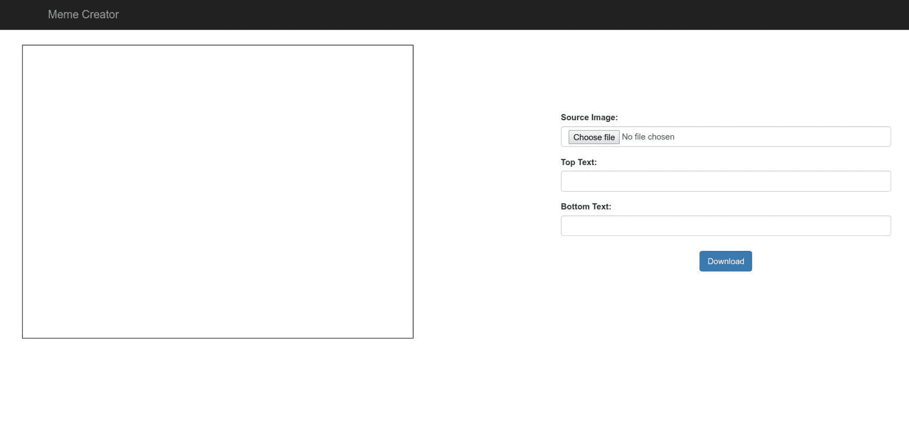
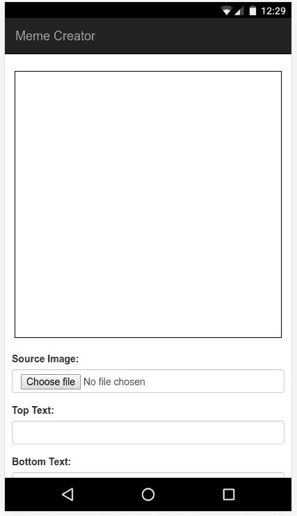
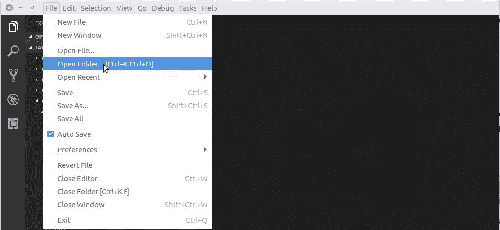
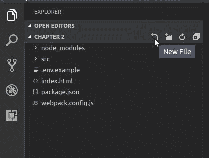
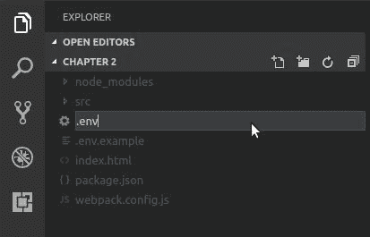
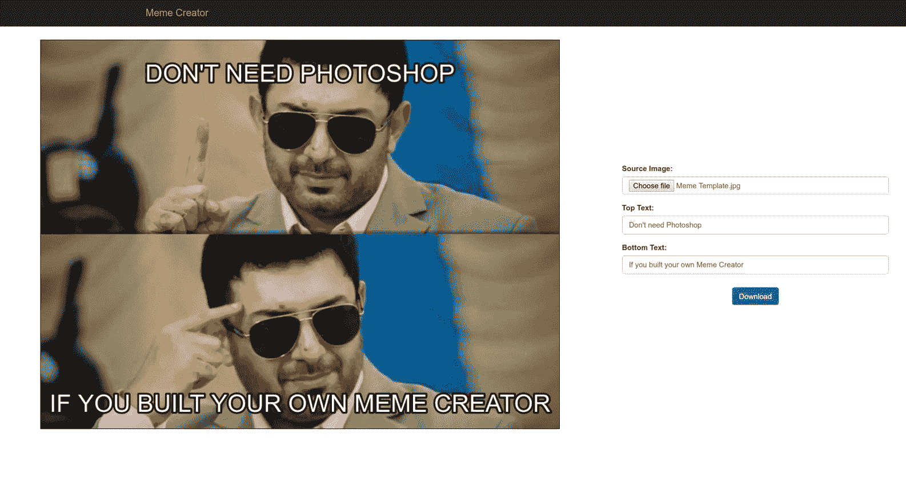

# 第二章：构建一个 Meme Creator

正如章节名称所示，我们将在本章构建一个有趣的应用程序--一个**Meme Creator**。每个人都喜欢表情包！但我们构建 Meme Creator 的原因不仅仅是因为这个。我们将探索一些新的东西，这些东西将改变您构建 Web 应用程序的方式。让我们看看有什么：

+   介绍**CSS3 flexbox**。在网络上创建响应式布局的新方法。

+   使用**Webpack**模块打包工具将所有依赖项和代码转换为静态资源。

+   使用**HTML5 画布**在 JavaScript 中实时绘制图形。

+   创建一个完全优化、缩小和版本化的稳定生产版本。

之前，您成功地构建了一个 ToDo List 应用程序，同时学习了 JavaScript 的新 ES6 特性。在本章结束时，您学会了如何使用 Node 和 npm 进行 Web 开发。我们只涵盖了基础知识。我们还没有意识到在我们的项目中使用 npm 的全部潜力。这就是为什么在这个项目中，我们将尝试使用一个称为 Webpack 的强大模块打包工具。在我们开始实验构建一个完全自动化的开发环境之前，让我们先设置一些东西。

# 初始项目设置

为我们的 Meme Creator 应用创建一个新文件夹。在 VSCode 或您用于此项目的任何其他文本编辑器中打开该文件夹。在终端中导航到该文件夹并运行**`npm init`**。就像我们在上一章中所做的那样，在终端中填写所有要求的细节，然后在 Windows 上按*Enter*或在 Mac 上按*return*，您将在项目根目录中得到`package.json`文件。

从您为本书下载的代码文件中，打开第二章的起始文件夹。您会看到一个`index.html`文件。将其复制粘贴到您的新项目文件夹中。这就是本章提供的起始文件的全部内容，因为不会有默认的 CSS 文件。我们将从头开始构建 UI！

创建我们将在本章中使用的文件和文件夹。文件夹结构应该如下所示：

```js
.
├── index.html
├── package.json
└── src
    ├── css
    │   └── styles.css
    └── js
         ├── general.js
         └── memes.js
```

现在，将 JS 文件保留为空。我们将在`styles.css`文件上进行工作。在浏览器中打开`index.html`（尝试使用我们在上一章全局安装的`http-server`包）。您应该会看到一个奇怪的页面，应用了一些默认的 Bootstrap 样式。我们将把该页面变成一个 Meme Creator 应用，如下所示：



这个网络应用也将是响应式的。因此，在您的移动设备上，它应该如下所示：



那个空白框将是我们的画布，它将预览使用该应用程序创建的表情包。现在您已经对应用程序的外观有了一个想法，我们将开始在我们的`styles.css`文件上工作。

# 使用 flexbox 进行响应式设计

如果您查看我们上一章的`index.html`文件，您会看到有一些类，比如`col-md-2`、`col-xs-2`、`col-lg-2`、`col-sm-2`等。它们是 Bootstrap 的网格类。上一章的布局是使用 Bootstrap 网格系统设计的。该系统将页面分成行和 12 列，并根据屏幕尺寸为每个`div`分配特定数量的列。

有四种不同的屏幕尺寸：

+   桌面（md）

+   平板电脑（sm）

+   手机（xs）

+   大型桌面电脑（lg）

但是，在本章中我们不会使用 Bootstrap 网格。我们将使用 CSS3 中引入的新布局模式，称为 flexbox。Flexbox 或灵活盒模型提供了一个用于创建布局的盒模型。

Flexbox 是一个新的布局系统，正在被浏览器供应商积极实施。支持几乎已经完成；是时候在项目中采用这个标准了。仍然存在一些问题，比如 IE 11 只有部分 flexbox 支持，较旧版本的 IE 不支持 flexbox。访问[`caniuse.com/`](https://caniuse.com/)查看 flexbox 的浏览器支持详情。

# Flexbox - 一个快速介绍

在 flexbox 布局系统中，您声明一个带有 CSS 属性`display: flex`的父`div`，这允许您控制如何定位其子元素。

一旦声明了`display: flex`，`div`元素就成为一个具有两个轴的 flexbox。**主轴**与内容一起放置在**交叉轴**上，该轴与主轴垂直。您可以在父 flexbox 中使用以下 CSS 属性来更改子元素（*flex 项目*）的位置：

+   **flex-direction**：创建主轴，可以是水平（行）或垂直（列）

+   **justify-content**：指定如何在主轴上放置 flex 项目

+   **align-items**：指定如何在交叉轴上放置 flex 项目

+   **flex-wrap**：指定当没有足够空间在单行中显示 flex 项目时如何处理它们

您还可以将一些 flex 属性应用于 flex 项目，例如：

+   **align-self**：指定如何在交叉轴上放置特定的 flex 项目

+   **flex**：相对于其他 flex 项目的大小（如果您有两个项目分别为`flex: 2`和`flex: 1`，第一个将是第二个的两倍大小）

所有这些听起来可能令人困惑，但理解 flexbox 的最简单方法是使用在线 flexbox 游乐场。搜索一些在线可用的 flexbox 游乐场，体验 flexbox 的不同属性如何工作。其中一个游乐场可以在[`flexboxplayground.catchmyfame.com/`](http://flexboxplayground.catchmyfame.com/)找到。

要学习 flexbox，请参考以下页面：

+   Mozilla 开发者网络：[`developer.mozilla.org/en-US/docs/Learn/CSS/CSS_layout/Flexbox`](https://developer.mozilla.org/en-US/docs/Learn/CSS/CSS_layout/Flexbox)

+   W3Schools：[`www.w3schools.com/css/css3_flexbox.asp`](https://www.w3schools.com/css/css3_flexbox.asp)

+   Flexbox Froggy（一个学习 flexbox 的游戏）：[`flexboxfroggy.com/`](https://flexboxfroggy.com/)

在撰写本书时，Safari 浏览器的最新版本 10.1 存在**flex-wrap**属性的问题，这在夜间构建中已经修复。如果您使用相同或更早版本的 Safari 浏览器，我建议在本章中使用 Chrome。

# 设计模因创作者

在我们的`index.html`文件中，我们的`<body>`元素被分成一个导航栏和包含网站内容的`div`。`div.body`元素进一步分为`div.canvas-area`和`div.input-area`。

# 导航栏

我们文档正文的第一部分是导航栏`<nav>`。导航栏通常包含网站导航的主要链接集。由于在本章中我们只构建一个单页面，因此我们可以将导航栏仅包含我们的页面标题。

导航栏使用 Bootstrap 进行样式设置。类`.navbar`将相应元素样式为页面的主导航栏。`.navbar-inverse`类为导航栏添加了深色，`.navbar-fixed-top`类使用固定位置将导航栏附加到屏幕顶部。导航栏的内容包裹在 Bootstrap 容器（`div.container`）中。页面标题写在`div.navbar-header`中，作为带有类`.navbar-brand`的锚标签，这告诉 Bootstrap 这是应用程序的品牌名称/标题。

Bootstrap 导航栏是高度可定制的。要了解更多关于这个主题的内容，请参考 W3Schools 的 Bootstrap 教程：[`www.w3schools.com/bootstrap/`](https://www.w3schools.com/bootstrap/)或 Bootstrap 的官方文档：[`getbootstrap.com/getting-started/`](http://getbootstrap.com/getting-started/)。

# 内容区域

导航栏占据屏幕顶部的固定位置。因此，它将与页面的内容重叠。打开`styles.css`并添加以下代码：

```js
body {
  padding-top: 65px;
}
```

这将为整个 body 部分添加填充，以便导航栏不会与我们的内容重叠。现在，我们需要将我们的主要内容区域`div.body`转换为 flexbox：

```js
.body {
  display: flex;
  flex-direction: row;
  flex-wrap: wrap;
  justify-content: space-around;
}
```

这将把我们的`div.body`元素转换为一个 flexbox，将其内容组织为一行（`flex-direction`），如果没有足够的空间来容纳整行，则将内容换行到新行（`flex-wrap`）。此外，内容将在水平方向被等距间隔包围（`justify-content`）。

猜猜看？我们完成了！我们的主要布局已经完成了！切换到 Chrome，进行硬刷新，看到内容现在水平对齐了。打开响应式设计模式；对于移动设备，你会看到行自动换行成两行来显示内容。没有 flexbox，要实现相同的布局需要三倍的代码量。Flexbox 大大简化了布局过程。

现在我们的主要布局已经完成，让我们为各个元素添加一些样式，比如：

+   使`.canvas-area`的大小是`.input-area`的两倍

+   给画布元素添加黑色边框

+   将画布和表单输入在各自的区域居中对齐

+   此外，我们需要为`.canvas-area`和`.input-area`添加一些边距，这样当行被换行时它们之间会有空间

为了实现这些样式，将以下 CSS 添加到你的`styles.css`文件中：

```js
.canvas-area {
   flex: 2;
  display: flex;
  align-items: center;
  justify-content: center;
  margin: 10px;
}
.img-canvas {
  border: 1px solid #000000;
}
.input-area {
  flex: 1;
  display: flex;
  flex-direction: column;
  align-items: center;
  justify-content: center;
  margin: 10px;
}
```

画布区域仍然很小，但我们将从 JavaScript 代码中处理它的大小。所以，现在我们不需要担心画布的大小。

我们的样式几乎完成了，只是表单输入现在大小不同。这是因为 Bootstrap 的`.form-input`样式告诉相应的`div`占据其父`div`的整个宽度。然而，当我们在样式中添加`align-items: center`时，我们告诉父`div`分配有限的宽度，以便内容不重叠，并在 flexbox 内居中。因此，现在每个元素的宽度根据其内容而异。

为了解决这个问题，我们只需要为`.form-input`类指定一个固定的宽度。此外，让我们为下载按钮添加一些额外的顶部边距。在你的`styles.css`文件的末尾添加以下行：

```js
.form-group {
  width: 90%;
}
.download-button {
  margin-top: 10px;
}
```

现在我们使用 flexbox 构建了我们的 Meme Creator 的 UI。是时候转向本章中最重要的主题了。

由于其易用性和大量功能，flexbox 布局系统也被移动应用开发所采用。React Native 使用 flexbox 为 Android 和 iOS 应用创建 UI。Facebook 还发布了开源库，如`yoga`和`litho`，用于在原生 Android 和 iOS 应用中使用 flexbox。

# Webpack 模块打包工具

终于是时候建立我们功能齐全的开发环境了。你可能会想知道 Webpack 是什么，它与开发环境有什么关系。或者，你可能熟悉诸如 gulp 或 grunt 之类的工具，想知道 Webpack 与它们有何不同。

如果你以前使用过 gulp 或 grunt，它们是任务运行器。它们执行一组特定的任务来编译、转换和压缩你的代码。还有一个名为**Browserify**的工具，它允许你在浏览器中使用`require()`。通常，使用 gulp/grunt 的开发环境涉及使用不同的工具集（如 Babel、Browserify 等）按特定顺序执行各种命令来生成我们期望的输出代码。但 Webpack 不同。与任务运行器不同，Webpack 不运行一组命令来构建代码。相反，它充当模块打包工具。

Webpack 通过您的 JavaScript 代码并查找`import`，`require`等来查找依赖于它的文件。然后，它将文件加载到依赖图中，并依次找到这些文件的依赖关系。这个过程会一直持续下去，直到没有更多的依赖关系。最后，它使用构建的依赖图将依赖文件与初始文件捆绑在一起成为一个单一的文件。这个功能在现代 JavaScript 开发中非常有用，因为所有东西都被写成一个模块：

Webpack 正在被广泛采用作为流行的现代框架（如 React、Angular 和 Vue）的捆绑工具。这也是您简历上很好的技能。

# JavaScript 模块

记得我们在上一章中构建的 ToDo List 应用程序吗？我们使用 npm 安装 Babel 将我们的 ES6 代码转换为 ES5。导航到`ToDo List`文件夹并打开`node_modules`文件夹。您会发现一个包含各种包的大型文件夹列表！即使您只安装了四个包，npm 也已经跟踪了所需包的所有依赖关系，并将它们与实际包一起安装。

我们只使用这些包作为开发依赖项来编译我们的代码。因此，我们不知道这些包是如何构建的。这些包被构建为模块。模块是一个独立的可重用代码片段，返回一个值。该值可以是对象、函数、`string`、`int`等。模块被广泛用于构建大型应用程序。Node.js 支持导出和导入 JavaScript 模块，而这在浏览器中目前是不可用的。

让我们看看如何在 JavaScript 中创建一个简单的模块：

```js
function sum (a, b) {
  return a+b;
}
```

考虑前面提到的返回两个数字之和的函数。我们将把该函数转换为一个模块。创建一个新文件`sum.js`，并按如下方式编写函数：

```js
export function sum (a, b) {
  return a+b;
}
```

就是这样！您只需要在您想要导出的变量或对象之前添加一个`export`关键字，它将成为一个可以在不同文件中使用的模块。想象一下，您有一个名为`add.js`的文件，您需要找到两个数字的和。您可以按如下方式导入`sum`模块：

```js
// In file add.js at the same directory as sum.js
import { sum } from './sum.js';

let a = 5, b = 6, total;
total = sum(a, b);
```

如果您正在导入一个 JavaScript 文件，可以忽略扩展名`.js`并使用`import { sum } from './sum'`。您也可以使用以下方式：

```js
let sum = (a, b) => return a+b;
module.exports = { sum };
```

然后，按如下方式导入它：

```js
const sum = require('./sum');
```

`module.exports`和`require`关键字自 Node.js 用于导入和导出 JavaScript 模块，甚至在 ES6 之前就已经使用了。然而，ES6 有一个新的模块语法，使用`import`和`export`关键字。Webpack 支持所有类型的导入和导出。对于我们的项目，我们将坚持使用 ES6 模块。

考虑以下文件`sides.js`，其中包含多个几何图形的边数：

```js
export default TRIANGLE = 3;
export const SQUARE = 4;
export const PENTAGON = 5;
export const HEXAGON = 6;
```

要将它们全部导入到我们的文件中，您可以使用以下方式：

```js
import * as sides from './sides.js';
```

现在，`sides.js`文件中导出的所有变量/对象将可以在`sides`对象中访问。要获取`TRIANGLE`的值，只需使用`sides.LINE`。还要注意，`TRIANGLE`被标记为默认。当同一文件中有多个模块时，默认导出是有用的。输入以下内容：

```js
import side from './sides.js';
```

现在，`side`将包含默认导出`TRIANGLE`的值。所以，现在`side = 3`。要导入默认模块以及其他模块，您可以使用以下方式：

```js
import TRIANGLE, { SQUARE, PENTAGON, HEXAGON } from './sides.js';
```

现在，如果您想要导入一个存在于`node_modules`文件夹中的模块，您可以完全忽略相对文件路径（`./`部分）并只需输入`import jquery from 'jquery';`。Node.js 或 Webpack 将自动从文件的父目录中找到最近的`node_modules`文件夹，并自动搜索所需的包。只需确保您已经使用`npm install`安装了该包。

这基本上涵盖了在 JavaScript 中使用模块的基础知识。现在是时候了解 Webpack 在我们的项目中的作用了。

# 在 Webpack 中捆绑模块

要开始使用 Webpack，让我们首先编写一些 JavaScript 代码。打开你的`memes.js`文件和`general.js`文件。在两个文件中写入以下代码，它只是在控制台中打印出相应的文件名：

```js
// inside memes.js file
console.log('Memes JS file');
// inside general.js file
console.log('General JS File');
```

通常，在构建具有大量 HTML 文件的多页面 Web 应用程序时，通常会有一个单个的 JavaScript 文件，其中包含需要在所有 HTML 文件上运行的代码。我们将使用`general.js`文件来实现这个目的。即使我们的 Meme Creator 只有一个 HTML 文件，我们也将使用`general.js`文件来包含一些通用代码，并在`memes.js`文件中包含 Meme Creator 的代码。

为什么我们不尝试在我们的`memes.js`文件中导入`general.js`文件呢？由于`general.js`没有导出任何模块，所以只需在你的`memes.js`文件中输入以下代码：

```js
import './general';
```

在你的`index.html`文件的`<body>`元素末尾包含一个引用`memes.js`文件的`script`标签，并在 Chrome 中查看结果。如果一切顺利，你应该在 Chrome 的控制台中看到一个错误，说：Unexpected token import。这意味着 Chrome 出了一些问题。是的！Chrome 不知道如何使用`import`关键字。要使用`import`，我们需要 Webpack 将`general.js`和`meme.js`文件捆绑在一起，并将其作为单个文件提供给 Chrome。

让我们将 Webpack 作为项目的开发依赖项进行安装。在终端中运行以下命令：

```js
npm install -D webpack
```

Webpack 现在作为我们项目的开发依赖项安装完成。Webpack 也是一个类似 Babel 的命令行工具。要运行 Webpack，我们需要使用`npm`脚本。在你的`package.json`文件中，在测试脚本下面，创建以下脚本：

```js
"webpack": "webpack src/js/memes.js --output-filename dist/memes.js",
```

现在在你的终端中运行以下命令：

```js
npm run webpack
```

将`memes.js`文件创建在`dist/js/`目录下。该文件包含了`general.js`和`memes.js`文件的捆绑在一起。在 VSCode 中打开新的 JavaScript 代码；你应该会看到大量的代码。在这个阶段不需要惊慌；这是 Webpack 用来管理捆绑文件的范围和属性的代码。这是我们目前不必担心的东西。如果你滚动到文件的末尾，你会看到我们在原始文件中写的`console.log`语句。编辑`index.html`中的脚本标签以包含新文件，如下所示：

```js
<script  src="./dist/memes.js"></script>
```

现在，在 Chrome 中重新加载页面，你应该看到来自两个文件的控制台语句都在`memes.js`文件中执行。我们已经成功地在我们的代码中导入了一个 JavaScript 文件。在我们以前的项目中，我们设置了开发环境，以便在源文件中进行更改时，代码将自动编译和提供服务。要进行 ES6 到 ES5 的编译和其他任务，我们需要安装许多包，并且必须给 Webpack 提供许多指令。为此，在你的项目根目录中创建`webpack.config.js`并编写以下代码：

```js
const webpack = require('webpack');

module.exports = {
  context: __dirname,
  entry: {
    general: './src/js/general.js',
    memes: './src/js/memes.js',
  },
  output: {
    path: __dirname + "/dist",
    filename: '[name].js',
  },
}
```

删除`package.json`中传递给 Webpack 的所有选项。现在，`package.json`中的脚本应该如下所示：

```js
"webpack": "webpack"
```

由于我们没有向 Webpack 传递任何参数，它将在执行的目录中查找`webpack.config.js`文件。它现在将从我们刚刚创建的文件中读取配置。我们配置文件中的第一行是使用`require('webpack')`导入 Webpack。我们仍然使用 Node.js 来执行我们的代码，所以我们应该在 Webpack 配置文件中使用`require`。我们只需要将我们的配置作为 JSON 对象导出到这个文件中。在`module.exports`对象中，每个属性的用途如下：

+   `context`：用于指定需要解析入口部分文件路径的绝对路径。在这里，`__dirname`是一个常量，将自动包含当前目录的绝对路径。

+   `entry`：用于指定需要使用 Webpack 捆绑的所有文件。它接受字符串、数组和 JSON 对象。如果需要 Webpack 捆绑单个入口文件，只需将文件路径指定为字符串。否则，使用数组或对象。

+   在我们的情况下，我们以`[name]: [path_of_the_file]`的形式指定输入文件为对象。

+   这个[name]将用于命名每个文件的输出捆绑包。

+   `output`：在输出中，我们需要指定输出目录的绝对路径，在我们的情况下是`dist`，以及文件名，即我们在入口部分指定的`[name]`，后跟文件扩展名`[name].js`。

在终端中运行`npm run webpack`。您应该会在`dist`目录中看到两个新文件被创建：`general.js`和`memes.js`，它们包含了各自源文件的捆绑代码。`memes.js`文件将包括`general.js`文件中的代码，因此在 HTML 中只需要包含`memes.js`文件即可。

现在我们已经编写了捆绑我们代码的配置，我们将使用这个配置文件来将 ES6 语法转换为 ES5。在 Webpack 中，当文件被导入时，转换会被应用。要应用转换，我们需要使用加载器。

# Webpack 中的加载器

加载器用于在导入和捆绑文件之前对文件应用转换。在 Webpack 中，使用不同的第三方加载器，我们可以转换任何文件并将其导入到我们的代码中。这适用于用其他语言编写的文件，如 TypeScript、Dart 等。我们甚至可以将 CSS 和图像导入到我们的 JS 代码中。首先，我们将使用加载器将 ES6 转换为 ES5。

在`memes.js`文件中，添加以下代码：

```js
class Memes {
  constructor() {
    console.log('Inside Memes class');
  }
}

new Memes();
```

这是一个使用 ES6 的简单类，构造函数中有一个`console.log`语句。我们将使用 Webpack 和`babel-loader`将这个 ES6 代码转换为 ES5 形式。为此，安装以下软件包：

```js
npm install -D babel-core babel-loader babel-preset-env babel-preset-es2015
```

在您的`webpack.config.js`文件中，在输出属性下面添加以下代码：

```js
module: {
  rules: [
    {
      test: /\.js$/,
      exclude: /(node_modules)/,
      use: {
        loader: 'babel-loader',
        options: {
          presets: ['env', 'es2015'],
        }
      }
    }
  ],
},
```

这就是我们在 Webpack 中添加加载器的方法。我们需要在模块部分内创建一组规则的数组。规则包含加载器的配置对象数组。在我们的配置中，它将测试文件，看它是否与正则表达式`.js$`匹配，也就是说，检查文件是否是 JavaScript 文件，使用它的扩展名。我们已经排除了`node_modules`目录，这样只有我们的代码会被评估进行转换。

如果导入的文件是 JavaScript 文件，Webpack 将使用提供的选项使用`babel-loader`。在这里，在`options`中，我们指示 Babel 使用`env`和`es2015`预设。`es2015`预设将把 ES6 代码转译成 ES5 格式。

`env`预设更为特殊。它用于将任何 ES 版本的 JavaScript 转译为特定环境支持的版本（如特定版本的 Chrome 和 Firefox）。如果没有提供配置，就像我们之前提到的代码一样，那么它将使 JavaScript 代码（甚至是 ES8）在几乎所有环境中工作。有关此预设的更多信息，请访问[`github.com/babel/babel-preset-env`](https://github.com/babel/babel-preset-env)。

由于我们只会在本书中使用 ES6，所以`es2015`预设对所有项目来说已经足够了。但是，如果您将来想要学习 ES7 及更高版本，那么请学习`env`预设的工作。

同样，让我们使用 Webpack 捆绑我们的 CSS 代码。使用 Webpack 捆绑 CSS 代码有许多优点。其中一些如下：

+   通过在各自的 JavaScript 文件中导入所需的 CSS 代码，只使用每个网页所需的 CSS 代码。这将导致更容易和更好的依赖管理，并减少每个页面的文件大小。

+   CSS 文件的最小化。

+   使用 autoprefixer 轻松自动添加特定供应商前缀。

+   轻松编译使用 Sass、Less、Stylus 等编写的样式表为普通的 CSS。

使用 Webpack 捆绑 CSS 代码还有更多优势。因此，让我们从捆绑我们的`styles.css`文件开始，然后是 Bootstrap 的文件。安装以下依赖项来实现我们的 CSS 加载器：

```js
npm install -D css-loader style-loader
```

在我们的 Webpack 配置中，将以下对象添加到 rules 数组中：

```js
{
  test: /\.css$/,
  use: [ 'style-loader', 'css-loader' ]
},
```

我们正在安装两个加载器来捆绑 CSS 文件：

1.  第一个是`css-loader`。它使用 Webpack 解析所有的导入和`url()`。然后返回完整的 CSS 文件。

1.  `style-loader`将把 CSS 添加到页面中，以便样式在页面上生效。

1.  我们需要先运行`css-loader`，然后是`style-loader`，它使用`css-loader`返回的输出。为此，我们编写了以下内容：

+   对于 CSS 文件：`test: /\.css$/`

+   使用以下加载器：`use: ['style-loader', 'css-loader']`。Webpack 按照从后到前的顺序执行加载器。因此，首先执行`css-loader`，然后将其输出传递给`style-loader`。

1.  打开你的`general.js`文件，并在文件开头添加以下行：

```js
import  '../css/styles.css';
```

还要删除在你的`index.html`页面中用于包含 CSS 文件的`<link>`属性。这是一个技巧：CSS 文件将被导入到`general.js`文件中，然后被导入到`memes.js`文件中，这是你需要在`index.html`中包含的唯一文件。

我们将创建一个大的`webpack.config.js`文件。如果遇到任何问题，请参考我们在以下位置创建的最终`webpack.config.js`文件：[`goo.gl/Q8P4ta`](https://goo.gl/Q8P4ta)或本书代码文件中的`chapter02\webpack-dev-server`目录。

现在是时候看看我们的应用程序了。在终端中执行`npm run webpack`，然后在 Chrome 中打开只包含一个`memes.js`文件的网站。你应该看到完全相同的页面，没有任何变化。所有的依赖项都被捆绑到一个单一的文件中——除了 Bootstrap！

# 在 Webpack 中捆绑 Bootstrap

是时候将我们最终的依赖项捆绑到 Webpack 中了。Bootstrap 由三个部分组成。首先是 Bootstrap 的 CSS 文件，然后是 jQuery 和依赖于 jQuery 的 Bootstrap 的 JavaScript 文件。这两个文件在本章的`index.html`文件中被忽略了，因为我们没有使用它们。但是，由于我们正在使用 Webpack 捆绑我们的依赖项，让我们把它们都放在一起。首先，安装我们的依赖项（这些不是开发依赖项；因此，使用`-S`而不是`-D`）：

```js
npm install -S jquery bootstrap@3
```

Bootstrap 是使用**Less**而不是 CSS 编写的。**Less**是一个 CSS 预处理器，它通过添加更多功能（如变量、混合和函数）来扩展 CSS。为了使用 Webpack 导入 Bootstrap 的 less 文件，我们需要另一个加载器：

```js
npm install -D less less-loader
```

这将把 less 编译器和加载器安装到我们的`node_modules`中。现在，在我们的 rules 中，将 CSS 规则修改为：

```js
{
  test: /\.(less|css)$/,
  use: [ 'style-loader', 'css-loader', 'less-loader' ]
},
```

这将在 Webpack 检测到 CSS 或 less 文件时将`less-loader`作为第一个选项添加为加载器。现在，尝试`npm run webpack`。这次，你将在终端中收到一个错误，指出"*您可能需要一个适当的加载器来处理此文件类型*"，这是由 Bootstrap 使用的字体引起的。由于 Bootstrap 依赖于许多字体，我们需要创建一个单独的加载器将它们包含在我们的捆绑文件中。为此目的，安装以下内容：

```js
npm install -D file-loader url-loader
```

然后在你的 rules 数组中包含以下对象：

```js
{
  test: /\.(svg|eot|ttf|woff|woff2)$/,
  loader: 'url-loader',
  options: {
    limit: 10000,
    name: 'fonts/[name].[ext]'
  }
},
```

这将告诉 Webpack，如果文件大小小于 10KB，则将文件作为数据 URL 内联到 JavaScript 中。否则，将文件移动到字体文件夹并在 JavaScript 中创建一个引用。如果文件大小小于 10KB，则这对于减少网络开销很有用。`url-loader`需要安装`file-loader`作为依赖项。再次执行`npm run webpack`，这次你的 Bootstrap less 文件将成功捆绑，并且你将能够在浏览器中查看你的网站。

对于一些 CSS 和 JS 文件来说，这可能看起来是很多工作。但是，当您在大型应用程序上工作时，这些配置可以节省数小时的开发工作。Webpack 的最大优势是您可以为一个项目编写配置，并将其用于其他项目。因此，我们在这里做的大部分工作只需要做一次。我们只需复制并在其他项目中使用我们的`webpack.config.js`文件。

如我之前提到的，我们没有在应用程序中使用 Bootstrap 的 JS 文件。但是，我们可能需要在将来的应用程序中使用它们。Bootstrap 需要全局范围内可用的 jQuery，以便执行其 JavaScript 文件。但是，Webpack 不会暴露它捆绑的 JavaScript 变量，除非明确指定要暴露它们。

为了使 jQuery 在整个 Web 应用程序中的全局范围内可用，我们需要使用 Webpack 插件。插件与加载程序不同。我们稍后会详细了解插件。现在，请在 Webpack 的 module 属性之后添加以下代码：

```js
module: {
  rules: [...],
},
plugins: [
  new webpack.ProvidePlugin({
    jQuery: 'jquery',
    $: 'jquery',
    jquery: 'jquery'
  }),
],
```

在我们的`general.js`文件中，包含以下行以将所有 Bootstrap JavaScript 文件导入到我们的 Web 应用程序中：

```js
import  'bootstrap';
```

这行将从`node_modules`文件夹中导入 Bootstrap 的 JavaScript 文件。您现在已成功使用 Webpack 捆绑了 Bootstrap。还有一个常用的加载程序`- img-loader`。有时我们会在 CSS 和 JavaScript 中包含图像。使用 Webpack，我们可以在捆绑时自动捆绑图像，同时压缩较大图像的大小。

要捆绑图像，我们需要一起使用`img-loader`和`url-loader`。首先，安装`img-loader`：

```js
npm install -D img-loader
```

将以下对象添加到您的规则列表中：

```js
{
  test: /\.(png|jpg|gif)$/,
  loaders: [
    {
      loader: 'url-loader',
      options: {
        limit: 10000,
        name: 'images/[name].[ext]'
      }
    },
  'img-loader'
  ],
},
```

现在，执行`npm run webpack`，然后再次打开网站。您的所有依赖项都已捆绑在一个名为`memes.js`的 JavaScript 文件中，准备就绪。

有时，`img-loader`二进制文件在构建过程中可能会因您的操作系统而失败。在 Ubuntu 的最新版本中，这是由于缺少的软件包，可以从[`packages.debian.org/jessie/amd64/libpng12-0/download`](https://packages.debian.org/jessie/amd64/libpng12-0/download)下载并安装。在其他操作系统中，您必须手动找出构建失败的原因。如果您无法解决`img-loader`问题，请尝试使用不同的加载程序，或者只使用`url-loader`来处理图像。

# Webpack 中的插件

与加载程序不同，插件用于自定义 Webpack 构建过程。Webpack 内置了许多插件。它们可以通过`webpack.[plugin-name]`访问。我们还可以编写自己的函数作为插件。

有关 webpack 的插件系统的更多信息，请参阅[`webpack.js.org/configuration/plugins/`](https://webpack.js.org/configuration/plugins/)。

# Webpack 开发服务器

到目前为止，我们已经创建了 Webpack 配置来编译我们的代码，但如果我们可以像使用`http-server`一样提供代码，那将更容易。`webpack-dev-server`是一个使用 Node.js 和 Express 编写的小型服务器，用于提供 Webpack 捆绑包。要使用`webpack-dev-server`，我们需要安装它的依赖项并更新我们的 npm 脚本：

```js
npm install -D webpack-dev-server
```

将以下行添加到 npm 脚本中：

```js
  "watch": "webpack-dev-server"
```

使用`npm run watch`，我们现在可以在本地主机上的服务器上提供文件。`webpack-dev-server`不会将捆绑的文件写入磁盘。相反，它将自动从内存中提供它们。`webpack-dev-server`的一个很棒的功能是它能够进行`HotModuleReplacement`，这将替换已更改的代码部分，甚至无需重新加载页面。要使用`HotModuleReplacement`，请将以下配置添加到您的 Webpack 配置文件中：

```js
entry: {...},
output: {...},
devServer: {
  compress: true,
  port: 8080,
  hot: true,
},
module: {..},
plugins: [
  ...,
  new webpack.HotModuleReplacementPlugin(),
],
```

目前，`webpack-dev-server`正在从根目录提供文件。但是我们需要从`dist`目录提供文件。为此，我们需要在输出配置中设置`publicPath`：

```js
output: {
  ...,
  publicPath: '/dist/',
},
```

删除你的`dist`文件夹并运行`npm run watch`命令。你的 Web 应用现在将在控制台中打印一些额外的消息。这些消息来自`webpack-dev-server`，它正在监听任何文件更改。尝试在 CSS 文件中更改几行。你的更改将立即反映出来，无需重新加载页面！这对于在代码保存后立即查看样式更改非常有用。`HotModuleReplacement`广泛用于现代 JavaScript 框架，如 React、Angular 等。

我们的代码中仍然缺少用于调试的`source-maps`。为了启用`source-maps`，Webpack 提供了一个简单的配置选项：

```js
devtool: 'source-map',
```

Webpack 可以生成不同类型的源映射，具体取决于生成它们所需的时间和质量。请参考此页面以获取更多信息：[`webpack.js.org/configuration/devtool/`](https://webpack.js.org/configuration/devtool/)。

这将只向 JS 文件添加源映射。要向包含 Bootstrap 的 less 文件的 CSS 文件添加`source-maps`，请将 CSS 规则更改为以下内容：

```js
{
  test: /\.(less|css)$/,
  use: [
    {
      loader: "style-loader"
    },
    {
      loader: "css-loader",
      options: {
        sourceMap: true
      }
    },
    {
      loader: "less-loader",
      options: {
        sourceMap: true
      }
    }
  ]
},
```

这条规则将告诉`less-loader`向其编译的文件添加`source-maps`并将其传递给`css-loader`，后者也将源映射传递给`style-loader`。现在，你的 JS 和 CSS 文件都将有源映射，这样就可以轻松在 Chrome 中调试应用程序。

如果你一直在跟进，你的 Webpack 配置文件现在应该看起来像以下 URL 中的代码：[`goo.gl/Q8P4ta`](https://gist.github.com/DaniAkash/811221175c9ef5c292f0fd6f1cec5bc3)。你的`package.json`文件应该是这样的：[`goo.gl/m4Ib97`](https://gist.github.com/DaniAkash/6ec06b68033a5fe46fa68bfe3ce492fd)。这些文件也包含在书中代码的`chapter02\webpack-dev-server`目录中。

我们在 Webpack 中使用了许多不同的加载器，每个加载器都有自己的配置选项，其中许多我们在这里没有讨论。请访问这些包的 npm 或 GitHub 页面，了解更多关于它们的配置并根据您的需求进行自定义。

即将到来的部分是可选的。如果你想构建 Meme Creator 应用程序，你可以跳过下一部分并开始开发。你现在拥有的 Webpack 配置完全没问题。然而，下一部分对于更多了解 Webpack 并在生产中使用它非常重要，所以请稍后回来阅读！

# 为不同环境优化 Webpack 构建

在开发大型应用程序时，通常会为应用程序创建不同类型的环境，例如开发、测试、暂存、生产等。每个环境都有不同的应用程序配置，对于团队中的不同人员进行开发和测试非常有用。

例如，假设你的应用程序有一个用于支付的 API。在开发过程中，你将拥有沙盒凭据，而在测试过程中，你将拥有不同的凭据，最后，在生产环境中，你将拥有支付网关所需的实际凭据。因此，应用程序需要在三种不同的环境中使用三种不同的凭据。同样重要的是不要将敏感信息提交到版本控制系统中。

那么，我们如何在不在代码中写入凭据的情况下将凭据传递给应用程序？这就是环境变量的概念发挥作用的地方。操作系统将在编译时提供值，以便可以使用不同环境变量中的值在不同环境中生成构建。

创建环境变量的过程对于每个操作系统都是不同的，对于每个项目来说维护这些环境变量是一项繁琐的任务。因此，让我们通过使用`npm`包从项目根目录的`.env`文件中加载我们的环境变量来简化这个过程。在 Node.js 中，您可以在`process.env`对象中访问环境变量。以下是如何从`.env`文件中读取变量的方法：

1.  第一步是安装以下包：

```js
npm install -D dotenv
```

1.  完成后，在您的项目根目录中创建一个`.env`文件，并添加以下行：

```js
NODE_ENV=production
CONSTANT_VALUE=1234567
```

1.  这个`.env`文件包含三个环境变量及其值。如果您使用 Git，则应将`.env`文件添加到`.gitignore`文件中，或将其包含在您的版本控制系统的忽略列表中。创建`.env.example`文件也是一个好习惯，它告诉其他开发人员应用程序需要哪些环境变量。您可以将`.env.example`文件提交到您的版本控制系统。我们的`.env.example`文件应如下所示：

```js
NODE_ENV=
CONSTANT_VALUE=
```

这些环境变量可以被 Node.js 读取，但不能被我们的 JavaScript 代码读取。因此，我们需要 Webpack 读取这些变量，并将它们作为全局变量提供给 JavaScript 代码。建议将环境变量名称的字母保持大写，以便您可以轻松识别它们。

我们将使用`NODE_ENV`来检测环境类型，并告诉 Webpack 为该环境生成适当的构建，我们需要在我们的 JS 代码中使用其他两个环境变量。在您的`webpack.config.js`文件中，第一行包含以下代码：

```js
require('dotenv').config()
```

这将使用我们刚刚安装的`dotenv`包，并从我们项目的根目录中的`.env`文件中加载环境变量。现在，环境变量可以在 Webpack 配置文件中的`process.env`对象中访问。首先，让我们设置一个标志，检查当前环境是否为 production。在`require('webpack')`行之后包含以下代码：

```js
const  isProduction = (process.env.NODE_ENV === 'production');
```

现在，当`NODE_ENV`设置为 production 时，`isProduction`将被设置为 true。要在我们的 JavaScript 代码中包含另外两个变量，我们需要在 Webpack 中使用`DefinePlugin`。在插件数组中，添加以下配置对象：

```js
new webpack.DefinePlugin({
  ENVIRONMENT: JSON.stringify(process.env.NODE_ENV),
  CONSTANT_VALUE: JSON.stringify(process.env.CONSTANT_VALUE),
}),
```

`DefinePlugin`将在编译时定义常量，因此您可以根据您的环境更改您的环境变量，并且它将反映在代码中。确保您对传递给`DefinePlugin`的任何值进行字符串化。有关此插件的更多信息，请访问：[`webpack.js.org/plugins/define-plugin/`](https://webpack.js.org/plugins/define-plugin/)。

现在，在您的`memes.js`文件的构造函数中，尝试`console.log(ENVIRONMENT, CONSTANT_VALUE);`并重新加载 Chrome。您应该在控制台中看到它们的值被打印出来。

由于我们使用`isProduction`变量设置了一个标志，所以只有在环境为 production 时才能对构建进行各种优化。一些常用于生产构建优化的插件如下。

# 在 Windows 中创建.env 文件

Windows 不允许您直接从 Windows 资源管理器创建`.env`文件，因为它不允许以点开头的文件名。但是，您可以轻松地从 VSCode 中创建它。首先，使用菜单选项文件|打开文件夹...[Ctrl+K Ctrl+O]打开 VSCode 中的项目文件夹，如下截图所示：



一旦您打开了文件夹，点击 VSCode 左上角的资源管理器图标（或按*Ctrl*+*Shift*+*E*）打开资源管理器面板。在资源管理器面板中，点击“新建文件”按钮，如下截图所示：



然后，如下截图所示，简单地输入新文件名`.env`：



按*Enter*创建`.env`文件并开始编辑它。

当 Webpack-dev-server 启动时，`.env`文件是只读的。因此，如果您对`.env`文件进行任何更改，您将需要在终端中终止运行的 Webpack-dev-server 实例，并重新启动它，以便它将读取`.env`文件中的新值。

# UglifyJsPlugin

这是一个用于压缩和缩小 JavaScript 文件的插件。这将大大减小 JavaScript 代码的大小，并增加最终用户的加载速度。但是，在开发过程中使用此插件会导致 Webpack 变慢，因为它会为构建过程添加额外的步骤（昂贵的任务）。因此，`UglifyJsPlugin`通常仅在生产环境中使用。要这样做，请在 Webpack 配置的末尾添加以下行：

```js
if(isProduction) {
  module.exports.plugins.push(
    new webpack.optimize.UglifyJsPlugin({sourceMap: true})
  );
}
```

如果环境设置为生产环境，这将将`UglifyJSPlugin`推送到插件数组中。有关`UglifyJsPlugin`的更多信息，请访问：[`webpack.js.org/plugins/uglifyjs-webpack-plugin/`](https://webpack.js.org/plugins/uglifyjs-webpack-plugin/)。

# PurifyCSSPlugin

构建 Web 应用程序时，将会有很多在 CSS 中定义但在 HTML 中从未使用的样式。`PurifyCSSPlugin`将遍历所有 HTML 文件，并在捆绑代码之前删除我们之前定义的任何不必要的 CSS 样式。要使用`PurifyCSSPlugin`，我们需要安装`purifycss-webpack`包：

```js
npm install -D purifycss-webpack
```

之后，将插件导入到您的 Webpack 配置文件中，并按以下代码中指定的方式使用它：

```js
const  PurifyCSSPlugin = require('purifycss-webpack'); constglob = require('glob');
 module.exports = {
  ...
  plugins: [
    ...
    new PurifyCSSPlugin({
      paths: glob.sync(__dirname + '/*.html'),
      minimize: true,
    }),
  ],
}
```

`glob`是 Node.js 中的内置模块。我们使用`glob.sync`指定 HTML 的路径，它将正则表达式解析为指定目录中的所有 HTML 文件。`PurifyCSSPlugin`现在将使用这些 HTML 文件来净化我们的样式。`minimize`选项将与净化一起最小化 CSS。有关`PurifyCSSPlugin`的更多信息，请访问：[`github.com/webpack-contrib/purifycss-webpack`](https://github.com/webpack-contrib/purifycss-webpack)。

`PurifyCSSplugin`很有用，但可能会导致 Bootstrap 动画和其他一些插件出现问题。在使用之前，请务必进行充分测试。

# ExtractTextPlugin

在生产环境中，建议将所有 CSS 代码提取到单独的文件中。这是因为 CSS 文件需要在页面开头包含，以便在加载 HTML 时应用页面样式。但是，由于我们将 CSS 与 JavaScript 捆绑在一起，因此我们将其包含在页面末尾。当页面加载时，它将看起来像一个普通文档，直到 CSS 文件加载完成。

`ExtractTextPlugin`用于解决这个问题。它将把所有 CSS 文件从 JS 代码中提取到与其捆绑在一起的具有相同名称的单独文件中。现在我们可以在 HTML 文件的顶部包含该 CSS 文件，这样样式将首先加载。和往常一样，第一步是安装包：

```js
npm install -D extract-text-webpack-plugin
```

在此之后，我们需要创建一个新的`ExtractTextPlugin`实例，我们将与我们的 CSS 文件一起使用。由于我们还在使用 Bootstrap 的 less，我们的配置文件应该如下所示：

```js
...
const extractLess = new ExtractTextPlugin({
  filename: "[name].css",
});

module.exports = {
  ...
  module: {
    rules: [
      ...
      {
        test: /\.(less|css)$/,
        use: extractLess.extract({
          use: [
            {
              loader: 'css-loader',
              options: {
                sourceMap: true
              }
            },
            {
              loader: 'less-loader',
              options: {
                sourceMap: true
              }
            }
          ],
          fallback: 'style-loader',
        })
     },
    ]
  },
  ...
  plugins: [
    ...
    extractLess,
    new PurifyCSSPlugin({
      paths: glob.sync(__dirname + '/*.html'),
      minimize: true,
    }),
    ...
  ]
}
```

我们已经创建了一个名为`extractLess`的`ExtractTextPlugin`实例。由于我们使用了`PurifyCSSPlugin`，请确保在我们在插件数组中创建`PurifyCSSPlugin`实例之前包含`extractLess`对象。

有关`PurifyCSSPlugin`的更多信息，请访问：[`github.com/webpack-contrib/purifycss-webpack`](https://github.com/webpack-contrib/purifycss-webpack)。

一旦您添加了`ExtractTextPlugin`，Webpack 将为每个 JavaScript 文件生成两个文件，如果 JavaScript 文件导入 CSS，则需要在 HTML 中单独包含 CSS 文件。在我们的情况下，对于`memes.js`，它将在`dist`目录中生成`memes.js`和`memes.css`，这需要单独包含在 HTML 文件中。

`ExtractTextPlugin`与 Webpack 的`HotModuleReplacement`不适用于 CSS 文件。因此，最好只在生产环境中包含`ExtractTextPlugin`。

# 缓存破坏

为了使用 Webpack 生成的静态资源进行缓存，最好的做法是将静态资源的文件名附加哈希。**[chunkhash]**将生成一个内容相关的哈希，应该附加到充当缓存破坏器的文件名上。每当文件内容发生变化时，哈希值都会改变，这将导致新的文件名，因此重新生成缓存。

只有生产构建需要缓存破坏逻辑。开发构建不需要这些配置。因此，我们只需要在生产环境中生成带哈希的文件名。此外，我们必须生成一个包含生成资源的新文件名的`manifest.json`文件，这些资源必须内联到 HTML 文件中。缓存破坏的配置如下：

```js
const fileNamePrefix = isProduction? '[chunkhash].' : '';

module.exports = {
  ...
  output: {
    ...
    filename: fileNamePrefix + '[name].js',
    ...
  }
}
```

这将在生产环境中为文件名添加哈希前缀。但是，`webpack.HotModuleReplacementPlugin()`与**[chunkhash]**不兼容，因此在我们的生产环境中不应使用`HotModuleReplacementPlugin`。要生成`manifest.json`文件，请将以下函数作为元素添加到插件数组中：

```js
function() {
  this.plugin("done", function(status) {
    require("fs").writeFileSync(
      __dirname + "/dist/manifest.json",
      JSON.stringify(status.toJson().assetsByChunkName)
    );
  });
}
```

或者最好将其添加到`UglifyJSPlugin`旁边，该插件仅在生产环境中执行。此函数将使用 Node.js 中的`fs`模块将生成的文件写入 JSON 文件。有关此主题的更多信息，请参阅：[`webpack.js.org/guides/caching/`](https://webpack.js.org/guides/caching/)。

# 在生成新构建之前清理`dist`文件夹。

由于我们生成了许多带有不同哈希文件名的构建，最好的做法是在运行每个构建之前删除`dist`目录。`clean-webpack-plugin`就是这样做的。它会在新文件捆绑之前清理`dist`目录。要使用`clean-webpack-plugin`，请在项目根目录内运行以下命令来安装插件：

```js
npm install -D clean-webpack-plugin
```

然后，将以下变量添加到您的 Webpack 配置文件中：

```js
const CleanWebpackPlugin = require('clean-webpack-plugin');
const pathsToClean = [
 'dist'
];
const cleanOptions = {
 root: __dirname,
 verbose: true,
 dry: false,
 exclude: [],
};
```

最后，将`new CleanWebpackPlugin(pathsToClean, cleanOptions)`添加到您的生产插件中。现在，每次生成生产构建时，旧的`dist`文件夹将被删除，并将创建一个包含最新捆绑文件的新文件夹。有关此插件的更多信息，请参阅：[`github.com/johnagan/clean-webpack-plugin`](https://github.com/johnagan/clean-webpack-plugin)。

# 生产环境中的源映射

源映射为我们提供了一种轻松调试编译后的代码的方法。直到打开开发工具之前，浏览器不会加载源映射。因此，就性能而言，源映射不会造成任何伤害。但是，如果需要保护原始源代码，则删除源映射是一个好主意。您还可以通过在每个捆绑文件的末尾设置`sourceMappingURL`来使用私有源映射，以将哈希前缀添加到生产环境中的文件名。这样，源映射只能由受信任的源（例如，源映射只能由公司域内的开发人员访问）使用：

```js
//# sourceMappingURL: http://protected.domain/dist/general.js.map
```

包含了所有前面提到的优化的完整 Webpack 配置文件如下：[`goo.gl/UDuUBu`](https://goo.gl/UDuUBu)。此配置中使用的依赖项可以在此处找到：[`goo.gl/PcHpZf`](https://goo.gl/PcHpZf)。这些文件也包含在本书的代码文件中，位于`Chapter02\webpack production optimized`目录下。

我们刚刚尝试了许多由社区创建的 Webpack 插件和加载器。请记住，执行这些任务的方法不止一种。因此，请务必随时查看许多新的插件/加载器。此存储库包含了 Webpack 资源的精选列表：[`github.com/webpack-contrib/awesome-webpack`](https://github.com/webpack-contrib/awesome-webpack)。

由于我们在 Meme Creator 中使用了 flexbox，一些旧的浏览器支持带有`vendor-prefixes`的 flexbox。尝试使用`postcss/autoprefixer`向您的 CSS 添加供应商前缀：[`github.com/postcss/autoprefixer`](https://github.com/postcss/autoprefixer)。

# 构建 Meme Creator

我们刚刚使用 Webpack 构建了一个不错的开发环境。现在是时候投入使用了。如果您已经进行了生产优化，请确保在项目根文件夹中创建了`.env`文件，并且该文件中的`NODE_ENV`环境变量不是`production`。在我们工作在应用程序时，简单地将`NODE_ENV=dev`的值设置为`NODE_ENV`。我们现在要构建 Meme Creator。确保您已经在`index.html`文件中包含了`dist`目录中的`memes.js`和`memes.css`文件（如果您使用了`ExtractTextPlugin`）。

在文本编辑器中打开`memes.js`文件并保持`webpack-dev-server`运行（`npm run watch`）。我们的第一步是在我们的类中创建对所有所需 DOM 元素的引用变量。然后，我们可以使用这些引用来稍后从类内部修改元素。此外，每当我们创建对 DOM 元素的引用时，最好将变量名称以`$`开头。这样，我们可以轻松知道哪些变量包含值，哪些包含对 DOM 元素的引用。

webpack-dev-server 将在控制台中打印 URL，您应该使用 Chrome 打开以查看您的应用程序。URL 将是 http://localhost:8080/

还记得在上一章中，我们使用`document.getElementById()`来搜索 DOM 元素吗？JavaScript 还有一个更好的替代方法，使查询 DOM 元素更简单：`document.querySelector()`方法。前者只允许我们使用`Id`搜索文档，但`querySelector`允许我们使用`id`、类甚至元素名称查询文档。例如，如果您需要选择以下内容：

```js
<input id="target" class="target-input" type="text"/>
```

您可以使用以下之一：

```js
document.querySelector('#target');
document.querySelector('.target-input');
document.querySelector('input#target.target-input');
```

所有这些都将返回与查询条件匹配的第一个元素。如果要选择多个元素，可以使用`document.querySelectorAll()`，它将返回对所有匹配的 DOM 元素的引用数组。在我们的构造函数中，编写以下代码：

```js
this.$canvas = document.querySelector('#imgCanvas');
this.$topTextInput = document.querySelector('#topText');
this.$bottomTextInput = document.querySelector('#bottomText');
this.$imageInput = document.querySelector('#image');
this.$downloadButton = document.querySelector('#downloadMeme');
```

现在我们的类中有对所有所需 DOM 元素的引用。目前，我们的画布很小；我们没有使用 CSS 指定其大小，因为我们需要页面具有响应性。如果用户从移动设备访问页面，我们不希望显示水平滚动条，因为画布由于其大小而超出了屏幕。因此，我们将使用 JavaScript 根据屏幕大小创建画布高度和宽度。首先需要计算设备宽度。在`Memes`类之前添加以下代码（不要放在类内部）：

```js
const  deviceWidth = window.innerWidth;
```

这将计算设备的宽度并将其存储在常量`deviceWidth`中。在类内部，创建以下函数：

```js
createCanvas() {
  let canvasHeight = Math.min(480, deviceWidth-30);
  let canvasWidth = Math.min(640, deviceWidth-30);
  this.$canvas.height = canvasHeight;
  this.$canvas.width = canvasWidth;
}
```

对 DOM 元素的引用包含整个目标元素作为 JavaScript 对象。它可以像处理普通类对象一样使用。对引用的修改将反映在 DOM 中。

如果设备屏幕足够大，这将创建一个高度为`480`，宽度为`640`的矩形画布。否则，它将创建一个宽度为`deviceWidth-30`的正方形画布。参考您之前看到的 Meme Creator 的图像。桌面上的画布将是矩形的，而移动设备上将成为带有边距的正方形区域。

`Math.min(x, y)`将返回两个数字`x`和`y`中较小的那个。我们将宽度减小了`30`，因为我们需要为边距留出空间。在构造函数中添加`this.createCanvas()`，并在 Chrome 中查看页面（Webpack 将为您重新加载页面）。尝试响应式设计模式，查看画布在移动设备上的显示方式。高度和宽度仅在首次加载页面时应用；因此，在检查不同设备时，请刷新页面。

我们的画布区域已经准备好了；让我们来看看 HTML 中新的`<canvas>`元素的一些内容。Canvas 是一个图形容器。我们可以使用 JavaScript 在 canvas 元素上绘制图形。Canvas 有几种绘图方法，如路径、形状、文本和图像。此外，在 canvas 中渲染图形比使用 DOM 元素更快。Canvas 的另一个优势是我们可以将画布内容转换为图像。在现实世界的应用程序中，当你有服务器端 API 时，你可以使用服务器来渲染表情包的图像和文本。但是，由于本章节中我们不打算使用服务器端，canvas 是我们最好的选择。

访问**Mozilla 开发者网络**（**MDN**）页面：[`developer.mozilla.org/en-US/docs/Web/API/Canvas_API/Tutorial`](https://developer.mozilla.org/en-US/docs/Web/API/Canvas_API/Tutorial) 以获取有关 canvas 元素的更多信息。

以下是表情包创建器的策略：

+   画布元素只在被指示时将图形渲染到其位图上。我们无法检测到先前在其上绘制的任何图形。这使我们别无选择，只能在每次输入新文本或图像到表情包创建器时清除画布，并再次渲染整个画布。

+   我们需要事件监听器在用户在顶部文本框或底部文本框中输入文本时向表情包添加文本。

+   底部文本是一个必填字段。用户只有在填写了底部文本后才能下载表情包。

+   用户可以选择任意大小的图像。如果他选择了一个巨大的图像，它不应该破坏我们的页面布局。

+   下载按钮应该像一个下载按钮一样工作！

# 事件处理

我们现在有了一个构建表情包创建器的想法。我们的第一步是创建一个将表情包渲染到画布上的函数。在`Memes`类中，创建一个名为`createMeme()`的函数，它将包含我们的主要画布渲染器。现在，让函数保持一个简单的控制台语句：

```js
createMeme() {
  console.log('rendered');
}
```

记住，每次发生变化时我们需要渲染整个画布。因此，我们需要为所有输入元素附加事件监听器。你也可以使用 HTML 事件属性，比如我们在之前的 ToDo List 应用程序中使用的`onchange`。但是事件监听器让我们可以处理一个元素的多个事件。因此，它们被广泛地使用。此外，由于我们使用 Webpack 来捆绑代码，我们无法直接在 HTML 中访问 JavaScript 变量或对象！这需要一些 Webpack 配置更改，而且可能根本不需要。我们将在下一章节中详细讨论这个话题。

首先，我们需要在`TopTextInput`和`BottomTextInput`区域输入文本时调用`createMeme`。因此，我们需要在这些输入框上附加一个监听`keyup`事件的事件监听器。创建事件监听器函数：

```js
addEventListeners() {
  this.$topTextInput.addEventListener('keyup', this.createMeme);
  this.$bottomTextInput.addEventListener('keyup', this.createMeme);
}
```

打开 Chrome 并尝试在保持控制台打开的情况下在文本框中输入。每次输入一个单词时，你应该在控制台中看到`rendered`被打印出来。实际上，如果你想将相同的事件监听器附加到多个元素，有一个更好的方法来附加事件监听器。只需使用以下方法：

```js
addEventListeners() {
  let inputNodes = [this.$topTextInput, this.$bottomTextInput, this.$imageInput];

  inputNodes.forEach(element => element.addEventListener('keyup', this.createMeme));
}
```

这段代码做了以下几件事：

+   它创建了一个对所有目标输入元素（`inputNodes`）的引用对象数组

+   使用`forEach()`方法循环遍历数组中的每个元素，并为其附加一个事件监听器

+   通过使用 ES6 的箭头函数，我们在一行代码中实现了它，而不必担心将`this`对象绑定到回调函数。

我们还在`inputNodes`中添加了`$imageInput`。这个元素不会受到`keyup`事件的影响，但是当用户上传新图片时，我们需要监控它。此外，如果用户在不按键盘按钮的情况下复制和粘贴文本到文本输入框中，我们需要处理这种变化。这两种情况都可以使用`change`事件来处理。在`addEventListeners()`函数中添加以下行：

```js
inputNodes.forEach(element  =>  element.addEventListener('change', this.createMeme));
```

每当用户输入一些文本或上传新图像时，`this.createMeme()`方法将自动调用。

# 在画布中渲染图像

向画布渲染一些东西的第一步是使用`CanvasRenderingContext2D`接口获取目标`<canvas>`元素的 2D 渲染上下文。在我们的`createMeme()`函数内部，为画布元素创建一个上下文：

```js
let context = this.$canvas.getContext('2d');
```

`context`变量现在将保存`CanvasRenderingContext2D`接口的对象。为了使渲染更加高效，我们将添加一个条件，仅在用户选择了图像时才进行渲染。我们可以通过检查图像输入的引用是否包含任何文件来实现这一点。只有在输入中选择了文件时，我们才应该开始渲染过程。为此，检查输入元素是否包含任何文件对象：

```js
if (this.$imageInput.files && this.$imageInput.files[0]) {
  console.log('rendering');
}
```

现在，尝试在输入字段中输入一些文本。您应该在控制台中收到一个错误，说：无法读取未定义的属性'getContext'。


此时，您应该问以下问题：

+   我们不是在构造函数中定义`this.$canvas`来保存对画布元素的引用吗？

+   我们从画布引用`this.$canvas`获取上下文对象。但是`this.$canvas`怎么会是未定义的呢？

+   我们难道没有做对吗？

要找到答案，我们需要使用 Chrome DevTools 来找出代码中出了什么问题。在引起错误的行之前（我们定义上下文变量的行）添加`debugger;`关键字。现在，重新加载 Chrome 并开始输入。Chrome 的调试器现在已经暂停了页面执行，并且源选项卡将突出显示 Chrome 调试器暂停执行的行：


现在，代码的执行已经暂停。这意味着在执行期间，所有变量现在都将包含它们的值。将光标悬停在`debugger;`旁边的行上的`this`关键字上。令人惊讶的是，将光标放在此对象上将突出显示您网站中顶部输入文本字段！此外，信息弹出窗口还将显示包含对`input#topText.form-control`的引用的此对象。问题在这里：`this`对象不再具有对类的引用，而是具有对 DOM 元素的引用。我们在类内部定义了`$canvas`变量；因此，`this.$canvas`现在未定义。我们在上一个项目中遇到了类似的绑定`this`对象的问题。您能猜到我们哪里出错了吗？

这是我们在`addEventListeners()`函数中附加事件侦听器到输入元素的行。由于我们在这里使用了 ES6 的箭头函数，您可能会想知道为什么`this`没有自动从父级继承其值。这是因为，这一次，我们将`this.createMeme`作为参数发送到目标元素的`addEventListener()`方法。因此，该输入元素成为继承`this`对象的新父级。为了解决这个问题，在`addEventListeners()`函数的第一行添加以下代码：

```js
this.createMeme = this.createMeme.bind(this);
```

现在，`this.createMeme`可以在`addEventListeners()`函数的任何地方正常使用。尝试在输入框中输入一些文本。这次不应该有任何错误。现在，从源图像输入中选择一个图像。尝试输入一些文本。这次，您应该在控制台中看到*rendering*文本。我们将在此`if`条件中编写渲染代码，以便当选择图像时才渲染表情。

还有一件事！如果您点击图像输入，它会显示磁盘中的所有文件。我们只需要用户选择图像文件。在这种情况下，在`index.html`中的输入元素中添加`accept`属性，以允许用户选择的扩展名。新的输入元素应该是以下内容：

```js
<input type="file" id="image" class="form-control" accept=".png,.jpg,.jpeg">
```

# 使用 JavaScript 读取文件

为了读取所选的图像，我们将使用`FileReader`，它允许 JavaScript*异步*读取文件的内容（无论是来自文件还是原始数据）。请注意术语异步；这意味着 JavaScript 不会等待`FileReader`代码完成执行。JavaScript 将在`FileReader`仍在读取文件时开始执行下一行。这是因为 JavaScript 是单线程语言。这意味着所有操作、事件监听器、函数等都在单个线程中执行。如果 JS 必须等待`FileReader`的完成，那么整个 JavaScript 代码将被暂停（就像调试器暂停脚本的执行一样），因为一切都在单个线程中运行。

为了避免这种情况发生，JavaScript 不仅仅等待事件完成，而是在执行下一行代码的同时运行事件。我们可以处理异步事件的不同方式。通常，异步事件会给定一个回调函数（需要在事件完成后执行的一些代码行）或者异步代码在执行完成时会触发一个事件，我们可以编写一个函数在触发该事件时执行。ES6 有一种新的处理异步事件的方式，称为 Promises。

我们将在下一章中了解更多关于使用 Promises 的内容。`FileReader`在完成读取文件时会触发`load`事件。`FileReader`还带有`onload`事件处理程序来处理`load`事件。在`if`语句内部，创建一个新的`FileReader`对象，并使用`FileReader()`构造函数将其分配给变量 reader。这就是我们将如何处理异步`FileReader`逻辑的方式：将以下代码写入`if`语句中（删除之前的`console.log`语句）：

```js
let reader = new FileReader();

reader.onload = () => {
  console.log('file completly read');
};

reader.readAsDataURL(this.$imageInput.files[0]);
console.log('This will get printed first!');
```

现在，在 Chrome 中尝试选择一张图片。你应该在控制台中看到两个语句打印出来。这是我们在之前的代码中所做的事情：

+   我们在 reader 变量中创建了一个`FileReader`的新实例。

+   然后，我们在`onload`事件处理程序中指定了读取器应该做什么

+   然后，我们将所选图像的文件对象传递给了读取器对象

正如你可能已经猜到的那样，JavaScript 将首先执行`reader.readAsDataURL`，并发现它是一个异步事件。因此，在`FileReader`运行时，它将执行下一个`console.log()`语句。

一旦`FileReader`完成读取文件，它将触发`load`事件，这将调用相应的`reader.onload`事件处理程序。现在，`reader.onload`方法内的`console.log()`语句将被执行。`reader.result`现在将包含图像数据。

我们需要使用`FileReader`的结果创建一个`Image`对象。使用`Image()`构造函数创建一个新的图像实例（现在我们应该在`reader.onload`方法内编写代码）：

```js
reader.onload = () => {
  let image = new Image();

  image.onload = () => {

  };

  image.src = reader.result;
}
```

正如你所看到的，动态加载图像源也是一个异步事件，我们需要使用`Image`对象提供的`onload`事件处理程序。

一旦图像加载完成，我们需要将画布调整为图像的大小。为此，请在`image.onload`方法中写入以下代码：

```js
image.onload = () => {
  this.$canvas.height = image.height;
  this.$canvas.width = image.width;
}
```

现在将画布调整为图像的大小。一旦我们调整了画布的大小，我们的第一步是擦除画布。画布对象有`clearRect()`方法，可以用来清除画布中的矩形区域。在我们的情况下，矩形区域是整个画布。要清除整个画布，我们需要使用`clearRect()`和我们画布的上下文对象，也就是我们之前创建的`context`变量。之后，我们需要将图像加载到画布中。在分配了画布尺寸后，将以下代码写入`image.onload`方法中：

```js
context.clearRect(0, 0, this.$canvas.height, this.$canvas.width);
context.drawImage(image,0,0);
```

现在，尝试选择一张图片。图片应该显示在画布上。这是之前的代码所做的事情：

+   清除从左上坐标`(0,0)`开始的画布上的矩形区域，即`clearRect()`方法的*前两个参数*，然后创建一个高度和宽度等于画布的矩形，即`clearRect()`方法的*最后两个参数*。这将有效地清除整个画布。

+   使用存储在`image`对象中的图像在画布上绘制图像，从坐标`(0,0)`开始。由于画布的尺寸与图像相同，图像将覆盖整个画布。

# 在画布上呈现文本

现在我们有了一张图片，但是我们还缺少顶部文本和底部文本。以下是我们作为文本属性需要的一些东西：

+   字体大小应该根据图像的大小进行响应

+   文本应该是居中对齐的

+   文本应该在图像的顶部和底部有边距空间

+   文本应该有黑色描边，以便清晰地显示在图像上

对于我们的第一步，我们需要字体大小是响应式的。如果用户选择了大图像或小图像，我们需要有一个相对的字体大小。由于我们有画布的高度和宽度，我们可以使用它来获得一个字体大小，即图像高度和宽度的平均值的`4`%。我们可以使用`textAlign`属性使文本居中对齐。

此外，我们需要使用`textBaseline`属性指定基线。它用于将文本定位到指定位置。首先，画布在我们为文本指定的位置创建一个基线。然后，根据`textBaseline`提供的值，它将在基线的上方、下方或上方写入文本。在`image.onload`方法中写入以下代码：

```js
 let fontSize = ((this.$canvas.width+this.$canvas.height)/2)*4/100;
 context.font = `${fontSize}pt sans-serif`;
 context.textAlign = 'center';
 context.textBaseline = 'top';
```

我们已经指定了字体为画布高度和宽度的平均值的`4`%，并将字体样式设置为`sans-serif`。此外，通过将`textBaseline`设置为`top`，基线将位于文本顶部，也就是说，文本将在基线下方呈现。

画布没有选项来对文本应用描边。因此，为了创建带有黑色描边的白色文本，我们需要创建两种不同的文本，一个是黑色描边文本，一个是白色填充文本，描边文本的线宽略大于填充文本，并将它们放在一起。这听起来可能是一个复杂的任务，但实际上很简单。

这就是描边文本的样子：


这就是填充文本的样子（在灰色背景下）：


为描边文本和填充文本创建样式：

```js
// for stroke text
context.lineWidth = fontSize/5;
context.strokeStyle = 'black';

// for fill text
context.fillStyle = 'white';
```

从输入字段获取顶部文本和底部文本的值：

```js
const topText = this.$topTextInput.value.toUpperCase();
const bottomText = this.$bottomTextInput.value.toUpperCase();
```

这将从输入字段获取值，并自动将文本转换为大写字母。最后，要在画布的顶部和底部呈现文本，我们需要做以下操作：

```js
// Top Text
context.strokeText(topText, this.$canvas.width/2, this.$canvas.height*(5/100));
context.fillText(topText, this.$canvas.width/2, this.$canvas.height*(5/100));

// Bottom Text
context.strokeText(bottomText, this.$canvas.width/2, this.$canvas.height*(90/100));
context.fillText(bottomText, this.$canvas.width/2, this.$canvas.height*(90/100));
```

考虑`context.strokeText()`。这就是文本的呈现方式：

+   `strokeText`方法的第一个参数`topText`包含要呈现的文本。

+   第二个和第三个参数包含文本应该开始呈现的位置。沿着*x*轴，文本应该从画布的中间开始呈现（`this.$canvas.width/2`）。文本将居中对齐，沿着*y*轴从距离画布顶部`5`%的高度开始（`this.$canvas.height*(5/100)`）。文本将被呈现。

这正是我们需要 Meme 的顶部文本的地方。对于底部文本，将高度增加到距离顶部`90`%的高度。带有黑色描边的文本将位于填充文本下方。有时，“M”会在文本上有额外的笔画。这是因为两条线相交的地方没有正确圆角。为此，在指定`fillStyle`之后添加以下行：

```js
context.lineJoin = 'round';
```

现在，快速切换到 Chrome，选择一张图片，然后输入一些文本！你就有了自己的 Meme 创作者！作为参考，它应该像这样工作：



现在，要下载 meme，我们需要将画布转换为图像，并将图像作为属性附加到下载按钮。在`Memes`类中创建一个新的函数`downloadMeme()`。在`addEventListeners()`函数中，添加以下行：

```js
this.$downloadButton.addEventListener('click', this.downloadMeme.bind(this));
```

现在，在`downloadMeme()`函数中，添加以下代码：

```js
const imageSource = this.$canvas.toDataURL('image/png');
let att = document.createAttribute('href');
att.value = imageSource.replace(/^data:image\/[^;]/, 'data:application/octet-stream');
this.$downloadButton.setAttributeNode(att);
```

现在，单击下载按钮将会将画布转换为图像，并让浏览器下载它。这就是先前的代码的工作原理：

+   首先，使用`toDataURL('image/png')`方法将画布转换为 64 位编码的 png URL，并存储在`imageSource`常量中。

+   创建另一个包含 HTML `'href'`属性对象的常量`att`。

+   现在，将`att`对象的值更改为存储在`imageSource`中的图像 URL，同时将 mime 类型从`data:image`更改为`data:application/octet-stream`。这一步是必要的，因为大多数浏览器会直接显示图像而不是下载它们。通过将 mime 类型更改为`octet-stream`（用于二进制文件），我们可以欺骗浏览器，使其认为文件不是图像，因此下载文件而不是查看文件。

+   最后，将`att`对象分配为`$downloadButton`的属性，它是一个带有`download`属性的锚标签。`download`属性的值将是下载图像的默认名称。

在`imageSource.replace()`方法中，使用正则表达式来更改图像的 mime 类型。我们将在下一章中更多地讨论使用正则表达式。要了解更多关于正则表达式的信息，请访问以下 MDN 页面：[`developer.mozilla.org/en/docs/Web/JavaScript/Guide/Regular_Expressions`](https://developer.mozilla.org/en/docs/Web/JavaScript/Guide/Regular_Expressions)。

在从 Meme Creator 下载 meme 之前，我们需要验证表单，以便必须选择图像，并且至少底部文本框已填写才能下载 meme。我们需要在上面的代码中添加`downloadMeme()`函数中的表单验证代码：

```js
if(!this.$imageInput.files[0]) {
  this.$imageInput.parentElement.classList.add('has-error');
  return;
}
if(this.$bottomTextInput.value === '') {
  this.$imageInput.parentElement.classList.remove('has-error');
  this.$bottomTextInput.parentElement.classList.add('has-error');
  return;
}
this.$imageInput.parentElement.classList.remove('has-error');
this.$bottomTextInput.parentElement.classList.remove('has-error');
```

先前的代码将检查底部文本输入框中的图像和文本，并使用`return`关键字停止`downloadMeme()`的执行。一旦发现空字段，它将向输入的父`div`添加`.has-error`类，根据 Bootstrap 的定义，这将突出显示红色边框的输入（我们之前在 ToDo 列表应用程序中使用过它）。

您可能无法获得突出显示，因为我们正在使用`PurifyCSSPlugin`与 Webpack，它通过引用`index.html`过滤掉所有不需要的样式。由于`.has-error`类最初不在`index.html`中，因此其样式定义也从捆绑的 CSS 中删除。为了解决这个问题，将您想要动态添加的所有类添加到页面中的隐藏`div`元素中。在我们的`index.html`文件中，在`<script>`标签的上面添加以下行：

```js
<div class="has-error" style="display: none;"></div>
```

现在，`.has-error`的样式定义将包含在 bundle 中，并且表单验证将向空字段添加红色边框。

# 使画布响应以显示大图像

如果用户选择了大图像（例如，屏幕大小的图像），它将导致布局破坏。为了防止这种情况发生，当选择大图像时，我们需要缩小画布。我们可以通过控制 CSS 中的高度和宽度来放大或缩小画布元素。在`Memes`类中，创建以下函数：

```js
resizeCanvas(canvasHeight, canvasWidth) {
  let height = canvasHeight;
  let width = canvasWidth;
  this.$canvas.style.height = `${height}px`;
  this.$canvas.style.width = `${width}px`;
  while(height > Math.min(1000, deviceWidth-30) && width > Math.min(1000, deviceWidth-30)) {
    height /= 2;
    width /= 2;
    this.$canvas.style.height = `${height}px`;
    this.$canvas.style.width = `${width}px`;
  }
}
```

这就是`resizeCanvas()`的工作原理：

+   此函数最初将 CSS 中画布的高度和宽度应用于其实际高度和宽度（以便不记住先前图像的缩放级别）。

+   然后，它将检查高度和宽度是否大于最小值 1000px 或`deviceWidth-30`（我们已经定义了`deviceWidth`常量）。

+   如果画布大小大于给定条件，我们将高度和宽度减半，然后将新值分配给画布的 CSS（这将缩小画布）。

+   由于这是一个 while 循环，操作会重复进行，直到画布大小小于条件，从而有效地缩小画布并保持页面布局。

在`image.onload`方法中，在渲染画布中的文本代码之后，简单地调用`this.resizeCanvas(this.$canvas.height, this.$canvas.width)`。

`height /= 2`是`height = height / 2`的简写。这适用于其他算术运算符，如`+`、`-`、`*`和`%`。

# 摘要

干得好！您已经建立了一个模因创作者，现在可以将您的图像转换成模因。更重要的是，您拥有一个很棒的开发环境，将使 JavaScript 应用程序开发变得更加容易。让我们回顾一下您在本章学到的东西：

+   CSS 中 flexbox 布局系统的简介

+   JavaScript 模块介绍

+   使用 Webpack 进行模块捆绑

+   优化生产以提高用户性能

+   使用 HTML5 画布和 JavaScript 在网站上绘制图形

我们在本章学到了很多东西。特别是关于 Webpack。这可能看起来有点令人不知所措，但从长远来看非常有用。在下一章中，我们将看到如何编写模块化的代码并在整个应用程序中重用它，这现在由于 Webpack 是可能的。
