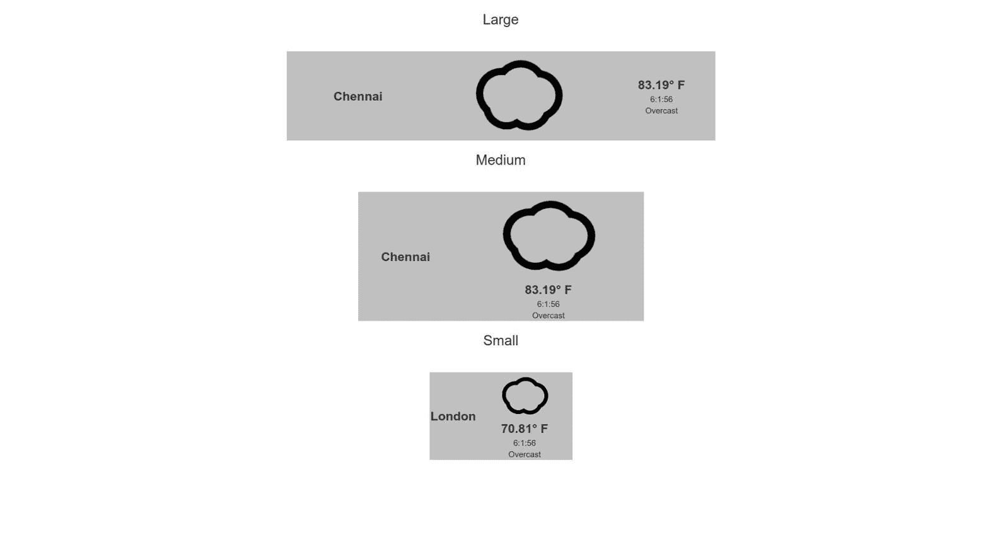
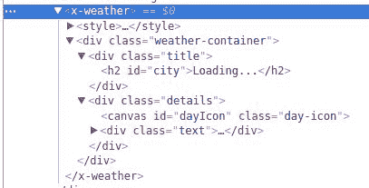
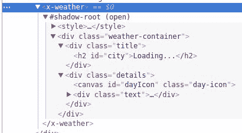

# 第五章：开发天气小部件

嘿！视频通话应用做得不错。希望你已经给你的朋友打了一些电话。在上一章中，我们使用了 SimpleWebRTC 框架构建了一个视频通话应用。知道你可以用 JavaScript 构建所有这些酷炫的应用程序真是太棒了，你可以直接从浏览器访问用户设备的硬件。

到目前为止，你一直在独自构建整个应用程序，所以你对应用程序的结构有完整的了解，比如在 HTML 和 CSS 中使用的类和 ID，以及在 JavaScript 中使用的类、函数和服务。但在现实世界中，你很少是独自工作。如果有的话，你会在由几名成员到数百名开发人员组成的团队中工作。在这种情况下，你将不会对整个 Web 应用程序有完整的了解。

# 你能构建一个天气小部件吗？

所以，你的项目有大约 40 名开发人员在 Web 应用程序的不同部分工作，突然出现了一个新的需求。他们需要在网站的某些区域显示一个天气小部件。天气小部件需要是响应式的，这样它就可以适应 Web 应用程序的任何部分中的任何可用空间。

我们当然可以构建一个天气小部件，但有一个问题。我们对 Web 应用程序的其余部分一无所知！例如，它的 HTML 中使用了哪些类和 ID，因为 CSS 创建的样式总是全局的。如果我们不小心使用了在 Web 应用程序的其他部分中已经使用的类，我们的小部件将继承该 DOM 元素的样式，这是我们真的需要避免的！

另一个问题是我们将创建`<div>`。例如：

```js
<div class="weather-container">
  <div class="temperature-area">
  ....
  </div>
  <div>...</div>
  <div>...</div>
  <!-- 10 more divs -->
</div>
```

除了 CSS 文件和一些 JS 文件，我们还需要所有必要的逻辑来使我们的小部件工作。但是我们要如何将它交付给团队的其他成员呢（假设我们没有希望在小部件中重用任何其他 Web 应用程序中使用的类名或 ID）？

如果它是一个简单的 JavaScript 模块，我们只需构建一个 ES6 模块，团队可以导入和使用，因为 ES6 模块中的变量作用域不会泄漏（你应该只使用`let`和`const`；你真的不想意外地使用`var`创建全局变量）。但对于 HTML 和 CSS 来说情况就不同了。它们的作用域总是全局的，它们总是需要小心处理（你不希望团队中的其他人意外地篡改你的小部件）！

所以，让我们开始吧！我们将考虑一些真正随机（而且酷！）的类名和 ID，用于 DOM 元素，你的团队中没有人能想到，然后编写一个 10 页的`readme`文件，记录天气小部件的工作原理，包括所有的注意事项，然后在我们对小部件进行一些增强和错误修复时，花时间仔细更新`readme`文件。还要记住所有的类名和 ID！

关于最后一段，不！我们绝对不会这样做！我已经开始想象了！相反，我们将学习 web 组件，并编写一个简单的 ES6 模块，应该由你的团队成员导入和使用，然后他们应该在他们的 HTML 文件中简单地添加以下 DOM 元素：

```js
<x-weather></x-weather>
```

就是这样！你需要构建一个 DOM 元素（比如`<input>`、`<p>`和`<div>`元素），它将显示一个天气小部件。`x-weather`是一个新的 HTML5 *自定义元素*，我们将在本章中构建它。它将克服我们在之前方法中可能遇到的所有问题。

# 介绍 web 组件

Web 组件是一组可以一起或分开使用的四种不同技术，用于构建可重用的用户界面小部件。就像我们可以使用 JavaScript 创建可重用模块一样，我们可以使用 Web 组件技术创建可重用的 DOM 元素。构成 Web 组件的四种技术是：

+   自定义元素

+   HTML 模板

+   影子 DOM

+   HTML 导入

Web 组件是为开发人员提供简单 API 以构建高度可重用 DOM 元素而创建的。有许多 JavaScript 库和框架专注于通过将整个 Web 应用程序组织成更简单的组件来提供可重用性，例如 React、Angular、Vue、Polymer 等。在下一章中，我们将通过组合多个独立的 React 组件来构建整个 Web 应用程序。然而，尽管所有可用的框架和库，Web 组件具有很大的优势，因为它们受到浏览器的本地支持，这意味着不需要额外的库来增加小部件的大小。

对于我们的小部件，我们将使用自定义元素和影子 DOM。在开始构建小部件之前，让我们快速了解其他两个，这两个在本章中不会使用。

Web 组件是一个新的标准，所有浏览器供应商都在积极实施。然而，在撰写本书时，*只有 Chrome 支持 Web 组件的所有功能*。如果要检查浏览器是否支持 Web 组件，请访问：[`jonrimmer.github.io/are-we-componentized-yet/`](http://jonrimmer.github.io/are-we-componentized-yet/)。

在本章的项目中，您应该只使用 Chrome，因为其他浏览器尚未完全支持 Web 组件。在本章结束时，我们将讨论如何添加 polyfill 以使 Web 组件在所有浏览器中工作。

# HTML 模板

HTML 模板是一个简单的`<template>`标签，我们可以将其添加到我们的 DOM 中。但是，即使将其添加到我们的 HTML 中，`<template>`元素的内容也不会被呈现。如果它包含任何外部资源，例如图像、CSS 和 JS 文件，它们也不会加载到我们的应用程序中。

因此，模板元素只包含一些 HTML 内容，稍后可以由 JavaScript 使用。例如，假设您有以下模板元素：

```js
<template id="image-template">
  <div>
    <h2>Javascript</h2>
    
  </div>
</template>
```

此元素包含浏览器不会呈现的`div`。但是，我们可以使用 JavaScript 创建该`div`的引用，如下所示：

```js
const $template = document.querySelector('#image-template');
```

现在，我们可以对此引用进行任何更改，并将其添加到我们的 DOM 中。更好的是，我们可以对此元素进行深层复制，以便我们可以在多个地方使用它。深层复制是对象的副本，对副本的更改不会反映在原始对象中。默认情况下，当我们使用`=`运算符进行赋值时，JavaScript 总是对对象进行浅层复制。`$template`是 DOM 元素的浅层复制，我们称之为对 DOM 元素的引用。因此，对`$template`的任何更改都会反映在 DOM 中。但是，如果我们对`$template`进行深层复制，那么对该深层复制的更改将不会反映在 DOM 中，因为它不会影响`$template`。

要对 DOM 元素进行深层克隆，我们可以使用`document.importNode()`方法。它接受两个参数：第一个是它需要克隆的 DOM 元素，第二个是一个布尔值，用于指定是否需要进行深层复制。如果第二个参数为 true，则它将对元素进行深层复制。请参阅以下代码：

```js
const $javascript = document.importNode($template.content, true);
$body.appendChild($javascript);
```

在这里，我对模板元素（`$template.content`）的内容进行了深层复制，并将`$javascript`添加到了 DOM 元素。对`$javascript`的任何修改都不会影响`$template`。

有关更详细的示例，我在 JSFiddle 上设置了一个示例：[`jsfiddle.net/tgf5Lc0v/`](https://jsfiddle.net/tgf5Lc0v/)。请查看它，以查看模板元素的工作方式。

# HTML 导入

HTML 导入很简单。它们允许你以与包含 CSS 和 JS 文件相同的方式在一个 HTML 文档中导入另一个 HTML 文档。导入语句如下所示：

```js
<link rel="import" href="file.html">
```

在我们不使用 Webpack 等构建工具的环境中，HTML 导入有很多好处；例如，为跨 Web 应用程序使用 Web 组件提供了便利。

有关使用 HTML 导入功能的更多信息，请参考 html5rocks 教程：[`www.html5rocks.com/en/tutorials/webcomponents/imports/`](https://www.html5rocks.com/en/tutorials/webcomponents/imports/)。

我们不使用 HTML 模板和 HTML 导入在我们的天气小部件中的主要原因是它们更专注于与 HTML 文件一起使用。我们将在本章中使用的构建系统（Webpack）更适合 JavaScript 文件。因此，我们将继续学习本章的其余部分，了解自定义元素和影子 DOM。

# 构建天气小部件

在本章中，我们需要一个服务器来获取给定位置的天气信息。在浏览器中，我们可以使用 navigator 对象来检索用户的确切地理位置（`纬度`和`经度`）。然后，使用这些坐标，我们需要找到该地区的名称和其天气信息。为此，我们需要使用第三方天气提供商和我们在第三章*，事件注册应用*中使用的谷歌地图 API。我们在这个项目中将使用的天气提供商是**Dark Sky**。

让我们为天气小部件设置服务器。打开书中代码的`Chapter05\Server`目录。在服务器目录内，首先运行`npm install`来安装所有依赖项。你需要获取 Dark Sky 和谷歌地图的 API 密钥。你可能已经有了谷歌地图 API 密钥，因为我们最近使用过它。为了为这两项服务生成 API 密钥，执行以下操作：

+   **Dark Sky**：在[`darksky.net/dev/`](https://darksky.net/dev/)注册一个免费帐户，然后你将获得一个秘钥。

+   **谷歌地图**：按照提供的步骤进行操作：[`developers.google.com/maps/documentation/javascript/get-api-key`](https://developers.google.com/maps/documentation/javascript/get-api-key)。

一旦你获得了这两个密钥，就在`Server`根目录内创建一个`.env`文件，并以以下格式将密钥添加到其中：

```js
DARK_SKY_KEY=DarkSkySecretKey
GMAP_KEY=GoogleMapAPIKey
```

添加完密钥后，从`Server`根目录在终端中运行`npm start`来启动服务器。服务器将在`http://localhost:3000/` URL 上运行。

我们已经准备好服务器。让我们为项目设置起始文件。打开`Chapter05\Starter`文件夹，然后在该目录内运行`npm install`来安装所有依赖项。在项目根目录中创建一个`.env`文件，并在其中添加以下行：

```js
NODE_ENV=dev
SERVER_URL=http://localhost:3000
```

就像我们在上一章中所做的那样，我们应该设置`NODE_ENV=production`来生成生产构建。`SERVER_URL`将包含我们刚刚设置的项目服务器的 URL。`NODE_ENV`和`SERVER_URL`将作为全局变量在我们应用程序的 JavaScript 代码中可用（我已经在`webpack.config.js`中使用了 Webpack 定义的插件）。

最后，在终端中执行`npm run watch`来启动 Webpack 开发服务器。你的项目将在`http://localhost:8080/`上运行（项目 URL 将在终端中打印出来）。目前，Web 应用将显示三个文本：大、中、小。它有三个不同大小的容器，将容纳天气小部件。项目结束时，天气小部件将如下所示：



# 天气小部件的工作

让我们规划一下我们的天气小部件的工作。由于我们的天气小部件是一个 HTML 自定义元素，它应该像其他原生 HTML 元素一样工作。例如，考虑`<input>`元素：

```js
<input type="text" name="username">
```

这将呈现一个普通的文本输入。但是，我们可以使用相同的`<input>`元素，具有不同的属性，如下所示：

```js
<input type="password" name="password">
```

它将呈现一个密码字段，而不是将所有输入文本内容隐藏的文本字段。同样，对于我们的天气小部件，我们需要显示给定位置的当前天气状况。确定用户位置的最佳方法是使用 HTML5 地理位置，它将直接从浏览器中获取用户当前的纬度和经度信息。

但是，我们应该使我们的小部件可定制给其他开发人员。他们可能希望手动为我们的天气小部件设置位置。因此，我们将把检索位置的逻辑留给其他开发人员。相反，我们可以手动接受`纬度`和`经度`作为天气小部件的属性。我们的天气元素将如下所示：

```js
<x-weather latitude="40.7128" longitude="74.0059" />
```

现在，我们可以从各自的属性中读取`纬度`和`经度`，并在我们的小部件中设置天气信息，其他开发人员可以通过简单地更改`纬度`和`经度`属性的值来轻松定制位置。

# 检索地理位置

在开始构建小部件之前，让我们看一下检索用户地理位置的步骤。在您的`src/js/home.js`文件中，您应该看到一个导入语句，该语句将 CSS 导入 Web 应用程序。在该导入语句下面，添加以下代码：

```js
window.addEventListener('load', () => {
  getLocation();
});

function getLocation() {
}
```

当页面加载完成时，这将调用`getLocation()`函数。在此函数内部，我们必须首先检查浏览器中是否可用`navigator.geolocation`方法。如果可用，我们可以使用`navigator.geolocation.getCurrentPosition()`方法来检索用户的地理位置。此方法接受两个函数作为参数。当成功检索位置时，将调用第一个函数，如果无法检索位置，则调用第二个函数。

在您的`home.js`文件中，添加以下函数：

```js
function getLocation() {
  if (navigator.geolocation) {
    navigator.geolocation.getCurrentPosition(showPosition, errorPosition);
  } else {
    console.error("Geolocation is not supported by this browser.");
  }
}

function showPosition(position) {
  const latitude = position.coords.latitude;
  const longitude = position.coords.longitude;

  console.log(latitude);
  console.log(longitude);
}

function errorPosition(error) {
  console.error(error);
}
```

在 Chrome 中打开应用程序。页面应该要求您允许访问您的位置，就像在上一章中访问摄像头和麦克风一样。如果单击“允许”，您应该在 Chrome 的控制台中看到您当前的`纬度`和`经度`。

上述代码执行以下操作：

+   首先，`getLocation()`函数将使用`navigator.getlocation.getCurrentPosition(showPosition, errorPosition)`方法获取用户的位置。

+   如果页面请求权限时单击“允许”，则会调用`showPosition`函数，并将`position`对象作为参数。

+   如果您单击“Block”，则会调用`errorPosition`函数，并将`error`对象作为参数。

+   `position`对象包含用户的纬度和经度，位于`position.coords`属性中。此函数将在控制台中打印纬度和经度。

有关使用地理位置的更多信息，请参阅 MDN 页面：[`developer.mozilla.org/en-US/docs/Web/API/Geolocation/Using_geolocation`](https://developer.mozilla.org/en-US/docs/Web/API/Geolocation/Using_geolocation)。

# 创建天气自定义元素

我们已经获得了地理位置。因此，让我们开始创建自定义元素。当前，您的文件夹结构将如下所示：

```js
.
├── index.html
├── package.json
├── src
│   ├── css
│   │   └── styles.css
│   └── js
│       └── home.js
└── webpack.config.js
```

我们希望保持我们的自定义元素独立于其他 JavaScript 模块。在`src/js`目录中，创建一个文件，路径为`CustomElements/Weather/Weather.js`。请注意，我在文件夹和文件名（PascalCase）中使用了大写字母。您可以对文件和文件夹使用 PascalCase，这将导出整个类。这仅用于在项目文件夹中轻松识别类，并不需要严格遵循规则。

现在，您的文件夹结构将变为：

```js
.
├── index.html
├── package.json
├── src
│   ├── css
│   │   └── styles.css
│   └── js
│       ├── CustomElements
│       │   └── Weather
│       │       └── Weather.js
│       └── home.js
└── webpack.config.js
```

在 VSCode 中打开`Weather.js`文件。所有原生 HTML 元素都是使用`HTMLElement`类（接口）直接实现的，或者通过继承它的接口实现的。对于我们的自定义天气元素，我们需要创建一个扩展`HTMLElement`的类。通过扩展一个类，我们可以继承父类的属性和方法。在您的`Weather.js`文件中，编写以下代码：

```js
class Weather extends HTMLElement {

}
```

根据自定义元素 v1 规范，自定义元素应该直接从`HTMLElement`扩展，只使用一个类。然而，我们正在使用带有`env`预设的`babel-loader`，它将所有类转换为函数。这将导致自定义元素出现问题，因为它们需要是类。但是有一个插件可以用来解决这个问题：*transform-custom-element-classes*。我已经在您的`webpack.config.js`文件中添加了这个插件，这样您在本章中就不会遇到任何问题。您可以在 Webpack 配置文件的`.js`规则部分找到它。

让我们在`Weather`类的构造函数中声明初始类变量：

```js
Class Weather extends HTMLElement {

  constructor() {
    super();

    this.latitude = this.getAttribute('latitude');
    this.longitude = this.getAttribute('longitude');
  }

}
```

请注意，在构造函数的第一行，我调用了`super()`方法。这将调用父类`HTMLElement`的构造函数。每当您的类扩展另一个类时，始终在您的类构造函数中添加`super()`。这样，父类在您的类方法开始工作之前也会被初始化。

两个类变量（属性）`this.latitude`和`this.longitude`将使用`this.getAttribute()`方法从自定义天气元素的`lat`和`long`属性中获取值。

我们还需要为我们的自定义元素添加 HTML。由于`Weather`类类似于我们之前使用的 DOM 元素的引用，`this.innerHTML`可用于为天气元素添加 HTML。在构造函数中，添加以下行：

```js
this.innerHTML = ` `;
```

现在，`this.innerHTML`是一个空的模板字符串。我已经创建了自定义元素所需的 HTML 和 CSS。您可以在书籍代码的`Chapter 05\WeatherTemplate`目录中找到它。复制`weather-template.html`文件的内容，并将其粘贴到模板字符串中。

# 测试自定义元素

我们的自定义元素现在包含了显示内容所需的 HTML。让我们来测试一下。在您的`Weather.js`文件末尾，添加以下行：

```js
export default Weather;
```

这将导出整个`Weather`类，并使其可用于在其他模块中使用。我们需要将其导入到我们的`home.js`文件中。在您的`home.js`文件中，在顶部添加以下代码：

```js
import Weather from './CustomElements/Weather/Weather';
```

接下来，我们需要定义自定义元素，也就是将自定义元素与标签名称关联起来。理想情况下，我们想要称呼我们的元素为`<weather>`。这样会很好！但根据自定义元素规范，我们应该给元素命名，使其在名称中有一个破折号`-`。因此，为了简单起见，我们将我们的元素称为`<x-weather>`。这样，每当我们看到一个以`x-`为前缀的元素，我们立刻知道它是一个自定义元素。

`customElements.define()`方法用于定义自定义元素。`customElements`可用于全局`window`对象。它接受两个参数：

+   第一个参数是一个字符串，应该包含自定义元素名称

+   第二个参数应该包含实现自定义元素的类

在`home.js`中添加的用于获取地理位置的窗口加载事件侦听器的回调函数中，添加`customElements.define('x-weather', Weather)`。`window.addEventListener`现在将如下所示：

```js
window.addEventListener('load', () => {
  customElements.define('x-weather', Weather);
  getLocation();
});
```

让我们将自定义元素添加到我们的`index.html`文件中。在您的`index.html`文件中，在`div.large-container`元素内添加以下行：

```js
<x-weather />
```

由于这是 HTML 文件的更改，您必须在 Chrome 中手动重新加载页面。现在，您应该会得到一个显示加载消息的天气小部件，如下所示：


如果您使用 Chrome DevTools 检查元素，它应该结构如下：



如您所见，您的 HTML 现在附加在自定义元素内部，以及样式。但是，我们在这里面临一个严重的问题。样式的范围始终是*全局*的。这意味着，如果有人在页面的 CSS 中为`.title`类添加样式，比如`color: red;`，它也会影响我们的天气小部件！或者，如果我们在小部件内部添加样式到页面中使用的任何类，比如`.large-container`，它将影响整个页面！我们真的不希望发生这种情况。为了解决这个问题，让我们学习 Web 组件的最后一个剩下的主题。

# 附加影子 DOM

影子 DOM 提供了 DOM 和 CSS 之间的封装。影子 DOM 可以附加到任何元素，附加影子 DOM 的元素称为影子根。影子 DOM 被视为与 DOM 树的其余部分分开；因此，影子根外部的样式不会影响影子 DOM，反之亦然。

要将影子 DOM 附加到元素，我们只需要在该元素上使用`attachShadow()`方法。看下面的例子：

```js
const $shadowDom = $element.attachShadow({mode: 'open'});
$shadowDom.innerHTML = `<h2>A shadow Element</h2>`;
```

在这里，首先，我将一个名为`$shadowDom`的影子 DOM 附加到`$element`。之后，我向`$shadowDom`添加了一些 HTML。请注意，我在`attachShadow()`方法中使用了参数`{mode: 'open'}`。如果使用`{mode: 'closed'}`，则无法从 JavaScript 中的影子根访问影子 DOM，其他开发人员将无法使用 JavaScript 从 DOM 中操作我们的元素。

我们需要开发人员使用 JavaScript 来操作我们的元素，以便他们可以为天气小部件设置地理位置。通常，广泛使用开放模式。仅当您希望完全阻止其他人对您的元素进行更改时，才使用关闭模式。

要将影子 DOM 添加到我们的自定义天气元素，请执行以下步骤：

1.  将影子 DOM 附加到我们的自定义元素。这可以通过在构造函数中添加以下行来完成：

```js
this.$shadowRoot = this.attachShadow({mode: 'open'});
```

1.  将`this.innerHTML`替换为`this.$shadowRoot.innerHTML`，您的代码现在应如下所示：

```js
this.$shadowRoot.innerHTML = ` <!--Weather template> `;
```

1.  在 Chrome 中打开页面。您应该看到相同的天气小部件；但是，如果使用 Chrome DevTools 检查元素，则 DOM 树将结构如下：



你可以看到`<x-weather>`元素的内容将通过将`x-weather`指定为影子根与 DOM 的其余部分分离。此外，天气元素内部定义的样式不会泄漏到 DOM 的其余部分，而影子 DOM 外部的样式也不会影响我们的天气元素。

通常，要访问元素的影子 DOM，可以使用该元素的`shadowRoot`属性。例如：

```js
const $weather = document.querySelector('x-weather');
console.log($weather.shadowRoot);
```

这将在控制台中打印附加到影子根的整个影子 DOM。但是，如果您的影子根是*closed*，那么它将简单地打印`null`。

# 使用自定义元素

我们现在已经准备好了天气小部件的 UI。我们的下一步是从服务器检索数据并在天气小部件中显示它。通常，小部件，例如我们的天气小部件，不会直接出现在 HTML 中。就像我们第一章中的任务*构建待办事项列表*一样，开发人员通常会从 JavaScript 中创建元素，附加属性，并将其附加到 DOM 中。此外，如果他们需要进行任何更改，例如更改地理位置，他们将使用 JavaScript 中对元素的引用来修改其属性。

这是非常常见的，我们在所有项目中都以这种方式修改了许多 DOM 元素。现在，我们的自定义天气元素也将期望同样的行为。我们从中扩展了我们的`Weather`类的`HTMLElement`接口为我们的`Weather`类提供了称为生命周期回调的特殊方法。生命周期回调是在发生某个事件时调用的方法。

对于自定义元素，有四个生命周期回调方法可用：

+   `connectedCallback()`: 当元素插入 DOM 或影子 DOM 时调用此方法。

+   `attributeChangedCallback(attributeName, oldValue, newValue, namespace)`: 当元素的观察属性被修改时调用此方法。

+   `disconnectedCallback()`: 当元素从 DOM 或影子 DOM 中移除时调用此方法。

+   `adoptedCallback(oldDocument, newDocument)`: 当元素被采用到新的 DOM 中时调用此方法。

对于我们的自定义元素，我们将使用前三个回调方法。*从*您的`index.html`文件中删除`<x-weather />`元素。我们将从我们的 JavaScript 代码中添加它。

在您的`home.js`文件中，在`showPosition()`函数内，创建一个名为：`createWeatherElement()`的新函数。此函数应接受一个类名（HTML 类属性）作为参数，并创建一个具有该类名的天气元素。我们已经在`latitude`和`longitude`常量中有地理位置信息。`showPosition()`函数的代码如下：

```js
function showPosition() {
  ...
  function createWeatherElement(className) {
    const $weather = document.createElement('x-weather');
    $weather.setAttribute('latitude', latitude);
    $weather.setAttribute('longitude', longitude);
    $weather.setAttribute('class', className);
    return $weather;
  };
}
```

此函数将返回一个具有三个属性的天气元素，在 DOM 中看起来如下片段：

```js
<x-weather latitude="13.0827" longitude="80.2707" class="small-widget"></x-weather>
```

要在所有大、中、小容器中添加天气小部件，请在前面的函数之后添加以下代码：

```js
const $largeContainer = document.querySelector('.large-container');
const $mediumContainer = document.querySelector('.medium-container');
const $smallContainer = document.querySelector('.small-container');

$largeContainer.appendChild(createWeatherElement('large'));
$mediumContainer.appendChild(createWeatherElement('medium'));
$smallContainer.appendChild(createWeatherElement('small'));
```

您应该看到天气小部件附加到所有三个不同大小的容器上。我们的最终小部件应该如下所示：


天气小部件包含以下详细信息：

+   城市名

+   天气图标

+   温度

+   时间（*小时***:***分钟***:***秒*）

+   天气状态摘要（*阴天*）

# 添加依赖模块

我们的天气小部件需要向服务器发出 HTTP 请求。为此，我们可以重用我们之前在第三章中构建的 APICall 模块。此外，由于我们将使用 Dark Sky 服务来显示天气信息，我们可以使用他们的图标库 Skycons 来显示天气图标。目前，Skycons 在 npm 中不可用。您可以从书中的`Chapter05\weatherdependencies`目录或完成的代码文件中获取这两个文件。

目前，您的 JS 文件夹结构如下：

```js
.
├── CustomElements
│   └── Weather
│       └── Weather.js
└── home.js
```

您应该在`CustomElements/Weather/services/api/apiCall.js`路径下添加`apiCall.js`文件，并在`CustomElements/Weather/lib/skycons.js`路径下添加`skycons.js`文件。您的 JS 文件夹现在应该如下所示：

```js
.
├── CustomElements
│   └── Weather
│       ├── lib
│       │   └── skycons.js
│       ├── services
│       │   └── api
│       │       └── apiCall.js
│       └── Weather.js
└── home.js
```

# 检索和显示天气信息

在您的`weather.js`文件中，在顶部添加以下导入语句：

```js
import apiCall from './services/api/apiCall';
import './lib/skycons';
```

Skycons 库将向 window 对象添加一个全局变量`Skycons`。它用于在画布元素中显示一个动画**可伸缩矢量图形**（**SVG**）图标。目前，所有的类变量，比如`latitude`和`longitude`，都是在构造函数中创建的。但是，最好只在天气小部件添加到 DOM 时才创建它们。让我们将变量移到`connectedCallback()`方法中，这样变量只有在小部件添加到 DOM 时才会被创建。您的`Weather`类现在应该如下所示：

```js
class Weather extends HTMLElement {
  constructor() {
    this.$shadowRoot = this.attachShadow({mode: 'open'});
    this.$shadowRoot.innerHTML = ` <!-- Weather widget HTML --> `;
  }

  connectedCallback() {
    this.latitude = this.getAttribute('latitude');
    this.longitude = this.getAttribute('longitude');
  }
}
```

就像我们在之前的章节中在 DOM 中创建元素的引用一样，让我们在天气小部件的影子 DOM 中创建对元素的引用。在`connectedCallback()`方法内部，添加以下代码：

```js
this.$icon = this.$shadowRoot.querySelector('#dayIcon');
this.$city = this.$shadowRoot.querySelector('#city');
this.$temperature = this.$shadowRoot.querySelector('#temperature');
this.$summary = this.$shadowRoot.querySelector('#summary');
```

启动本章附带的服务器，并让它在`http://localhost:3000/` URL 上运行。用于检索天气信息的 API 端点如下：

```js
http://localhost:3000/getWeather/:lat,long
```

这里，`lat`和`long`是纬度和经度值。如果您的（`lat`，`long`）值为（`13.1358854`，`80.286841`），那么您的请求 URL 将如下所示：

```js
http://localhost:3000/getWeather/13.1358854,80.286841
```

API 端点的响应格式如下：

```js
{
  "latitude": 13.1358854,
  "longitude": 80.286841,
  "timezone": "Asia/Kolkata",
  "offset": 5.5,
  "currently": {
    "summary": "Overcast",
    "icon": "cloudy",
    "temperature": 88.97,
    // More information about current weather
    ...
  },
  "city": "Chennai"
}
```

要在天气小部件中设置天气信息，创建一个新的方法在`Weather`类内部`setWeather()`，并添加以下代码：

```js
setWeather() {
  if(this.latitude && this.longitude) {
    apiCall(`getWeather/${this.latitude},${this.longitude}`, {}, 'GET')
      .then(response => {
        this.$city.textContent = response.city;
        this.$temperature.textContent = `${response.currently.temperature}° F`;
        this.$summary.textContent = response.currently.summary;

        const skycons = new Skycons({"color": "black"});
        skycons.add(this.$icon, Skycons[response.currently.icon.toUpperCase().replace(/-/g,"_")]);
        skycons.play();
      })
      .catch(console.error);
    }
  }
```

还要在`connectedCallback()`方法的末尾添加`this.setWeather()`来调用前面的方法。在 Chrome 中打开页面，您应该看到天气小部件按预期工作！您将能够看到城市名称、天气信息和天气图标。`setWeather()`方法的工作方式很简单，如下所示：

+   首先，它将检查纬度和经度是否都可用。否则，将无法进行 HTTP 请求。

+   使用`apiCall`模块，进行 GET 请求并在`Promise.then()`链中获得`response`。

+   从 HTTP 请求的`response`中，所需的数据，如城市名称、温度和摘要，都包含在相应的 DOM 元素中。

+   对于天气图标，全局`Skycons`变量是一个构造函数，它创建一个具有特定颜色的所有图标的对象。在我们的情况下，是黑色。构造函数的实例存储在`skycons`对象中。

+   为了添加动画图标，我们使用`add`方法，将 canvas 元素（`this.$icon`）作为第一个参数，将图标名称作为第二个参数以所需的格式传入。例如，如果 API 中的图标值是`cloudy-day`，则相应的图标是`Skycons['CLOUDY_DAY']`。为此，我们首先将整个字符串转换为大写，并使用正则表达式`.replace(/-/g, "_")`将`-`替换为`_`。

# 将当前时间添加到小部件中

我们的小部件中仍然缺少时间。与其他值不同，时间不依赖于 HTTP 请求，但需要每秒自动更新。在您的天气类中，添加以下方法：

```js
displayTime() {
  const date = new Date();
  const displayTime = `${date.getHours()}:${date.getMinutes()}:${date.getSeconds()}`;
  const $time = this.$shadowRoot.querySelector('#time');
  $time.textContent = displayTime;
}
```

`displayTime()`方法执行以下操作：

+   使用`new Date()`构造函数创建一个日期对象。`new Date()`构造函数使用传递的日期和时间的所有详细信息创建一个`date`对象。如果没有传递参数，它将创建一个包含有关当前日期和时间的所有信息（直到毫秒）的对象。在我们的情况下，因为我们没有传递任何参数，它包含了初始化时刻的所有日期和时间的详细信息。

+   我们从日期对象中获取小时、分钟和秒。通过使用模板字符串，我们简单地按照所需的格式构建了时间，并将其存储在`displayTime`常量中。

+   最后，将时间设置为阴影 DOM 中*p#time*（`$time`）元素的文本内容。

日期对象是一个重要的概念，是 JavaScript 中日常软件开发的一部分。要了解有关日期对象的更多信息，请参考 w3schools 页面：[`www.w3schools.com/js/js_dates.asp`](https://www.w3schools.com/js/js_dates.asp)。

这个方法用于设置时间一次，但我们需要每秒执行一次这个方法，这样用户就可以在小部件中看到确切的时间。JavaScript 有一个叫做`setInterval()`的方法。它用于在特定的时间间隔内重复执行一个函数。`setInterval()`方法接受两个参数：

+   第一个是需要在特定时间间隔内执行的函数

+   第二个是以毫秒为单位的时间间隔

然而，`setInterval()`会重复执行函数，即使 DOM 元素由于某种原因被从 DOM 中移除。为了克服这一点，您应该将`setInterval()`存储在一个变量中，然后使用`disconnectedCallback()`方法来执行`clearInterval(intervalVariable)`，这将清除间隔函数。

为了实现这一点，使用以下代码：

```js
connectedCallback() {
  ...
  this.ticker = setInterval(this.displayTime.bind(this), 1000);
}

disconnectedCallback() {
  clearInterval(this.ticker);
}
```

在 Chrome 中打开天气小部件，您应该看到小部件中的当前时间每秒更新一次，这对用户来说看起来很正常。

# 响应元素属性的更改

我们有一个完全工作的天气小部件，但是只有在第一次将小部件添加到 DOM 时才会加载天气信息。如果您尝试从 Chrome DevTools 或 JavaScript 更改`latitude`和`longitude`属性的值，值会更改，但是天气小部件不会得到更新。为了使天气元素响应`latitude`和`longitude`的更改，我们需要将它们声明为观察属性。为此，请在您的`Weather`类中添加以下行：

```js
static get observedAttributes() { return ['latitude', 'longitude']; }
```

这将创建一个静态`getter` `observedAttributes()`，它将返回一个数组，其中包含天气小部件应监听更改的所有属性名称。静态方法是`Class`的特殊方法，可以在不创建类实例对象的情况下访问。对于所有其他方法，我们需要创建类的新实例（对象）；否则，我们将无法访问它们。由于静态方法不需要实例，这些方法内部的`this`对象将在这些方法内部为*undefined*。

静态方法用于保存与类相关的常见（独立的类变量和方法）函数，可以在类外的其他地方使用。

由于我们将`latitude`和`longitude`标记为观察属性，因此每当它们使用任何方法进行修改时，它都会触发`attributeChangedCallback()`，并将修改后的属性名称以及该属性的旧值和新值作为参数。因此，让我们在`Weather`类中添加`attributeChangedCallback()`：

```js
attributeChangedCallback(attr, oldValue, newValue) {
  if (attr === 'latitude' && oldValue !== newValue) {
    this.latitude = newValue;
    this.setWeather();
  }
  if(attr === 'longitude' && oldValue !== newValue) {
    this.longitude = newValue;
    this.setWeather();
  }
}
```

这种方法很简单。每当`latitude`或`longitude`属性的值发生变化时，它都会更新相应的类变量并调用`this.setWeather()`来将天气更新到新的地理位置。您可以通过直接在 Chrome DevTools 的 DOM 树中编辑天气小部件的属性来测试这一点。

# 使用`setters`和`getters`

我们在创建对 DOM 元素的引用时经常使用`setters`和`getters`。如果我们有一个对天气自定义元素的引用，我们只需按如下方式设置或获取`latitude`或`longitude`：

```js
currentLatitude = $weather.lat;
$weather.lat = newLatitude;
```

在这种情况下，如果我们设置了新的`latitude`或`longitude`，我们需要小部件进行更新。为此，请将以下`setters`和`getters`添加到您的`Weather`类中：

```js
get long() {
  return this.longitude;
}

set long(long) {
  this.longitude = long;
  this.setWeather();
}

get lat() {
  return this.latitude;
}

set lat(lat) {
  this.latitude = lat;
  this.setWeather();
}
```

为了测试`setters`和`getters`是否正常工作，让我们删除（或注释掉）将天气小部件附加到`$smallContainer`的行。而是添加以下代码：

```js
const  $small  =  createWeatherElement('small'); $smallContainer.appendChild($small); setTimeout(() => { console.log($small.lat, $small.long);
 $small.lat  =  51.5074;
 $small.long  =  0.1278;
 console.log($small.lat, $small.long); }, 10000);
```

您应该看到在 10 秒后，小容器中的天气会自动更改为伦敦。旧的和新的地理位置也将打印在 Chrome DevTools 控制台中。

您已成功完成了天气小部件！在将其用于您的项目之前，您需要添加 polyfills，因为在撰写本书时，只有 Chrome 支持 Web 组件的所有功能。

# 修复浏览器兼容性

为了改进我们的天气小部件的浏览器兼容性，我们需要`webcomponents.js`库提供的一组 polyfills，位于：[`github.com/webcomponents/webcomponentsjs`](https://github.com/webcomponents/webcomponentsjs) 存储库中。这些 polyfills 使我们的小部件与大多数现代浏览器兼容。要将这些 polyfills 添加到我们的项目中，首先从项目根文件夹中的终端运行以下命令：

```js
npm install -S webcomponents.js
```

这将安装并将`webcomponents.js`添加到我们的项目依赖项中。之后，在您的`home.js`文件中导入它：

```js
import  'webcomponents.js';
```

目前，我们正在监听窗口加载事件后初始化项目。`Webcomponents.js`异步加载 polyfills，并且一旦准备就绪，它将触发`'WebComponentsReady'`事件。因此，我们现在应该监听这个新事件，而不是加载事件：

```js
window.addEventListener('WebComponentsReady', () => {
  customElements.define('x-weather', Weather);
  getLocation();
});
```

现在，对于最后一部分，您需要记录如何在`readme`文件中使用天气自定义元素和 Web 组件 polyfill，以便团队的其余成员知道如何将其添加到项目中。但这次，`readme`文档将不到一页，并且应该简单易于维护！我会把`readme`部分留给您。我打赌您已经在庆祝第五章的完成了。

# 需要了解的基本事项

这些是一些在使用自定义元素时会派上用场的事情。就像我们扩展了一般的`HTMLElement`接口一样，我们也可以扩展内置元素，比如段落元素`<p>`，按钮元素`<button>`等等。这样，我们可以继承父元素中可用的所有属性和方法。例如，要扩展按钮元素，可以按照以下步骤进行：

```js
class PlasticButton extends HTMLButtonElement {
  constructor() {
    super();

    this.addEventListener("click", () => {
      // Draw some fancy animation effects!
    });
  }
}
```

在这里，我们扩展了`HTMLButtonElement`接口，而不是`HTMLElement`接口。同样，就像内置元素可以被扩展一样，自定义元素也可以被扩展，这意味着我们可以通过扩展我们的天气小部件类来创建另一种类型的小部件。

尽管 JavaScript 现在支持类和扩展类，但它还不支持私有或受保护的类变量和方法，就像其他面向对象的语言一样。目前，所有的类变量和方法都是公共的。一些开发人员在需要私有变量和方法时在变量和方法前面添加下划线'_'前缀，以防止在扩展类中意外使用它们。

如果您对更多地使用 Web 组件感兴趣，您可能应该查看以下库，这些库旨在改进使用内置 polyfills 的 Web 组件的可用性和工作流程：

+   Polymer: [`www.polymer-project.org/`](https://www.polymer-project.org/)

+   X-Tag: [`x-tag.github.io/`](https://x-tag.github.io/)

要了解有关扩展内置 HTML 元素的更多信息，请参考 Google 开发者页面上的以下教程：[`developers.google.com/web/fundamentals/getting-started/primers/customelements`](https://developers.google.com/web/fundamentals/getting-started/primers/customelements)。

# 总结

在本章中，您为团队构建了一个天气小部件，同时学习了有关 Web 组件的知识。您创建了一个可重用的 HTML 自定义元素，它使用影子 DOM 来将 CSS 与文档的其余部分分离，使小部件可以轻松地插入到项目的其余部分中。您还学习了一些方法，比如地理位置和设置间隔。但在本章中，您学到的最重要的事情是在团队环境中创建独立组件的优势。通过创建可重用的天气组件，您为自己和团队的其余成员简化了工作。

到目前为止，我们一直在使用纯 JavaScript。然而，今天有许多现代框架和库，使得使用 JavaScript 进行编程更加简单，高效，并且可扩展到很大程度。大多数框架都集中于将整个应用程序组织成更小、独立和可重用的组件，这正如我们在本章中体验到的 Web 组件一样。在下一章中，我们将使用 Facebook 创建的强大 UI 库**React.js**来构建整个应用程序。
