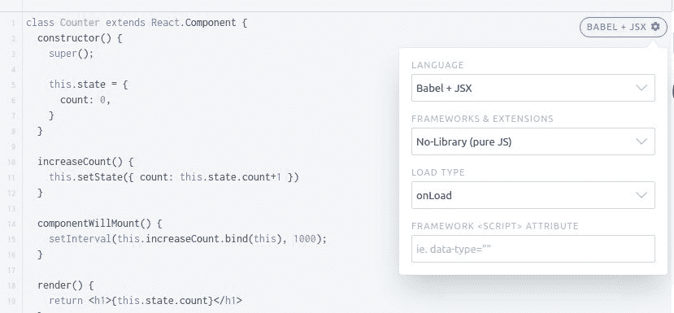
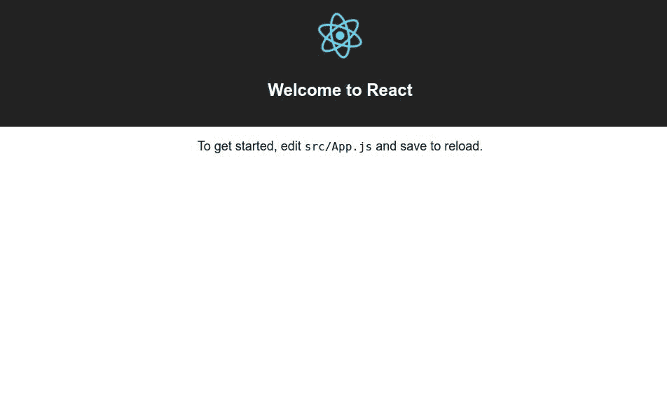
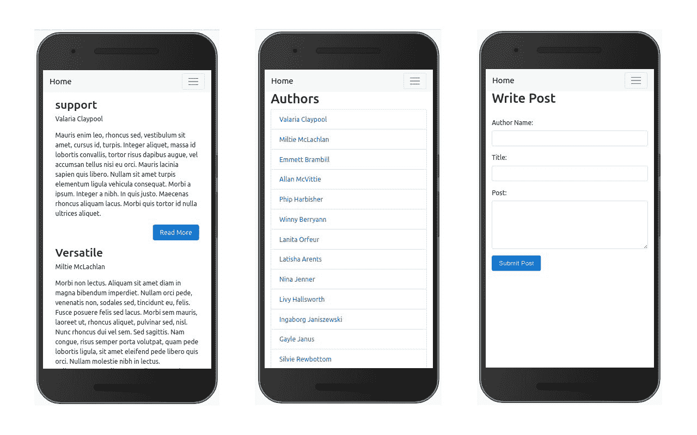
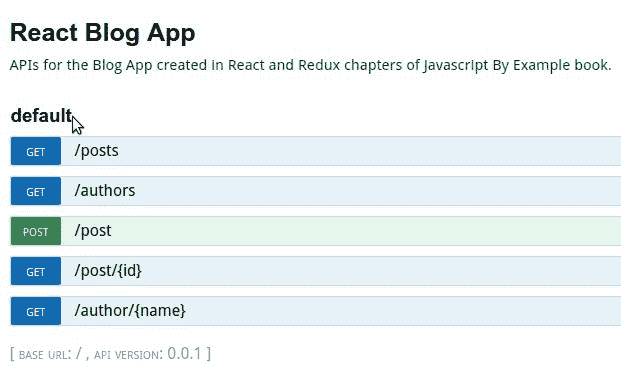
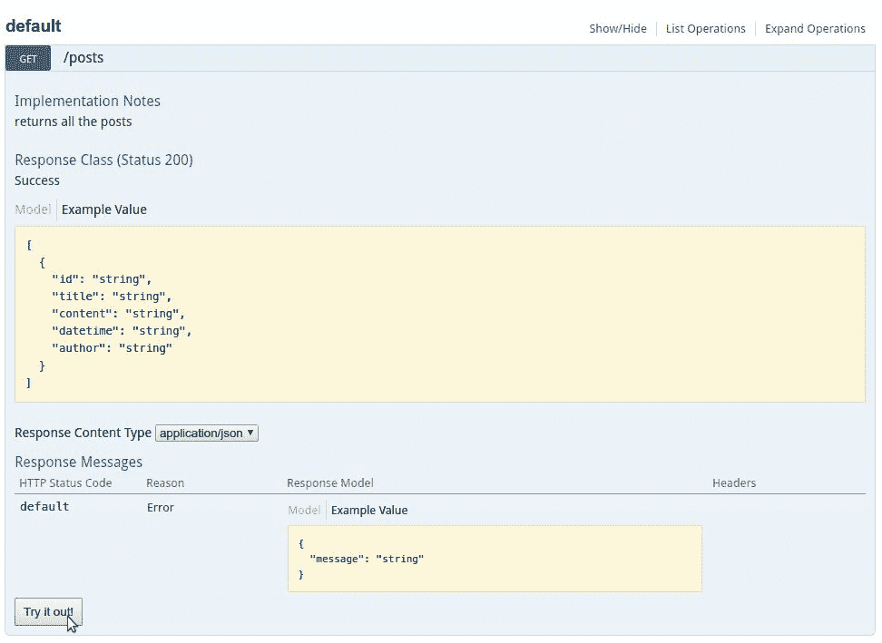
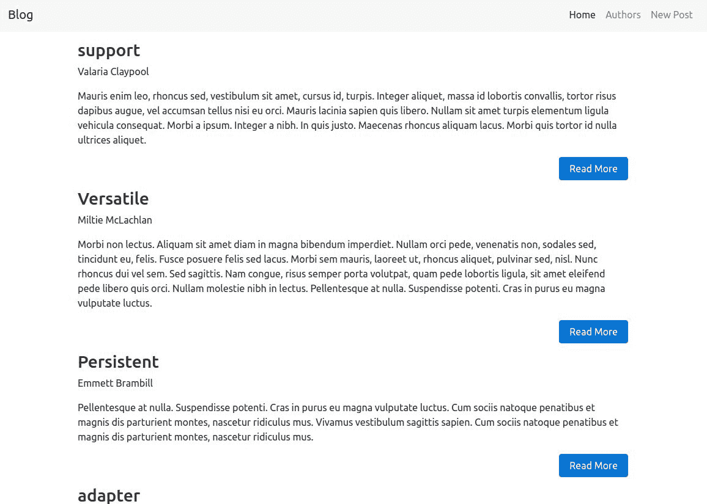

# 第六章：使用 React 构建博客

嘿！做到了书的最后一节，你将学习 Facebook 的 React 库。在我们开始本章之前，让我们回顾一下你在书中的学习之旅：

+   你首先使用 JavaScript 的 ES6 语法构建了一个简单的待办事项应用，然后创建了一个构建脚本将其编译为 ES5，以便与旧版浏览器兼容。

+   然后，在设置自己的自动化开发环境的同时，你构建了一个 Meme Creator，学习了许多新概念和工具。

+   接下来，你使用开发环境构建了一个活动注册应用程序，在其中构建了你的第一个可重用的 JavaScript 模块，用于 API 调用和表单验证。

+   然后，你利用 JavaScript WebAPI 的强大功能构建了一个使用 WebRTC 的点对点视频通话应用程序。

+   最后，你构建了自己的 HTML5 自定义元素，它将显示一个天气小部件，并可以轻松导入和在其他项目中使用。

从初学者级别开始，你构建了一些非常棒的应用程序，现在你熟悉了现代 JavaScript 的许多重要概念。现在，是时候利用这些技能学习 JavaScript 框架了，这将加速你的开发过程。本章将重点帮助你开始使用 React。

# 为什么使用框架？

现代应用程序开发都是关于速度、可维护性和可扩展性的。鉴于 Web 是许多应用程序的主要平台，对于任何 Web 应用程序都会有相同的期望。JavaScript 可能是一种很棒的语言，但在团队环境中处理大型应用程序时，编写纯 JavaScript 有时可能是一个繁琐的过程。

在这样的应用程序中，你将不得不操作大量的 DOM 元素。每当你更改 DOM 元素的 CSS 时，它被称为重绘。这将影响元素在浏览器上的显示。每当你在 DOM 中删除、更改或添加一个元素时，这被称为回流。父元素的回流也会导致其所有子元素的回流。重绘和回流是昂贵的操作，因为它们是同步的。这意味着当重绘或回流发生时，JavaScript 将无法在那个时候运行。这将导致 Web 应用程序的延迟或缓慢执行（特别是在较小的设备上，如低端智能手机）。到目前为止，我们一直在构建非常小的应用程序；因此，我们还没有注意到任何性能问题，但对于像 Facebook 这样的应用程序来说，这是至关重要的（有成千上万的 DOM 元素）。

此外，编写大量的 JavaScript 代码意味着增加代码文件的大小。对于依赖 3G 或更低连接的移动用户来说，这意味着你的应用程序加载时间会更长。这会导致糟糕的用户体验。

最后，前端 JavaScript 代码需要处理大量的副作用（例如点击、滚动、悬停和网络请求等事件）。在团队环境中工作时，每个开发人员都应该知道你的代码处理的是什么类型的副作用。当 Web 应用程序增长时，每个副作用都需要被正确跟踪。在纯 JavaScript 中，在这样的环境中编写可维护的代码也是困难的。

幸运的是，JavaScript 社区对所有这些情况都有很好的认识，因此有许多开源的 JavaScript 库和框架被创建并积极维护，以解决上述问题并提高开发人员的生产力。

# 选择一个框架

在 2017 年选择 JavaScript 框架比学习 JavaScript 本身更困难（是的，这是真的！）因为几乎每周都会发布一个新的框架。但除非你的需求非常具体，否则大多数情况下你不需要担心它们。目前，有一些框架在开发者中非常受欢迎，比如 React、Vue.js、Angular、Ember 等。

这些框架非常受欢迎，因为它们可以让你几乎立即启动应用程序，并得到来自使用这些框架的庞大开发人员社区的出色支持。这些框架还配备了它们自己的构建工具，这将为你节省设置自己的开发环境的麻烦。

# React

在这一章中，我们将学习使用 React 构建 Web 应用程序的基础知识。React 是由 Facebook 开发并广泛使用的。许多其他知名应用程序，如 Instagram、Airbnb、Uber、Pinterest、Periscope 等，也在它们的 Web 应用程序中使用 React，这有助于将 React 发展成为一个成熟且经过实战考验的 JavaScript 库。在撰写本书时，React 是 GitHub 上最受欢迎的前端 JavaScript 框架，拥有超过 70,000 名活跃开发人员的社区。

与大多数其他 JavaScript 框架不同，React 不认为自己是一个框架，而是一个用于构建用户界面的库。它通过将应用程序的每个部分组合成更小的功能组件来完美处理应用程序的视图层。

函数是执行任务的简单 JavaScript 代码。我们从本书的一开始就一直在使用函数。React 使用函数的概念来构建 Web 应用程序的每个组件。例如，看一下以下元素：

```js
<h1 class="hello">Hello World!</h1>
```

假设你想用一个动态变量，比如某人的名字，来替换单词`world`。React 通过将元素转换为函数的结果来实现这一点：

```js
const hello = (name) => React.createElement("h1", { className: "hello"}, "Hello ", name, "!")
```

现在，函数`hello`包含所需的元素作为其结果。如果你尝试`hello('Rahul')`，你将得到以下结果：

```js
<h1 class="hello">Hello Rahul!</h1>
```

但等等！那个`React.createElement()`方法是什么？忘了告诉你。这就是 React 创建 HTML 元素的方式。但是对我们来说，应用这个方法来构建应用程序是不可能的！想象一下，为了创建一个包含大量 DOM 元素的应用程序，你将不得不输入多少个这样的方法。

为此，React 引入了**JavaScript inside XML**（**JSX**）。这是在 JavaScript 中编写 XML 样式的标记的过程，它被编译成`React.createElement()`方法。简而言之，你也可以将`hello`函数写成如下形式：

```js
const hello = (name) => <h1 className="hello">Hello {name}!</h1>
```

这将更有意义，因为我们只是在 JavaScript 的返回语句中写 HTML。这样做的酷之处在于元素的内容直接取决于函数的参数。在使用 JSX 时，你需要注意一些事项：

+   JSX 元素的属性不能包含 JavaScript 关键字。注意，class 属性被替换为`className`，因为 class 是 JavaScript 中的保留关键字。同样，对于 for 属性，它变成了`htmlFor`。

+   要在 JSX 中包含变量或表达式，你应该将它们包裹在花括号`{}`中。这类似于我们在模板字符串中使用的`${}`。

+   JSX 需要 Babel React 预设来编译成 JavaScript。

+   JSX 中的所有 HTML 元素应该只使用小写字母。

+   例如：`<p></p>`、`<div></div>`和`<a></a>`。

+   在 HTML 中使用大写字母是无效的。

+   例如：`<Div></Div>`和`<Input></Input>`都是无效的。

+   我们创建的自定义组件应该以大写字母开头。

+   例如：考虑我们之前创建的`hello`函数，它是一个无状态的 React 组件。要在 JSX 中包含它，你应该将它命名为`Hello`，并将其包含为`<Hello></Hello>`。

上述函数是一个简单的**无状态**React 组件。一个无状态的 React 组件根据作为参数传递给函数的变量直接输出元素。它的输出不依赖于任何其他因素。

有关 JSX 的详细信息，请参阅：[`facebook.github.io/react/docs/jsx-in-depth.html`](https://facebook.github.io/react/docs/jsx-in-depth.html)。

这种表示适用于较小的元素，但许多 DOM 元素带有各种副作用，例如 DOM 事件和会导致 DOM 元素修改的 AJAX 调用，这些副作用来自于函数范围之外的因素（或变量）。为了解决这个问题，React 提出了**有状态**组件的概念。

一个有状态的组件有一个特殊的变量叫做`state`。`state`变量包含一个 JavaScript 对象，它应该是不可变的。我们稍后会看不可变性。现在，看看以下代码：

```js
class Counter extends React.Component {
  constructor() {
    super();
    this.state = {
      count: 0,
    }
  }

  render() {
    return ( <h1>{this.state.count}</h1> );
  }
}
```

这是一个简单的有状态 React 组件。正如你所看到的，我们正在从`React.Component`接口扩展一个类，类似于我们如何从`HTMLElement`扩展它来创建我们在上一章中的自定义元素，就像自定义元素一样，React 组件也有生命周期方法。

React 生命周期方法在组件被插入到 DOM 中或更新时的不同阶段被调用。以下生命周期方法在组件被插入到 DOM 中时被调用（按照确切的顺序）：

1.  constructor()

1.  componentWillMount()

1.  render()

1.  componentDidMount()

以下生命周期方法在组件状态或属性改变导致更新时被调用。

1.  componentWillReceiveProps()

1.  shouldComponentUpdate()

1.  componentWillUpdate()

1.  render()

1.  componentDidUpdate()

还有一个生命周期方法在组件从 DOM 中移除时被调用：

+   componentWillUnmount()

有关 React 中每个生命周期方法如何工作的详细解释，请参考 React 文档中的以下页面：[`facebook.github.io/react/docs/react-component.html#the-component-lifecycle`](https://facebook.github.io/react/docs/react-component.html#the-component-lifecycle)

在前面的`Counter`类中的`render`方法是 React 组件的生命周期方法之一。顾名思义，`render()`方法用于在 DOM 中渲染元素。每当组件被挂载和更新时，都会调用`render`方法。

在 React 组件中，当`state`或`props`发生变化时会发生更新。我们还没有看过 props。为了检测状态变量的变化，React 要求状态是不可变对象。

# 不可变状态

不可变对象是一旦设置就无法更改的对象！是的，没错。一旦你创建了那个对象，就无法回头了。这让你想知道“如果我需要修改该对象的属性怎么办？”好吧，很简单；你只需从旧对象创建一个新对象，但这次带有新属性。

现在，这可能看起来是很多工作，但相信我，创建一个新对象实际上更好。因为大多数时候，React 只需要知道对象是否改变以更新视图。例如：

```js
this.state = { a: 'Tree', b: 'Flower', c: 'Fruit' };
this.state.a = 'Plant';
```

这是改变 JavaScript 对象属性的标准方式。在这里，我们称之为可变方式。太棒了！你刚刚修改了状态。但是 React 如何知道状态已经修改并且应该调用它的生命周期方法来更新 DOM 元素呢？现在这是一个问题。

为了克服这一点，React 组件有一个特殊的方法叫做`setState()`，它可以以不可变的方式更新状态并调用所需的生命周期方法（包括`render`，它将更新 DOM 元素）。让我们看看如何以不可变的方式更新状态：

```js
this.state = { a: 'Tree', b: 'Flower', c: 'Fruit' };
this.setState({ a: 'Plant' });
```

这将通过创建一个新的状态对象而不是旧的状态对象来更新你的状态。现在，旧状态和新状态是两个不同的对象：

```js
oldState = { a: 'Tree', b: 'Flower', c: 'Fruit' }
newState = { a: 'Plant', b: 'Flower', c: 'Fruit' }
```

React 现在可以通过简单比较两个对象`oldState !== newState`来轻松检查状态是否改变，如果状态改变则返回 true，因此在视图中进行快速更新。以这种方式比较对象比迭代每个对象的属性并检查是否有任何属性改变要快得多和更有效率。

使用`setState()`的目标是调用`render`方法，这将更新视图。因此，不应该在`render`方法内部使用`setState()`，否则将导致无限循环。

JavaScript 数据类型不是不可变的；然而，使用不可变数据类型非常重要，您很快就会了解更多相关知识。

# Props

Props 是从父组件传递给 React 组件的数据。Props 类似于状态，只是 props 是只读的。您不应该在组件内部更改组件的 props。例如，考虑以下组件：

```js
class ParentComponent extends Component {
  render() {
    return (
      <ChildrenComponent name={'World'} />
    )
  }
}

class ChildrenComponent extends Component {
  render() {
    return (
      <h1>Hello {this.props.name}!</h1>
    )
  }
}
```

在这里，传递给`ParentComponent`的`ChildrenComponent`元素的 name 属性已成为`ChildrenComponent`的 prop。这个 prop 不应该由`ChildrenComponent`更改。但是，如果从`ParentComponent`更改了值，`ChildrenComponent`也将使用新的 props 重新渲染。

要了解更多关于组件和 props 的信息，请访问 react 文档中的以下页面：[`facebook.github.io/react/docs/components-and-props.html`](https://facebook.github.io/react/docs/components-and-props.html)

# 构建计数器

看一下我们之前创建的`Counter`类。顾名思义，它应该呈现一个每秒增加 1 次的计数器。为此，我们需要使用`setInterval`来增加计数器状态对象的 count 属性。我们可以使用`componentWillMount`或`componentDidMount`生命周期方法来添加`setInterval`。由于这个过程不需要任何对 DOM 元素的引用，我们可以使用`componentWillMount`。

在`Counter`类内部，我们需要添加以下代码行：

```js
increaseCount() {
  this.setState({ count: this.state.count+1 })  
}
componentWillMount() {
  setInterval(this.increaseCount.bind(this), 1000);  
}
```

这将自动每秒执行一次增量，`render`方法将更新所需的 DOM 元素。要查看计数器的实际效果，请访问以下 JSFiddle 页面：[`jsfiddle.net/reb5ohgk/`](https://jsfiddle.net/reb5ohgk/)。

现在，在 JSFiddle 页面上，看一下左上角的外部资源部分。您应该会看到其中包括三个资源，如下面的截图所示：


除此之外，在 JavaScript 代码块中，我已经选择了 Babel+JSX 作为语言。如果您点击 JavaScript 部分右上角的设置图标，您将能够看到一组选项，如下面的截图所示：



以下是配置的内容：

+   我包含的第一个 JavaScript 文件是`react.js`库。React 库是负责创建 DOM 元素作为组件的核心。但是，React 将组件呈现在*虚拟 DOM*中，而不是真实的 DOM 中。

+   我包含的第二个库是`ReactDOM`。它用于为 React 组件提供包装器，以便它们可以在 DOM 中呈现。考虑以下行：

```js
ReactDOM.render( <Counter />,  document.querySelector("app"));
```

+   这将使用`ReactDOM.render()`方法将`Counter`组件呈现到 DOM 中的`<app></app>`元素中。

+   第三个库是 Bootstrap；我只是为了样式添加了它。那么，让我们看看配置的下一步。

+   在 JavaScript 代码块中，我已经选择了 Babel + JSX 作为语言。这是因为浏览器只认识 JavaScript。它们对 JSX 一无所知，就像旧版浏览器对 ES6 一无所知一样。

+   因此，我刚刚指示 JSFiddle 使用浏览器内置的 Babel 转换器将 ES6 和 JSX 代码编译回普通的 JavaScript，以便它可以在所有浏览器中运行。

+   在实际应用中，我们将使用 Webpack 和 React 预设的 Babel 加载器来编译 JSX，就像我们为 ES6 所做的那样。

到目前为止，您应该对 React 有了一个很好的了解，那么让我们开始构建您的第一个 React 应用程序-一个待办事项列表-在下一节中。

# React 速成课程

在本节中，我们将花费 10 分钟构建你的第一个 React 应用程序。在本节中，你不需要任何文本编辑器，因为你将在 JSFiddle 中构建应用程序！

通过访问 JSFiddle 页面[`jsfiddle.net/uhxvgcqe/`](https://jsfiddle.net/uhxvgcqe/)开始。我已经在这个页面中设置了构建 React 应用程序所需的所有库和配置。你应该在这个页面中为 React 速成课程部分编写代码。

这个页面有 React 和`ReactDOM`作为 window 对象（全局范围）的属性可用，因为我已经在外部资源中包含了这些库。我们还将从 React 对象创建一个组件对象。在 ES6 中，有一个技巧可以将对象的属性或方法获取为独立的变量。看下面的例子：

```js
const vehicles = { fourWheeler: 'Car', twoWheeler: 'Bike' };
const { fourWheeler, twoWheeler } = vehicles;
```

现在将从车辆对象的相应属性中创建两个新的常量`fourWheeler`和`twoWheeler`。这被称为解构赋值，它适用于对象和数组。遵循相同的原则，在你的 JSFiddle 的第一行中，添加以下代码：

```js
const { Component } = React;
```

这将从 React 对象的组件属性创建组件对象。在 HTML 部分中，我已经包含了一个`<app></app>`元素，这是我们将渲染我们的 React 组件的地方。因此，使用以下代码创建对`<app>`元素的引用：

```js
const $app = document.querySelector('app');
```

让我们创建一个有状态的应用组件，它将渲染我们的待办事项列表。在 JSFiddle 中，输入以下代码：

```js
class App extends Component {
  render() {
    return(
    <div className="container">      
      <h1>To Do List</h1>      
      <input type="text" name="newTask"/>      
      <div className="container">        
        <ul className="list-group">          
          <li>Do Gardening</li>          
          <li>Return books to library</li>          
          <li>Go to the Dentist</li>        
        </ul>      
      </div>    
    </div> 
    ); 
  }
}
```

在类外部，添加以下代码块，它将在 DOM 中渲染 React 组件：

```js
ReactDOM.render( <App/>,  $app);
```

现在，点击 JSFiddle 页面左上角的运行。你的应用程序现在应该看起来像这样：[`jsfiddle.net/uhxvgcqe/1/`](https://jsfiddle.net/uhxvgcqe/1/)。

有关解构赋值的更多信息和用法详情，请访问以下 MDN 页面：[`developer.mozilla.org/en/docs/Web/JavaScript/Reference/Operators/Destructuring_assignment`](https://developer.mozilla.org/en/docs/Web/JavaScript/Reference/Operators/Destructuring_assignment)。

# 添加和管理状态

一个有状态的 React 组件最重要的部分是它的状态，它提供了渲染 DOM 元素所需的数据。对于我们的应用程序，我们需要两个状态变量：一个包含任务数组，另一个包含文本字段的输入值。作为一个完全功能的表示，我们总是需要为每个视图更改维护一个状态，包括输入字段的值。

在你的`App`类中，添加以下代码行：

```js
constructor() {  
  super();        
  this.state = {    
    tasks: [],      
    inputValue: "",    
  }  
}
```

这将向类添加一个构造函数，在构造函数中，我们应该首先调用`super()`，因为我们的类是一个扩展类。`super()`将调用`Component`接口的构造函数。在下一行，我们创建了状态变量`tasks`和`inputValue`。`tasks`是一个数组，它将包含一个包含任务名称的字符串数组。

# 管理输入字段的状态

首先，我们将把`inputValue`状态与输入字段关联起来。在你的`render()`方法中，添加输入 JSX 元素的 value 属性，如下所示：

```js
<input type="text" name="newTask" value={this.state.inputValue} />
```

我们已经明确地将输入字段的值与状态变量绑定在一起。现在，尝试点击运行并编辑输入字段。你不应该能够编辑它。

这是因为无论你在这个字段中输入什么，`render()`方法都只会渲染我们在`return()`语句中指定的内容，即一个带有空`inputValue`的输入字段。那么，我们如何改变输入字段的值呢？通过向输入字段添加一个`onChange`属性。让我向你展示如何做。

在`App`类中，在我指定的位置添加以下代码行：

```js
class App extends Component { 
  constructor() {
    ...
    this.handleChange = this.handleChange.bind(this);
  }

  handleChange(event) {  
    this.setState({inputValue: event.target.value});  
  }

  ...
}    
```

这个`handleChange`方法将接收我们的输入事件，并根据事件目标的值更新状态，事件目标应该是输入字段。请注意，在构造函数中，我已经将`this`对象与`handleChange`方法绑定。这样我们就不必在 JSX 元素内使用`this.handleChange.bind(this)`了。

现在，我们需要将`handleChange`方法添加到输入元素的`onChange`属性中。在您的 JSX 中，将`onChange`属性添加到输入元素，如下所示：

```js
<input type="text" name="newTask" value={this.state.inputValue} onChange={this.handleChange} />
```

点击运行，您应该能够再次在输入字段中输入。但是这次，每当您编辑输入字段时，您的`inputValue`状态都会得到更新。您的 JSFiddle 现在应该看起来像这样：[`jsfiddle.net/uhxvgcqe/2/`](https://jsfiddle.net/uhxvgcqe/2/)。

这是 React 的单向数据流（或单向数据绑定），其中数据只从状态流向`render`方法。渲染组件中的任何事件都必须触发对状态的更新以更新视图。此外，状态应该只以不可变的方式使用`this.setState()`方法进行更新。

# 管理任务的状态

我们应用中需要维护的第二个状态是`tasks`数组。目前，我们有一个示例任务的无序列表。将这些任务作为字符串添加到`tasks`数组中。您构造函数中的`state`对象现在应该如下所示：

```js
this.state = {          
  tasks: [      
    'Do Gardening',        
    'Return books to library',        
    'Go to the Dentist',      
  ],            
  inputValue: "",        
};
```

现在，让我们从状态中填充任务。在您的`render`方法中，在`<ul>`元素内，删除所有`<li>`元素，并用以下内容替换它们：

```js
<ul className="list-group">            
  {            
    this.state.tasks.map((task, index) => <li key={index}>{ task }</li>)            
  }          
</ul>
```

在 JSX 中的花括号`{}`只接受返回直接值的表达式，就像模板文字中的`${}`一样。因此，我们可以使用数组的 map 方法返回 JSX 元素的数组。每当我们将 JSX 元素作为数组返回时，我们应该添加一个带有唯一值的`key`属性，React 用它来识别数组中的元素。

因此，在上述代码中，我们需要执行以下步骤：

1.  我们遍历`state`的`tasks`数组，并使用数组的`map()`方法将列表项作为 JSX 元素的数组返回。

1.  对于`key`属性的唯一值，我们使用数组中每个元素的`index`。

点击运行，您的代码应该产生与之前相同的输出，只是任务现在是从状态中填充的。您的代码现在应该看起来像这样：[`jsfiddle.net/uhxvgcqe/3/`](https://jsfiddle.net/uhxvgcqe/3/)。

# 添加新任务

我们应用的最后一步是允许用户添加一个新任务。通过在键盘上按*Enter*或*return*来简化。要检测*Enter*按钮，我们需要在输入字段上使用一个类似于`onChange`的属性，但它应该发生在`onChange`事件之前。`onKeyUp`就是这样一个属性，当用户在键盘上按下并释放键时会调用它。它也会在`onChange`事件之前发生。首先创建处理键盘按键过程的方法：

```js
class App extends Component {
  constructor() {
    ...
    this.handleKeyUp = this.handleKeyUp.bind(this);
  }

  handleKeyUp(event) {
    if(event.keyCode === 13) {    
      if(this.state.inputValue) {        
        const newTasks = [...this.state.tasks, this.state.inputValue];
        this.setState({tasks: newTasks, inputValue: ""});      
      } else {      
        alert('Please add a Task!');      
      }    
    }
  }

  ...
}
```

`handleKeyUp`方法的工作原理如下：

1.  首先，它将检查事件的`keyCode`是否为`13`，这是*Enter*的`keyCode`（对于 Windows）和*return*（对于 Mac）键。然后，它将检查`this.state.inputValue`是否可用。否则，它将抛出一个警报，显示'请添加一个任务'。

1.  第二个也是最重要的部分是更新数组而不改变状态。在这里，我使用了扩展语法来创建一个新的任务数组并更新状态。

在您的`render`方法中，再次修改输入 JSX 元素为以下内容：

```js
<input type="text" name="newTask" value={this.state.inputValue} onChange={this.handleChange} onKeyUp={this.handleKeyUp}/>
```

现在，点击运行，输入一个新任务，然后按*Enter*。您会看到一个新任务被添加到待办事项列表中。您的代码现在应该看起来像[`jsfiddle.net/uhxvgcqe/4/`](https://jsfiddle.net/uhxvgcqe/4/)，这是待办事项列表的完成代码。在我们讨论在这里使用 React 的优势之前，让我们看一下我们用于添加任务的扩展语法。

# 使用扩展语法防止突变

在 JavaScript 中，数组和对象在赋值过程中是按引用传递的。例如，打开一个新的 JSFiddle 窗口，尝试以下代码：

```js
const a = [1,2,3,4];
const b = a;
b.push(5);
console.log('Value of a = ', a);
console.log('Value of b = ', b);
```

我们从数组`a`创建一个新数组`b`。然后我们向数组`b`中推入一个新值`5`。如果您查看控制台，输出将如下所示：


令人惊讶的是，两个数组都已更新。这就是我所说的按引用传递。`a`和`b`都持有对同一数组的引用，这意味着更新它们中的任何一个都会更新两者。这对数组和对象都成立。这意味着如果使用普通赋值，我们显然会*改变状态*。

然而，ES6 提供了用于数组和对象的*扩展语法*。我在`handleKeyUp`方法中使用了这个语法，其中我从`this.state.tasks`数组创建了一个`newTask`数组。在您尝试了上述代码的 JSFiddle 窗口中，将代码更改为以下内容：

```js
const a = [1,2,3,4];
const b = [...a, 5];
console.log('Value of a = ', a);
console.log('Value of b = ', b);
```

看看这次我是如何创建一个新数组`b`的。三个点`...`（称为扩展运算符）用于展开数组`a`中的所有元素。除此之外，还添加了一个新元素`5`，并创建了一个新数组并将其分配给`b`。这种语法起初可能会令人困惑，但这是我们在 React 中更新数组值的方式，因为这将以不可变的方式创建一个新数组。

同样，对于对象，您应该执行以下操作：

```js
const obj1 = { a: 'Tree', b: 'Flower', c: 'Fruit' };
const obj2 = { ...obj1, a: 'plant' };
const obj3 = { ...obj1, d: 'seed' };

console.log('Value of obj1 = ', obj1);
console.log('Value of obj2 = ', obj2);
console.log('Value of obj3 = ', obj3);
```

我在[`jsfiddle.net/bLo4wpx1/`](https://jsfiddle.net/bLo4wpx1/)中创建了一个带有扩展运算符的小玩意。随时玩玩它，以了解扩展语法的工作方式，我们将在本章和下一章中经常使用它。

要了解更多使用扩展语法的实际示例，请访问 MDN 页面[`developer.mozilla.org/en/docs/Web/JavaScript/Reference/Operators/Spread_operator`](https://developer.mozilla.org/en/docs/Web/JavaScript/Reference/Operators/Spread_operator)。

# 使用 React 的优势

我们在 10 分钟内使用 React 构建了一个待办事项列表应用。在本章的开头，我们讨论了为什么需要 JavaScript 框架以及使用纯 JavaScript 的缺点。在本节中，让我们看看 React 是如何克服这些因素的。

# 性能

DOM 更新是昂贵的。重绘和回流是同步事件，因此需要尽量减少。React 通过维护虚拟 DOM 来处理这种情况，使得 React 应用程序非常快速。

每当我们对`render`方法中的 JSX 元素进行修改时，React 将更新虚拟 DOM 而不是真实 DOM。更新虚拟 DOM 是快速、高效的，比更新真实 DOM 要便宜得多，只有虚拟 DOM 中更改的元素才会在实际 DOM 中被修改。React 通过使用智能差异算法来实现这一点，我们大多数时候不必担心。

要详细了解 React 的工作原理和性能，您可以阅读 React 文档中的以下文章：

+   [`facebook.github.io/react/docs/reconciliation.html`](https://facebook.github.io/react/docs/reconciliation.html)

+   [`facebook.github.io/react/docs/optimizing-performance.html`](https://facebook.github.io/react/docs/optimizing-performance.html)

# 可维护性

React 在这一部分表现出色，因为它将应用程序整齐地组织为状态和相应的 JSX 元素分组为组件。在待办事项列表应用中，我们只使用了一个有状态的组件。但是我们也可以将其 JSX 分成较小的无状态子组件。这意味着对子组件的任何修改都不会影响父组件。因此，即使我们修改列表的外观，核心功能也不会受到影响。

查看 JSFiddle：[`jsfiddle.net/7s28bdLe/`](https://jsfiddle.net/7s28bdLe/)，在那里我将待办事项列表项组织为较小的子组件。

这在团队环境中非常有用，每个人都可以创建自己的组件，并且可以很容易地被其他人重用，这将提高开发人员的生产力。

# 大小

React 很小。整个 React 库在最小化时只有大约 23 KB，而`react-dom`大约为 130 KB。这意味着即使在 2G/3G 连接缓慢的情况下，它也不会对页面加载时间造成严重问题。

# 使用 React 构建博客

本节的目标是通过构建一个简单的博客应用程序来学习 React 的基础知识以及它在 Web 应用程序中的使用方式。到目前为止，我们一直在学习 React，但现在是时候看看它在真实 Web 应用程序中的使用方式了。React 将在我们迄今为止在本书中使用的开发环境中正常工作，只是我们需要向`babel-loader`添加一个额外的`react`预设。

但`react-community`提出了一个更好的解决方案，即`create-react-app`命令行工具。基本上，这个工具会使用所有必要的开发工具、Babel 编译器和插件为您创建项目，这样您就可以专注于编写代码，而不必担心 Webpack 配置。

`create-react-app`建议在使用 React 时使用 yarn 而不是 npm，但由于我们对 npm 非常熟悉，所以在本章中我们不会使用 yarn。如果您想了解有关 yarn 的信息，请访问：[`yarnpkg.com/en/`](https://yarnpkg.com/en/)。

要了解`create-react-app`的工作原理，首先让我们使用 npm 全局安装该工具。打开终端并输入以下命令（由于这是全局安装，它将从任何目录中工作）：

```js
npm i -g create-react-app
```

Linux 用户可能需要添加`sudo`前缀。安装完成后，您可以通过运行简单的命令为您的 React 项目创建一个样板：

```js
create-react-app my-react-project
```

这个命令会花一些时间，因为它必须创建一个`my-react-project`目录，并为您的 React 开发环境安装所有 npm 依赖项。命令完成后，您可以在终端中使用以下命令运行应用程序：

```js
cd my-react-project
npm start
```

这将启动 React 开发服务器，并打开浏览器显示一个用 React 构建的欢迎页面，如下面的屏幕截图所示：



让我们看看项目中文件是如何组织的。项目根目录将按以下结构排列文件：

```js
.
├── node_modules
├── package.json
├── public
├── README.md
├── src
└── yarn.lock
```

公共文件夹将包含`index.html`文件，其中包含我们的 React 组件将呈现到的`div#root`元素。此外，它还包含`favicon`和`manifest.json`文件，当网页添加到主屏幕时向 Android 设备提供信息（在渐进式 Web 应用程序中常用）。

`src`目录包含我们的 React 应用程序的源文件。`src`目录的文件结构将如下所示：

```js
.
├── App.css
├── App.js
├── App.test.js
├── index.css
├── index.js
├── logo.svg
└── registerServiceWorker.js
```

`index.js`文件是应用程序的入口点，它简单地在公共目录中的`index.html`文件中呈现`App.js`文件中的`App`组件。我们在`App.js`文件中编写我们的主要`App`组件。应用程序中的所有其他组件都将是`App`组件的子组件。

到目前为止，我们一直在使用 JavaScript 构建多页面应用程序。但现在，我们将使用 React 构建单页面应用程序。**单页面应用程序**（**SPA**）是指应用程序的所有资产最初都会加载，然后在用户浏览器上像普通应用程序一样工作。SPA 现在是趋势，因为它们为用户在各种设备上提供了良好的用户体验。

要在 React 中构建 SPA，我们需要一个库来管理应用程序中页面（组件）之间的导航。`react-router`就是这样一个库，它将帮助我们管理应用程序中页面（路由）之间的导航。

就像其他章节一样，我们的博客在移动设备上也是响应式的。让我们来看看我们即将构建的博客应用程序：



对于这个应用程序，我们将不得不编写大量的代码。因此，我已经为您准备好了起始文件供您使用。您应该从书中代码的`Chapter06`文件夹中的起始文件开始，而不是从`create-react-app`工具开始。

除了 React 和`react-dom`之外，起始文件还包含以下库：

+   React Router: [`reacttraining.com/react-router/`](https://reacttraining.com/react-router/)

+   Reactstrap: [`reactstrap.github.io/`](https://reactstrap.github.io/)

+   uuid: [`www.npmjs.com/package/uuid`](https://www.npmjs.com/package/uuid)

为博客提供 API 的服务器位于书中代码`Chapter06\Server`目录中。在构建应用程序时，您应该保持此服务器运行。我强烈建议您在开始构建博客之前先查看已完成的应用程序。

`create-react-app`支持直接从`.env`文件中读取环境变量；但是，有一个条件，即所有的环境变量都应该以`REACT_APP_`关键字为前缀。更多信息，请阅读：[`github.com/facebookincubator/create-react-app/blob/master/packages/react-scripts/template/README.md#adding-custom-environment-variables`](https://github.com/facebookincubator/create-react-app/blob/master/packages/react-scripts/template/README.md#adding-custom-environment-variables)。

要运行已完成的应用程序，请执行以下步骤：

1.  首先通过在服务器目录中运行`npm install`，然后运行`npm start`来启动服务器。

1.  它将在控制台中打印应该添加到`Chapter 6\completedCode`文件的`.env`文件中的 URL。 

1.  在`Chapter 6\CompletedCode`文件夹中，使用`.env.example`文件创建`.env`文件，并将控制台输出的第一行中打印的 URL 作为`REACT_APP_SERVER_URL`的值粘贴进去。

1.  在终端中导航到书中代码`Chapter 6\CompletedCode`文件夹，并运行相同的`npm install`和`npm start`命令。

1.  应该在浏览器中打开博客。如果没有打开博客，那么请手动在浏览器中打开`http://localhost:3000/`。

我还为服务器创建了一个使用 swagger 的 API 文档。要访问 API 文档，当服务器正在运行时，它将在控制台输出的第二行中打印文档 URL。只需在浏览器中打开 URL。在文档页面上，点击默认组，您应该会看到一个 API 端点列表，如下面的截图所示：



您可以在这里看到关于 API 端点的所有信息，甚至可以通过点击 API 然后点击 Try it out 来尝试它们：



慢慢来。访问已完成的博客的所有部分，尝试在 swagger 文档中尝试所有的 API，并学习它是如何工作的。一旦你完成了它们，我们将继续下一节，开始构建应用程序。

# 创建导航栏

希望您尝试了这个应用程序。目前，我已经设置服务器在 3 秒后才响应；因此，在尝试在页面之间导航时，您应该会看到一个加载指示器。

这个应用程序中所有页面共同的一件事是顶部导航栏：


在前几章中，我们使用 Bootstrap 轻松创建了导航栏。然而，在这里我们不能使用 Bootstrap，因为在 React 中，所有的 DOM 元素都是通过组件动态渲染的。然而，Bootstrap 需要 jQuery，而 jQuery 只能在普通的 DOM 上工作，这样它才能在移动设备上查看导航栏时点击汉堡菜单时显示动画，如下面的截图所示：


然而，有几个库可以让您在 React 中使用 Bootstrap，它们为每个 Bootstrap 样式的元素提供了等效的 React 组件。在本项目中，我们将使用一个名为 reactstrap 的库。它需要与之一起安装 Bootstrap 4（alpha 6）；因此，我还在项目的起始文件中安装了 Bootstrap 4。

现在，转到书中代码`Chapter06\Starter files`目录，并在项目根目录中创建`.env`文件。`.env`文件应该与`REACT_APP_SERVER_URL`的完成代码文件中的值相同，这是服务器在控制台中打印的 URL。

从您的终端中的起始文件目录中运行`npm install`，然后运行`npm start`。它应该启动起始文件的开发服务器。它将打开浏览器，显示消息“应用程序在这里...”。在 VSCode 中打开文件夹并查看`src/App.js`文件。它应该在`render`方法中包含该消息。

起始文件将被编译，会出现很多警告，说没有使用的变量。这是因为我已经在所有文件中包含了导入语句，但还没有使用它们。因此，它告诉您有很多未使用的变量。只需忽略这些警告。

在您的`App.js`文件顶部，您应该看到我已经从 reactstrap 库导入了一些模块。它们都是 React 组件：

```js
import { Collapse, Navbar, NavbarToggler, Nav, NavItem } from  'reactstrap';
```

在这里解释每个组件并不重要，因为本章重点是学习 React 而不是样式化 React 组件。因此，要了解 reactstrap，请访问项目主页：[`reactstrap.github.io/`](https://reactstrap.github.io/)。

在您的`App`类中，在`App.js`文件中，用以下内容替换`render`方法的`return`语句：

```js
    return (
      <div className="App">
        <Navbar color="faded" light toggleable>
          <NavbarToggler right onClick={() => {}} />
          <a className="navbar-brand" href="home">Blog</a>
          <Collapse isOpen={false} navbar>
            <Nav className="ml-auto" navbar>
              <NavItem>
                <a className="nav-link" href="home">Home</a>
              </NavItem>
              <NavItem>
                <a className="nav-link" href="authors">Authors</a>
              </NavItem>
              <NavItem>
                <a className="nav-link" href="new-post">New Post</a>
              </NavItem>
            </Nav>
          </Collapse>
        </Navbar>
      </div>
    );
```

上述代码将使用 reactstrap 组件，并为博客创建一个顶部导航栏，就像在完成的项目中一样。在 Chrome 的响应式设计模式下查看页面，以查看其在移动设备上的外观。在响应式设计模式下，汉堡菜单将无法使用。

这是因为我们还没有创建任何状态和方法来管理展开和折叠导航栏。在您的`App`类中，添加以下构造函数和方法：

```js
constructor(props) {
    super(props);
    this.state = {
      isOpen: false,
    };
    this.toggle = this.toggle.bind(this);
}

toggle() {
    this.setState({
      isOpen: !this.state.isOpen
    });
}
```

这将添加状态变量`isOpen`，用于识别汉堡菜单的打开/关闭状态，同时切换方法用于通过将`isOpen`状态的值更改为`true`或`false`来展开或折叠汉堡菜单。

要在导航栏中绑定这些内容，在`render`方法中执行以下步骤：

1.  将包含在`<Collapse isOpen={false} navbar>`组件中`isOpen`属性的`false`值替换为`this.state.isOpen`。该行现在应如下所示：

```js
  <Collapse  isOpen={this.state.isOpen} navbar>
```

1.  将包含`<NavbarToggler right onClick={()=>{}}`的行中`onClick`属性的空函数`()=>{}`值替换为`this.toggle`。该行现在应如下所示：

```js
<NavbarToggler  right  onClick={this.toggle} />
```

一旦添加了这些行并保存文件，导航栏中的汉堡按钮将在浏览器中正常工作。但是，单击导航栏中的链接将只重新加载页面。在单页面应用程序中，我们无法使用锚标签进行常规导航，因为应用程序只会显示单个页面。在下一节中，我们将看到如何使用 React Router 库在页面之间实现导航。

# 使用 React Router 实现路由和导航

React Router 通过根据用户在 Web 应用程序中访问的 URL 显示组件来实现路由。React Router 可以在 React.js 和 React Native 中使用。但是，由于我们只关注 React.js，我们应该使用特定的 React Router 库`react-router-dom`，它处理浏览器上的路由和导航。

实现 React Router 的第一步是将整个`App`组件包装在`react-router-dom`的`<BrowserRouter>`组件中。要包装整个应用程序，请在 VSCode 中打开项目目录中的`src/index.js`文件。

在`index.js`文件的顶部，添加以下导入语句：

```js
import {BrowserRouter  as  Router} from  'react-router-dom';
```

这将使用名称为 router 的`BrowserRouter`组件进行导入。一旦您添加了导入语句，请用以下代码替换`ReactDOM.render()`行： 

```js
ReactDOM.render(
  <Router>
    <App />
  </Router>
  ,
  document.getElementById('root')
);
```

这只是将`<App />`组件包装在`<Router>`组件中，这将允许我们在`App`组件的子组件中使用 React Router。

# 路由文件

在起始文件中，我在`src/routes.js`路径中包含了一个`routes.js`文件。该文件包含了我们在博客中要使用的所有路由的 JSON 对象形式：

```js
const routes = {
  home: '/home',
  authors: '/authors',
  author: '/author/:authorname',
  newPost: '/new-post',
  post: '/post/:id',
};

export default routes;
```

查看已完成的博客应用程序的主页。URL 将指向`'/home'`路由。同样，每个页面都有其各自的路由。但是，一些路由具有动态值。例如，如果您在博客文章中单击“阅读更多”，它将带您到具有以下 URL 的页面：

```js
http://localhost:3000/post/487929f5-47bc-47af-864a-f570d2523f3e
```

在这里，URL 的第三部分是帖子的 ID。为了表示这样的 URL，我在路由文件中使用了`'/post/:id'`，其中 ID 表示 React Router 将理解 ID 将是一个动态值。

您实际上不必在单个路由文件中管理所有路由。我创建了一个路由文件，这样在构建应用程序时更容易添加路由。

# 在应用程序组件中添加路由

React Router 所做的事情非常简单；它只是根据地址栏中的 URL 呈现一个组件。它为此目的使用历史和位置 Web API，但为我们提供了简单、易于使用的基于组件的 API，以便我们可以快速设置我们的路由逻辑。

要在`App.js`文件中的组件之间添加导航，请在`<Navbar></Navbar>`组件之后的`render`方法中添加以下代码：

```js
  render() {
    return (
      <div className="App">
        <Navbar color="faded" light toggleable>
          ....
        </Navbar>

        <Route exact path={routes.home} component={Home} />
        <Route exact path={routes.post} component={Post} />
        <Route exact path={routes.authors} component={AuthorList} />
        <Route exact path={routes.author} component={AuthorPosts} />
        <Route exact path={routes.newPost} component={NewPost} />
      </div>
    );
  }
```

此外，如果在添加代码文件后遇到任何问题，请参考已完成的代码文件。我已经在`App.js`文件中添加了所有的导入语句。路由组件是从`react-router-dom`包中导入的。前面的路由组件所做的就是：

+   路由组件将检查当前页面的 URL，并渲染与给定路径匹配的组件。看一下以下路由：

```js
        <Route exact path={routes.home} component={Home} />
```

+   当您的 URL 具有路径`'/home'`（来自路由文件的`routes.home`的值）时，React Router 将呈现`Home`组件。

+   这是每个属性的含义：

+   `exact`：仅当路径完全匹配时。如果它不在`'/home'`中，这是可选的：它也将对`'/home/otherpaths'`保持真实。我们需要精确匹配；因此，我已经包含了它。

+   `path`：必须与 URL 匹配的路径。在我们的情况下，它是来自路由文件的`routes.home`变量的`'/home'`。

+   `component`：当路径与 URL 匹配时必须呈现的组件。

一旦您添加了路由组件，请返回 Chrome 中的应用程序。如果您的应用程序在`http://localhost:3000/`中运行，您将只看到一个空白页面。但是，如果您单击导航栏中的菜单项，您应该看到相应的组件呈现在页面上！

通过在路由组件之外添加导航栏，我们可以在整个应用程序中轻松重用相同的导航栏。

但是，我们应该让我们的应用程序在第一次加载时自动导航到主页`'/home'`，而不是显示空白页面。为此，我们应该以编程方式替换 URL 为所需的`'/home'`路径，就像我们在第四章中所做的那样，*使用历史对象实时视频通话应用程序*。

但是我们有一个问题。React Router 为导航维护了自己的历史对象。这意味着我们需要修改 React Router 的历史对象。

# 使用 withRouter 管理历史记录

React Router 有一个名为`withRouter`的高阶组件，我们可以使用它将 React Router 的历史、位置和匹配对象作为 props 传递给我们的 React 组件。要使用`withRouter`，您应该将`App`组件包装在`withRouter()`内作为参数。目前，这是我们在`App.js`文件的最后一行导出`App`组件的方式：

```js
export default App;
```

您应该将此行更改为以下内容：

```js
export  default  withRouter(App);
```

这将向我们的`App`组件提供三个 props，`history`，`location`和`match`对象。对于我们最初的目标，默认情况下显示主页组件，将以下`componentWillMount()`方法添加到`App`类中：

```js
  componentWillMount() {
    if(this.props.location.pathname === '/') {
      this.props.history.replace(routes.home);
    }
  }
```

前面的代码做了什么：

1.  由于它是写在`componentWillMount`中，它将在`App`组件呈现之前执行。

1.  它将使用`location.pathname`属性检查 URL 的路径。

1.  如果路径是`'/'`，即默认的`http://localhost:3000/`，它将自动用`http://localhost:3000/home`替换历史记录和 URL。

1.  这样，每当用户导航到网页的根 URL 时，`home`组件就会自动呈现。

现在，在浏览器中打开`http://localhost:3000/`，它将显示主页。但是，我们在这里还有另一个问题。每次单击导航栏中的链接时，都会导致页面重新加载。由于我们的博客是单页面应用程序，应该避免重新加载，因为所有资产和组件已经下载。在导航期间每次单击重新加载应用程序只会导致不必要地多次下载整个应用程序。

# Proptype 验证

每当我们向我们的 React 组件传递 props 时，建议进行 proptype 验证。proptype 验证是 React 开发构建中发生的简单类型检查，用于检查是否正确地向我们的 React 组件提供了所有 props。如果没有，它将显示一个警告消息，这对于调试非常有帮助。

可以在`'prop-types'`包中定义可以传递给我们的 React 组件的所有类型的 props，该包将与`create-react-app`一起安装。您可以看到我已经在文件顶部包含了以下导入语句：

```js
import  PropTypes  from  'prop-types';
```

要对我们的`App`组件进行 proptype 验证，在`App`类内部，在构造函数之前添加以下静态属性（在顶部声明 proptypes 将使得知道 React 组件依赖的 props 更容易）：

```js
  static propTypes = {
    history: PropTypes.object.isRequired,
    location: PropTypes.object.isRequired,
    match: PropTypes.object.isRequired,
  }
```

如果您对在哪里包含前面的代码片段感到困惑，请参考已完成的代码文件。这就是 proptype 验证的工作原理。

考虑前面代码的第二行`history: PropTypes.object.isRequired`。这意味着：

+   `history`应该是`App`组件的一个 prop

+   `history`的类型应该是对象

+   `history` prop 是必需的（`isRequired`是可选的，对于可选的 props 可以删除）

有关 proptype 验证的详细信息，请参阅 React 文档页面[`facebook.github.io/react/docs/typechecking-with-proptypes.html`](https://facebook.github.io/react/docs/typechecking-with-proptypes.html)。

# 使用 NavLink 进行无缝导航

React Router 有一个完美的解决方案来解决导航期间的重新加载问题。React Router 提供了`Link`和`NavLink`组件，您应该使用它们来代替传统的锚标签。`NavLink`比`link`组件具有更多功能，例如在链接处于活动状态时指定活动类名。因此，我们将在我们的应用程序中使用`NavLink`。

例如，考虑我们在`App.js`文件中用于导航到作者页面的以下锚标签：

```js
<a className="nav-link" href="authors">Authors</a>
```

我们可以将其替换为 React Router 的`NavLink`组件，如下所示：

```js
  <NavLink  className={'nav-link'} activeClassName={'active'} to={routes.authors}>Authors</NavLink>
```

以下是`NavLink` JSX 组件的属性的作用：

+   `className`：当`NavLink`在 DOM 中呈现为锚标签时给元素的类名。

+   `activeClassName`：当链接是当前活动页面时给元素的类名。

+   `to`：链接将导航到的路径。

请参考完成的代码文件中的`App.js`文件，并将`App.js`文件中的所有锚点标签替换为`NavLink`组件。一旦完成这个更改，每当你点击导航栏中的菜单项时，你的应用程序将无缝导航，无需任何页面重新加载。

此外，由于`.active`类被添加到活动链接中，Bootstrap 样式将在导航栏中的菜单项上突出显示略深的黑色，当相应的导航栏菜单项处于活动状态时。

我们已经成功为我们的应用程序创建了导航栏并实现了一些基本的路由。从我们的路由文件中，你可以看到我们的博客有五个页面。我们将在下一节构建首页。

# 博客首页

通过探索完成的代码文件中的应用程序，你应该已经对博客的首页是什么样子有了一个概念。我们的博客有一个简单的首页，列出了所有的帖子。你可以点击帖子中的“阅读更多”按钮来详细阅读帖子。由于这个博客是一个学习目的的项目，这个简单的首页现在已经足够了。

理想情况下，你应该从头开始创建每个 React 组件。然而，为了加快开发过程，我已经创建了所有无状态组件和有状态父组件的样板。所有的组件都在`src/Components`目录中。由于 React 组件的名称应该以大写字母开头，我已经创建了所有组件目录名称以大写字母开头，以表示它们包含 React 组件。这是`Components`目录的文件结构：

```js
.
├── Author
│   ├── AuthorList.js
│   └── AuthorPosts.js
├── Common
│   ├── ErrorMessage.js
│   ├── LoadingIndicator.js
│   ├── PostSummary.js
│   └── SuccessMessage.js
├── Home
│   └── Home.js
├── NewPost
│   ├── Components
│   │   └── PostInputField.js
│   └── NewPost.js
└── Post
    └── Post.js
```

我们博客的首页是`src/Components/Home/Home.js`文件中的`Home`组件。目前，`Home`组件的`render`方法只呈现了一个`Home`文本。我们需要在首页显示帖子列表。我们将如何实现这一点：

1.  服务器有`/posts`端点，它以`GET`请求返回一个帖子数组。因此，我们可以使用这个 API 来检索帖子数据。

1.  由于`Home`是一个有状态的组件，我们需要为`Home`组件中的每个操作维护状态。

1.  当`Home`组件从服务器检索数据时，我们应该有一个状态--loading，它应该是一个布尔值，用于显示加载指示器。

1.  如果网络请求成功，我们应该将帖子存储在一个状态--帖子中，然后可以用它来呈现所有的博客帖子。

1.  如果网络请求失败，我们应该简单地使用另一个状态--`hasError`，它应该是一个布尔值，用于显示错误消息。

让我们开始吧！首先，在你的`Home`类中，添加以下构造函数来定义组件的状态变量：

```js
  constructor() {
    super();

    this.state = {
      posts: [],
      loading: false,
      hasError: false,
    };
  }
```

一旦定义了状态，让我们进行网络请求。由于网络请求是异步的，我们可以在`componentWillMount`中进行，但如果你想进行同步操作，那将延迟渲染。最好是在`componentDidMount`中添加它。

为了进行网络请求，我已经添加了`apiCall`服务，我们在`src/services/api/apiCall.js`文件中使用了它，并在`Home.js`文件中包含了导入语句。以下是`componentWillMount`方法的代码：

```js
  componentWillMount() {
    this.setState({loading: true});
    apiCall('posts', {}, 'GET')
    .then(posts => {
      this.setState({posts, loading: false});
    })
    .catch(error => {
      this.setState({hasError: true, loading: false});
      console.error(error);
    });
  }
```

前面的函数做了什么：

1.  首先，它将把状态变量 loading 设置为`true`。

1.  调用`apiCall`函数来进行网络请求。

1.  由于网络请求是一个异步函数，`render`方法将被执行，组件将被渲染。

1.  渲染完成后，网络请求将在 3 秒内完成（我在服务器上设置了这么长的延迟）。

1.  如果`apiCall`成功并且数据被检索到，它将使用从服务器返回的帖子数组更新帖子的状态，并将加载状态设置为`false`。

1.  否则，它将把`hasError`状态设置为`true`，并将加载状态设置为`false`。

为了测试前面的代码，让我们添加渲染帖子所需的 JSX。由于 JSX 部分需要大量代码，我已经在`src/Components/Common`目录中创建了用于此页面的无状态组件，并在`Home.js`文件的顶部包含了导入语句。用以下代码替换`render`方法的`return`语句：

```js
    return (
      <div className={`posts-container container`}>
        {
          this.state.loading
          ?
            <LoadingIndicator />
          :
            null
        }
        {
          this.state.hasError
          ?
            <ErrorMessage title={'Error!'} message={'Unable to retrieve posts!'} />
          :
            null
        }
        {
          this.state.posts.map(post => <PostSummary key={post.id} post={post}>Post</PostSummary>)
        }
      </div>
    );
```

一旦你添加了前面的代码片段，请保持服务器运行，并访问博客的主页。它应该列出所有帖子，如下面的截图所示：



然而，如果你关闭服务器并重新加载页面，它将显示错误消息，如下面的截图所示：


一旦你了解了状态和生命周期方法如何与 React 一起工作，实现过程就非常简单。然而，在这一部分，我们仍然需要涵盖一个重要的主题，那就是我之前为你创建的子组件，供你使用。

# 使用子组件

让我们来看看`ErrorMessage`组件，我已经创建了它，用于在无法从服务器检索帖子时显示错误消息。这是`ErrorMessage`组件包含在`render`方法中的方式：

```js
<ErrorMessage title={'Error!'} message={'Unable to retrieve posts!'} />
```

如果`ErrorMessage`是通过扩展`Component`接口创建的有状态组件。`ErrorMessage` JSX 元素的属性 title 和 message 将成为子`ErrorMessage`组件的 props。然而，如果你看一下`ErrorMessage`元素的实现，你会发现它是一个无状态功能组件：

```js
const ErrorMessage = ({title, message}) => (
  <div className="alert alert-danger">
    <strong>{title}</strong> {message}
  </div>
);
```

因此，以下是功能组件的属性工作方式：

+   由于功能组件不支持状态或属性，属性成为函数调用的参数。考虑以下 JSX 元素：

```js
<ErrorMessage title={'Error!'} message={'Unable to retrieve posts!'} />
```

+   这将相当于一个带有对象作为参数的函数调用：

```js
ErrorMessage({
  title: 'Error!',
  message: 'Unable to retrieve posts!',
})
```

+   通过之前学到的解构赋值，你可以在我们的函数中使用参数，如下所示：

```js
const ErrorMessage = ({title, message}) => {}; // title and message retrieved as normal variables
```

+   我们也可以对功能组件使用`propType`验证，但在这里，`propTypes`用于验证函数的参数。

每当你在功能组件中输入 JSX 代码时，请确保在文件中包含`import React from` `'react'`语句。否则，Babel 编译器将不知道如何将 JSX 编译回 JavaScript。

`PostSummary`组件带有一个“阅读更多”按钮，通过它你可以在页面上查看整个帖子的详情。目前，如果你点击这个链接，它只会显示“帖子详情”文本。因此，让我们通过创建帖子详情页面来完成我们的博客主页。

# 显示帖子详情

博客中的每篇帖子都有一个与之关联的唯一 ID。我们需要使用这个 ID 从服务器检索帖子的详细信息。当你点击“阅读更多”按钮时，我已经创建了`PostSummary`组件，以便它将带你到路由`'/post/:id'`，其中`:id`包含帖子的 ID。帖子 URL 将如下所示：

```js
http://localhost:3000/post/487929f5-47bc-47af-864a-f570d2523f3e
```

这里，第三部分是帖子 ID。在 VSCode 中从`src/Components/Post/Post.js`路径打开`Post.js`文件。我们需要访问 URL 中存在的 ID，以在我们的`Post`组件中访问 ID。为了访问 URL 参数，我们需要使用 React Router 的 match 对象。对于这个过程，我们将不得不像我们为`App`组件做的那样，将我们的`Post`组件包装在`withRouter()`中。

在你的`Post.js`文件中，将导出语句更改为以下内容：

```js
export default withRouter(Post);
```

此外，由于这将为`Post`组件提供`history`、`location`和`match` props，我们还应该向`Post`类添加原型验证：

```js
  static propTypes = {
    history: PropTypes.object.isRequired,
    location: PropTypes.object.isRequired,
    match: PropTypes.object.isRequired,
  }
```

我们必须为我们的`Post`组件创建状态。这些状态与`Home`组件的状态相同；但是，这里我们将有一个帖子状态（对象），而不是帖子状态（数组），因为这个页面只需要一个帖子。在`Post`类中，添加以下构造函数：

```js
  constructor() {
    super();

    this.state = {
      post: {},
      loading: false,
      hasError: false,
    };
  }
```

在服务器的 swagger 文档中，你应该看到一个 API 端点，`GET /post/{id}`，我们将在本章中使用它来从服务器检索`Post`。我们将在这个组件中使用的`componentWillMount`方法与之前的`Home`组件非常相似，只是我们将不得不从 URL 中检索`id`参数。这可以通过以下代码行来完成：

```js
const postId = this.props.match.params.id;
```

在这里，`this.props.match`是由 React Router 的`withRouter()`组件提供给`Post`组件的一个 prop。因此，你的`componentWillMount`方法应该如下：

```js
  componentWillMount() {
    this.setState({loading: true});
    const postId = this.props.match.params.id;
    apiCall(`post/${postId}`, {}, 'GET')
    .then(post => {
      this.setState({post, loading: false});
    })
    .catch(error => {
      this.setState({hasError: true, loading: false});
      console.error(error);
    });
  }
```

最后，在`render`方法中，添加以下代码：

```js
    return(
      <div className={`post-container container`}>
        {
          this.state.loading
          ?
            <LoadingIndicator />
          :
            null
        }
        {
          this.state.hasError
          ?
            <ErrorMessage title={'Error!'} message={`Unable to retrieve post!`} />
          :
            null
        }
        <h2>{this.state.post.title}</h2>
        <p>{this.state.post.author}</p>
        <p>{this.state.post.content}</p>
      </div>
    );
```

这将创建帖子页面。现在，你应该能够通过点击“阅读更多”按钮来查看整篇帖子。这个页面将以与主页相同的方式工作。通过使用可重用组件，你可以看到我们已经大大减少了代码量。

# 添加新的博客帖子

我们已经成功为我们的博客建立了主页。下一个任务是构建作者列表页面。然而，我会把作者列表的构建留给你。你可以参考已完成的代码文件并构建作者列表页面。这将是一个很好的练习。

因此，我们还剩下最后一个页面，即新帖子页面。我们将要使用的 API 是`POST /post`，你可以在 swagger 文档中看到。帖子请求的主体将以以下形式出现：

```js
{
  "id": "string",
  "title": "string",
  "content": "string",
  "datetime": "string",
  "author": "string"
}
```

在这里，`id`是博客帖子的唯一 ID，`datetime`是作为字符串的时代时间戳。通常，这两个属性是由服务器生成的，但由于我们只是在我们的项目中使用模拟服务器，所以我们需要在客户端生成它们。

从`src/Components/NewPost/NewPost.js`路径中打开`NewPost.js`文件。这个组件需要三个输入字段：

+   作者名称

+   帖子标题

+   帖子文本

我们需要维护这三个字段的状态。博客帖子将需要`textarea`，它将根据输入的博客帖子动态增加其大小（行数）。因此，我们需要维护一个用于管理行数的状态。

除此之外，我们还需要在前一个组件中使用的加载和网络请求的`hasError`状态。我们还需要一个成功状态，用于向用户指示帖子已成功提交。

在你的`NewPost`类中，创建一个带有所有必需状态变量的`constructor`，如下所示：

```js
  constructor() {
    super();

    this.state = {
      author: '',
      title: '',
      content: '',
      noOfLines: 0,
      loading: false,
      success: false,
      hasError: false,
    };
  }
```

与之前的组件不同，我们不仅仅是从服务器上显示检索到的数据，而是需要在这个组件中从输入字段发送数据到服务器。每当涉及到输入字段时，这意味着我们需要很多方法来编辑输入字段的状态。

用已完成的代码文件中的`NewPost.js`文件的`render`方法替换你的`NewPost.js`文件的`render`方法。由于作者名称和标题都使用相同的输入字段，我为它们创建了一个简单的`PostInputField`组件。这是`PostInputField`组件的样子：

```js
        <PostInputField
          className={'author-name-input'}
          id={'author'}
          title={'Author Name:'}
          value={this.state.author}
          onChange={this.editAuthorName}
        />
```

这是相应的`PostInputField`函数的样子：

```js
const PostInputField = ({className, title, id, value, onChange}) => (
  <div className={`form-group ${className}`}>
    <label htmlFor={id}>{title}</label>
    <input type="text" className="form-control" id={id} value={value} onChange={onChange}/>
  </div>
); 
```

你可以看到，我基本上是在返回的 JSX 元素中使`className`、`label`、`id`、`value`和`onChange`属性动态化。这将让我在同一个表单中为多个输入元素重用整个输入字段。由于最终呈现的 DOM 元素将具有不同的类和 ID，但共享相同的代码，你所需要做的就是导入并在你的组件中使用它。这将节省许多长时间的开发工作，并且在许多情况下，它比你在上一章学到的自定义元素更有效。

让我们看看`textarea`是如何工作的。

在`render`方法中，您应该看到以下行，我们正在使用状态变量创建一个`noOfLines`常量：

```js
  const  noOfLines  =  this.state.noOfLines  <  5  ?  5  :  this.state.noOfLines;
```

`this.state.noOfLines` 将包含博客文章中的行数。使用这个值，如果行数少于`5`，那么我们将把行属性的值设为`5`。否则，我们可以将行属性增加到博客文章中的行数。

这是文本输入的 JSX 的样子：

```js
<div className="form-group content-text-area">
  <label htmlFor="content">Post:</label>
  <textarea className="form-control" rows={noOfLines} id="content" value={this.state.content} onChange={this.editContent}></textarea>
</div>
```

您可以看到`rows`属性的值是在`render`方法中创建的`noOfLines`常量。在文本区域字段之后，我们有以下部分：

+   加载部分，我们可以根据网络请求状态（`this.state.loading`）显示`<LoadingIndicator />`或提交按钮

+   `hasError` 和成功部分，我们可以根据来自服务器的响应显示成功或错误消息

让我们创建用于更新其值的输入字段使用的方法。在您的`NewPost`类中，添加以下方法：

```js
  editAuthorName(event) {
    this.setState({author: event.target.value});
  }

  editTitle(event) {
    this.setState({title: event.target.value});
  }

  editContent(event) {
    const linesArray = event.target.value.split('\n');
    this.setState({content: event.target.value, noOfLines: linesArray.length});
  }
```

在这里，`editContent`是`textinput`字段使用的方法。您可以看到我使用了 split(`'\n'`)将行根据换行符分成数组。然后我们可以使用数组的长度来计算帖子中的行数。还要记得在构造函数中为所有方法添加`this`绑定。否则，从 JSX 调用的方法将无法使用类的`this`变量：

```js
constructor() {
  ...

  this.editAuthorName = this.editAuthorName.bind(this);
  this.editContent = this.editContent.bind(this);
  this.editTitle = this.editTitle.bind(this);
}
```

# 提交文章

添加文章部分的最后一部分是提交文章。在这里，我们需要做两件事：为文章生成 UUID，并以 epoch 时间戳格式获取当前日期和时间：

+   为了生成用于帖子 ID 的 UUID，我已经包含了`uuid`库。您只需调用`uuidv4()`，它将返回您要使用的 UUID。

+   要以`epoch`时间戳格式创建日期和时间，您可以使用以下代码：

```js
  const  date  =  new  Date();
  const  epoch  = (date.getTime()/1000).toFixed(0).toString();
```

JSX 中的提交按钮已经设置为在单击时调用`this.submit()`方法。因此，让我们创建`AddPost`类的`submit`方法，使用以下代码：

```js
  submit() {
    if(this.state.author && this.state.content && this.state.title) {
      this.setState({loading: true});

      const date = new Date();
      const epoch = (date.getTime()/1000).toFixed(0).toString();
      const body = {
        id: uuidv4(),
        author: this.state.author,
        title: this.state.title,
        content: this.state.content,
        datetime: epoch,
      };

      apiCall(`post`, body)
      .then(() => {
        this.setState({
          author: '',
          title: '',
          content: '',
          noOfLines: 0,
          loading: false,
          success: true,
        });
      })
      .catch(error => {
        this.setState({hasError: true, loading: false});
        console.error(error);
      });

    } else {
      alert('Please Fill in all the fields');
    }
  }
```

此外，为了将 this 与提交按钮绑定，还要添加以下代码到您的构造函数中：

```js
this.submit = this.submit.bind(this)
```

这就是前面的提交方法所做的事情：

1.  它构造了网络请求的主体，这是我们需要添加的帖子，然后向 POST/post 服务器端点发出请求。

1.  如果请求成功，它将使用状态变量将输入字段重置为空字符串。

1.  如果请求失败，它将简单地将`hasError`状态设置为 true，这将显示给我们一个错误消息。

如果一切正常，然后点击主页，你应该看到你的新文章添加到博客中。恭喜！你成功地使用 React 构建了自己的博客应用程序！

尝试自己构建作者列表页面，并在构建时遇到任何问题时，通过参考已完成的文件来获得帮助。

# 生成生产构建

我们在每一章中一直在做的一件事就是生成生产构建。我们通过在`.env`文件中将`NODE_ENV`变量设置为`production`，然后在终端中运行`npm run webpack`来实现这一点。然而，对于本章，由于我们使用的是`create-react-app`，我们不必担心设置环境变量。我们只需要在项目根目录的终端中运行以下命令：

```js
npm run build
```

运行此命令后，您将获得已完成所有优化的生产构建，并准备在项目的构建目录中使用。使用`create-react-app`生成构建就是这么简单！

生成生产构建后，在项目的构建目录中运行`http-server`，并通过访问`http-server`在控制台上打印的 URL 来查看应用程序的运行情况。

React 有一个浏览器扩展，可以让你调试组件层次结构，包括组件的状态和属性。由于本章中我们只是在使用基本应用程序，所以我们没有使用那个工具。但是，如果你正在使用 React 构建应用程序，你可以自己试一试，网址是[`github.com/facebook/react-devtools`](https://github.com/facebook/react-devtools)。

# 总结

这本书旨在帮助你了解 React 的基础知识。由于我们在本章中只构建了一个简单的应用程序，所以我们没有探索 React 的许多很酷的功能。在本章中，你从一个简单的计数器开始，然后在 React 速成课程中构建了一个待办事项列表，最后，使用`create-react-app`工具和一些库，如`react-router`和 reactstrap，构建了一个简单的博客应用程序。

作为应用程序的简单视图层，React 确实需要一些库一起使用，才能使其像一个完整的框架一样工作。React 并不是唯一的 JavaScript 框架，但它绝对是一种革新现代 UI 开发的独特库。

关于 React 和我们刚刚构建的博客应用程序，一切都很棒，除了博客中的每个页面加载都要花费令人讨厌的 3 秒钟。嗯，我们可以通过使用浏览器的 localStorage API 离线存储帖子详情并使用它们来更新状态来解决这个问题。但是，再一次地，我们的应用程序对服务器进行了太多的网络请求，以检索在先前的请求中已经检索到的数据。

在你开始考虑一些复杂的方法来离线存储并重复使用数据之前，我们在这本书中还需要学习一件事，那就是正在引领现代前端开发风潮的新库-Redux。
