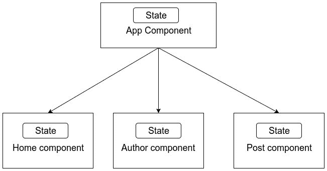
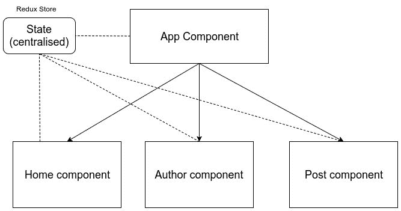
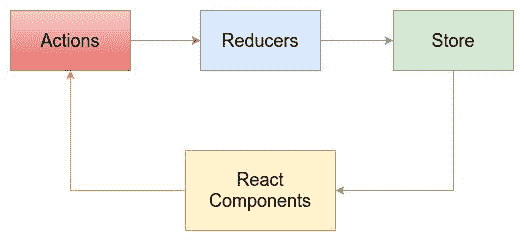
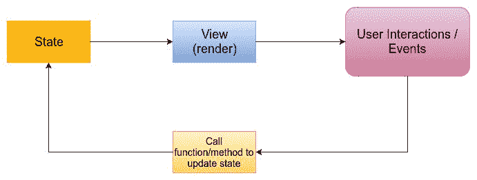
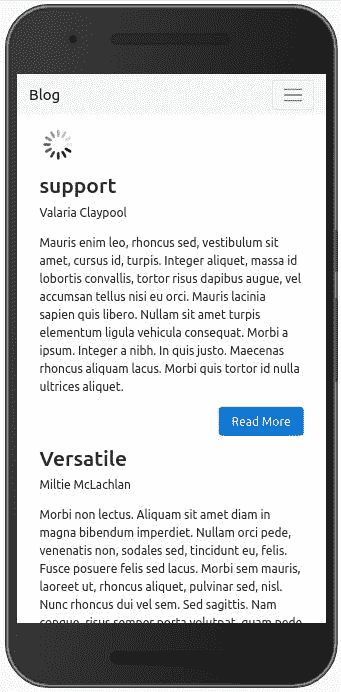

# 第七章：Redux

嗨！在前一章中博客的工作做得很好，欢迎来到本书的最后一章，这是前一章中构建的博客的续集。在本章中，我们将通过学习使用 Redux 进行集中状态管理来解决博客中令人讨厌的 3 秒加载问题。

就像我们在前一章中只涵盖了 React 的基础知识一样，本章很简单，将涵盖 Redux 的基本概念，这将永远改变构建 Web 应用程序的方式。这让我们只剩下一个简单的问题：Redux 是什么？

# Redux 是什么？

根据 Redux 文档：[`redux.js.org/`](http://redux.js.org/)，Redux 是“*JavaScript 应用程序的可预测状态容器*”。为了详细解释 redux，让我们来看看 Facebook 构建的应用程序架构**flux**的故事。

# Flux

对于像 ToDo 列表或我们在前一章中构建的博客这样的小型应用，React 都很好，但对于像 Facebook 这样的应用就不行了。Facebook 有数百个有状态的 React 组件用于渲染 Web 应用程序。在我们的博客中，每个 React 组件都有自己的状态，并且每个有状态的组件都会发出网络请求来填充这些状态数据。

一旦父组件获取数据，它将作为 props 传递给子组件。但是，子组件也可以有自己的状态。同样，在同一级别可能有两个或更多需要相同数据状态的父组件。React 的单向数据流在这里存在严重问题。如果将数据作为 props 传递给子组件，子组件无法更改 props，因为这将导致数据的变异。因此，子组件将不得不调用父组件中的一个方法，该方法也应该作为 props 传递以进行简单的更改。想象一下，您有数十甚至数百个父子嵌套组件，其中控制总是必须传递回父组件，并且必须在父子组件之间正确管理数据流。

Facebook 需要一个简单且可维护的解决方案来管理所有这些组件之间的数据。他们提出的理想解决方案是将状态从 React 组件中取出，并在一个称为**stores**的独立位置进行管理。计划很简单 - 我们将状态（数据）从 React 组件中取出，并将其保存在单独的 stores 中。然后所有的 React 组件都将依赖于 stores 来获取它们的数据。因此，您必须将 stores 中所需的数据作为 props 传递给所有必要的组件。

stores 中的任何更改都将导致所有依赖组件中的 props 发生变化，每当 props 发生变化时，React 将自动重新渲染 DOM。他们提出了称为**actions**和**dispatchers**的特殊函数，它们是唯一能够更新 stores 的函数。因此，如果任何组件需要更新 stores，它将使用所需的数据调用这些函数，它们将更新 stores。由于 stores 被更新，所有组件将接收新的 props，并且它们将使用新数据重新渲染。

这解释了 flux 的架构。flux 架构不仅为 React 创建，还为所有 JavaScript 框架的一般使用创建。然而，尽管 flux 的概念很简单，但实现起来相当复杂，后来通过一种新的状态管理库 Redux 来克服了这一问题。由于本章重点介绍 Redux，我们不会讨论 flux；但是，如果您对了解更多关于 flux 感兴趣，可以访问其官方页面：[`facebook.github.io/flux/`](https://facebook.github.io/flux/)。

# Redux 简介

使用 flux 的开发人员面临的主要问题是应用程序状态不够可预测。这可能是 Redux 自称为 JavaScript 应用程序的可预测状态容器的原因。Redux 被创建为一个可以与任何 JavaScript 应用程序一起使用的`独立`库。要在 React 中使用 Redux，我们将需要另一个名为`react-redux`的库，这是由 React 社区提供的，可在[`github.com/reactjs/react-redux`](https://github.com/reactjs/react-redux)上找到。

Redux 拥有最好的开源库文档之一。它甚至附带了由库的创建者*Dan Abramov*提供的两个免费视频课程，这些课程可以在文档的主页上找到。在我们开始向博客应用程序添加 Redux 之前，让我们看看 Redux 的工作原理以及它将如何帮助改进我们的 React 应用程序。

考虑我们在前一章创建的博客应用。我们有一个**App 组件**作为父组件，所有其他组件都是**App 组件**的子组件。在我们的情况下，每个组件都有自己的状态，如下所示：



如果我们使用 flux，它将具有多个存储，并且我们可以将**Post 组件**列表的状态和**Author 组件**列表的状态作为两个存储，并让整个应用程序共享这些存储。但是，如果我们使用 Redux，它将维护一个*单一存储*，其中将保存整个应用程序的状态。您的应用程序结构将如下所示：



如前面的图像所示，Redux 将创建一个*单一存储*，保存状态，然后将其作为 props 提供给所需的组件。由于整个应用程序具有单一状态，因此更容易维护，并且应用程序状态对开发人员更加可预测。

那么，让我们来看看 Redux 是如何管理它的存储的。Redux 的实现有三个重要部分：

+   Store

+   Actions

+   Reducers

# Store

存储是包含整个应用程序状态的集中状态。与普通状态一样，存储也是一个简单的 JavaScript 对象，只包含纯数据（存储对象不应包含任何方法）。此外，状态是只读的，这意味着应用程序的其他部分不能直接更改状态。修改状态的唯一方法是发出一个动作。

# Actions

Actions 是设计执行任务的函数。每当组件需要修改状态时，它将调用一个 action。Actions 作为 props 提供给组件。动作函数的返回类型应该是一个普通对象。动作返回的对象被提供给 reducers。

# Reducers

Reducers 是简单的方法，其功能是更新存储。由于存储是一个以键值对组织的 JavaScript 对象，每个键都有自己的 reducer。reducer 函数接受两个参数，从动作返回的对象和当前状态，并返回一个新状态。

# 在博客中实现 Redux

现在您已经对为什么使用 Redux 有了一个很好的理解，让我们开始在我们的博客应用程序中实现 Redux。本章使用与前一章相同的服务器，因此在本章工作时，您还需要保持服务器运行。

本章的起始文件与前一章的完成代码文件相同，只是`package.json`文件中包含以下新库作为依赖项：

+   `redux`

+   `react-redux`

+   `redux-thunk`

+   `redux-persist`

+   `localforage`

在构建我们的应用程序时，我们将看到这些库各自的作用。我们将使用与前一章相同的`.env`文件，其中包含`REACT_APP_SERVER_URL`环境变量，其值是运行服务器的 URL。在终端中导航到项目根文件夹，并执行`npm install`，然后执行`npm start`以启动应用程序的开发服务器。

# 文件夹结构

在我们开始使用 Redux 之前，我们需要为 Redux 组件定义一个适当的文件夹结构。目前，我们的`src/`目录看起来是这样的：

```js
.
├── App.css
├── App.js
├── App.test.js
├── assets
├── Components
├── index.css
├── index.js
├── logo.svg
├── registerServiceWorker.js
├── routes.js
└── services
```

我们需要创建一个名为`redux`的新目录，其中将保存我们的`store`，`actions`和`reducers`。现在，目录结构将如下所示：

```js
.
├── App.css
├── App.js
├── App.test.js
├── assets
├── Components
├── index.css
├── index.js
├── logo.svg
├── redux
├── registerServiceWorker.js
├── routes.js
└── services
```

在`redux`目录中，您需要创建四个不同的目录，即`actions`，`actionTypes`，`reducers`和`store`。您的`redux`目录现在看起来是这样的：

```js
.
├── actions
├── actionTypes
├── reducers
└── store
```

您可能会想到`actionTypes`目录。在 Redux 中，所有操作都应该是预定义的。您不希望发生未知的操作。因此，我们将创建`actionTypes`文件夹，其中将保存应用程序可以执行的所有操作的常量。

既然我们有了所需的文件夹结构，让我们开始创建我们的初始状态。

# 初始状态

我们总是在构造函数中为我们的 React 组件定义初始状态，我们在那里创建状态变量。同样，我们也需要为我们的 Redux 创建一个初始状态。唯一的区别是 Redux 状态将需要保存整个应用程序的状态。

让我们制定初始状态的外观：

+   我们在博客主页上使用的数据也是帖子的数组，因此我们需要一个帖子数组

+   用于显示作者列表的数据也是一个数组

+   我们还需要维护 AJAX 调用及其成功或错误状态的状态

在您的`store`目录中，创建一个新文件--`initialState.js`--并添加包含`initialState`对象的以下代码：

```js
const initialState = {
  posts: [

  ],
  authors: [

  ],
  ajaxCalls: {
    getAllPosts: {
      loading: false,
      hasError: false,
    },
    getAuthors: {
      loading: false,
      hasError: false,
    },
    addPost: {
      loading: false,
      hasError: false,
    }
  }
};

export default initialState;
```

正如您所看到的，`initialState`常量包含了一个空数组用于帖子和作者，以及一个包含了三个网络请求（AJAX 调用）的状态信息的对象，这些我们将在这个应用程序中使用。

一旦我们添加了 Redux，我们的应用程序将只需要进行三个网络请求--一个用于获取所有帖子，一个用于获取所有作者，第三个用于添加新帖子。如果我们想在帖子详情页面看到一个帖子，我们可以轻松地使用我们在第一个网络请求中得到的帖子数组。

您的`redux`文件夹现在应该是这样的：

```js
.
├── actions
├── actionTypes
├── reducers
└── store
    └── initialState.js
```

# 操作类型

现在我们已经准备好了初始状态，让我们定义我们的博客应用程序可以执行的所有操作。在我们的博客中，操作实际上就是我们进行检索数据的网络请求。每个网络请求将与四个操作相关联。

考虑一下我们从服务器获取所有博客帖子的请求。与这个网络请求相关的操作将如下所示：

+   开始 AJAX 调用

+   网络请求成功

+   网络请求失败

+   获取帖子数据

因此，在您的`redux/actionTypes`目录中，创建一个`actionTypes.js`文件，其中将保存应用程序中将发生的所有操作的常量值。在`actionTypes.js`文件中，添加以下代码：

```js
const actions = {

  GET_POSTS_AJAX_CALL_START : 'GET_POSTS_AJAX_CALL_START',
  GET_POSTS_AJAX_CALL_SUCCESS: 'GET_POSTS_AJAX_CALL_SUCCESS',
  GET_POSTS_AJAX_CALL_FAILURE: 'GET_POSTS_AJAX_CALL_FAILURE',
  GET_POSTS: 'GET_POSTS',

  GET_AUTHORS_AJAX_CALL_START: 'GET_AUTHORS_AJAX_CALL_START',
  GET_AUTHORS_AJAX_CALL_SUCCESS: 'GET_AUTHORS_AJAX_CALL_SUCCESS',
  GET_AUTHORS_AJAX_CALL_FAILURE: 'GET_AUTHORS_AJAX_CALL_FAILURE',
  GET_AUTHORS: 'GET_AUTHORS',

  ADD_POST_AJAX_CALL_START: 'ADD_POST_AJAX_CALL_START',
  ADD_POST_AJAX_CALL_SUCCESS: 'ADD_POST_AJAX_CALL_SUCCESS',
  ADD_POST_AJAX_CALL_FAILURE: 'ADD_POST_AJAX_CALL_FAILURE',
  ADD_POST: 'ADD_POST',

};

export default actions;
```

您的`redux`文件夹现在应该有以下结构：

```js
.
├── actions
├── actionTypes
│   └── actionTypes.js
├── reducers
└── store
    └── initialState.js
```

我们已经创建了`actionTypes`，我们可以在整个应用程序中使用它，因此让我们创建应用程序应该使用的操作来更新状态。

# 操作

当 React 组件需要修改应用程序的状态时，会从 React 组件中分派操作。我们的应用程序需要两个操作，一个用于帖子页面，一个用于作者页面。然而，就像前一章一样，我只会专注于帖子页面；完成本章后，您可以继续处理作者页面。已完成的代码文件也包含了作者页面的操作，因此您可以将其用作参考。

让我们开始吧。在`actions`目录中，创建两个文件，`authorActions.js`和`postActions.js`。您的`redux`文件夹应该是这样的：

```js
.
├── actions
│   ├── authorActions.js
│   └── postActions.js
├── actionTypes
│   └── actionTypes.js
├── reducers
└── store
    └── initialState.js
```

在这里，将`authorActions.js`文件保留为空，我们将在`postActions.js`文件上工作。标准操作函数应该如下所示：

```js
const sumAction = (a, b) => {
  return {
    type: 'SUM_TWO_NUMBERS',
    payload: { answer: a+b }
  }
};
```

正如你所看到的，该操作返回一个带有两个属性的对象，即`type`和`payload`。`type`属性被*reducers*用来识别发生的操作类型，而`payload`传递了该操作的结果。`payload`是可选的，因为有些操作不会产生直接的结果，但是所有操作返回的对象中应该包含`type`属性。

这对于简单的操作非常有效，比如我们在前面示例代码中看到的两个数字的和，这是同步的。然而，大多数情况下，我们在应用程序中执行的操作是异步的，我们不能简单地从这些操作中返回一个 JSON 对象。

为了解决这个问题并执行异步操作，Redux 有一个叫做**中间件**的概念。中间件是可以影响 Redux 工作方式的库，特别是在有异步函数的操作中。我们将在这个应用程序中用于此目的的中间件是`redux-thunk`库。这个库已经包含在本章起始文件的`package.json`文件中，并且在你执行`npm install`时应该已经安装了。

因此，这就是`redux-thunk`的工作原理。`redux-thunk`允许操作分派其他操作，而不是返回一个普通的 JavaScript 对象。这很有用，因为在异步事件运行时，我们可以调用任意数量的操作。返回其他操作的操作具有以下奇怪的语法：

```js
const ajaxRequestAction = () => {         // Action
  return dispatch => {                    // dispatcher
    makeAjaxRequest()                     // asynchronous code
    .then(response => {
      dispatch(successAction(response));  // dispatch successAction
    })
    .catch(error => {
      dispatch(errorAction(error));       // dispatch errorAction
    });
  }
}

const successAction = (response) => {
  return {
    type: 'REQUEST_SUCCESS',
    payload: { response },
  };
}

const errorAction = (error) => {
  return {
    type: 'REQUEST_FAILURE',
    payload: { error },
  };
}
```

前面的语法一开始很难理解，但是如果你仔细看，`ajaxRequestAction`将返回另一个函数而不是返回一个对象。该函数将以`dispatch`作为其参数。

让我们将`ajaxRequestAction`返回的函数称为*调度程序*（*仅供参考*）。一旦我们进入调度程序，我们可以执行任何需要的异步操作。调度程序不需要返回任何值。但是，调度程序有能力分派其他操作。

让我们在`postActions.js`文件中为我们博客的帖子创建操作。在你的`postActions.js`文件中，你首先需要添加两个导入语句：

```js
import actions from '../actionTypes/actionTypes';
import apiCall from '../../services/api/apiCall';
```

第一个是我们在`actionTypes`文件夹中创建的操作对象。这包含了我们应用程序中可以执行的所有操作。第二个是`apiCall`服务，它将发出网络请求。

在我们的博客中需要执行的两种类型的操作：

+   获取所有帖子

+   添加新帖子

# 获取所有帖子

通常，我们的 React 组件只需要触发一个操作--`getAllPosts()`--它将发出网络请求并返回帖子数据。这个操作将是我们的调度程序。这个操作将开始网络请求并根据网络请求的结果分派所有其他操作。在你的`postActions.js`文件中，添加以下代码：

```js
export const getAllPosts = () => {

  return dispatch => {                   // Create the dispatcher

    dispatch(postsApiCallStart());       // Dispatch - api call started

    apiCall('posts', {}, 'GET')
      .then(posts => {
        dispatch(postsApiCallSuccess()); // Dispatch - api call success 
        dispatch(getPosts(posts));       // Dispatch - received posts array
      })
      .catch(error => {
        dispatch(postsApiCallFailure()); // Dispatch - api call failed
        console.error(error);
      });

  };

};
```

注意在`getAllPosts`函数之前的`export`关键字。这是因为所有操作将从 React 组件内部使用，因此我们在它们前面加上`export`关键字，以便以后可以导入它们。

我们的调度程序`getAllPosts`将发出网络请求并分派所有其他正常操作，这些操作将被我们应用程序的 reducers 使用。将以下代码添加到你的`postActions.js`文件中，其中包含了`getAllPosts`操作分派的所有操作的代码：

```js
export const postsApiCallStart = () => {
  return {
    type: actions.GET_POSTS_AJAX_CALL_START,
  };
};

export const postsApiCallSuccess = () => {
  return {
    type: actions.GET_POSTS_AJAX_CALL_SUCCESS,
  };
};

export const postsApiCallFailure = () => {
  return {
    type: actions.GET_POSTS_AJAX_CALL_FAILURE,
  };
};

export const getPosts = (posts) => {
  return {
    type: actions.GET_POSTS,
    payload: { posts },
  };
};
```

跟踪 API 调用状态的操作不需要返回`payload`。由于其状态将是一个布尔值，因此它只返回操作的类型。然而，`getPosts`操作应返回帖子详情，除了操作类型之外还返回`payload`，即帖子数组。

对于简单的网络请求来说，这看起来是很多代码，但是相信我，一旦你的应用程序扩展起来，这些是你在需要获取所有帖子时唯一需要的操作。

您应该始终使用在`actionTypes`文件中创建的动作对象来指定动作的类型。这样，您可以防止团队中的其他开发人员意外创建意外的动作。

# 添加新的帖子

由于添加帖子是与帖子相关的动作，我们将在同一个`postActions.js`文件中添加动作。在您的`postActions.js`文件中添加以下代码，用于`addNewPost`动作，它还充当添加新帖子的分发器：

```js
export const addNewPost = (body) => {
  return dispatch => {

    dispatch(addPostApiCallStart());

    apiCall(`post`, body)
    .then(() => {

      dispatch(addPostApiCallSuccess());
      dispatch(getAllPosts());             // Dispatch - getAllPosts action

    })
    .catch(error => {

      dispatch(addPostApiCallFailure());

    });
  };
};
```

`addNewPost`动作与我们之前的`getAllPosts`动作非常相似。但是，它需要一个`body`参数，其中包含添加帖子到服务器所需的帖子详情。您还应该注意，一旦接收到来自服务器的成功响应，即帖子已添加，`addNewPost`动作将分发`getAllPosts`动作，该动作将检索所有帖子，包括新创建的帖子。这样可以避免我们的 React 组件分发多个动作。

剩余动作的代码，由`addNewPost`动作分发，如下所示：

```js
export const addPostApiCallStart = () => {
  return {
    type: actions.ADD_POST_AJAX_CALL_START
  };
};

export const addPostApiCallSuccess = () => {
  return {
    type: actions.ADD_POST_AJAX_CALL_SUCCESS
  };
};

export const addPostApiCallFailure = () => {
  return {
    type: actions.ADD_POST_AJAX_CALL_FAILURE
  };
};
```

这就是动作部分的全部内容。我们当前的博客应用程序中有以下三个部分：


然而，它们目前是相互连接的。我们的下一步是创建 reducers，这些 reducers 提供了更新应用程序状态的能力。

# Reducers

Reducers 是简单的函数，它们接收来自动作的动作对象，然后使用它们更新状态。通常，由于我们的应用程序状态表示为键值对的对象，我们将需要为每个键（或属性）创建一个 reducer。这是我们在初始状态部分创建的应用程序状态的结构：

```js
{
  posts: [],
  authors: [],
  ajaxCalls: {
    ...
  },
}
```

我们的状态中有三个属性，因此我们需要三个 reducers，分别是`postsReducer.js`，`authorsReducer.js`和`ajaxCallsReducer.js`。这些 reducers 将代表我们应用程序状态在存储中。我们还需要另一个 reducer，用于将这三个 reducers 组合成一个单一对象，该对象将用作我们的状态。

在您的`redux`目录中，创建以下结构中突出显示的四个文件；您的`redux`文件夹结构现在应如下所示：

```js
.
├── actions
│   ├── authorActions.js
│   └── postActions.js
├── actionTypes
│   └── actionTypes.js
├── reducers
│   ├── ajaxCallsReducer.js
│   ├── authorsReducer.js
│   ├── postsReducer.js
│   └── rootReducer.js
└── store
    └── initialState.js
```

这就是 reducer 函数的工作方式：

+   reducer 函数接受两个参数；第一个是旧状态，第二个是由动作返回的动作对象。

+   它将返回一个全新的状态，完全覆盖旧状态。这是因为，就像在 React 组件中更新状态一样，在 Redux 中更新状态也应该是不可变的。

考虑以下示例。这是 Redux 存储状态的方式；状态的值是 reducers 的结果：

```js
{
  posts: postsReducer(oldPosts, action),
}
```

如果发生一个接收新帖子的动作，reducer 将返回所有新帖子，这将更新帖子的状态而不会改变它。请记住，所有 reducers 都将监听所有动作。因此，我们需要在 reducer 内部正确过滤所需的动作，如果没有任何动作影响 reducer，它应该简单地返回旧状态。

打开你的`postsReducer.js`文件，并添加以下导入语句：

```js
import initialState from '../store/initialState';
import actions from '../actionTypes/actionTypes';
```

一旦您添加了这些`import`语句，添加以下代码用于帖子 reducer：

```js
const postsReducer = (state = initialState.posts, action) => {
  switch(action.type) {
    case actions.GET_POSTS:
      return action.payload.posts;

    default:
      return state;
  }
};

export default postsReducer;
```

`postsReducer`函数将接受两个参数，如前所述：

+   `state`：它包含了`posts`状态的旧值。然而，在第一次加载时，旧状态将为 null，因此`initialState.posts`被传递为状态的默认参数。

+   `action`：它是由动作返回的动作对象。

由于 reducer 会为每个动作调用，我们只需要添加一个 switch case 语句，通过它我们可以确定动作的类型以及它是否会影响我们的状态。在我们的 switch case 语句中，我们为以下条件添加了两个情况：

+   如果操作的类型是`GET_POSTS`，我们知道它包含所有帖子，因此我们可以简单地从操作的`payload`中返回帖子。

+   如果不是，则将执行`default`情况，它将简单地返回旧状态。

`authorsReducer.js`文件是供您尝试的，但不能留空。在此文件中，添加以下代码：

```js
import initialState from '../store/initialState';
import actions from '../actionTypes/actionTypes';

const authorsReducer = (state = initialState.authors, action) => {
  switch(action.type) {

    default:
      return state;
  }

};

export default authorsReducer;
```

它将简单地返回所有操作的`initialState`。您可以在此 reducer 上工作，以在作者列表页面中尝试 Redux。

对于`ajaxCallsReducer.js`，代码太长无法在书中指定，因此您应该从已完成的代码文件中复制文件的内容。确切的代码将正常工作。`ajaxCallsReducer`的工作非常简单。它根据网络请求的结果切换`loading`和`hasError`属性的值为`true`或`false`。由于状态不能被改变，它使用扩展运算符(`...state`)来执行此操作。

考虑`GET_POSTS_AJAX_CALL_START`发生的情况：

```js
    case actions.GET_POSTS_AJAX_CALL_START:
      return {
        ...state,
        getAllPosts: {
          loading: true,
          hasError: false,
        },
      };
```

在这里，创建了一个新的状态对象，其中`getAllPosts`属性内部的`loading`属性设置为`true`。这种状态对于在应用程序中显示加载指示器非常有用。

# 根 reducer

在 reducers 部分中我们剩下的最后一项是根 reducer。在此文件中，所有 reducer 都被组合在一起，以用作应用程序的状态。Redux 提供了一个名为`combineReducers`的方法，可以用于此目的。在您的`rootReducer.js`文件中，添加以下导入语句：

```js
import { combineReducers } from 'redux';
import postsReducer from './postsReducer';
import authorsReducer from './authorsReducer';
import ajaxCallsReducer from './ajaxCallsReducer';
```

这将导入`combineReducers`函数以及其他 reducer。要将所有 reducer 组合成单个根 reducer，只需添加以下代码：

```js
const rootReducer = combineReducers({
  posts: postsReducer,
  authors: authorsReducer,
  ajaxCalls: ajaxCallsReducer,
});

export default rootReducer;
```

我们将在下一节中导入此 reducer 以创建我们的 store。目前，操作和 reducer 之间的数据流动方式如下：


# Store

使用根 reducer 创建 store 对象是 Redux 部分工作的最后阶段。在`redux/store`目录中，创建`configureStore.js`文件，该文件将创建我们的 store 对象。我们还需要在此文件中应用我们的`redux-thunk`中间件，这将允许我们使用将分派其他操作的操作。

Redux 提供了`createStore`函数来创建 store 对象和`applyMiddleware`函数来添加中间件。在您的`configureStore.js`文件中，添加以下代码：

```js
import { createStore, applyMiddleware } from 'redux';
import thunk from 'redux-thunk';
import rootReducer from '../reducers/rootReducer';
```

要创建一个 store，只需使用`createReducer`函数调用`rootReducer`，前面的状态和`applyMiddleware`方法作为参数。第一个参数是必需的，而其他参数是可选的。在`configureStore.js`文件中，在`import`语句之后添加以下代码：

```js
const configureStore = (preloadedState) => {
  return createStore(
    rootReducer,
    preloadedState,
    applyMiddleware(thunk)
  );
};

export default configureStore;
```

`configureStore`函数将用于为我们的 React 组件创建 store 对象。我们的`redux`目录的最终文件夹结构如下：

```js
.
├── actions
│   ├── authorActions.js
│   └── postActions.js
├── actionTypes
│   └── actionTypes.js
├── reducers
│   ├── ajaxCallsReducer.js
│   ├── authorsReducer.js
│   ├── postsReducer.js
│   └── rootReducer.js
└── store
    ├── configureStore.js
    └── initialState.js
```

到目前为止，在`redux`部分就是这些了。我们现在将使用`react-redux`库在我们的博客的 React 组件中连接 Redux 和 React。现在，这是`redux`部分中数据流动的方式：


# 将 Redux 与 React 组件连接起来

我们将我们博客的整个`App`组件包装在 React 路由器的`BrowserRouter`组件中，以在`index.js`文件中实现路由。Redux 遵循类似的方法。我们需要将`App`组件（已经包装在路由器内部）包装在`react-redux`库的`Provider`组件中。

打开您的`src/index.js`文件，并在文件中已经存在的`import`语句之后添加以下导入语句：

```js
import { Provider } from 'react-redux';
import configureStore from './redux/store/configureStore';
```

这将导入`react-redux`的`Provider`组件和我们在前一节中创建的`configureStore`函数。我们需要从`configureStore`函数创建一个`store`对象。在前面的`import`语句之后，添加以下行以创建`store`对象：

```js
const  store  =  configureStore();
```

目前，您的`ReactDOM.render()`方法如下所示：

```js
ReactDOM.render(
  <Router>
    <App />
  </Router>
  ,
  document.getElementById('root')
);
```

您需要将其替换为以下行：

```js
ReactDOM.render(
  <Provider store={store}>
    <Router>
      <App />
    </Router>
  </Provider>
  ,
  document.getElementById('root')
);
```

我们现在已经将整个`App`组件包装在`Provider`中，它为 React 组件提供了与 Redux 连接的能力。我们现在将看到如何将单个组件与 Redux 存储中的状态和操作连接起来。

# App 组件

我们将首先连接到 Redux 的组件是`App`组件，它充当我们应用程序中所有其他组件的父组件。这意味着无论我们在应用程序中访问的 URL 是什么，`App`组件都将被执行。这使得`App`组件成为执行操作的最佳位置，例如`getAllPosts`，它将检索帖子数组。

这部分是 Redux 中最令人困惑的部分，因此，您将需要密切关注我们如何将 Redux 存储和操作作为 props 传递给 React 组件。此外，如果在此阶段遇到任何错误，请确保参考已完成的代码文件。

您需要在您的`App.js`文件中添加一些`import`语句。您需要导入的第一件事是`react-redux`库提供的`connect`组件：

```js
import { connect } from 'react-redux';
```

这将为您的 React 组件提供一个与 Redux 连接的包装器。这与 React 路由器的`withRouter`组件的工作方式相同，它为 React 组件提供了 history、location 和 match props。

您还需要导入 Redux 的`bindActionCreators`函数，它将操作函数转换为可以被 React 组件使用的简单对象：

```js
import { bindActionCreators } from 'redux';
```

我们还需要导入的另一件重要的事情是`postActions`，它将被我们的`App`组件使用。由于`postActions`包含许多单独导出的函数，我们可以使用以下`import`语句将它们全部作为单个对象一起导入：

```js
import * as postActions from './redux/actions/postActions';
```

我们现在已经将所有必需的`import`语句放在了适当的位置。我们的下一步是实际的实现部分。目前，`App`组件的导出语句如下所示：

```js
export  default  withRouter(App);
```

我们的`App`组件被包装在`withRouter`中。要将其与 Redux 连接，我们需要将`App`组件包装在我们从`react-redux`导入的`connect`函数中，并且结果应该在`withRouter`组件内。

但是，`connect`函数本身需要两个函数--`mapStateToProps`和`mapDispatchToProps`--作为参数。在这两个函数中，`mapStateToProps`将从存储中转换状态，而`mapDispatchToProps`将将操作转换为可以被 React 组件使用的 props。现在，请密切关注，因为我们很快将看到另一种奇怪的语法。

将您的`App`组件的导出代码替换为以下代码行：

```js
function mapStateToProps() {
  return {
    // No states needed by App Component
  };
}

function mapDispatchToProps(dispatch) {
  return {
    postActions: bindActionCreators(postActions, dispatch),
  };
}

export default withRouter(
  connect(
    mapStateToProps,
    mapDispatchToProps
  )(App)
);
```

仔细查看前面的代码片段。如果导出语句对您来说毫无意义，不用担心，我们会解决这个问题。让我们看看`connect`的作用。`connect`函数将接受两个参数--`mapStateToProps`和`mapDispatchToProps`--它们是函数，并且它将返回一个函数：

```js
connectFunction = connect(mapStateToProps, mapDispatchToProps);
```

`App`组件被包装在`connectFunction`中作为`connectFunction(App)`。整个组件然后被包装在`withRouter()`函数中。因此，基本上，这就是导出语句的工作方式：

```js
export default withRouter(connectFunction(App));
```

这是我们已经合并在一起并写成的：

```js
export default withRouter(
  connect(
    mapStateToProps,
    mapDispatchToProps
  )(App)
);
```

`App`组件不使用任何状态，因此`mapStateToProps`函数将返回一个空对象。但是，`mapDispatchToProps`函数将使用`bindActionCreators`函数将`postActions`作为对象返回，然后将其作为 prop 提供给`App`组件。

现在，我们将让`App`组件通过在`componentWillMount()`方法中添加以下代码行来进行 API 调用以获取所有帖子：

```js
  this.props.postActions.getAllPosts();
```

此外，由于`postActions`作为一个 prop 传递给我们的`App`组件，因此请将以下属性添加到我们在`App`组件中添加的`propType`验证中：

```js
postActions:  PropTypes.object.isRequired
```

如果你在将上述代码片段包含到`App.js`文件中时遇到任何问题，请参考已完成的代码文件。完成此步骤后，从`Chapter06\Server`目录保持服务器运行，并在 Chrome 中打开你的应用程序。

当我们点击导航栏图标中的菜单项或帖子中的“阅读更多”按钮时，你应该看到博客以相同的 3 秒加载时间运行。我们将在下一节中修复这个问题。

# 主页组件

在前面的部分中，我们使用`App`组件从服务器检索数据并将其存储在 Redux 存储中。这意味着我们不再需要在我们的主页组件中进行任何网络请求。我们只需要从 Redux 存储中检索数据。

主页组件不会触发任何 Redux 动作，因此，我们只需要从`react-redux`中导入 connect 组件。在你的`Home.js`文件中，添加以下`import`语句：

```js
import { connect } from  'react-redux';
```

用以下代码替换我们的`Home.js`文件中的`export`语句：

```js
function mapStateToProps(state) {
  return {
    posts: state.posts,
    loading: state.ajaxCalls.getAllPosts.loading,
    hasError: state.ajaxCalls.getAllPosts.hasError,
  };
}

export default connect(mapStateToProps)(Home);
```

由于主页组件不会执行任何操作，我们可以安全地忽略 connect 中的`mapDispatchToProps`函数。但是，我们需要为`mapStateToProps`函数做一些工作，在前一章中它只是简单地返回了一个空对象。

`mapStateToProps`函数有一个参数，即应用程序的整个 Redux 状态的状态。在 return 语句中，我们只需要提到我们需要将状态的哪一部分作为 props 传递给 React 组件。connect 的最好部分是，每当 reducers 更新状态时，它将使用`mapStateToProps`函数更新这些 props。

现在我们为主页组件得到了一些新的 props。因此，在你的主页组件中，添加以下`propType`验证：

```js
  static propTypes = {
    posts: PropTypes.array.isRequired,
    loading: PropTypes.bool.isRequired,
    hasError: PropTypes.bool.isRequired,
  }
```

此外，我们的主页组件中不再需要任何状态或 API 调用，因此，你可以*删除*`constructor`和`componentWillMount`方法。而是在你的 render 方法的 JSX 中，用`this.props.posts`替换`this.state.posts`。对于`loading`和`hasError`状态也是一样。现在我们的主页组件直接依赖于 Redux 存储。如果你遇到任何问题，请参考已完成的代码文件。

这里的酷部分是-如果你点击导航栏中的任何其他部分并返回到主页，你会发现帖子会立即加载。这是因为所有帖子都存储在 Redux 存储中，准备供我们使用。如果你在主页帖子列表中点击“阅读更多”按钮，你应该再次看到加载指示器，因为它正在从服务器检索帖子详情。让我们也将该组件与 Redux 连接起来。

# 帖子组件

在 VSCode 中打开你的`src/Components/Post.js`文件。我们的第一步是添加所需的`import`语句：

```js
import { connect } from 'react-redux';
import { bindActionCreators } from 'redux';
```

让我们制定一下我们将如何将该组件与 Redux 连接起来的策略：

+   我们需要获取帖子 ID，它存在于 URL 中

+   一旦我们有了 ID，我们应该使用`Array.find()`方法在我们存储的帖子数组中找到具有该 ID 的帖子

+   最后，我们可以将所需的帖子作为 props 发送。

现在，在`Post.js`中用以下代码替换你的`export`语句：

```js
function mapStateToProps(state, ownProps) {

  return {
    post: state.posts.find(post => post.id === ownProps.match.params.id),
    loading: state.ajaxCalls.getAllPosts.loading,
    hasError: state.ajaxCalls.getAllPosts.hasError,
  };
}

export default withRouter(
  connect(mapStateToProps)(Post)
);
```

`mapStateToProps`函数有一个第二个参数，即`ownProps`。它包含了 Post 组件的所有 props。从`ownProps`中，我们可以获取帖子 ID，它存在于 React 路由器的`withRouter`组件提供的 match 对象中。然后我们将使用 find 方法找到帖子并在 return 语句中返回所需的数据。

你的帖子组件内的`propType`验证应如下所示：

```js
  static propTypes = {
    history: PropTypes.object.isRequired,
    location: PropTypes.object.isRequired,
    match: PropTypes.object.isRequired,
    post: PropTypes.object,
    loading: PropTypes.bool.isRequired,
    hasError: PropTypes.bool.isRequired,
  }
```

你可以删除构造函数和`componentWillMount`方法，就像我们为我们的主页组件所做的那样，然后在你的 render 方法中，用`this.props.loading`替换`this.state.loading`，用`this.props.hasError`替换`this.state.hasError`。

但是，在将`this.state.post`替换为`this.props.post`之前，我们应该确保`this.props.post`有一个值，因为在加载过程中，帖子数组将为空，并且`this.props.post`的值将为 undefined。在 render 方法中，用以下代码替换您使用`this.state.post`的三行代码：

```js
{
  this.props.post
  ?
    <div>
      <h2>{this.props.post.title}</h2>
      <p>{this.props.post.author}</p>
      <p>{this.props.post.content}</p>
    </div>
  :
    null
}
```

现在尝试重新加载页面。第一次加载需要三秒钟，但一旦数据加载完成，您将看到导航到其他页面（除了作者页面）将变得轻而易举。在主页上点击“阅读更多”按钮将立即带您到帖子详情页面。

现在轮到您在`AuthorList`和`AuthorPosts`组件中尝试这一点。我们需要连接 Redux 的最后一个组件是 NewPost 组件。

# NewPost 组件

NewPost 组件需要 Redux 的状态和操作。它需要来自状态的加载和`hasError`数据，并且必须使用`postActions`将帖子提交到服务器。因此，让我们从在`src/Components/NewPost/NewPost.js`文件中包含所需的`import`语句开始：

```js
import { connect } from 'react-redux';
import { bindActionCreators } from 'redux';
import * as postActions from '../../redux/actions/postActions';
```

现在，请用以下代码替换`NewPost.js`文件中的`export`语句：

```js
function mapStateToProps(state) {
  return {
    loading: state.ajaxCalls.addPost.loading,
    hasError: state.ajaxCalls.addPost.hasError,
  };
}

function mapDispatchToProps(dispatch) {
  return {
    postActions: bindActionCreators(postActions, dispatch),
  };
}

export default connect(
  mapStateToProps,
  mapDispatchToProps
)(NewPost);
```

由于我们在`NewPost`组件中有了 props，请在`NewPost`类中添加以下`propType`验证代码：

```js
  static propTypes = {
    postActions: PropTypes.object.isRequired,
    loading: PropTypes.bool.isRequired,
    hasError: PropTypes.bool.isRequired,
  }
```

与`Home`和`Post`组件不同，`NewPost`组件需要状态和 props 来渲染 JSX 元素。我们可以删除加载和`hasError`状态，并用 props 替换它们。您应该参考已完成的代码文件（如果需要），并将 render 方法中的加载和`hasError`状态替换为 props。

然后，将 submit 方法中的整个`apiCall().then().catch()`链替换为以下单行代码：

```js
this.props.postActions.addNewPost(body);
```

您的`submit`方法现在将如下所示：

```js
  submit() {
    if(this.state.author && this.state.content && this.state.title) {
      this.setState({loading: true});

      const date = new Date();
      const epoch = (date.getTime()/1000).toFixed(0).toString();
      const body = {
        id: uuidv4(),
        author: this.state.author,
        title: this.state.title,
        content: this.state.content,
        datetime: epoch,
      };

      this.props.postActions.addNewPost(body);

    } else {
      alert('Please Fill in all the fields');
    }
  }
```

`submit`方法现在将触发一个包含所需网络请求的`addNewPost`操作。但是，我们需要在网络请求完成后显示成功消息。为了检测网络请求的完成，由于我们对存储的所有更新都是不可变的，如果 Redux 状态中的`ajaxCalls`属性中的加载或`hasError`属性的状态发生变化，将导致创建一个新对象，该对象将自动通过`react-redux`传递给`NewPost`组件。

这意味着`NewPost` React 组件将在网络请求结束时接收到新的 props。在这种情况下，我们可以使用 React 的`componentWillReceiveProps`生命周期方法来显示成功消息，并在提交帖子后清除输入字段。将以下代码添加到`NewPost`类的`componentWillReceiveProps`中：

```js
  componentWillReceiveProps(nextProps) {
    if(this.props !== nextProps) {
      if(nextProps.loading === false && nextProps.hasError === false) {
        this.setState({
          success: true,
          author: '',
          title: '',
          content: '',
        });
      } else if(nextProps.loading === false && nextProps.hasError === true) {
        this.setState({success: false});
      }
    }
  }
```

`componentWillReceiveProps`将接收到的新 props（在我们的情况下，来自`react-redux`）作为其参数，我们将称之为`nextProps`。在`componentWillReceiveProps`方法中，进行简单的`this.props !== nextProps`检查以确保当前 props 和新 props 不是相同的对象。如果它们都持有相同的对象，我们可以跳过操作。然后我们只需要使用 if else 语句检查加载是否完成以及是否存在任何错误，就像在前面的代码片段中使用的那样。

一旦您包含了上述代码片段，请尝试添加一个帖子（确保服务器正在运行）。它应该添加帖子并显示成功消息。现在，点击主页菜单选项。您将看到您添加的新帖子立即出现，无需等待加载时间。这其中的秘密是`addNewPost`操作将自动调用`getAllPosts`操作，后者将在后台更新您的 Redux 存储。使用新帖子更新存储后，您的`Home`组件可以直接从 Redux 获取更新后的帖子状态，使事情立即出现。

这为用户提供了很好的用户体验，因为他们会发现每次更新都是即时的，而不必等待加载指示器。

# Redux 数据流

连接 Redux 代码与 React 组件后，你会发现 Redux 遵循与 React 相同的单向数据流。这就是 Redux 的数据流：



这就是 React 组件中数据流的方式：



此外，React 组件中的状态和 Redux 存储中的状态都应该是不可变的。这种不可变性对于 React 和 Redux 的正常工作是必不可少的。然而，由于 JavaScript 目前没有严格实现任何不可变的数据类型，我们需要小心不要改变状态。在 React 组件中，我们将使用`this.setState()`方法，在 Redux 的 reducer 中使用扩展运算符(`...`)来更新状态而不是改变它们。

对于大型项目和大量数据可能会有麻烦。Facebook 引入了一个叫做`Immutable.js`的库，可以解决这个问题，它可以在 JavaScript 中创建不可变的数据类型。这个库超出了本书的范围，但是确保你以后试一试。

# 持久化 Redux 存储

我们的博客加载速度很快，因为我们已经将 Redux 集成到其中，但是我们的用户仍然需要等待三秒钟进行初始加载。如果我们可以将 Redux 存储持久化到离线，并在加载新数据时向用户展示它呢？

听起来不错，而且也很简单！我已经为此目的将两个库添加到了依赖列表中：

+   `redux-persist`: [`github.com/rt2zz/redux-persist`](https://github.com/rt2zz/redux-persist)

+   `localForage`: [`github.com/localForage/localForage`](https://github.com/localForage/localForage)

`redux-persist`提供了一种简单的方法来持久化你的 Redux 存储，并在需要时重新填充它。这样当用户第二次访问你的页面时，你的存储就可以离线使用了。

`localForage`是一个简单的存储库，可以让你使用类似`localStorage`的 API 来使用`indexDB`。`redux-persist`与`localStorage`配合良好，但它建议在 web 浏览器中使用`localForage`作为默认存储引擎。

现在，持久化 Redux 存储并不那么复杂；你只需要在 Redux 存储中添加几行代码来持久化它，并让 reducers 监听*rehydration*动作以从持久化存储中重新填充数据。只需要更改以下三个文件：

第一个文件：打开你的`configureStore.js`文件，并添加以下导入语句：

```js
import { autoRehydrate } from 'redux-persist';
```

然后，将`configureStore`方法中的`return`语句更改为以下内容：

```js
  return createStore(
    rootReducer,
    preloadedState,
    applyMiddleware(thunk),
    autoRehydrate()
  );
```

现在，在创建存储时添加`autoRehydrate()`函数，它将发出 rehydrate 动作。

第二个文件：打开你的`index.js`文件，并添加以下`import`语句：

```js
import { persistStore } from 'redux-persist';
import localForage from 'localforage';
```

这将导入`persistStore()`函数，它可以持久化你的存储，以及将被用作存储引擎的`localForage`库。现在，你需要在创建存储的代码行之后添加一行代码：

```js
const store = configureStore();              // Store gets created here
persistStore(store, {storage: localForage}); // next line which will persist your store
```

第三个文件：打开你的`postsReducer.js`文件。在这个 posts reducer 中，我们将监听另一个动作，即在重新填充持久化的 Redux 存储时发出的 rehydrate 动作。Redux Persist 维护了一组常量，其中定义了 rehydrate 动作，类似于我们在`actionTypes.js`文件中定义动作的方式。

在 reducers 文件中，添加以下`import`语句：

```js
import * as constants from 'redux-persist/constants';
```

这将从`redux-persist`中导入常量。然后在`postsReducer`函数内添加一个额外的 case 语句，用于填充 Redux 存储：

```js
    case constants.REHYDRATE:
      if(action.payload.posts) {
        return action.payload.posts;
      }
      return state;
```

这个案例将检查 rehydrate 动作是否发生，然后使用`if`条件来检查 rehydrate 动作是否在动作的载荷中包含`posts`属性。如果遇到任何问题，请参考已完成的代码文件。

现在，一旦完成，打开 Chrome 中的应用程序并尝试重新加载页面。您应该看到即使数据正在从服务器加载，帖子也是可用的，就像下面的图片一样：



这使用户可以在加载帖子的同时离线使用应用程序。我们已经完全解决了博客的 3 秒加载问题。

Redux 是一个很好的用于管理状态的库，它将状态集中管理在一个单独的状态容器中。它与 React 的集中状态管理被证明非常有用和高效，以至于许多库也为其他框架创建了集中状态管理，比如`@ngrx/store`用于 Angular 和`vuex`用于 Vue.js。在这一章中，我们只涵盖了 Redux 的基础知识--请参考 Redux 文档和其教程视频，以深入学习 Redux。此外，查看[Redux DevTools](https://github.com/gaearon/redux-devtools)，它提供了一些很酷的功能，比如热重新加载和时间旅行调试，适用于你的 Redux 应用程序。

作者页面尚未连接到 Redux。所以，试一试并完成博客。

# 总结

恭喜！你已成功完成了 Redux 章节，也完成了这本书。在这一章中，我们介绍了 Redux 是什么，以及我们如何使用它来改进状态管理。然后，我们创建了一个 Redux 存储，其中包括管理存储数据所需的动作和减速器。我们使用`react-redux`库将我们的 Redux 代码与 React 组件连接起来，并使用 props 而不是状态来渲染 JSX 元素。

最后，我们使用`redux-persist`和`localforage`作为存储引擎来持久化我们的 Redux 存储，并使我们的应用程序能够离线工作。这一章使博客对用户更快速、更用户友好。

你已经完成了本书的旅程，但你刚刚开始探索 JavaScript 世界的旅程。还有很多东西要学，还有更多的东西要来。所以，无论你想做什么，都要做好学习和探索的准备。
