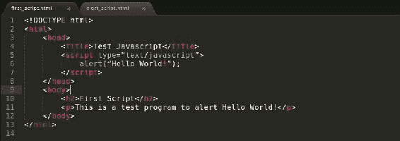
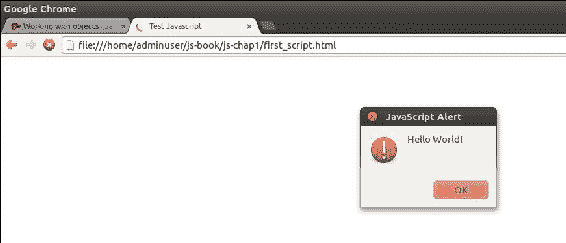
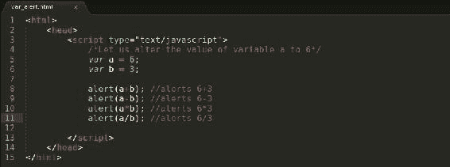

# 第一章。JavaScript 基础知识

JavaScript 最初由 Netscape Communications Corp 作为 LiveScript 引入，近年来取得了长足的发展。JavaScript 最初是为了使网页更具交互性，并控制页面的行为而开发的。JavaScript 程序通常嵌入在 HTML 文件中。HTML 是一种标记语言，一旦加载，就不会操纵页面的行为。使用 JavaScript，Web 开发人员可以设置规则并验证是否遵循了规则，避免任何远程服务器资源进行输入验证或复杂的数字计算。今天，JavaScript 不仅用于基本的输入验证；它还用于访问浏览器的`Document`对象，对 Web 服务器进行异步调用，并使用诸如`Node.JS`等软件平台开发端到端的 Web 应用程序，该平台由 Google 的 v8 JavaScript 引擎提供支持。

JavaScript 被认为是创建交互式网页所需的三个构建块之一；它是 HTML、CSS 和 JavaScript 中唯一的编程语言。JavaScript 是一种区分大小写且不敏感空格的语言，与 Python 和 Ruby 不同。JavaScript 程序是一系列语句，这些语句必须包含在`<script>`标签内。


### 提示

**下载示例代码**

您可以从[`www.packtpub.com`](http://www.packtpub.com)的帐户中下载您购买的所有 Packt 图书的示例代码文件。如果您在其他地方购买了本书，您可以访问[`www.packtpub.com/support`](http://www.packtpub.com/support)并注册，以便直接通过电子邮件接收文件。

JavaScript 必须从另一个应用程序（如浏览器）中调用。浏览器有一个内置的 JavaScript 引擎，用于解释和执行网页上的 JavaScript。JavaScript 的解释是从上到下，从左到右。SpiderMonkey 和 Rhino 是早期由不同浏览器实现的几个 JavaScript 引擎，如 Netscape Navigator 和 Mozilla Firefox。

接下来是我们简单的 Hello World 程序；JavaScript 程序位于 head 部分的`<script>`标签之间。脚本标签可以添加到 head 标签或 body 标签中。由于 JavaScript 是非阻塞的，脚本会阻止页面加载直到它们被加载。通常可以看到脚本被加载到末尾；如果没有依赖其他文件或元素，这将起作用。一个这样的依赖的例子是从不同位置使用的库。我们将在后面的章节中看到很多这样的例子。我们将在以后讨论无侵入式 JavaScript 的作用。对于我们的 Hello World 程序，使用您选择的文本编辑器，并将此程序保存为 HTML 扩展名。在 Web 浏览器中加载文件，应该在页面上加载一个带有文本**Hello World!**的弹出框。

以下代码片段是`first_script.html`文件：



输出如下：



# JavaScript 中的变量

现在我们已经建立了一个 Hello World 程序，让我们迈出下一步，对两个数字进行一些算术运算。

### 注意

分号（`;`）是一个语句终止符，它告诉 JavaScript 引擎语句已经结束。

让我们再看一个程序，`alert_script.html`：


以前的程序将运行并产生四个弹出窗口，依次显示它们的各自值。这里一个明显的问题是我们在多个地方重复使用相同的数字。如果我们必须对不同的数字集执行这些算术运算，我们将不得不在多个位置进行替换。为了避免这种情况，我们将这些数字分配给临时存储位置；这些存储位置通常被称为变量。

关键字`var`用于在 JavaScript 中声明变量，后面跟着变量的名称。然后，该名称将隐式提供计算机内存的一部分，我们将在整个程序执行过程中使用它。让我们快速看一下变量如何使之前的程序更加灵活：


### 注意

代码注释可以通过两种方式进行：一种是单行，另一种是多行。

单行注释：

```js
//This program would alert the sum of 5 and 3;
alert(5+3);
```

多行注释：

```js
/* This program would generate two alerts, the first alert would display the sum of 5 and 3, and the second alert would display the difference of 5 and 3 */
alert(5+3);
alert(5-3);
```

让我们继续进行程序：


现在让我们将值从`5`改为`6`；我们将在这里进行的更改量是最小的。我们将值`6`赋给变量`a`，这样就完成了剩下的过程；不像我们之前的脚本在多个位置进行了更改。如下所示：

### 注意

代码注释是任何应用程序开发生命周期中经常发生且非常重要的一步。必须用来解释代码中包含的任何假设和/或任何依赖关系。



在 JavaScript 中，我们使用关键字`var`声明变量，直到为其分配一个值，变量的值将被隐式设置为`undefined`；该值在变量初始化时被覆盖。

# 数组

变量很适合保存单个值，但对于变量应该包含多个值的情况，我们必须依赖数组。JavaScript 数组是根据其索引顺序排列的项目集合。数组中的每个项目都是一个元素，并且具有用于访问该元素的索引。数组就像一个书架，可以放置多本书；每本书都有其独特的位置。数组使用数组文字表示法`[]`声明。

让我们看一个简单的数组声明：


### 注意

JavaScript 中的数组是从零开始的。

让我们初始化数组：


要访问特定元素的值，使用该元素的引用索引。一旦确定了引用索引，就可以使用 alert 语句输出它，如下面的屏幕截图所示：


与变量不同，数组没有类型，因此可以包含各种类型的数据，如下面的屏幕截图所示：


JavaScript 数组的一个更复杂的例子是多维数组，其中数组内部有数组的组合，如下面的屏幕截图所示：


要从多维数组中检索元素，我们必须使用与该数组中级别相同的索引。如果多维数组包含一个包含我们要访问的值的数组，我们将不得不选择数组元素存在的索引，然后选择要搜索的数组内部值的索引。要从`multidimensionalArray`示例中检索字符串`Three`，我们首先必须找到包含值`Three`的数组的索引，然后找到该数组内部值`Three`的索引。如下所示：


### 注意

使用`Array`类声明数组的第二种方法。

```js
var bookshelf = new Array()
```

# 对象

对象是处理数据的另一种方式。在数组中，索引通常是数字；对象为我们提供了一种强大的方式来分配和检索数据。对象源自面向对象编程的概念；这是一种非常流行的编程范式。对象是实时数据的虚拟表示；它们允许我们通过属性和方法将数据组织成逻辑组。属性描述对象的状态，而方法描述对象的行为。属性是保存信息的键值对。看一下下面的例子：


在前面的例子中，我们实例化了一个`person`对象，然后添加了描述该对象的`firstname`和`lastname`属性。我们通过创建一个名为`getFullName`的方法为对象添加了行为，该方法访问了对象的属性，检索数据，并将输出警报到屏幕上。在这个例子中，属性是通过点表示法访问的；我们也可以通过将属性名称放在方括号中类似于数组来访问属性，但这并不常见。如下所示：


创建对象的第二种方式是使用大括号。在这里，我们介绍了`this`关键字，它提供了对对象属性和方法的引用，如下所示：


# Carousel 应用程序

我们将致力于开发一个由 JSON 提供支持的 Carousel 应用程序。我们将使用 HTML、JavaScript 和 JSON 来构建这个应用程序。这个应用程序将有自己的导航系统，配合后台的定时器事件，以在给定的间隔内旋转项目。我们还将讨论用户体验在开发这样一个应用程序中扮演的重要角色。

# 摘要

本章是对我们将在掌握 JSON 的过程中利用的 JavaScript 原则的基本介绍。变量、数组和对象在跨网络传递数据中扮演着非常重要的角色。如果这是你第一次接触 JavaScript，请再看一遍例子并加以练习。我们需要一个坚实的基础才能建立对 JSON 的深刻理解，以及它如何在实时网络应用中使用。
