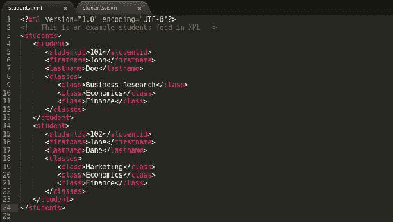
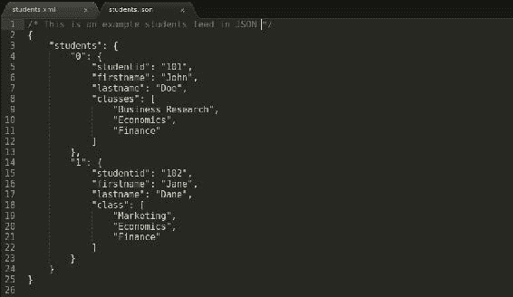
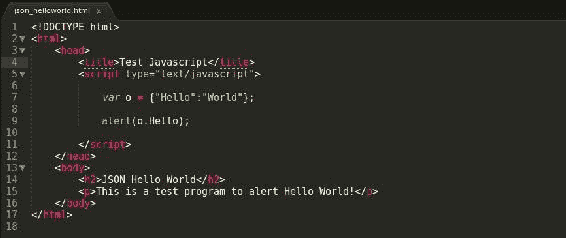
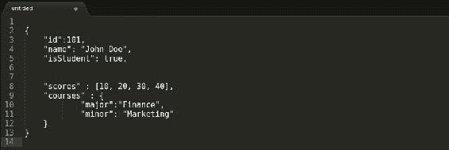
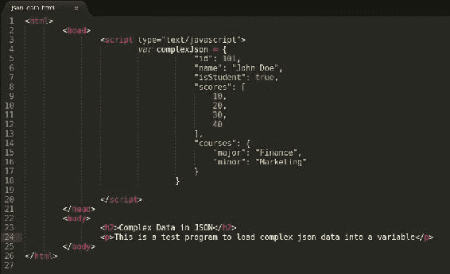
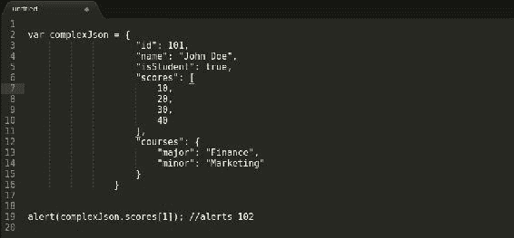
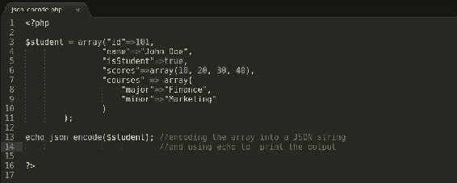
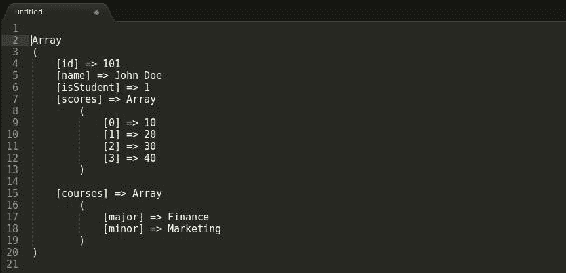

# 第二章. JSON 入门

JSON 或 JavaScript 对象表示法是一种非常流行的数据交换格式。它是由 Douglas Crockford 开发的。JSON 是基于文本的，轻量级的，用于客户端和服务器之间的数据交换的人类可读格式。JSON 源自 JavaScript，并与 JavaScript 对象非常相似，但不依赖于 JavaScript。JSON 是与语言无关的，并且所有流行语言都支持 JSON 数据格式，其中一些是 C＃，PHP，Java，C ++，Python 和 Ruby。

### 注意

JSON 是一种格式，而不是一种语言。

JSON 可以用于 Web 应用程序进行数据传输。在 JSON 出现之前，XML 被认为是选择的数据交换格式。XML 解析需要客户端上的 XML DOM 实现，该实现将接收 XML 响应，然后使用 XPath 查询响应以访问和检索数据。这使得生活变得繁琐，因为数据查询必须在两个级别上执行：首先在服务器端，从数据库中查询数据，然后在客户端使用 XPath 进行第二次查询。JSON 不需要任何特定的实现；浏览器中的 JavaScript 引擎处理 JSON 解析。

XML 消息往往很沉重和冗长，在通过网络连接发送数据时占用大量带宽。一旦检索到 XML 消息，就必须将其加载到内存中进行解析；让我们看看 XML 和 JSON 中的`students`数据源。

以下是 XML 中的一个示例：

让我们看看 JSON 中的示例：

正如我们注意到的，与其 JSON 对应物相比，XML 消息的大小要大得多，这仅仅是两条记录。实时数据源将以几千条开始，并不断增加。还要注意的一点是服务器必须生成并通过互联网传输的数据量已经很大，而 XML 由于冗长而使其变得更大。考虑到我们处于移动设备时代，智能手机和平板电脑日益受到欢迎，通过较慢的网络传输如此大量的数据会导致页面加载缓慢、卡顿和用户体验差，从而使用户远离网站。JSON 已成为首选的互联网数据交换格式，以避免前面提到的问题。

由于 JSON 用于在互联网上传输序列化数据，我们需要注意其 MIME 类型。**MIME**（多用途互联网邮件扩展）类型是互联网媒体类型，是正在通过互联网传输的内容的两部分标识符。MIME 类型通过 HTTP 请求和 HTTP 响应的 HTTP 头传递。MIME 类型是服务器和浏览器之间的内容类型通信。通常，MIME 类型将有两个或更多部分，其中包含有关正在发送的数据类型的信息，无论是在 HTTP 请求中还是在 HTTP 响应中。JSON 数据的 MIME 类型是`application/json`。如果未通过浏览器发送 MIME 类型头，它将将传入的 JSON 视为纯文本。

# JSON 的 Hello World 程序

现在我们对 JSON 有了基本的了解，让我们来编写我们的 Hello World 程序。如下图所示：

当从浏览器中调用时，上述程序将在屏幕上警告 World。让我们密切关注`<script>`标签之间的脚本。

在第一步中，我们创建一个 JavaScript 变量，并用 JavaScript 对象初始化变量。与从 JavaScript 对象中检索数据的方式类似，我们使用键值对来检索值。简而言之，JSON 是一个键值对的集合，其中每个键都是对计算机上存储值的内存位置的引用。现在让我们退一步，分析为什么我们需要 JSON，如果我们所做的只是分配 JavaScript 对象，这些对象已经可用。答案是，JSON 是一个完全不同的格式，不像 JavaScript 是一种语言。

### 注意

JSON 的键和值必须用双引号括起来，如果其中任何一个用单引号括起来，我们将收到一个错误。

现在，让我们快速看一下 JSON 和普通 JavaScript 对象之间的相似之处和不同之处。如果我们要创建一个类似于之前示例中的`hello_world` JSON 变量的 JavaScript 对象，它将看起来像接下来的 JavaScript 对象：

这里的一个重大区别是键没有用双引号括起来。由于 JSON 键是一个字符串，我们可以使用任何有效的字符串作为键。我们可以在键中使用空格、特殊字符和连字符，这在普通的 JavaScript 对象中是无效的。

当我们在键中使用特殊字符、连字符或空格时，我们在访问它们时必须小心。

前面的 JavaScript 语句无法工作的原因是 JavaScript 不接受带有特殊字符、连字符或字符串的键。因此，我们必须使用一种方法来处理 JSON 对象，将其作为具有字符串键的关联数组来处理。这在接下来的截图中显示：

两者之间的另一个区别是 JavaScript 对象可以包含函数，而 JSON 对象不能包含任何函数。接下来的示例中有一个`getName`属性，它有一个函数，当被调用时会弹出名字`John Doe`：

最后，最大的区别是 JavaScript 对象从未打算成为数据交换格式，而 JSON 的唯一目的是将其用作数据交换格式。

# JSON 中的数据类型

现在，让我们看一个更复杂的 JSON 示例。我们还将介绍 JSON 支持的所有数据类型。JSON 支持六种数据类型：字符串、数字、布尔值、数组、对象和 null。

在上面的例子中，我们有五个不同数据类型的键值对。现在让我们仔细看看每个这些键值对：

`"id"`引用的值的数据类型是数字。

在这里，`"name"`引用的值的数据类型是字符串。

在上面的截图中，`"isStudent"`引用的值的数据类型是布尔值。

这里`"scores"`引用的值的数据类型是数组。

这里，`"courses"`引用的值的数据类型是对象。

我们知道 JSON 支持六种数据类型；它们是字符串、数字、布尔值、数组、对象和 null。是的，JSON 支持 null 数据，实时业务实现需要准确的信息。可能有情况下 null 被替换为空字符串，但这是不准确的。让我们快速看一下以下示例：

### 注意

数组和 null 值在 JavaScript 中是对象。

在前面的例子中，我们使用了`typeof`运算符，它接受一个操作数，并返回该操作数的数据类型。在第 4 行，我们确定了空字符串的类型，而在第 8 行，我们确定了空值的类型。

现在，让我们在页面中实现我们的 JSON 对象并检索值，如下面的屏幕截图所示：

要从变量`complexJson`中检索`id`，我们需要执行以下操作：

要从变量`complexJson`中检索`name`，请查看所示的屏幕截图：

查看以下屏幕截图，以从变量`complexJson`中检索`isStudent`：

从数组和对象中检索数据有点棘手，因为我们必须遍历数组或对象。让我们看看如何从数组中检索值：

在上面的例子中，我们从`scores`数组中检索了第二个元素。尽管`scores`是`complexJson`对象内的一个数组，但它仍然被视为常规键值对。当访问键时，处理方式不同；解释器在访问键时首先要评估的是获取其值的数据类型。如果检索到的值是字符串、数字、布尔值或空值，则不会对该值执行任何额外的操作。但如果它是一个数组或对象，则会考虑值的依赖关系。

要从 JSON 对象内部检索元素，我们必须访问作为该值引用的键，如下所示：

由于对象没有数值索引，JavaScript 可能会重新排列对象内部项目的顺序。如果您注意到在初始化 JSON 对象时键值对的顺序与访问数据时不同，那就没什么好担心的。数据没有丢失；JavaScript 引擎只是重新排列了您的对象。

# 支持 JSON 的语言

到目前为止，我们已经看到 JavaScript 中的解析器如何支持 JSON。还有许多其他编程语言提供了 JSON 的实现。诸如 PHP、Python、C＃、C ++和 Java 等语言对 JSON 数据交换格式提供了很好的支持。所有支持面向服务的流行编程语言都理解了 JSON 及其用于数据传输的重要性，因此它们对 JSON 提供了很好的支持。让我们暂时离开 JavaScript 中 JSON 的实现，看看 JSON 在其他语言中的实现，比如 PHP 和 Python。

## PHP

PHP 被认为是构建 Web 应用程序的最流行语言之一。它是一种服务器端脚本语言，允许开发人员构建可以在服务器上执行操作、连接到数据库执行 CRUD（创建、读取、更新、删除）操作，并为实时应用程序提供稳定环境的应用程序。JSON 支持已经内置到 PHP 核心中，从 PHP 5.2.0 开始；这有助于用户避免进行任何复杂的安装或配置。鉴于 JSON 只是一种数据交换格式，PHP 包含两个函数。这些函数处理通过请求传入的 JSON，或者生成将通过响应发送的 JSON。PHP 是一种弱类型语言；在本例中，我们将使用存储在 PHP 数组中的数据，并将该数据转换为 JSON 字符串，以便用作数据源。让我们在 PHP 中重新创建我们在前面部分中使用的学生示例，并将其转换为 JSON。

### 注意

此示例仅旨在向您展示如何使用 PHP 生成 JSON。

### 注意

要运行 PHP 脚本，我们需要安装 PHP。要通过浏览器运行 PHP 脚本，我们需要一个 Web 服务器，如 Apache 或 IIS。当我们使用 AJAX 时，我们将在第四章中进行安装，*使用 JSON 数据进行 AJAX 调用*。

这个脚本首先初始化一个变量，并分配一个包含学生信息的关联数组。然后将变量`$students`传递给一个名为`json_encode()`的函数，该函数将变量转换为 JSON 字符串。当运行此脚本时，它将生成一个有效的响应，可以将其公开为 JSON 数据源，供其他应用程序利用。

以下是输出结果：

我们已经成功通过一个简单的 PHP 脚本生成了我们的第一个 JSON 数据源；让我们看一下如何解析通过 HTTP 请求传入的 JSON 的方法。对于进行异步 HTTP 请求的 Web 应用程序来说，以 JSON 格式发送数据是很常见的。

### 注意

这个例子只是为了向你展示 JSON 如何被引入到 PHP 中。

以下是输出结果：

## Python

Python 是一种非常流行的脚本语言，广泛用于执行字符串操作和构建控制台应用程序。它可以用于从 JSON API 中获取数据，一旦检索到 JSON 数据，它将被视为 JSON 字符串。为了对该 JSON 字符串执行任何操作，Python 提供了 JSON 模块。JSON 模块是许多强大函数的综合，我们可以使用它们来解析手头的 JSON 字符串。

### 注意

这个例子只是为了向你展示如何使用 Python 生成 JSON。

在这个例子中，我们使用了复杂的数据类型，如元组和字典，分别存储分数和课程；由于这不是 Python 课程，我们不会深入研究这些数据类型。

### 注意

要运行这个脚本，需要安装 Python2，它预装在任何*nix 操作系统上。

以下是输出结果：

键可能会根据数据类型重新排列；我们可以使用`sort_keys`标志来检索原始顺序。

现在，让我们快速看一下在 Python 中如何执行 JSON 解码。

### 注意

这个例子只是为了向你展示 JSON 如何被引入到 Python 中。

在这个例子中，我们将 JSON 字符串存储在`student_json`中，并使用 Python 中 JSON 模块提供的`json.loads()`方法。

以下是输出结果：

# 摘要

本章向我们介绍了 JSON 的基础知识。我们了解了 JSON 的历史，并理解了它相对于 XML 的优势。我们创建了我们的第一个 JSON 对象并成功解析了它。此外，我们还了解了 JSON 支持的所有数据类型。最后，我们还介绍了一些关于如何在其他编程语言中实现 JSON 的示例。随着我们在这个旅程中前进，我们会发现本章中所积累的知识将为我们在后面章节中将要学习的更复杂的概念奠定坚实的基础。
