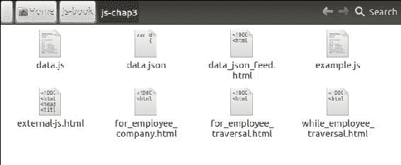
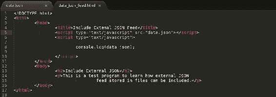
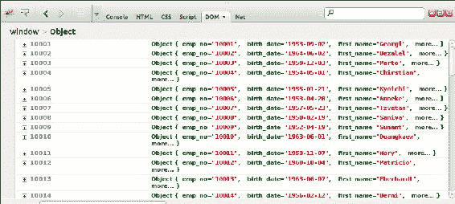
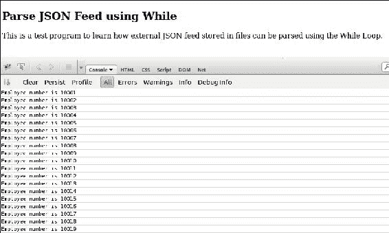
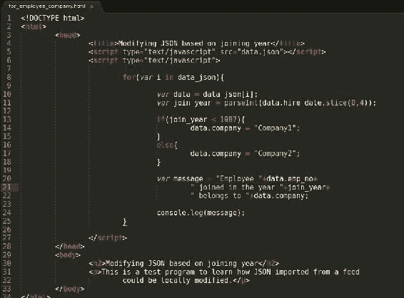

# 第三章：使用实时 JSON

在上一章中，我向您介绍了基本的 JSON，以及如何将 JSON 对象嵌入到 HTML 文件中，以及如何在简单的 JSON 对象上执行访问键等基本操作。现在让我们向前迈进一步，使用更大、更复杂且更接近我们在实时情况下使用的 JSON 对象。在现实世界的应用中，JSON 可以作为异步请求的响应或来自 JSON 源的检索。网站使用 HTML、CSS 和 JavaScript 提供视觉上美观的用户界面。但也有一些情况，数据供应商只关注获取数据。数据源满足了他们的目的；数据源是一种提供数据的粗糙方式，以便他人可以重用它来在其网站上显示数据或摄取数据并在其上运行算法。这些数据源体积庞大，不能直接嵌入到`script`标签中。让我们看看如何在 HTML 文件中包含外部 JavaScript 文件。

以下截图显示了`external-js.html`文件的代码：

在这个例子中，我们包含了一个外部 JavaScript 文件`example.js`。

要从`external-js.html`文件中访问`example.js`文件中的变量`x`，我们在 HTML 文件的`script`标签中编写我们的程序。

这个文件必须在与`external-js.html`相同的文件夹中创建。遵循给定的文件夹结构：

# 访问 JSON 中的对象

现在我们了解了如何调用脚本来获取外部 JavaScript 文件，让我们使用相同的技术来导入 JSON 源。我生成了一个包含 100 条记录的测试`employee` JSON 数据源。要遍历任何 JSON 源，重要的是要注意数据的排列方式。这个数据源中的键是基本的员工信息，如员工编号、出生日期、名字、姓氏、性别、入职日期、他们担任的职务以及他们担任这些职务的日期。一些员工在任期内担任相同的职务，而有些员工则担任了多个职务。

### 注意

这个 JSON 文件将成为练习的代码文件的一部分。

由于我们正在处理复杂的 JSON 数据源，让我们将数据源保存到一个文件中。在`data_json_feed.html`文件中，我们导入了与 HTML 文件位于同一文件夹中的`data.json`文件。值得注意的是，JSON 源已分配给一个名为`data_json`的变量，要访问 JSON 源，我们将在`data_json_feed.html`文件中使用这个变量：

还要注意的一件事是使用一个称为`console.log`的新方法。像 Mozilla Firefox、Google Chrome 和 Apple Safari 这样的浏览器为运行时 JavaScript 开发和调试提供了一个控制台面板。由于其突兀的行为，不建议使用 JavaScript 函数`alert`。另一方面，`console.log`是不突兀的，并将其消息记录到控制台中。从现在开始，我们将避免使用`alert`方法，而是使用`console.log`将数据打印到控制台窗口。Google Chrome 和 Apple Safari 已经安装了开发者工具；要查看控制台，右键单击页面，然后单击**检查元素**。它们都有一个**控制台**选项卡，允许我们使用日志记录。Firefox 依赖于 Firebug；在第八章中，*调试 JSON*，我将指导您完成 Firebug 的安装步骤。

当我们将`data_json_feed.html`文件加载到 Firefox 浏览器中，打开控制台窗口，并点击**DOM**选项卡，我们将看到一个包含 100 个`employee`对象的列表。如果我们的对象很小并且有一两个子对象，我们会更喜欢使用它们的数字索引来访问它们；在这种情况下，由于我们有大量的子对象，根据静态索引来定位对象是不现实的。

# 执行复杂操作

为了处理一个对象数组，我们必须以迭代的方式处理它们。我们将不得不提出一个迭代解决方案，其中我们一次只针对一个对象；一旦访问了对象，我们就不会再次访问该对象。这使我们能够保持数据的完整性，因为我们可以避免多次访问相同的对象，从而避免任何冗余。JavaScript 中的循环语句是`while`循环和`for`循环。让我们快速看一下如何使用这些循环技术来遍历我们的员工数组。

在`while_employees_traversal.html`文件中，我们导入了在上一节中检查过的`data.js`文件。`data.js`文件中的`data_json`变量包含了一个对象数组，这些对象被导入到这个 HTML 页面中。在`script`标签中，我们设置了两个变量：`i`变量用于保存起始计数器，`employeeCount`变量用于保存`data_json`中对象的总数。要检索数组中存在的项目数，我们可以使用 JavaScript 提供的`.length`属性。`while`循环有三个重要的支持块：条件、`while`循环中的语句，以及根据条件的增量或减量操作。让我们分别快速看一下这三个：

我们将变量`i`初始化为零，并且我们要查找的条件是如果零小于变量`data_json`中的项目数，则继续进入循环。

如果条件为真，则循环内的语句将被执行，直到它们达到增量条件：

一旦增量运算符接近，变量`i`的值将增加 1，并且它将返回到`while`循环的初始步骤。在初始步骤中，再次验证条件，以检查`i`是否仍然小于`data_json`中的项目数。如果是真的，它将再次进入循环并执行语句。这个过程会一直重复，直到变量`i`的值等于`employeeCount`的值。在那一点上，`while`循环的执行就完成了，并且`while`循环内的语句会作为日志保留在浏览器的控制台窗口中。在运行 HTML 文件`while_employees_traversal.html`之前，请验证`data.json`文件是否与 HTML 文件在同一个目录中。将这个 HTML 文件加载到您选择的浏览器中（推荐使用 Chrome，Firefox 或 Safari），通过右键单击网页并点击**检查元素**来打开控制台窗口，如果您使用的是 Chrome 或 Safari。员工编号应该显示在控制台窗口中：

为了检索员工的名字和姓氏，我们将连接`employee`对象中的`first_name`和`last_name`键：

我们可以使用相同的技术来检索其余的键，比如`birth_date`、`gender`和`hire_date`，除了`titles`。快速浏览 JSON 数据可以解释，与其余的键不同，`titles`是一个对象或对象数组。`titles`对象包含员工自加入公司以来担任的所有职称。一些员工只有一个职称，而另一些员工有多个；因此前者将是一个独立的对象，而后者将是一个包含`title`对象的对象数组。为了处理这种情况，我们需要检查员工是否只有一个职称或多个职称。如果这个人只有一个职称，我们应该打印数据，如果这个人有多个职称，我们需要遍历`title`对象的数组，打印员工拥有的所有职称。

`script`标签中的现有代码必须用之前提供的代码替换，以检索员工的职称。在这个脚本中，我们使用了之前脚本中的变量`i`和`employeeCount`。我们引入了一个新的条件来检查特定员工的`titles`键是否是`Array`对象。这个条件获取循环传递的值的类型，并验证它是否是`Array`对象的实例。让我们识别一下检查实例类型的条件：

一旦满足这个条件，就会执行条件内的语句。在成功条件内，我们声明了三个变量。第一个变量`j`将保存第二个`while`循环的计数器，该循环将迭代`titles`。第二个变量是`titleCount`，它将存储`titles`数组中可用项目的数量。最后一个变量是`titles`，它被初始化为空字符串。这个变量将保存员工拥有的所有职称。它将职称列表作为由`&`分隔的列表存储：

在这个`while`循环中，正在构建员工的职称；每次添加一个职称到`titles`变量中。一旦职称被添加到`titles`变量中，`j`的值就会增加，循环会继续直到所有的`title`对象都被迭代。如果`titles`键不是一个数组，执行会进入`else`块，并执行`else`块中的语句。由于该员工只有一个职称，数据会直接打印到控制台上。现在让我们看一下相同的例子，并使用`for`循环。与`while`循环类似，`for`循环也遍历`data_json`变量中的员工数组。无论使用何种循环技术，业务逻辑都保持不变。让我们使用`for`循环重新创建相同的例子：

与`while`循环不同，我们不需要额外的计数变量来保存当前索引和数组的长度，`for`循环会处理这些计数器。除了语法上的基本变化，业务逻辑保持不变，就像我之前指出的那样。现在我们已经了解了如何访问对象并执行复杂操作来提取数据，在下一节中，让我们看看如何修改 JSON 数据。

# 修改 JSON

从 JSON 数据源中检索到的 JSON 始终是只读的；因此，数据源不提供从未经验证的来源修改其数据的功能。有许多情况下，我们希望从外部数据源摄取数据，然后根据我们的需求修改内容。一个例子是，一家公司正在使用数据供应商提供的数据源，但提供的数据远远超出了公司的需求。在这种情况下，公司不会使用整个数据源，而是只提取其中的一部分，执行某些操作以根据他们的需求修改它，并重用新的 JSON 对象。让我们以我们的`employee` JSON 数据源为例。假设公司在不同时期的公司名称不同。我们想要根据员工加入公司的时间将员工分组到公司名称下。在 1987 年之前加入公司的员工属于公司 1，而在 1987 年或之后加入公司的员工属于公司 2。为了表示这种变化，我们向我们的 JSON 数据源添加了`company`键：

在`for_employee_company.html`文件中，我们正在遍历`employee`对象数组，并提取员工加入的年份。我们将其从字符串转换为整数，以便我们可以将年份值用于比较。我们将解析后的年份赋给`join_year`变量：

在下面的截图中，我们正在检查员工是否在 1987 年之前加入了公司；如果他们在 1987 年之前加入了，我们将`company`属性添加到`employee`对象中，并赋予值`Company1`。如果他们在 1987 年或之后加入了，我们将赋予值`Company2`：

在为新添加的属性`company`分配值之后，我们构建了一个通用消息，适用于所有员工，无论他们属于哪家公司。我们提取员工编号、员工加入的年份和公司名称来生成该消息：

当从 Web 浏览器运行`for_employee_company.html`时，将运行执行修改的脚本，并将输出记录到控制台：

# 总结

本章介绍了如何处理静态 JSON 数据源的核心概念。我们首先将外部 JSON 对象导入到我们的 HTML 文件中，循环遍历复杂的对象数组以解析和提取所需的数据。我们使用`while`和`for`循环来遍历数组，并使用条件来定位我们的搜索。我们通过在本地修改现有的 JSON 数据源并添加一个新属性`employee`对象来完成本章。现在我们已经掌握了从静态文件中访问 JSON 的方法，是时候开始进行一些异步调用，以从 HTTP 获取一些活动的 JSON 数据了。
