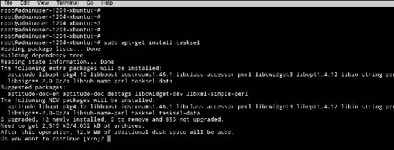
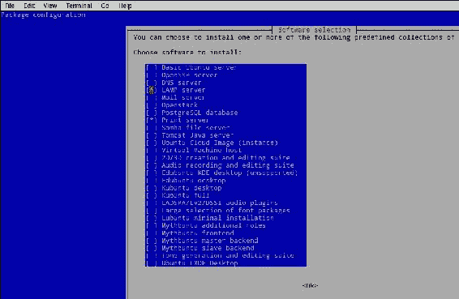
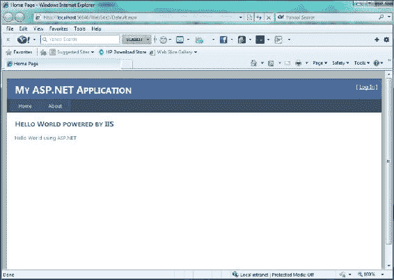
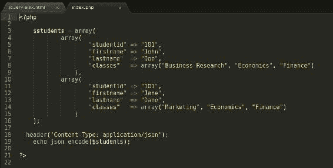
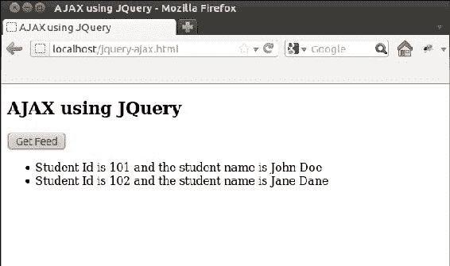

# 第四章：使用 JSON 数据进行 AJAX 调用

JSON 被认为是当今最流行的数据交换格式。在上一章中，我们看到了一个使用 JSON feed 作为数据存储的示例。在本章中，让我们使数据更加动态。HTML、客户端 JavaScript 和 CSS 分别提供结构、行为和表现方面。动态网页开发涉及两方之间的数据传输，即客户端和服务器。我们使用诸如 Web 服务器、数据库和服务器端编程语言等程序来获取和存储动态数据。让我们来看看在幕后促成数据成功操作的过程。

当用户打开 Web 浏览器并输入`http://www.packtpub.com/`时，浏览器会向**互联网服务提供商**（**ISP**）发出请求，通过提供域名执行 IP 地址的反向查找。一旦检索到 IP 地址，请求就会被转发到拥有该 IP 地址的机器。此时，有一个 Web 服务器在等待处理请求；Web 服务器可以是顶级 Web 服务器之一，如 Apache、IIS、Tomcat 和 Nginx。Web 服务器接收请求并查看 HTTP 请求的一部分——头部；这些头部传递了有关向 Web 服务器发出的请求的信息。一旦 Web 服务器解析了这些头部，它就会将请求路由到负责处理此请求的服务器端编程应用程序。该应用程序可以是用 PHP、C#/ASP.NET、Java/JSP 等编写的。这个负责的服务器端语言接受请求，理解它，并执行必要的业务逻辑来完成请求。这样的 HTTP 请求的一些例子包括加载网页和在网站上点击**联系我们**链接。也可能存在复杂的 HTTP 请求，其中数据必须经过验证、清洗和/或从数据存储应用程序（如数据库、文件服务器或缓存服务器）中检索。

这些 HTTP 请求可以通过两种方式进行——同步和异步。同步请求是一种阻塞请求，所有事情都必须按顺序进行，一步接一步，后续步骤必须等待前一步完成执行。假设网页加载时有四个独立的组件；如果其中一个组件执行时间很长，页面的其余部分将等待直到其执行完成。如果执行失败，页面加载也会失败。另一个例子是网页上有一个投票和评分组件；如果用户选择回答投票并给出评分来满足这些请求，如果我们采用同步请求机制，就必须依次发送两个请求。

为了解决同步请求的问题，开发社区逐渐在异步 HTTP 请求领域取得了进展。第一个允许异步请求的产品是由微软推出的 IFrame 标签；它们通过 Internet Explorer 使用 IFrames 来异步加载内容。在 IFrame 之后，接下来改变互联网的是 XML HTTP ActiveX 控件。后来，所有浏览器都在新名称 XMLHTTPRequest JavaScript 对象下采用了这个控件，它是 XMLHTTPRequest API 的一部分。XMLHTTPRequest API 用于向 Web 服务器发出 HTTP（或 HTTPS）调用。它可以用于进行同步和异步调用。异步请求允许开发人员将网页分成彼此独立的多个组件，从而通过按需发送数据节省大量内存。

*杰西·詹姆斯·加勒特*将这种现象称为“AJAX”。在**AJAX**（**异步 JavaScript 和 XML**）中，通过 JavaScript 进行网络请求，数据交换最初是在 XML 中进行的。 AJAX 中的“X”最初被认为是 XML，但今天它可以是任何数据交换格式，例如 XML，JSON，文本文件，甚至 HTML。用于数据传输的数据格式必须在 MIME 类型标头中提到。在第二章中，*使用 JSON 入门*，我们已经强调了为什么 JSON 是首选的数据交换格式。让我们快速看一下我们需要使用 JSON 数据进行第一个 AJAX 调用的内容。

基本上，Web 开发人员可以使用 AJAX 的原则按需获取数据，使网站更具响应性和交互性；了解是什么产生了这种需求非常重要。这种数据需求的触发器通常是在网页上发生的事件。**事件**可以被描述为对执行的操作的反应，例如，敲响铃会在铃内产生振动，产生声音。在这里，敲响铃是事件，而产生的声音是对事件的反应。网页上可能有多个事件；一些常见的事件包括点击按钮，提交表单，悬停在链接上，以及从下拉菜单中选择选项。当这些事件发生时，我们必须想出一种以编程方式处理它们的方法。

# AJAX 的要求

AJAX 是浏览器（被视为客户端）与通过 HTTP（或 HTTPS）与实时网络服务器之间的异步双向通信。我们可以在本地运行实时服务器，例如在 Windows 上运行 Apache 或 IIS，或在 Linux 和 Mac OS 上运行 Apache。我将带领我们在 Linux 环境中设置 Apache Web 服务器，并同时解释如何使用 Microsoft Visual Studio 开发环境构建 Web 应用程序。对于这门 AJAX 课程，让我们选择 PHP 和 MySQL 作为我们的主要服务器端语言和数据库。

在本章中，我将带您完成两个设置；第一个是在 Linux 机器上设置 Apache 和 PHP 以开发服务器端程序，而第二个是在 Windows 上运行由.NET 驱动的 Web 应用程序。微软的.NET 框架需要安装.NET 框架和 Visual Studio IDE 中的库。我假设您已经执行了这两个步骤；现在我们将在 ASP.NET 中设置一个由 C#驱动的 Web 应用程序。

Linux 是一个开源操作系统，已经成为非微软编程和脚本语言开发界的选择操作系统，例如 PHP，Python，Java 和 Ruby。在 Linux 操作系统上使用 PHP，Perl 或 Python 时的开发环境通常被称为 LAMP 环境。**LAMP**代表**Linux**，**Apache**，**MySQL**和**PHP**（或**Python**或**Perl**）。`tasksel`软件包允许我们一次性安装 Apache，MySQL 和 PHP。让我们快速看一下安装 LAMP 堆栈所需的步骤。在您的 Linux 操作系统上，打开终端并键入`sudo apt-get install tasksel`。根据您的用户权限，操作系统可能会提示您输入密码；输入密码后，按*Enter*。



由于我们正在在操作系统上安装软件包，因此操作系统将显示正在安装的软件包和软件包的依赖信息，并提示用户检查是否为目标软件包。在键盘上按*Y*键表示“是”；然后操作系统将转到存储库并获取要安装的软件包。安装后，我们可以使用`tasksel`来安装 LAMP 服务器。为此，我们将不得不通过使用命令`sudo tasksel`从终端调用`tasksel`程序，如下面的屏幕截图所示：


### 注意

`sudo`是必需的，以执行安装操作，因为普通用户可能没有所需的权限。

调用`tasksel`后，我们将获得可安装的软件包列表，例如 LAMP 服务器、Tomcat 服务器和 DNS 服务器；我们将选择 LAMP 服务器。在`tasksel` shell 内导航，我们将使用箭头键上下移动，并使用空格键选择要安装的程序。



选择**LAMP 服务器**后，继续按*Enter*确认安装。安装完成后，我们就可以编写我们的第一个服务器端程序来生成和托管实时 JSON 数据。为此，我们将导航到文档根文件夹，这将是 Apache 可用的唯一文件夹。文档根文件夹是放置网站或 Web 应用程序文件的文件夹。只有像 Apache、Tomcat、IIS 和 Nginx 这样的 Web 服务器才能访问这些文件夹，因为未经验证的匿名用户可能会通过网站访问这些文件。Linux 中 Apache 的默认文档根文件夹是`/var/www`文件夹。要导航到`/var/www`，我们将使用`cd`命令，该命令用于更改目录。


一旦我们在`www`文件夹中，我们可以开始创建我们的服务器端脚本。Apache 已经为我们提供了一个测试 HTML 页面（在该文件夹中）来测试 Apache 是否正在运行；它被命名为`index.html`。要执行此操作，我们应该在 Linux 操作系统中打开浏览器并访问`http://localhost/index.html`；然后我们应该收到一个成功的消息。


一旦我们收到这条消息，我们就可以确保我们的 Apache Web 服务器正在运行。现在让我们使用 Windows 操作系统和 C#或 ASP.NET 设置类似的架构。


Microsoft Visual Studio 是开发使用 ASP.NET 和 C#的服务器端程序或 Web 应用程序的选择环境。导航到**文件** | **新建** | **网站**。Visual Studio 自带自己的开发服务器，用于在开发过程中运行网站。


一旦我们点击**新建网站**选项，我们将不得不选择我们正在构建的网站类型；由于这只是一个虚拟网站，让我们简单地选择**ASP.NET 网站**，然后点击**确定**。如前面的屏幕截图所示。


默认的 ASP.NET 网站带有一些基本的 HTML，可用于测试；继续点击**调试**旁边的绿色按钮。这用于运行网站；请记住，C#或 ASP.NET 程序必须在运行之前进行编译，而不像 PHP 或 Python 那样是解释性语言。



这是我们的 Hello World 网站应用程序，由 C#/ASP.NET 提供支持。Web 应用程序可以用任何语言构建，并且 JSON 可以用作任何服务器端堆栈支持的 Web 应用程序之间的数据交换语言。让我们利用这些服务器端编程知识，继续我们的旅程，以便我们可以在强大的 Web 应用程序中实现这一点。

# 托管 JSON

在这一部分，我们将创建一个 PHP 脚本，允许我们在成功请求时向用户发送 JSON 反馈。让我们看看完成这个任务的`index.php`文件：



在这个 PHP 脚本中，我们创建了一个基本的`students`数组，并为该数组生成了 JSON 数据源。`students`数组包含基本的学生信息，如名字、姓氏、学生 ID 以及学生已注册的课程。

这个文件必须放在`www`文件夹中，并且应该与 LAMP 安装附带的默认`index.html`文件在同一级别。请参考以下截图中的文件夹结构：


现在我们的`index.php`在文档根文件夹中，我们可以通过我们的 Web 服务器加载这个文件。要通过我们的 Apache Web 服务器访问这个文件，请导航到`http://localhost/index.php`。


如前面的截图所示，当使用 Apache web 服务器运行文件时，服务器接受请求，解析 PHP 代码，并输出提供学生数据的 JSON 数据源。

# 进行第一个 AJAX 调用

现在我们有了一个活跃的 JSON 数据源，是时候进行我们的第一个 AJAX 调用了。我们将看两种不同时期的 AJAX 调用方法。第一种方法将使用基本的 JavaScript，以便我们了解在进行 AJAX 调用时发生了什么。一旦我们理解了 AJAX 的概念，我们将使用流行的 JavaScript 库来进行相同的 AJAX 调用，但代码更简单。让我们看看我们使用基本 JavaScript 的第一种方法：


我们将从我们的基本`index.html`文件开始，它加载一个外部 JavaScript 文件。这个 JavaScript 文件执行 AJAX 调用来获取`students`的 JSON 数据源。

让我们看看`index.js`：


这是向实时网络服务器发出 AJAX 调用的原始方式；让我们将这个脚本分解成片段，并逐个调查它。


在上面的代码片段中，我们创建了一个`XMLHttpRequest`对象的实例。`XMLHttpRequest`对象让我们可以对服务器进行异步调用，从而允许我们将页面中的部分视为单独的组件。它具有强大的属性，如`readystate`、`response`、`responseText`，以及方法，如`open`、`onuploadprogress`、`onreadystatechange`和`send`。让我们看看如何使用我们创建的`request`对象来打开一个 AJAX 请求：


`XMLHttpRequest`默认打开一个异步请求；在这里，我们将指定联系实时数据源的方法。由于我们不会传递任何数据，我们选择使用 HTTP `GET`方法将数据发送到我们的实时网络服务器。在处理异步请求时，我们不应该有阻塞脚本；我们可以通过设置回调来处理这个问题。**回调**是一组脚本，它们将等待响应，并在接收到响应时触发。这种行为有助于非阻塞代码。

我们正在设置一个回调，并将回调分配给一个名为`onreadystatechange`的方法，如下截图所示：


占位符方法`onreadystatechange`查找请求对象中名为`readyState`的属性；每当`readyState`的值发生变化时，就会触发`onreadystatechange`事件。`readyState`属性跟踪所做的`XMLHttpRequest`的进度。在前面的屏幕截图中，我们可以看到回调具有一个条件语句，用于验证`readyState`的值是否为`4`，这意味着服务器已经接收到客户端发出的`XMLHttpRequest`，并且准备好响应。让我们快速看一下`readyState`的可用值：

| `readyState` | 描述 |
| --- | --- |
| `0` | 请求尚未初始化 |
| `1` | 服务器连接已建立 |
| `2` | 服务器已接收请求 |
| `3` | 服务器正在处理请求 |
| `4` | 请求已处理，响应准备就绪 |

在之前的屏幕截图中，我们还在寻找另一个名为`status`的属性；这是从服务器返回的 HTTP 状态码。状态码`200`表示成功的交易，而状态码`400`是一个错误的请求，`404`表示页面未找到。其他常见的状态码是`401`，表示用户请求了一个只有授权用户才能使用的页面，以及`500`，表示内部服务器错误。

我们已经创建了`XMLHttpRequest`对象并打开了连接；我们还添加了一个回调来在请求成功时执行事件。需要记住的一件事是，请求尚未发出；我们只是为请求奠定了基础工作。我们将使用`send()`方法将请求发送到服务器，如下所示：


在我们的`onreadystateChange`回调中，我们将发送的响应记录到控制台窗口中。让我们快速看一下响应是什么样子的：


确认这是一个 AJAX 请求的一种方法是查看控制台中的第一个请求，在那里会对`index.php`文件进行异步调用，响应返回的 HTTP 状态码为`200 OK`。由于 HTTP `status`值为`200`，回调的执行将是成功的，并且将`students` JSON feed 输出到控制台窗口。

随着强大的 JavaScript 库的出现，如 jQuery、Scriptaculous、Dojo 和 ExtJS，我们已经摆脱了制作 AJAX 请求的古老过程。需要记住的一件事是，尽管我们不使用这个过程，但这些库仍然会在幕后使用这个过程；因此了解`XMLHttpRequest`对象的工作原理非常重要。jQuery 是一个非常受欢迎的 JavaScript 库；它有一个庞大的开发者社区。由于 jQuery 库是根据 MIT 许可证分发的，因此允许用户免费使用该库。

jQuery 是一个非常简单、强大的库，具有出色的文档和强大的用户社区，使开发者的生活变得非常容易。让我们快速绕个弯，用 jQuery 编写我们的传统的 Hello World 程序：


在前面的屏幕截图中，我们将 jQuery 库导入到我们的 HTML 文件中，在第二组脚本标签中，我们使用特殊字符`$`或 jQuery。类似于面向对象编程中的命名空间的概念，`jQuery`功能默认命名空间为特殊字符`$`。jQuery 一直是不显眼的 JavaScript 的倡导者。在`$`之后，我们调用`document`对象，并检查它是否已加载到页面上；然后我们分配一个回调函数，该函数将在文档完全加载时触发。这里的“`document`”是保存 HTML 元素结构的`document`对象。这个程序的输出将是`Hello World!`字符串，它将被输出到我们的控制台窗口中。

# 解析 JSON 数据

```js
document object. We have a div element that has an empty unordered list. The aim of this script is to populate the unordered list with list items on the click of a button. The input button element has an id with the value "getFeed", and the click event handler will be tied to this button. Since AJAX is asynchronous and as we are tying a callback to this button, no AJAX calls are made to our live server when the document object is loaded. The HTML structure alone is loaded onto the page, and the events are tied to these elements.
```

当按钮被点击时，我们使用`getJSON`方法向实时网络服务器发出 AJAX 调用，以检索 JSON 数据。由于我们得到了一个学生数组，我们将传入检索到的数据到 jQuery 的`each`迭代器中，以便逐个检索元素。在迭代器内部，我们正在构建一个字符串，该字符串作为列表项附加到`"feedContainerList"`无序列表元素上。


在文档加载时，由于我们只将事件绑定到 HTML 元素，除非我们点击按钮，否则不会有任何行为变化。一旦我们点击按钮，无序列表将被填充。



# 摘要

自`XMLHttpRequest`对象的流行以来，它已成为 Web 开发人员的福音。在本章中，我们从基础知识开始，比如我们需要进行 AJAX 请求。一旦我们分析了 AJAX 所需的基本软件堆栈，我们就会继续了解`XMLHttpRequest`对象如何负责发出异步请求的基本概念。然后，我们跨入了最强大的 JavaScript 库之一，jQuery，使用 jQuery 执行 AJAX 操作。这只是我们进入 AJAX 之旅的开始；在下一章中，我们将看到更复杂的情况，其中使用 AJAX 的情况，跨域异步请求失败的情况，以及 JSON 通过允许我们进行跨域异步调用来挽救一天。
