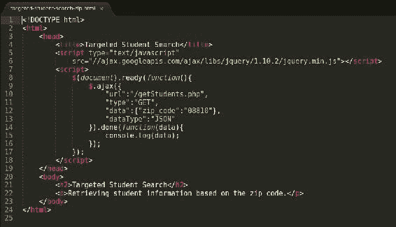
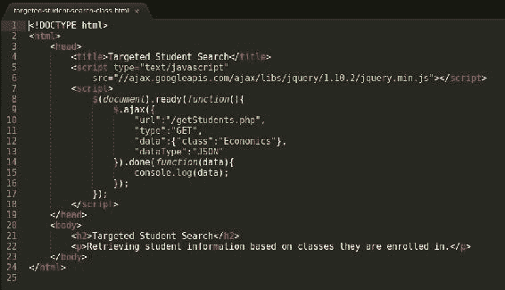
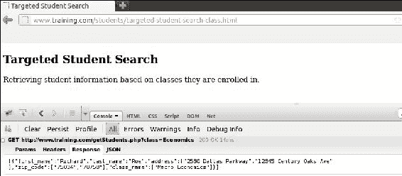
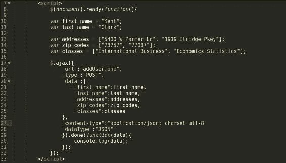
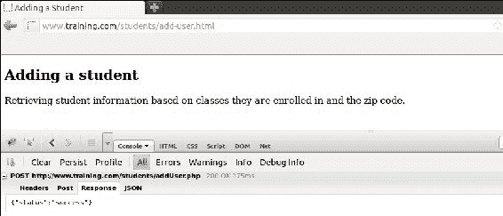
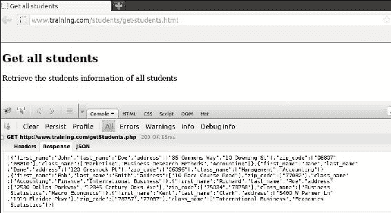
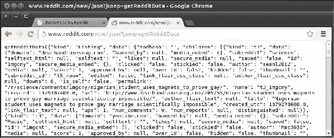
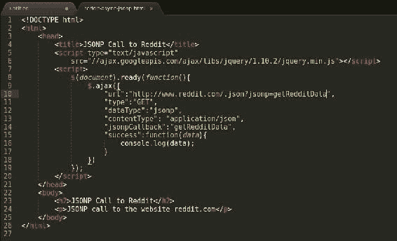

# 第五章。跨域异步请求

在上一章中，我们使用了 jQuery 的`getJSON`方法来获取`students` JSON 数据；在本章中，我们将迈出一步，将请求参数发送到服务器。数据源通常提供大量数据；这些数据通常是通用的，对于目标搜索来说可能太重了。例如，在`students` JSON 数据中，我们公开了可用的所有学生信息列表。对于寻找已注册某些课程的学生或居住在特定邮政编码区域以雇佣他们为实习生的数据供应商来说，这个数据源将是通用的。通常可以看到开发团队构建**应用程序编程接口**或**API**，为这样的数据供应商提供多种方式来定位他们的搜索。这对于数据供应商和拥有信息的公司来说都是双赢的，因为数据供应商只获取他们正在寻找的信息，数据供应商只发送请求的数据，从而节省了大量带宽和服务器资源。

# 使用 JSON 数据进行 GET 和 POST AJAX 调用

重要的是要理解同步和异步调用都是通过 HTTP 进行的，因此数据传输过程是相同的。从客户端机器到服务器机器传输数据的常用方法是`GET`和`POST`。HTTP 中最常见的请求方法是`GET`。当客户端请求网页时，Web 服务器使用 URL 处理 HTTP 请求。附加到 URL 的任何其他参数都作为从客户端发送到服务器的数据。由于参数是 URL 的一部分，因此很重要明确区分何时使用何时不使用`GET`请求方法。`GET`方法应该用于传递幂等信息，例如页面编号、链接地址或分页的限制和偏移量。请记住，通过`GET`请求方法可以传输多少数据存在大小限制。

`POST`请求方法通常用于发送大量数据和非平凡数据。与`GET`方法不同，数据通过 HTTP 消息主体传输；我们可以使用诸如 Fiddler 和浏览器中可用的开发者工具来跟踪通过 HTTP 消息主体传出的数据。通过`POST`方法传递的数据不能被书签或缓存，不同于`GET`方法。`POST`方法通常用于在使用表单时发送数据。在本章的示例中，让我们使用 jQuery 的`ajax`方法以 JSON 格式将数据发送到服务器。我们将使用修改后的`students` API，在那里我们将能够查询完整的学生信息—他们居住的邮政编码、他们所上的课程等，并使用组合搜索来找到居住在某个地区并上某个课程的学生。我们 API 的一个新功能是通过`POST`请求添加学生；学生信息必须以 JSON 对象的形式发送。

### 注意

这个 API 是用 PHP 和 MySQL 构建的。PHP 和 MySQL 文件将在代码包中的`scripts-chap5`文件夹中提供。

在我们开始构建脚本进行异步调用之前，让我们先看一下我们的`students` API 提供的 URL。第一个 API 调用将是通用搜索，将检索数据库中所有学生的信息。


由于我们还没有开始我们的目标搜索，因此 URL 已保留为通用搜索。现在让我们看看我们第一个目标搜索的 URL—按邮政编码搜索。这个 API 调用将返回居住在给定邮政编码区域的所有学生。


在这个例子中，该 URL 将返回所有居住在`08810`邮政编码的学生的信息。让我们将搜索条件从 ZIP 码切换到学生已经报名的课程。


在这个例子中，该 URL 将返回所有已经报名参加`经济学`课程的学生的信息。现在我们有了通过 ZIP 码和课程来定位搜索的能力，让我们来看看我们的 API 中另一个调用，通过用户所在的 ZIP 码和他或她已经报名的课程来检索信息。


在这个例子中，对 URL 的调用将返回所有已经报名参加`会计学`课程并居住在`77082`邮政编码的学生的信息。

到目前为止，这些调用都是使用 HTTP `GET`方法从客户端向服务器传输数据。我们 API 中的最后一个调用是使用 HTTP `POST`方法来添加学生。这个调用需要大量的数据输入，因为用户可以有多个 ZIP 码和多个地址，并且可以报名多个课程。


```js
get-students.html:
```


在这个调用中，我们首先导入 jQuery 库；我们可以开始使用`$`变量，因为页面上有 jQuery。我们首先添加一个回调函数，当文档准备就绪时触发。我们在这个例子中使用`ajax`方法，因为它允许我们进行`GET`和`POST`请求，并且在需要时，我们可以修改`ajax`调用中的`datatype`属性为`JSONP`，以进行异步跨域调用。

### 注意

不需要明确说明类型为 GET 时，但这有助于我们构建代码的一致性。

在我们的`ajax`调用中，我们首先将`url`属性设置为检索学生信息的 API 调用链接；我们指定这将通过 HTTP `GET`方法执行。我们设置的第四个属性是`dataType`属性；这用于指定我们期望返回的数据类型。因为我们正在处理`students`数据，所以我们必须将`dataType`属性设置为 JSON。重要的是要注意`done`回调，当服务器发送响应到我们的异步请求时触发。我们将从服务器发送的数据作为响应传递，并启动回调。

### 注意

`done`与`readyState=4`和`request.status=200`是相同的；我们在第四章中已经看过这个，*使用 JavaScript 进行异步调用*。

以下是输出：


在控制台窗口中，我们可以查看从服务器返回的 JSON 数据。这个 JSON 数据包含了很多信息，因为它获取了所有学生的数据。现在让我们根据 ZIP 码获取学生记录。在这个例子中，我们将使用`zip_code`参数，并将通过 HTTP `GET`方法异步地将一个值传递给服务器。这个 API 调用将为希望在特定地区搜索实习生的数据供应商提供服务。



在前面的例子中，我们首先导入了 jQuery 库，并绑定了一个回调函数来准备文档加载时触发的事件。重要的是要注意，我们在第 12 行使用`data`属性发送了一个 ZIP 码的键值对。


一旦调用被触发，我们就会将响应记录到控制台窗口。邮政编码`08810`匹配了一个用户，并且学生信息通过 JSON 反馈传递回来。定向搜索帮助我们缩小结果范围，从而为我们提供我们正在寻找的数据；下一个目标搜索将是使用学生注册的特定课程来检索数据。



前面的例子与使用邮政编码的定向搜索相同；在这里，我们用课程信息替换了邮政编码信息。我们正在检索所有已经注册`经济学`课程的学生。



针对性搜索返回了已经注册经济课程的学生信息。现在让我们用课程和邮政编码的组合来定位我们的搜索。


在前面的例子中，我们添加了课程和邮政编码的键值对，以向服务器发送多个搜索参数。


这个调用检索了已经注册`会计`课程并居住在邮政编码`77082`的学生信息。我们已经看到了通过 HTTP `GET`方法进行异步调用的多个例子；现在是时候将数据推送到服务器，以便使用我们的 API 添加学生。我们将使用我们的`addUser`调用来实时添加学生。这有助于开发团队从外部资源向我们的数据库添加学生信息。例如，我们是学生信息聚合器，我们将整合的学生信息卖给多个数据供应商。为了整合所有这些信息，我们可能会通过蜘蛛进行整合，其中脚本将访问网站并获取数据，或者通过外部资源进行整合，其中数据将是非结构化的。因此，我们将构造我们的数据并使用`addUser` API 调用将结构化的学生数据信息摄入到我们的数据存储中。同时，我们可以向信任的数据供应商公开这种方法，他们希望将我们没有的学生信息存储在远程位置，从而帮助他们将我们的数据存储成为单一数据位置。这对两家公司来说都是双赢，因为我们获得了更多的学生信息，而我们的数据供应商可以将他们的学生信息存储在远程位置。现在让我们看看这个`addUser`的 POST 调用将如何进行。



在这个调用中，我们正在做多件事情；我们首先声明一些变量来保存本地数据。我们有本地变量来保存学生的名字和姓氏的字符串值，还有保存课程、邮政编码和地址的数组变量，就像超人需要在几分钟内出现在多个地方一样。在我们的`ajax`调用中，要注意的第一个变化是`type`属性；因为我们正在推送大量用户数据，通常会使用 HTTP `POST`方法。`data`属性将使用为名字、姓氏、地址、邮政编码和课程声明的本地变量。从 API 中，当用户成功添加到数据库时，我们会发送一个成功消息作为响应，并将其记录到我们的控制台窗口中。



现在，为了验证新学生是否已经添加到我们的数据库中，我们可以运行我们的`getStudents` API 调用，以查看所有用户的列表。



`students` feed 中的最后一个学生是`Kent Clark`；测试我们的代码以确保一切都按预期工作是非常重要的。因为我们正在处理动态数据，因此保持数据完整性非常重要。每当对用户或其依赖项执行 CRUD 操作时，都必须通过查看检索到的数据并执行数据验证检查来验证该数据存储的数据完整性。

# 跨域 AJAX 调用的问题

到目前为止，我们所做的所有异步调用都是在同一个服务器上。有时我们会希望从不同的域加载数据，比如从其他 API 获取数据。服务器端程序被设计来处理这些调用；我们可以使用 cURL 来对不同的域进行 HTTP 调用以获取这些数据。这增加了我们对服务器端程序的依赖，因为我们需要对我们的服务器进行调用，然后服务器再对另一个域进行调用以获取数据，然后返回给客户端程序。这可能看起来是一个微不足道的问题，但我们在我们的 Web 架构中增加了一个额外的层。为了避免进行服务器端调用，让我们尝试看看是否可以对不同的域进行异步调用。在这个例子中，让我们使用 Reddit 的 JSON API 来获取数据。


这类似于我们之前所做的异步调用，用于从我们的`students` API 中检索数据。重要的是要理解，在以前的情况下，我们不必在 URL 中提到整个 URL，因为我们是在同一个域中进行调用。


Reddit 网站提供了一个出色的 JSON API，我们可以在 URL 后面添加`.json`，就可以获取到该聚合网页的 JSON 源，前提是该页面是 Reddit 的一部分。让我们来看看当我们跨域进行这个异步调用时生成的输出。


在我们的异步调用中，如果请求成功，数据将被记录到控制台窗口，但我们在控制台窗口中看到了一个错误。错误显示`XMLHTTPRequest`对象无法加载我们提供的 URL，因为它不是源自我们的[www.training.com](http://www.training.com)域的。**同源策略**是 Web 浏览器遵循的安全措施，以防止一个域访问另一个域上的信息。Web 应用程序使用 cookie 来存储有关用户会话的基本信息，以便在用户再次请求同一网页或请求同一域上的不同网页时提供直观的用户体验。为了防止外部网站窃取这些信息，Web 浏览器遵循**同源策略**。

同源策略在传入请求中寻找三样东西；它们是主机、端口和协议。如果其中任何一个与现有域不同，请求将无法完成，会返回跨域错误。

| 变体 http://www.training.com | 结果 |
| --- | --- |
| `http://www.training.com/index.php` | 通过 |
| `https://www.training.com/index.php` | 失败（协议） |
| `http://www.training:81.com/index.php` | 失败（端口） |
| `http://test.training.com.com/index.php` | 失败（主机） |
| `http://www.differentsite.com/index.php` | 失败（主机） |

# JSONP 介绍

为了绕过同源策略，我们将使用 JSONP，即带填充的 JSON。同源策略的一个例外是`<script>`标签，因此可以跨域传递脚本。JSONP 利用这个例外来将数据作为脚本传递到不同的域，通过添加填充使 JSON 对象看起来像一个脚本。在 JavaScript 中，当调用带有参数的函数时，我们调用函数并添加参数。使用 JSONP，我们将 JSON 数据流作为参数传递给一个函数；因此，我们将我们的对象填充到一个函数回调中。必须在客户端使用这个填充了 JSON 数据流的函数来检索 JSON 数据流。让我们快速看一个 JSONP 的例子。


在这个例子中，我们将`students`对象填充到`myCallback`函数中，并且我们必须重用`myCallback`函数以检索`students`对象。现在我们了解了 JSONP 的工作原理，让我们使用 Reddit 的 JSON API 来获取数据。我们需要对访问数据的方式进行一些更改——我们需要找到一种方式将数据流填充到一个可以在客户端使用的回调中。Reddit 网站提供了一个`jsonp` `GET`参数，该参数将获取回调的名称以提供数据。



# 实现 JSONP

我们正在使用与之前相同的 URL 来获取数据，但是我们已经添加了`jsonp`参数，并将其设置为`getRedditData`；重要的是要注意，现在该数据流已经填充到我们的回调`getRedditData`中。现在让我们替换之前脚本中的 URL 属性，创建一个新的脚本来获取 JSON 数据流。



一些属性，如`url`和`dataType`已经被修改，一些新属性，如`contentType`和`jsonpCallback`已经被添加。我们已经讨论了`url`属性的更改，现在让我们看看其他属性。


早先，`dataType`属性被设置为`json`，因为传入的数据流是`json`类型，但是现在 JSON 数据流被填充到一个回调中，因此必须进行切换，以便浏览器期望的是回调而不是 JSON 本身。已添加的新属性是`contentType`和`jsonpCallback`；`contentType`属性指定要发送到 Web 服务器的内容类型。`jsonpCallback`获取填充了 JSON 数据流的回调函数的名称。


当脚本被触发时，从`getRedditData`回调中检索到的数据被传递到`success`属性中，将我们的 JSON 对象记录到控制台窗口中。一个重要的事实需要注意，JSONP 调用是一个脚本调用，而不是 XHR 请求，因此 JSONP 调用将在`JS`或`<scripts>`标签中可用，而不是在控制台窗口的`XHR`标签中。

# 总结

HTTP `GET`和`POST`请求方法是用于从客户端向服务器传输数据的最流行的 HTTP 方法之一。本章深入了解了如何使用异步请求来传输数据的`GET`和`POST`请求方法。然后，我们继续研究跨域异步请求的问题；我们利用`<script>`标签的例外来执行我们的 JSONP 异步脚本调用，以从不同的域获取数据。在下一章中，我们将构建我们的照片库应用程序。
