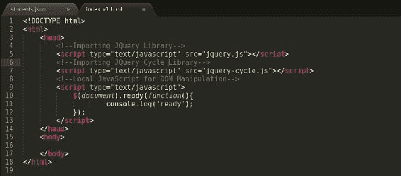
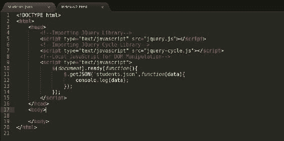
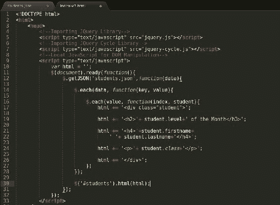
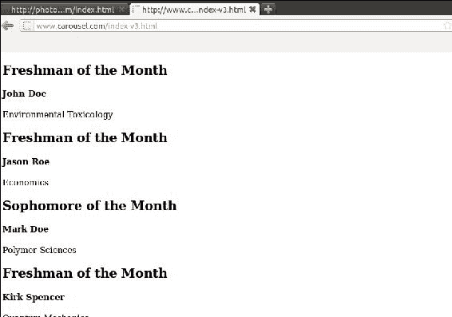
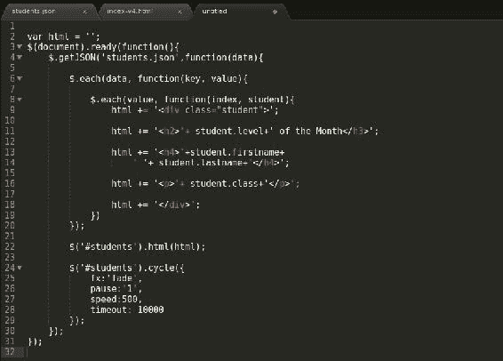
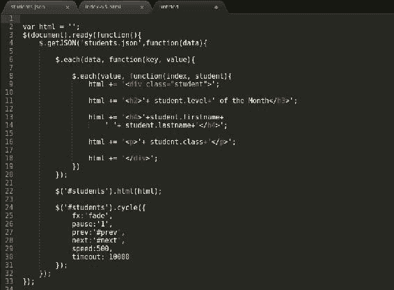

# 第六章：构建 Carousel 应用程序

我们在掌握 JavaScript 和 JSON 的旅程中走了很长一段路；现在是时候忙起来，构建一个由 JSON 驱动的端到端项目。在我们的旅程中，我们遇到了各种概念，如 JavaScript、JSON、服务器端编程的使用、AJAX 和 JSONP。在这个照片库应用程序中，让我们把所有这些都用起来。我们将构建一个旋转通知板应用程序，它应该显示本月的顶尖学生。这个应用程序应该提供 Carousel 功能，如导航按钮、自动播放内容、在给定点显示单个项目，并跟踪第一个和最后一个内容。

# 设置应用程序

让我们开始建立一个文件夹，用于保存这个应用程序的文件。这个应用程序将需要一个包含 Carousel 的 HTML 文件；它将需要一些库，如 jQuery 和 jQuery Cycle。我们将不得不导入这些库；我们还需要一个包含这个练习数据的 JSON 文件。要下载 jQuery 文件，请访问[`www.jquery.com`](http://www.jquery.com)。正如我们已经观察到的，jQuery 是开发人员可用的最流行的 JavaScript 库。有一个日益增长的开发者社区，他们使 jQuery 变得越来越受欢迎。我们将使用 jQuery Cycle 库来驱动我们的 Carousel 应用程序。jQuery Cycle 是最受欢迎和轻量级的循环库之一，具有众多功能；它可以从[`malsup.github.io/jquery.cycle.all.js`](http://malsup.github.io/jquery.cycle.all.js)下载。

这些文件必须在文档根目录内的一个文件夹中；在这个项目中，我们将使用一个实时 Apache 服务器，并且我们将通过 AJAX 摄取 JSON feed。以下是文件添加后文件夹应该看起来的示例：

现在我们已经在文档根目录中安排好了库，让我们来制作一个基本的 HTML 文件，将这些文件导入到网页中，如下面的截图所示：

index-v1.html

这是我们的初始索引网页，将 JavaScript 文件加载到网页上。当通过 Web 浏览器启动此文件时，必须加载两个 JavaScript 库，并且`ready`应该打印到控制台窗口。现在，让我们继续构建我们的 Carousel 应用程序。接下来的要求是数据文件；它将类似于我们在之前章节中使用的`students` JSON feed。我们将把它们加载到旋转应用程序中，而不是将它们全部打印在一行中。

# 为 Carousel 应用程序构建 JSON 文件

让我们假设我们是一所教育机构，我们有一个传统，即每月承认我们学生的努力。我们将挑选每个课程的顶尖学生，并在我们的通知板旋转应用程序上显示他们的名字。这个通知板旋转应用程序经常作为其他学生的动力，他们总是希望自己能上榜。这是我们教育机构鼓励学生在课程中表现良好的方式。示例 JSON feed 将如下截图所示：

对于我们的通知板旋转应用程序，我们将需要基本的学生信息，如名字、姓氏、当前教育水平和他们擅长的课程。

index-v2.html

在上述截图中，我们使用 jQuery 的`getJSON()`函数将 JSON 数据引入文档中。当`index-v2.html`文件加载到浏览器中时，`students` JSON 对象数组将加载到控制台窗口上。现在是时候开始从 JSON 对象中提取数据，并开始将其嵌入到 DOM 中。让我们使用 jQuery 的`each()`函数循环遍历`students` JSON 数据并将数据加载到页面上。

jQuery 中的`each()`函数类似于流行的服务器端语言中提供的`foreach()`迭代循环，以及原生 JavaScript 中提供的`for in()`迭代循环。`each()`迭代器将数据作为其第一个参数，并将该数据中的每个项作为单个键值对迭代地传递到回调函数中。这个回调是一系列在该键值对上执行的脚本。在这个回调中，我们正在构建将附加到 DOM 上的`div`元素的 HTML 文件。我们使用这个回调来迭代地构建`students` JSON 对象中存在的所有元素的 HTML 文件。

index-v3.html

在`index-v3.html`文件中，我们使用 jQuery 的`each()`函数来遍历`students` JSON 数据，并构建将显示学生信息的 HTML 文件，例如名字，姓氏，大学年级和所注册的课程。我们正在构建动态 HTML 并将其分配给`html`变量。`html`变量中的数据将稍后添加到 ID 为`students`的`div`元素中。如下截图所示：

上述截图显示了`index-v3.html`主体的输出：

当脚本加载到 Web 浏览器中时，脚本会检查文档是否准备就绪。一旦文档准备就绪，就会向服务器发出 AJAX 调用以检索 JSON 数据。检索到 JSON 数据后，`students` JSON 对象数组中的每个对象都将传递到生成带有`student`类的 HTML `div`元素的回调函数中。这将重复，直到在最后一个元素上执行回调，一旦在最后一个元素上执行回调，此 HTML 文件将附加到具有 ID 为`students`的 HTML 中的`div`元素中。

# 使用 jQuery Cycle 创建 Carousel 应用程序

我们已经开发了一个网页，将所有学生数据加载到 HTML 文件中；现在是时候使用这些数据构建 Carousel 应用程序了。我们将使用 jQuery Cycle 插件来在我们的公告板应用程序上旋转学生信息。jQuery Cycle 是一个幻灯片插件，支持多种类型的过渡效果在多个浏览器上。可用的效果包括`fade`、`toss`、`wipe`、`zoom`、`scroll`和`shuffle`。该插件还支持有趣的悬停暂停功能；还支持点击触发和响应回调。

对于我们的 Carousel 示例，让我们保持简单，使用基本选项，例如淡入淡出效果来旋转学生，启用暂停，以便用户悬停在循环上时，旋转应用程序会暂停以显示当前学生的信息。最后，我们将设置速度和超时值，以确定从一个学生过渡到另一个学生需要多长时间。

index-v4.html

在上面的截图中，我们设置了`cycle`插件，并将`cycle`插件添加到`students`的`div`元素中。`cycle`插件以 JSON 对象作为其参数，以向`div`元素添加旋转功能。在这个 JSON 对象中，我们添加了四个属性：`fx`、`pause`、`speed`和`timeout`。`fx`确定在`html`元素上执行的效果。`fade`是`cycle`插件中常用的效果。jQuery Cycle 插件支持的其他流行效果包括 shuffle、zoom、turndown、scrollRight 和 curtainX。我们使用的第二个属性是`pause`属性，它确定当用户悬停在`rotator`元素上时旋转是否已停止；它接受一个 true 和 false 值来确定旋转是否可以暂停。我们可以提供布尔值，如 True 或 False，或传递一个表示 True 和 False 的 1 或 0。接下来的两个属性是`speed`和`timeout`；它们确定旋转发生的速度以及在显示下一项之前需要多长时间。当包含更新脚本的网页加载到 Web 浏览器中时，整个`students`对象被解析为本地 JavaScript 字符串变量，并附加到 DOM，只有该旋转对象中的第一个元素被显示，而其余元素被隐藏。这个功能由`cycle`插件在后台处理。下面的截图显示了从之前的代码示例生成的 Carousel：

让我们通过添加早期和后续处理程序来增强此页面的用户体验，以便为用户提供自定义控制器来处理旋转功能，如下面的截图所示：

index-v5.html

在`cycle`对象中，我们添加了两个名为`prev`和`next`的新属性。`prev`和`next`属性的值将是 DOM 上存在的元素的 HTML `id`属性。为了处理这一变化，HTML 文件必须修改如下：

在上面的截图中，我们添加了两个`id`值为`prev`和`next`的锚元素，这些元素在`cycle`对象中被引用。

在上面的截图中显示的**Prev**和**Next**链接将处理我们的公告板旋转应用程序的旋转。这是使用 jQuery 和 JSON 构建 Carousel 应用程序的快速方法。这个示例可以用来构建更复杂的 Carousel 应用程序，可以分别包含图片和视频，用于照片和视频库 Carousel 应用程序。

# 总结

在本章中，我们将 JavaScript、jQuery 和 JSON 知识付诸实践，构建了一个整洁的 Carousel 公告板旋转应用程序。我们逐步进行了数据源的摄取、从数据源动态生成模板、将数据源附加到`div`元素，然后将`div`元素绑定到`cycle`插件。这个公告板旋转应用程序为我们提供了一个洞察更大的 Carousel 项目，可以用很少的开发工作来开发。在下一章中，我们将看看 JSON 的替代实现。
