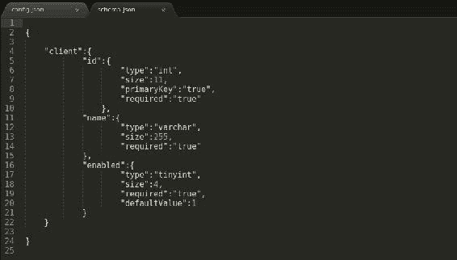

# 第七章：JSON 的替代实现

在之前的章节中，我们已经将 JSON 作为 HTTP 数据交换格式进行了处理；现在让我们看看 JSON 被使用的流行替代方法。在过去的几年中，各种编程和脚本语言中的软件模块和包的数量急剧增加。众包软件开发一直在上升。像 SourceForge、Pastebin 和 GitHub 这样的基于网络的托管服务在过去几年中变得越来越受欢迎，并为开发人员合作和回馈社区打开了大门。这些模块和包可以独立集成，也可以作为现有软件框架的依赖程序使用。这种行为在开源社区中是一种常见做法，开发人员可以独立工作，贡献增强他们正在使用的框架的软件包。

诸如 PHP、Python 和 JavaScript 之类的脚本语言拥有大量的贡献软件包和模块。这里的优势是使用预构建的软件包，它提供了某些功能，并且已经经过社区的大量测试。引入单个框架或多个框架到软件项目中的反面是必须了解这些框架如何加载到项目中，它们如何从当前项目的不同部分访问，这些框架是否有任何依赖关系，最后，它们如何影响整个项目。这些问题可以通过使用**依赖管理器**来解决。

依赖管理器是一个软件程序，它跟踪所有必要的基本程序，这些程序是依赖程序运行所必需的。在软件开发生命周期中的一个常见做法是使用单元测试框架进行单元测试；单元测试框架可能需要安装一些基本库，或者可能需要一些设置来启用该框架的使用。

这些操作通常通过编写快速脚本来处理，但随着项目规模的增长，依赖项也随着项目的增长而增加。同样，跟踪这些变化并确保不同团队在项目上的更新，这是通过脚本完成的，是一项艰巨的任务。通过引入依赖管理器，我们将自动化整个过程，这将增加一致性并节省时间。

# 依赖管理

依赖管理通常有点困难，对于新加入的开发人员来说，将新框架添加到他们的项目中，设置项目并使其运行可能是令人生畏的。像 Composer for PHP 这样的依赖管理器解决了这个问题。它被认为是所有项目之间的“粘合剂”，这是有充分理由的。Composer 使用 JSON 来跟踪给定项目的所有依赖关系。Composer 的主要工作是从远程位置下载库并将其存储在本地。为了告诉 Composer 我们需要哪些库，我们需要设置`composer.json`文件。这个文件跟踪所有特定的库、它们的版本以及给定库应该部署到的环境。例如，一个单元测试框架库永远不应该进入生产环境。在一个旧公司中，有一个同事随机测试我们的生产实例，通过运行一个单元测试删除了整个用户表；我们不得不从前一晚的数据库备份中恢复整个用户表。

让我们快速深入了解 JSON 是如何用于处理依赖管理的。

composer.json

在`composer.json`文件中，我们添加了两个要求，以安装特定版本的 PHP 和 PHPUnit。一旦文件添加到项目中，我们可以使用 Composer 的`install`命令来安装这些依赖项。Composer 还带有一个`update`命令，负责对给定包进行的任何更新。

### 注意

有关 Composer 的更多信息，请访问[`www.getcomposer.org`](http://www.getcomposer.org)。

`Node.js`是一个流行的软件平台，使用 JSON 数据格式来跟踪依赖关系。**Node Packaged Modules**（**NPM**）是开发人员用于安装和集成外部模块到他们的代码中的包管理器。对于每个`Node.js`项目，在文档根目录中都有一个`package.json`文件，用于跟踪所有元数据，如项目名称、作者名称、版本号、运行该项目所需的必需模块，以及运行该项目所需的底层守护程序或引擎。让我们来看一个我`Node.js`项目中的`package.json`文件的示例。

package.json

`package.json`文件是一个大的 JSON 对象，用于跟踪元数据，如项目的名称、作者的详细信息和所需的模块。

### 注意

有关 NPM 的更多信息，请访问[`www.npmjs.org`](https://www.npmjs.org)。

# 存储元数据的 JSON

与依赖管理器相同，JSON 也用于存储软件项目的元数据。在 JSON 变得流行之前，配置和元数据要么存储在文本文件中，要么存储在特定于语言的文件中，例如 PHP 的`config.php`，Python 的`config.py`和 JavaScript 的`config.js`。所有这些现在都可以被一个与语言无关的`config.json`文件替代；对于非 JavaScript 库，请使用 JSON 库来解析它。让我们快速看一个示例`config.json`文件：

config.json

在`config.json`文件中，我们将元数据存储为 JSON 对象。我们指定了一些重要信息，如项目名称，项目的环境（根据文件所在的服务器而变化），在引导应用程序期间必须自动加载的任何类，以及我们想要排除的任何类或文件夹。最后，使用`RECURSIVE`键，我们还指定了有文件夹和这些文件夹有文件。

### 注意

引导是应用程序的启动过程，在这个过程中，我们准备该应用程序以实现其目的。

一旦我们有了`config.json`文件，我们可以使用 Python 中的`json.loads`方法，或者我们可以使用 PHP 中的`json_decode`方法来解析配置对象以检索数据。JSON 对象也可以用来存储数据库模式；这有助于开发团队的其他成员在团队中的一个开发人员对数据库进行更改时更新他们的数据库模式。处理这个的一个聪明方法是在`schema.json`文件上编写一个触发器，如果该文件有更新，数据库中的模式必须通过数据库迁移脚本反映新的更改。让我们快速看一个示例`schema.json`文件。

schema.json

在`schema.json`示例中，我们正在构建将存储数据库模式信息的模式 JSON 对象。`client`是我们模式中表的名称。`client`表有三列——客户端的 ID、名称和状态，即客户端是否启用或禁用。每个列都包含列 JSON 对象，提供模式信息，如列的数据类型和大小，是否具有默认值或主键约束。

# 与 YAML 的比较

YAML 是另一种软件语言无关的数据交换格式，正在逐渐流行起来。**YAML**是**YAML Ain't Markup Language**的递归缩写，通常用于存储配置、模式和属性等元数据。YAML 被认为是一种人类可读的数据序列化标准，依赖于空格、定位和简单字符作为行终止符，类似于流行的脚本语言如 Ruby 和 Python。YAML 对元素之间的间距要求很严格，不友好地使用制表符。与 JSON 类似，YAML 的键/值对由冒号分隔。与文本格式类似，使用连字符来表示列表项，不同于 JSON，其中列表项放在数组或子对象中。由于 YAML 是软件语言无关的，我们需要解析器来理解文件中的内容。大多数流行的语言，如 PHP、Python、C++、Ruby 和 JavaScript，都有这样的解析器。让我们构建一个 YAML 格式的`config.json`文件来了解 YAML 是什么。

config.yaml

与我们的 config JSON 对象类似，YAML 文件包含所有数据；不同之处在于数据的排列方式——作为一系列项目——以及如何使用间距和定位来排列数据列表。互联网上有多个 YAML 资源可用于验证、序列化和反序列化 YAML 数据。

### 注意

有关 YAML 的更多信息，请访问[`www.yaml.org`](http://www.yaml.org)，该网站以 YAML 格式表示。

# 摘要

JSON 迅速成为互联网上最流行的数据交换格式，但它并不仅限于数据交换。我们还可以使用 JSON 来存储依赖管理器、包管理器、配置管理器和模式数据存储的元数据。我们介绍了 YAML，它被认为是 JSON 的一种替代方案。在下一章中，我们将看看可以用来调试、验证和格式化 JSON 的不同资源。
