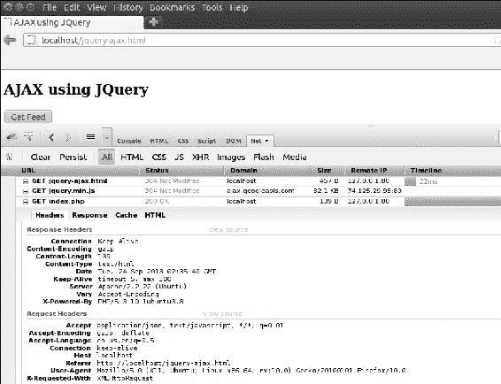

# 第八章。调试 JSON

JSON 在过去几年里取得了长足的发展，因此有大量免费资源可供我们了解我们正在使用的 JSON 对象。正如我们之前讨论过的，JSON 可以用于多种目的，重要的是要了解可能破坏 JSON 的简单事情，比如忽略双引号，或在 JSON 对象中的最后一项上使用尾随逗号，或者 Web 服务器发送错误的内容类型。在本章中，让我们讨论一下我们可以调试、验证和格式化 JSON 的不同方法。

# 使用开发者工具

几乎所有主流浏览器，如 Mozilla Firefox，Google Chrome，Safari 和 Internet Explorer，都有强大的调试工具，帮助我们了解正在进行的请求和返回的响应。JSON 可以是请求的一部分，也可以是响应的一部分。Google Chrome，Safari 和较新版本的 Internet Explorer 都内置了开发者工具。Firebug 是一个非常受欢迎的 Web 开发工具包，适用于 Mozilla Firefox。Firebug 是一个外部插件，必须安装在浏览器上；它是最早为了帮助 Web 开发人员使用 Firefox 而构建的 Web 开发工具包之一。

### 注意

要安装 Firebug，请访问[`getfirebug.com/`](http://getfirebug.com/)，并在登陆页面上点击**安装 Firebug**。

这些开发者工具提供对 HTML DOM 树的访问，并实时了解 HTML 元素在页面上的排列方式。开发者工具配备了一个网络（或**Net**）选项卡，允许我们跟踪所有资源，如图像、JavaScript 文件、CSS 文件、Flash 媒体以及客户端正在进行的任何异步调用。控制台窗口是开发者工具中的另一个受欢迎的功能。顾名思义，这个窗口为我们提供了一个运行时 JavaScript 控制台，用于测试任何即时脚本。要在 Firefox 上启动开发者工具，加载网页到浏览器中，右键单击网页；这将给我们一个选项列表，选择**使用 Firebug 检查元素**。要在 Google Chrome 和 Safari 上加载开发者工具，右键单击网页，然后从选项列表中选择**检查元素**。在使用 Safari 时，请记住必须启用开发者工具；要启用开发者工具，点击**Safari**菜单项，选择**首选项**，然后点击**高级**选项卡，并勾选**在菜单栏中显示开发菜单**以查看开发者工具。在 Internet Explorer 上，按下键盘上的*F12*键即可启动开发者工具窗口。在第四章中，我们首次对一个实时 Web 服务器进行了异步调用，以请求 JSON 数据使用 jQuery。让我们使用该程序并使用开发者工具调试数据；在本例中，我们将使用 Firefox 网页浏览器：

！使用开发者工具

jquery-ajax.html

在页面加载时，当用户右键单击并选择**使用 Firebug 检查元素**选项时，默认加载**HTML**选项卡，并且用户可以看到 HTML DOM。在我们的示例中，我们已经将`click`事件处理程序绑定到**获取 Feed**按钮。让我们看看在点击按钮后控制台输出的内容；要在控制台窗口中查看输出，点击**控制台**选项卡：

！使用开发者工具

一旦收到响应，JSON 源将被记录到控制台窗口的**Response**选项卡中。了解 JSON 源以解析它是很重要的，开发人员工具的控制台窗口为我们提供了分析 JSON 源的简单方法。让我们继续研究开发人员工具，并访问 Firefox 中的**Net**选项卡，以了解客户端和服务器如何通信以及客户端期望的数据内容类型：

在 Net 窗口中，我们应该首先点击异步调用的 URL，该调用是向`index.php`发出的。一旦点击了该链接，在**Headers**部分，我们应该观察到**Accept**头部，它期望`application/json`的**MIME**类型，以及**X-Requested-With**头部是**XMLHttpRequest**，这表明这是一个异步请求。Net 窗口中的**Response**选项卡与控制台窗口中的**Response**选项卡相同，它将显示此请求的 JSON 源。在本书中，我们广泛使用了`console.log`方法，该方法将数据打印到控制台窗口，这是开发人员工具的另一个有用功能。

# 验证 JSON

与我们的调试资源类似，有很多流行的网络工具可以帮助我们验证我们构建的 JSON。**JSONLint**是最受欢迎的网络工具之一，可用于验证我们的 JSON 源。

### 注意

当我们使用诸如 PHP、Python 或 Java 之类的服务器端程序时，内置的 JSON 编码库会生成 JSON 源，通常该源将是有效的 JSON 源。

JSONLint 具有非常直观的界面，允许用户粘贴要验证的 JSON，并根据我们粘贴的 JSON 源返回成功消息或错误消息。让我们从验证一个错误的 JSON 开始，看看会返回什么错误消息，然后让我们修复它以查看成功消息。在这个例子中，我将复制上一个例子中的`students`源，并在第二个元素的末尾添加一个逗号：

请注意，我们在 JSON 对象的最后一项中添加了一个逗号，而 JSONLint 最好的部分是提供了描述性的错误消息。我们遇到了一个**解析错误**，为了简化生活，消息还告诉我们错误可能出现的行号。解析器期望一个字符串、一个数字、一个空值或一个布尔值，因为我们没有提供任何值，所以我们遇到了这个错误。为了修复这个错误，我们要么必须向该 JSON 对象添加一个新项以证明逗号的存在，要么就必须去掉逗号，因为后面没有任何项了。

一旦我们去掉了末尾的逗号并进行验证，我们就会收到成功消息。易用性和描述性消息使 JSONLint 成为 JSON 验证的首选网站之一。

### 注意

要使用 JSONLint，请访问[`www.jsonlint.com`](http://www.jsonlint.com)。

# 格式化 JSON

JSONLint 不仅是一个在线 JSON 验证器，它还可以帮助我们格式化 JSON 并使其看起来漂亮。通常 JSON 源的大小都很大，提供树形结构以遍历 JSON 对象的在线编辑器总是很有帮助。**JSON Editor Online**是我最喜欢的在线编辑器之一，它提供了一个易于导航的树形结构，可以处理和格式化大型 JSON 对象。

### 注意

要使用 JSON Editor Online，请访问[`www.jsoneditoronline.org`](http://www.jsoneditoronline.org)。

我们首先将我们的 JSON 示例代码粘贴到左侧窗口中，然后点击中间的右箭头按钮生成我们的树结构。一旦我们对树结构进行更改，我们可以点击左箭头按钮格式化我们的数据，使其准备在其他地方使用。

# 总结

调试、验证和格式化是开发人员永远不能忽视的三件事。在本章中，我们看了一些资源，比如用于浏览器的开发者工具包进行调试，以及如何利用这些开发者工具包，还了解了如何使用 JSONLint 进行验证和 JSON Editor Online 进行格式化。

这是*JavaScript 和 JSON 基础*的结尾，旨在为您提供关于数据如何以 JSON 数据格式存储和传输的深入了解。我们已经亲身体验了在同一域内通过 HTTP 异步请求传输 JSON，以及跨域的 HTTP 异步请求。我们还研究了 JSON 数据格式的替代实现。这是理解 JSON 并开发交互式和响应式网络应用的长期旅程的坚实开端。
