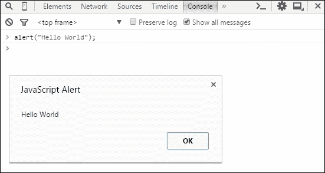
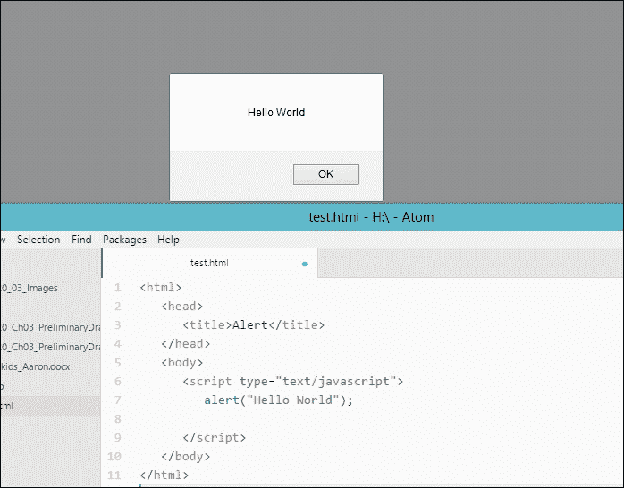
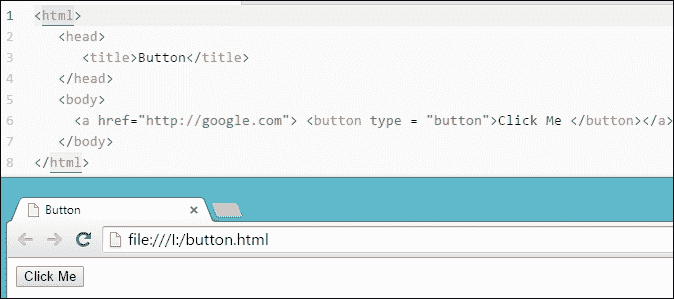
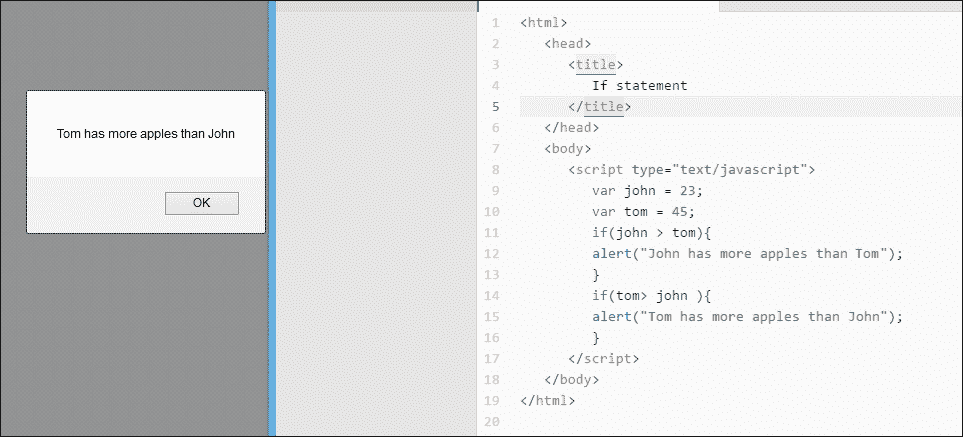
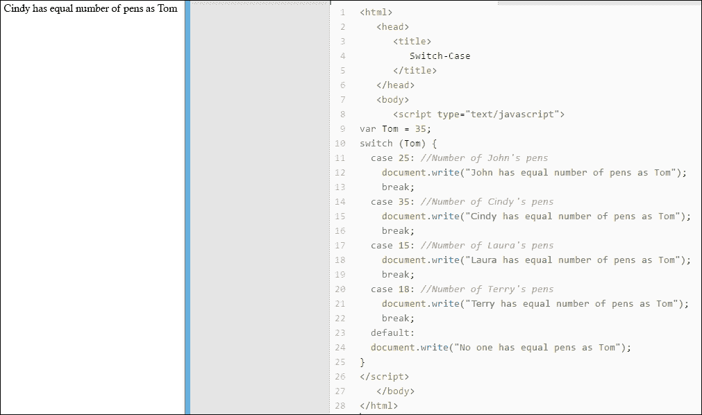
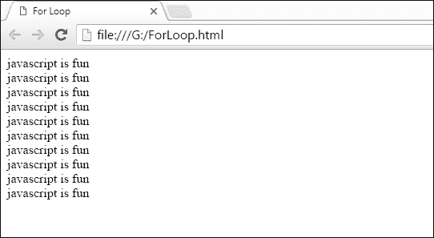

# 第四章：深入了解

在我们迄今学到的大多数 JavaScript 程序中，代码行是按照它们在程序中出现的顺序执行的。每行代码只执行一次。因此，代码不包括测试条件是否为真或假，或者我们没有执行任何逻辑语句。

在本章中，您将学习一些逻辑编程。您将学习以下主题：

+   循环

+   if 语句

+   开关情况

您已经知道如何在 HTML 文档中嵌入 JavaScript 代码。在开始本章之前，您将学习一些 HTML 标签和 JavaScript 方法。这些方法和标签将在整本书中使用。

### 注意

在面向对象编程中，我们不直接对对象外部的数据执行任何操作；我们通过传递一个或多个参数来要求对象执行操作。这个任务被称为对象的方法。

# JavaScript 方法

在之前的章节中，您学会了如何使用`document.write()`打印内容。现在，您将学到更多内容。

我们将在控制台和 HTML 文档上检查这些方法，如下所示：

+   使用 JavaScript 显示警报或弹出框，我们使用以下方法：

```js
alert("Hello World");
```

在控制台上输入以下内容并按*Enter*，您将看到一个弹出框显示**Hello World**：



您可以编写代码在 HTML 文档中显示类似以下内容的弹出框：

```js
<html>
  <head>
    <title>Alert</title>
  </head>
  <body>
    <script type="text/javascript">
      alert("Hello World");

    </script>
  </body>
</html>
```

输出将如下所示：



+   如果您想从用户那里获取信息，您需要使用提示框来做到这一点。例如考虑以下内容：

+   您想要输入用户名并在主网页上打印它。

+   您可以使用`window.prompt()`方法来实现这一点。

+   `window.prompt()`的结构与以下内容类似：

```js
window.prompt("What is your name?"); // You can type anything between the inverted commas.
```

+   现在，您需要将信息存储在一个变量中。您已经从之前的章节中知道如何做到这一点。输入以下内容并按*Enter*：

```js
var name = window.prompt("what is your name?");
```

+   在控制台上运行此代码后，您将被要求在文本框中输入一些内容。输入信息后，您需要按**OK**按钮。您的信息现在存储在`name`变量中：

+   如果您想在网页上打印变量，您可以使用`document.write();`方法，如下所示：

```js
document.write("Hello "+name+"!");
```

+   这些步骤的输出如下截图所示：

+   HTML 文档中的代码如下所示：

```js
<html>
  <head>
    <title>Prompt</title>
  </head>
  <body>
    <script type="text/javascript">
      var name = window.prompt("What is your name?");
      document.write("Hello "+name+"!"); 
    </script>
  </body>
</html>
```

# HTML 按钮和表单

在上一章中，您学习了一些 HTML 标签。现在，我们将学习一些标签，这些标签将使学习 HTML 更有趣。

## 按钮

如果您想在 HTML 网页上添加按钮，您可以使用`<button></button>`标签。标签的结构如下所示：

```js
<button type="button">Click Here </button>
```

如果您想让按钮执行某些操作，例如打开一个 URL，您可以考虑以下代码：

```js
<a href="http://google.com/"><button type="button">Click Me </button> </a>
```

代码的输出如下：



## 形式

在 HTML 中，我们使用表单来表示包含交互控件以向 Web 服务器提交信息的文档部分。HTML 表单的基本结构如下所示：

```js
<form>
  User ID: <input type = "text"><br>
  Password: <input type ="password"><br>
</form>
```

代码的输出将如下所示：


现在让我们深入一点！

# if 语句

假设约翰有 23 个苹果，汤姆有 45 个苹果。我们想要使用 JavaScript 编程来检查谁有更多的苹果。我们需要让我们的浏览器理解**if 语句**。

### 注意

if 语句比较两个变量。

要检查我们的条件，我们需要声明包含苹果数量的两个变量，如下所示：

```js
var john = 23;
var tom = 45;
```

要检查哪个数字更大，我们可以应用如下所示的 if 语句：

```js
if(john > tom)
{
  alert("John has more apples than tom");
}
```

假设我们不知道哪个变量更大。然后，我们需要检查这两个变量。因此，我们需要将以下代码包含到我们的程序中：

```js
if(tom > john )
{
  alert("Tom has more apples than John");
}
```

在 HTML 页面中的整个代码如下：

```js
<html>
  <head>
    <title>
      If statement
    </title>
  </head>
  <body>
    <script type="text/javascript">
      var john = 23;
      var tom = 45;
      if(john > tom){
        alert("John has more apples than Tom");
      }
    if(tom> john ){
      alert("Tom has more apples than John");
    }
    </script>
  </body>
</html>
```

输出将如下所示：



您在前几章中学习了条件运算符。在 if 语句中，您可以使用所有这些条件运算符。以下是一些带有注释的示例：

```js
If(tom => john){
//This will check if the number of apples are equal or greater. 
}
If(tom <= john)
{
//This will check if the number of apples are equal or less. 
}
If(tom == john)
{
//This will check if the number of apples are equal. 
}
```

要检查多个条件，您需要使用 OR（`||`）或 AND（`&&`）。

考虑以下示例：

```js
If(john == 23 || john => tom)
{
/* This will check if John has 23 apples or the number of John's apple is equal to or greater than Tom's. This condition will be full filled if any of these two conditions are true. 
*/
}
If(tom == 23 && john <= tom)
{
/* This will check if Tom has 23 apples or the number of john's apple is less than Tom's or equal. This condition will be full filled if both of these two conditions are true. 
*/
}
```

# Switch-case

如果您有三个以上的条件，最好使用**switch-case**语句。switch-case 的基本结构如下所示：

```js
switch (expression) {
  case expression1:
    break;
  case expression2:
    break;
  case expression3:
    break;
//-------------------------------
//-------------------------------
//  More case
//-------------------------------
//  -------------------------------
  default:    
}
```

每个`case`都有一个`break`。但是，`default`不需要`break`。

假设汤姆有 35 支笔。他的朋友约翰、辛迪、劳拉和特里分别有 25、35、15 和 18 支笔。现在，约翰想要检查谁有 35 支笔。我们需要将汤姆的笔数与每个人的笔数进行比较。我们可以使用 switch-case 来处理这种情况。代码将如下所示：

```js
<html>
  <head>
    <title>
      Switch-Case
    </title>
  </head>
  <body>
    <script type="text/javascript">
      var Tom = 35;
      switch (Tom) {
        case 25: //Number of John's pens
          document.write("John has equal number of pens as Tom");
        break;
        case 35: //Number of Cindy's pens
          document.write("Cindy has equal number of pens as Tom");
        break;
        case 15: //Number of Laura's pens
          document.write("Laura has equal number of pens as Tom");
        break;
        case 18: //Number of Terry's pens
          document.write("Terry has equal number of pens as Tom");
        break; 
        default:
          document.write("No one has equal pens as Tom");
      }
    </script>
  </body>
</html>
```

输出将如下所示：



### 注意

现在，将第二个案例（`35`）的值更改为其他，并检查您的结果。

## 练习

1.  假设您每天都需要上学，除了星期六和星期天。编写一个代码，您将输入今天的日期数字，网页将向您显示是否需要去上学。（提示：使用 switch case。）

1.  假设您有一个花园，您在月份的偶数天给所有植物浇水。编写一个代码，它将向您显示您是否需要在那一天给植物浇水。（提示：使用 if 条件和模运算符（`%`）。）

# 循环

在本段中，我们将学习一个有趣的东西，称为**循环**。

假设您需要使用 JavaScript 打印一行 100 次。您会怎么做？

您可以在程序中多次输入`document.write("我想让您写的行");`，也可以使用循环。

循环的基本用法是多次执行某些操作。比如，您需要打印*1 + 2 + 4 + 6 +…………+100*系列的所有整数，直到 100。计算是相同的，您只需要多次执行。在这些情况下，我们使用循环。

我们将讨论两种类型的循环，即**for 循环**和**while 循环**。

## for 循环

for 循环的基本结构如下：

```js
for(starting ; condition ; increment/decrement)
{
  statement
}
```

`starting`参数是您循环的初始化。您需要初始化循环以启动它。`condition`参数是控制循环的关键元素。`increment/decrement`参数定义了您的循环如何增加/减少。

让我们看一个例子。您想要打印**javascript 很有趣**10 次。代码将如下所示：

```js
<html>
  <head>
    <title>For Loop</title>
  </head>
  <body>
  <script type="text/javascript">
    var java; 
    for(java=0;java<10;java++){
      document.write("javascript is fun"+"<br>");
    }
  </script>
  </body>
</html>
```

输出将类似于以下内容：



是的！您打印了 10 次该行。如果您仔细查看代码，您将看到以下内容：

+   我们声明了一个名为`java`的变量

+   在`for`循环中，我们将`0`初始化为其值

+   我们添加了一个`java<10`的条件，使浏览器从`0`计数到`10`

+   我们通过`1`递增变量；这就是为什么我们添加了`java++`

### 练习

1.  使用 JavaScript 编写一个代码，将打印以下输出：

```js
I have 2 apples.
I have 4 apples.
I have 6 apples.
I have 8 apples.
I have 10 apples.
I have 12 apples.
I have 14 apples.
I have 16 apples.
I have 18 apples.
I have 20 apples.
```

1.  编写一个代码，打印从 2 到 500 的所有偶数。

## while 循环

您已经学会了如何使用 for 循环多次执行某些操作。现在，我们将学习另一个称为 while 循环的循环。while 循环的结构如下：

```js
initialize;
while(condition){
  statement; 
  increment/decrement; 
}
```

前面示例的代码将如下所示：

```js
<html>
  <head>
    <title>For Loop</title>
  </head>
  <body>
    <script type="text/javascript">
      var java = 0;
      while(java < 10){
        document.write("javascript is fun"+"<br>");
        java++;
      }
    </script>
  </body>
</html>
```

输出将与`for`循环相同。

### 练习

1.  编写一个代码，使用 while 循环打印从 1 到 600 的所有奇数值。（提示：使用模运算符。）

1.  编写一个代码，将打印以下输出：

```js
5 x 1  = 5
5 x 2  = 10
5 x 3  = 15
5 x 4  = 20
5 x 5  = 25
5 x 6  = 30
5 x 7  = 35
5 x 8  = 40
5 x 9  = 45
5 x 10 = 50
```

# 总结

在本章中，您学习了使用 JavaScript 的逻辑操作。您学习了循环、条件操作和其他 HTML 标签。

我们需要专注于这一章，因为我们在这里讨论了 JavaScript 中最重要的属性。如果你练习了这一章和前三章，你就可以成为 JavaScript 大师。我建议你在没有掌握这四章所有知识之前不要继续往下学习。如果你已经学习了我们之前讨论的所有主题，让我们继续第五章，“啊哟！航行进入战斗”。
