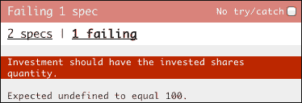
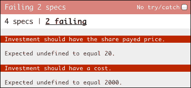

# 第二章：你的第一个规范

本章介绍了基础知识，我们将指导您如何编写您的第一个规范，以测试优先的术语进行开发，并向您展示所有可用的全局 Jasmine 函数。在本章结束时，您应该知道 Jasmine 的工作原理，并准备好自己进行第一次测试。

# 投资跟踪应用程序

为了让您开始，我们需要一个示例场景：考虑您正在开发一个用于跟踪股票市场投资的应用程序。

以下的表单截图说明了用户可能如何在这个应用程序上创建一个新的投资：


这是一个添加投资的表单

这个表单将允许输入定义投资的三个值：

+   首先，我们将输入**符号**，表示用户正在投资的公司（股票）

+   然后，我们将输入用户购买（或投资）了多少**股票**

+   最后，我们将输入用户为每股支付的金额（**股价**）

如果您不熟悉股票市场的运作方式，请想象您在购物杂货。要购买商品，您必须指定您要购买什么，您要购买多少件商品，以及您将支付多少。这些概念可以转化为投资：

+   股票由符号定义，例如`PETO`，可以理解为一种杂货类型

+   股票数量是您购买的商品数量

+   股价是每件商品的单价

一旦用户添加了一项投资，它必须与他们的其他投资一起列出，如下面的截图所示：


这是一个表单和投资列表

这个想法是展示他们的投资进展如何。由于股票价格随时间波动，用户支付的价格与当前价格之间的差异表明这是一个好（盈利）还是一个坏（亏损）的投资。

在前面的截图中，我们可以看到用户有两项投资：

+   其中一项是`AOUE`股票，获利`101.80%`

+   另一项是`PETO`股票，亏损`-42.34%`

这是一个非常简单的应用程序，随着我们对其开发的进行，我们将更深入地了解其功能。

# Jasmine 基础知识和 BDD 思维

根据之前介绍的应用程序，我们可以开始编写定义投资的验收标准：

+   给定一个投资，它应该是一种股票

+   给定一个投资，它应该有投资的股票数量

+   给定一个投资，它应该有支付的股价

+   给定一个投资，它应该有成本

使用上一章下载的独立分发版，我们需要做的第一件事是创建一个新的规范文件。这个文件可以在任何地方创建，但遵循一个约定是个好主意，而 Jasmine 已经有一个很好的约定：规范应该在`/spec`文件夹中。创建一个`InvestmentSpec.js`文件，并添加以下行：

```js
describe("Investment", function() {

});
```

`describe`函数是一个全局的 Jasmine 函数，用于定义测试上下文。当作为规范中的第一个调用时，它会创建一个新的测试套件（一组测试用例）。它接受两个参数，如下所示：

+   测试套件的名称——在本例中为“投资”

+   一个包含所有规范的`function`

然后，要将第一个验收标准（给定一个投资，它应该是一种股票）翻译成 Jasmine 规范（或测试用例），我们将使用另一个全局的 Jasmine 函数，称为`it`：

```js
describe("Investment", function() {
  **it("should be of a stock", function() {**

  **});**
});
```

它还接受两个参数，如下所示：

+   规范的标题——在本例中为`应该是股票`

+   一个包含规范代码的`function`

要运行此规范，请将其添加到运行器中，如下所示：

```js
<!-- include spec files here... -->
**<script type="text/javascript" src="spec/InvestmentSpec.js"></script>**

```

通过在浏览器上打开运行器来执行规范。可以看到以下输出：


这是浏览器上第一个规范的通过结果

一个空的规范通过可能听起来很奇怪，但在 Jasmine 中，与其他测试框架一样，需要失败的断言才能使规范失败。

**断言**（或期望）是两个值之间的比较，必须产生布尔值。只有在比较的结果为真时，断言才被认为是成功的。

在 Jasmine 中，使用全局 Jasmine 函数`expect`编写断言，以及指示要对值进行何种比较的**匹配器**。

关于当前的规范（预期投资是股票），在 Jasmine 中，这对应以下代码：

```js
describe("Investment", function() {
  it("should be of a stock", function() {
    **expect(investment.stock).toBe(stock);**
  });
});
```

将前面高亮的代码添加到`InvestmentSpec.js`文件中。`expect`函数只接受一个参数，它定义了**实际值**，或者换句话说，要进行测试的内容——`investment.stock`，并期望链接调用匹配器函数，这种情况下是`toBe`。这定义了**期望值**，`stock`，以及要执行的比较方法（要相同）。

在幕后，Jasmine 进行比较，检查实际值（`investment.stock`）和期望值（`stock`）是否相同，如果它们不同，测试就会失败。

有了写好的断言，先前通过的规范现在已经失败，如下截图所示：


这显示了第一个规范的失败结果

这个规范失败了，因为错误消息表明`investment 未定义`。

这里的想法是只做错误提示我们要做的事情，所以尽管您可能会有写其他内容的冲动，但现在让我们在`InvestmentSpec.js`文件中创建一个`investment`变量，并使用`Investment`实例，如下所示：

```js
describe("Investment", function() {
  it("should be of a stock", function() {
    **var investment = new Investment();**
    expect(investment.stock).toBe(stock);
  });
});
```

不要担心`Investment()`函数尚不存在；规范即将在下一次运行时要求它，如下所示：


这里的规范要求一个 Investment 类

您可以看到错误已经改为`Investment 未定义`。现在要求`Investment`函数。因此，在`src`文件夹中创建一个新的`Investment.js`文件，并将其添加到 runner 中，如下所示：

```js
<!-- include source files here... -->
<script type="text/javascript" src="src/Investment.js"></script>
```

要定义`Investment`，请在`src`文件夹中的`Investment.js`文件中编写以下构造函数：

```js
function Investment () {};
```

这会改变错误。现在它抱怨缺少`stock`变量，如下截图所示：


这显示了一个缺少 stock 的错误

再一次，我们将代码输入到`InvestmentSpec.js`文件中，如下所示：

```js
describe("Investment", function() {
  it("should be of a stock", function() {
    **var stock = new Stock();**
    var investment = new Investment();
    expect(investment.stock).toBe(stock);
  });
});
```

错误再次改变；这次是关于缺少`Stock`函数：


这里的规范要求一个 Stock 类

在`src`文件夹中创建一个新文件，命名为`Stock.js`，并将其添加到 runner 中。由于`Stock`函数将成为`Investment`的依赖项，所以我们应该在`Investment.js`之前添加它：

```js
<!-- include source files here... -->
**<script type="text/javascript" src="src/Stock.js"></script>**
<script type="text/javascript" src="src/Investment.js"></script>
```

将`Stock`构造函数写入`Stock.js`文件：

```js
function Stock () {};
```

最后，错误是关于期望值，如下截图所示：


期望是未定义的 Stock

要修复这个问题并完成这个练习，打开`src`文件夹中的`Investment.js`文件，并添加对`stock`参数的引用：

```js
function Investment (stock) {
  **this.stock = stock;**
};
```

在规范文件中，将`stock`作为参数传递给`Investment`函数：

```js
describe("Investment", function() {
  it("should be of a stock", function() {
    var stock = new Stock();
    var investment = new Investment(**stock**);
    expect(investment.stock).toBe(stock);
  });
});
```

最后，您将有一个通过的规范：


这显示了一个通过的 Investment 规范

这个练习是精心进行的，以展示开发人员在进行测试驱动开发时如何满足规范的要求。

### 提示

编写代码的动力必须来自一个失败的规范。除非其目的是修复失败的规范，否则不得编写代码。

# 设置和拆卸

还有三个要实现的验收标准。列表中的下一个是：

“给定一个投资，它应该有投资的股份数量。”

写它应该和之前的规范一样简单。在`spec`文件夹内的`InvestmentSpec.js`文件中，您可以将这个新标准翻译成一个名为`should have the invested shares' quantity`的新规范，如下所示：

```js
describe("Investment", function() {
  it("should be of a stock", function() {
    var stock = new Stock();
    var investment = new Investment(**{**
      **stock: stock,**
      **shares: 100**
    **}**);
    expect(investment.stock).toBe(stock);
  });

  **it("should have the invested shares' quantity", function() {**
 **var stock = new Stock();**
 **var investment = new Investment({**
 **stock: stock,**
 **shares: 100**
 **});**
 **expect(investment.shares).toEqual(100);**
 **});**
});
```

您可以看到，除了编写了新的规范之外，我们还改变了对`Investment`构造函数的调用，以支持新的`shares`参数。

为此，我们在构造函数中使用了一个对象作为单个参数，以模拟命名参数，这是 JavaScript 本身没有的功能。

在`Investment`函数中实现这一点非常简单 - 在函数声明中不再有多个参数，而只有一个参数，预期是一个对象。然后，函数从这个对象中探测每个预期的参数，进行适当的赋值，如下所示：

```js
function Investment (**params**) {
  **this.stock = params.stock;**
};
```

现在代码已经重构。我们可以运行测试来看只有新的规范失败，如下所示：



这显示了股份规范的失败

为了解决这个问题，将`Investment`构造函数更改为对`shares`属性进行赋值，如下所示：

```js
function Investment (params) {
  this.stock = params.stock;
  **this.shares = params.shares;**
};
```

最后，您屏幕上的一切都是绿色的：


这显示了通过的股份规范

但是，正如您所看到的，实例化`Stock`和`Investment`的以下代码在两个规范中都是重复的：

```js
var stock = new Stock();
var investment = new Investment({
  stock: stock,
  shares: 100
});
```

为了消除这种重复，Jasmine 提供了另一个全局函数叫做`beforeEach`，顾名思义，它在每个规范之前执行一次。因此，对于这两个规范，它将运行两次 - 每个规范之前运行一次。

通过使用`beforeEach`函数提取设置代码来重构先前的规范：

```js
describe("Investment", function() {
  **var stock, investment;**

  **beforeEach(function() {**
    **stock = new Stock();**
    **investment = new Investment({**
      **stock: stock,**
      **shares: 100**
    **});**
  **});**

  it("should be of a stock", function() {
    expect(investment.stock).toBe(stock);
  });

  it("should have the invested shares quantity", function() {
    expect(investment.shares).toEqual(100);
  });
});
```

这看起来干净多了；我们不仅消除了代码重复，还简化了规范。它们变得更容易阅读和维护，因为它们现在的唯一责任是满足期望。

还有一个**拆卸**函数（`afterEach`），它在每个规范之后设置要执行的代码。在每个规范之后需要清理时，它非常有用。我们将在第六章中看到其应用的示例，*光速单元测试*。

要完成`Investment`的规范，将剩下的两个规范添加到`spec`文件夹中的`InvestmentSpec.js`文件中：

```js
describe("Investment", function() {
  var stock;
  var investment;

  beforeEach(function() {
    stock = new Stock();
    investment = new Investment({
      stock: stock,
      shares: 100,
      **sharePrice: 20**
    });
  });

  //... other specs

  **it("should have the share paid price", function() {**
    **expect(investment.sharePrice).toEqual(20);**
  **});**

  **it("should have a cost", function() {**
    **expect(investment.cost).toEqual(2000);**
  **});**
});
```

运行规范，看它们失败，如下截图所示：



这显示了成本和价格规范的失败

将以下代码添加到`src`文件夹中的`Investment.js`文件中以修复它们：

```js
function Investment (params) {
  this.stock = params.stock;
  this.shares = params.shares;
  **this.sharePrice = params.sharePrice;**
  **this.cost = this.shares * this.sharePrice;**
};
```

最后一次运行规范，看它们通过：


这显示了所有四个投资规范都通过了

### 提示

在编写代码来修复之前，始终要看到规范失败；否则，您怎么知道您真的需要修复它呢？把这看作是测试测试的一种方式。

# 嵌套描述

**嵌套描述**在您想要描述规范之间相似行为时非常有用。假设我们想要以下两个新的验收标准：

+   给定一个投资，当其股票股价升值时，它应该有一个正的**投资回报率**（**ROI**）

+   给定一个投资，当其股票股价升值时，它应该是一个好的投资

当投资的股票股价升值时，这两个标准都具有相同的行为。

要将其翻译成 Jasmine，您可以在`InvestmentSpec.js`文件中现有的`describe`函数内嵌套一个调用（我为演示目的删除了其余代码；它仍然存在）：

```js
describe("Investment", function()
  **describe("when its stock share price valorizes", function() {**

  **});**
});
```

它应该像外部规范一样工作，因此您可以添加规范（`it`）并使用设置和拆卸函数（`beforeEach`，`afterEach`）。

## 设置和拆卸

在使用设置和拆卸函数时，Jasmine 也会尊重外部设置和拆卸函数，以便按预期运行。对于每个规范（`it`），执行以下操作：

+   Jasmine 按照从外到内的顺序运行所有设置函数（`beforeEach`）

+   Jasmine 运行规范代码（`it`）

+   Jasmine 按照从内到外的顺序运行所有拆卸函数（`afterEach`）

因此，我们可以向这个新的`describe`函数添加一个设置函数，以更改股票的股价，使其大于投资的股价：

```js
describe("Investment", function() {
  var stock;
  var investment;

  beforeEach(function() {
    stock = new Stock();
    investment = new Investment({
      stock: stock,
      shares: 100,
      sharePrice: 20
    });
  });

  describe("when its stock share price valorizes", function() {
    **beforeEach(function() {**
      **stock.sharePrice = 40;**
    **});**
  });
});
```

## 使用共享行为编写规范

现在我们已经实现了共享的行为，我们可以开始编写之前描述的验收标准。每个都是，就像以前一样，调用全局 Jasmine 函数`it`：

```js
describe("Investment", function() {
  describe("when its stock share price valorizes", function() {
    beforeEach(function() {
      stock.sharePrice = 40;
    });

    **it("should have a positive return of investment", function() {**
      **expect(investment.roi()).toEqual(1);**
    **});**

    **it("should be a good investment", function() {**
      **expect(investment.isGood()).toEqual(true);**
    **});**
  });
});
```

在`Investment.js`文件中添加缺失的函数之后：

```js
Investment.prototype.**roi** = function() {
  return (this.stock.sharePrice - this.sharePrice) / this.sharePrice;
};

Investment.prototype.**isGood** = function() {
  return this.roi() > 0;
};
```

您可以运行规范并查看它们是否通过：


这显示了嵌套的描述规范通过

## 理解匹配器

到目前为止，您已经看到了匹配器的许多用法示例，可能已经感受到它们的工作原理。

您已经看到了如何使用`toBe`和`toEqual`匹配器。这是 Jasmine 中提供的两个基本内置匹配器，但我们可以编写自己的匹配器来扩展 Jasmine。

因此，要真正理解 Jasmine 匹配器的工作原理，我们需要自己创建一个。

### 自定义匹配器

考虑一下前一节中的期望：

```js
expect(investment.isGood()).toEqual(true);
```

虽然它能够工作，但表达力不是很强。想象一下，如果我们可以改写成：

```js
expect(investment).toBeAGoodInvestment();
```

这与验收标准之间建立了更好的关系。

因此，在这里，“should be a good investment”变成了“expect investment to be a good investment”。

实现它非常简单。您可以通过调用`jasmine.addMatchers`函数来实现这一点，最好是在设置步骤（`beforeEach`）中。

尽管您可以将这个新的匹配器定义放在`InvestmentSpec.js`文件中，但 Jasmine 已经有一个默认的位置来添加自定义匹配器，即`SpecHelper.js`文件，位于`spec`文件夹内。如果您使用独立发行版，它已经带有一个示例自定义匹配器；删除它，让我们从头开始。

`addMatchers`函数接受一个参数，即一个对象，其中每个属性对应一个新的匹配器。因此，要添加以下新的匹配器，请更改`SpecHelper.js`文件的内容如下：

```js
beforeEach(function() {
  jasmine.addMatchers({
    **toBeAGoodInvestment: function() {}**
  });
});
```

在这里定义的函数不是匹配器本身，而是一个工厂函数，用于构建匹配器。它的目的是一旦调用就返回一个包含比较函数的对象，如下所示：

```js
jasmine.addMatchers({
  toBeAGoodInvestment: function () {
    **return** **{**
 **compare: function (actual, expected) {**
 **// matcher definition**
 **}**
    };
  }
});
```

`compare`函数将包含实际的匹配器实现，并且可以通过其签名观察到，它接收要比较的两个值（`actual`和`expected`值）。

对于给定的示例，`investment`对象将在`actual`参数中可用。

然后，Jasmine 期望`compare`函数的结果是一个带有`pass`属性的对象，该属性具有布尔值`true`，以指示期望通过，如果期望失败则为`false`。

让我们来看看`toBeAGoodInvestment`匹配器的以下有效实现：

```js
toBeAGoodInvestment: function () {
  return {
    compare: function (actual, expected) {
      **var result = {};**
 **result.pass = actual.isGood();**
 **return result;**
    }
  };
}
```

到目前为止，这个匹配器已经准备好被规范使用：

```js
it("should be a good investment", function() {
  **expect(investment).toBeAGoodInvestment();**
});
```

更改后，规范仍应通过。但是如果规范失败会发生什么？Jasmine 报告的错误消息是什么？

我们可以通过故意破坏`Investment.js`文件中`src`文件夹中的`investment.isGood`实现，使其始终返回`false`来看到它：

```js
Investment.prototype.isGood = function() {
  **return false;**
};
```

再次运行规范时，Jasmine 会生成一个错误消息，指出`Expected { stock: { sharePrice: 40 }, shares: 100, sharePrice: 20, cost: 2000 } to be a good investment`，如下面的截图所示：


这是自定义匹配器的消息

Jasmine 在生成此错误消息方面做得很好，但它也允许通过匹配器结果对象的`result.message`属性进行自定义。Jasmine 期望此属性是一个带有以下错误消息的字符串：

```js
toBeAGoodInvestment: function () {
  return {
    compare: function (actual, expected) {
      var result = {};
      result.pass = actual.isGood();
      **result.message = 'Expected investment to be a good investment';**
      return result;
    }
  };
}
```

再次运行规范，错误消息应该改变：


这是自定义匹配器的自定义消息

现在，让我们考虑另一个验收标准：

“给定一个投资，当它的股票价格贬值时，它应该是一个坏的投资。”

虽然可以创建一个新的自定义匹配器（`toBeABadInvestment`），Jasmine 允许在调用匹配器之前通过在匹配器调用之前链接`not`来否定任何匹配器。因此，我们可以说“一个坏的投资”是“不是一个好的投资”。

```js
expect(investment).**not**.toBeAGoodInvestment();
```

在`InvestmentSpec.js`文件的`spec`文件夹中添加新的和嵌套的`describe`和`spec`，以实现这个新的验收标准：

```js
describe("when its stock share price devalorizes", function() {
  beforeEach(function() {
    stock.sharePrice = 0;
  });

  it("should have a negative return of investment", function() {
    expect(investment.roi()).toEqual(-1);
  });

  it("should be a bad investment", function() {
    expect(investment).not.toBeAGoodInvestment();
  });
});
```

但是有一个问题！让我们来破解`Investment.js`文件中的`investment`实现，使其始终是一个好的投资，如下所示：

```js
Investment.prototype.isGood = function() {
  **return true;**
};
```

再次运行规范，您会发现这个新规范失败了，但错误消息`Expected investment to be a good investment`是错误的，如下面的截图所示：


这是自定义匹配器的错误的自定义否定消息

这是硬编码在匹配器内部的消息。要修复这个问题，您需要使消息动态化。

Jasmine 只在匹配器失败时显示消息，因此使此消息动态化的正确方法是考虑在给定比较无效时应该显示什么消息：

```js
compare: function (actual, expected) {
  var result = {};
  result.pass = actual.isGood();

 **if (actual.isGood()) {**
 **result.message = 'Expected investment to be a bad investment';**
 **} else {**
 **result.message = 'Expected investment to be a good investment';**
 **}**

  return result;
}
```

这修复了消息，如下面的截图所示：


这显示了自定义匹配器的自定义动态消息

现在这个匹配器可以在任何地方使用。

在继续本章之前，将`isGood`方法再次更改为正确的实现：

```js
Investment.prototype.isGood = function() {
  return this.roi() > 0;
};
```

这个例子缺少的是展示如何将预期值传递给这样的匹配器的方法：

```js
expect(investment.cost).toBe(2000)
```

事实证明，匹配器可以接收任意数量的预期值作为参数。因此，例如，前面的匹配器可以在`SpecHelper.js`文件中的`spec`文件夹中实现如下：

```js
beforeEach(function() {
  jasmine.addMatchers({
    toBe: function () {
      return {
        compare: function (actual, **expected**) {
          return actual === **expected**;
        }
      };
    }
  });
});
```

通过实现任何匹配器，首先检查是否已经有一个可用的匹配器可以实现你想要的功能。

有关更多信息，请查看 Jasmine 网站上的官方文档[`jasmine.github.io/2.1/custom_matcher.html`](http://jasmine.github.io/2.1/custom_matcher.html)。

### 内置匹配器

Jasmine 带有一堆默认匹配器，涵盖了 JavaScript 语言中值检查的基础知识。了解它们的工作原理以及在何处正确使用它们是了解 JavaScript 处理类型的过程。

#### toEqual 内置匹配器

`toEqual`匹配器可能是最常用的匹配器，每当您想要检查两个值之间的相等性时，都应该使用它。

它适用于所有原始值（数字、字符串和布尔值）以及任何对象（包括数组），如下面的代码所示：

```js
describe("toEqual", function() {
  it("should pass equal numbers", function() {
    expect(1).toEqual(1);
  });

  it("should pass equal strings", function() {
    expect("testing").toEqual("testing");
  });

  it("should pass equal booleans", function() {
    expect(true).toEqual(true);
  });

  it("should pass equal objects", function() {
    expect({a: "testing"}).toEqual({a: "testing"});
  });

  it("should pass equal arrays", function() {
    expect([1, 2, 3]).toEqual([1, 2, 3]);
  });
});
```

#### toBe 内置匹配器

`toBe`匹配器的行为与`toEqual`匹配器非常相似；实际上，在比较原始值时，它给出相同的结果，但相似之处止步于此。

虽然`toEqual`匹配器有一个复杂的实现（您应该查看 Jasmine 源代码），它检查对象的所有属性和数组的所有元素是否相同，但在这里它只是简单使用了**严格相等运算符**（`===`）。

如果您不熟悉严格相等运算符，它与**equals 运算符**（`==`）的主要区别在于，如果比较的值不是相同类型，后者会执行类型强制转换。

### 提示

严格相等运算符始终将不同类型的值之间的比较视为 false。

以下是此匹配器（以及严格相等运算符）的工作示例：

```js
describe("toBe", function() {
  it("should pass equal numbers", function() {
    expect(1).toBe(1);
  });

  it("should pass equal strings", function() {
    expect("testing").toBe("testing");
  });

  it("should pass equal booleans", function() {
    expect(true).toBe(true);
  });

  it("should pass same objects", function() {
    var object = {a: "testing"};
    expect(object).toBe(object);
  });

  it("should pass same arrays", function() {
    var array = [1, 2, 3];
    expect(array).toBe(array);
  });

  it("should not pass equal objects", function() {
    expect({a: "testing"}).not.toBe({a: "testing"});
  });

  it("should not pass equal arrays", function() {
    expect([1, 2, 3]).not.toBe([1, 2, 3]);
  });
});
```

建议在大多数情况下使用`toEqual`运算符，并且只有在要检查两个变量是否引用相同对象时才使用`toBe`匹配器。

#### toBeTruthy 和 toBeFalsy 匹配器

除了其原始布尔类型之外，JavaScript 语言中的所有其他内容也都具有固有的布尔值，通常被称为“truthy”或“falsy”。

幸运的是，在 JavaScript 中，只有少数值被识别为 falsy，如`toBeFalsy`匹配器的以下示例所示：

```js
describe("toBeFalsy", function () {
  it("should pass undefined", function() {
    expect(undefined).toBeFalsy();
  });

  it("should pass null", function() {
    expect(null).toBeFalsy();
  });

  it("should pass NaN", function() {
    expect(NaN).toBeFalsy();
  });

  it("should pass the false boolean value", function() {
    expect(false).toBeFalsy();
  });

  it("should pass the number 0", function() {
    expect(0).toBeFalsy();
  });

  it("should pass an empty string", function() {
    expect("").toBeFalsy();
  });
});
```

其他所有内容都被视为 truthy，如`toBeTruthy`匹配器的以下示例所示：

```js
describe("toBeTruthy", function() {
  it("should pass the true boolean value", function() {
    expect(true).toBeTruthy();
  });

  it("should pass any number different than 0", function() {
    expect(1).toBeTruthy();
  });
  it("should pass any non empty string", function() {
    expect("a").toBeTruthy();
  });

  it("should pass any object (including an array)", function() {
    expect([]).toBeTruthy();
    expect({}).toBeTruthy();
  });
});
```

但是，如果要检查某个东西是否等于实际的布尔值，可能更好的主意是使用`toEqual`匹配器。

#### toBeUndefined、toBeNull 和 toBeNaN 内置匹配器

这些匹配器非常直观，应该用于检查`undefined`、`null`和`NaN`的值：

```js
describe("toBeNull", function() {
  it("should pass null", function() {
    expect(null).toBeNull();
  });
});

describe("toBeUndefined", function() {
  it("should pass undefined", function() {
    expect(undefined).toBeUndefined();
  });
});

describe("toBeNaN", function() {
  it("should pass NaN", function() {
    expect(NaN).toBeNaN();
  });
});
```

`toBeNull`和`toBeUndefined`都可以分别写为`toBe(null)`和`toBe(undefined)`，但`toBeNaN`不是这种情况。

在 JavaScript 中，`NaN`值不等于任何值，甚至不等于`NaN`。因此，尝试将其与自身进行比较总是`false`，如下面的代码所示：

```js
NaN === NaN // false
```

作为良好的实践，尽量在可能的情况下使用这些匹配器，而不是它们的`toBe`对应物。

#### toBeDefined 内置匹配器

如果要检查变量是否已定义，而不关心其值，可以使用这个匹配器。

```js
describe("toBeDefined", function() {
  it("should pass any value other than undefined", function() {
    expect(null).toBeDefined();
  });
});
```

除了`undefined`之外的任何内容都会通过这个匹配器，甚至是`null`。

#### toContain 内置匹配器

有时，希望检查数组是否包含元素，或者一个字符串是否可以在另一个字符串中找到。对于这些用例，可以使用`toContain`匹配器，如下所示：

```js
describe("toContain", function() {
  it("should pass if a string contains another string", function()  {
    expect("My big string").toContain("big");
  });

  it("should pass if an array contains an element", function() {
    expect([1, 2, 3]).toContain(2);
  });
});
```

#### toMatch 内置匹配器

尽管`toContain`和`toEqual`匹配器可以在大多数字符串比较中使用，但有时唯一的断言字符串值是否正确的方法是通过正则表达式。对于这些情况，可以使用`toMatch`匹配器以及正则表达式，如下所示：

```js
describe("toMatch", function() {
  it("should pass a matching string", function() {
    expect("My big matched string").toMatch(/My(.+)string/);
  });
});
```

匹配器通过测试实际值（`"My big matched string"`）与预期正则表达式（`/My(.+)string/`）进行比较。

#### toBeLessThan 和 toBeGreaterThan 内置匹配器

`toBeLessThan`和`toBeGreaterThan`匹配器很简单，用于执行数字比较，最好通过以下示例进行描述：

```js
  describe("toBeLessThan", function() {
    it("should pass when the actual is less than expected", function() {
      expect(1).toBeLessThan(2);
    });
  });

  describe("toBeGreaterThan", function() {
    it("should pass when the actual is greater than expected", function() {
      expect(2).toBeGreaterThan(1);
    });
  });
```

#### toBeCloseTo 内置匹配器

这是一个特殊的匹配器，用于比较具有一组定义精度的浮点数，最好通过以下示例进行解释：

```js
describe("toBeCloseTo", function() {
    it("should pass when the actual is closer with a given precision", function() {
      expect(3.1415).toBeCloseTo(2.8, 0);
      expect(3.1415).not.toBeCloseTo(2.8, 1);
    });
  });
```

第一个参数是要比较的数字，第二个是小数位数的精度。

#### toThrow 内置匹配器

异常是语言在出现问题时展示的方式。

因此，例如，在编写 API 时，您可能决定在参数传递不正确时抛出异常。那么，如何测试这段代码呢？

Jasmine 有内置的`toThrow`匹配器，可用于验证是否抛出了异常。

它的工作方式与其他匹配器有些不同。由于匹配器必须运行一段代码并检查是否抛出异常，因此匹配器的**actual**值必须是一个函数。

以下是它的工作示例：

```js
describe("toThrow", function() {
  it("should pass when the exception is thrown", function() {
    expect(function () {
      throw "Some exception";
    }).toThrow("Some exception");
  });
});
```

当运行测试时，将执行匿名函数，如果抛出`Some exception`异常，则测试通过。

# 总结

在本章中，您学会了如何以 BDD 方式思考并从规范中驱动代码。您还熟悉了基本的 Jasmine 全局函数（`describe`、`it`、`beforeEach`和`afterEach`），并且对在 Jasmine 中创建规范有了很好的理解。

您已经熟悉了 Jasmine 匹配器，并知道它们在描述规范意图方面有多么强大。您甚至学会了创建自己的匹配器。

到目前为止，您应该已经熟悉了创建新规范并推动新应用程序的开发。

在下一章中，我们将看看如何利用本章学到的概念来开始测试 Web 应用程序，这些应用程序最常见的是 jQuery 和 HTML 表单。
