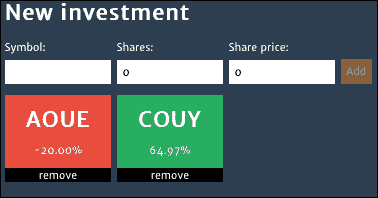
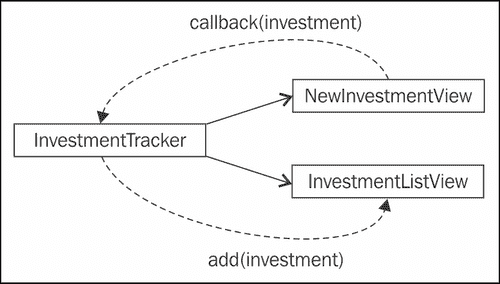

# 第三章。测试前端代码

测试 JavaScript 浏览器代码一直被认为是困难的，尽管在处理跨浏览器测试时会遇到许多复杂问题，但最常见的问题不在于测试过程，而是应用程序代码本身不可测试。

由于浏览器文档中的每个元素都可以全局访问，因此很容易编写一个整体的 JavaScript 代码块，它处理整个页面。这会导致一些问题，其中最大的问题是很难进行测试。

在本章中，我们将学习如何编写可维护和可测试的浏览器代码的最佳实践。

为了实现用户界面，我们将使用 jQuery，这是一个众所周知的 JavaScript 库，它通过一个干净简单的 API 抽象了浏览器的 DOM，可以在不同的浏览器上运行。

为了使规范的编写更容易，我们将使用 Jasmine jQuery，这是一个 Jasmine 扩展，它添加了新的匹配器来对 jQuery 对象执行断言。要安装它及其 jQuery 依赖项，请下载以下文件：

+   [`raw.githubusercontent.com/velesin/jasmine-jquery/2.1.0/lib/jasmine-jquery.js`](https://raw.githubusercontent.com/velesin/jasmine-jquery/2.1.0/lib/jasmine-jquery.js)

+   [`raw.githubusercontent.com/velesin/jasmine-jquery/2.1.0/vendor/jquery/jquery.js`](https://raw.githubusercontent.com/velesin/jasmine-jquery/2.1.0/vendor/jquery/jquery.js)

将这些文件保存为`jasmine-jquery.js`和`jquery.js`，分别放在`lib`文件夹中，并将它们添加到`SpecRunner.html`中，如下所示：

```js
<script src="lib/jquery.js"></script>
<script src="lib/jasmine-jquery.js"></script>
```

到目前为止，我们已经创建了单独的抽象来处理投资及其相关的股票。现在，是时候开发这个应用程序的用户界面并取得良好的结果了，这完全取决于组织和良好的实践。

我们在服务器端代码上应用的软件工程原则在编写前端 JavaScript 代码时也不容忽视。考虑组件和关注点的适当分离仍然很重要。

# 以组件（视图）的方式思考

我们已经讨论了困扰大部分网络的单片 JavaScript 代码库，这些代码库是不可能进行测试的。不陷入这个陷阱的最好方法是通过编写应用程序驱动的测试。

考虑一下我们的投资跟踪应用程序的模拟界面：



这显示了投资跟踪应用程序的模拟界面

我们将如何实施它？很容易看出，这个应用程序有两个不同的责任：

+   一个责任是添加一个投资

+   另一个责任是列出添加的投资

因此，我们可以开始将此界面分解为两个不同的组件。为了更好地描述它们，我们将借鉴**MVC 框架**（如`Backbone.js`）的概念，并称它们为**视图**。

因此，在界面的顶层，有两个基本组件：

+   `NewInvestmentView`：这将负责创建新的投资

+   `InvestmentListView`：这将是所有添加的投资的列表

# 模块模式

因此，我们了解了如何分解代码，但是如何组织它呢？到目前为止，我们为每个新功能创建了一个文件。这是一个很好的做法，我们将看到如何改进它。

让我们从思考我们的`NewInvestmentView`组件开始。我们可以按照我们到目前为止使用的模式创建一个新文件`NewInvestmentView.js`，并将其放在`src`文件夹中，如下所示：

```js
(function ($, Investment, Stock) {
  function NewInvestmentView (params) {

  }

  this.NewInvestmentView = NewInvestmentView;
})(jQuery, Investment, Stock);
```

您可以看到，这个 JavaScript 文件比到目前为止显示的示例更健壮。我们已经将所有的`NewInvestmentView`代码包装在一个**立即调用的函数表达式**（**IIFE**）中。

它被称为 IIFE，因为它声明一个函数并立即调用它，有效地创建了新的作用域来声明局部变量。

一个好的做法是在 IIFE 中只使用局部变量。如果需要使用全局依赖项，将其作为参数传递。在这个例子中，它已经将三个依赖项传递给`NewInvestmentView`代码：`jQuery`，`Investment`和`Stock`。

您可以在函数声明中看到这一点：

```js
function (**$, Investment, Stock**)
```

并立即调用：

```js
})(**jQuery, Investment, Stock**);
```

这种做法的最大优点是，我们不再需要担心污染全局命名空间，因为我们在 IIFE 中声明的一切都将是局部的。这使得很难干扰全局范围。

如果我们需要使任何东西全局化，我们通过将其附加到全局对象来明确地执行，如下所示：

```js
**this**.NewInvestmentView = NewInvestmentView;
```

另一个优点是明确的依赖声明。通过查看文件的第一行，我们就知道了文件的外部依赖。

尽管这种做法现在并没有太大的优势（因为所有的组件都是全局暴露的），但我们将看到如何从中受益在第八章，*构建自动化*。

这种模式也被称为**模块模式**，我们将在本书的其余部分中使用它（即使有时为了简化目的而省略）。

# 使用 HTML fixtures

继续开发`NewInvestmentView`组件，我们可以编写一些基本的验收标准，如下所示：

+   `NewInvestmentView`应该允许输入股票符号

+   `NewInvestmentView`应该允许输入股票

+   `NewInvestmentView`应该允许输入股价

还有很多，但这是一个很好的开始。

在`spec`文件夹中创建一个名为`NewInvestmentViewSpec.js`的新组件的新规范文件，我们可以开始翻译这些规范，如下所示：

```js
describe("NewInvestmentView", function() {
  it("should allow the input of the stock symbol", function() {
  });

  it("should allow the input of shares", function() {
  });

  it("should allow the input of the share price", function() {
  });
});
```

然而，在我们开始实现这些之前，我们必须首先了解**HTML fixtures**的概念。

测试 fixtures 提供了测试运行的基本状态。它可以是类的实例化，对象的定义，或者一段 HTML。换句话说，为了测试处理表单提交的 JavaScript 代码，我们需要在运行测试时有表单可用。包含表单的 HTML 代码就是 HTML fixture。

处理这个要求的一种方法是在设置函数中手动附加所需的 DOM 元素，如下所示：

```js
beforeEach(function() {
  $('body').append('<form id="my-form"></form>');
});
```

然后，在拆卸期间将其删除，如下所示：

```js
afterEach(function() {
  $('#my-form').remove();
});
```

否则，规范将在文档中附加大量垃圾，并且可能会干扰其他规范的结果。

### 提示

重要的是要知道规范应该是独立的，并且可以以任何特定顺序运行。因此，作为一个规则，完全独立地处理规范。

更好的方法是在文档中有一个容器，我们总是把 HTML fixtures 放在那里，如下所示：

```js
<div id="html-fixtures">
</div>
```

将代码更改为以下内容：

```js
beforeEach(function() {
  **$('#html-fixtures').html('<form id="my-form"></form>');**
});
```

这样，下次规范运行时，它会自动用自己的 fixture 覆盖上一个 fixture。

但是，随着 fixtures 变得更加复杂，这很快就会升级为一个难以理解的混乱：

```js
beforeEach(function() {
  $('#html-fixtures').html('<form id="new-investment"><h1>New  investment</h1><label>Symbol:<input type="text" class="new-investment-stock-symbol" name="stockSymbol"  value=""></label><input type="submit" name="add"  value="Add"></form>');
});
```

如果这个装置可以从外部文件加载，那不是很好吗？这正是 Jasmine jQuery 扩展的**HTML fixture**模块所做的。

我们可以将 HTML 代码放在外部文件中，并通过简单调用`loadFixtures`来加载它到文档中，传递 fixture 文件路径，如下所示：

```js
beforeEach(function() {
  **loadFixtures('MyFixture.html');**
});
```

默认情况下，扩展程序会在`spec/javascripts/fixtures`文件夹中查找文件（对于上一个示例，它将是`spec/javascripts/fixtures/MyFixture.html`），并将其内容加载到容器中，如下所示：

```js
<div id="jasmine-fixtures">
  <form id="new-investment">
    <h1>New investment</h1>
    <label>
      Symbol:
      <input type="text" class="new-investment-stock-symbol" name="stockSymbol" value="">
    </label>
    <input type="submit" name="add" value="Add">
  </form>
</div>
```

我们还可以使用扩展的另一个全局函数来重新创建第一个示例。`setFixtures(html)`函数接受一个参数，其中包含要放置在容器中的内容：

```js
beforeEach(function() {
  **setFixtures('<form id="my-form"></form>');**
});
```

其他可用的函数如下：

+   `appendLoadFixtures(fixtureUrl[, fixtureUrl, …])`：而不是覆盖 fixture 容器的内容，这会将其附加上

+   `readFixtures(fixtureUrl[, fixtureUrl, …])`：这读取一个 fixture 容器的内容，但不是将其附加到文档中，而是返回一个包含其内容的字符串

+   `appendSetFixtures(html)`: 这与`appendLoadFixtures`相同，但使用 HTML 字符串而不是文件

Jasmine jQuery fixture 模块缓存每个文件，因此我们可以多次加载相同的 fixture 而不会对测试套件的速度造成任何惩罚。

它使用 AJAX 加载 fixtures，有时，测试可能希望修改 JavaScript 或 jQuery AJAX 的内部工作方式，就像我们将在第六章中看到的那样，*轻速单元测试*，这可能会破坏 fixture 的加载。解决这个问题的方法是使用`preloadFixtures()`函数将所需的 fixtures 预加载到缓存中。

`preloadFixtures(fixtureUrl[, fixtureUrl, …])`函数在不将其附加到文档中的情况下加载一个或多个文件到缓存中。

然而，使用 HTML 时存在一个问题。Jasmine jQuery 使用 AJAX 加载 HTML fixtures，但由于**同源策略**（**SOP**），现代浏览器在使用`file://`协议打开`SpecRunner.html`时将阻止所有 AJAX 请求。

解决这个问题的方法是通过 HTTP 服务器提供规范运行器，如第四章中所述，*异步测试 - AJAX*。

目前，在 Chrome 中有一个可用的解决方法，通过**命令行界面**（**CLI**）参数`--allow-file-access-from-files`。

例如，在 Mac OS X 中，需要在 bash 中使用以下命令以带有此标志的方式打开 Chrome：

```js
**$ open "Google Chrome.app" --args --allow-file-access-from-files**

```

有关此问题的更多细节，请参见 GitHub 票证[`github.com/velesin/jasmine-jquery/issues/4`](https://github.com/velesin/jasmine-jquery/issues/4)。

回到`NewInvestmentView`组件，我们可以借助这个 HTML fixture 插件开始编写规范的开发。

在`spec`文件夹内创建一个名为`fixtures`的文件夹。根据模拟界面，我们可以在`fixtures`文件夹内创建一个名为`NewInvestmentView.html`的新 HTML fixture，如下所示：

```js
<form id="new-investment">
  <h1>New investment</h1>
  <label>
    Symbol:
    <input type="text" class="new-investment-stock-symbol" name="stockSymbol" value="">
  </label>
  <label>
    Shares:
    <input type="number" class="new-investment-shares" name="shares" value="0">
  </label>
  <label>
    Share price:
    <input type="number" class="new-investment-share-price" name="sharePrice" value="0">
  </label>
  <input type="submit" name="add" value="Add">
</form>
```

这是一个 HTML fixture，因为它否则将由服务器呈现，而 JavaScript 代码只是附加到它并添加行为。

因为我们没有将这个 fixture 保存在插件的默认路径下，所以我们需要在`SpecHelper.js`文件的末尾添加一个新的配置，如下所示：

```js
jasmine.getFixtures().fixturesPath = 'spec/fixtures';
```

在`NewInvestmentSpec.js`文件中，添加一个调用来加载 fixture：

```js
describe("NewInvestmentView", function() {
  **beforeEach(function() {**
    **loadFixtures('NewInvestmentView.html');**
  **});**
});
```

最后，在添加`Stock.js`和`Investment.js`文件之后，将规范和源添加到 runner 中，如下所示：

```js
<script src="src/NewInvestmentView.js"></script>
<script src="spec/NewInvestmentViewSpec.js"></script>
```

# 基本的 View 编码规则

现在，是时候开始编写第一个 View 组件了。为了帮助我们完成这个过程，我们将为 View 编码幸福制定两条基本规则：

+   视图应该封装一个 DOM 元素

+   将 View 与观察者集成

所以，让我们看看它们如何单独工作。

## 视图应该封装一个 DOM 元素

如前所述，View 是与 DOM 元素相关联的行为，因此将此元素与 View 相关联是有意义的。一个很好的模式是在 View 实例化时传递一个 CSS `selector`，指示它应该引用的元素。以下是`NewInvestmentView`组件的规范：

```js
describe("NewInvestmentView", function() {
  **var view;**
  beforeEach(function() {
    loadFixtures('NewInvestmentView.html');
    **view = new NewInvestmentView({**
      **selector: '#new-investment'**
    **});**
  });
});
```

在 NewInvestmentView.js 文件的构造函数中，它使用 jQuery 来获取此选择器的元素并将其存储在一个实例变量`$element`中（源代码），如下所示：

```js
function NewInvestmentView (params) {
  **this.$element = $(params.selector);**
}
```

为了确保这段代码有效，我们应该在`NewInvestmentViewSpec.js`文件中为其编写以下测试：

```js
it("should expose a property with its DOM element", function() {
  expect(view.$element).toExist();
});
```

`toExist`匹配器是 Jasmine jQuery 扩展提供的自定义匹配器，用于检查文档中是否存在元素。它验证 JavaScript 对象上的属性的存在以及与 DOM 元素的成功关联。

将`selector`模式传递给 View 允许它在文档上的不同元素上实例化多次。

拥有明确关联的另一个优势是知道这个视图不会改变文档中的其他任何东西，我们将在下面看到。

视图是与 DOM 元素相关联的行为，因此不应该在页面的任何地方乱动。它应该只改变或访问与其关联的元素。

为了演示这个概念，让我们实现另一个关于视图默认状态的验收标准，如下所示：

```js
it("should have an empty stock symbol", function() {
  expect(view.getSymbolInput()).toHaveValue('');
});
```

`getSymbolInput`方法的一个天真的实现可能会使用全局 jQuery 查找来查找输入并返回其值：

```js
NewInvestmentView.prototype = {
  getSymbolInput: function () {
    return **$('.new-investment-stock-symbol')**
  }
};
```

然而，这可能会导致一个问题；如果文档中的其他地方有另一个具有相同类名的输入，它可能会得到错误的结果。

更好的方法是使用视图的关联元素来执行范围查找，如下所示：

```js
NewInvestmentView.prototype = {
  getSymbolInput: function () {
    return **this.$element.find('.new-investment-stock-symbol')**
  }
};
```

`find`函数只会查找`this.$element`的子元素。就好像`this.$element`代表了整个视图的文档。

由于我们将在视图代码的各个地方使用这种模式，因此我们可以创建一个函数并使用它，如下面的代码所示：

```js
NewInvestmentView.prototype = {
  **$: function () {**
    **return this.$element.find.apply(this.$element, arguments);**
  **}**,
  getSymbolInput: function () {
    return **this.$('.new-investment-stock-symbol')**
  }
};
```

现在假设从应用程序的其他地方，我们想要更改`NewInvestmentView`表单输入的值。我们知道它的类名，所以可能就像这样简单：

```js
$('.new-investment-stock-symbol').val('from outside the view');
```

然而，这种简单性隐藏了一个严重的封装问题。这一行代码正在与`NewInvestmentView`的实现细节产生耦合。

如果另一个开发人员更改了`NewInvestmentView`，将输入类名从`.new-investment-stock-symbol`更改为`.new-investment-symbol`，那么这一行代码将会出错。

为了解决这个问题，开发人员需要查看整个代码库中对该类名的引用。

一个更安全的方法是尊重视图并使用其 API，如下面的代码所示：

```js
newInvestmentView.setSymbol('from outside the view');
```

当实施时，会看起来像下面这样：

```js
NewInvestmentView.prototype.setSymbol = function(value) {
  this.$('.new-investment-stock-symbol').val(value);
};
```

这样，当代码被重构时，只需要在`NewInvestmentView`的实现内执行一次更改。

由于浏览器的文档中没有沙箱，这意味着从 JavaScript 代码的任何地方，我们都可以在文档的任何地方进行更改，除了良好的实践外，我们无法做太多事情来防止这些错误。

## 使用观察者集成视图

随着投资跟踪应用程序的开发，我们最终需要实现投资列表。但是，您将如何集成`NewInvestmentView`和`InvestmentListView`？

您可以为`NewInvestmentView`编写一个验收标准，如下所示：

给定新的投资视图，当点击其添加按钮时，它应该将投资添加到投资列表中。

这是非常直接的思维方式，通过写作可以看出我们在两个视图之间创建了直接关系。将这个转化为规范可以澄清这种感知，如下所示：

```js
describe("NewInvestmentView", function() {
  beforeEach(function() {
    loadFixtures('NewInvestmentView.html');
    **appendLoadFixtures('InvestmentListView.html');**

    **listView = new InvestmentListView({**
      **id: 'investment-list'**
    **});**

    view = new NewInvestmentView({
      id: 'new-investment',
      **listView: listView**
    });
  });

  describe("when its add button is clicked", function() {
    beforeEach(function() {
      // fill form inputs
      // simulate the clicking of the button
    });

    it("should add the investment to the list", function() {
      expect(**listView.count()**).toEqual(1);
    });
  });
});
```

这个解决方案在两个视图之间创建了一个依赖关系。`NewInvestmentView`构造函数现在接收`InvestmentListView`的实例作为其`listView`参数。

在其实现中，`NewInvestmentView`在其表单提交时调用`listView`对象的`addInvestment`方法：

```js
function NewInvestmentView (params) {
  **this.listView = params.listView;**

  this.$element.on('submit', function () {
    **this.listView.addInvestment(/* new investment */);**
  }.bind(this));
}
```

为了更好地澄清这段代码的工作原理，这里是集成是如何完成的图表：


这显示了两个视图之间的直接关系

尽管非常简单，但这个解决方案引入了许多架构问题。首先，最明显的是`NewInvestmentView`规范的复杂性增加了。

其次，由于紧密耦合，使这些组件的演变变得更加困难。

为了更好地澄清这个问题，想象一下，将来我们也想在表格中列出投资。这将要求对`NewInvestmentView`进行更改，以支持列表和表视图，如下所示：

```js
function NewInvestmentView (params) {
  this.listView = params.listView;
  **this.tableView = params.tableView;**

  this.$element.on('submit', function () {
    this.listView.addInvestment(/* new investment */);
    **this.tableView.addInvestment(/* new investment */);**
  }.bind(this));
}
```

重新思考验收标准，我们可以得到一个更好的、未来可靠的解决方案。让我们重写它：

给定投资跟踪应用程序，当创建新的投资时，它应该将投资添加到投资列表中。

我们可以看到验收标准引入了一个新的被测试的主题：投资跟踪。这意味着一个新的源文件和规范文件。在创建这两个文件并将它们添加到运行器后，我们可以将这个验收标准写成一个规范，如下面的代码所示：

```js
describe("InvestmentTracker", function() {
  beforeEach(function() {
    loadFixtures('NewInvestmentView.html');
    appendLoadFixtures('InvestmentListView.html');

    listView = new InvestmentListView({
      id: 'investment-list'
    });

    newView = new NewInvestmentView({
      id: 'new-investment'
    });

    application = new InvestmentTracker({
      listView: listView,
      newView: newView
    });
  });

  describe("when a new investment is created", function() {
    beforeEach(function() {
      // fill form inputs
      newView.create();
    });

    it("should add the investment to the list", function() {
      expect(listView.count()).toEqual(1);
    });
  });
});
```

我们可以看到曾经在`NewInvestmentView`规范内部的相同设置代码。它加载了两个视图所需的固定装置，实例化了`InvestmentListView`和`NewInvestmentView`，并创建了一个`InvestmentTracker`的新实例，将两个视图作为参数传递。

稍后，在描述`创建新的投资`的行为时，我们可以看到对`newView.create`函数的调用来创建一个新的投资。

稍后，它检查`listView`对象是否添加了一个新项目，通过检查`listView.count()`是否等于`1`。

但是集成是如何发生的呢？我们可以通过查看`InvestmentTracker`的实现来看到：

```js
function InvestmentTracker (params) {
  this.listView = params.listView;
  this.newView = params.newView;

  this.newView.onCreate(function (investment) {
    this.listView.addInvestment(investment);
  }.bind(this));
}
```

它使用`onCreate`函数在`newView`上注册一个观察者函数作为回调。这个观察者函数将在以后创建新的投资时被调用。

`NewInvestmentView`内部的实现非常简单。`onCreate`方法将`callback`参数存储为对象的属性，如下所示：

```js
NewInvestmentView.prototype.onCreate = function(callback) {
  this._callback = callback;
};
```

`_callback`属性的命名约定可能听起来奇怪，但这是一个很好的约定，表明它是一个私有成员。

尽管前置下划线字符实际上不会改变属性的可见性，但它至少会通知对象的用户，`_callback`属性可能会在将来发生变化，甚至被移除。

稍后，当调用`create`方法时，它会调用`_callback`，并将新的投资作为参数传递，如下所示：

```js
NewInvestmentView.prototype.create = function() {
  this._callback(/* new investment */);
};
```

更完整的实现需要允许多次调用`onCreate`，存储每个传递的回调。

以下是更好理解的解决方案：



使用回调函数集成两个视图

稍后，在第七章，“测试 React.js 应用程序”中，我们将看到`NewInvestmentView`规范的实现结果。

# 使用 jQuery 匹配器测试视图

除了其 HTML 装置模块外，Jasmine jQuery 扩展还带有一组自定义匹配器，这些匹配器有助于编写对 DOM 元素的期望。

使用这些自定义匹配器的最大优势，正如所示，是它们生成更好的错误消息。因此，尽管我们可以在不使用任何这些匹配器的情况下编写所有规范，但如果我们使用了这些匹配器，当发生错误时，它们会为我们提供更有用的信息。

为了更好地理解这个优势，我们可以回顾一下`应该公开具有其 DOM 元素的属性`规范的例子。在那里，它使用了`toExist`匹配器：

```js
it("should expose a property with its DOM element", function() {
  **expect(view.$element).toExist();**
});
```

如果这个规范失败，我们会得到一个很好的错误消息，如下面的截图所示：


这显示了一个很好的自定义匹配器错误消息

现在，我们重新编写这个规范，不使用自定义匹配器（仍然进行相同的验证）：

```js
it("should expose a property with its DOM element", function() {
  **expect($(document).find(view.$element).length).toBeGreaterThan(0);**
});
```

这次，错误消息变得不太具体：


阅读错误时，我们无法理解它真正在测试什么

因此，尽可能使用这些匹配器以获得更好的错误消息。让我们回顾一些可用的自定义匹配器，通过`NewInvestmentView`类的这些验收标准进行示例演示：

+   `NewInvestmentView`应该允许输入股票符号

+   `NewInvestmentView`应该允许输入股票份额

+   `NewInvestmentView` 应该允许输入股价

+   `NewInvestmentView` 应该有一个空的股票符号

+   `NewInvestmentView` 应该将其股票价值设为零

+   `NewInvestmentView` 应该将其股价值设为零

+   `NewInvestmentView` 应该将其股票符号输入设为焦点

+   `NewInvestmentView` 不应允许添加

重要的是您要理解，尽管下面的示例对于演示 Jasmine jQuery 匹配器的工作方式非常有用，但实际上并没有测试任何 JavaScript 代码，而只是测试了由 HTML fixture 模块加载的 HTML 元素。

## toBeMatchedBy jQuery 匹配器

此匹配器检查元素是否与传递的 CSS 选择器匹配，如下所示：

```js
it("should allow the input of the stock symbol", function() {
  expect(view.$element.find('.new-investment-stock-symbol')).**toBeMatchedBy**('input[type=text]');
});
```

## toContainHtml jQuery 匹配器

此匹配器检查元素的内容是否与传递的 HTML 匹配，如下所示：

```js
it("should allow the input of shares", function() {
  expect(view.$element).**toContainHtml**('<input type="number" class="new-investment-shares" name="shares" value="0">');
});
```

## toContainElement jQuery 匹配器

此匹配器检查元素是否包含与传递的 CSS 选择器匹配的任何子元素，如下所示

```js
it("should allow the input of the share price", function() {
  expect(view.$element).**toContainElement**('input[type=number].new-investment-share-price');
});
```

## toHaveValue jQuery 匹配器

仅适用于输入，此代码验证预期值与元素的值属性是否匹配：

```js
it("should have an empty stock symbol", function() {
  expect(view.$element.find('.new-investment-stock-symbol')).**toHaveValue**('');
});

it("should have its shares value to zero", function() {
  expect(view.$element.find('.new-investment-shares')).**toHaveValue**('0');
});
```

## toHaveAttr jQuery 匹配器

此匹配器测试元素是否具有指定名称和值的任何属性。以下示例显示了如何使用此匹配器测试输入的值属性，这是可以使用`toHaveValue`匹配器编写的预期：

```js
it("should have its share price value to zero", function() {
  expect(view.$element.find('.new-investment-share-price')).**toHaveAttr**('value', '0');
});
```

## toBeFocused jQuery 匹配器

以下代码说明了匹配器如何检查输入元素是否聚焦：

```js
it("should have its stock symbol input on focus", function() {
 expect(view.$element.find('.new-investment-stock-symbol')).**toBeFocused**();
});
```

## toBeDisabled jQuery 匹配器

此匹配器检查元素是否使用以下代码禁用：

```js
function itShouldNotAllowToAdd () {
 it("should not allow to add", function() {
  expect(view.$element.find('input[type=submit]')).**toBeDisabled**();
});
```

## 更多匹配器

该扩展有许多其他可用的匹配器；请确保查看项目文档 [`github.com/velesin/jasmine-jquery#jquery-matchers`](https://github.com/velesin/jasmine-jquery#jquery-matchers)。

# 摘要

在本章中，您学会了如何通过测试驱动应用程序开发可以变得更加容易。您看到了如何使用模块模式更好地组织项目代码，以及 View 模式如何帮助创建更易于维护的浏览器代码。

您学会了如何使用 HTML fixture，使您的规范更加易读和易懂。我还向您展示了如何通过自定义 jQuery 匹配器测试与浏览器 DOM 交互的代码。

在下一章中，我们将进一步开始测试服务器集成和异步代码。
