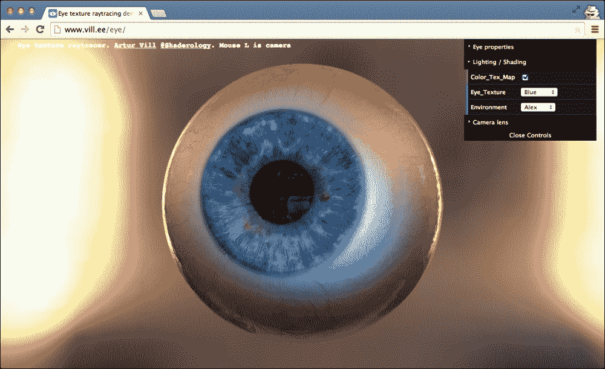
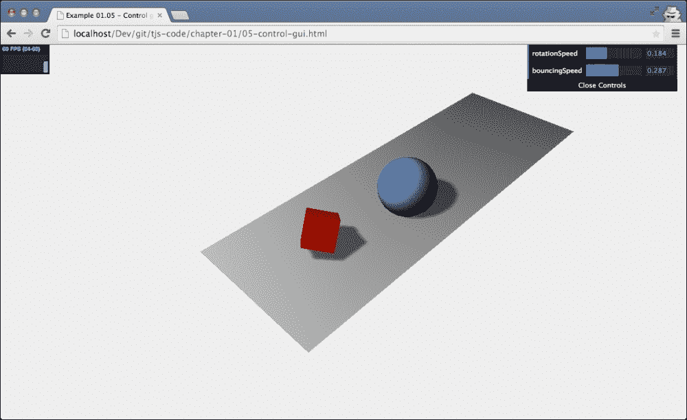
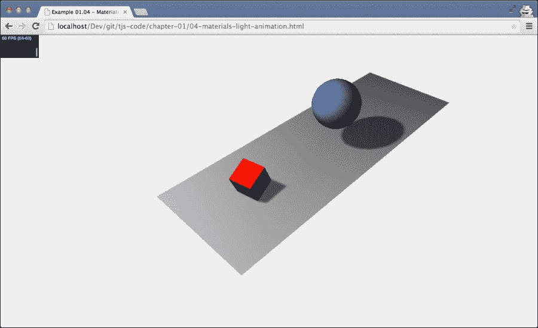
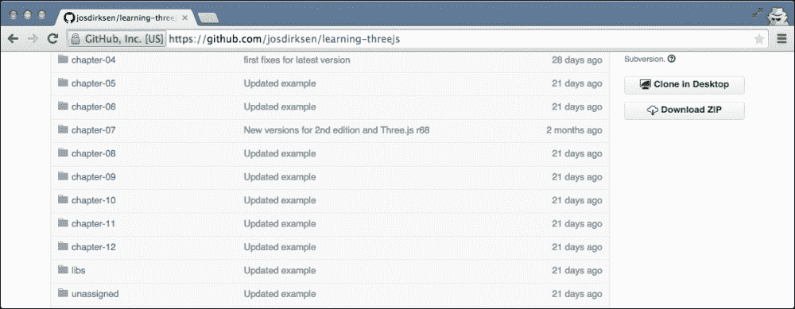
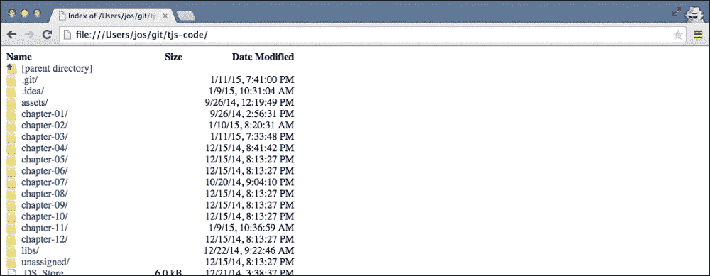
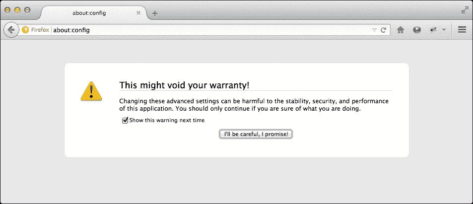
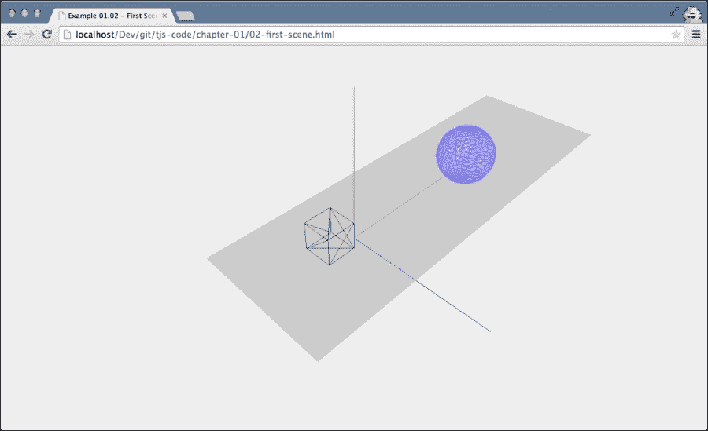
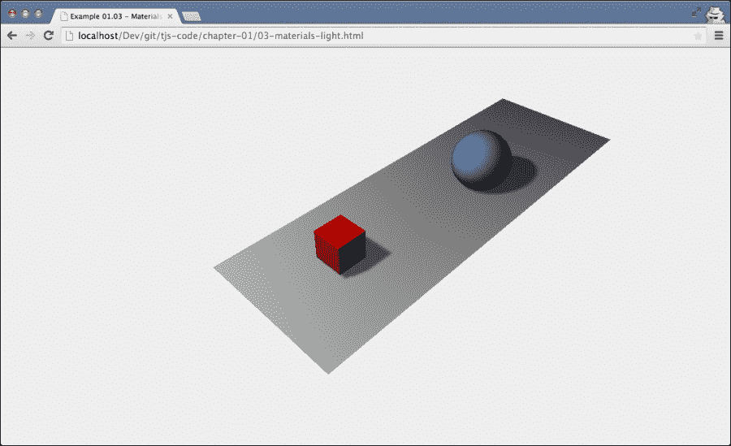
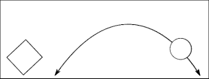
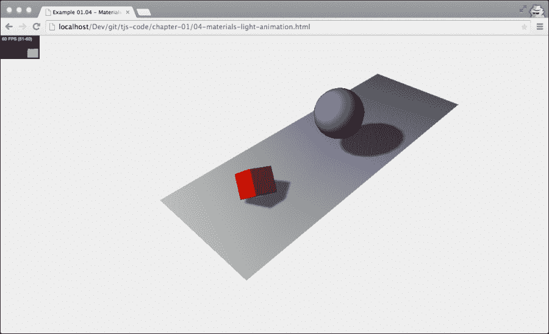

# 第一章。使用 Three.js 创建您的第一个 3D 场景

现代浏览器正在逐渐获得更强大的功能，可以直接从 JavaScript 中访问。您可以轻松地使用新的 HTML5 标签添加视频和音频，并通过 HTML5 画布创建交互式组件。与 HTML5 一起，现代浏览器还开始支持 WebGL。使用 WebGL，您可以直接利用图形卡的处理资源，并创建高性能的 2D 和 3D 计算机图形。直接从 JavaScript 编程 WebGL 以创建和动画 3D 场景是一个非常复杂和容易出错的过程。Three.js 是一个使这变得更容易的库。以下列表显示了 Three.js 使得易于实现的一些功能：

+   创建简单和复杂的 3D 几何体

+   通过 3D 场景中的动画和移动对象

+   将纹理和材质应用到您的对象上

+   利用不同的光源照亮场景

+   从 3D 建模软件加载对象

+   向您的 3D 场景添加高级后处理效果

+   使用自定义着色器

+   创建点云

使用几行 JavaScript 代码，您可以创建从简单的 3D 模型到逼真的实时场景的任何东西，如下图所示（通过在浏览器中打开[`www.vill.ee/eye/`](http://www.vill.ee/eye/)来查看）：



在本章中，我们将直接深入了解 Three.js，并创建一些示例，向您展示 Three.js 的工作原理，并可以用来进行实验。我们不会立即深入所有技术细节；这是您将在接下来的章节中学习的内容。在本章中，我们将涵盖以下内容：

+   使用 Three.js 所需的工具

+   下载本书中使用的源代码和示例

+   创建您的第一个 Three.js 场景

+   使用材质、光线和动画改进第一个场景

+   介绍一些辅助库，用于统计和控制场景

我们将从简短介绍 Three.js 开始这本书，然后迅速转向第一个示例和代码样本。在我们开始之前，让我们快速看看最重要的浏览器以及它们对 WebGL 的支持。

在撰写本文时，WebGL 与以下桌面浏览器兼容：

| 浏览器 | 支持 |
| --- | --- |
| Mozilla Firefox | 该浏览器自 4.0 版本起就支持 WebGL。 |
| 谷歌 Chrome | 该浏览器自 9.0 版本起就支持 WebGL。 |
| Safari | 安装在 Mac OS X Mountain Lion、Lion 或 Snow Leopard 上的 Safari 版本 5.1 及更高版本支持 WebGL。确保您在 Safari 中启用了 WebGL。您可以通过转到**首选项** &#124; **高级**并勾选**在菜单栏中显示开发菜单**来实现这一点。之后，转到**开发** &#124; **启用 WebGL**。 |
| Opera | 该浏览器自 12.00 版本起就支持 WebGL。您仍然需要通过打开**opera:config**并将**WebGL**和**启用硬件加速**的值设置为`1`来启用此功能。之后，重新启动浏览器。 |
| 互联网浏览器 | 很长一段时间以来，IE 是唯一不支持 WebGL 的主要浏览器。从 IE11 开始，微软已经添加了对 WebGL 的支持。 |

基本上，Three.js 可以在任何现代浏览器上运行，除了较旧版本的 IE。因此，如果您想使用较旧版本的 IE，您需要采取额外的步骤。对于 IE 10 及更早版本，有*iewebgl*插件，您可以从[`github.com/iewebgl/iewebgl`](https://github.com/iewebgl/iewebgl)获取。此插件安装在 IE 10 及更早版本中，并为这些浏览器启用了 WebGL 支持。

在移动设备上也可以运行 Three.js；对 WebGL 的支持和性能会有所不同，但两者都在迅速改善：

| 设备 | 支持 |
| --- | --- |
| Android | Android 的原生浏览器不支持 WebGL，通常也缺乏对现代 HTML5 功能的支持。如果您想在 Android 上使用 WebGL，可以使用最新版本的 Chrome、Firefox 或 Opera 移动版。 |
| IOS | IOS 8 也支持 IOS 设备上的 WebGL。IOS Safari 8 版本具有出色的 WebGL 支持。 |
| Windows mobile | Windows 手机自 8.1 版本起支持 WebGL。 |

使用 WebGL，您可以创建在台式机和移动设备上运行非常流畅的交互式 3D 可视化。

### 提示

在本书中，我们将主要关注 Three.js 提供的基于 WebGL 的渲染器。然而，还有一个基于 CSS 3D 的渲染器，它提供了一个简单的 API 来创建基于 CSS 3D 的 3D 场景。使用 CSS 3D 的一个重要优势是，这个标准几乎在所有移动和桌面浏览器上都得到支持，并且允许您在 3D 空间中渲染 HTML 元素。我们将展示如何在第七章中使用 CSS 3D 浏览器，*粒子、精灵和点云*。

在本章中，您将直接创建您的第一个 3D 场景，并且可以在之前提到的任何浏览器中运行。我们暂时不会介绍太多复杂的 Three.js 功能，但在本章结束时，您将已经创建了下面截图中可以看到的 Three.js 场景：



在这个第一个场景中，您将学习 Three.js 的基础知识，并创建您的第一个动画。在开始这个示例之前，在接下来的几节中，我们将首先看一下您需要轻松使用 Three.js 的工具，以及如何下载本书中展示的示例。

# 使用 Three.js 的要求

Three.js 是一个 JavaScript 库，因此创建 Three.js WebGL 应用程序所需的只是一个文本编辑器和一个支持的浏览器来渲染结果。我想推荐两款 JavaScript 编辑器，这是我在过去几年中开始专门使用的：

+   WebStorm：这个来自 JetBrains 指南的编辑器对编辑 JavaScript 有很好的支持。它支持代码补全、自动部署和直接从编辑器进行 JavaScript 调试。除此之外，WebStorm 还具有出色的 GitHub（和其他版本控制系统）支持。您可以从[`www.jetbrains.com/webstorm/`](http://www.jetbrains.com/webstorm/)下载试用版。

+   Notepad++：Notepad++是一个通用的编辑器，支持多种编程语言的代码高亮显示。它可以轻松地布局和格式化 JavaScript。请注意，Notepad++仅适用于 Windows。您可以从[`notepad-plus-plus.org/`](http://notepad-plus-plus.org/)下载 Notepad++。

+   Sublime 文本编辑器：Sublime 是一个很棒的编辑器，对编辑 JavaScript 有很好的支持。除此之外，它还提供了许多非常有用的选择（如多行选择）和编辑选项，一旦您习惯了它们，就会提供一个非常好的 JavaScript 编辑环境。Sublime 也可以免费测试，并且可以从[`www.sublimetext.com/`](http://www.sublimetext.com/)下载。

即使您不使用这些编辑器，也有很多可用的编辑器，开源和商业的，您可以用来编辑 JavaScript 并创建您的 Three.js 项目。您可能想看看的一个有趣的项目是[`c9.io`](http://c9.io)。这是一个基于云的 JavaScript 编辑器，可以连接到 GitHub 账户。这样，您就可以直接访问本书中的所有源代码和示例，并对其进行实验。

### 提示

除了这些文本编辑器，您可以使用它们来编辑和实验本书中的源代码，Three.js 目前还提供了一个在线编辑器。

使用这个编辑器，您可以在[`threejs.org/editor/`](http://threejs.org/editor/)找到，可以使用图形化的方法创建 Three.js 场景。

我提到大多数现代 Web 浏览器都支持 WebGL，并且可以用于运行 Three.js 示例。我通常在 Chrome 中运行我的代码。原因是大多数情况下，Chrome 对 WebGL 有最好的支持和性能，并且具有非常好的 JavaScript 调试器。通过这个调试器，您可以快速定位问题，例如使用断点和控制台输出。这在下面的截图中有所体现。在本书中，我会给您一些关于调试器使用和其他调试技巧的指导。



现在关于 Three.js 的介绍就到此为止；让我们获取源代码并从第一个场景开始吧。

# 获取源代码

本书的所有代码都可以从 GitHub ([`github.com/`](https://github.com/))访问。GitHub 是一个在线的基于 Git 的存储库，您可以用它来存储、访问和管理源代码的版本。有几种方式可以获取源代码：

+   克隆 Git 存储库

+   下载并提取存档

在接下来的两段中，我们将稍微详细地探讨这些选项。

## 使用 Git 克隆存储库

Git 是一个开源的分布式版本控制系统，我用它来创建和管理本书中的所有示例。为此，我使用了 GitHub，一个免费的在线 Git 存储库。您可以通过[`github.com/josdirksen/learning-threejs`](https://github.com/josdirksen/learning-threejs)浏览此存储库。

要获取所有示例，您可以使用`git`命令行工具克隆此存储库。为此，您首先需要为您的操作系统下载一个 Git 客户端。对于大多数现代操作系统，可以从[`git-scm.com`](http://git-scm.com)下载客户端，或者您可以使用 GitHub 本身提供的客户端（适用于 Mac 和 Windows）。安装 Git 后，您可以使用它来获取本书存储库的*克隆*。打开命令提示符并转到您想要下载源代码的目录。在该目录中，运行以下命令：

```js
**# git clone https://github.com/josdirksen/learning-threejs**

```

这将开始下载所有示例，如下截图所示：


`learning-three.js`目录现在将包含本书中使用的所有示例。

## 下载和提取存档

如果您不想使用 Git 直接从 GitHub 下载源代码，您也可以下载一个存档。在浏览器中打开[`github.com/josdirksen/learning-threejs`](https://github.com/josdirksen/learning-threejs)，并点击右侧的**Download ZIP**按钮，如下所示：



将其提取到您选择的目录中，您就可以使用所有示例了。

## 测试示例

现在您已经下载或克隆了源代码，让我们快速检查一下是否一切正常，并让您熟悉目录结构。代码和示例按章节组织。有两种不同的查看示例的方式。您可以直接在浏览器中打开提取或克隆的文件夹，并查看和运行特定示例，或者您可以安装本地 Web 服务器。第一种方法适用于大多数基本示例，但当我们开始加载外部资源，例如模型或纹理图像时，仅仅打开 HTML 文件是不够的。在这种情况下，我们需要一个本地 Web 服务器来确保外部资源被正确加载。在接下来的部分中，我们将解释一些不同的设置简单本地 Web 服务器的方法。如果您无法设置本地 Web 服务器但使用 Chrome 或 Firefox，我们还提供了如何禁用某些安全功能的说明，以便您甚至可以在没有本地 Web 服务器的情况下进行测试。

根据您已经安装了什么，设置本地 Web 服务器非常容易。在这里，我们列举了一些示例。根据您系统上已经安装了什么，有许多不同的方法可以做到这一点。

### 基于 Python 的 Web 服务器应该在大多数 Unix/Mac 系统上工作

大多数 Unix/Linux/Mac 系统已经安装了 Python。在这些系统上，您可以非常容易地启动本地 Web 服务器：

```js
 **> python -m SimpleHTTPServer**
 **Serving HTTP on 0.0.0.0 port 8000 ...**

```

在您检出/下载源代码的目录中执行此操作。

### 如果您已经使用 Node.js，可以使用基于 npm 的 Web 服务器

如果您已经使用 Node.js 做了一些工作，那么您很有可能已经安装了 npm。使用 npm，您有两个简单的选项来设置一个快速的本地 Web 服务器进行测试。第一个选项使用`http-server`模块，如下所示：

```js
 **> npm install -g http-server**
 **> http-server**
**Starting up http-server, serving ./ on port: 8080**
**Hit CTRL-C to stop the server**

```

或者，您还可以使用`simple-http-server`选项，如下所示：

```js
**> npm install -g simple-http-server**
**> nserver**
**simple-http-server Now Serving: /Users/jos/git/Physijs at http://localhost:8000/**

```

然而，这种第二种方法的缺点是它不会自动显示目录列表，而第一种方法会。

### Mac 和/或 Windows 的 Mongoose 便携版

如果您没有安装 Python 或 npm，那么有一个名为 Mongoose 的简单、便携式 Web 服务器可供您使用。首先，从[`code.google.com/p/mongoose/downloads/list`](https://code.google.com/p/mongoose/downloads/list)下载您特定平台的二进制文件。如果您使用 Windows，将其复制到包含示例的目录中，并双击可执行文件以启动 Web 浏览器，为其启动的目录提供服务。

对于其他操作系统，您还必须将可执行文件复制到目标目录，但是不是双击可执行文件，而是必须从命令行启动它。在这两种情况下，本地 Web 服务器将在端口`8080`上启动。以下屏幕截图概括了本段讨论的内容：



通过单击章节，我们可以显示和访问该特定章节的所有示例。如果我在本书中讨论一个示例，我将引用特定的名称和文件夹，以便您可以直接测试和玩耍代码。

### 在 Firefox 和 Chrome 中禁用安全异常

如果您使用 Chrome 运行示例，有一种方法可以禁用一些安全设置，以便您可以使用 Chrome 查看示例，而无需使用 Web 服务器。要做到这一点，您必须以以下方式启动 Chrome：

+   对于 Windows，执行以下操作：

```js
**chrome.exe --disable-web-security**

```

+   在 Linux 上，执行以下操作：

```js
**google-chrome --disable-web-security**

```

+   在 Mac OS 上，通过以下方式禁用设置：

```js
**open -a Google\ Chrome --args --disable-web-security**

```

以这种方式启动 Chrome，您可以直接从本地文件系统访问所有示例。

对于 Firefox 用户，我们需要采取一些不同的步骤。打开 Firefox，在 URL 栏中键入`about:config`。这是您将看到的内容：



在此屏幕上，点击**我会小心，我保证！**按钮。这将显示您可以使用的所有可用属性，以便微调 Firefox。在此屏幕上的搜索框中，键入`security.fileuri.strict_origin_policy`，并将其值更改为`false`，就像我们在以下屏幕截图中所做的那样：


此时，您还可以使用 Firefox 直接运行本书提供的示例。

现在，您已经安装了 Web 服务器，或者禁用了必要的安全设置，是时候开始创建我们的第一个 Three.js 场景了。

# 创建 HTML 骨架

我们需要做的第一件事是创建一个空的骨架页面，我们可以将其用作所有示例的基础，如下所示：

```js
<!DOCTYPE html>

<html>

  <head>
    <title>Example 01.01 - Basic skeleton</title>
    <script src="../libs/three.js"></script>
    <style>
      body{
        /* set margin to 0 and overflow to hidden, to use the complete page */

        margin: 0;
        overflow: hidden;
      }
    </style>
  </head>
  <body>

    <!-- Div which will hold the Output -->
    <div id="WebGL-output">
    </div>

    <!-- Javascript code that runs our Three.js examples -->
    <script>

      // once everything is loaded, we run our Three.js stuff.
      function init() {
        // here we'll put the Three.js stuff
      };
      window.onload = init;

    </script>
  </body>
</html>
```

### 提示

**下载示例代码**

您可以从[`www.packtpub.com`](http://www.packtpub.com)的帐户中下载示例代码文件，用于您购买的所有 Packt Publishing 图书。如果您在其他地方购买了本书，您可以访问[`www.packtpub.com/support`](http://www.packtpub.com/support)并注册，以便直接通过电子邮件接收文件。

从此列表中可以看出，骨架是一个非常简单的 HTML 页面，只有几个元素。在`<head>`元素中，我们加载了我们将在示例中使用的外部 JavaScript 库。对于所有示例，我们至少需要加载 Three.js 库`three.js`。在`<head>`元素中，我们还添加了几行 CSS。这些样式元素在创建全屏 Three.js 场景时移除任何滚动条。在此页面的`<body>`元素中，您可以看到一个单独的`<div>`元素。当我们编写我们的 Three.js 代码时，我们将把 Three.js 渲染器的输出指向该元素。在此页面的底部，您已经可以看到一些 JavaScript。通过将`init`函数分配给`window.onload`属性，我们确保在 HTML 文档加载完成时调用此函数。在`init`函数中，我们将插入所有特定于 Three.js 的 JavaScript。

Three.js 有两个版本：

+   **Three.min.js**：这是您在互联网上部署 Three.js 网站时通常使用的库。这是使用**UglifyJS**创建的 Three.js 的缩小版本，是正常 Three.js 库的四分之一大小。本书中使用的所有示例和代码都基于于 2014 年 10 月发布的 Three.js **r69**。

+   **Three.js**：这是正常的 Three.js 库。我们在示例中使用这个库，因为当您能够阅读和理解 Three.js 源代码时，调试会更加容易。

如果我们在浏览器中查看此页面，结果并不令人震惊。正如您所期望的那样，您只会看到一个空白页面。

在下一节中，您将学习如何添加前几个 3D 对象并将其渲染到我们在 HTML 骨架中定义的`<div>`元素中。

# 渲染和查看 3D 对象

在这一步中，您将创建您的第一个场景，并添加一些对象和一个相机。我们的第一个示例将包含以下对象：

| 对象 | 描述 |
| --- | --- |
| `Plane` | 这是一个作为我们地面区域的二维矩形。在本章的第二个截图中，它被渲染为场景中间的灰色矩形。 |
| `Cube` | 这是一个三维立方体，我们将以红色渲染。 |
| `Sphere` | 这是一个三维球体，我们将以蓝色渲染。 |
| `Camera` | 相机决定了输出中你将看到什么。 |
| `Axes` | 这些是*x*、*y*和*z*轴。这是一个有用的调试工具，可以看到对象在 3D 空间中的渲染位置。*x*轴为红色，*y*轴为绿色，*z*轴为蓝色。 |

我将首先向您展示代码中的外观（带有注释的源代码可以在`chapter-01/02-first-scene.html`中找到），然后我将解释发生了什么：

```js
function init() {
  var scene = new THREE.Scene();
  var camera = new THREE.PerspectiveCamera(45, window.innerWidth /window.innerHeight, 0.1, 1000);

  var renderer = new THREE.WebGLRenderer();
  renderer.setClearColorHex(0xEEEEEE);
  renderer.setSize(window.innerWidth, window.innerHeight);

  var axes = new THREE.AxisHelper(20);
  scene.add(axes);

  var planeGeometry = new THREE.PlaneGeometry(60, 20, 1, 1);
  var planeMaterial = new THREE.MeshBasicMaterial({color: 0xcccccc});
  var plane = new THREE.Mesh(planeGeometry, planeMaterial);

  plane.rotation.x = -0.5 * Math.PI;
  plane.position.x = 15
  plane.position.y = 0
  plane.position.z = 0

  scene.add(plane);

  var cubeGeometry = new THREE.BoxGeometry(4, 4, 4)
  var cubeMaterial = new THREE.MeshBasicMaterial({color: 0xff0000, wireframe: true});
  var cube = new THREE.Mesh(cubeGeometry, cubeMaterial);

  cube.position.x = -4;
  cube.position.y = 3;
  cube.position.z = 0;

  scene.add(cube);

  var sphereGeometry = new THREE.SphereGeometry(4, 20, 20);
  var sphereMaterial = new THREE.MeshBasicMaterial({color: 0x7777ff, wireframe: true});
  var sphere = new THREE.Mesh(sphereGeometry, sphereMaterial);

  sphere.position.x = 20;
  sphere.position.y = 4;
  sphere.position.z = 2;

  scene.add(sphere);

  camera.position.x = -30;
  camera.position.y = 40;
  camera.position.z = 30;
  camera.lookAt(scene.position);

  document.getElementById("WebGL-output")
    .appendChild(renderer.domElement);
    renderer.render(scene, camera);
};
window.onload = init;
```

如果我们在浏览器中打开此示例，我们会看到与我们的目标相似的东西（请参阅本章开头的截图），但仍有很长的路要走，如下所示：



在我们开始让这个更加美丽之前，我将逐步向您介绍代码，以便您了解代码的作用：

```js
var scene = new THREE.Scene();
var camera = new THREE.PerspectiveCamera(45, window.innerWidth / window.innerHeight, 0.1, 1000);
var renderer = new THREE.WebGLRenderer();
renderer.setClearColorHex()
renderer.setClearColor(new THREE.Color(0xEEEEEE));
renderer.setSize(window.innerWidth, window.innerHeight);
```

在示例的顶部，我们定义了`scene`，`camera`和`renderer`。`scene`对象是一个容器，用于存储和跟踪我们要渲染的所有对象和我们要使用的所有灯光。没有`THREE.Scene`对象，Three.js 就无法渲染任何东西。关于`THREE.Scene`对象的更多信息可以在下一章中找到。我们想要渲染的球体和立方体将在示例的后面添加到场景中。在这个第一个片段中，我们还创建了一个`camera`对象。`camera`对象定义了我们在渲染场景时会看到什么。在第二章中，*Three.js 场景的基本组件*，您将了解有关您可以传递给`camera`对象的参数的更多信息。接下来我们定义`renderer`。`renderer`对象负责根据`camera`对象的角度在浏览器中计算`scene`对象的外观。在这个示例中，我们创建了一个使用您的图形卡来渲染场景的`WebGLRenderer`。

### 提示

如果您查看 Three.js 的源代码和文档（您可以在[`threejs.org/`](http://threejs.org/)找到），您会注意到除了基于 WebGL 的渲染器之外，还有其他不同的渲染器可用。有一个基于画布的渲染器，甚至还有一个基于 SVG 的渲染器。尽管它们可以工作并且可以渲染简单的场景，但我不建议使用它们。它们非常消耗 CPU，并且缺乏诸如良好的材质支持和阴影等功能。

在这里，我们将`renderer`的背景颜色设置为接近白色（`new THREE.Color(0XEEEEEE)`），并使用`setClearColor`函数告诉`renderer`需要渲染的场景有多大。

到目前为止，我们有一个基本的空场景，一个渲染器和一个摄像头。然而，还没有要渲染的东西。以下代码添加了辅助轴和平面：

```js
  var axes = new THREE.AxisHelper( 20 );
  scene.add(axes);

  var planeGeometry = new THREE.PlaneGeometry(60,20);
  var planeMaterial = new THREE.MeshBasicMaterial({color: 0xcccccc});
  var plane = new THREE.Mesh(planeGeometry,planeMaterial);

  plane.rotation.x=-0.5*Math.PI;
  plane.position.x=15
  plane.position.y=0
  plane.position.z=0
  scene.add(plane);
```

正如您所看到的，我们创建了一个`axes`对象，并使用`scene.add`函数将这些轴添加到我们的场景中。接下来，我们创建了平面。这是分两步完成的。首先，我们使用新的`THREE.PlaneGeometry(60,20)`代码定义了平面的外观。在这种情况下，它的宽度为`60`，高度为`20`。我们还需要告诉 Three.js 这个平面的外观（例如，它的颜色和透明度）。在 Three.js 中，我们通过创建一个材质对象来实现这一点。对于这个第一个示例，我们将创建一个基本材质（`THREE.MeshBasicMaterial`），颜色为`0xcccccc`。接下来，我们将这两者合并成一个名为`plane`的`Mesh`对象。在将`plane`添加到场景之前，我们需要将其放在正确的位置；我们首先围绕 x 轴旋转它 90 度，然后使用位置属性在场景中定义其位置。如果您已经对此感兴趣，请查看第二章的代码文件夹中的`06-mesh-properties.html`示例，该示例显示并解释了旋转和定位。然后我们需要做的就是像我们对`axes`所做的那样将`plane`添加到`scene`中。

`cube`和`sphere`对象以相同的方式添加，但`wireframe`属性设置为`true`，告诉 Three.js 渲染线框而不是实心对象。现在，让我们继续进行这个示例的最后部分：

```js
  camera.position.x = -30;
  camera.position.y = 40;
  camera.position.z = 30;
  camera.lookAt(scene.position);

  document.getElementById("WebGL-output")
    .appendChild(renderer.domElement);
    renderer.render(scene, camera);
```

在这一点上，我们想要渲染的所有元素都已经添加到了正确的位置。我已经提到相机定义了什么将被渲染。在这段代码中，我们使用`x`、`y`和`z`位置属性来定位相机，使其悬浮在我们的场景上方。为了确保相机看向我们的对象，我们使用`lookAt`函数将其指向我们场景的中心，默认情况下位于位置（0, 0, 0）。剩下的就是将渲染器的输出附加到我们 HTML 骨架的`<div>`元素上。我们使用标准的 JavaScript 来选择正确的输出元素，并使用`appendChild`函数将其附加到我们的`div`元素上。最后，我们告诉`renderer`使用提供的`camera`对象来渲染`scene`。

在接下来的几节中，我们将通过添加光源、阴影、更多材质甚至动画使这个场景更加美观。

# 添加材质、光源和阴影

在 Three.js 中添加新的材质和光源非常简单，几乎与我们在上一节中解释的方式相同。我们首先通过以下方式向场景添加光源（完整的源代码请查看`03-materials-light.html`）：

```js
  var spotLight = new THREE.SpotLight( 0xffffff );
  spotLight.position.set( -40, 60, -10 );
  scene.add( spotLight );
```

`THREE.SpotLight`从其位置（`spotLight.position.set(-40, 60, -10)`）照亮我们的场景。然而，如果这次渲染场景，您不会看到与上一个场景的任何不同。原因是不同的材质对光的反应不同。我们在上一个示例中使用的基本材质（`THREE.MeshBasicMaterial`）在场景中不会对光源产生任何影响。它们只是以指定的颜色渲染对象。因此，我们必须将`plane`、`sphere`和`cube`的材质更改为以下内容：

```js
var planeGeometry = new THREE.PlaneGeometry(60,20);
var planeMaterial = new THREE.MeshLambertMaterial({color: 0xffffff});
var plane = new THREE.Mesh(planeGeometry, planeMaterial);
...
var cubeGeometry = new THREE.BoxGeometry(4,4,4);
var cubeMaterial = new THREE.MeshLambertMaterial({color: 0xff0000});
var cube = new THREE.Mesh(cubeGeometry, cubeMaterial);
...
var sphereGeometry = new THREE.SphereGeometry(4,20,20);
var sphereMaterial = new THREE.MeshLambertMaterial({color: 0x7777ff});
var sphere = new THREE.Mesh(sphereGeometry, sphereMaterial);
```

在这段代码中，我们将对象的材质更改为`MeshLambertMaterial`。这种材质和`MeshPhongMaterial`是 Three.js 提供的在渲染时考虑光源的材质。

然而，如下截图所示的结果仍然不是我们要找的：


我们已经接近了，立方体和球看起来好多了。然而，还缺少的是阴影。

渲染阴影需要大量的计算能力，因此在 Three.js 中默认情况下禁用阴影。不过，启用它们非常容易。对于阴影，我们需要在几个地方更改源代码，如下所示：

```js
renderer.setClearColor(new THREE.Color(0xEEEEEE, 1.0));
renderer.setSize(window.innerWidth, window.innerHeight);
renderer.shadowMapEnabled = true;
```

我们需要做的第一个更改是告诉`renderer`我们想要阴影。您可以通过将`shadowMapEnabled`属性设置为`true`来实现这一点。如果您查看这个更改的结果，您暂时不会注意到任何不同。这是因为我们需要明确定义哪些对象投射阴影，哪些对象接收阴影。在我们的示例中，我们希望球体和立方体在地面上投射阴影。您可以通过在这些对象上设置相应的属性来实现这一点：

```js
plane.receiveShadow = true;
...
cube.castShadow = true;
...
sphere.castShadow = true;
```

现在，我们只需要做一件事就可以得到阴影了。我们需要定义我们场景中哪些光源会产生阴影。并非所有的光源都能产生阴影，您将在下一章中了解更多相关信息，但是我们在这个示例中使用的`THREE.SpotLight`可以。我们只需要设置正确的属性，如下代码行所示，阴影最终将被渲染出来：

```js
spotLight.castShadow = true;
```

有了这个，我们得到了一个包含来自光源的阴影的场景，如下所示：



我们将添加到这个第一个场景的最后一个特性是一些简单的动画。在第九章*动画和移动摄像机*中，您将了解更高级的动画选项。

# 通过动画扩展您的第一个场景

如果我们想要对场景进行动画，我们需要做的第一件事是找到一种在特定间隔重新渲染场景的方法。在 HTML5 和相关的 JavaScript API 出现之前，做到这一点的方法是使用`setInterval(function,interval)`函数。使用`setInterval`，我们可以指定一个函数，例如，每 100 毫秒调用一次。这个函数的问题在于它不考虑浏览器中正在发生的事情。如果您正在浏览另一个标签页，这个函数仍然会每隔几毫秒触发一次。此外，`setInterval`与屏幕重绘不同步。这可能导致更高的 CPU 使用率和性能不佳。

## 介绍 requestAnimationFrame

现代浏览器幸运地有一个解决方案，使用`requestAnimationFrame`函数。使用`requestAnimationFrame`，您可以指定一个由浏览器定义的间隔调用的函数。您可以在提供的函数中进行任何绘图，浏览器将确保尽可能平滑和高效地绘制。使用这个函数非常简单（完整的源代码可以在`04-materials-light-animation.html`文件中找到），您只需创建一个处理渲染的函数：

```js
function renderScene() {
  requestAnimationFrame(renderScene);
  renderer.render(scene, camera);
}
```

在这个`renderScene`函数中，我们再次调用`requestAnimationFrame`，以保持动画进行。我们需要在代码中改变的唯一一件事是，在我们创建完整的场景后，我们不再调用`renderer.render`，而是调用`renderScene`函数一次，以启动动画：

```js
...
document.getElementById("WebGL-output")
  .appendChild(renderer.domElement);
renderScene();
```

如果您运行这个代码，与之前的例子相比，您不会看到任何变化，因为我们还没有进行任何动画。在添加动画之前，我想介绍一个小的辅助库，它可以为我们提供有关动画运行帧率的信息。这个库来自与 Three.js 相同作者，它渲染了一个小图表，显示了我们为这个动画获得的每秒帧数。

要添加这些统计信息，我们首先需要在 HTML 的`<head>`元素中包含库，如下所示：

```js
<script src="../libs/stats.js"></script>
```

我们添加一个`<div>`元素，用作统计图的输出，如下所示：

```js
<div id="Stats-output"></div>
```

唯一剩下的事情就是初始化统计信息并将它们添加到这个`<div>`元素中，如下所示：

```js
function initStats() {
  var stats = new Stats();
  stats.setMode(0);
  stats.domElement.style.position = 'absolute';
  stats.domElement.style.left = '0px';
  stats.domElement.style.top = '0px';
  document.getElementById("Stats-output")
    .appendChild( stats.domElement );
     return stats;
}
```

这个函数初始化了统计信息。有趣的部分是`setMode`函数。如果我们将其设置为`0`，我们将测量每秒帧数（fps），如果我们将其设置为`1`，我们可以测量渲染时间。对于这个例子，我们对 fps 感兴趣，所以设置为`0`。在我们的`init()`函数的开头，我们将调用这个函数，这样我们就启用了`stats`，如下所示：

```js
function init(){

  var stats = initStats();
  ...
}
```

唯一剩下的事情就是告诉`stats`对象我们何时处于新的渲染周期。我们通过在`renderScene`函数中添加对`stats.update`函数的调用来实现这一点，如下所示。

```js
function renderScene() {
  stats.update();
  ...
  requestAnimationFrame(renderScene);
  renderer.render(scene, camera);
}
```

如果您运行带有这些添加的代码，您将在左上角看到统计信息，如下面的截图所示：


## 为立方体添加统计信息

有了`requestAnimationFrame`和配置好的统计信息，我们有了一个放置动画代码的地方。在本节中，我们将扩展`renderScene`函数的代码，以使我们的红色立方体围绕所有轴旋转。让我们先向您展示代码：

```js
function renderScene() {
  ...
  cube.rotation.x += 0.02;
  cube.rotation.y += 0.02;
  cube.rotation.z += 0.02;
  ...
  requestAnimationFrame(renderScene);
  renderer.render(scene, camera);
}
```

看起来很简单，对吧？我们所做的是每次调用`renderScene`函数时，都增加每个轴的`rotation`属性 0.02，这样就会显示一个立方体平滑地围绕所有轴旋转。让蓝色的球弹跳并不难。

## 弹跳球

为了让球弹跳，我们再次向`renderScene`函数中添加了几行代码，如下所示：

```js
  var step=0;
  function renderScene() {
    ...
    step+=0.04;
    sphere.position.x = 20+( 10*(Math.cos(step)));
    sphere.position.y = 2 +( 10*Math.abs(Math.sin(step)));
    ...
    requestAnimationFrame(renderScene);
    renderer.render(scene, camera);
  }
```

使用立方体，我们改变了“旋转”属性；对于球体，我们将在场景中改变其“位置”属性。我们希望球体能够从场景中的一个点弹跳到另一个点，并呈现出一个漂亮、平滑的曲线。如下图所示：



为此，我们需要改变它在*x*轴上的位置和在*y*轴上的位置。`Math.cos`和`Math.sin`函数帮助我们使用步长变量创建平滑的轨迹。我不会在这里详细介绍这是如何工作的。现在，你需要知道的是`step+=0.04`定义了弹跳球的速度。在第八章中，*创建和加载高级网格和几何体*，我们将更详细地看看这些函数如何用于动画，并且我会解释一切。这是球在弹跳中间的样子：



在结束本章之前，我想在我们的基本场景中再添加一个元素。当处理 3D 场景、动画、颜色和类似属性时，通常需要一些试验来获得正确的颜色或速度。如果你能有一个简单的 GUI，可以让你随时改变这些属性，那就太方便了。幸运的是，有这样的工具！

# 使用 dat.GUI 使实验更容易

Google 的几名员工创建了一个名为**dat.GUI**的库（你可以在[`code.google.com/p/dat-gui/`](http://code.google.com/p/dat-gui/)上找到在线文档），它可以让你非常容易地创建一个简单的用户界面组件，可以改变你代码中的变量。在本章的最后部分，我们将使用 dat.GUI 为我们的示例添加一个用户界面，允许我们改变以下内容：

+   控制弹跳球的速度

+   控制立方体的旋转

就像我们为统计数据所做的那样，我们首先将这个库添加到我们 HTML 页面的`<head>`元素中，如下所示：

```js
<script src="../libs/dat.gui.js"></script>
```

接下来我们需要配置的是一个 JavaScript 对象，它将保存我们想要使用 dat.GUI 改变的属性。在我们的 JavaScript 代码的主要部分，我们添加以下 JavaScript 对象，如下所示：

```js
var controls = new function() {
  this.rotationSpeed = 0.02;
  this.bouncingSpeed = 0.03;
}
```

在这个 JavaScript 对象中，我们定义了两个属性——`this.rotationSpeed`和`this.bouncingSpeed`——以及它们的默认值。接下来，我们将这个对象传递给一个新的 dat.GUI 对象，并为这两个属性定义范围，如下所示：

```js
var gui = new dat.GUI();
gui.add(controls, 'rotationSpeed', 0, 0.5);
gui.add(controls, 'bouncingSpeed', 0, 0.5);
```

`rotationSpeed`和`bouncingSpeed`属性都设置为`0`到`0.5`的范围。现在我们所需要做的就是确保在我们的`renderScene`循环中，直接引用这两个属性，这样当我们通过 dat.GUI 用户界面进行更改时，它立即影响我们对象的旋转和弹跳速度，如下所示：

```js
function renderScene() {
  ...
  cube.rotation.x += controls.rotationSpeed;
  cube.rotation.y += controls.rotationSpeed;
  cube.rotation.z += controls.rotationSpeed;
  step += controls.bouncingSpeed;
  sphere.position.x = 20 +(10 * (Math.cos(step)));
  sphere.position.y = 2 +(10 * Math.abs(Math.sin(step)));
  ...
}
```

现在，当你运行这个示例（`05-control-gui.html`），你会看到一个简单的用户界面，你可以用它来控制弹跳和旋转速度。下面是弹跳球和旋转立方体的屏幕截图：


如果你在浏览器中查看示例，你可能会注意到当你改变浏览器的大小时，场景并不会自动缩放。在下一节中，我们将把这作为本章的最后一个特性添加进去。

# 当浏览器大小改变时自动调整输出大小

当浏览器大小改变时改变摄像机可以很简单地完成。我们需要做的第一件事是注册一个事件监听器，就像这样：

```js
window.addEventListener('resize', onResize, false);
```

现在，每当浏览器窗口大小改变时，我们将调用`onResize`函数。在这个`onResize`函数中，我们需要更新摄像机和渲染器，如下所示：

```js
function onResize() {
  camera.aspect = window.innerWidth / window.innerHeight;
  camera.updateProjectionMatrix();
  renderer.setSize(window.innerWidth, window.innerHeight);
}
```

对于摄像机，我们需要更新`aspect`属性，它保存了屏幕的宽高比，对于`renderer`，我们需要改变它的大小。最后一步是将`camera`、`renderer`和`scene`的变量定义移到`init()`函数之外，这样我们就可以从不同的函数（比如`onResize`函数）中访问它们，如下所示：

```js
var camera;
var scene;
var renderer;

function init() {
  ...
  scene = new THREE.Scene();
  camera = new THREE.PerspectiveCamera(45, window.innerWidth / window.innerHeight, 0.1, 1000);
  renderer = new THREE.WebGLRenderer();
  ...
}
```

要看到这种效果，打开`06-screen-size-change.html`示例并调整浏览器窗口大小。

# 总结

第一章就到这里。在本章中，我们向您展示了如何设置开发环境，如何获取代码，以及如何开始使用本书提供的示例。您还学会了，要使用 Three.js 渲染场景，首先必须创建一个`THREE.Scene`对象，添加相机、光线和要渲染的对象。我们还向您展示了如何通过添加阴影和动画来扩展基本场景。最后，我们添加了一些辅助库。我们使用了 dat.GUI，它允许您快速创建控制用户界面，并添加了`stats.js`，它提供了有关场景渲染帧率的反馈。

在下一章中，我们将扩展我们在这里创建的示例。您将了解更多关于在 Three.js 中可以使用的最重要的构建模块。
