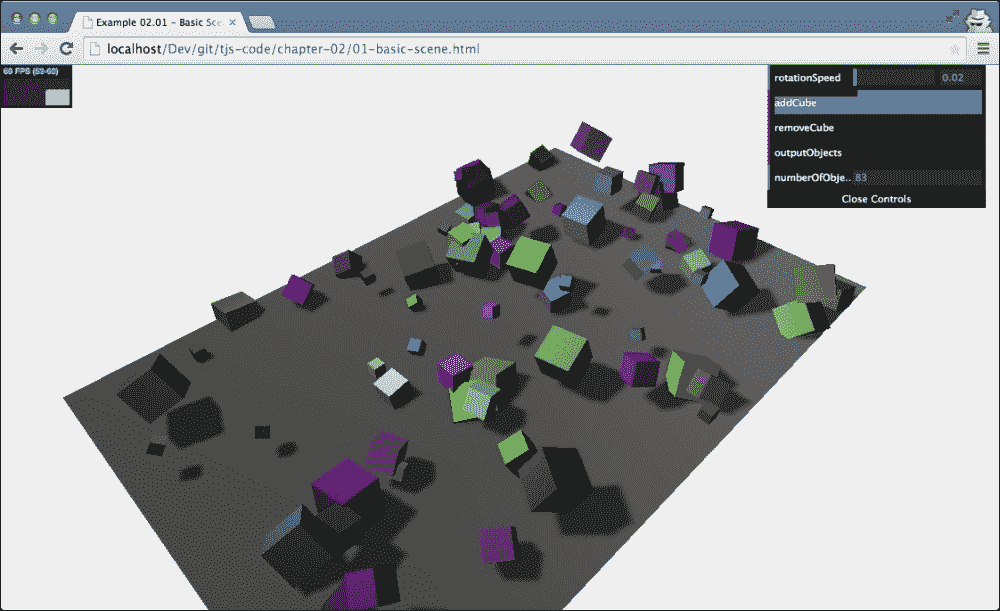
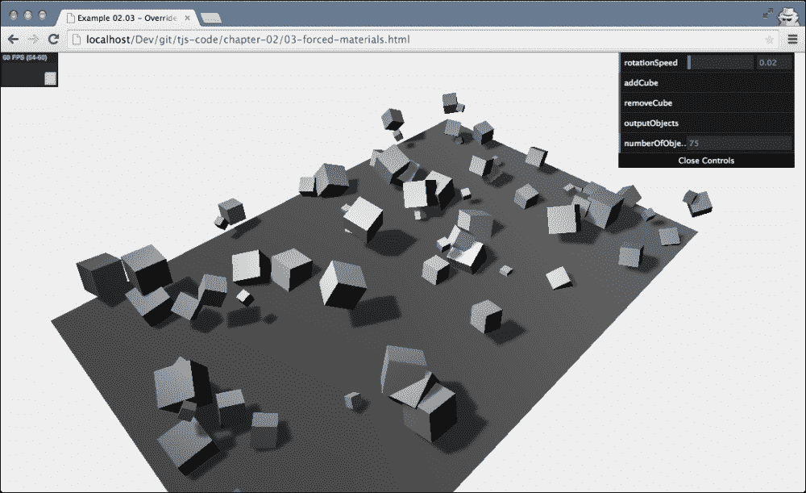
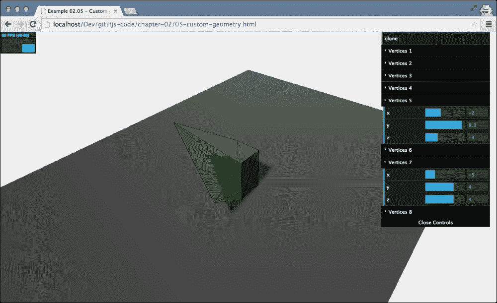
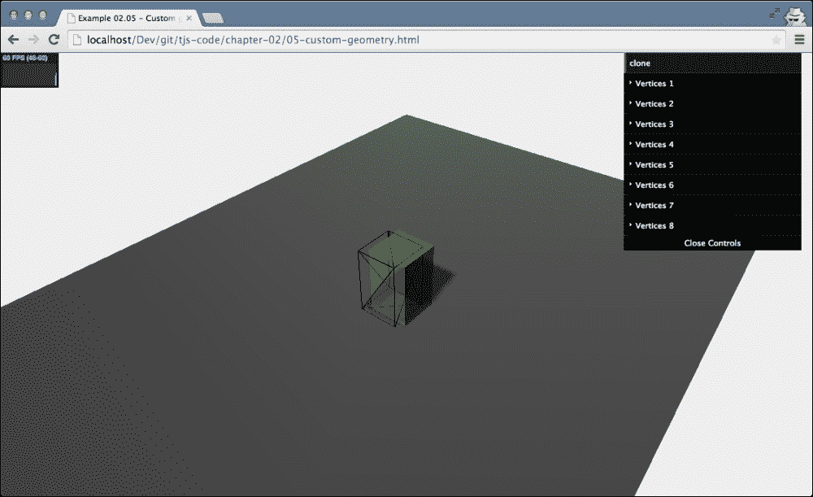
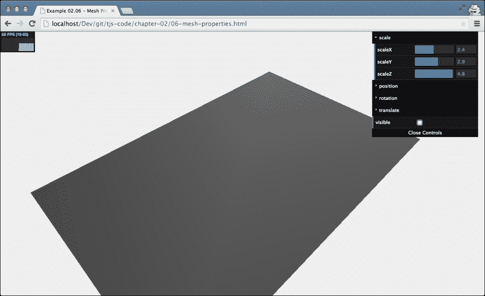
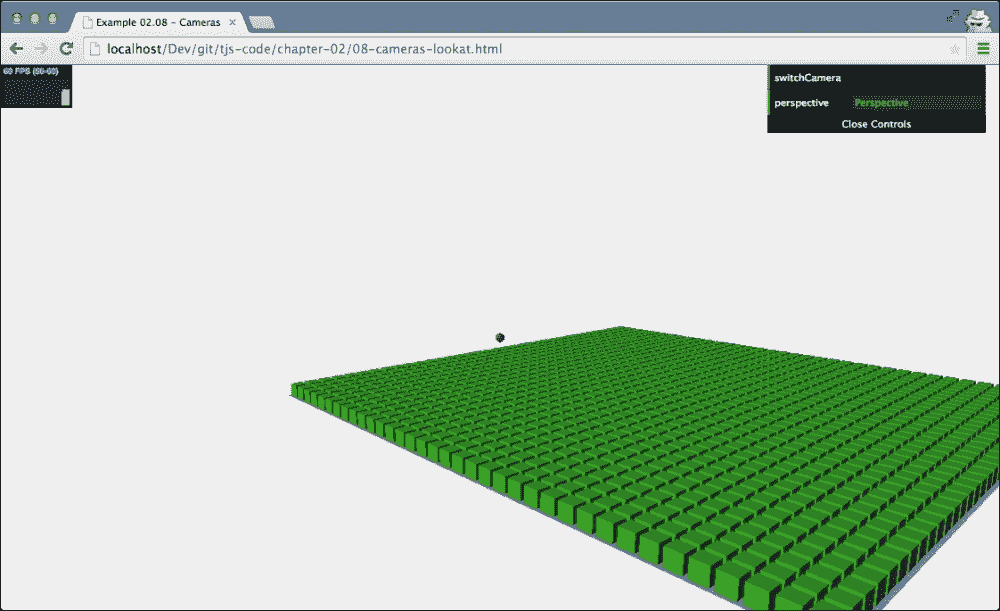

# 第二章：构成 Three.js 场景的基本组件

在上一章中，您学习了 Three.js 的基础知识。我们展示了一些例子，您创建了您的第一个完整的 Three.js 场景。在本章中，我们将深入了解 Three.js，并解释构成 Three.js 场景的基本组件。在本章中，您将探索以下主题：

+   在 Three.js 场景中使用的组件

+   您可以使用`THREE.Scene`对象做什么

+   几何体和网格之间的关系

+   正交相机和透视相机之间的区别

我们首先来看一下如何创建一个场景并添加对象。

# 创建一个场景

在上一章中，您创建了`THREE.Scene`，所以您已经了解了 Three.js 的基础知识。我们看到，为了让场景显示任何内容，我们需要三种类型的组件：

| 组件 | 描述 |
| --- | --- |
| 相机 | 这决定了屏幕上的渲染内容。 |
| 灯光 | 这些对材质的显示和创建阴影效果有影响（在第三章中详细讨论，“在 Three.js 中使用不同的光源”）。 |
| 对象 | 这些是从相机的透视角度渲染的主要对象：立方体、球体等。 |

`THREE.Scene`作为所有这些不同对象的容器。这个对象本身并没有太多的选项和功能。

### 注意

`THREE.Scene`是一种有时也被称为场景图的结构。场景图是一种可以容纳图形场景所有必要信息的结构。在 Three.js 中，这意味着`THREE.Scene`包含了所有渲染所需的对象、灯光和其他对象。有趣的是，需要注意的是，场景图并不只是对象的数组；场景图由树结构中的一组节点组成。在 Three.js 中，您可以添加到场景中的每个对象，甚至`THREE.Scene`本身，都是从名为`THREE.Object3D`的基本对象扩展而来。`THREE.Object3D`对象也可以有自己的子对象，您可以使用它们来创建一个 Three.js 将解释和渲染的对象树。

## 场景的基本功能

探索场景功能的最佳方法是查看一个例子。在本章的源代码中，您可以找到`01-basic-scene.html`的例子。我将使用这个例子来解释场景具有的各种功能和选项。当我们在浏览器中打开这个例子时，输出将看起来有点像下一个截图中显示的内容：


这看起来很像我们在上一章中看到的例子。即使场景看起来相当空，它已经包含了一些对象。从下面的源代码中可以看出，我们使用了`THREE.Scene`对象的`scene.add(object)`函数来添加`THREE.Mesh`（您看到的地面平面）、`THREE.SpotLight`和`THREE.AmbientLight`。当您渲染场景时，`THREE.Camera`对象会被 Three.js 自动添加，但是在使用多个相机时，手动将其添加到场景中是一个好的做法。查看下面这个场景的源代码：

```js
var scene = new THREE.Scene();
var camera = new THREE.PerspectiveCamera(45, window.innerWidth / window.innerHeight, 0.1, 1000);
**scene.add(camera);**
...
var planeGeometry = new THREE.PlaneGeometry(60,40,1,1);
var planeMaterial = new THREE.MeshLambertMaterial({color: 0xffffff});
var plane = new THREE.Mesh(planeGeometry,planeMaterial);
...
**scene.add(plane);**
var ambientLight = new THREE.AmbientLight(0x0c0c0c);
**scene.add(ambientLight);**
...
var spotLight = new THREE.SpotLight( 0xffffff );
...
**scene.add( spotLight );**

```

在我们深入研究`THREE.Scene`对象之前，我将首先解释您可以在演示中做什么，之后我们将查看一些代码。在浏览器中打开`01-basic-scene.html`的例子，并查看右上角的控件，如下截图所示：



有了这些控件，你可以向场景中添加一个立方体，移除最后添加到场景中的立方体，并在浏览器的控制台中显示场景当前包含的所有对象。控件部分的最后一个条目显示了场景中对象的当前数量。当你启动场景时，你可能会注意到场景中已经有四个对象。这些是地面平面、环境光、聚光灯以及我们之前提到的摄像机。我们将查看控制部分中的每个功能，并从最简单的`addCube`开始：

```js
this.addCube = function() {

  var cubeSize = Math.ceil((Math.random() * 3));
  var cubeGeometry = new THREE.BoxGeometry(cubeSize,cubeSize,cubeSize);
  var cubeMaterial = new THREE.MeshLambertMaterial({color: Math.random() * 0xffffff });
  var cube = new THREE.Mesh(cubeGeometry, cubeMaterial);
  cube.castShadow = true;
 **cube.name = "cube-" + scene.children.length;**
  cube.position.x=-30 + Math.round(Math.random() * planeGeometry.width));
  cube.position.y= Math.round((Math.random() * 5));
  cube.position.z=-20 + Math.round((Math.random() * planeGeometry.height));

  scene.add(cube);
 **this.numberOfObjects = scene.children.length;**
};
```

到目前为止，这段代码应该已经很容易阅读了。这里没有引入太多新概念。当你点击**addCube**按钮时，会创建一个新的`THREE.BoxGeometry`对象，其宽度、高度和深度设置为 1 到 3 之间的随机值。除了随机大小，立方体还会获得随机颜色和随机位置。

### 注意

我们在这里引入的一个新元素是，我们还使用其`name`属性为立方体命名。它的名称设置为`cube-`，后面跟着当前场景中的对象数量（`scene.children.length`）。名称对于调试非常有用，但也可以用于直接访问你场景中的对象。如果你使用`THREE.Scene.getObjectByName(name)`函数，你可以直接检索特定对象，并且例如，改变它的位置，而不必使 JavaScript 对象成为全局变量。你可能会想知道最后一行代码是做什么的。`numberOfObjects`变量被我们的控制 GUI 用来列出场景中的对象数量。因此，每当我们添加或移除一个对象时，我们都会将这个变量设置为更新后的计数。

我们可以从控制 GUI 中调用的下一个函数是`removeCube`。顾名思义，点击**removeCube**按钮会从场景中移除最后添加的立方体。在代码中，它看起来像这样：

```js
  this.removeCube = function() {
    var allChildren = scene.children;
    var lastObject = allChildren[allChildren.length-1];
    if (lastObject instanceof THREE.Mesh) {
      scene.remove(lastObject);
      this.numberOfObjects = scene.children.length;
    }
  }
```

要向场景中添加对象，我们使用`add`函数。要从场景中移除对象，我们使用，不太意外地，`remove`函数。由于 Three.js 将其子对象存储为列表（新对象添加到末尾），我们可以使用`children`属性，该属性包含场景中所有对象的数组，从`THREE.Scene`对象中获取最后添加的对象。我们还需要检查该对象是否是`THREE.Mesh`对象，以避免移除摄像机和灯光。在我们移除对象之后，我们再次更新 GUI 属性`numberOfObjects`，该属性保存了场景中对象的数量。

我们的 GUI 上的最后一个按钮标有**outputObjects**。你可能已经点击过这个按钮，但似乎什么也没发生。这个按钮会将当前场景中的所有对象打印到网页浏览器控制台中，如下面的截图所示：


将信息输出到控制台日志的代码使用了内置的`console`对象：

```js
  this.outputObjects = function() {
    console.log(scene.children);
  }
```

这对于调试非常有用，特别是当你给你的对象命名时，它非常有用，可以帮助你找到场景中特定对象的问题。例如，`cube-17`的属性看起来像这样（如果你事先知道名称，也可以使用`console.log(scene.getObjectByName("cube-17")`来仅输出单个对象）：

```js
__webglActive: true
__webglInit: true
_listeners: Object
_modelViewMatrix: THREE.Matrix4
_normalMatrix: THREE.Matrix3
castShadow: true
children: Array[0]
eulerOrder: (...)
frustumCulled: true
geometry: THREE.BoxGeometryid: 8
material: THREE.MeshLambertMaterial
matrix: THREE.Matrix4
matrixAutoUpdate: true
matrixWorld: THREE.Matrix4
matrixWorld
NeedsUpdate: false
name: "cube-17"
parent: THREE.Scene
position: THREE.Vector3
quaternion: THREE.Quaternion
receiveShadow: false
renderDepth: null
rotation: THREE.Euler
rotationAutoUpdate: true
scale: THREE.Vector3
type: "Mesh"
up: THREE.Vector3
useQuaternion: (...)
userData: Object
uuid: "DCDC0FD2-6968-44FD-8009-20E9747B8A73"
visible: true
```

到目前为止，我们已经看到了以下与场景相关的功能：

+   `THREE.Scene.Add`：向场景中添加对象

+   `THREE.Scene.Remove`：从场景中移除对象

+   `THREE.Scene.children`：获取场景中所有子对象的列表

+   `THREE.Scene.getObjectByName`：通过名称从场景中获取特定对象

这些是最重要的与场景相关的功能，通常情况下，你不会需要更多。然而，还有一些辅助功能可能会派上用场，我想根据处理立方体旋转的代码来展示它们。

正如您在上一章中看到的，我们使用了*渲染循环*来渲染场景。让我们看看这个示例的循环：

```js
function render() {
  stats.update();
  scene.traverse(function(obj) {
    if (obj instanceof THREE.Mesh && obj != plane ) {
      obj.rotation.x+=controls.rotationSpeed;
      obj.rotation.y+=controls.rotationSpeed;
      obj.rotation.z+=controls.rotationSpeed;
   }
  });

  requestAnimationFrame(render);
  renderer.render(scene, camera);
}
```

在这里，我们看到了使用`THREE.Scene.traverse()`函数。我们可以将一个函数传递给`traverse()`函数，该函数将对场景的每个子对象调用。如果子对象本身有子对象，请记住`THREE.Scene`对象可以包含一个对象树。`traverse()`函数也将对该对象的所有子对象调用。您可以遍历整个场景图。

我们使用`render()`函数来更新每个立方体的旋转（请注意，我们明确忽略了地面平面）。我们也可以通过使用`for`循环迭代`children`属性数组来自己完成这个操作，因为我们只是将对象添加到了`THREE.Scene`中，并没有创建嵌套结构。

在我们深入讨论`THREE.Mesh`和`THREE.Geometry`的细节之前，我想展示一下可以在`THREE.Scene`对象上设置的两个有趣的属性：`fog`和`overrideMaterial`。

## 向场景添加雾效

使用`fog`属性可以向整个场景添加雾效果；物体离得越远，就会越隐匿不见，如下面的截图所示：


在 Three.js 中启用雾效果非常简单。只需在定义场景后添加以下代码行：

```js
scene.fog=new THREE.Fog( 0xffffff, 0.015, 100 );
```

在这里，我们定义了一个白色的雾（`0xffffff`）。前两个属性可以用来调整雾的外观。`0.015`值设置了`near`属性，`100`值设置了`far`属性。使用这些属性，您可以确定雾从哪里开始以及它变得多快密。使用`THREE.Fog`对象，雾是线性增加的。还有一种不同的设置场景雾的方法；为此，请使用以下定义：

```js
scene.fog=new THREE.FogExp2( 0xffffff, 0.01 );
```

这次，我们不指定`near`和`far`，而只指定颜色（`0xffffff`）和雾的密度（`0.01`）。最好稍微尝试一下这些属性，以获得想要的效果。请注意，使用`THREE.FogExp2`时，雾不是线性增加的，而是随着距离呈指数增长。

## 使用 overrideMaterial 属性

我们讨论场景的最后一个属性是`overrideMaterial`。当使用此属性时，场景中的所有对象将使用设置为`overrideMaterial`属性的材质，并忽略对象本身设置的材质。

像这样使用它：

```js
scene.overrideMaterial = new THREE.MeshLambertMaterial({color: 0xffffff});
```

在上面的代码中使用`overrideMaterial`属性后，场景将呈现如下截图所示：



在上图中，您可以看到所有的立方体都使用相同的材质和颜色进行渲染。在这个示例中，我们使用了`THREE.MeshLambertMaterial`对象作为材质。使用这种材质类型，我们可以创建看起来不那么闪亮的对象，这些对象会对场景中存在的灯光做出响应。在第四章中，*使用 Three.js 材质*，您将了解更多关于这种材质的信息。

在本节中，我们看了 Three.js 的核心概念之一：`THREE.Scene`。关于场景最重要的一点是，它基本上是一个容器，用于渲染时要使用的所有对象、灯光和相机。以下表格总结了`THREE.Scene`对象的最重要的函数和属性：

| 函数/属性 | 描述 |
| --- | --- |
| `add(object)` | 用于将对象添加到场景中。您还可以使用此函数，正如我们稍后将看到的，来创建对象组。 |
| `children` | 返回已添加到场景中的所有对象的列表，包括相机和灯光。 |
| `getObjectByName(name, recursive)` | 当您创建一个对象时，可以为其指定一个独特的名称。场景对象具有一个函数，您可以使用它直接返回具有特定名称的对象。如果将 recursive 参数设置为`true`，Three.js 还将搜索整个对象树以找到具有指定名称的对象。 |
| `remove(object)` | 如果您有场景中对象的引用，也可以使用此函数将其从场景中移除。 |
| `traverse(function)` | children 属性返回场景中所有子对象的列表。使用 traverse 函数，我们也可以访问这些子对象。通过 traverse，所有子对象都会逐个传递给提供的函数。 |
| `fog` | 此属性允许您为场景设置雾。雾会渲染出一个隐藏远处物体的薄雾。 |
| `overrideMaterial` | 使用此属性，您可以强制场景中的所有对象使用相同的材质。 |

在下一节中，我们将更详细地了解您可以添加到场景中的对象。

# 几何图形和网格

到目前为止，在每个示例中，您都看到了使用几何图形和网格。例如，要将一个球体添加到场景中，我们做了以下操作：

```js
var sphereGeometry = new THREE.SphereGeometry(4,20,20);
var sphereMaterial = new THREE.MeshBasicMaterial({color: 0x7777ff);
var sphere = new THREE.Mesh(sphereGeometry,sphereMaterial);
```

我们定义了对象的形状和其几何图形（`THREE.SphereGeometry`），我们定义了这个对象的外观（`THREE.MeshBasicMaterial`）和其材质，并将这两者组合成一个网格（`THREE.Mesh`），可以添加到场景中。在本节中，我们将更详细地了解几何图形和网格是什么。我们将从几何图形开始。

## 几何图形的属性和函数

Three.js 自带了一大堆可以在 3D 场景中使用的几何图形。只需添加一个材质，创建一个网格，基本上就完成了。以下截图来自示例`04-geometries`，显示了 Three.js 中可用的一些标准几何图形：


在第五章和第六章中，我们将探索 Three.js 提供的所有基本和高级几何图形。现在，我们将更详细地了解几何图形的实际含义。

在 Three.js 中，以及大多数其他 3D 库中，几何图形基本上是 3D 空间中点的集合，也称为顶点，以及连接这些点的一些面。例如，一个立方体：

+   一个立方体有八个角。每个角可以定义为*x*、*y*和*z*坐标。因此，每个立方体在 3D 空间中有八个点。在 Three.js 中，这些点被称为顶点，单个点被称为顶点。

+   一个立方体有六个面，每个角有一个顶点。在 Three.js 中，一个面始终由三个顶点组成一个三角形。因此，在立方体的情况下，每个面由两个三角形组成，以形成完整的面。

当您使用 Three.js 提供的几何图形之一时，您不必自己定义所有顶点和面。对于一个立方体，您只需要定义宽度、高度和深度。Three.js 使用这些信息，在正确的位置创建一个具有八个顶点和正确数量的面（在立方体的情况下为 12 个）的几何图形。即使您通常会使用 Three.js 提供的几何图形或自动生成它们，您仍然可以使用顶点和面完全手工创建几何图形。以下代码行显示了这一点：

```js
var vertices = [
  new THREE.Vector3(1,3,1),
  new THREE.Vector3(1,3,-1),
  new THREE.Vector3(1,-1,1),
  new THREE.Vector3(1,-1,-1),
  new THREE.Vector3(-1,3,-1),
  new THREE.Vector3(-1,3,1),
  new THREE.Vector3(-1,-1,-1),
  new THREE.Vector3(-1,-1,1)
];

var faces = [
  new THREE.Face3(0,2,1),
  new THREE.Face3(2,3,1),
  new THREE.Face3(4,6,5),
  new THREE.Face3(6,7,5),
  new THREE.Face3(4,5,1),
  new THREE.Face3(5,0,1),
  new THREE.Face3(7,6,2),
  new THREE.Face3(6,3,2),
  new THREE.Face3(5,7,0),
  new THREE.Face3(7,2,0),
  new THREE.Face3(1,3,4),
  new THREE.Face3(3,6,4),
];

var geom = new THREE.Geometry();
geom.vertices = vertices;
geom.faces = faces;
geom.computeFaceNormals();
```

这段代码展示了如何创建一个简单的立方体。我们在`vertices`数组中定义了构成这个立方体的点。这些点连接在一起形成三角形面，并存储在`faces`数组中。例如，`new THREE.Face3(0,2,1)`使用`vertices`数组中的点`0`、`2`和`1`创建了一个三角形面。请注意，你必须注意用于创建`THREE.Face`的顶点的顺序。定义它们的顺序决定了 Three.js 认为它是一个正面面（面向摄像机的面）还是一个背面面。如果你创建面，应该对正面面使用顺时针顺序，对背面面使用逆时针顺序。

### 提示

在这个例子中，我们使用了`THREE.Face3`元素来定义立方体的六个面，每个面有两个三角形。在 Three.js 的早期版本中，你也可以使用四边形而不是三角形。四边形使用四个顶点而不是三个来定义面。在 3D 建模世界中，使用四边形还是三角形更好是一个激烈的争论。基本上，使用四边形在建模过程中通常更受欢迎，因为它们比三角形更容易增强和平滑。然而，在渲染和游戏引擎中，使用三角形通常更容易，因为每个形状都可以被渲染为三角形。

使用这些顶点和面，我们现在可以创建一个`THREE.Geometry`的新实例，并将顶点分配给`vertices`属性，将面分配给`faces`属性。我们需要采取的最后一步是在我们创建的几何形状上调用`computeFaceNormals()`。当我们调用这个函数时，Three.js 确定了每个面的*法向*向量。这是 Three.js 用来根据场景中的各种光源确定如何给面上色的信息。

有了这个几何形状，我们现在可以创建一个网格，就像我们之前看到的那样。我创建了一个例子，你可以用来玩弄顶点的位置，并显示各个面。在例子`05-custom-geometry`中，你可以改变立方体所有顶点的位置，看看面的反应。下面是一个截图（如果控制 GUI 挡住了视线，你可以通过按下*H*键来隐藏它）：



这个例子使用了与我们其他例子相同的设置，有一个渲染循环。每当你改变下拉控制框中的属性时，立方体就会根据一个顶点的改变位置进行渲染。这并不是一件轻而易举的事情。出于性能原因，Three.js 假设网格的几何形状在其生命周期内不会改变。对于大多数的几何形状和用例来说，这是一个非常合理的假设。然而，为了让我们的例子工作，我们需要确保以下内容被添加到渲染循环的代码中：

```js
mesh.children.forEach(function(e) {
  e.geometry.vertices=vertices;
  e.geometry.verticesNeedUpdate=true;
  e.geometry.computeFaceNormals();
});
```

在第一行中，我们将屏幕上看到的网格的顶点指向一个更新后的顶点数组。我们不需要重新配置面，因为它们仍然连接到与之前相同的点。设置更新后的顶点后，我们需要告诉几何形状顶点需要更新。我们通过将几何形状的`verticesNeedUpdate`属性设置为`true`来做到这一点。最后，我们通过`computeFaceNormals`函数对面进行重新计算，以更新完整的模型。

我们将要看的最后一个几何功能是`clone()`函数。我们提到几何图形定义了对象的形状和形状，结合材质，我们创建了一个可以添加到场景中由 Three.js 渲染的对象。使用`clone()`函数，正如其名称所示，我们可以复制几何图形，并且例如，使用它来创建一个具有不同材质的不同网格。在相同的示例`05-custom-geometry`中，你可以在控制 GUI 的顶部看到一个**clone**按钮，如下面的截图所示：


如果你点击这个按钮，将会克隆（复制）当前的几何图形，创建一个新的对象并添加到场景中。这段代码相当简单，但由于我使用的材质而变得有些复杂。让我们退一步，首先看一下立方体的绿色材质是如何创建的，如下面的代码所示：

```js
var materials = [
  new THREE.MeshLambertMaterial( { opacity:0.6, color: 0x44ff44, transparent:true } ),
  new THREE.MeshBasicMaterial( { color: 0x000000, wireframe: true } )
];
```

正如你所看到的，我并没有使用单一的材质，而是使用了一个包含两种材质的数组。原因是除了显示一个透明的绿色立方体，我还想向你展示线框，因为线框非常清楚地显示了顶点和面的位置。

当创建网格时，Three.js 当然支持使用多种材质。你可以使用`SceneUtils.createMultiMaterialObject`函数来实现这一点，如下面的代码所示：

```js
var mesh = THREE.SceneUtils.createMultiMaterialObject( geom, materials);
```

这个函数在这里所做的是不仅创建一个`THREE.Mesh`对象，而是为你指定的每种材质创建一个，并将这些网格放在一个组中（一个`THREE.Object3D`对象）。这个组可以像你使用场景对象一样使用。你可以添加网格，通过名称获取对象等。例如，为了确保组的所有子对象都投射阴影，你可以这样做：

```js
mesh.children.forEach(function(e) {e.castShadow=true});
```

现在，让我们回到我们正在讨论的`clone()`函数：

```js
this.clone = function() {

  var clonedGeom = mesh.children[0].geometry.clone();
  var materials = [
    new THREE.MeshLambertMaterial( { opacity:0.6, color: 0xff44ff, transparent:true } ),
    new THREE.MeshBasicMaterial({ color: 0x000000, wireframe: true } )
  ];

  var mesh2 = THREE.SceneUtils.createMultiMaterialObject(clonedGeom, materials);
  mesh2.children.forEach(function(e) {e.castShadow=true});
  mesh2.translateX(5);
  mesh2.translateZ(5);
  mesh2.name="clone";
  scene.remove(scene.getObjectByName("clone"));
  scene.add(mesh2);
}
```

当点击**clone**按钮时，将调用这段 JavaScript 代码。在这里，我们克隆了我们的立方体的第一个子对象的几何图形。记住，网格变量包含两个子对象；它包含两个网格，一个用于我们指定的每种材质。基于这个克隆的几何图形，我们创建一个新的网格，恰当地命名为`mesh2`。我们使用平移函数移动这个新的网格（关于这一点我们将在第五章中详细讨论），移除之前的克隆（如果存在），并将克隆添加到场景中。

### 提示

在前面的部分中，我们使用了`THREE.SceneUtils`对象的`createMultiMaterialObject`来为我们创建的几何图形添加线框。Three.js 还提供了另一种使用`THREE.WireFrameHelper`添加线框的方法。要使用这个辅助程序，首先要像这样实例化辅助程序：

```js
**var helper = new THREE.WireframeHelper(mesh, 0x000000);**

```

你提供你想要显示线框的网格和线框的颜色。Three.js 现在将创建一个你可以添加到场景中的辅助对象，`scene.add(helper)`。由于这个辅助对象内部只是一个`THREE.Line`对象，你可以设置线框的外观。例如，要设置线框线的宽度，使用`helper.material.linewidth = 2;`。 

现在关于几何图形的内容就到此为止。

## 网格的函数和属性

我们已经学会了创建网格时需要一个几何图形和一个或多个材质。一旦我们有了网格，我们将其添加到场景中并进行渲染。有一些属性可以用来改变这个网格在场景中的位置和外观。在这个第一个示例中，我们将看到以下一组属性和函数：

| 功能/属性 | 描述 |
| --- | --- |
| `position` | 这确定了这个对象相对于其父对象位置的位置。大多数情况下，对象的父对象是一个`THREE.Scene`对象或一个`THREE.Object3D`对象。 |
| `rotation` | 通过这个属性，您可以设置对象围绕任意轴的旋转。Three.js 还提供了围绕轴旋转的特定函数：`rotateX()`、`rotateY()`和`rotateZ()`。 |
| `scale` | 这个属性允许您沿着*x*、*y*和*z*轴缩放对象。 |
| `translateX(amount)` | 这个属性将对象沿着*x*轴移动指定的距离。 |
| `translateY(amount)` | 这个属性将对象沿着*y*轴移动指定的距离。 |
| `translateZ(amount)` | 这个属性将对象沿着*z*轴移动指定的距离。对于平移函数，您还可以使用`translateOnAxis(axis, distance)`函数，它允许您沿着特定轴平移网格一定距离。 |
| `visible` | 如果将此属性设置为`false`，`THREE.Mesh`将不会被 Three.js 渲染。 |

和往常一样，我们为您准备了一个示例，让您可以尝试这些属性。如果您在浏览器中打开`06-mesh-properties.html`，您将获得一个下拉菜单，您可以在其中改变所有这些属性，并直接看到结果，如下面的截图所示：


让我带您了解一下，我将从位置属性开始。我们已经看到这个属性几次了，所以让我们快速解决这个问题。通过这个属性，您可以设置对象的*x*、*y*和*z*坐标。这个位置是相对于其父对象的，通常是您将对象添加到的场景，但也可以是`THREE.Object3D`对象或另一个`THREE.Mesh`对象。当我们查看分组对象时，我们将在第五章中回到这一点，*学习使用几何图形*。我们可以以三种不同的方式设置对象的位置属性。我们可以直接设置每个坐标：

```js
cube.position.x=10;
cube.position.y=3;
cube.position.z=1;
```

但是，我们也可以一次性设置它们所有，如下所示：

```js
cube.position.set(10,3,1);
```

还有第三个选项。`position`属性是一个`THREE.Vector3`对象。这意味着，我们也可以这样设置这个对象：

```js
cube.postion=new THREE.Vector3(10,3,1)
```

在查看此网格的其他属性之前，我想快速地侧重一下。我提到这个位置是相对于其父级的位置。在上一节关于`THREE.Geometry`的部分中，我们使用了`THREE.SceneUtils.createMultiMaterialObject`来创建一个多材质对象。我解释说，这实际上并不返回一个单一的网格，而是一个包含基于相同几何形状的每种材质的网格的组合；在我们的情况下，它是一个包含两个网格的组合。如果我们改变其中一个创建的网格的位置，您可以清楚地看到它实际上是两个不同的`THREE.Mesh`对象。然而，如果我们现在移动这个组合，偏移量将保持不变，如下面的截图所示。在第五章中，*学习使用几何图形*，我们将更深入地研究父子关系以及分组如何影响缩放、旋转和平移等变换。



好的，接下来列表中的是`rotation`属性。在本章和上一章中，您已经看到了这个属性被使用了几次。通过这个属性，您可以设置对象围绕其中一个轴的旋转。您可以以与设置位置相同的方式设置这个值。完整的旋转，您可能还记得数学课上学过，是*2 x π*。您可以在 Three.js 中以几种不同的方式配置这个属性：

```js
cube.rotation.x = 0.5*Math.PI;
cube.rotation.set(0.5*Math.PI, 0, 0);
cube.rotation = new THREE.Vector3(0.5*Math.PI,0,0);
```

如果您想使用度数（从 0 到 360）而不是弧度，我们需要将其转换为弧度。可以像这样轻松地完成这个转换：

```js
Var degrees = 45;
Var inRadians = degrees * (Math.PI / 180);
```

您可以使用`06-mesh-properties.html`示例来尝试这个属性。

我们列表中的下一个属性是我们还没有讨论过的：`scale`。名称基本上总结了您可以使用此属性做什么。您可以沿着特定轴缩放物体。如果将缩放设置为小于 1 的值，物体将缩小，如下面的屏幕截图所示：


当您使用大于 1 的值时，物体将变大，如下面的屏幕截图所示：


本章我们将要看的网格的下一个部分是**translate**功能。使用 translate，您也可以改变物体的位置，但是不是定义物体应该在的绝对位置，而是定义物体相对于当前位置应该移动到哪里。例如，我们有一个添加到场景中的球体，其位置已设置为`(1,2,3)`。接下来，我们沿着*x*轴平移物体：`translateX(4)`。它的位置现在将是`(5,2,3)`。如果我们想将物体恢复到原始位置，我们可以这样做：`translateX(-4)`。在`06-mesh-properties.html`示例中，有一个名为**translate**的菜单选项。从那里，您可以尝试这个功能。只需设置*x*、*y*和*z*的平移值，然后点击**translate**按钮。您将看到物体根据这三个值被移动到一个新的位置。

我们在右上角菜单中可以使用的最后一个属性是**visible**属性。如果单击**visible**菜单项，您会看到立方体变得不可见，如下所示：



当您再次单击它时，立方体将再次可见。有关网格、几何体以及您可以对这些对象进行的操作的更多信息，请参阅第五章、*学习使用几何体*和第七章、*粒子、精灵和点云*。

# 不同用途的不同摄像机

Three.js 中有两种不同的摄像机类型：正交摄像机和透视摄像机。在第三章、*使用 Three.js 中可用的不同光源*中，我们将更详细地了解如何使用这些摄像机，因此在本章中，我将坚持基础知识。解释这些摄像机之间的区别的最佳方法是通过几个示例来看。

## 正交摄像机与透视摄像机

在本章的示例中，您可以找到一个名为`07-both-cameras.html`的演示。当您打开此示例时，您将看到类似于这样的东西：


这被称为透视视图，是最自然的视图。从这个图中可以看出，物体距离摄像机越远，呈现的越小。

如果我们将摄像机更改为 Three.js 支持的另一种类型，即正交摄像机，您将看到相同场景的以下视图：


使用正交摄像机，所有的立方体都以相同的大小呈现；物体与摄像机之间的距离并不重要。这在 2D 游戏中经常使用，比如*模拟城市 4*和*文明*的旧版本。


在我们的示例中，我们将最常使用透视摄像机，因为它最接近现实世界。切换摄像机非常容易。每当您在`07-both-cameras`示例上点击切换摄像机按钮时，都会调用以下代码片段：

```js
this.switchCamera = function() {
  if (camera instanceof THREE.PerspectiveCamera) {
    camera = new THREE.OrthographicCamera( window.innerWidth / - 16, window.innerWidth / 16, window.innerHeight / 16, window.innerHeight / - 16, -200, 500 );
    camera.position.x = 120;
    camera.position.y = 60;
    camera.position.z = 180;
    camera.lookAt(scene.position);
    this.perspective = "Orthographic";
  } else {
    camera = new THREE.PerspectiveCamera(45, window.innerWidth / window.innerHeight, 0.1, 1000);

    camera.position.x = 120;
    camera.position.y = 60;
    camera.position.z = 180;

    camera.lookAt(scene.position);
    this.perspective = "Perspective";
  }
};
```

在这个表中，你可以看到我们创建相机的方式有所不同。让我们先看一下`THREE.PerspectiveCamera`。这个相机接受以下参数：

| 参数 | 描述 |
| --- | --- |
| `fov` | **FOV**代表**视野**。这是从相机位置可以看到的场景的一部分。例如，人类几乎有 180 度的视野，而一些鸟类甚至可能有完整的 360 度视野。但由于普通电脑屏幕无法完全填满我们的视野，通常会选择一个较小的值。大多数情况下，游戏中选择的 FOV 在 60 到 90 度之间。*良好的默认值：50* |
| `aspect` | 这是我们要渲染输出的区域的水平和垂直尺寸之间的纵横比。在我们的情况下，由于我们使用整个窗口，我们只使用该比率。纵横比决定了水平 FOV 和垂直 FOV 之间的差异，如你可以在下图中看到的那样。*良好的默认值：window.innerWidth / window.innerHeight* |
| `near` | `near`属性定义了 Three.js 应该从相机位置渲染场景的距离。通常情况下，我们将其设置为一个非常小的值，直接从相机位置渲染所有东西。*良好的默认值：0.1* |
| `far` | `far`属性定义了相机从相机位置能看到的距离。如果我们设置得太低，可能会导致我们的场景的一部分不被渲染，如果设置得太高，在某些情况下可能会影响渲染性能。*良好的默认值：1000* |
| `zoom` | `zoom`属性允许你放大或缩小场景。当你使用小于`1`的数字时，你会缩小场景，如果你使用大于`1`的数字，你会放大。请注意，如果你指定一个负值，场景将被倒置渲染。*良好的默认值：1* |

以下图像很好地概述了这些属性如何共同确定你所看到的内容：


相机的`fov`属性确定了水平 FOV。基于`aspect`属性，确定了垂直 FOV。`near`属性用于确定近平面的位置，`far`属性确定了远平面的位置。在近平面和远平面之间的区域将被渲染。

要配置正交相机，我们需要使用其他属性。正交投影对使用的纵横比或我们观察场景的 FOV 都不感兴趣，因为所有的物体都以相同的大小渲染。当你定义一个正交相机时，你所做的就是定义需要被渲染的长方体区域。正交相机的属性反映了这一点，如下所示：

| 参数 | 描述 |
| --- | --- |
| `left` | 这在 Three.js 文档中被描述为*相机截头锥左平面*。你应该把它看作是将要被渲染的左边界。如果你将这个值设置为`-100`，你就看不到任何在左侧更远处的物体。 |
| `right` | `right`属性的工作方式类似于`left`属性，但这次是在屏幕的另一侧。任何更远的右侧都不会被渲染。 |
| `top` | 这是要渲染的顶部位置。 |
| `bottom` | 这是要渲染的底部位置。 |
| `near` | 从这一点开始，基于相机的位置，场景将被渲染。 |
| `far` | 到这一点，基于相机的位置，场景将被渲染。 |
| `zoom` | 这允许你放大或缩小场景。当你使用小于`1`的数字时，你会缩小场景；如果你使用大于`1`的数字，你会放大。请注意，如果你指定一个负值，场景将被倒置渲染。默认值为`1`。 |

所有这些属性可以总结在下图中：


## 观察特定点

到目前为止，您已经了解了如何创建摄像机以及各种参数的含义。在上一章中，您还看到需要将摄像机定位在场景中的某个位置，并且从摄像机的视角进行渲染。通常，摄像机指向场景的中心：位置（0,0,0）。然而，我们可以很容易地改变摄像机的观察对象，如下所示：

```js
camera.lookAt(new THREE.Vector3(x,y,z));
```

我添加了一个示例，其中摄像机移动，它所看的点用红点标记如下：



如果您打开`08-cameras-lookat`示例，您将看到场景从左向右移动。实际上场景并没有移动。摄像机正在看不同的点（请参见中心的红点），这会产生场景从左向右移动的效果。在这个示例中，您还可以切换到正交摄像机。在那里，您会发现改变摄像机观察的点几乎与`THREE.PerspectiveCamera`具有相同的效果。然而，值得注意的是，使用`THREE.OrthographicCamera`，您可以清楚地看到无论摄像机看向何处，所有立方体的大小都保持不变。


### 提示

当您使用`lookAt`函数时，您将摄像机对准特定位置。您还可以使用它来使摄像机在场景中跟随物体移动。由于每个`THREE.Mesh`对象都有一个`THREE.Vector3`对象的位置，您可以使用`lookAt`函数指向场景中的特定网格。您只需要这样做：`camera.lookAt(mesh.position)`。如果您在渲染循环中调用此函数，您将使摄像机跟随物体在场景中移动。

# 总结

我们在这第二个介绍章节中讨论了很多内容。我们展示了`THREE.Scene`的所有函数和属性，并解释了如何使用这些属性来配置您的主场景。我们还向您展示了如何创建几何体。您可以使用`THREE.Geometry`对象从头开始创建它们，也可以使用 Three.js 提供的任何内置几何体。最后，我们向您展示了如何配置 Three.js 提供的两个摄像机。`THREE.PerspectiveCamera`使用真实世界的透视渲染场景，而`THREE.OrthographicCamera`提供了在游戏中经常看到的虚假 3D 效果。我们还介绍了 Three.js 中几何体的工作原理。您现在可以轻松地创建自己的几何体。

在下一章中，我们将看看 Three.js 中可用的各种光源。您将了解各种光源的行为，如何创建和配置它们以及它们如何影响特定材质。
