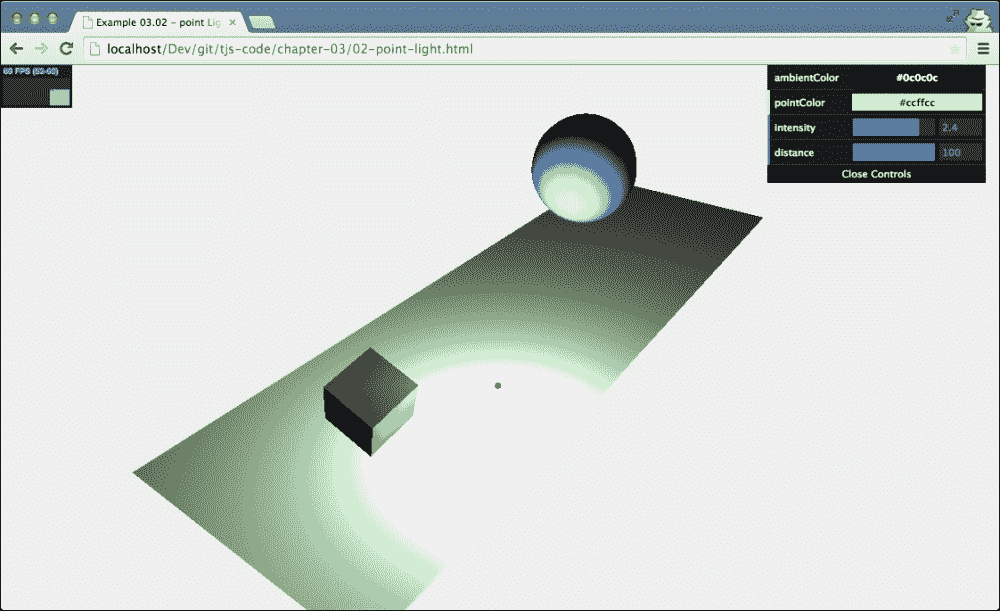
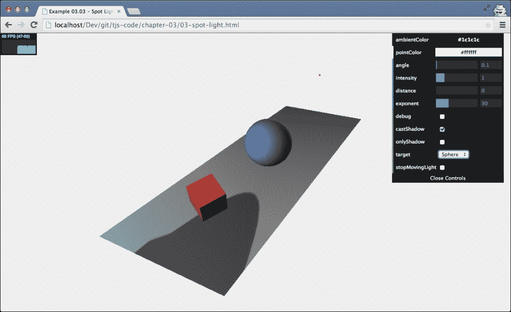
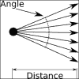
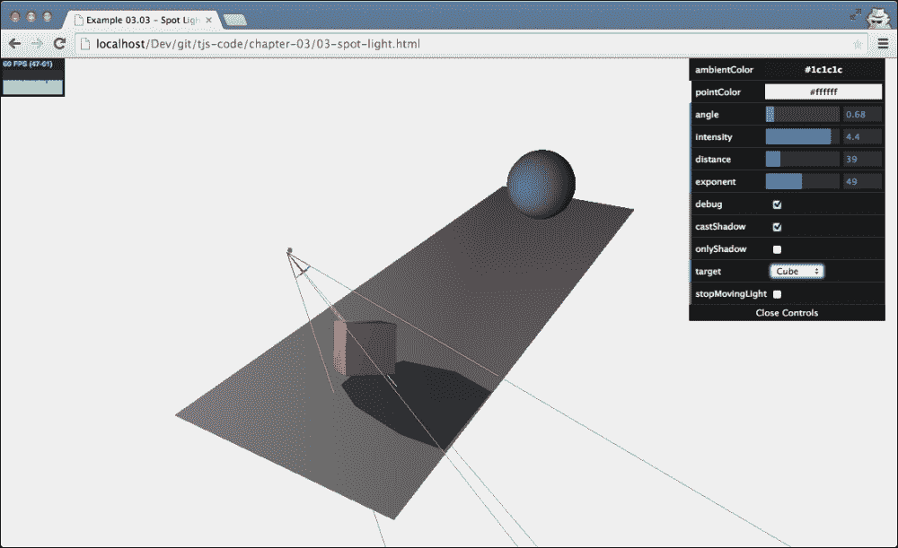
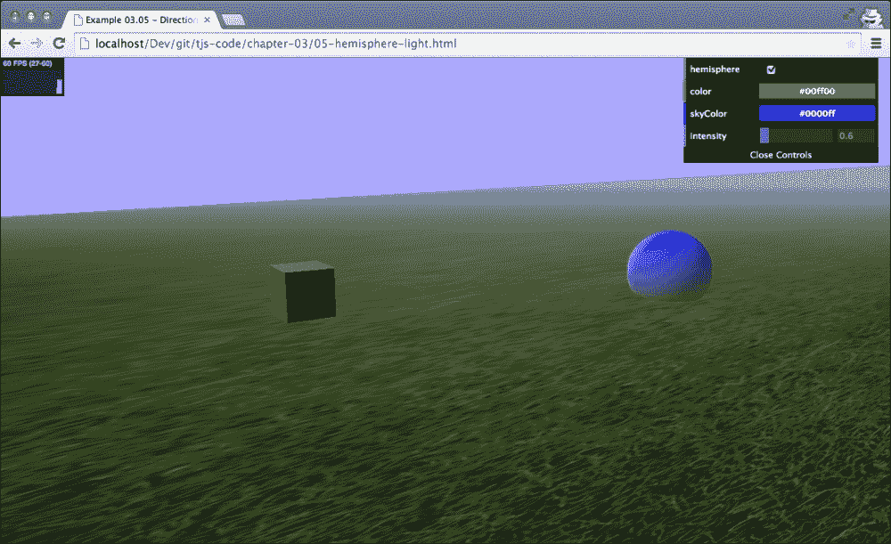
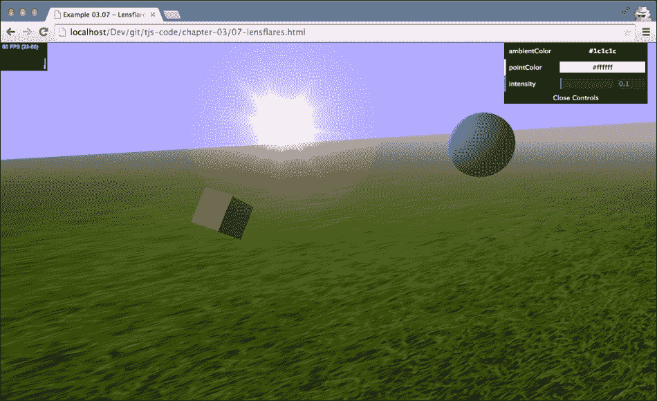

# 第三章：使用 Three.js 中可用的不同光源

在第一章中，您学习了 Three.js 的基础知识，在上一章中，我们更深入地了解了场景中最重要的部分：几何体、网格和相机。您可能已经注意到，在那一章中我们跳过了灯光，尽管它们构成了每个 Three.js 场景的重要部分。没有灯光，我们将看不到任何渲染。由于 Three.js 包含大量的灯光，每种灯光都有特定的用途，我们将用整个章节来解释灯光的各种细节，并为下一章关于材质使用做好准备。

### 注

WebGL 本身并不直接支持照明。如果没有 Three.js，您将不得不编写特定的 WebGL 着色器程序来模拟这些类型的灯光。您可以在[`developer.mozilla.org/en-US/docs/Web/WebGL/Lighting_in_WebGL`](https://developer.mozilla.org/en-US/docs/Web/WebGL/Lighting_in_WebGL)找到有关在 WebGL 中模拟照明的良好介绍。

在这一章中，您将学习以下主题：

+   在 Three.js 中可用的光源

+   何时应该使用特定的光源

+   您如何调整和配置所有这些光源的行为

+   作为奖励，我们还将快速看一下如何创建镜头眩光

与所有章节一样，我们有很多示例供您用来实验灯光的行为。本章中展示的示例可以在提供的源代码的`chapter-03`文件夹中找到。

# Three.js 提供的不同类型的照明

Three.js 中有许多不同的灯光可用，它们都具有特定的行为和用途。在这一章中，我们将讨论以下一组灯光：

| 名称 | 描述 |
| --- | --- |
| `THREE.AmbientLight` | 这是一种基本的光，其颜色被添加到场景中对象的当前颜色中。 |
| `THREE.PointLight` | 这是空间中的一个单点，光从这个点向所有方向扩散。这种光不能用来创建阴影。 |
| `THREE.SpotLight` | 这种光源具有类似台灯、天花板上的聚光灯或火炬的锥形效果。这种光可以投射阴影。 |
| `THREE.DirectionalLight` | 这也被称为无限光。这种光的光线可以被视为平行的，就像太阳的光一样。这种光也可以用来创建阴影。 |
| `THREE.HemisphereLight` | 这是一种特殊的光，可以用来通过模拟反射表面和微弱照亮的天空来创建更自然的室外照明。这种光也不提供任何与阴影相关的功能。 |
| `THREE.AreaLight` | 使用这种光源，您可以指定一个区域，而不是空间中的单个点，从这个区域发出光。`THREE.AreaLight`不会投射任何阴影。 |
| `THREE.LensFlare` | 这不是一个光源，但使用`THREE.LensFlare`，您可以为场景中的灯光添加镜头眩光效果。 |

这一章分为两个主要部分。首先，我们将看一下基本的灯光：`THREE.AmbientLight`、`THREE.PointLight`、`THREE.SpotLight`和`THREE.DirectionalLight`。所有这些灯光都扩展了基本的`THREE.Light`对象，提供了共享功能。这里提到的灯光都是简单的灯光，需要很少的设置，并且可以用来重新创建大部分所需的照明场景。在第二部分中，我们将看一下一些特殊用途的灯光和效果：`THREE.HemisphereLight`、`THREE.AreaLight`和`THREE.LensFlare`。您可能只在非常特殊的情况下需要这些灯光。

# 基本灯光

我们将从最基本的灯光开始：`THREE.AmbientLight`。

## THREE.AmbientLight

当你创建`THREE.AmbientLight`时，颜色是全局应用的。这种光没有特定的方向，`THREE.AmbientLight`不会对任何阴影产生影响。你通常不会将`THREE.AmbientLight`作为场景中唯一的光源，因为它会使所有的物体都呈现相同的颜色，而不考虑形状。你会将它与其他光源一起使用，比如`THREE.SpotLight`或`THREE.DirectionalLight`，来软化阴影或为场景增加一些额外的颜色。最容易理解的方法是查看`chapter-03`文件夹中的`01-ambient-light.html`示例。通过这个示例，你可以得到一个简单的用户界面，用于修改这个场景中可用的`THREE.AmbientLight`。请注意，在这个场景中，我们还有`THREE.SpotLight`，它提供了额外的照明并产生阴影。

在下面的截图中，你可以看到我们使用了第一章的场景，并使`THREE.AmbientLight`的颜色可配置。在这个示例中，你还可以关闭聚光灯，看看`THREE.AmbientLight`单独的效果：


我们在这个场景中使用的标准颜色是`#0c0c0c`。这是颜色的十六进制表示。前两个值指定颜色的红色部分，接下来的两个值指定绿色部分，最后两个值指定蓝色部分。

在这个示例中，我们使用了一个非常昏暗的浅灰色，主要用于使我们的网格投射到地面平面上的硬阴影变得柔和。你可以通过右上角的菜单将颜色更改为更显眼的黄/橙色（`#523318`），然后物体将在上面产生太阳般的光芒。这在下面的截图中显示：


正如前面的图片所示，黄/橙色应用到了所有的物体，并在整个场景上投射出绿色的光晕。在使用这种光时，你应该记住的是，你应该非常谨慎地选择颜色。如果你选择的颜色太亮，你很快就会得到一个完全过饱和的图像。

现在我们已经看到它的作用，让我们看看如何创建和使用`THREE.AmbientLight`。接下来的几行代码向你展示了如何创建`THREE.AmbientLight`，并展示了如何将其连接到 GUI 控制菜单，我们将在第十一章中介绍，*自定义着色器和渲染后处理*：

```js
var ambiColor = "#0c0c0c";
var ambientLight = new THREE.AmbientLight(ambiColor);
scene.add(ambientLight);
...

var controls = new function() {
  this.ambientColor = ambiColor  ;
}

var gui = new dat.GUI();
gui.addColor(controls, 'ambientColor').onChange(function(e) {
  ambientLight.color = new THREE.Color(e);
});
```

创建`THREE.AmbientLight`非常简单，只需要几个步骤。`THREE.AmbientLight`没有位置，是全局应用的，所以我们只需要指定颜色（十六进制），`new THREE.AmbientLight(ambiColor)`，并将这个光添加到场景中，`scene.add(ambientLight)`。在示例中，我们将`THREE.AmbientLight`的颜色绑定到控制菜单。要做到这一点，可以使用我们在前两章中使用的相同类型的配置。唯一的变化是，我们使用`gui.addColor(...)`函数，而不是使用`gui.add(...)`函数。这在控制菜单中创建一个选项，我们可以直接改变传入变量的颜色。在代码中，你可以看到我们使用了 dat.GUI 的`onChange`特性：`gui.addColor(...).onChange(function(e){...})`。通过这个函数，我们告诉`dat.GUI`每次颜色改变时调用传入的函数。在这种特定情况下，我们将`THREE.AmbientLight`的颜色设置为一个新值。

### 使用 THREE.Color 对象

在我们继续下一个光源之前，这里有一个关于使用`THREE.Color`对象的快速说明。在 Three.js 中，当您构造一个对象时，通常可以将颜色指定为十六进制字符串(`"#0c0c0c"`)或十六进制值(`0x0c0c0c`)，这是首选的方法，或者通过指定 0 到 1 的范围上的单独的 RGB 值(`0.3`，`0.5`，`0.6`)。如果您想在构造后更改颜色，您将不得不创建一个新的`THREE.Color`对象或修改当前`THREE.Color`对象的内部属性。`THREE.Color`对象具有以下函数来设置和获取有关当前对象的信息：

| 名称 | 描述 |
| --- | --- |
| `set(value)` | 将此颜色的值设置为提供的十六进制值。此十六进制值可以是字符串、数字或现有的`THREE.Color`实例。 |
| `setHex(value)` | 将此颜色的值设置为提供的数值十六进制值。 |
| `setRGB(r,g,b)` | 根据提供的 RGB 值设置此颜色的值。值的范围从 0 到 1。 |
| `setHSL(h,s,l)` | 根据提供的 HSL 值设置此颜色的值。值的范围从 0 到 1。有关如何使用 HSL 配置颜色的良好解释可以在[`en.wikibooks.org/wiki/Color_Models:_RGB,_HSV,_HSL`](http://en.wikibooks.org/wiki/Color_Models:_RGB,_HSV,_HSL)找到。 |
| `setStyle(style)` | 根据指定颜色的 CSS 方式设置此颜色的值。例如，您可以使用`"rgb(255,0,0)"`，`"#ff0000"`，`"#f00"`，甚至`"red"`。 |
| `copy(color)` | 将提供的`THREE.Color`实例的颜色值复制到此颜色。 |
| `copyGammaToLinear(color)` | 这主要是在内部使用。根据提供的`THREE.Color`实例设置此对象的颜色。首先将颜色从伽马颜色空间转换为线性颜色空间。伽马颜色空间也使用 RGB 值，但使用的是指数比例而不是线性比例。 |
| `copyLinearToGamma(color)` | 这主要是在内部使用。根据提供的`THREE.Color`实例设置此对象的颜色。首先将颜色从线性颜色空间转换为伽马颜色空间。 |
| `convertGammaToLinear()` | 将当前颜色从伽马颜色空间转换为线性颜色空间。 |
| `convertLinearToGamma()` | 将当前颜色从线性颜色空间转换为伽马颜色空间。 |
| `getHex()` | 以数字形式返回此颜色对象的值：`435241`。 |
| `getHexString()` | 以十六进制字符串形式返回此颜色对象的值：`"0c0c0c"`。 |
| `getStyle()` | 以基于 CSS 的值返回此颜色对象的值：`"rgb(112,0,0)"`。 |
| `getHSL(optionalTarget)` | 以 HSL 值的形式返回此颜色对象的值。如果提供`optionalTarget`对象，Three.js 将在该对象上设置`h`、`s`和`l`属性。 |
| `offsetHSL(h, s, l)` | 将提供的`h`、`s`和`l`值添加到当前颜色的`h`、`s`和`l`值中。 |
| `add(color)` | 将提供的颜色的`r`、`g`和`b`值添加到当前颜色。 |
| `addColors(color1, color2)` | 这主要是在内部使用。添加`color1`和`color2`，并将当前颜色的值设置为结果。 |
| `addScalar(s)` | 这主要是在内部使用。将一个值添加到当前颜色的 RGB 分量中。请记住，内部值使用 0 到 1 的范围。 |
| `multiply(color)` | 这主要是在内部使用。将当前 RGB 值与`THREE.Color`的 RGB 值相乘。 |
| `multiplyScalar(s)` | 这主要是在内部使用。将当前 RGB 值与提供的值相乘。请记住，内部值使用 0 到 1 的范围。 |
| `lerp(color, alpha)` | 这主要是在内部使用。找到介于此对象颜色和提供的颜色之间的颜色。alpha 属性定义了你希望结果在当前颜色和提供的颜色之间的距离。 |
| `equals(color)` | 如果提供的`THREE.Color`实例的 RGB 值与当前颜色的值匹配，则返回`true`。 |
| `fromArray(array)` | 这与`setRGB`具有相同的功能，但现在 RGB 值可以作为数字数组提供。 |
| `toArray` | 这将返回一个包含三个元素的数组，`[r, g, b]`。 |
| `clone()` | 这将创建这种颜色的精确副本。 |

在这个表中，你可以看到有很多种方法可以改变当前的颜色。很多这些函数在 Three.js 内部被使用，但它们也提供了一个很好的方式来轻松改变光和材质的颜色。

在我们继续讨论`THREE.PointLight`，`THREE.SpotLight`和`THREE.DirectionalLight`之前，让我们首先强调它们的主要区别，即它们如何发光。以下图表显示了这三种光源是如何发光的：


你可以从这个图表中看到以下内容：

+   `THREE.PointLight`从一个特定点向所有方向发光

+   `THREE.SpotLight`从一个特定点发射出锥形的光

+   `THREE.DirectionalLight`不是从单一点发光，而是从一个二维平面发射光线，光线是平行的

我们将在接下来的几段中更详细地看这些光源；让我们从`THREE.Pointlight`开始。

## THREE.PointLight

在 Three.js 中，`THREE.PointLight`是一个从单一点发出的照射所有方向的光源。一个很好的例子是夜空中发射的信号弹。就像所有的光源一样，我们有一个具体的例子可以用来玩`THREE.PointLight`。如果你在`chapter-03`文件夹中查看`02-point-light.html`，你可以找到一个例子，其中`THREE.PointLight`在一个简单的 Three.js 场景中移动。以下截图显示了这个例子：


在这个例子中，`THREE.PointLight`在我们已经在第一章中看到的场景中移动，*使用 Three.js 创建你的第一个 3D 场景*。为了更清楚地看到`THREE.PointLight`在哪里，我们沿着相同的路径移动一个小橙色的球体。当这个光源移动时，你会看到红色的立方体和蓝色的球体在不同的侧面被这个光源照亮。

### 提示

你可能会注意到在这个例子中我们没有看到任何阴影。在 Three.js 中，`THREE.PointLight`不会投射阴影。由于`THREE.PointLight`向所有方向发光，计算阴影对于 GPU 来说是一个非常繁重的过程。

与我们之前看到的`THREE.AmbientLight`不同，你只需要提供`THREE.Color`并将光源添加到场景中。然而，对于`THREE.PointLight`，我们有一些额外的配置选项：

| 属性 | 描述 |
| --- | --- |
| `color` | 这是光的颜色。 |
| `distance` | 这是光照射的距离。默认值为`0`，这意味着光的强度不会根据距离而减少。 |
| `intensity` | 这是光的强度。默认值为`1`。 |
| `position` | 这是`THREE.Scene`中光的位置。 |
| `visible` | 如果将此属性设置为`true`（默认值），则此光源将打开，如果设置为`false`，则光源将关闭。 |

在接下来的几个例子和截图中，我们将解释这些属性。首先，让我们看看如何创建`THREE.PointLight`：

```js
var pointColor = "#ccffcc";
var pointLight = new THREE.PointLight(pointColor);
pointLight.position.set(10,10,10);
scene.add(pointLight);
```

我们创建了一个具有特定`color`属性的光（这里我们使用了一个字符串值；我们也可以使用一个数字或`THREE.Color`），设置了它的`position`属性，并将其添加到场景中。

我们首先要看的属性是 `intensity`。通过这个属性，你可以设置光的亮度。如果你将其设置为 `0`，你将看不到任何东西；将其设置为 `1`，你将得到默认的亮度；将其设置为 `2`，你将得到两倍亮度的光；依此类推。例如，在下面的截图中，我们将光的强度设置为 `2.4`：



要改变光的强度，你只需要使用 `THREE.PointLight` 的 `intensity` 属性，如下所示：

```js
pointLight.intensity = 2.4;
```

或者你可以使用 dat.GUI 监听器，像这样：

```js
var controls = new function() {
  this.intensity = 1;
}
var gui = new dat.GUI();
  gui.add(controls, 'intensity', 0, 3).onChange(function (e) {
    pointLight.intensity = e;
  });
```

`PointLight` 的 `distance` 属性非常有趣，最好通过一个例子来解释。在下面的截图中，你会看到同样的场景，但这次是一个非常高的 `intensity` 属性（我们有一个非常明亮的光），但是有一个很小的 `distance`：


`SpotLight` 的 `distance` 属性确定了光从光源传播到其强度属性为 0 的距离。你可以像这样设置这个属性：`pointLight.distance = 14`。在前面的截图中，光的亮度在距离为 `14` 时慢慢减弱到 `0`。这就是为什么在例子中，你仍然可以看到一个明亮的立方体，但光无法到达蓝色的球体。`distance` 属性的默认值是 `0`，这意味着光不会随着距离的增加而减弱。

## THREE.SpotLight

`THREE.SpotLight` 是你经常会使用的灯光之一（特别是如果你想要使用阴影）。`THREE.SpotLight` 是一个具有锥形效果的光源。你可以把它比作手电筒或灯笼。这种光源有一个方向和一个产生光的角度。以下表格列出了适用于 `THREE.SpotLight` 的所有属性：

| 属性 | 描述 |
| --- | --- |
| `angle` | 这决定了从这个光源发出的光束有多宽。这是用弧度来衡量的，默认值为 `Math.PI/3`。 |
| `castShadow` | 如果设置为 `true`，这个光将投射阴影。 |
| `color` | 这是光的颜色。 |
| `distance` | 这是光照的距离。默认值为 `0`，这意味着光的强度不会根据距离而减弱。 |
| `exponent` | 对于 `THREE.SpotLight`，从光源越远，发出的光的强度就会减弱。`exponent` 属性确定了这种强度减弱的速度。值越低，从这个光源发出的光就会到达更远的物体，而值越高，它只会到达非常接近 `THREE.SpotLight` 的物体。 |
| `intensity` | 这是光的强度。默认值为 1。 |
| `onlyShadow` | 如果将此属性设置为 `true`，这个光将只投射阴影，不会为场景增加任何光。 |
| `position` | 这是光在 `THREE.Scene` 中的位置。 |
| `shadowBias` | 阴影偏移将投射的阴影远离或靠近投射阴影的物体。你可以使用这个来解决一些在处理非常薄的物体时出现的奇怪效果（一个很好的例子可以在 [`www.3dbuzz.com/training/view/unity-fundamentals/lights/8-shadows-bias`](http://www.3dbuzz.com/training/view/unity-fundamentals/lights/8-shadows-bias) 找到）。如果你看到奇怪的阴影效果，这个属性的小值（例如 `0.01`）通常可以解决问题。这个属性的默认值是 `0`。 |
| `shadowCameraFar` | 这确定了从光源创建阴影的距离。默认值为 `5,000`。 |
| `shadowCameraFov` | 这确定了用于创建阴影的视场有多大（参见第二章中的 *不同用途的不同相机* 部分，*三.js 场景的基本组件*）。默认值为 `50`。 |
| `shadowCameraNear` | 这决定了从光源到阴影应该创建的距离。默认值为`50`。 |
| `shadowCameraVisible` | 如果设置为`true`，您可以看到这个光源是如何投射阴影的（请参见下一节的示例）。默认值为`false`。 |
| `shadowDarkness` | 这定义了阴影的深度。这在场景渲染后无法更改。默认值为`0.5`。 |
| `shadowMapWidth`和`shadowMapHeight` | 这决定了用多少像素来创建阴影。当阴影边缘有锯齿状或看起来不平滑时，增加这个值。这在场景渲染后无法更改。两者的默认值都是`512`。 |
| `target` | 对于`THREE.SpotLight`，它指向的方向很重要。使用`target`属性，您可以指定`THREE.SpotLight`瞄准场景中的特定对象或位置。请注意，此属性需要一个`THREE.Object3D`对象（如`THREE.Mesh`）。这与我们在上一章中看到的相机不同，相机在其`lookAt`函数中使用`THREE.Vector3`。 |
| `visible` | 如果设置为`true`（默认值），则此光源打开，如果设置为`false`，则关闭。 |

创建`THREE.SpotLight`非常简单。只需指定颜色，设置您想要的属性，并将其添加到场景中，如下所示：

```js
var pointColor = "#ffffff";
var spotLight = new THREE.SpotLight(pointColor);
spotLight.position.set(-40, 60, -10);
spotLight.castShadow = true;
spotLight.target = plane;
scene.add(spotLight);
```

`THREE.SpotLight`与`THREE.PointLight`并没有太大的区别。唯一的区别是我们将`castShadow`属性设置为`true`，因为我们想要阴影，并且我们需要为这个`SpotLight`设置`target`属性。`target`属性确定了光的瞄准位置。在这种情况下，我们将其指向了名为`plane`的对象。当您运行示例（`03-spot-light.html`）时，您将看到如下截图所示的场景：



在这个示例中，您可以设置一些特定于`THREE.SpotLight`的属性。其中之一是`target`属性。如果我们将此属性设置为蓝色的球体，光将聚焦在球体的中心，即使它在场景中移动。当我们创建光时，我们将其瞄准地面平面，在我们的示例中，我们也可以将其瞄准其他两个对象。但是，如果您不想将光瞄准到特定对象，而是瞄准到空间中的任意点，您可以通过创建一个`THREE.Object3D()`对象来实现：

```js
var target = new THREE.Object3D();
target.position = new THREE.Vector3(5, 0, 0);
```

然后，设置`THREE.SpotLight`的`target`属性：

```js
spotlight.target = target
```

在本节开始时的表格中，我们展示了一些可以用来控制`THREE.SpotLight`发出光线的属性。`distance`和`angle`属性定义了光锥的形状。`angle`属性定义了光锥的宽度，而`distance`属性则设置了光锥的长度。下图解释了这两个值如何共同定义将从`THREE.SpotLight`接收光线的区域。



通常情况下，您不需要设置这些值，因为它们已经有合理的默认值，但是您可以使用这些属性，例如，创建一个具有非常窄的光束或快速减少光强度的`THREE.SpotLight`。您可以使用最后一个属性来改变`THREE.SpotLight`产生光线的方式，即`exponent`属性。使用这个属性，您可以设置光强度从光锥的中心向边缘迅速减少的速度。在下面的图像中，您可以看到`exponent`属性的效果。我们有一个非常明亮的光（高`intensity`），随着它从中心向锥体的边缘移动，光强度迅速减弱（高`exponent`）：


您可以使用此功能来突出显示特定对象或模拟小手电筒。我们还可以使用小的`exponent`值和`angle`创建相同的聚焦光束效果。在对这种第二种方法进行谨慎说明时，请记住，非常小的角度可能会很快导致各种渲染伪影（伪影是图形中用于不需要的失真和奇怪渲染部分的术语）。

在继续下一个光源之前，我们将快速查看`THREE.SpotLight`可用的与阴影相关的属性。您已经学会了通过将`THREE.SpotLight`的`castShadow`属性设置为`true`来获得阴影（当然，还要确保我们为应该投射阴影的对象设置`castShadow`属性，并且在我们场景中的`THREE.Mesh`对象上设置`receiveShadow`属性，以显示阴影）。Three.js 还允许您对阴影的渲染进行非常精细的控制。这是通过我们在本节开头的表中解释的一些属性完成的。通过`shadowCameraNear`、`shadowCameraFar`和`shadowCameraFov`，您可以控制这种光如何在何处投射阴影。这与我们在前一章中解释的透视相机的视野工作方式相同。查看此操作的最简单方法是将`shadowCameraVisible`设置为`true`；您可以通过选中菜单中的调试复选框来执行此操作。如下截图所示，这显示了用于确定此光的阴影的区域：



在结束本节之前，我将给出一些建议，以防您在阴影方面遇到问题：

+   启用`shadowCameraVisible`属性。这显示了受此光影响的阴影区域。

+   如果阴影看起来很块状，您可以增加`shadowMapWidth`和`shadowMapHeight`属性，或者确保用于计算阴影的区域紧密包裹您的对象。您可以使用`shadowCameraNear`、`shadowCameraFar`和`shadowCameraFov`属性来配置此区域。

+   请记住，您不仅需要告诉光源投射阴影，还需要通过设置`castShadow`和`receiveShadow`属性告诉每个几何体是否会接收和/或投射阴影。

+   如果您在场景中使用薄物体，渲染阴影时可能会出现奇怪的伪影。您可以使用`shadowBias`属性轻微偏移阴影，这通常可以解决这类问题。

+   您可以通过设置`shadowDarkness`属性来改变阴影的深浅。如果您的阴影太暗或不够暗，更改此属性可以让您微调阴影的渲染方式。

+   如果您想要更柔和的阴影，可以在`THREE.WebGLRenderer`上设置不同的`shadowMapType`值。默认情况下，此属性设置为`THREE.PCFShadowMap`；如果将此属性设置为`PCFSoftShadowMap`，则可以获得更柔和的阴影。

## THREE.DirectionalLight

`THREE.DirectionalLight`是我们将要看的基本灯光中的最后一个。这种类型的光可以被认为是非常遥远的光。它发出的所有光线都是平行的。一个很好的例子是太阳。太阳离我们如此遥远，以至于我们在地球上接收到的光线（几乎）是平行的。`THREE.DirectionalLight`和我们在上一节中看到的`THREE.SpotLight`之间的主要区别是，这种光不会像`THREE.SpotLight`那样随着距离`THREE.DirectionalLight`的目标越来越远而减弱（您可以使用`distance`和`exponent`参数来微调这一点）。`THREE.DirectionalLight`照亮的完整区域接收到相同强度的光。

要查看此操作，请查看此处显示的`04-directional-light`示例：


正如你在上面的图像中所看到的，没有一个光锥应用到了场景中。一切都接收到了相同数量的光。只有光的方向、颜色和强度被用来计算颜色和阴影。

就像`THREE.SpotLight`一样，你可以设置一些控制光强度和投射阴影方式的属性。`THREE.DirectionalLight`有很多与`THREE.SpotLight`相同的属性：`position`、`target`、`intensity`、`distance`、`castShadow`、`onlyShadow`、`shadowCameraNear`、`shadowCameraFar`、`shadowDarkness`、`shadowCameraVisible`、`shadowMapWidth`、`shadowMapHeight`和`shadowBias`。关于这些属性的信息，你可以查看前面关于`THREE.SpotLight`的部分。接下来的几段将讨论一些额外的属性。

如果你回顾一下`THREE.SpotLight`的例子，你会发现我们必须定义光锥，阴影应用的范围。因为对于`THREE.DirectionalLight`，所有的光线都是平行的，我们没有光锥，而是一个长方体区域，就像你在下面的截图中看到的一样（如果你想亲自看到这个，请将摄像机远离场景）：


落入这个立方体范围内的一切都可以从光中投射和接收阴影。就像对于`THREE.SpotLight`一样，你定义这个范围越紧密，你的阴影看起来就越好。使用以下属性定义这个立方体：

```js
directionalLight.shadowCameraNear = 2;
directionalLight.shadowCameraFar = 200;
directionalLight.shadowCameraLeft = -50;
directionalLight.shadowCameraRight = 50;
directionalLight.shadowCameraTop = 50;
directionalLight.shadowCameraBottom = -50;
```

你可以将这与我们在第二章中关于摄像机的部分中配置正交相机的方式进行比较。

### 注意

有一个`THREE.DirectionalLight`可用的属性我们还没有讨论：`shadowCascade`。当你想在`THREE.DirectionalLight`上使用阴影时，这个属性可以用来创建更好的阴影。如果你将属性设置为`true`，Three.js 将使用另一种方法来生成阴影。它将阴影生成分割到由`shadowCascadeCount`指定的值。这将导致在相机视点附近更详细的阴影，而在远处更少详细的阴影。要使用这个功能，你需要尝试不同的设置，如`shadowCascadeCount`、`shadowCascadeBias`、`shadowCascadeWidth`、`shadowCascadeHeight`、`shadowCascadeNearZ`和`shadowCascadeFarZ`。你可以在[`alteredqualia.com/three/examples/webgl_road.html`](http://alteredqualia.com/three/examples/webgl_road.html)找到一个使用了这种设置的示例。

# 特殊灯光

在这个特殊灯光的部分，我们将讨论 Three.js 提供的另外两种灯光。首先，我们将讨论`THREE.HemisphereLight`，它有助于为室外场景创建更自然的光照，然后我们将看看`THREE.AreaLight`，它从一个大区域发出光，而不是从一个单一点发出光，最后，我们将向您展示如何在场景中添加镜头眩光效果。

## THREE.HemisphereLight

我们要看的第一个特殊灯光是`THREE.HemisphereLight`。使用`THREE.HemisphereLight`，我们可以创建更自然的室外光照。没有这种光，我们可以通过创建`THREE.DirectionalLight`来模拟室外，它模拟太阳，也许添加额外的`THREE.AmbientLight`来为场景提供一些一般的颜色。然而，这看起来并不真实。当你在室外时，不是所有的光都直接来自上方：大部分是被大气层散射和地面以及其他物体反射的。Three.js 中的`THREE.HemisphereLight`就是为这种情况而创建的。这是一个更自然的室外光照的简单方法。要查看一个示例，请看`05-hemisphere-light.html`：



### 注意

请注意，这是第一个加载额外资源的示例，无法直接从本地文件系统运行。因此，如果您还没有这样做，请查看第一章，“使用 Three.js 创建您的第一个 3D 场景”，了解如何设置本地 Web 服务器或禁用浏览器中的安全设置以使加载外部资源正常工作。

在此示例中，您可以打开和关闭`THREE.HemisphereLight`并设置颜色和强度。创建半球光与创建任何其他光一样简单：

```js
var hemiLight = new THREE.HemisphereLight(0x0000ff, 0x00ff00, 0.6);
hemiLight.position.set(0, 500, 0);
scene.add(hemiLight);
```

您只需指定从天空接收到的颜色、从地面接收到的颜色以及这些光的强度。如果以后想要更改这些值，可以通过以下属性访问它们：

| 属性 | 描述 |
| --- | --- |
| `groundColor` | 这是从地面发出的颜色 |
| `color` | 这是从天空发出的颜色 |
| `intensity` | 这是光线照射的强度 |

## THREE.AreaLight

我们将要看的最后一个真实光源是`THREE.AreaLight`。使用`THREE.AreaLight`，我们可以定义一个发光的矩形区域。`THREE.AreaLight`不包含在标准的 Three.js 库中，而是在其扩展中，因此在使用此光源之前，我们必须采取一些额外的步骤。在查看细节之前，让我们先看一下我们的目标结果（`06-area-light.html`打开此示例）；以下屏幕截图概括了我们想要看到的结果：


在此屏幕截图中，我们定义了三个`THREE.AreaLight`对象，每个对象都有自己的颜色。您还可以看到这些灯如何影响整个区域。

当我们想要使用`THREE.AreaLight`时，不能使用我们之前示例中使用的`THREE.WebGLRenderer`。原因是`THREE.AreaLight`是一个非常复杂的光源，会导致普通的`THREE.WebGLRenderer`对象严重影响性能。它在渲染场景时使用了不同的方法（将其分解为多个步骤），并且可以比标准的`THREE.WebGLRenderer`对象更好地处理复杂的光（或者说非常多的光源）。

要使用`THREE.WebGLDeferredRenderer`，我们必须包含 Three.js 提供的一些额外的 JavaScript 源。在 HTML 骨架的头部，确保您定义了以下一组`<script>`源：

```js
<head>
  <script type="text/javascript" src="../libs/three.js"></script>
  <script type="text/javascript" src="../libs/stats.js"></script>
  <script type="text/javascript" src="../libs/dat.gui.js"></script>

  <script type="text/javascript" src="../libs/WebGLDeferredRenderer.js"></script>
  <script type="text/javascript" src="../libs/ShaderDeferred.js"></script>
  <script type="text/javascript" src="../libs/RenderPass.js"></script>
  <script type="text/javascript" src="../libs/EffectComposer.js"></script>
  <script type="text/javascript" src="../libs/CopyShader.js"></script>
  <script type="text/javascript" src="../libs/ShaderPass.js"></script>
  <script type="text/javascript" src="../libs/FXAAShader.js"></script>
  <script type="text/javascript" src="../libs/MaskPass.js"></script>
</head>
```

包括这些库后，我们可以使用`THREE.WebGLDeferredRenderer`。我们可以以与我们在其他示例中讨论的方式使用此渲染器。只需要一些额外的参数：

```js
var renderer = new THREE.WebGLDeferredRenderer({width: window.innerWidth,height: window.innerHeight,scale: 1, antialias: true,tonemapping: THREE.FilmicOperator, brightness: 2.5 });
```

目前不要太担心这些属性的含义。在第十章，“加载和使用纹理”中，我们将深入探讨`THREE.WebGLDeferredRenderer`并向您解释它们。有了正确的 JavaScript 库和不同的渲染器，我们就可以开始添加`Three.AreaLight`。

我们几乎以与所有其他光源相同的方式执行此操作：

```js
var areaLight1 = new THREE.AreaLight(0xff0000, 3);
areaLight1.position.set(-10, 10, -35);
areaLight1.rotation.set(-Math.PI / 2, 0, 0);
areaLight1.width = 4;
areaLight1.height = 9.9;
scene.add(areaLight1);
```

在这个例子中，我们创建了一个新的`THREE.AreaLight`。这个光源的颜色值为`0xff0000`，强度值为`3`。和其他光源一样，我们可以使用`position`属性来设置它在场景中的位置。当你创建`THREE.AreaLight`时，它将被创建为一个水平平面。在我们的例子中，我们创建了三个垂直放置的`THREE.AreaLight`对象，所以我们需要围绕它们的*x*轴旋转`-Math.PI/2`。最后，我们使用`width`和`height`属性设置了`THREE.AreaLight`的大小，并将它们添加到了场景中。如果你第一次尝试这样做，你可能会想知道为什么在你放置光源的地方看不到任何东西。这是因为你看不到光源本身，只能看到它发出的光，只有当它接触到物体时才能看到。如果你想重现我在例子中展示的效果，你可以在相同的位置（`areaLight1.position`）添加`THREE.PlaneGeometry`或`THREE.BoxGeometry`来模拟发光的区域，如下所示：

```js
var planeGeometry1 = new THREE.BoxGeometry(4, 10, 0);
var planeGeometry1Mat = new THREE.MeshBasicMaterial({color: 0xff0000})
var plane = new THREE.Mesh(planeGeometry1, planeGeometry1Mat);
plane.position = areaLight1.position;
scene.add(plane);
```

你可以使用`THREE.AreaLight`创建非常漂亮的效果，但可能需要进行一些实验来获得期望的效果。如果你从右上角拉下控制面板，你可以调整三个灯的颜色和强度，立即看到效果，如下所示：


## 镜头耀斑

本章最后要探讨的主题是**镜头耀斑**。你可能已经熟悉镜头耀斑了。例如，当你直接对着太阳或其他强光拍照时，它们会出现。在大多数情况下，你可能会想避免这种情况，但对于游戏和 3D 生成的图像来说，它提供了一个很好的效果，使场景看起来更加真实。

Three.js 也支持镜头耀斑，并且非常容易将它们添加到你的场景中。在最后一节中，我们将向场景添加一个镜头耀斑，并创建输出，你可以通过打开`07-lensflares.html`来看到：


我们可以通过实例化`THREE.LensFlare`对象来创建镜头耀斑。我们需要做的第一件事就是创建这个对象。`THREE.LensFlare`接受以下参数：

```js
flare = new THREE.LensFlare(texture, size, distance, blending, color, opacity);
```

这些参数在下表中有解释：

| 参数 | 描述 |
| --- | --- |
| `texture` | 纹理是决定耀斑形状的图像。 |
| `size` | 我们可以指定耀斑的大小。这是以像素为单位的大小。如果指定为`-1`，则使用纹理本身的大小。 |
| `distance` | 这是从光源（`0`）到相机（`1`）的距离。使用这个来将镜头耀斑定位在正确的位置。 |
| `blending` | 我们可以为耀斑指定多个纹理。混合模式决定了这些纹理如何混合在一起。在`LensFlare`中默认使用的是`THREE.AdditiveBlending`。关于混合的更多内容在下一章中有介绍。 |
| `color` | 这是耀斑的颜色。 |

让我们来看看用于创建这个对象的代码（参见`07-lensflares.html`）：

```js
var textureFlare0 = THREE.ImageUtils.loadTexture
      ("../assets/textures/lensflare/lensflare0.png");

var flareColor = new THREE.Color(0xffaacc);
var lensFlare = new THREE.LensFlare(textureFlare0, 350, 0.0, THREE.AdditiveBlending, flareColor);

lensFlare.position = spotLight.position;
scene.add(lensFlare);
```

我们首先加载一个纹理。在这个例子中，我使用了 Three.js 示例提供的镜头耀斑纹理，如下所示：


如果你将这个图像与本节开头的截图进行比较，你会发现它定义了镜头耀斑的外观。接下来，我们使用`new THREE.Color( 0xffaacc );`来定义镜头耀斑的颜色，这会使镜头耀斑呈现红色的光晕。有了这两个对象，我们就可以创建`THREE.LensFlare`对象。在这个例子中，我们将耀斑的大小设置为`350`，距离设置为`0.0`（直接在光源处）。

在创建了`LensFlare`对象之后，我们将它定位在光源的位置并将其添加到场景中，如下截图所示：



这已经看起来不错，但是如果你把这个与本章开头的图像进行比较，你会注意到我们缺少页面中间的小圆形伪影。我们创建这些伪影的方式与主要的光晕几乎相同，如下所示：

```js
var textureFlare3 = THREE.ImageUtils.loadTexture
      ("../assets/textures/lensflare/lensflare3.png");

lensFlare.add(textureFlare3, 60, 0.6, THREE.AdditiveBlending);
lensFlare.add(textureFlare3, 70, 0.7, THREE.AdditiveBlending);
lensFlare.add(textureFlare3, 120, 0.9, THREE.AdditiveBlending);
lensFlare.add(textureFlare3, 70, 1.0, THREE.AdditiveBlending);
```

不过，这一次我们不创建一个新的`THREE.LensFlare`，而是使用刚刚创建的`LensFlare`提供的`add`函数。在这个方法中，我们需要指定纹理、大小、距离和混合模式，就这样。请注意，`add`函数可以接受两个额外的参数。你还可以将新的眩光的`color`和`opacity`属性设置为`add`。我们用于这些新眩光的纹理是一个非常轻的圆形，如下面的截图所示：


如果你再次观察场景，你会看到伪影出现在你用`distance`参数指定的位置。

# 总结

在本章中，我们涵盖了关于 Three.js 中可用的不同类型的光的大量信息。在本章中，你学到了配置光线、颜色和阴影并不是一门精确的科学。为了得到正确的结果，你应该尝试不同的设置，并使用 dat.GUI 控件来微调你的配置。不同的光有不同的行为方式。`THREE.AmbientLight`颜色被添加到场景中的每一个颜色中，通常用于平滑硬色和阴影。`THREE.PointLight`在所有方向上发光，但不能用于创建阴影。`THREE.SpotLight`是一种类似手电筒的灯光。它呈圆锥形，可以配置为随距离衰减，并且能够投射阴影。我们还看了`THREE.DirectionalLight`。这种光可以与远处的光进行比较，比如太阳，它的光线是平行的，强度不会随着离配置的目标越远而减弱。除了标准的光，我们还看了一些更专业的光。为了获得更自然的室外效果，你可以使用`THREE.HemisphereLight`，它考虑了地面和天空的反射；`THREE.AreaLight`不是从单一点发光，而是从一个大面积发光。我们向你展示了如何使用`THREE.LensFlare`对象添加摄影镜头眩光。

到目前为止的章节中，我们已经介绍了一些不同的材质，而在本章中，你看到并不是所有的材质对可用的光都有相同的反应。在下一章中，我们将概述 Three.js 中可用的材质。
