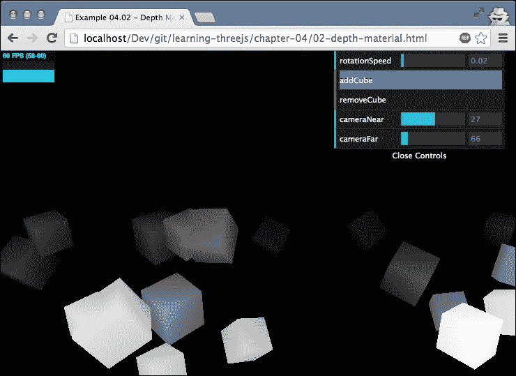
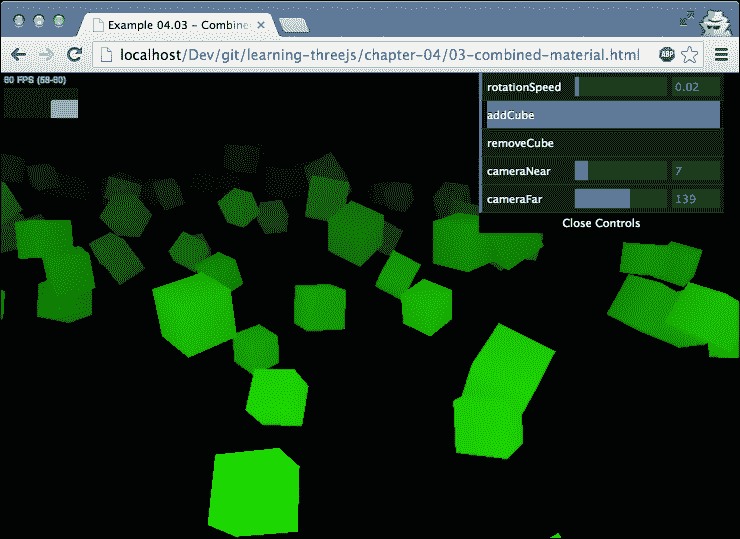
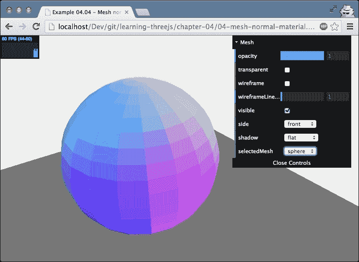
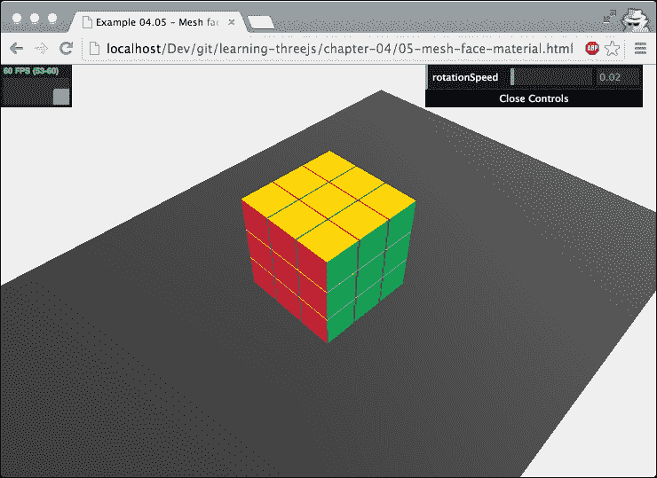
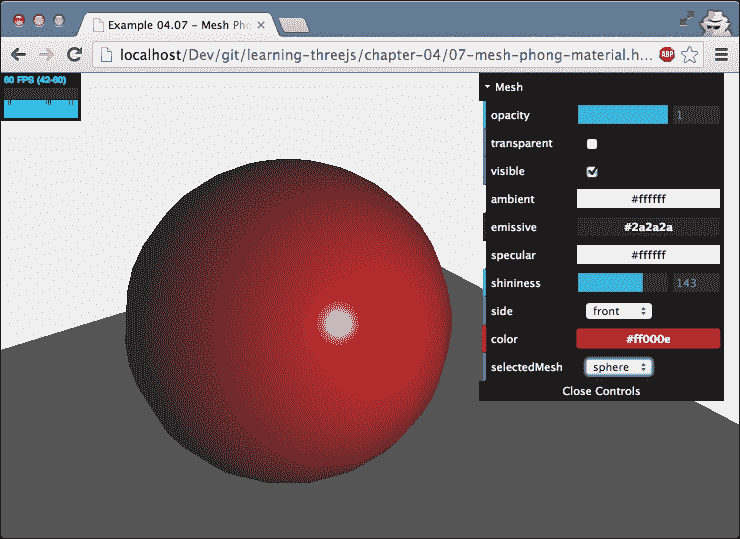
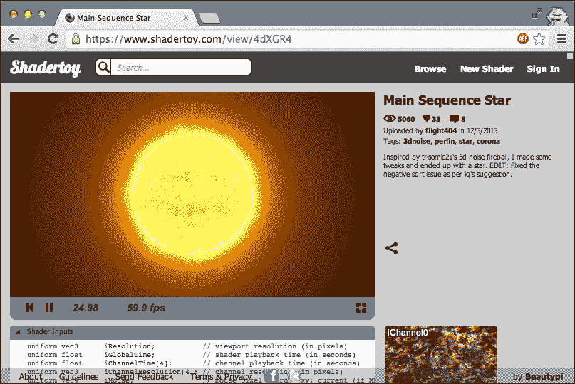
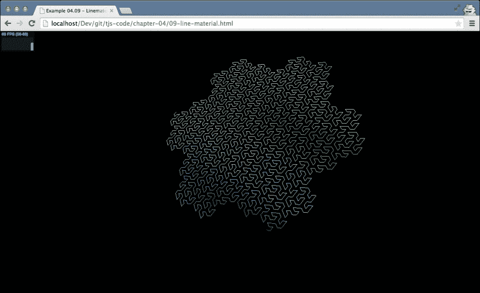

# 第四章：使用 Three.js 材质

在之前的章节中，我们稍微谈到了材质。您已经了解到，材质与`THREE.Geometry`一起形成`THREE.Mesh`。材质就像物体的皮肤，定义了几何体外观的外部。例如，皮肤定义了几何体是金属外观、透明还是显示为线框。然后，生成的`THREE.Mesh`对象可以添加到场景中，由 Three.js 渲染。到目前为止，我们还没有真正详细地研究过材质。在本章中，我们将深入探讨 Three.js 提供的所有材质，并学习如何使用这些材质来创建好看的 3D 物体。我们将在本章中探讨的材质如下表所示：

| 名称 | 描述 |
| --- | --- |
| `MeshBasicMaterial` | 这是一种基本材质，您可以使用它来给您的几何体一个简单的颜色或显示几何体的线框。 |
| `MeshDepthMaterial` | 这是一种使用从相机到网格的距离来确定如何着色的材质。 |
| `MeshNormalMaterial` | 这是一种简单的材质，它基于法向量确定面的颜色。 |
| `MeshFacematerial` | 这是一个容器，允许您为几何体的每个面指定一个独特的材质。 |
| `MeshLambertMaterial` | 这是一种考虑光照的材质，用于创建*暗淡*的非光亮外观的物体。 |
| `MeshPhongMaterial` | 这是一种考虑光照的材质，可用于创建光亮的物体。 |
| `ShaderMaterial` | 这种材质允许您指定自己的着色器程序，直接控制顶点的位置和像素的颜色。 |
| `LineBasicMaterial` | 这是一种可以用在`THREE.Line`几何体上创建彩色线条的材质。 |
| `LineDashMaterial` | 这与`LineBasicMaterial`相同，但这种材质还允许您创建虚线效果。 |

如果您查看 Three.js 的源代码，您可能会遇到`THREE.RawShaderMaterial`。这是一种专门的材质，只能与`THREE.BufferedGeometry`一起使用。这种几何体是一种针对静态几何体进行优化的特殊形式（例如，顶点和面不会改变）。我们不会在本章中探讨这种材质，但在第十一章中，*自定义着色器和渲染后处理*，当我们讨论创建自定义着色器时，我们将使用它。在代码中，您还可以找到`THREE.SpriteCanvasMaterial`，`THREE.SpriteMaterial`和`THREE.PointCloudMaterial`。这些是您在为个别点设置样式时使用的材质。我们不会在本章中讨论这些，但我们将在第七章中探讨它们，*粒子、精灵和点云*。

材质有许多共同的属性，因此在我们查看第一个材质`MeshBasicMaterial`之前，我们将先看一下所有材质共享的属性。

# 理解共同的材质属性

您可以快速看到所有材质之间共享的属性。Three.js 提供了一个材质基类`THREE.Material`，列出了所有共同的属性。我们将这些共同的材质属性分为以下三类：

+   **基本属性**：这些是您经常使用的属性。使用这些属性，您可以控制物体的不透明度，它是否可见，以及如何引用它（通过 ID 或自定义名称）。

+   **混合属性**：每个物体都有一组混合属性。这些属性定义了物体如何与其背景相结合。

+   **高级属性**：有许多高级属性控制着低级的 WebGL 上下文如何渲染物体。在大多数情况下，您不需要去处理这些属性。

请注意，在本章中，我们跳过了与纹理和贴图相关的任何属性。大多数材质允许您使用图像作为纹理（例如，类似木头或石头的纹理）。在第十章中，*加载和使用纹理*，我们将深入探讨各种可用的纹理和映射选项。一些材质还具有与动画相关的特定属性（皮肤和`morphTargets`）；我们也会跳过这些属性。这些将在第九章中进行讨论，*动画和移动摄像机*。

我们从列表中的第一个开始：基本属性。

## 基本属性

`THREE.Material`对象的基本属性列在下表中（您可以在`THREE.BasicMeshMaterial`部分中看到这些属性的实际应用）：

| 属性 | 描述 |
| --- | --- |
| `id` | 用于标识材质的属性，在创建材质时分配。第一个材质从`0`开始，每创建一个额外的材质，增加`1`。 |
| `uuid` | 这是一个唯一生成的 ID，用于内部使用。 |
| `name` | 您可以使用此属性为材质分配一个名称。这可用于调试目的。 |
| `opacity` | 这定义了对象的透明度。与`transparent`属性一起使用。此属性的范围是从`0`到`1`。 |
| `transparent` | 如果将其设置为`true`，Three.js 将以设置的不透明度渲染此对象。如果将其设置为`false`，对象将不透明，只是颜色更浅。如果使用使用 alpha（透明度）通道的纹理，则还应将此属性设置为`true`。 |
| `overdraw` | 当使用`THREE.CanvasRenderer`时，多边形会被渲染得更大一些。当使用此渲染器时看到间隙时，将其设置为`true`。 |
| `visible` | 这定义了此材质是否可见。如果将其设置为`false`，则在场景中看不到对象。 |
| `Side` | 使用此属性，您可以定义材质应用于几何体的哪一侧。默认值为`THREE.Frontside`，将材质应用于对象的前面（外部）。您还可以将其设置为`THREE.BackSide`，将其应用于后面（内部），或`THREE.DoubleSide`，将其应用于两侧。 |
| `needsUpdate` | 对于材质的一些更新，您需要告诉 Three.js 材质已更改。如果此属性设置为`true`，Three.js 将使用新的材质属性更新其缓存。 |

对于每种材质，您还可以设置一些混合属性。

## 混合属性

材质具有一些通用的与混合相关的属性。混合确定我们渲染的颜色如何与它们后面的颜色相互作用。当我们谈论组合材质时，我们会稍微涉及这个主题。混合属性列在下表中：

| 名称 | 描述 |
| --- | --- |
| `blending` | 这决定了此对象上的材质与背景的混合方式。正常模式是`THREE.NormalBlending`，只显示顶层。 |
| `blendsrc` | 除了使用标准混合模式，您还可以通过设置`blendsrc`，`blenddst`和`blendequation`来创建自定义混合模式。此属性定义了对象（源）如何混合到背景（目标）中。默认的`THREE.SrcAlphaFactor`设置使用 alpha（透明度）通道进行混合。 |
| `blenddst` | 此属性定义了背景（目标）在混合中的使用方式，默认为`THREE.OneMinusSrcAlphaFactor`，这意味着此属性也使用源的 alpha 通道进行混合，但使用`1`（源的 alpha 通道）作为值。 |
| `blendequation` | 这定义了如何使用`blendsrc`和`blenddst`值。默认是将它们相加（`AddEquation`）。使用这三个属性，您可以创建自定义混合模式。 |

最后一组属性主要用于内部使用，控制了如何使用 WebGL 来渲染场景的具体细节。

## 高级属性

我们不会详细介绍这些属性。这些与 WebGL 内部工作方式有关。如果您确实想了解有关这些属性的更多信息，OpenGL 规范是一个很好的起点。您可以在[`www.khronos.org/registry/gles/specs/2.0/es_full_spec_2.0.25.pdf`](http://www.khronos.org/registry/gles/specs/2.0/es_full_spec_2.0.25.pdf)找到此规范。以下表格提供了这些高级属性的简要描述：

| 名称 | 描述 |
| --- | --- |
| `depthTest` | 这是一个高级的 WebGL 属性。使用此属性，您可以启用或禁用`GL_DEPTH_TEST`参数。此参数控制是否使用*深度*来确定新像素的值。通常情况下，您不需要更改此设置。有关更多信息，请参阅我们之前提到的 OpenGL 规范。 |
| `depthWrite` | 这是另一个内部属性。此属性可用于确定此材质是否影响 WebGL 深度缓冲区。如果您使用 2D 叠加对象（例如中心），则应将此属性设置为`false`。通常情况下，您不需要更改此属性。 |
| `polygonOffset`，`polygonOffsetFactor`和`polygonOffsetUnits` | 使用这些属性，您可以控制`POLYGON_OFFSET_FILL` WebGL 特性。通常不需要这些。要详细了解它们的作用，可以查看 OpenGL 规范。 |
| `alphatest` | 可以设置为特定值（`0`到`1`）。每当像素的 alpha 值小于此值时，它将不会被绘制。您可以使用此属性来消除一些与透明度相关的伪影。 |

现在，让我们看看所有可用的材质，以便您可以看到这些属性对呈现输出的影响。

# 从一个简单的网格开始

在本节中，我们将看一些简单的材质：`MeshBasicMaterial`，`MeshDepthMaterial`，`MeshNormalMaterial`和`MeshFaceMaterial`。我们从`MeshBasicMaterial`开始。

在我们查看这些材质的属性之前，这里有一个关于如何传递属性以配置材质的快速说明。有两个选项：

+   您可以将参数作为参数对象传递给构造函数，就像这样：

```js
var material = new THREE.MeshBasicMaterial(
{
  color: 0xff0000, name: 'material-1', opacity: 0.5, transparency: true, ...
});
```

+   或者，您还可以创建一个实例并单独设置属性，就像这样：

```js
var material = new THREE.MeshBasicMaterial();
material.color = new THREE.Color(0xff0000);
material.name = 'material-1';
material.opacity = 0.5;
material.transparency = true;
```

通常，最好的方法是在创建材质时知道所有属性的值时使用构造函数。这两种风格使用的参数格式相同。唯一的例外是`color`属性。在第一种风格中，我们可以直接传入十六进制值，Three.js 会自己创建一个`THREE.Color`对象。在第二种风格中，我们必须显式创建一个`THREE.Color`对象。在本书中，我们将使用这两种风格。

## THREE.MeshBasicMaterial

`MeshBasicMaterial`是一个非常简单的材质，不考虑场景中可用的光源。使用此材质的网格将呈现为简单的平面多边形，您还可以选择显示几何的线框。除了我们在此材质的早期部分看到的常见属性之外，我们还可以设置以下属性：

| 名称 | 描述 |
| --- | --- |
| `color` | 此属性允许您设置材质的颜色。 |
| `wireframe` | 这允许您将材质呈现为线框。这对于调试很有用。 |
| `Wireframelinewidth` | 如果启用线框，此属性定义线框的宽度。 |
| `Wireframelinecap` | 此属性定义线框模式下线条端点的外观。可能的值为`butt`，`round`和`square`。默认值为`round`。实际上，更改此属性的结果非常难以看到。此属性不受`WebGLRenderer`支持。 |
| `wireframeLinejoin` | 这定义了线条连接点的可视化方式。可能的值为`round`，`bevel`和`miter`。默认值为`round`。如果您仔细观察，可以在低`opacity`和非常大的`wireframeLinewidth`值的示例中看到这一点。此属性不受`WebGLRenderer`支持。 |
| `Shading` | 这定义了如何应用着色。可能的值为`THREE.SmoothShading`，`THREE.NoShading`和`THREE.FlatShading`。默认值为`THREE.SmoothShading`，这会产生一个平滑的对象，您看不到单独的面。此属性在此材质的示例中未启用。例如，请查看`MeshNormalMaterial`部分。 |
| `vertexColors` | 您可以使用此属性为每个顶点定义单独的颜色。默认值为`THREE.NoColors`。如果将此值设置为`THREE.VertexColors`，渲染器将考虑`THREE.Geometry`的`colors`属性上设置的颜色。此属性在`CanvasRenderer`上不起作用，但在`WebGLRenderer`上起作用。查看`LineBasicMaterial`示例，我们在其中使用此属性为线条的各个部分着色。您还可以使用此属性为此材质类型创建渐变效果。 |
| `fog` | 此属性确定此材质是否受全局雾设置的影响。这在实际中没有显示，但如果将其设置为`false`，我们在第二章中看到的全局雾不会影响对象的渲染方式。 |

在前几章中，我们看到了如何创建材质并将其分配给对象。对于`THREE.MeshBasicMaterial`，我们可以这样做：

```js
var meshMaterial = new THREE.MeshBasicMaterial({color: 0x7777ff});
```

这将创建一个新的`THREE.MeshBasicMaterial`并将`color`属性初始化为`0x7777ff`（紫色）。

我添加了一个示例，您可以使用它来玩转`THREE.MeshBasicMaterial`属性和我们在上一节中讨论的基本属性。如果您在`chapter-04`文件夹中打开`01-basic-mesh-material.html`示例，您将看到一个如下截图所示的旋转立方体：


这是一个非常简单的对象。在右上角的菜单中，您可以玩转属性并选择不同的网格（还可以更改渲染器）。例如，一个球体，`opacity`为`0.2`，`transparent`设置为`true`，`wireframe`设置为`true`，`wireframeLinewidth`为`9`，并使用`CanvasRenderer`渲染如下：


在此示例中，您可以设置的一个属性是`side`属性。使用此属性，您可以定义材质应用到`THREE.Geometry`的哪一侧。当您选择平面网格时，您可以测试此属性的工作原理。由于通常材质仅应用于材质的正面，因此旋转平面将在一半时间内不可见（当它向您展示背面时）。如果将`side`属性设置为`double`，则平面将始终可见，因为材质应用于几何体的两侧。但请注意，当`side`属性设置为`double`时，渲染器将需要做更多的工作，因此这可能会影响场景的性能。

## THREE.MeshDepthMaterial

列表中的下一个材料是`THREE.MeshDepthMaterial`。使用这种材料，物体的外观不是由灯光或特定的材料属性定义的；而是由物体到摄像机的距离定义的。您可以将其与其他材料结合使用，轻松创建淡出效果。这种材料具有的唯一相关属性是以下两个控制是否要显示线框的属性：

| 名称 | 描述 |
| --- | --- |
| `wireframe` | 这决定是否显示线框。 |
| `wireframeLineWidth` | 这决定线框的宽度。 |

为了演示这一点，我们修改了来自第二章的立方体示例（`chapter-04`文件夹中的`02-depth-material`）。请记住，您必须单击**addCube**按钮才能填充场景。以下屏幕截图显示了修改后的示例：


尽管该材料没有许多额外的属性来控制物体的渲染方式，但我们仍然可以控制物体颜色淡出的速度。在本例中，我们暴露了摄像机的`near`和`far`属性。您可能还记得来自第二章的内容，*构成 Three.js 场景的基本组件*，通过这两个属性，我们设置了摄像机的可见区域。比`near`属性更接近摄像机的任何对象都不会显示出来，而比`far`属性更远的任何对象也会超出摄像机的可见区域。

摄像机的`near`和`far`属性之间的距离定义了物体淡出的亮度和速度。如果距离非常大，物体远离摄像机时只会稍微淡出。如果距离很小，淡出效果将更加明显（如下面的屏幕截图所示）：



创建`THREE.MeshDepthMaterial`非常简单，对象不需要任何参数。在本例中，我们使用了`scene.overrideMaterial`属性，以确保场景中的所有对象都使用这种材料，而无需为每个`THREE.Mesh`对象显式指定它：

```js
var scene = new THREE.Scene();
scene.overrideMaterial = new THREE.MeshDepthMaterial();
```

本章的下一部分实际上并不是关于特定材料，而是展示了如何将多种材料组合在一起的方法。

## 组合材料

如果您回顾一下`THREE.MeshDepthMaterial`的属性，您会发现没有选项来设置立方体的颜色。一切都是由材料的默认属性为您决定的。然而，Three.js 有将材料组合在一起创建新效果的选项（这也是混合发挥作用的地方）。以下代码显示了我们如何将材料组合在一起：

```js
var cubeMaterial = new THREE.MeshDepthMaterial();
var colorMaterial = new THREE.MeshBasicMaterial({color: 0x00ff00, transparent: true, blending: THREE.MultiplyBlending})
var cube = new THREE.SceneUtils.createMultiMaterialObject(cubeGeometry, [colorMaterial, cubeMaterial]);
cube.children[1].scale.set(0.99, 0.99, 0.99);
```

我们得到了以下使用`THREE.MeshDepthMaterial`的亮度和`THREE.MeshBasicMaterial`的颜色的绿色立方体（打开`03-combined-material.html`查看此示例）。以下屏幕截图显示了示例：



让我们看看您需要采取哪些步骤才能获得这个特定的结果。

首先，我们需要创建两种材质。对于`THREE.MeshDepthMaterial`，我们不需要做任何特殊处理；但是，对于`THREE.MeshBasicMaterial`，我们将`transparent`设置为`true`并定义一个`blending`模式。如果我们不将`transparent`属性设置为`true`，我们将只得到实心的绿色物体，因为 Three.js 不知道考虑已渲染的颜色。将`transparent`设置为`true`后，Three.js 将检查`blending`属性，以查看绿色的`THREE.MeshBasicMaterial`对象应如何与背景交互。在这种情况下，背景是用`THREE.MeshDepthMaterial`渲染的立方体。在第九章中，*动画和移动相机*，我们将更详细地讨论可用的各种混合模式。

然而，对于这个例子，我们使用了`THREE.MultiplyBlending`。这种混合模式将前景颜色与背景颜色相乘，并给出所需的效果。这个代码片段中的最后一行也很重要。当我们使用`THREE.SceneUtils.createMultiMaterialObject()`函数创建一个网格时，几何图形会被复制，并且会返回两个完全相同的网格组。如果我们在没有最后一行的情况下渲染这些网格，您应该会看到闪烁效果。当对象被渲染在另一个对象的上方并且其中一个对象是透明的时，有时会发生这种情况。通过缩小使用`THREE.MeshDepthMaterial`创建的网格，我们可以避免这种情况。为此，请使用以下代码：

```js
cube.children[1].scale.set(0.99, 0.99, 0.99);
```

下一个材质也是一个我们无法影响渲染中使用的颜色的材质。

## THREE.MeshNormalMaterial

理解这种材质如何渲染的最简单方法是先看一个例子。打开`chapter-04`文件夹中的`04-mesh-normal-material.html`示例。如果您选择球体作为网格，您将看到类似于这样的东西：



正如你所看到的，网格的每个面都以稍微不同的颜色呈现，即使球体旋转，颜色也基本保持不变。这是因为每个面的颜色是基于面外指向的*法线*。这个法线是垂直于面的向量。法线向量在 Three.js 的许多不同部分中都有用到。它用于确定光的反射，帮助将纹理映射到 3D 模型上，并提供有关如何照亮、着色和着色表面像素的信息。幸运的是，Three.js 处理这些向量的计算并在内部使用它们，因此您不必自己计算它们。以下屏幕截图显示了`THREE.SphereGeometry`的所有法线向量：


这个法线指向的方向决定了使用`THREE.MeshNormalMaterial`时面的颜色。由于球体的所有面的法线都指向不同的方向，我们得到了您在示例中看到的多彩球体。作为一个快速的旁注，要添加这些法线箭头，您可以像这样使用`THREE.ArrowHelper`：

```js
for (var f = 0, fl = sphere.geometry.faces.length; f < fl; f++) {
  var face = sphere.geometry.faces[ f ];
  var centroid = new THREE.Vector3(0, 0, 0);
  centroid.add(sphere.geometry.vertices[face.a]);
  centroid.add(sphere.geometry.vertices[face.b]);
  centroid.add(sphere.geometry.vertices[face.c]);
  centroid.divideScalar(3);

  var arrow = new THREE.ArrowHelper(face.normal, centroid, 2, 0x3333FF, 0.5, 0.5);
  sphere.add(arrow);
}
```

在这段代码片段中，我们遍历了`THREE.SphereGeometry`的所有面。对于每个`THREE.Face3`对象，我们通过添加构成该面的顶点并将结果除以 3 来计算中心（质心）。我们使用这个质心和面的法线向量来绘制一个箭头。`THREE.ArrowHelper`接受以下参数：`direction`、`origin`、`length`、`color`、`headLength`和`headWidth`。

您可以在`THREE.MeshNormalMaterial`上设置的其他一些属性：

| 名称 | 描述 |
| --- | --- |
| `wireframe` | 这决定是否显示线框。 |
| `wireframeLineWidth` | 这决定线框的宽度。 |
| `shading` | 这配置了平面着色和平滑着色。 |

我们已经看到了`wireframe`和`wireframeLinewidth`，但在我们的`THREE.MeshBasicMaterial`示例中跳过了`shading`属性。使用`shading`属性，我们可以告诉 Three.js 如何渲染我们的对象。如果使用`THREE.FlatShading`，每个面将按原样呈现（正如您在前面的几个屏幕截图中看到的），或者您可以使用`THREE.SmoothShading`，它会使我们对象的面变得更加平滑。例如，如果我们使用`THREE.SmoothShading`来渲染球体，结果看起来像这样：


我们几乎完成了简单的材料。最后一个是`THREE.MeshFaceMaterial`。

## THREE.MeshFaceMaterial

基本材料中的最后一个实际上不是一个材料，而是其他材料的容器。`THREE.MeshFaceMaterial`允许您为几何体的每个面分配不同的材料。例如，如果您有一个立方体，它有 12 个面（请记住，Three.js 只使用三角形），您可以使用这种材料为立方体的每一面分配不同的材料（例如，不同的颜色）。使用这种材料非常简单，如下面的代码所示：

```js
var matArray = [];
matArray.push(new THREE.MeshBasicMaterial( { color: 0x009e60 }));
matArray.push(new THREE.MeshBasicMaterial( { color: 0x009e60 }));
matArray.push(new THREE.MeshBasicMaterial( { color: 0x0051ba }));
matArray.push(new THREE.MeshBasicMaterial( { color: 0x0051ba }));
matArray.push(new THREE.MeshBasicMaterial( { color: 0xffd500 }));
matArray.push(new THREE.MeshBasicMaterial( { color: 0xffd500 }));
matArray.push(new THREE.MeshBasicMaterial( { color: 0xff5800 }));
matArray.push(new THREE.MeshBasicMaterial( { color: 0xff5800 }));
matArray.push(new THREE.MeshBasicMaterial( { color: 0xC41E3A }));
matArray.push(new THREE.MeshBasicMaterial( { color: 0xC41E3A }));
matArray.push(new THREE.MeshBasicMaterial( { color: 0xffffff }));
matArray.push(new THREE.MeshBasicMaterial( { color: 0xffffff }));

var faceMaterial = new THREE.MeshFaceMaterial(matArray);

var cubeGeom = new THREE.BoxGeometry(3,3,3);
var cube = new THREE.Mesh(cubeGeom, faceMaterial);
```

我们首先创建一个名为`matArray`的数组来保存所有的材料。接下来，我们创建一个新的材料，在这个例子中是`THREE.MeshBasicMaterial`，每个面的颜色都不同。有了这个数组，我们实例化`THREE.MeshFaceMaterial`，并将它与立方体几何一起使用来创建网格。让我们深入了解一下代码，并看看您需要做什么才能重新创建以下示例：一个简单的 3D 魔方。您可以在`05-mesh-face-material.html`中找到此示例。以下屏幕截图显示了此示例：



这个魔方由许多小立方体组成：沿着*x*轴有三个立方体，沿着*y*轴有三个立方体，沿着*z*轴有三个立方体。这是如何完成的：

```js
var group = new THREE.Mesh();
// add all the rubik cube elements
var mats = [];
mats.push(new THREE.MeshBasicMaterial({ color: 0x009e60 }));
mats.push(new THREE.MeshBasicMaterial({ color: 0x009e60 }));
mats.push(new THREE.MeshBasicMaterial({ color: 0x0051ba }));
mats.push(new THREE.MeshBasicMaterial({ color: 0x0051ba }));
mats.push(new THREE.MeshBasicMaterial({ color: 0xffd500 }));
mats.push(new THREE.MeshBasicMaterial({ color: 0xffd500 }));
mats.push(new THREE.MeshBasicMaterial({ color: 0xff5800 }));
mats.push(new THREE.MeshBasicMaterial({ color: 0xff5800 }));
mats.push(new THREE.MeshBasicMaterial({ color: 0xC41E3A }));
mats.push(new THREE.MeshBasicMaterial({ color: 0xC41E3A }));
mats.push(new THREE.MeshBasicMaterial({ color: 0xffffff }));
mats.push(new THREE.MeshBasicMaterial({ color: 0xffffff }));

var faceMaterial = new THREE.MeshFaceMaterial(mats);

for (var x = 0; x < 3; x++) {
  for (var y = 0; y < 3; y++) {
    for (var z = 0; z < 3; z++) {
      var cubeGeom = new THREE.BoxGeometry(2.9, 2.9, 2.9);
      var cube = new THREE.Mesh(cubeGeom, faceMaterial);
      cube.position.set(x * 3 - 3, y * 3, z * 3 - 3);

      group.add(cube);
    }
  }
}
```

在这段代码中，我们首先创建`THREE.Mesh`，它将容纳所有的单独立方体（`group`）；接下来，我们为每个面创建材料并将它们推送到`mats`数组中。请记住，立方体的每一面都由两个面组成，所以我们需要 12 种材料。从这些材料中，我们创建`THREE.MeshFaceMaterial`。然后，我们创建三个循环，以确保我们创建了正确数量的立方体。在这个循环中，我们创建每个单独的立方体，分配材料，定位它们，并将它们添加到组中。您应该记住的是，立方体的位置是相对于这个组的位置的。如果我们移动或旋转组，所有的立方体都会随之移动和旋转。有关如何使用组的更多信息，请参阅第八章*创建和加载高级网格和几何体*。

如果您在浏览器中打开了示例，您会看到整个魔方立方体旋转，而不是单独的立方体。这是因为我们在渲染循环中使用了以下内容：

```js
group.rotation.y=step+=0.01;
```

这导致完整的组围绕其中心（0,0,0）旋转。当我们定位单独的立方体时，我们确保它们位于这个中心点周围。这就是为什么在前面的代码行中看到`cube.position.set(x * 3 - 3, y * 3, z * 3 - 3);`中的-3 偏移量。

### 提示

如果您查看这段代码，您可能会想知道 Three.js 如何确定要为特定面使用哪种材料。为此，Three.js 使用`materialIndex`属性，您可以在`geometry.faces`数组的每个单独的面上设置它。该属性指向我们在`THREE.FaceMaterial`对象的构造函数中添加的材料的数组索引。当您使用标准的 Three.js 几何体之一创建几何体时，Three.js 会提供合理的默认值。如果您想要其他行为，您可以为每个面自己设置`materialIndex`属性，以指向提供的材料之一。

`THREE.MeshFaceMaterial`是我们基本材质中的最后一个。在下一节中，我们将看一下 Three.js 中提供的一些更高级的材质。

# 高级材质

在这一部分，我们将看一下 Three.js 提供的更高级的材质。我们首先会看一下`THREE.MeshPhongMaterial`和`THREE.MeshLambertMaterial`。这两种材质对光源有反应，分别可以用来创建有光泽和无光泽的材质。在这一部分，我们还将看一下最多才多艺，但最难使用的材质之一：`THREE.ShaderMaterial`。使用`THREE.ShaderMaterial`，你可以创建自己的着色器程序，定义材质和物体的显示方式。

## THREE.MeshLambertMaterial

这种材质可以用来创建无光泽的表面。这是一种非常易于使用的材质，可以响应场景中的光源。这种材质可以配置许多我们之前见过的属性：`color`、`opacity`、`shading`、`blending`、`depthTest`、`depthWrite`、`wireframe`、`wireframeLinewidth`、`wireframeLinecap`、`wireframeLineJoin`、`vertexColors`和`fog`。我们不会详细讨论这些属性，而是专注于这种材质特有的属性。这样我们就只剩下以下四个属性了：

| 名称 | 描述 |
| --- | --- |
| `ambient` | 这是材质的*环境*颜色。这与我们在上一章看到的环境光一起使用。这种颜色与环境光提供的颜色相乘。默认为白色。 |
| `emissive` | 这是材质发出的颜色。它并不真正作为光源，但这是一个不受其他光照影响的纯色。默认为黑色。 |
| `wrapAround` | 如果将此属性设置为`true`，则启用半兰伯特光照技术。使用半兰伯特光照，光的衰减更加温和。如果有一个有严重阴影的网格，启用此属性将软化阴影并更均匀地分布光线。 |
| `wrapRGB` | 当`wrapAround`设置为 true 时，你可以使用`THREE.Vector3`来控制光的衰减速度。 |

这种材质的创建方式和其他材质一样。下面是它的创建方式：

```js
var meshMaterial = new THREE.MeshLambertMaterial({color: 0x7777ff});
```

有关此材质的示例，请查看`06-mesh-lambert-material.html`。以下截图显示了此示例：


正如你在前面的截图中看到的，这种材质看起来相当无光泽。我们还可以使用另一种材质来创建有光泽的表面。

## THREE.MeshPhongMaterial

使用`THREE.MeshPhongMaterial`，我们可以创建一个有光泽的材质。你可以用于此的属性基本上与无光泽的`THREE.MeshLambertMaterial`对象相同。我们再次跳过基本属性和已经讨论过的属性：`color`、`opacity`、`shading`、`blending`、`depthTest`、`depthWrite`、`wireframe`、`wireframeLinewidth`、`wireframeLinecap`、`wireframelineJoin`和`vertexColors`。

这种材质的有趣属性如下表所示：

| 名称 | 描述 |
| --- | --- |
| `ambient` | 这是材质的*环境*颜色。这与我们在上一章看到的环境光一起使用。这种颜色与环境光提供的颜色相乘。默认为白色。 |
| `emissive` | 这是材质发出的颜色。它并不真正作为光源，但这是一个不受其他光照影响的纯色。默认为黑色。 |
| `specular` | 此属性定义材质有多光泽，以及以什么颜色发光。如果设置为与`color`属性相同的颜色，你会得到一个更金属质感的材质。如果设置为灰色，会得到一个更塑料质感的材质。 |
| `shininess` | 此属性定义镜面高光的光泽程度。光泽的默认值为`30`。 |
| `metal` | 当此属性设置为`true`时，Three.js 使用略有不同的方式来计算像素的颜色，使对象看起来更像金属。请注意，效果非常微小。 |
| `wrapAround` | 如果将此属性设置为`true`，则启用半兰伯特光照技术。使用半兰伯特光照，光线的衰减更加微妙。如果网格有严重的黑暗区域，启用此属性将软化阴影并更均匀地分布光线。 |
| `wrapRGB` | 当`wrapAround`设置为`true`时，您可以使用`THREE.Vector3`来控制光线衰减的速度。 |

初始化`THREE.MeshPhongMaterial`对象的方式与我们已经看到的所有其他材质的方式相同，并且显示在以下代码行中：

```js
var meshMaterial = new THREE.MeshPhongMaterial({color: 0x7777ff});
```

为了给你最好的比较，我们为这种材质创建了与`THREE.MeshLambertMaterial`相同的示例。您可以使用控制 GUI 来尝试这种材质。例如，以下设置会创建一个看起来像塑料的材质。您可以在`07-mesh-phong-material.html`中找到这个示例。以下屏幕截图显示了这个示例：



我们将探讨的高级材质中的最后一个是`THREE.ShaderMaterial`。

## 使用 THREE.ShaderMaterial 创建自己的着色器

`THREE.ShaderMaterial`是 Three.js 中最多功能和复杂的材质之一。使用这种材质，您可以传递自己的自定义着色器，直接在 WebGL 上下文中运行。着色器将 Three.js JavaScript 网格转换为屏幕上的像素。使用这些自定义着色器，您可以精确定义对象的渲染方式，以及如何覆盖或更改 Three.js 的默认设置。在本节中，我们暂时不会详细介绍如何编写自定义着色器。有关更多信息，请参阅第十一章, *自定义着色器和渲染后处理*。现在，我们只会看一个非常基本的示例，展示如何配置这种材质。

`THREE.ShaderMaterial`有许多可以设置的属性，我们已经看到了。使用`THREE.ShaderMaterial`，Three.js 传递了有关这些属性的所有信息，但是您仍然必须在自己的着色器程序中处理这些信息。以下是我们已经看到的`THREE.ShaderMaterial`的属性：

| 名称 | 描述 |
| --- | --- |
| `wireframe` | 这将材质呈现为线框。这对于调试目的非常有用。 |
| `Wireframelinewidth` | 如果启用线框，此属性定义了线框的线宽。 |
| `linewidth` | 这定义了要绘制的线的宽度。 |
| `Shading` | 这定义了如何应用着色。可能的值是`THREE.SmoothShading`和`THREE.FlatShading`。此属性在此材质的示例中未启用。例如，查看`MeshNormalMaterial`部分。 |
| `vertexColors` | 您可以使用此属性定义应用于每个顶点的单独颜色。此属性在`CanvasRenderer`上不起作用，但在`WebGLRenderer`上起作用。查看`LineBasicMaterial`示例，我们在该示例中使用此属性来给线的各个部分上色。 |
| `fog` | 这决定了这种材质是否受全局雾设置的影响。这并没有展示出来。如果设置为`false`，我们在第二章, *组成 Three.js 场景的基本组件*中看到的全局雾不会影响对象的渲染方式。 |

除了这些传递到着色器的属性之外，`THREE.ShaderMaterial`还提供了一些特定属性，您可以使用这些属性将附加信息传递到自定义着色器中（它们目前可能看起来有点晦涩；有关更多详细信息，请参见第十一章*自定义着色器和渲染后处理*），如下所示：

| 名称 | 描述 |
| --- | --- |
| `fragmentShader` | 此着色器定义了传入的每个像素的颜色。在这里，您需要传递片段着色器程序的字符串值。 |
| `vertexShader` | 此着色器允许您更改传入的每个顶点的位置。在这里，您需要传递顶点着色器程序的字符串值。 |
| `uniforms` | 这允许您向着色器发送信息。相同的信息被发送到每个顶点和片段。 |
| `defines` | 转换为#define 代码片段。使用这些片段，您可以在着色器程序中设置一些额外的全局变量。 |
| `attributes` | 这些可以在每个顶点和片段之间改变。它们通常用于传递位置和与法线相关的数据。如果要使用这个，您需要为几何图形的所有顶点提供信息。 |
| `lights` | 这决定了是否应该将光数据传递到着色器中。默认值为`false`。 |

在我们看一个例子之前，我们将简要解释`ShaderMaterial`的最重要部分。要使用这种材质，我们必须传入两种不同的着色器：

+   `vertexShader`：这在几何图形的每个顶点上运行。您可以使用此着色器通过移动顶点的位置来转换几何图形。

+   `fragmentShader`：这在几何图形的每个片段上运行。在`vertexShader`中，我们返回应该显示在这个特定片段上的颜色。

到目前为止，在本章中我们讨论的所有材质，Three.js 都提供了`fragmentShader`和`vertexShader`，所以你不必担心这些。

在本节中，我们将看一个简单的例子，该例子使用了一个非常简单的`vertexShader`程序，该程序改变了立方体顶点的*x*、*y*和*z*坐标，以及一个`fragmentShader`程序，该程序使用了来自[`glslsandbox.com/`](http://glslsandbox.com/)的着色器创建了一个动画材质。

接下来，您可以看到我们将使用的`vertexShader`的完整代码。请注意，编写着色器不是在 JavaScript 中完成的。您需要使用一种称为**GLSL**的类似 C 的语言来编写着色器（WebGL 支持 OpenGL ES 着色语言 1.0——有关 GLSL 的更多信息，请参见[`www.khronos.org/webgl/`](https://www.khronos.org/webgl/)）：

```js
<script id="vertex-shader" type="x-shader/x-vertex">
  uniform float time;

  void main()
  {
    vec3 posChanged = position;
    posChanged.x = posChanged.x*(abs(sin(time*1.0)));
    posChanged.y = posChanged.y*(abs(cos(time*1.0)));
    posChanged.z = posChanged.z*(abs(sin(time*1.0)));

    gl_Position = projectionMatrix * modelViewMatrix * vec4(posChanged,1.0);
  }
</script>
```

我们不会在这里详细讨论，只关注这段代码的最重要部分。要从 JavaScript 与着色器通信，我们使用一种称为 uniforms 的东西。在这个例子中，我们使用`uniform float time;`语句来传递外部值。根据这个值，我们改变传入顶点的*x*、*y*和*z*坐标（作为 position 变量传入）：

```js
vec3 posChanged = position;
posChanged.x = posChanged.x*(abs(sin(time*1.0)));
posChanged.y = posChanged.y*(abs(cos(time*1.0)));
posChanged.z = posChanged.z*(abs(sin(time*1.0)));
```

`posChanged`向量现在包含了基于传入的时间变量的这个顶点的新坐标。我们需要执行的最后一步是将这个新位置传递回 Three.js，这总是这样完成的：

```js
gl_Position = projectionMatrix * modelViewMatrix * vec4(posChanged,1.0);
```

`gl_Position`变量是一个特殊变量，用于返回最终位置。接下来，我们需要创建`shaderMaterial`并传入`vertexShader`。为此，我们创建了一个简单的辅助函数，我们可以像这样使用：`var meshMaterial1 = createMaterial("vertex-shader","fragment-shader-1");`在下面的代码中：

```js
function createMaterial(vertexShader, fragmentShader) {
  var vertShader = document.getElementById(vertexShader).innerHTML;
  var fragShader = document.getElementById(fragmentShader).innerHTML;

  var attributes = {};
  var uniforms = {
    time: {type: 'f', value: 0.2},
    scale: {type: 'f', value: 0.2},
    alpha: {type: 'f', value: 0.6},
    resolution: { type: "v2", value: new THREE.Vector2() }
  };

  uniforms.resolution.value.x = window.innerWidth;
  uniforms.resolution.value.y = window.innerHeight;

  var meshMaterial = new THREE.ShaderMaterial({
    uniforms: uniforms,
    attributes: attributes,
    vertexShader: vertShader,
    fragmentShader: fragShader,
    transparent: true

  });
  return meshMaterial;
}
```

参数指向 HTML 页面中`script`元素的 ID。在这里，您还可以看到我们设置了一个 uniforms 变量。这个变量用于将信息从我们的渲染器传递到我们的着色器。我们这个例子的完整渲染循环如下代码片段所示：

```js
function render() {
  stats.update();

  cube.rotation.y = step += 0.01;
  cube.rotation.x = step;
  cube.rotation.z = step;

  cube.material.materials.forEach(function (e) {
    e.uniforms.time.value += 0.01;
  });

  // render using requestAnimationFrame
  requestAnimationFrame(render);
  renderer.render(scene, camera);
}
```

您可以看到，我们每次运行渲染循环时都会将时间变量增加 0.01。此信息传递到`vertexShader`中，并用于计算我们立方体顶点的新位置。现在打开`08-shader-material.html`示例，您会看到立方体围绕其轴收缩和增长。以下屏幕截图显示了此示例的静态图像：


在此示例中，您可以看到立方体的每个面都具有动画图案。分配给立方体每个面的片段着色器创建了这些图案。正如您可能已经猜到的那样，我们为此使用了`THREE.MeshFaceMaterial`（以及我们之前解释的`createMaterial`函数）：

```js
var cubeGeometry = new THREE.CubeGeometry(20, 20, 20);

var meshMaterial1 = createMaterial("vertex-shader", "fragment-shader-1");
var meshMaterial2 = createMaterial("vertex-shader", "fragment-shader-2");
var meshMaterial3 = createMaterial("vertex-shader", "fragment-shader-3");
var meshMaterial4 = createMaterial("vertex-shader", "fragment-shader-4");
var meshMaterial5 = createMaterial("vertex-shader", "fragment-shader-5");
var meshMaterial6 = createMaterial("vertex-shader", "fragment-shader-6");

var material = new THREE.MeshFaceMaterial([meshMaterial1, meshMaterial2, meshMaterial3, meshMaterial4, meshMaterial5, meshMaterial6]);

var cube = new THREE.Mesh(cubeGeometry, material);
```

我们尚未解释的部分是关于`fragmentShader`。在此示例中，所有`fragmentShader`对象都是从[`glslsandbox.com/`](http://glslsandbox.com/)复制的。该网站提供了一个实验性的游乐场，您可以在其中编写和共享`fragmentShader`对象。我不会在这里详细介绍，但在此示例中使用的`fragment-shader-6`如下所示：

```js
<script id="fragment-shader-6" type="x-shader/x-fragment">
  #ifdef GL_ES
  precision mediump float;
  #endif

  uniform float time;
  uniform vec2 resolution;

  void main( void )
  {

    vec2 uPos = ( gl_FragCoord.xy / resolution.xy );

    uPos.x -= 1.0;
    uPos.y -= 0.5;

    vec3 color = vec3(0.0);
    float vertColor = 2.0;
    for( float i = 0.0; i < 15.0; ++i ) {
      float t = time * (0.9);

      uPos.y += sin( uPos.x*i + t+i/2.0 ) * 0.1;
      float fTemp = abs(1.0 / uPos.y / 100.0);
      vertColor += fTemp;
      color += vec3( fTemp*(10.0-i)/10.0, fTemp*i/10.0, pow(fTemp,1.5)*1.5 );
    }

    vec4 color_final = vec4(color, 1.0);
    gl_FragColor = color_final;
  }
</script>
```

最终传递给 Three.js 的颜色是使用`gl_FragColor = color_final`设置的颜色。更多了解`fragmentShader`的方法是探索[`glslsandbox.com/`](http://glslsandbox.com/)提供的内容，并使用代码创建自己的对象。在我们转移到下一组材质之前，这里是一个使用自定义`vertexShader`程序的更多示例([`www.shadertoy.com/view/4dXGR4`](https://www.shadertoy.com/view/4dXGR4))：



有关片段和顶点着色器的更多内容，请参阅第十一章，“自定义着色器和渲染后处理”。

# 您可以用于线几何体的材质

我们将要查看的最后几种材质只能用于特定几何体：`THREE.Line`。顾名思义，这只是一个仅由顶点组成且不包含任何面的单条线。Three.js 提供了两种不同的材质，您可以用于线，如下所示：

+   `THREE.LineBasicMaterial`：线的基本材质允许您设置`colors`，`linewidth`，`linecap`和`linejoin`属性

+   `THREE.LineDashedMaterial`：具有与`THREE.LineBasicMaterial`相同的属性，但允许您通过指定虚线和间距大小来创建*虚线*效果

我们将从基本变体开始，然后再看虚线变体。

## THREE.LineBasicMaterial

对于`THREE.Line`几何体可用的材质非常简单。以下表格显示了此材质可用的属性：

| 名称 | 描述 |
| --- | --- |
| `color` | 这确定了线的颜色。如果指定了`vertexColors`，则忽略此属性。 |
| `linewidth` | 这确定了线的宽度。 |
| `linecap` | 此属性定义了线框模式下线条末端的外观。可能的值是`butt`，`round`和`square`。默认值是`round`。在实践中，更改此属性的结果很难看到。此属性不受`WebGLRenderer`支持。 |
| `linejoin` | 定义线接头的可视化方式。可能的值是`round`，`bevel`和`miter`。默认值是`round`。如果仔细观察，可以在使用低`opacity`和非常大的`wireframeLinewidth`的示例中看到这一点。此属性不受`WebGLRenderer`支持。 |
| `vertexColors` | 通过将此属性设置为`THREE.VertexColors`值，可以为每个顶点提供特定的颜色。 |
| `fog` | 这确定了这个对象是否受全局雾化属性的影响。 |

在我们查看 `LineBasicMaterial` 的示例之前，让我们先快速看一下如何从一组顶点创建 `THREE.Line` 网格，并将其与 `LineMaterial` 结合起来创建网格，如下所示的代码：

```js
var points = gosper(4, 60);
var lines = new THREE.Geometry();
var colors = [];
var i = 0;
points.forEach(function (e) {
  lines.vertices.push(new THREE.Vector3(e.x, e.z, e.y));
  colors[ i ] = new THREE.Color(0xffffff);
  colors[ i ].setHSL(e.x / 100 + 0.5, (  e.y * 20 ) / 300, 0.8);
  i++;
});

lines.colors = colors;
var material = new THREE.LineBasicMaterial({
  opacity: 1.0,
  linewidth: 1,
  vertexColors: THREE.VertexColors });

var line = new THREE.Line(lines, material);
```

这段代码片段的第一部分 `var points = gosper(4, 60);` 用作获取一组 *x* 和 *y* 坐标的示例。这个函数返回一个 gosper 曲线（更多信息，请查看 [`en.wikipedia.org/wiki/Gosper_curve`](http://en.wikipedia.org/wiki/Gosper_curve)），这是一个填充 2D 空间的简单算法。接下来我们创建一个 `THREE.Geometry` 实例，对于每个坐标，我们创建一个新的顶点，并将其推入该实例的 lines 属性中。对于每个坐标，我们还计算一个颜色值，用于设置 colors 属性。

### 提示

在这个例子中，我们使用 `setHSL()` 方法设置颜色。与提供红色、绿色和蓝色的值不同，使用 HSL，我们提供色调、饱和度和亮度。使用 HSL 比 RGB 更直观，更容易创建匹配的颜色集。关于 HSL 的非常好的解释可以在 CSS 规范中找到：[`www.w3.org/TR/2003/CR-css3-color-20030514/#hsl-color`](http://www.w3.org/TR/2003/CR-css3-color-20030514/#hsl-color)。

现在我们有了几何体，我们可以创建 `THREE.LineBasicMaterial`，并将其与几何体一起使用，创建一个 `THREE.Line` 网格。你可以在 `09-line-material.html` 示例中看到结果。以下截图显示了这个示例：



我们将在本章讨论的下一个和最后一个材质，与 `THREE.LineBasicMaterial` 仅略有不同。使用 `THREE.LineDashedMaterial`，我们不仅可以给线条上色，还可以添加*虚线*效果。

## THREE.LineDashedMaterial

这种材质与 `THREE.LineBasicMaterial` 具有相同的属性，还有两个额外的属性，可以用来定义虚线的宽度和虚线之间的间隙，如下所示：

| 名称 | 描述 |
| --- | --- |
| `scale` | 这会缩放 `dashSize` 和 `gapSize`。如果比例小于 `1`，`dashSize` 和 `gapSize` 会增加，如果比例大于 `1`，`dashSize` 和 `gapSize` 会减少。 |
| `dashSize` | 这是虚线的大小。 |
| `gapSize` | 这是间隙的大小。 |

这种材质几乎与 `THREE.LineBasicMaterial` 完全相同。它的工作原理如下：

```js
lines.computeLineDistances();
var material = new THREE.LineDashedMaterial({ vertexColors: true, color: 0xffffff, dashSize: 10, gapSize: 1, scale: 0.1 });
```

唯一的区别是你必须调用 `computeLineDistances()`（用于确定构成一条线的顶点之间的距离）。如果不这样做，间隙将无法正确显示。这种材质的示例可以在 `10-line-material-dashed.html` 中找到，并且看起来像以下截图：


# 总结

Three.js 提供了许多可以用来渲染几何体的材质。这些材质从非常简单的 `(THREE.MeshBasicMaterial)` 到复杂的 `(THREE.ShaderMaterial)` 都有，其中你可以提供自己的 `vertexShader` 和 `fragmentShader` 程序。材质共享许多基本属性。如果你知道如何使用单个材质，你可能也知道如何使用其他材质。请注意，并非所有材质都会对场景中的光源做出反应。如果你想要一个考虑光照效果的材质，可以使用 `THREE.MeshPhongMaterial` 或 `THREE.MeshLamberMaterial`。仅仅通过代码来确定某些材质属性的效果是非常困难的。通常，一个好主意是使用 dat.GUI 方法来尝试这些属性。

另外，请记住大部分材质的属性都可以在运行时修改。但有些属性（例如 `side`）是不能在运行时修改的。如果你改变了这样的值，你需要将 `needsUpdate` 属性设置为 `true`。关于在运行时可以和不可以改变的完整概述，请参考以下页面：[`github.com/mrdoob/three.js/wiki/Updates`](https://github.com/mrdoob/three.js/wiki/Updates)。

在这一章和前面的章节中，我们谈到了几何体。我们在示例中使用了它们并探索了其中一些。在下一章中，你将学习关于几何体的一切，以及如何与它们一起工作。
