# 第五章 学习使用几何图形

在之前的章节中，你学到了很多关于如何使用 Three.js 的知识。你知道如何创建一个基本场景，添加光照，并为你的网格配置材质。在第二章中，*组成 Three.js 场景的基本组件*，我们提到了 Three.js 提供的可用几何图形，但并没有详细讨论，你可以使用这些几何图形来创建你的 3D 对象。在本章和下一章中，我们将带你了解所有 Three.js 提供的几何图形（除了我们在上一章中讨论的`THREE.Line`）。在本章中，我们将看一下以下几何图形：

+   `THREE.CircleGeometry`

+   `THREE.RingGeometry`

+   `THREE.PlaneGeometry`

+   `THREE.ShapeGeometry`

+   `THREE.BoxGeometry`

+   `THREE.SphereGeometry`

+   `THREE.CylinderGeometry`

+   `THREE.TorusGeometry`

+   `THREE.TorusKnotGeometry`

+   `THREE.PolyhedronGeometry`

+   `THREE.IcosahedronGeometry`

+   `THREE.OctahedronGeometry`

+   `THREE.TetraHedronGeometry`

+   `THREE.DodecahedronGeometry`

在下一章中，我们将看一下以下复杂的几何图形：

+   `THREE.ConvexGeometry`

+   `THREE.LatheGeometry`

+   `THREE.ExtrudeGeometry`

+   `THREE.TubeGeometry`

+   `THREE.ParametricGeometry`

+   `THREE.TextGeometry`

让我们来看看 Three.js 提供的所有基本几何图形。

# Three.js 提供的基本几何图形

在 Three.js 中，我们有一些几何图形会产生二维网格，还有更多的几何图形会创建三维网格。在本节中，我们首先看一下 2D 几何图形：`THREE.CircleGeometry`、`THREE.RingGeometry`、`THREE.PlaneGeometry`和`THREE.ShapeGeometry`。之后，我们将探索所有可用的基本 3D 几何图形。

## 二维几何图形

二维对象看起来像平面对象，正如其名称所示，只有两个维度。列表中的第一个二维几何图形是`THREE.PlaneGeometry`。

### `THREE.PlaneGeometry`

`PlaneGeometry`对象可用于创建一个非常简单的二维矩形。有关此几何图形的示例，请参阅本章源代码中的`01-basic-2d-geometries-plane.html`示例。使用`PlaneGeometry`创建的矩形如下截图所示：

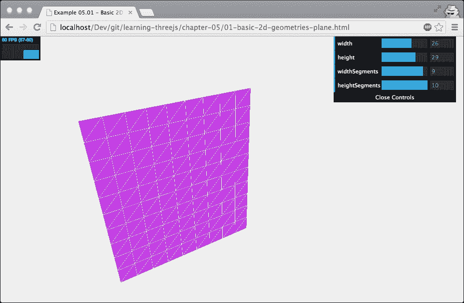

创建这个几何图形非常简单，如下所示：

```js
new THREE.PlaneGeometry(width, height,widthSegments,heightSegments);
```

在`THREE.PlaneGeometry`的示例中，你可以更改这些属性，直接看到它对生成的 3D 对象的影响。这些属性的解释如下表所示：

| 属性 | 必填 | 描述 |
| --- | --- | --- |
| `width` | 是 | 这是矩形的宽度。 |
| `height` | 是 | 这是矩形的高度。 |
| `widthSegments` | 否 | 这是宽度应该分成的段数。默认为`1`。 |
| `heightSegments` | 否 | 这是高度应该分成的段数。默认为`1`。 |

正如你所看到的，这不是一个非常复杂的几何图形。你只需指定大小，就完成了。如果你想创建更多的面（例如，当你想创建一个棋盘格图案时），你可以使用`widthSegments`和`heightSegments`属性将几何图形分成更小的面。

在我们继续下一个几何图形之前，这里有一个关于本示例使用的材质的快速说明，我们在本章的大多数其他示例中也使用这种材质。我们使用以下方法基于几何图形创建网格：

```js
function createMesh(geometry) {

  // assign two materials
  var meshMaterial = new THREE.MeshNormalMaterial();
  meshMaterial.side = THREE.DoubleSide;
  var wireframeMaterial = new THREE.MeshBasicMaterial();
  wireFrameMaterial.wireframe = true;

  // create a multimaterial
  var mesh = THREE.SceneUtils.createMultiMaterialObject(geometry,[meshMaterial,wireframeMaterial]);
  return mesh;
}
```

在这个函数中，我们基于提供的网格创建了一个多材质网格。首先使用的材质是`THREE.MeshNormalMaterial`。正如你在上一章中学到的，`THREE.MeshNormalMaterial`根据其法向量（面的方向）创建了彩色的面。我们还将这种材质设置为双面的（`THREE.DoubleSide`）。如果不这样做，当对象的背面对着摄像机时，我们就看不到它了。除了`THREE.MeshNormalMaterial`，我们还添加了`THREE.MeshBasicMaterial`，并启用了它的线框属性。这样，我们可以很好地看到对象的 3D 形状和为特定几何体创建的面。

### 提示

如果你想在创建后访问几何体的属性，你不能简单地说`plane.width`。要访问几何体的属性，你必须使用对象的`parameters`属性。因此，要获取本节中创建的`plane`对象的`width`属性，你必须使用`plane.parameters.width`。

### THREE.CircleGeometry

你可能已经猜到了`THREE.CircleGeometry`创建了什么。使用这个几何体，你可以创建一个非常简单的二维圆（或部分圆）。让我们先看看这个几何体的例子，`02-basic-2d-geometries-circle.html`。在下面的截图中，你可以找到一个例子，我们在其中使用了一个小于`2 * PI`的`thetaLength`值：

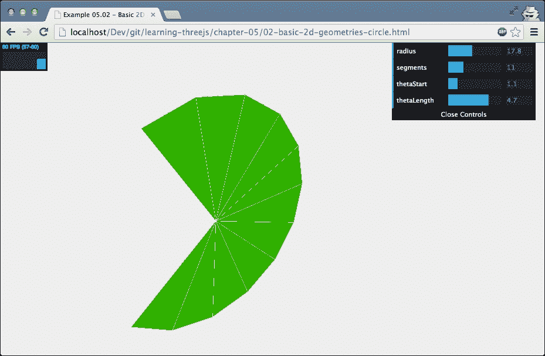

注意，`2 * PI`代表弧度中的一个完整圆。如果你更喜欢使用度而不是弧度，那么在它们之间进行转换非常容易。以下两个函数可以帮助你在弧度和度之间进行转换，如下所示：

```js
function deg2rad(degrees) {
  return degrees * Math.PI / 180;
}

function rad2deg(radians) {
  return radians * 180 / Math.PI;
}
```

在这个例子中，你可以看到并控制使用`THREE.CircleGeometry`创建的网格。当你创建`THREE.CircleGeometry`时，你可以指定一些属性来定义圆的外观，如下所示：

| 属性 | 必需 | 描述 |
| --- | --- | --- |
| `radius` | 否 | 圆的半径定义了它的大小。半径是从圆心到边缘的距离。默认值为`50`。 |
| `segments` | 否 | 此属性定义用于创建圆的面的数量。最小数量为`3`，如果未指定，则默认为`8`。较高的值意味着更平滑的圆形。 |
| `thetaStart` | 否 | 此属性定义从哪里开始绘制圆。这个值可以从`0`到`2 * PI`，默认值为`0`。 |
| `thetaLength` | 否 | 此属性定义圆完成的程度。如果未指定，它默认为`2 * PI`（完整圆）。例如，如果你为这个值指定了`0.5 * PI`，你将得到一个四分之一圆。使用这个属性和`thetaStart`属性一起来定义圆的形状。 |

你可以使用以下代码片段创建一个完整的圆：

```js
new THREE.CircleGeometry(3, 12);
```

如果你想从这个几何体创建半个圆，你可以使用类似于这样的代码：

```js
new THREE.CircleGeometry(3, 12, 0, Math.PI);
```

在继续下一个几何体之前，快速说明一下 Three.js 在创建这些二维形状（`THREE.PlaneGeometry`、`THREE.CircleGeometry`和`THREE.ShapeGeometry`）时使用的方向：Three.js 创建这些对象时是*竖立的*，所以它们位于*x*-*y*平面上。这是非常合乎逻辑的，因为它们是二维形状。然而，通常情况下，特别是对于`THREE.PlaneGeometry`，你可能希望将网格放在地面上（`x`-`z`平面）——一些可以放置其余对象的地面区域。创建一个水平定向的二维对象的最简单方法是将网格围绕其*x*轴向后旋转一四分之一圈（`-PI/2`），如下所示：

```js
mesh.rotation.x =- Math.PI/2;
```

这就是关于`THREE.CircleGeometry`的全部内容。下一个几何体`THREE.RingGeometry`看起来很像`THREE.CircleGeometry`。

### THREE.RingGeometry

使用`THREE.RingGeometry`，您可以创建一个二维对象，不仅与`THREE.CircleGeometry`非常相似，而且还允许您在中心定义一个孔（请参阅`03-basic-3d-geometries-ring.html`）：

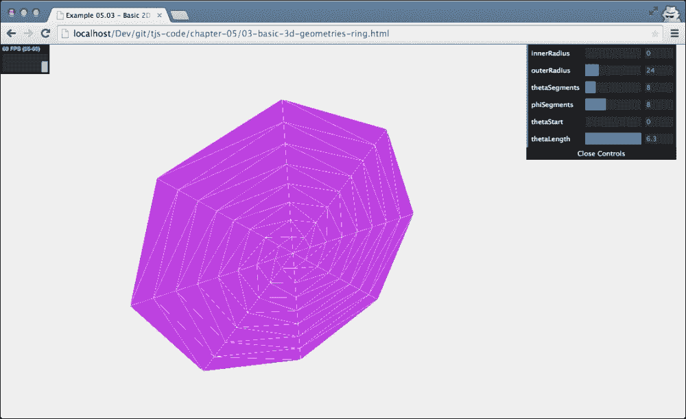

`THREE.RingGeometry`没有任何必需的属性（请参阅下一个表格以获取默认值），因此要创建此几何体，您只需指定以下内容：

```js
Var ring = new THREE.RingGeometry();
```

您可以通过将以下参数传递到构造函数来进一步自定义环形几何的外观：

| 属性 | 强制 | 描述 |
| --- | --- | --- |
| `innerRadius` | 否 | 圆的内半径定义了中心孔的大小。如果将此属性设置为`0`，则不会显示孔。默认值为`0`。 |
| `outerRadius` | 否 | 圆的外半径定义了其大小。半径是从圆的中心到其边缘的距离。默认值为`50`。 |
| `thetaSegments` | 否 | 这是用于创建圆的对角线段数。较高的值意味着更平滑的环。默认值为`8`。 |
| `phiSegments` | 否 | 这是沿着环的长度所需使用的段数。默认值为`8`。这实际上不影响圆的平滑度，但增加了面的数量。 |
| `thetaStart` | 否 | 这定义了从哪里开始绘制圆的位置。此值可以范围从`0`到`2 * PI`，默认值为`0`。 |
| `thetaLength` | 否 | 这定义了圆完成的程度。当未指定时，默认为`2 * PI`（完整圆）。例如，如果为此值指定`0.5 * PI`，则将获得一个四分之一圆。将此属性与`thetaStart`属性一起使用以定义圆的形状。 |

在下一节中，我们将看一下二维形状的最后一个：`THREE.ShapeGeometry`。

### THREE.ShapeGeometry

`THREE.PlaneGeometry`和`THREE.CircleGeometry`在自定义外观方面的方式有限。如果要创建自定义的二维形状，可以使用`THREE.ShapeGeometry`。使用`THREE.ShapeGeometry`，您可以调用一些函数来创建自己的形状。您可以将此功能与 HTML 画布元素和 SVG 中也可用的`<path>`元素功能进行比较。让我们从一个示例开始，然后我们将向您展示如何使用各种函数来绘制自己的形状。本章的源代码中可以找到`04-basic-2d-geometries-shape.html`示例。以下屏幕截图显示了此示例：

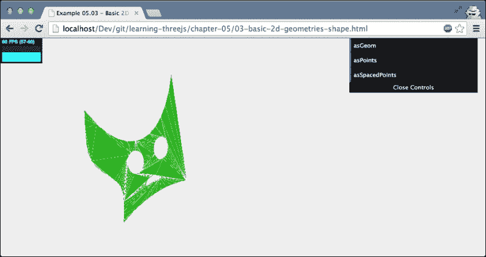

在此示例中，您可以看到一个自定义创建的二维形状。在描述属性之前，让我们首先看一下用于创建此形状的代码。在创建`THREE.ShapeGeometry`之前，我们首先必须创建`THREE.Shape`。您可以通过查看先前的屏幕截图来追踪这些步骤，从底部右侧开始。以下是我们创建`THREE.Shape`的方法：

```js
function drawShape() {
  // create a basic shape
  var shape = new THREE.Shape();

  // startpoint
  shape.moveTo(10, 10);

  // straight line upwards
  shape.lineTo(10, 40);

  // the top of the figure, curve to the right
  shape.bezierCurveTo(15, 25, 25, 25, 30, 40);

  // spline back down
  shape.splineThru(
    [new THREE.Vector2(32, 30),
      new THREE.Vector2(28, 20),
      new THREE.Vector2(30, 10),
    ])

  // curve at the bottom
  shape.quadraticCurveTo(20, 15, 10, 10);

  // add 'eye' hole one
  var hole1 = new THREE.Path();
  hole1.absellipse(16, 24, 2, 3, 0, Math.PI * 2, true);
  shape.holes.push(hole1);

  // add 'eye hole 2'
  var hole2 = new THREE.Path();
  hole2.absellipse(23, 24, 2, 3, 0, Math.PI * 2, true);
  shape.holes.push(hole2);

  // add 'mouth'
  var hole3 = new THREE.Path();
  hole3.absarc(20, 16, 2, 0, Math.PI, true);
  shape.holes.push(hole3);

  // return the shape
  return shape;
}
```

在此代码片段中，您可以看到我们使用线条、曲线和样条创建了此形状的轮廓。之后，我们使用`THREE.Shape`的`holes`属性在此形状中打了一些孔。不过，在本节中，我们谈论的是`THREE.ShapeGeometry`而不是`THREE.Shape`。要从`THREE.Shape`创建几何体，我们需要将`THREE.Shape`（在我们的情况下从`drawShape()`函数返回）作为参数传递给`THREE.ShapeGeometry`，如下所示：

```js
new THREE.ShapeGeometry(drawShape());
```

此函数的结果是一个可用于创建网格的几何体。当您已经拥有一个形状时，还有一种创建`THREE.ShapeGeometry`的替代方法。您可以调用`shape.makeGeometry(options)`，它将返回`THREE.ShapeGeometry`的一个实例（有关选项的解释，请参见下一个表格）。

让我们首先看一下您可以传递给`THREE.ShapeGeometry`的参数：

| 属性 | 强制 | 描述 |
| --- | --- | --- |
| `shapes` | 是 | 这些是用于创建`THREE.Geometry`的一个或多个`THREE.Shape`对象。您可以传入单个`THREE.Shape`对象或`THREE.Shape`对象的数组。 |

| `options` | 否 | 您还可以传入一些应用于使用`shapes`参数传入的所有形状的`options`。这些选项的解释在这里给出：

+   `curveSegments`：此属性确定从形状创建的曲线有多光滑。默认值为`12`。

+   `material`：这是用于指定形状创建的面的`materialIndex`属性。当您将`THREE.MeshFaceMaterial`与此几何体一起使用时，`materialIndex`属性确定用于传入形状的面的材料。

+   `UVGenerator`：当您在材质中使用纹理时，UV 映射确定纹理的哪一部分用于特定的面。使用`UVGenerator`属性，您可以传入自己的对象，用于为传入的形状创建面的 UV 设置。有关 UV 设置的更多信息，请参阅第十章*加载和使用纹理*。如果没有指定，将使用`THREE.ExtrudeGeometry.WorldUVGenerator`。

|

`THREE.ShapeGeometry`最重要的部分是`THREE.Shape`，您可以使用它来创建形状，因此让我们看一下您可以使用的绘制函数列表来创建`THREE.Shape`（请注意，这些实际上是`THREE.Path`对象的函数，`THREE.Shape`是从中扩展的）。

| 名称 | 描述 |
| --- | --- |
| `moveTo(x,y)` | 将绘图位置移动到指定的*x*和*y*坐标。 |
| `lineTo(x,y)` | 从当前位置(例如，由`moveTo`函数设置)画一条线到提供的*x*和*y*坐标。 |
| `quadraticCurveTo(aCPx, aCPy, x, y)` | 您可以使用两种不同的方式来指定曲线。您可以使用此`quadraticCurveTo`函数，也可以使用`bezierCurveTo`函数(请参阅下一行表)。这两个函数之间的区别在于您如何指定曲线的曲率。以下图解释了这两个选项之间的区别: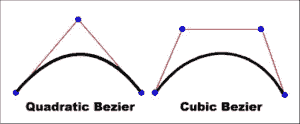对于二次曲线，我们需要指定一个额外的点(使用`aCPx`和`aCPy`参数)，曲线仅基于该点和，当然，指定的终点(*x*和*y*参数)。对于三次曲线(由`bezierCurveTo`函数使用)，您需要指定两个额外的点来定义曲线。起点是路径的当前位置。 |
| `bezierCurveTo(aCPx1, aCPy1, aCPx2, aCPy2, x, y)` | 根据提供的参数绘制曲线。有关说明，请参见上一个表条目。曲线是基于定义曲线的两个坐标(`aCPx1`，`aCPy1`，`aCPx2`和`aCPy2`)和结束坐标(*x*和*y*)绘制的。起点是路径的当前位置。 |
| `splineThru(pts)` | 此函数通过提供的坐标集(`pts`)绘制流线。此参数应该是`THREE.Vector2`对象的数组。起点是路径的当前位置。 |
| `arc(aX, aY, aRadius, aStartAngle, aEndAngle, aClockwise)` | 这绘制一个圆(或圆的一部分)。圆从路径的当前位置开始。在这里，`aX`和`aY`被用作从当前位置的偏移量。请注意，`aRadius`设置圆的大小，`aStartAngle`和`aEndAngle`定义了绘制圆的一部分的大小。布尔属性`aClockwise`确定圆是顺时针绘制还是逆时针绘制。 |
| `absArc(aX, aY, aRadius, aStartAngle, aEndAngle, AClockwise)` | 参见`arc`的描述。位置是绝对的，而不是相对于当前位置。 |
| `ellipse(aX, aY, xRadius, yRadius, aStartAngle, aEndAngle, aClockwise)` | 查看`arc`的描述。另外，使用`ellipse`函数，我们可以分别设置*x*半径和*y*半径。 |
| `absEllipse(aX, aY, xRadius, yRadius, aStartAngle, aEndAngle, aClockwise)` | 查看`ellipse`的描述。位置是绝对的，而不是相对于当前位置。 |
| `fromPoints(vectors)` | 如果您将一个`THREE.Vector2`（或`THREE.Vector3`）对象数组传递给此函数，Three.js 将使用从提供的向量到直线创建路径。 |
| `holes` | `holes`属性包含一个`THREE.Shape`对象数组。数组中的每个对象都作为一个孔渲染。这个部分开头我们看到的示例就是一个很好的例子。在那个代码片段中，我们将三个`THREE.Shape`对象添加到了这个数组中。一个是主`THREE.Shape`对象的左眼，一个是右眼，一个是嘴巴。 |

在这个示例中，我们使用新的`THREE.ShapeGeometry(drawShape()))`构造函数从`THREE.Shape`对象创建了`THREE.ShapeGeometry`。`THREE.Shape`对象本身还有一些辅助函数，您可以用来创建几何体。它们如下：

| 名称 | 描述 |
| --- | --- |
| `makeGeometry(options)` | 这从`THREE.Shape`返回`THREE.ShapeGeometry`。有关可用选项的更多信息，请查看我们之前讨论的`THREE.ShapeGeometry`的属性。 |
| `createPointsGeometry(divisions)` | 这将形状转换为一组点。`divisions`属性定义了返回多少个点。如果这个值更高，将返回更多的点，生成的线条将更平滑。分割应用于路径的每个部分。 |
| `createSpacedPointsGeometry(divisions)` | 即使这将形状转换为一组点，但这次将分割应用于整个路径。 |

当您创建一组点时，使用`createPointsGeometry`或`createSpacedPointsGeometry`；您可以使用创建的点来绘制一条线，如下所示：

```js
new THREE.Line( shape.createPointsGeometry(10), new THREE.LineBasicMaterial( { color: 0xff3333, linewidth: 2 } ) );
```

当您在示例中点击**asPoints**或**asSpacedPoints**按钮时，您将看到类似于这样的东西：

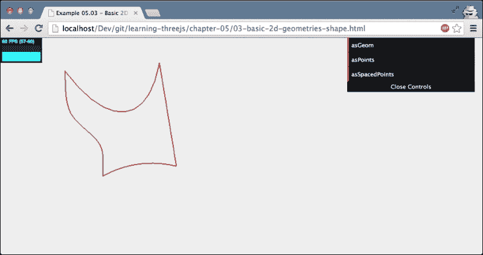

这就是关于二维形状的全部内容。下一部分将展示和解释基本的三维形状。

## 三维几何体

在这个关于基本三维几何体的部分，我们将从我们已经看过几次的几何体`THREE.BoxGeometry`开始。

### THREE.BoxGeometry

`THREE.BoxGeometry`是一个非常简单的 3D 几何体，允许您通过指定其宽度、高度和深度来创建一个立方体。我们添加了一个示例`05-basic-3d-geometries-cube.html`，您可以在其中尝试这些属性。以下屏幕截图显示了这个几何体：

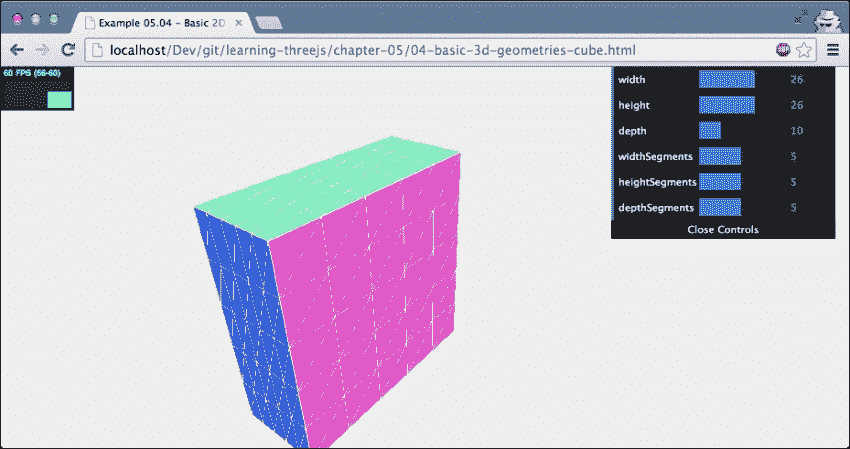

正如您在此示例中所看到的，通过更改`THREE.BoxGeometry`的`width`，`height`和`depth`属性，您可以控制生成网格的大小。当您创建一个新的立方体时，这三个属性也是必需的，如下所示：

```js
new THREE.BoxGeometry(10,10,10);
```

在示例中，您还可以看到一些您可以在立方体上定义的其他属性。以下表格解释了所有这些属性：

| 属性 | 必需 | 描述 |
| --- | --- | --- |
| `宽度` | 是 | 这是立方体的宽度。这是立方体顶点沿*x*轴的长度。 |
| `height` | 是 | 这是立方体的高度。这是立方体顶点沿*y*轴的长度。 |
| `depth` | 是 | 这是立方体的深度。这是立方体顶点沿*z*轴的长度。 |
| `widthSegments` | 否 | 这是我们沿着立方体*x*轴将一个面分成的段数。默认值为`1`。 |
| `heightSegments` | 否 | 这是我们沿着立方体*y*轴将一个面分成的段数。默认值为`1`。 |
| `depthSegments` | 否 | 这是我们沿着立方体的*z*轴将一个面分成的段数。默认值为`1`。 |

通过增加各种段属性，您可以将立方体的六个主要面分成更小的面。如果您想要在立方体的部分上设置特定的材质属性，使用`THREE.MeshFaceMaterial`是很有用的。`THREE.BoxGeometry`是一个非常简单的几何体。另一个简单的是`THREE.SphereGeometry`。

### THREE.SphereGeometry

使用`SphereGeometry`，您可以创建一个三维球体。让我们直接进入示例`06-basic-3d-geometries-sphere.html`：

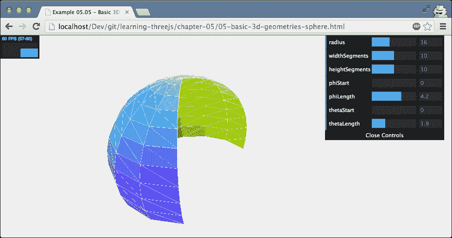

在上一张截图中，我们向您展示了基于`THREE.SphereGeometry`创建的半开放球体。这种几何体非常灵活，可以用来创建各种与球体相关的几何体。然而，一个基本的`THREE.SphereGeometry`可以像这样轻松创建：`new THREE.SphereGeometry()`。以下属性可用于调整结果网格的外观：

| 属性 | 强制 | 描述 |
| --- | --- | --- |
| --- | --- | --- |
| `半径` | 否 | 用于设置球体的半径。这定义了结果网格的大小。默认值为`50`。 |
| `widthSegments` | 否 | 这是垂直使用的段数。更多的段意味着更光滑的表面。默认值为`8`，最小值为`3`。 |
| `heightSegments` | 否 | 这是水平使用的段数。段数越多，球体表面越光滑。默认值为`6`，最小值为`2`。 |
| `phiStart` | 否 | 这确定了沿着其*x*轴开始绘制球体的位置。这可以从`0`到`2 * PI`范围内，并且默认值为`0`。 |
| `phiLength` | 否 | 这确定了球体从`phiStart`处绘制的距离。`2 * PI`将绘制一个完整的球体，`0.5 * PI`将绘制一个开放的四分之一球体。默认值为`2 * PI`。 |
| `thetaStart` | 否 | 这确定了沿着其*x*轴开始绘制球体的位置。这可以从`0`到`PI`范围内，并且默认值为`0`。 |
| `thetaLength` | 否 | 这确定了从`phiStart`处绘制球体的距离。`PI`值是一个完整的球体，而`0.5 * PI`将只绘制球体的顶半部分。默认值为`PI`。 |

`radius`，`widthSegments`和`heightSegments`属性应该很清楚。我们已经在其他示例中看到了这些类型的属性。`phiStart`，`phiLength`，`thetaStart`和`thetaLength`属性在没有示例的情况下有点难以理解。不过幸运的是，您可以从`06-basic-3d-geometries-sphere.html`示例的菜单中尝试这些属性，并创建出有趣的几何体，比如这些：

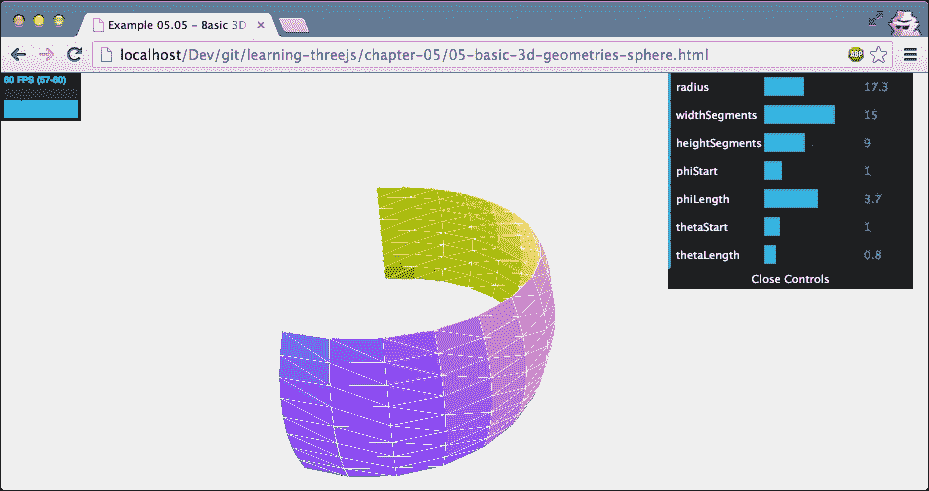

列表中的下一个是`THREE.CylinderGeometry`。

### THREE.CylinderGeometry

使用这个几何体，我们可以创建圆柱体和类似圆柱体的对象。对于所有其他几何体，我们也有一个示例（`07-basic-3d-geometries-cylinder.html`），让您可以尝试这个几何体的属性，其截图如下：


当您创建`THREE.CylinderGeometry`时，没有任何强制参数。因此，您可以通过调用`new THREE.CylinderGeometry()`来创建一个圆柱体。您可以传递多个属性，就像在示例中看到的那样，以改变这个圆柱体的外观。这些属性在下表中解释：

| 属性 | 强制 | 描述 |
| --- | --- | --- |
| --- | --- | --- |
| `radiusTop` | 否 | 这设置了圆柱体顶部的大小。默认值为`20`。 |
| `radiusBottom` | 否 | 这设置了圆柱体底部的大小。默认值为`20`。 |
| `height` | 否 | 此属性设置圆柱体的高度。默认高度为`100`。 |
| `radialSegments` | 否 | 这确定了圆柱体半径上的段数。默认值为`8`。更多的段数意味着更平滑的圆柱体。 |
| `heightSegments` | 否 | 这确定了圆柱体高度上的段数。默认值为`1`。更多的段数意味着更多的面。 |
| `openEnded` | 否 | 这确定网格在顶部和底部是否封闭。默认值为`false`。 |

这些都是您可以用来配置圆柱体的非常基本的属性。然而，一个有趣的方面是当您为顶部（或底部）使用负半径时。如果这样做，您可以使用这个几何体来创建类似沙漏的形状，如下面的截图所示。需要注意的一点是，正如您从颜色中看到的那样，这种情况下的上半部分是里面翻转的。如果您使用的材质没有配置`THREE.DoubleSide`，您将看不到上半部分。

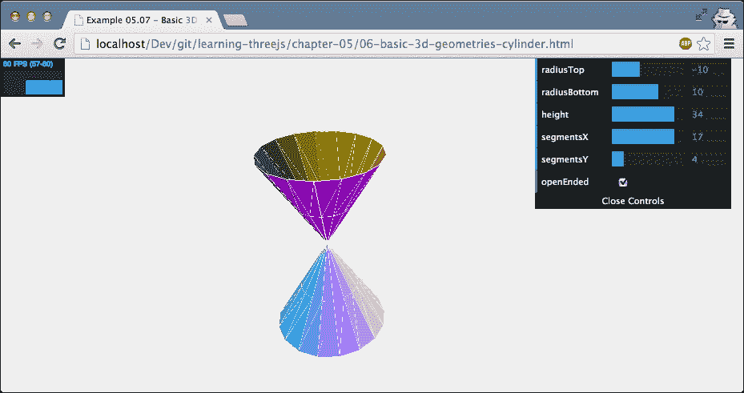

下一个几何体是`THREE.TorusGeometry`，你可以用它来创建类似甜甜圈的形状。

### THREE.TorusGeometry

圆环是一个简单的形状，看起来像一个甜甜圈。以下截图显示了`THREE.TorusGeometry`的示例：

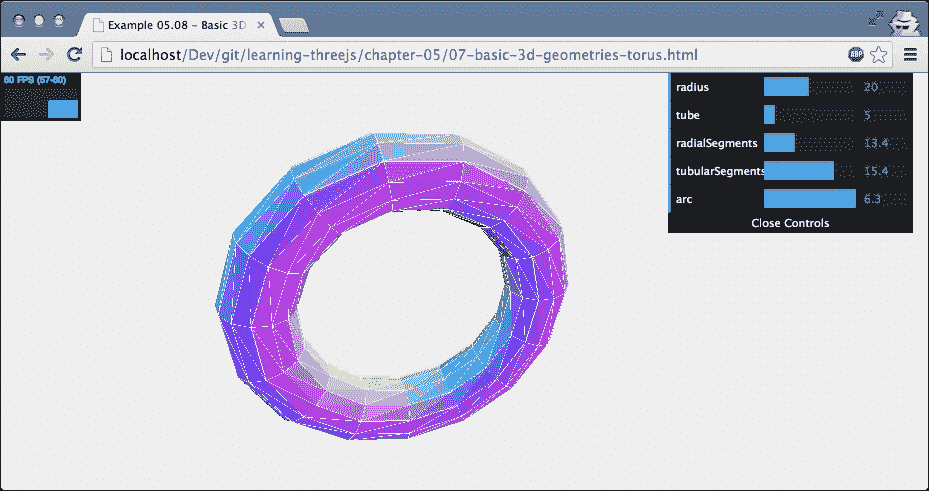

就像大多数简单的几何体一样，在创建`THREE.TorusGeometry`时没有任何强制性参数。下表列出了创建此几何体时可以指定的参数：

| 属性 | 强制性 | 描述 |
| --- | --- | --- |
| `radius` | 否 | 这设置了完整圆环的大小。默认值为`100`。 |
| `tube` | 否 | 这设置了管道（实际甜甜圈）的半径。此属性的默认值为`40`。 |
| `radialSegments` | 否 | 这确定了沿着圆环长度使用的段数。默认值为`8`。在演示中查看更改此值的效果。 |
| `tubularSegments` | 否 | 这确定了沿着圆环宽度使用的段数。默认值为`6`。在演示中查看更改此值的效果。 |
| `arc` | 否 | 通过这个属性，您可以控制圆环是否绘制完整圆。这个值的默认值是`2 * PI`（一个完整的圆）。 |

其中大多数都是非常基本的属性，`arc`属性是一个非常有趣的属性。通过这个属性，您可以定义甜甜圈是完整的圆还是部分圆。通过调整这个属性，您可以创建非常有趣的网格，比如下面这个弧度设置为`0.5 * PI`的网格：

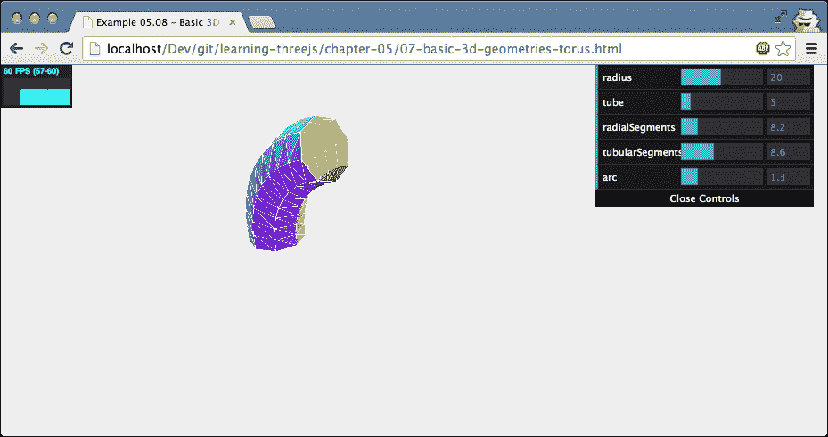

`THREE.TorusGeometry`是一个非常直接的几何体。在下一节中，我们将看一个几何体，它几乎与它的名字相同，但要复杂得多：`THREE.TorusKnotGeometry`。

### THREE.TorusKnotGeometry

使用`THREE.TorusKnotGeometry`，您可以创建一个圆环结。圆环结是一种特殊的结，看起来像一个围绕自身缠绕了几次的管子。最好的解释方法是看`09-basic-3d-geometries-torus-knot.html`示例。下面的截图显示了这个几何体：

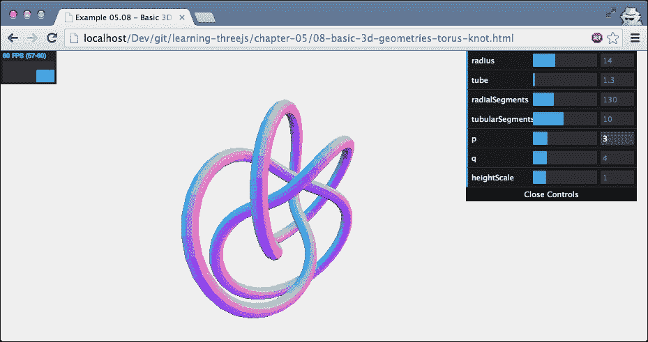

如果您打开这个示例并尝试调整`p`和`q`属性，您可以创建各种美丽的几何体。`p`属性定义了结的轴向绕组次数，`q`定义了结在其内部绕组的程度。如果这听起来有点模糊，不用担心。您不需要理解这些属性就可以创建美丽的结，比如下面截图中显示的一个（对于那些对细节感兴趣的人，维基百科在这个主题上有一篇很好的文章[`en.wikipedia.org/wiki/Torus_knot`](http://en.wikipedia.org/wiki/Torus_knot)）：

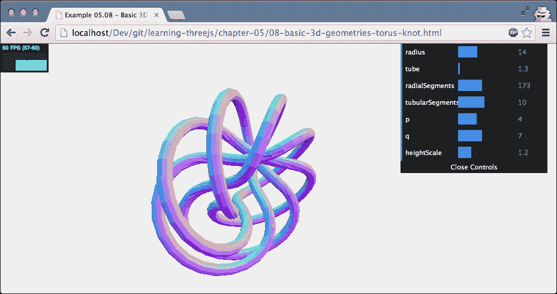

通过这个几何体的示例，你可以尝试不同的`p`和`q`的组合，看看它们对这个几何体的影响：

| 属性 | 强制性 | 描述 |
| --- | --- | --- |
| `radius` | 否 | 这设置了整个环面的大小。默认值为`100`。 |
| `tube` | 否 | 这设置了管道（实际甜甜圈）的半径。这个属性的默认值为`40`。 |
| `radialSegments` | 否 | 这确定了沿着环面结的长度使用的段数。默认值为`64`。在演示中查看更改此值的效果。 |
| `tubularSegments` | 否 | 这确定了沿着环面结的宽度使用的段数。默认值为`8`。在演示中查看更改此值的效果。 |
| `p` | 否 | 这定义了结的形状，默认值为`2`。 |
| `q` | 否 | 这定义了结的形状，默认值为`3`。 |
| `heightScale` | 否 | 使用这个属性，你可以拉伸环面结。默认值为`1`。 |

列表中的下一个几何体是基本几何体中的最后一个：`THREE.PolyhedronGeometry`。

### THREE.PolyhedronGeometry

使用这个几何体，你可以轻松创建多面体。多面体是一个只有平面面和直边的几何体。不过，大多数情况下，你不会直接使用这个几何体。Three.js 提供了许多特定的多面体，你可以直接使用，而不需要指定`THREE.PolyhedronGeometry`的顶点和面。我们将在本节的后面讨论这些多面体。如果你确实想直接使用`THREE.PolyhedronGeometry`，你必须指定顶点和面（就像我们在第三章中为立方体所做的那样，*在 Three.js 中使用不同的光源*）。例如，我们可以像这样创建一个简单的四面体（也可以参见本章中的`THREE.TetrahedronGeometry`）：

```js
var vertices = [
  1,  1,  1, 
  -1, -1,  1, 
  -1,  1, -1, 
  1, -1, -1
];

var indices = [
  2, 1, 0, 
  0, 3, 2, 
  1, 3, 0, 
  2, 3, 1
];

polyhedron = createMesh(new THREE.PolyhedronGeometry(vertices, indices, controls.radius, controls.detail));
```

要构建`THREE.PolyhedronGeometry`，我们传入`vertices`、`indices`、`radius`和`detail`属性。生成的`THREE.PolyhedronGeometry`对象显示在`10-basic-3d-geometries-polyhedron.html`示例中（在右上角的菜单中选择**类型**为：**自定义**）：

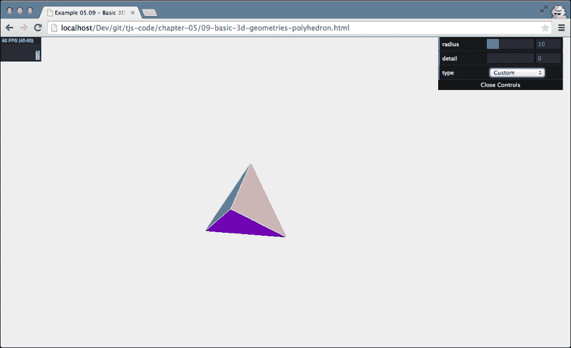

当你创建一个多面体时，你可以传入以下四个属性：

| 属性 | 强制性 | 描述 |
| --- | --- | --- |
| `vertices` | 是 | 这些是组成多面体的点。 |
| `indices` | 是 | 这些是需要从顶点创建的面。 |
| `radius` | 否 | 这是多面体的大小。默认为`1`。 |
| `detail` | 否 | 使用这个属性，你可以给多面体添加额外的细节。如果将其设置为`1`，多面体中的每个三角形将分成四个更小的三角形。如果将其设置为`2`，这四个更小的三角形将再次分成四个更小的三角形，依此类推。 |

在本节的开头，我们提到 Three.js 自带了一些多面体。在接下来的小节中，我们将快速展示这些多面体。

所有这些多面体类型都可以通过查看`09-basic-3d-geometries-polyhedron.html`示例来查看。

#### THREE.IcosahedronGeometry

`THREE.IcosahedronGeometry` 创建了一个由 12 个顶点创建的 20 个相同三角形面的多面体。创建这个多面体时，你只需要指定`radius`和`detail`级别。这个截图显示了使用`THREE.IcosahedronGeometry`创建的多面体：

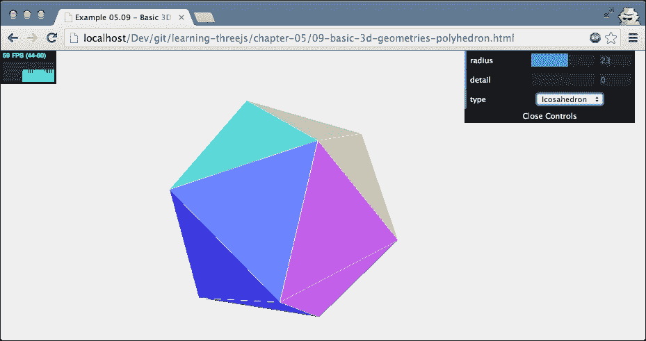

#### THREE.TetrahedronGeometry

四面体是最简单的多面体之一。这个多面体只包含了由四个顶点创建的四个三角形面。你可以像创建 Three.js 提供的其他多面体一样创建`THREE.TetrahedronGeometry`，通过指定`radius`和`detail`级别。下面是一个使用`THREE.TetrahedronGeometry`创建的四面体的截图：

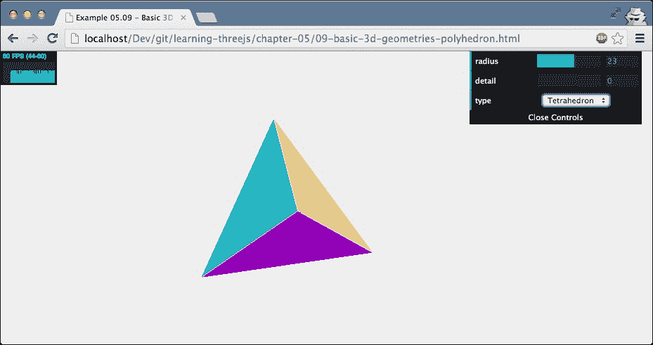

#### THREE.Octahedron Geometry

Three.js 还提供了一个八面体的实现。顾名思义，这个多面体有 8 个面。这些面是由 6 个顶点创建的。以下截图显示了这个几何图形：

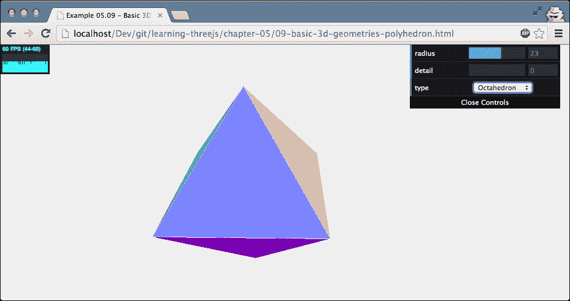

#### THREE.DodecahedronGeometry

Three.js 提供的最后一个多面体几何图形是`THREE.DodecahedronGeometry`。这个多面体有 12 个面。以下截图显示了这个几何图形：

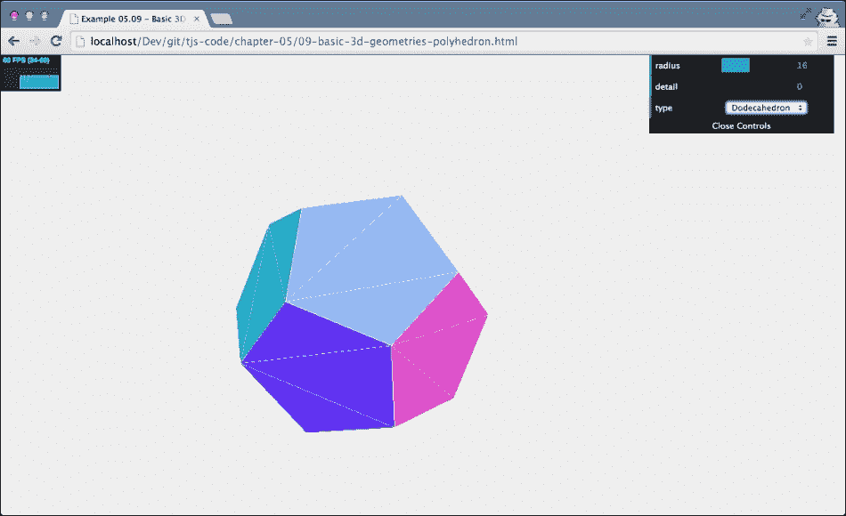

这是关于 Three.js 提供的基本二维和三维几何图形的章节的结束。

# 总结

在本章中，我们讨论了 Three.js 提供的所有标准几何图形。正如你所看到的，有很多几何图形可以直接使用。为了更好地学习如何使用这些几何图形，尝试使用这些几何图形。使用本章的示例来了解你可以用来自定义 Three.js 提供的标准几何图形的属性。当你开始使用几何图形时，最好选择一个基本的材质；不要直接选择复杂的材质，而是从`THREE.MeshBasicMaterial`开始，将线框设置为`true`，或者使用`THREE.MeshNormalMaterial`。这样，你将更好地了解几何图形的真实形状。对于二维形状，重要的是要记住它们是放置在*x*-*y*平面上的。如果你想要水平放置一个二维形状，你需要围绕*x*轴旋转网格为`-0.5 * PI`。最后，要注意，如果你旋转一个二维形状，或者一个*开放*的三维形状（例如圆柱体或管道），记得将材质设置为`THREE.DoubleSide`。如果不这样做，你的几何图形的内部或背面将不会显示出来。

在本章中，我们专注于简单直接的网格。Three.js 还提供了创建复杂几何图形的方法。在下一章中，你将学习如何创建这些复杂几何图形。
