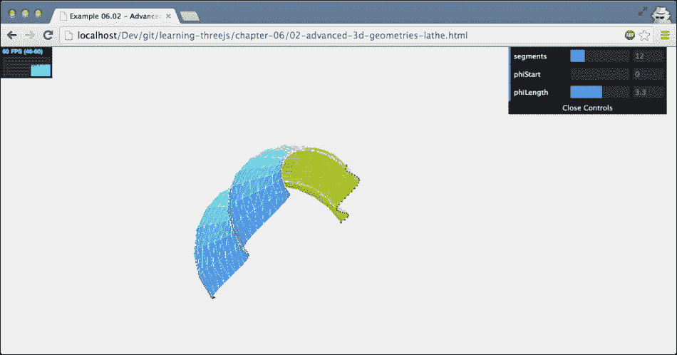
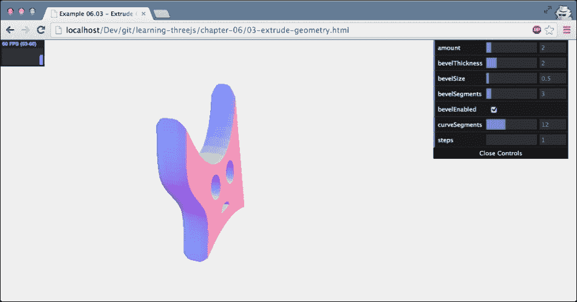
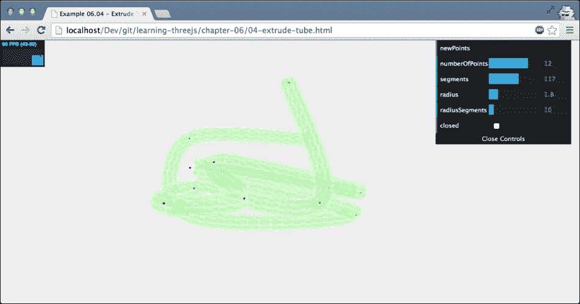
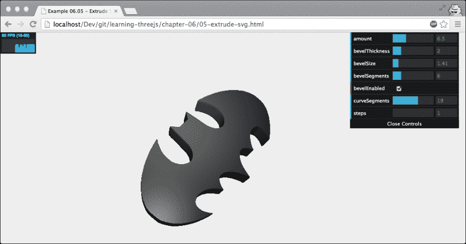
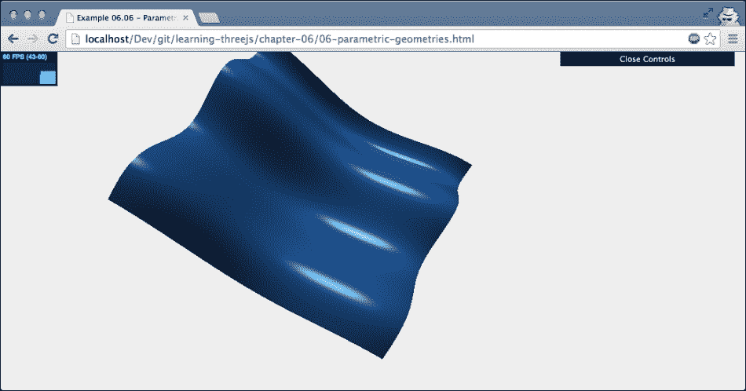
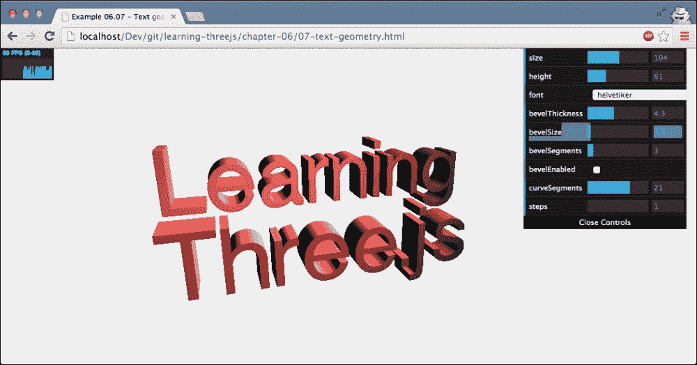
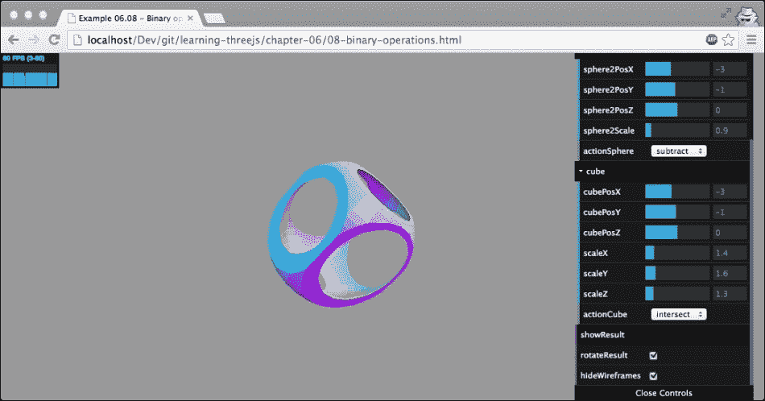
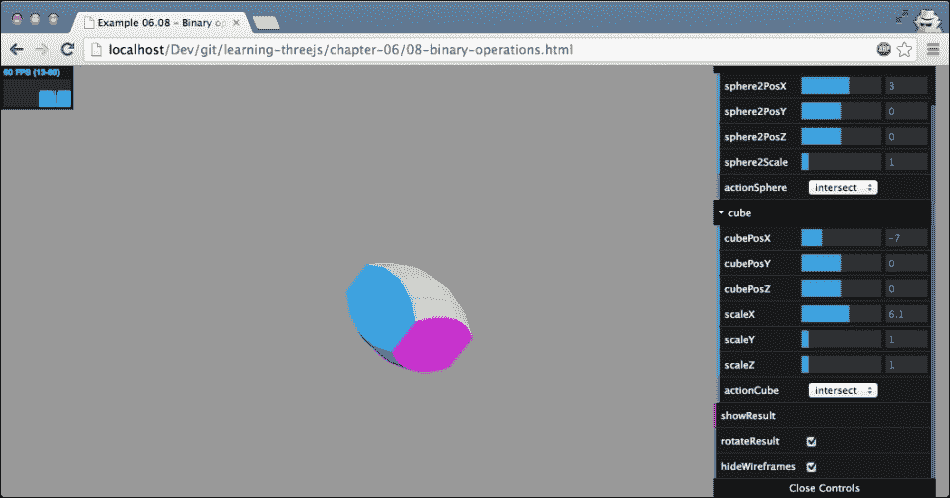
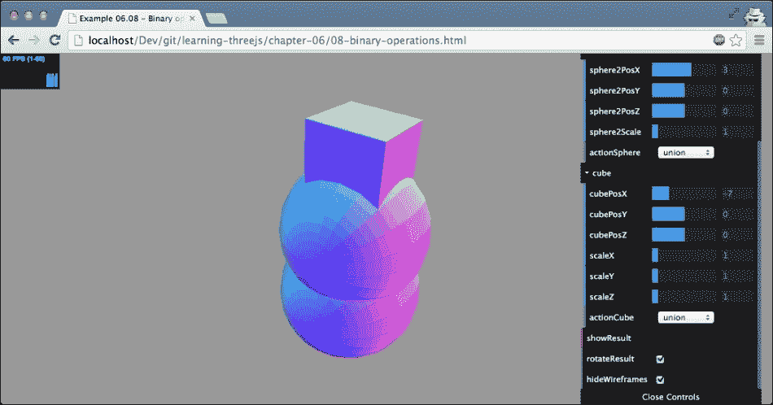

# 第六章：高级几何形状和二进制操作

在上一章中，我们向你展示了 Three.js 提供的所有基本几何形状。除了这些基本几何形状，Three.js 还提供了一组更高级和专业化的对象。在本章中，我们将向你展示这些高级几何形状，并涵盖以下主题：

+   如何使用高级几何形状，比如`THREE.ConvexGeometry`，`THREE.LatheGeometry`和`THREE.TubeGeometry`。

+   如何使用`THREE.ExtrudeGeometry`从 2D 形状创建 3D 形状。我们将根据使用 Three.js 提供的功能绘制的 2D 形状来做这个，我们将展示一个例子，其中我们基于外部加载的 SVG 图像创建 3D 形状。

+   如果你想自己创建自定义形状，你可以很容易地修改我们在前几章中讨论的形状。然而，Three.js 还提供了一个`THREE.ParamtericGeometry`对象。使用这个对象，你可以基于一组方程创建几何形状。

+   最后，我们将看看如何使用`THREE.TextGeometry`创建 3D 文本效果。

+   此外，我们还将向你展示如何使用 Three.js 扩展 ThreeBSP 提供的二进制操作从现有的几何形状创建新的几何形状。

我们将从列表中的第一个开始，`THREE.ConvexGeometry`。

# THREE.ConvexGeometry

使用`THREE.ConvexGeometry`，我们可以围绕一组点创建凸包。凸包是包围所有这些点的最小形状。最容易理解的方法是通过一个例子来看。如果你打开`01-advanced-3d-geometries-convex.html`的例子，你会看到一个随机点集的凸包。以下截图显示了这个几何形状：


在这个例子中，我们生成一组随机点，并基于这些点创建`THREE.ConvexGeometry`。在例子中，你可以点击**redraw**，这将生成 20 个新点并绘制凸包。我们还将每个点添加为一个小的`THREE.SphereGeometry`对象，以清楚地展示凸包的工作原理。`THREE.ConvexGeometry`没有包含在标准的 Three.js 发行版中，所以你必须包含一个额外的 JavaScript 文件来使用这个几何形状。在你的 HTML 页面顶部，添加以下内容：

```js
<script src="../libs/ConvexGeometry.js"></script>
```

以下代码片段显示了这些点是如何创建并添加到场景中的：

```js
function generatePoints() {
  // add 10 random spheres
  var points = [];
  for (var i = 0; i < 20; i++) {
    var randomX = -15 + Math.round(Math.random() * 30);
    var randomY = -15 + Math.round(Math.random() * 30);
    var randomZ = -15 + Math.round(Math.random() * 30);
    points.push(new THREE.Vector3(randomX, randomY, randomZ));
  }

  var group = new THREE.Object3D();
  var material = new THREE.MeshBasicMaterial({color: 0xff0000, transparent: false});
  points.forEach(function (point) {
    var geom = new THREE.SphereGeometry(0.2);
    var mesh = new THREE.Mesh(geom, material);
    mesh.position.clone(point);
    group.add(mesh);
  });

  // add the points as a group to the scene
  scene.add(group);
}
```

正如你在这段代码片段中看到的，我们创建了 20 个随机点（`THREE.Vector3`），并将它们推入一个数组中。接下来，我们遍历这个数组，并创建`THREE.SphereGeometry`，其位置设置为这些点之一（`position.clone(point)`）。所有点都被添加到一个组中（更多内容请参阅第七章），所以我们可以通过旋转组来轻松旋转它们。

一旦你有了这组点，创建`THREE.ConvexGeometry`就非常容易，如下面的代码片段所示：

```js
// use the same points to create a convexgeometry
var convexGeometry = new THREE.ConvexGeometry(points);
convexMesh = createMesh(convexGeometry);
scene.add(convexMesh);
```

包含顶点（`THREE.Vector3`类型）的数组是`THREE.ConvexGeometry`的唯一参数。关于`createMesh()`函数（这是我们在第五章中自己创建的函数）我们在这里调用。在上一章中，我们使用这种方法使用`THREE.MeshNormalMaterial`创建网格。对于这个例子，我们将其更改为半透明的绿色`THREE.MeshBasicMaterial`，以更好地显示我们创建的凸包和构成这个几何形状的单个点。

下一个复杂的几何形状是`THREE.LatheGeometry`，它可以用来创建类似花瓶的形状。

# THREE.LatheGeometry

`THREE.LatheGeometry`允许您从平滑曲线创建形状。这条曲线由许多点（也称为节点）定义，通常称为样条。这个样条围绕对象的中心*z*轴旋转，产生类似花瓶和钟形的形状。再次，理解`THREE.LatheGeometry`的最简单方法是看一个例子。这个几何图形显示在`02-advanced-3d-geometries-lathe.html`中。以下来自示例的截图显示了这个几何图形：



在前面的截图中，您可以看到样条作为一组小红色球体。这些球体的位置与其他参数一起传递给`THREE.LatheGeometry`。在这个例子中，我们将这个样条旋转了半圈，基于这个样条，我们提取了您可以看到的形状。在我们查看所有参数之前，让我们看一下用于创建样条的代码以及`THREE.LatheGeometry`如何使用这个样条：

```js
function generatePoints(segments, phiStart, phiLength) {
  // add 10 random spheres
  var points = [];
  var height = 5;
  var count = 30;
  for (var i = 0; i < count; i++) {
    points.push(new THREE.Vector3((Math.sin(i * 0.2) + Math.cos(i * 0.3)) * height + 12, 0, ( i - count ) + count / 2));
  }

  ...

  // use the same points to create a LatheGeometry
  var latheGeometry = new THREE.LatheGeometry (points, segments, phiStart, phiLength);
  latheMesh = createMesh(latheGeometry);
  scene.add(latheMesh);
}
```

在这段 JavaScript 中，您可以看到我们生成了 30 个点，它们的*x*坐标是基于正弦和余弦函数的组合，而*z*坐标是基于`i`和`count`变量的。这创建了在前面截图中以红点可视化的样条。

基于这些要点，我们可以创建`THREE.LatheGeometry`。除了顶点数组之外，`THREE.LatheGeometry`还需要一些其他参数。以下表格列出了所有的参数：

| 属性 | 强制 | 描述 |
| --- | --- | --- |
| `points` | 是 | 这些是用于生成钟形/花瓶形状的样条的点。 |
| `segments` | 否 | 这是在创建形状时使用的段数。这个数字越高，结果形状就越*圆润*。这个默认值是`12`。 |
| `phiStart` | 否 | 这确定在生成形状时在圆上从哪里开始。这可以从`0`到`2*PI`。默认值是`0`。 |
| `phiLength` | 否 | 这定义了形状生成的完整程度。例如，一个四分之一的形状将是`0.5*PI`。默认值是完整的`360`度或`2*PI`。 |

在下一节中，我们将看一种通过从 2D 形状中提取 3D 几何图形的替代方法。

## 通过挤出创建几何图形

Three.js 提供了几种方法，可以将 2D 形状挤出为 3D 形状。通过挤出，我们指的是沿着它的*z*轴拉伸 2D 形状以将其转换为 3D。例如，如果我们挤出`THREE.CircleGeometry`，我们得到一个看起来像圆柱体的形状，如果我们挤出`THREE.PlaneGeometry`，我们得到一个类似立方体的形状。

挤出形状的最通用方法是使用`THREE.ExtrudeGeometry`对象。

### THREE.ExtrudeGeometry

使用`THREE.ExtrudeGeometry`，您可以从 2D 形状创建 3D 对象。在我们深入了解这个几何图形的细节之前，让我们先看一个例子：`03-extrude-geometry.html`。以下来自示例的截图显示了这个几何图形：



在这个例子中，我们取出了在上一章中创建的 2D 形状，并使用`THREE.ExtrudeGeometry`将其转换为 3D。正如您在这个截图中所看到的，形状沿着*z*轴被挤出，从而得到一个 3D 形状。创建`THREE.ExtrudeGeometry`的代码非常简单：

```js
var options = {
  amount: 10,
  bevelThickness: 2,
  bevelSize: 1,
  bevelSegments: 3,
  bevelEnabled: true,
  curveSegments: 12,
  steps: 1
};

shape = createMesh(new THREE.ExtrudeGeometry(drawShape(), options));
```

在这段代码中，我们使用`drawShape()`函数创建了形状，就像在上一章中所做的那样。这个形状与一个`options`对象一起传递给`THREE.ExtrudeGeometry`构造函数。使用`options`对象，您可以精确地定义形状应该如何被挤出。以下表格解释了您可以传递给`THREE.ExtrudeGeometry`的选项。

| 属性 | 强制 | 描述 |
| --- | --- | --- |
| `shapes` | 是 | 需要一个或多个形状（`THREE.Shape`对象）来从中挤出几何图形。请参阅前一章关于如何创建这样的形状。 |
| `amount` | 否 | 这确定形状应该被挤出的距离（深度）。默认值为`100`。 |
| `bevelThickness` | 否 | 这确定倒角的深度。倒角是前后面和挤出之间的圆角。该值定义了倒角进入形状的深度。默认值为`6`。 |
| `bevelSize` | 否 | 这确定倒角的高度。这加到形状的正常高度上。默认值为`bevelThickness - 2`。 |
| `bevelSegments` | 否 | 这定义了用于倒角的段数。使用的段数越多，倒角看起来就越平滑。默认值为`3`。 |
| `bevelEnabled` | 否 | 如果设置为`true`，则添加倒角。默认值为`true`。 |
| `curveSegments` | 否 | 这确定在挤出形状的曲线时将使用多少段。使用的段数越多，曲线看起来就越平滑。默认值为`12`。 |
| `steps` | 否 | 这定义了沿着深度将挤出分成多少段。默认值为`1`。较高的值将导致更多的单独面。 |
| `extrudePath` | 否 | 这是沿着形状应该被挤出的路径（`THREE.CurvePath`）。如果未指定，则形状沿着 *z* 轴被挤出。 |
| `material` | 否 | 这是用于正面和背面的材质的索引。如果要为正面和背面使用不同的材料，可以使用`THREE.SceneUtils.createMultiMaterialObject`函数创建网格。 |
| `extrudeMaterial` | 否 | 这是用于倒角和挤出的材料的索引。如果要为正面和背面使用不同的材料，可以使用`THREE.SceneUtils.createMultiMaterialObject`函数创建网格。 |
| `uvGenerator` | 否 | 当您在材质中使用纹理时，UV 映射确定了纹理的哪一部分用于特定的面。使用`uvGenerator`属性，您可以传入自己的对象，为传入的形状创建 UV 设置。有关 UV 设置的更多信息，请参阅第十章*加载和使用纹理*。如果未指定，将使用`THREE.ExtrudeGeometry.WorldUVGenerator`。 |
| `frames` | 否 | 弗雷内框架用于计算样条的切线、法线和副法线。这在沿着`extrudePath`挤出时使用。您不需要指定这个，因为 Three.js 提供了自己的实现，`THREE.TubeGeometry.FrenetFrames`，这也是默认值。有关弗雷内框架的更多信息，请参阅[`en.wikipedia.org/wiki/Differential_geometry_of_curves#Frenet_frame`](http://en.wikipedia.org/wiki/Differential_geometry_of_curves#Frenet_frame)。 |

您可以使用`03-extrude-geometry.html`示例中的菜单来尝试这些选项。

在这个例子中，我们沿着 *z* 轴挤出了形状。正如您在选项中所看到的，您还可以使用`extrudePath`选项沿着路径挤出形状。在下面的几何图形`THREE.TubeGeometry`中，我们将这样做。

### THREE.TubeGeometry

`THREE.TubeGeometry`创建沿着 3D 样条线挤出的管道。您可以使用一些顶点指定路径，`THREE.TubeGeometry`将创建管道。您可以在本章的源代码中找到一个可以尝试的示例（`04-extrude-tube.html`）。以下屏幕截图显示了这个示例：



正如您在这个例子中所看到的，我们生成了一些随机点，并使用这些点来绘制管道。通过右上角的控件，我们可以定义管道的外观，或者通过单击**newPoints**按钮生成新的管道。创建管道所需的代码非常简单，如下所示：

```js
var points = [];
for (var i = 0 ; i < controls.numberOfPoints ; i++) {
  var randomX = -20 + Math.round(Math.random() * 50);
  var randomY = -15 + Math.round(Math.random() * 40);
  var randomZ = -20 + Math.round(Math.random() * 40);

  points.push(new THREE.Vector3(randomX, randomY, randomZ));
}

var tubeGeometry = new THREE.TubeGeometry(new THREE.SplineCurve3(points), segments, radius, radiusSegments, closed);

var tubeMesh = createMesh(tubeGeometry);
scene.add(tubeMesh);
```

我们首先需要获取一组`THREE.Vector3`类型的顶点，就像我们为`THREE.ConvexGeometry`和`THREE.LatheGeometry`所做的那样。然而，在我们可以使用这些点来创建管道之前，我们首先需要将这些点转换为`THREE.SplineCurve3`。换句话说，我们需要通过我们定义的点定义一个平滑的曲线。我们可以通过将顶点数组简单地传递给`THREE.SplineCurve3`的构造函数来实现这一点。有了这个样条和其他参数（我们稍后会解释），我们就可以创建管道并将其添加到场景中。

`THREE.TubeGeometry`除了`THREE.SplineCurve3`之外还需要一些其他参数。下表列出了`THREE.TubeGeometry`的所有参数：

| 属性 | 强制性 | 描述 |
| --- | --- | --- |
| `path` | 是 | 这是描述管道应该遵循的路径的`THREE.SplineCurve3`。 |
| `segments` | 否 | 这些是用于构建管道的段。默认值为`64`。路径越长，您应该指定的段数就越多。 |
| `radius` | 否 | 这是管道的半径。默认值为`1`。 |
| `radiusSegments` | 否 | 这是沿着管道长度使用的段数。默认值为`8`。使用的越多，管道看起来就越*圆*。 |
| `closed` | 否 | 如果设置为`true`，管道的起点和终点将连接在一起。默认值为`false`。 |

我们将在本章中展示的最后一个挤出示例并不是真正不同的几何形状。在下一节中，我们将向您展示如何使用`THREE.ExtrudeGeometry`从现有的 SVG 路径创建挤出。

### 从 SVG 挤出

当我们讨论`THREE.ShapeGeometry`时，我们提到 SVG 基本上遵循绘制形状的相同方法。SVG 与 Three.js 处理形状的方式非常接近。在本节中，我们将看看如何使用来自[`github.com/asutherland/d3-threeD`](https://github.com/asutherland/d3-threeD)的一个小库，将 SVG 路径转换为 Three.js 形状。

对于`05-extrude-svg.html`示例，我使用了蝙蝠侠标志的 SVG 图形，并使用`ExtrudeGeometry`将其转换为 3D，如下面的屏幕截图所示：



首先，让我们看看原始的 SVG 代码是什么样的（当您查看此示例的源代码时，也可以自行查看）：

```js
<svg version="1.0"   x="0px" y="0px" width="1152px" height="1152px" xml:space="preserve">
  <g>
  <path  id="batman-path" style="fill:rgb(0,0,0);" d="M 261.135 114.535 C 254.906 116.662 247.491 118.825 244.659 119.344 C 229.433 122.131 177.907 142.565 151.973 156.101 C 111.417 177.269 78.9808 203.399 49.2992 238.815 C 41.0479 248.66 26.5057 277.248 21.0148 294.418 C 14.873 313.624 15.3588 357.341 21.9304 376.806 C 29.244 398.469 39.6107 416.935 52.0865 430.524 C 58.2431 437.23 63.3085 443.321 63.3431 444.06 ... 261.135 114.535 "/>
  </g>
</svg>
```

除非你是 SVG 大师，否则这对你来说可能毫无意义。但基本上，你在这里看到的是一组绘图指令。例如，`C 277.987 119.348 279.673 116.786 279.673 115.867`告诉浏览器绘制三次贝塞尔曲线，而`L 489.242 111.787`告诉我们应该画一条线到特定位置。幸运的是，我们不必自己编写代码来解释这些。使用 d3-threeD 库，我们可以自动转换这些。这个库最初是为了与优秀的**D3.js**库一起使用而创建的，但通过一些小的调整，我们也可以单独使用这个特定的功能。

### 提示

**SVG**代表**可缩放矢量图形**。这是一种基于 XML 的标准，可用于创建 Web 的基于矢量的 2D 图像。这是一种开放标准，受到所有现代浏览器的支持。然而，直接使用 SVG 并从 JavaScript 进行操作并不是非常直接的。幸运的是，有几个开源的 JavaScript 库可以使处理 SVG 变得更加容易。**Paper.js**、**Snap.js**、**D3.js**和**Raphael.js**是其中一些最好的。

以下代码片段显示了我们如何加载之前看到的 SVG，将其转换为`THREE.ExtrudeGeometry`，并显示在屏幕上：

```js
function drawShape() {
  var svgString = document.querySelector("#batman-path").getAttribute("d");
  var shape = transformSVGPathExposed(svgString);
  return shape;
}

var options = {
  amount: 10,
  bevelThickness: 2,
  bevelSize: 1,
  bevelSegments: 3,
  bevelEnabled: true,
  curveSegments: 12,
  steps: 1
};

shape = createMesh(new THREE.ExtrudeGeometry(drawShape(), options));
```

在此代码片段中，您将看到对`transformSVGPathExposed`函数的调用。此函数由 d3-threeD 库提供，并将 SVG 字符串作为参数。我们直接从 SVG 元素获取此 SVG 字符串，方法是使用以下表达式：`document.querySelector("#batman-path").getAttribute("d")`。在 SVG 中，`d`属性包含用于绘制形状的路径语句。添加一个漂亮的闪亮材质和聚光灯，您就重新创建了此示例。

本节我们将讨论的最后一个几何图形是`THREE.ParametricGeometry`。使用此几何图形，您可以指定一些用于以编程方式创建几何图形的函数。

### THREE.ParametricGeometry

使用`THREE.ParametricGeometry`，您可以基于方程创建几何图形。在深入研究我们自己的示例之前，一个好的开始是查看 Three.js 已经提供的示例。下载 Three.js 分发时，您会得到`examples/js/ParametricGeometries.js`文件。在此文件中，您可以找到几个示例方程，您可以与`THREE.ParametricGeometry`一起使用。最基本的示例是创建平面的函数：

```js
function plane(u, v) {	
  var x = u * width;
  var y = 0;
  var z = v * depth;
  return new THREE.Vector3(x, y, z);
}
```

此函数由`THREE.ParametricGeometry`调用。`u`和`v`值将从`0`到`1`范围，并且将针对从`0`到`1`的所有值调用大量次数。在此示例中，`u`值用于确定向量的*x*坐标，而`v`值用于确定*z*坐标。运行时，您将获得宽度为`width`和深度为`depth`的基本平面。

在我们的示例中，我们做了类似的事情。但是，我们不是创建一个平面，而是创建了一种波浪般的图案，就像您在`06-parametric-geometries.html`示例中看到的那样。以下屏幕截图显示了此示例：



要创建此形状，我们将以下函数传递给`THREE.ParametricGeometry`：

```js
radialWave = function (u, v) {
  var r = 50;

  var x = Math.sin(u) * r;
  var z = Math.sin(v / 2) * 2 * r;
  var y = (Math.sin(u * 4 * Math.PI) + Math.cos(v * 2 * Math.PI)) * 2.8;

  return new THREE.Vector3(x, y, z);
}

var mesh = createMesh(new THREE.ParametricGeometry(radialWave, 120, 120, false));
```

正如您在此示例中所看到的，只需几行代码，我们就可以创建非常有趣的几何图形。在此示例中，您还可以看到我们可以传递给`THREE.ParametricGeometry`的参数。这些参数在下表中有解释：

| 属性 | 强制 | 描述 |
| --- | --- | --- |
| `function` | 是 | 这是根据提供的`u`和`v`值定义每个顶点位置的函数 |
| `slices` | 是 | 这定义了应将`u`值分成的部分数 |
| `stacks` | 是 | 这定义了应将`v`值分成的部分数 |

在转到本章的最后一部分之前，我想最后说明一下如何使用`slices`和`stacks`属性。我们提到`u`和`v`属性被传递给提供的`function`参数，并且这两个属性的值范围从`0`到`1`。使用`slices`和`stacks`属性，我们可以定义传入函数的调用频率。例如，如果我们将`slices`设置为`5`，`stacks`设置为`4`，则函数将使用以下值进行调用：

```js
u:0/5, v:0/4
u:1/5, v:0/4
u:2/5, v:0/4
u:3/5, v:0/4
u:4/5, v:0/4
u:5/5, v:0/4
u:0/5, v:1/4
u:1/5, v:1/4
...
u:5/5, v:3/4
u:5/5, v:4/4
```

因此，此值越高，您就可以指定更多的顶点，并且创建的几何图形将更加平滑。您可以使用`06-parametric-geometries.html`示例右上角的菜单来查看此效果。

要查看更多示例，您可以查看 Three.js 分发中的`examples/js/ParametricGeometries.js`文件。该文件包含创建以下几何图形的函数：

+   克莱因瓶

+   平面

+   平坦的莫比乌斯带

+   3D 莫比乌斯带

+   管

+   Torus knot

+   球体

本章的最后一部分涉及创建 3D 文本对象。

# 创建 3D 文本

在本章的最后一部分，我们将快速了解如何创建 3D 文本效果。首先，我们将看看如何使用 Three.js 提供的字体来渲染文本，然后我们将快速了解如何使用自己的字体来实现这一点。

## 渲染文本

在 Three.js 中渲染文本非常容易。你所要做的就是定义你想要使用的字体和我们在讨论`THREE.ExtrudeGeometry`时看到的基本挤出属性。以下截图显示了在 Three.js 中渲染文本的`07-text-geometry.html`示例：



创建这个 3D 文本所需的代码如下：

```js
var options = {
  size: 90,
  height: 90,
  weight: 'normal',
  font: 'helvetiker',
  style: 'normal',
  bevelThickness: 2,
  bevelSize: 4,
  bevelSegments: 3,
  bevelEnabled: true,
  curveSegments: 12,
  steps: 1
};

// the createMesh is the same function we saw earlier
text1 = createMesh(new THREE.TextGeometry("Learning", options));
text1.position.z = -100;
text1.position.y = 100;
scene.add(text1);

text2 = createMesh(new THREE.TextGeometry("Three.js", options));
scene.add(text2);
};
```

让我们看看我们可以为`THREE.TextGeometry`指定的所有选项：

| 属性 | 强制性 | 描述 |
| --- | --- | --- |
| `size` | No | 这是文本的大小。默认值为`100`。 |
| `height` | No | 这是挤出的长度（深度）。默认值为`50`。 |
| `weight` | No | 这是字体的粗细。可能的值是`normal`和`bold`。默认值是`normal`。 |
| `font` | No | 这是要使用的字体的名称。默认值是`helvetiker`。 |
| `style` | No | 这是字体的粗细。可能的值是`normal`和`italic`。默认值是`normal`。 |
| `bevelThickness` | No | 这是斜角的深度。斜角是正面和背面以及挤出之间的圆角。默认值为`10`。 |
| `bevelSize` | No | 这是斜角的高度。默认值为`8`。 |
| `bevelSegments` | No | 这定义了斜角使用的段数。段数越多，斜角看起来越平滑。默认值为`3`。 |
| `bevelEnabled` | No | 如果设置为`true`，则添加斜角。默认值为`false`。 |
| `curveSegments` | No | 这定义了在挤出形状的曲线时使用的段数。段数越多，曲线看起来越平滑。默认值为`4`。 |
| `steps` | No | 这定义了挤出物将被分成的段数。默认值为`1`。 |
| `extrudePath` | No | 这是形状应该沿着的路径。如果没有指定，形状将沿着*z*轴挤出。 |
| `material` | No | 这是要用于正面和背面的材质的索引。使用`THREE.SceneUtils.createMultiMaterialObject`函数来创建网格。 |
| `extrudeMaterial` | No | 这是用于斜角和挤出的材质的索引。使用`THREE.SceneUtils.createMultiMaterialObject`函数来创建网格。 |
| `uvGenerator` | No | 当你在材质中使用纹理时，UV 映射决定了纹理的哪一部分用于特定的面。使用`UVGenerator`属性，你可以传入自己的对象，用于为传入的形状创建面的 UV 设置。有关 UV 设置的更多信息可以在第十章中找到，*加载和使用纹理*。如果没有指定，将使用`THREE.ExtrudeGeometry.WorldUVGenerator`。 |
| `frames` | No | 弗雷内框架用于计算样条的切线、法线和副法线。这在沿着`extrudePath`挤出时使用。你不需要指定这个，因为 Three.js 提供了自己的实现，`THREE.TubeGeometry.FrenetFrames`，它也被用作默认值。有关弗雷内框架的更多信息可以在[`en.wikipedia.org/wiki/Differential_geometry_of_curves#Frenet_frame`](http://en.wikipedia.org/wiki/Differential_geometry_of_curves#Frenet_frame)找到。 |

Three.js 中包含的字体也被添加到了本书的资源中。你可以在`assets/fonts`文件夹中找到它们。

### 提示

如果你想在 2D 中渲染字体，例如将它们用作材质的纹理，你不应该使用`THREE.TextGeometry`。`THREE.TextGeometry`内部使用`THREE.ExtrudeGeometry`来构建 3D 文本，而 JavaScript 字体引入了很多开销。渲染简单的 2D 字体比仅仅使用 HTML5 画布更好。使用`context.font`，你可以设置要使用的字体，使用`context.fillText`，你可以将文本输出到画布上。然后你可以使用这个画布作为纹理的输入。我们将在第十章*加载和使用纹理*中向你展示如何做到这一点。

也可以使用其他字体与这个几何图形，但是你首先需要将它们转换为 JavaScript。如何做到这一点将在下一节中展示。

## 添加自定义字体

Three.js 提供了一些字体，你可以在场景中使用。这些字体基于**typeface.js**提供的字体（[`typeface.neocracy.org:81/`](http://typeface.neocracy.org:81/)）。Typeface.js 是一个可以将 TrueType 和 OpenType 字体转换为 JavaScript 的库。生成的 JavaScript 文件可以包含在你的页面中，然后可以在 Three.js 中使用该字体。

要转换现有的 OpenType 或 TrueType 字体，可以使用[`typeface.neocracy.org:81/fonts.html`](http://typeface.neocracy.org:81/fonts.html)上的网页。在这个页面上，你可以上传一个字体，它将被转换为 JavaScript。请注意，这并不适用于所有类型的字体。字体越简单（更直线），在 Three.js 中使用时渲染正确的机会就越大。

要包含该字体，只需在你的 HTML 页面顶部添加以下行：

```js
<script type="text/javascript" src="../assets/fonts/bitstream_vera_sans_mono_roman.typeface.js">
</script>
```

这将加载字体并使其可用于 Three.js。如果你想知道字体的名称（用于`font`属性），你可以使用以下一行 JavaScript 代码将字体缓存打印到控制台上：

```js
console.log(THREE.FontUtils.faces);
```

这将打印出类似以下的内容：


在这里，你可以看到我们可以使用`helvetiker`字体，`weight`为`bold`或`normal`，以及`bitstream vera sans mono`字体，`weight`为`normal`。请注意，每种字体重量都有单独的 JavaScript 文件，并且需要单独加载。确定字体名称的另一种方法是查看字体的 JavaScript 源文件。在文件的末尾，你会找到一个名为`familyName`的属性，如下面的代码所示。这个属性也包含了字体的名称：

```js
"familyName":"Bitstream Vera Sans Mono"
```

在本章的下一部分中，我们将介绍 ThreeBSP 库，使用二进制操作`intersect`、`subtract`和`union`创建非常有趣的几何图形。

# 使用二进制操作来合并网格

在本节中，我们将看一种不同的创建几何图形的方法。到目前为止，在本章和上一章中，我们使用了 Three.js 提供的默认几何图形来创建有趣的几何图形。使用默认属性集，你可以创建美丽的模型，但是你受限于 Three.js 提供的内容。在本节中，我们将向你展示如何组合这些标准几何图形来创建新的几何图形——一种称为**构造实体几何**（**CSG**）的技术。为此，我们使用了 Three.js 扩展 ThreeBSP，你可以在[`github.com/skalnik/ThreeBSP`](https://github.com/skalnik/ThreeBSP)上找到。这个额外的库提供了以下三个函数：

| 名称 | 描述 |
| --- | --- |
| `intersect` | 此函数允许你基于两个现有几何图形的交集创建一个新的几何图形。两个几何图形重叠的区域将定义这个新几何图形的形状。 |
| `union` | union 函数可用于合并两个几何体并创建一个新的几何体。您可以将其与我们将在第八章中查看的`mergeGeometry`功能进行比较，*创建和加载高级网格和几何体*。 |
| `subtract` | 减法函数是 union 函数的相反。您可以通过从第一个几何体中去除重叠区域来创建一个新的几何体。 |

在接下来的几节中，我们将更详细地查看每个函数。以下截图显示了仅使用`union`和`subtract`功能后可以创建的示例。



要使用这个库，我们需要在页面中包含它。这个库是用 CoffeeScript 编写的，这是 JavaScript 的一个更用户友好的变体。要使其工作，我们有两个选项。我们可以添加 CoffeeScript 文件并即时编译它，或者我们可以预编译为 JavaScript 并直接包含它。对于第一种方法，我们需要执行以下操作：

```js
<script type="text/javascript" src="../libs/coffee-script.js"></script>
<script type="text/coffeescript" src="../libs/ThreeBSP.coffee"></script>
```

`ThreeBSP.coffee`文件包含了我们在这个示例中需要的功能，`coffee-script.js`可以解释用于 ThreeBSP 的 Coffee 语言。我们需要采取的最后一步是确保`ThreeBSP.coffee`文件在我们开始使用 ThreeBSP 功能之前已经被完全解析。为此，我们在文件底部添加以下内容：

```js
<script type="text/coffeescript">
  onReady();
</script>
```

我们将初始的`onload`函数重命名为`onReady`，如下所示：

```js
function onReady() {
  // Three.js code
}
```

如果我们使用 CoffeeScript 命令行工具将 CoffeeScript 预编译为 JavaScript，我们可以直接包含生成的 JavaScript 文件。不过，在这之前，我们需要安装 CoffeeScript。您可以在 CoffeeScript 网站上按照安装说明进行安装[`coffeescript.org/`](http://coffeescript.org/)。安装完 CoffeeScript 后，您可以使用以下命令行将 CoffeeScript ThreeBSP 文件转换为 JavaScript：

```js
coffee --compile ThreeBSP.coffee
```

这个命令创建了一个`ThreeBSP.js`文件，我们可以像其他 JavaScript 文件一样在我们的示例中包含它。在我们的示例中，我们使用了第二种方法，因为它比每次加载页面时编译 CoffeeScript 要快。为此，我们只需要在我们的 HTML 页面顶部添加以下内容：

```js
<script type="text/javascript" src="../libs/ThreeBSP.js"></script>
```

现在 ThreeBSP 库已加载，我们可以使用它提供的功能。

## 减法函数

在我们开始使用`subtract`函数之前，有一个重要的步骤需要记住。这三个函数使用网格的绝对位置进行计算。因此，如果您在应用这些函数之前将网格分组在一起或使用多个材质，可能会得到奇怪的结果。为了获得最佳和最可预测的结果，请确保您正在使用未分组的网格。

让我们首先演示“减法”功能。为此，我们提供了一个示例`08-binary-operations.html`。通过这个示例，您可以尝试这三种操作。当您首次打开二进制操作示例时，您会看到以下启动屏幕：


有三个线框：一个立方体和两个球体。**Sphere1**，中心球体，是执行所有操作的对象，**Sphere2**位于右侧，**Cube**位于左侧。在**Sphere2**和**Cube**上，您可以定义四种操作之一：**subtract**，**union**，**intersect**和**none**。这些操作是从**Sphere1**的视角应用的。当我们将**Sphere2**设置为 subtract 并选择**showResult**（并隐藏线框）时，结果将显示**Sphere1**减去**Sphere1**和**Sphere2**重叠的区域。请注意，这些操作中的一些可能需要几秒钟才能在您按下**showResult**按钮后完成，因此在*busy*指示器可见时请耐心等待。

下面的截图显示了减去另一个球体后的球体的结果动作：


在这个示例中，首先执行了“Sphere2”定义的操作，然后执行了“Cube”的操作。因此，如果我们减去“Sphere2”和“Cube”（我们沿着 x 轴稍微缩放），我们会得到以下结果：


理解“减去”功能的最佳方法就是玩弄一下示例。在这个示例中，ThreeBSP 代码非常简单，并且在`redrawResult`函数中实现，我们在示例中点击“showResult”按钮时调用该函数：

```js
function redrawResult() {
  scene.remove(result);
  var sphere1BSP = new ThreeBSP(sphere1);
  var sphere2BSP = new ThreeBSP(sphere2);
  var cube2BSP = new ThreeBSP(cube);

  var resultBSP;

  // first do the sphere
  switch (controls.actionSphere) {
    case "subtract":
      resultBSP = sphere1BSP.subtract(sphere2BSP);
    break;
    case "intersect":
      resultBSP = sphere1BSP.intersect(sphere2BSP);
    break;
    case "union":
      resultBSP = sphere1BSP.union(sphere2BSP);
    break;
    case "none": // noop;
  }

  // next do the cube
  if (!resultBSP) resultBSP = sphere1BSP;
  switch (controls.actionCube) {
    case "subtract":
      resultBSP = resultBSP.subtract(cube2BSP);
    break;
    case "intersect":
      resultBSP = resultBSP.intersect(cube2BSP);
    break;
    case "union":
      resultBSP = resultBSP.union(cube2BSP);
    break;
    case "none": // noop;
  }

  if (controls.actionCube === "none" && controls.actionSphere === "none") {
  // do nothing
  } else {
    result = resultBSP.toMesh();
    result.geometry.computeFaceNormals();
    result.geometry.computeVertexNormals();
    scene.add(result);
  }
}
```

在这段代码中，我们首先将我们的网格（你可以看到的线框）包装在一个`ThreeBSP`对象中。这使我们能够在这些对象上应用“减去”、“交集”和“联合”功能。现在，我们可以在包装在中心球体周围的`ThreeBSP`对象上调用我们想要的特定功能，这个函数的结果将包含我们创建新网格所需的所有信息。要创建这个网格，我们只需在`sphere1BSP`对象上调用`toMesh()`函数。在结果对象上，我们必须确保所有的法线都通过首先调用`computeFaceNormals`然后调用`computeVertexNormals()`来正确计算。这些计算函数需要被调用，因为通过运行二进制操作之一，几何体的顶点和面会发生变化，这会影响面的法线。显式地重新计算它们将确保你的新对象被平滑地着色（当材质上的着色设置为`THREE.SmoothShading`时）并正确渲染。最后，我们将结果添加到场景中。

对于“交集”和“联合”，我们使用完全相同的方法。

## 交集函数

在前一节中我们解释的一切，对于“交集”功能来说并没有太多需要解释的了。使用这个功能，只有重叠的部分是留下来的网格。下面的截图是一个示例，其中球体和立方体都设置为相交：



如果你看一下示例并玩弄一下设置，你会发现很容易创建这些类型的对象。记住，这可以应用于你可以创建的每一个网格，甚至是我们在本章中看到的复杂网格，比如`THREE.ParametricGeometry`和`THREE.TextGeometry`。

“减去”和“交集”功能一起运行得很好。我们在本节开头展示的示例是通过首先减去一个较小的球体来创建一个空心球体。之后，我们使用立方体与这个空心球体相交，得到以下结果（带有圆角的空心立方体）：


ThreeBSP 提供的最后一个功能是“联合”功能。

## 联合函数

ThreeBSP 提供的最后一个功能是最不有趣的。使用这个功能，我们可以将两个网格组合在一起创建一个新的网格。因此，当我们将这个应用于两个球体和立方体时，我们将得到一个单一的对象——联合函数的结果：



这并不是真的很有用，因为 Three.js 也提供了这个功能（参见第八章，“创建和加载高级网格和几何体”，在那里我们解释了如何使用`THREE.Geometry.merge`），而且性能稍微更好。如果启用旋转，你会发现这个联合是从中心球体的角度应用的，因为它是围绕那个球体的中心旋转的。其他两个操作也是一样的。

# 摘要

在本章中，我们看到了很多内容。我们介绍了一些高级几何图形，甚至向你展示了如何使用一些简单的二进制操作来创建有趣的几何图形。我们向你展示了如何使用高级几何图形，比如`THREE.ConvexGeometry`、`THREE.TubeGeometry`和`THREE.LatheGeometry`来创建非常漂亮的形状，并且可以尝试这些几何图形来获得你想要的结果。一个非常好的特性是，我们还可以将现有的 SVG 路径转换为 Three.js。不过，请记住，你可能仍然需要使用诸如 GIMP、Adobe Illustrator 或 Inkscape 等工具来微调路径。

如果你想创建 3D 文本，你需要指定要使用的字体。Three.js 自带了一些你可以使用的字体，但你也可以创建自己的字体。然而，请记住，复杂的字体通常不会正确转换。最后，使用 ThreeBSP，你可以访问三种二进制操作，可以应用到你的网格上：联合、减去和相交。使用联合，你可以将两个网格组合在一起；使用减去，你可以从源网格中移除重叠部分的网格；使用相交，只有重叠部分被保留。

到目前为止，我们看到了实体（或线框）几何图形，其中顶点相互连接形成面。在接下来的章节中，我们将看一种用称为粒子的东西来可视化几何图形的替代方法。使用粒子，我们不渲染完整的几何图形——我们只将顶点渲染为空间中的点。这使你能够创建外观出色且性能良好的 3D 效果。
