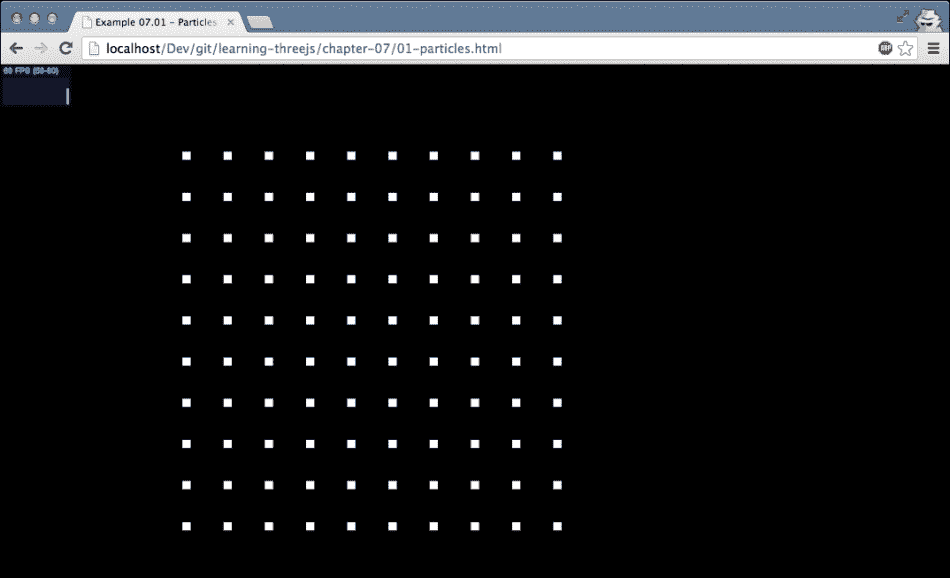
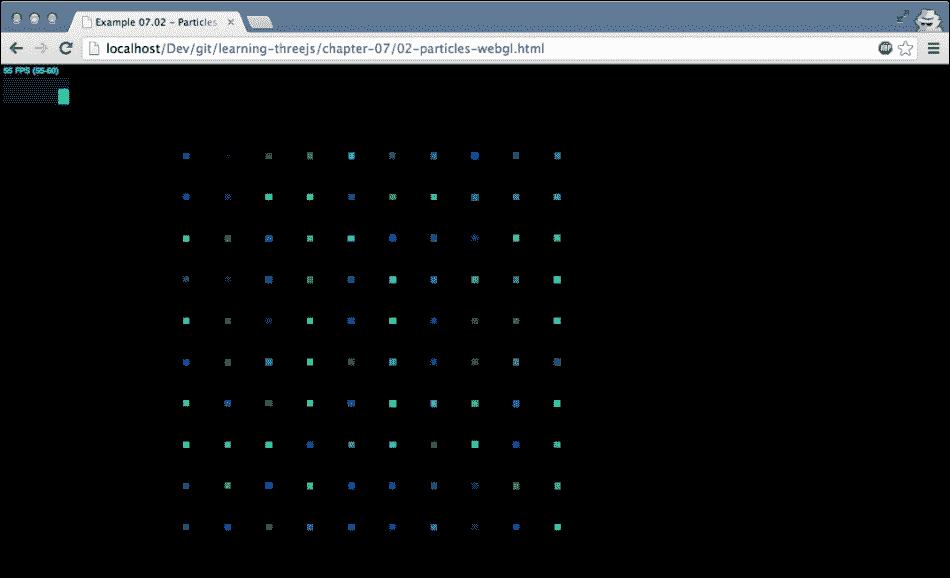
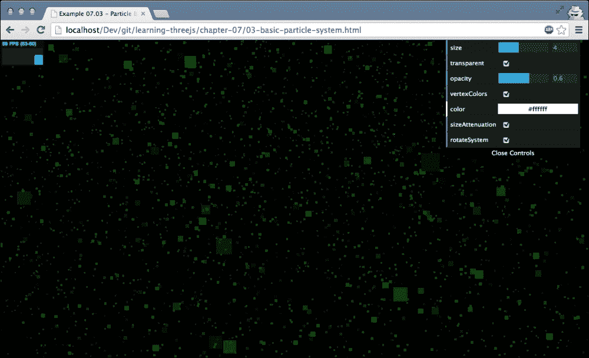
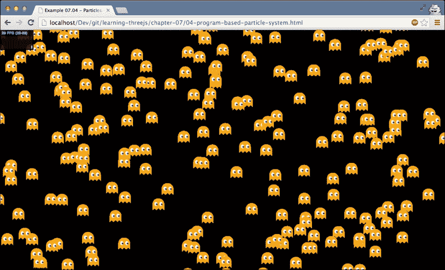
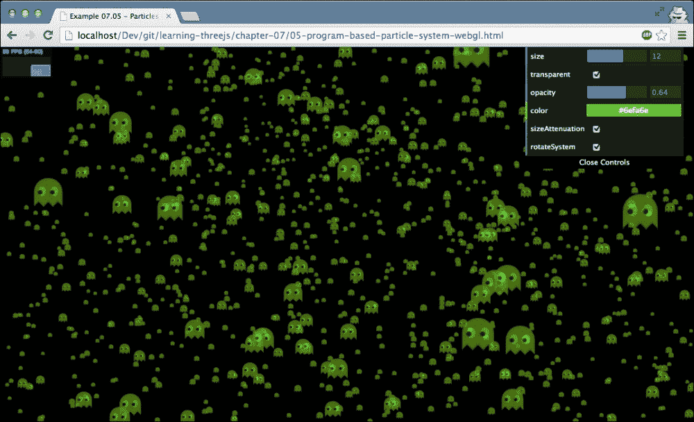
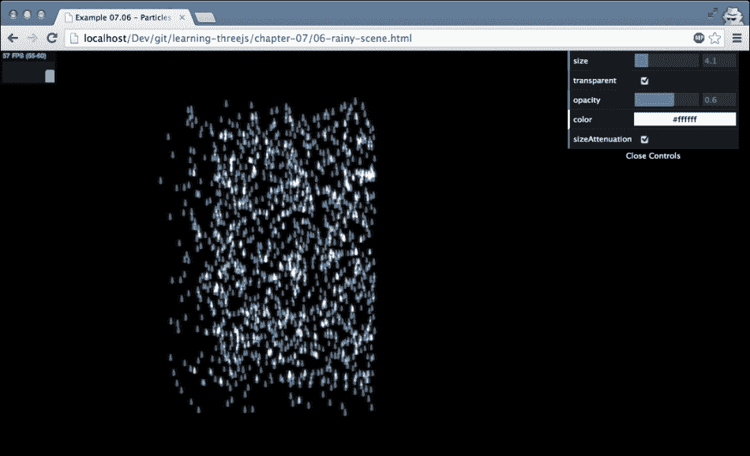
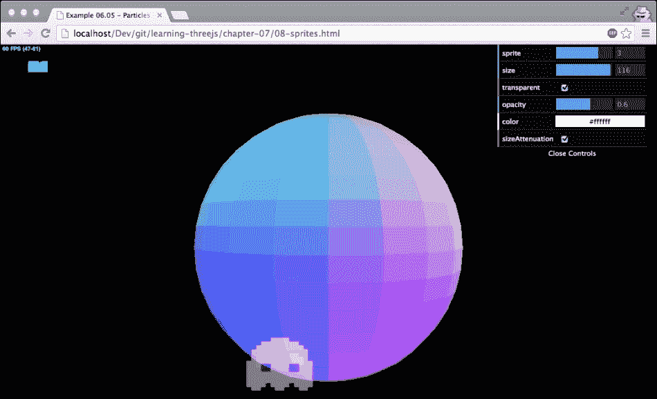
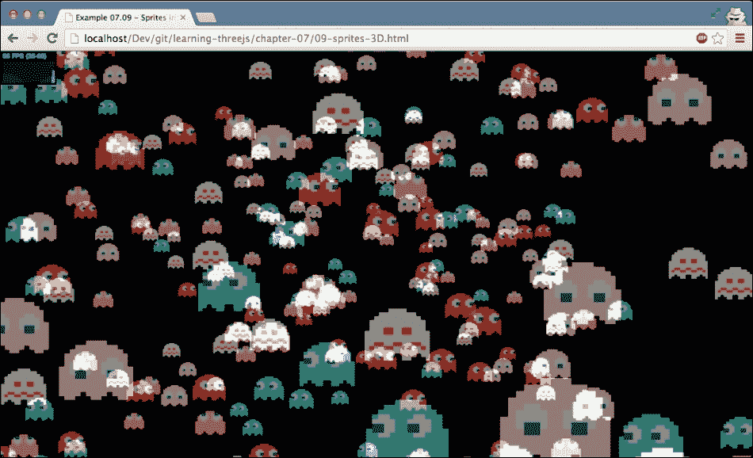
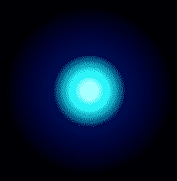

# 第七章 粒子、精灵和点云

在之前的章节中，我们讨论了 Three.js 提供的最重要的概念、对象和 API。在本章中，我们将研究到目前为止我们跳过的唯一概念：粒子。使用粒子（有时也称为精灵），非常容易创建许多小对象，你可以用来模拟雨、雪、烟雾和其他有趣的效果。例如，你可以将单个几何体渲染为一组粒子，并分别控制这些粒子。在本章中，我们将探索 Three.js 提供的各种粒子特性。更具体地说，在本章中，我们将研究以下主题：

+   使用`THREE.SpriteMaterial`创建和设置粒子的样式

+   使用点云创建一组分组的粒子

+   从现有几何体创建点云

+   动画粒子和粒子系统

+   使用纹理来设置粒子的样式

+   使用`THREE.SpriteCanvasMaterial`使用画布设置粒子的样式

让我们先来探讨一下什么是粒子，以及如何创建一个。不过，在我们开始之前，关于本章中使用的一些名称，有一个快速说明。在最近的 Three.js 版本中，与粒子相关的对象的名称已经发生了变化。我们在本章中使用的`THREE.PointCloud`，以前被称为`THREE.ParticleSystem`，`THREE.Sprite`以前被称为`THREE.Particle`，材质也经历了一些名称的变化。因此，如果你看到使用这些旧名称的在线示例，请记住它们谈论的是相同的概念。在本章中，我们使用了最新版本 Three.js 引入的新命名约定。

# 理解粒子

就像我们对大多数新概念一样，我们将从一个例子开始。在本章的源代码中，你会找到一个名为`01-particles.html`的例子。打开这个例子，你会看到一个非常不起眼的白色立方体网格，如下面的截图所示：



在这个截图中，你看到的是 100 个精灵。精灵是一个始终面向摄像机的二维平面。如果你创建一个没有任何属性的精灵，它们会被渲染为小的、白色的、二维的正方形。这些精灵是用以下代码创建的：

```js
function createSprites() {
  var material = new THREE.SpriteMaterial();
  for (var x = -5; x < 5; x++) {
    for (var y = -5; y < 5; y++) {
      var sprite = new THREE.Sprite(material);
      sprite.position.set(x * 10, y * 10, 0);
      scene.add(sprite);
    }
  }
}
```

在这个例子中，我们使用`THREE.Sprite(material)`构造函数手动创建精灵。我们传入的唯一项是一个材质。这必须是`THREE.SpriteMaterial`或`THREE.SpriteCanvasMaterial`。我们将在本章的其余部分更深入地研究这两种材质。

在我们继续研究更有趣的粒子之前，让我们更仔细地看一看`THREE.Sprite`对象。`THREE.Sprite`对象扩展自`THREE.Object3D`对象，就像`THREE.Mesh`一样。这意味着你可以使用大多数从`THREE.Mesh`中了解的属性和函数在`THREE.Sprite`上。你可以使用`position`属性设置其位置，使用`scale`属性缩放它，并使用`translate`属性相对移动它。

### 提示

请注意，在较旧版本的 Three.js 中，你无法使用`THREE.Sprite`对象与`THREE.WebGLRenderer`一起使用，只能与`THREE.CanvasRenderer`一起使用。在当前版本中，`THREE.Sprite`对象可以与两种渲染器一起使用。

使用`THREE.Sprite`，你可以非常容易地创建一组对象并在场景中移动它们。当你使用少量对象时，这很有效，但是当你想要使用大量`THREE.Sprite`对象时，你很快就会遇到性能问题，因为每个对象都需要被 Three.js 单独管理。Three.js 提供了另一种处理大量精灵（或粒子）的方法，使用`THREE.PointCloud`。使用`THREE.PointCloud`，Three.js 不需要单独管理许多个`THREE.Sprite`对象，而只需要管理`THREE.PointCloud`实例。

要获得与之前看到的屏幕截图相同的结果，但这次使用`THREE.PointCloud`，我们执行以下操作：

```js
function createParticles() {

  var geom = new THREE.Geometry();
  var material = new THREE.PointCloudMaterial({size: 4, vertexColors: true, color: 0xffffff});

  for (var x = -5; x < 5; x++) {
    for (var y = -5; y < 5; y++) {
      var particle = new THREE.Vector3(x * 10, y * 10, 0);
      geom.vertices.push(particle);
      geom.colors.push(new THREE.Color(Math.random() * 0x00ffff));
    }
  }

  var cloud = new THREE.PointCloud(geom, material);
  scene.add(cloud);
}
```

正如您所看到的，对于每个粒子（云中的每个点），我们需要创建一个顶点（由`THREE.Vector3`表示），将其添加到`THREE.Geometry`中，使用`THREE.Geometry`和`THREE.PointCloudMaterial`创建`THREE.PointCloud`，并将云添加到场景中。`THREE.PointCloud`的示例（带有彩色方块）可以在`02-particles-webgl.html`示例中找到。以下屏幕截图显示了此示例：



在接下来的几节中，我们将进一步探讨`THREE.PointCloud`。

# 粒子，THREE.PointCloud 和 THREE.PointCloudMaterial

在上一节的最后，我们快速介绍了`THREE.PointCloud`。`THREE.PointCloud`的构造函数接受两个属性：几何体和材质。材质用于着色和纹理粒子（稍后我们将看到），几何体定义了单个粒子的位置。用于定义几何体的每个顶点和每个点都显示为一个粒子。当我们基于`THREE.BoxGeometry`创建`THREE.PointCloud`时，我们会得到 8 个粒子，每个粒子代表立方体的每个角落。不过，通常情况下，您不会从标准的 Three.js 几何体之一创建`THREE.PointCloud`，而是手动将顶点添加到从头创建的几何体中（或使用外部加载的模型），就像我们在上一节的最后所做的那样。在本节中，我们将深入探讨这种方法，并查看如何使用`THREE.PointCloudMaterial`来设置粒子的样式。我们将使用`03-basic-point-cloud.html`示例来探索这一点。以下屏幕截图显示了此示例：



在此示例中，我们创建了`THREE.PointCloud`，并用 15000 个粒子填充它。所有粒子都使用`THREE.PointCloudMaterial`进行样式设置。要创建`THREE.PointCloud`，我们使用了以下代码：

```js
function createParticles(size, transparent, opacity, vertexColors, sizeAttenuation, color) {

  var geom = new THREE.Geometry();
  var material = new THREE.PointCloudMaterial({size: size, transparent: transparent, opacity: opacity, vertexColors: vertexColors, sizeAttenuation: sizeAttenuation, color: color});

  var range = 500;
  for (var i = 0; i < 15000; i++) {
    var particle = new THREE.Vector3(Math.random() * range - range / 2, Math.random() * range - range / 2, Math.random() * range - range / 2);
    geom.vertices.push(particle);
    var color = new THREE.Color(0x00ff00);
    color.setHSL(color.getHSL().h, color.getHSL().s, Math.random() * color.getHSL().l);
    geom.colors.push(color);
  }

  cloud = new THREE.PointCloud(geom, material);
  scene.add(cloud);
}
```

在此列表中，我们首先创建`THREE.Geometry`。我们将粒子表示为`THREE.Vector3`添加到此几何体中。为此，我们创建了一个简单的循环，以随机位置创建`THREE.Vector3`并将其添加。在同一个循环中，我们还指定了颜色数组`geom.colors`，当我们将`THREE.PointCloudMaterial`的`vertexColors`属性设置为`true`时使用。最后要做的是创建`THREE.PointCloudMaterial`并将其添加到场景中。

下表解释了您可以在`THREE.PointCloudMaterial`上设置的所有属性：

| 名称 | 描述 |
| --- | --- |
| `color` | 这是`ParticleSystem`中所有粒子的颜色。将`vertexColors`属性设置为 true，并使用几何体的颜色属性指定颜色会覆盖此属性（更准确地说，顶点的颜色将与此值相乘以确定最终颜色）。默认值为`0xFFFFFF`。 |
| map | 使用此属性，您可以将纹理应用于粒子。例如，您可以使它们看起来像雪花。此属性在此示例中未显示，但在本章后面会有解释。 |
| size | 这是粒子的大小。默认值为`1`。 |
| sizeAnnutation | 如果将其设置为 false，则所有粒子的大小都将相同，而不管它们距离摄像机的位置有多远。如果将其设置为 true，则大小基于距离摄像机的距离。默认值为`true`。 |
| vertexColors | 通常，`THREE.PointCloud`中的所有粒子都具有相同的颜色。如果将此属性设置为`THREE.VertexColors`并且填充了几何体中的颜色数组，则将使用该数组中的颜色（还请参阅此表中的颜色条目）。默认值为`THREE.NoColors`。 |
| opacity | 这与 transparent 属性一起设置了粒子的不透明度。默认值为`1`（不透明）。 |
| 透明 | 如果设置为 true，则粒子将以不透明度属性设置的不透明度进行渲染。默认值为`false`。 |
| 混合 | 这是渲染粒子时使用的混合模式。有关混合模式的更多信息，请参见第九章*动画和移动摄像机*。 |
| 雾 | 这决定了粒子是否受到添加到场景中的雾的影响。默认值为`true`。 |

上一个示例提供了一个简单的控制菜单，您可以使用它来实验特定于`THREE.ParticleCloudMaterial`的属性。

到目前为止，我们只将粒子呈现为小立方体，这是默认行为。然而，您还有一些其他方式可以用来设置粒子的样式：

+   我们可以应用`THREE.SpriteCanvasMaterial`（仅适用于`THREE.CanvasRenderer`）来使用 HTML 画布元素的结果作为纹理

+   使用`THREE.SpriteMaterial`和基于 HTML5 的纹理在使用`THREE.WebGLRenderer`时使用 HTML 画布的输出

+   使用`THREE.PointCloudMaterial`的`map`属性加载外部图像文件（或使用 HTML5 画布）来为`THREE.ParticleCloud`的所有粒子设置样式

在下一节中，我们将看看如何做到这一点。

# 使用 HTML5 画布对粒子进行样式设置

Three.js 提供了三种不同的方式，您可以使用 HTML5 画布来设置粒子的样式。如果您使用`THREE.CanvasRenderer`，您可以直接从`THREE.SpriteCanvasMaterial`引用 HTML5 画布。当您使用`THREE.WebGLRenderer`时，您需要采取一些额外的步骤来使用 HTML5 画布来设置粒子的样式。在接下来的两节中，我们将向您展示不同的方法。

## 使用 HTML5 画布与 THREE.CanvasRenderer

使用`THREE.SpriteCanvasMaterial`，您可以使用 HTML5 画布的输出作为粒子的纹理。这种材质是专门为`THREE.CanvasRenderer`创建的，并且只在使用这个特定的渲染器时才有效。在我们看如何使用这种材质之前，让我们先看看您可以在这种材质上设置的属性：

| 名称 | 描述 |
| --- | --- |
| `颜色` | 这是粒子的颜色。根据指定的`混合`模式，这会影响画布图像的颜色。 |
| `program` | 这是一个以画布上下文作为参数的函数。当粒子被渲染时，将调用此函数。对这个 2D 绘图上下文的调用的输出显示为粒子。 |
| `不透明度` | 这决定了粒子的不透明度。默认值为`1`，即不透明。 |
| `透明` | 这决定了粒子是否是透明的。这与`不透明度`属性一起使用。 |
| `混合` | 这是要使用的混合模式。有关更多详细信息，请参见第九章*动画和移动摄像机*。 |
| `旋转` | 这个属性允许您旋转画布的内容。通常需要将其设置为 PI，以正确对齐画布的内容。请注意，这个属性不能传递给材质的构造函数，而需要显式设置。 |

要查看`THREE.SpriteCanvasMaterial`的实际效果，您可以打开`04-program-based-sprites.html`示例。以下屏幕截图显示了这个例子：



在这个例子中，粒子是在`createSprites`函数中创建的：

```js
function createSprites() {

  var material = new THREE.SpriteCanvasMaterial({
    program: draw,
    color: 0xffffff});
   material.rotation = Math.PI;

  var range = 500;
  for (var i = 0; i < 1000; i++) {
    var sprite = new THREE.Sprite(material);
    sprite.position = new THREE.Vector3(Math.random() * range - range / 2, Math.random() * range - range / 2, Math.random() * range - range / 2);
    sprite.scale.set(0.1, 0.1, 0.1);
    scene.add(sprite);
  }
}
```

这段代码看起来很像我们在上一节中看到的代码。主要变化是，因为我们正在使用`THREE.CanvasRenderer`，我们直接创建`THREE.Sprite`对象，而不是使用`THREE.PointCloud`。在这段代码中，我们还使用`program`属性定义了`THREE.SpriteCanvasMaterial`，该属性指向`draw`函数。这个`draw`函数定义了粒子的外观（在我们的例子中，是*Pac-Man*中的幽灵）：

```js
var draw = function(ctx) {
  ctx.fillStyle = "orange";
  ...
  // lots of other ctx drawing calls
  ...
  ctx.beginPath();
  ctx.fill();
}
```

我们不会深入讨论绘制形状所需的实际画布代码。这里重要的是我们定义了一个接受 2D 画布上下文（`ctx`）作为参数的函数。在该上下文中绘制的一切都被用作`THREE.Sprite`的形状。

## 使用 HTML5 画布与 WebGLRenderer

如果我们想要在`THREE.WebGLRenderer`中使用 HTML5 画布，我们可以采取两种不同的方法。我们可以使用`THREE.PointCloudMaterial`并创建`THREE.PointCloud`，或者我们可以使用`THREE.Sprite`和`THREE.SpriteMaterial`的`map`属性。

让我们从第一种方法开始创建`THREE.PointCloud`。在`THREE.PointCloudMaterial`的属性中，我们提到了`map`属性。使用`map`属性，我们可以为粒子加载纹理。在 Three.js 中，这个纹理也可以是来自 HTML5 画布的输出。一个展示这个概念的例子是`05a-program-based-point-cloud-webgl.html`。以下截图显示了这个例子：



让我们来看看我们编写的代码来实现这个效果。大部分代码与我们之前的 WebGL 示例相同，所以我们不会详细介绍。为了得到这个例子所做的重要代码更改如下所示：

```js
var getTexture = function() {
  var canvas = document.createElement('canvas');
  canvas.width = 32;
  canvas.height = 32;

  var ctx = canvas.getContext('2d');
  ...
  // draw the ghost
  ...
  ctx.fill();
  var texture = new THREE.Texture(canvas);
  texture.needsUpdate = true;
  return texture;
}

function createPointCloud(size, transparent, opacity, sizeAttenuation, color) {

  var geom = new THREE.Geometry();

  var material = new THREE.PointCloudMaterial ({size: size, transparent: transparent, opacity: opacity, map: getTexture(), sizeAttenuation: sizeAttenuation, color: color});

  var range = 500;
  for (var i = 0; i < 5000; i++) {
    var particle = new THREE.Vector3(Math.random() * range - range / 2, Math.random() * range - range / 2, Math.random() * range - range / 2);
    geom.vertices.push(particle);
  }

  cloud = new THREE.PointCloud(geom, material);
  cloud.sortParticles = true;
  scene.add(cloud);
}
```

在`getTexture`中，这两个 JavaScript 函数中的第一个，我们基于 HTML5 画布元素创建了`THREE.Texture`。在第二个函数`createPointCloud`中，我们将这个纹理分配给了`THREE.PointCloudMaterial`的`map`属性。在这个函数中，您还可以看到我们将`THREE.PointCloud`的`sortParticles`属性设置为`true`。这个属性确保在粒子被渲染之前，它们根据屏幕上的*z*位置进行排序。如果您看到部分重叠的粒子或不正确的透明度，将此属性设置为`true`（在大多数情况下）可以解决这个问题。不过，您应该注意，将此属性设置为`true`会影响场景的性能。当这个属性设置为 true 时，Three.js 将不得不确定每个单独粒子到相机的距离。对于一个非常大的`THREE.PointCloud`对象，这可能会对性能产生很大的影响。

当我们谈论`THREE.PointCloud`的属性时，还有一个额外的属性可以设置在`THREE.PointCloud`上：`FrustumCulled`。如果将此属性设置为 true，这意味着如果粒子超出可见相机范围，它们将不会被渲染。这可以用来提高性能和帧速率。

这样做的结果是，我们在`getTexture()`方法中绘制到画布上的一切都用于`THREE.PointCloud`中的粒子。在接下来的部分中，我们将更深入地了解从外部文件加载的纹理是如何工作的。请注意，在这个例子中，我们只看到了纹理可能实现的一小部分。在第十章中，*加载和使用纹理*，我们将深入了解纹理的可能性。

在本节的开头，我们提到我们也可以使用`THREE.Sprite`与`map`属性一起创建基于画布的粒子。为此，我们使用了与前面示例中相同的方法创建`THREE.Texture`。然而，这一次，我们将它分配给`THREE.Sprite`，如下所示：

```js
function createSprites() {
  var material = new THREE.SpriteMaterial({
    map: getTexture(),
    color: 0xffffff
  });

  var range = 500;
  for (var i = 0; i < 1500; i++) {
    var sprite = new THREE.Sprite(material);
    sprite.position.set(Math.random() * range - range / 2, Math.random() * range - range / 2, Math.random() * range - range / 2);
    sprite.scale.set(4,4,4);
    scene.add(sprite);
  }
}
```

在这里，你可以看到我们使用了一个标准的`THREE.SpriteMaterial`对象，并将画布的输出作为`THREE.Texture`分配给了材质的`map`属性。您可以通过在浏览器中打开`05b-program-based-sprites-webgl.html`来查看这个例子。这两种方法各有优缺点。使用`THREE.Sprite`，您可以更好地控制每个粒子，但当您处理大量粒子时，性能会降低，复杂性会增加。使用`THREE.PointCloud`，您可以轻松管理大量粒子，但对每个单独的粒子的控制较少。

# 使用纹理来设置粒子的样式

在之前的例子中，我们看到了如何使用 HTML5 画布来设置`THREE.PointCloud`和单个`THREE.Sprite`对象的样式。由于您可以绘制任何您想要的东西，甚至加载外部图像，您可以使用这种方法向粒子系统添加各种样式。然而，有一种更直接的方法可以使用图像来设置您的粒子的样式。您可以使用`THREE.ImageUtils.loadTexture()`函数将图像加载为`THREE.Texture`。然后可以将`THREE.Texture`分配给材质的`map`属性。

在本节中，我们将向您展示两个示例并解释如何创建它们。这两个示例都使用图像作为粒子的纹理。在第一个示例中，我们创建了一个模拟雨的场景，`06-rainy-scene.html`。以下屏幕截图显示了这个示例：



我们需要做的第一件事是获取一个代表雨滴的纹理。您可以在`assets/textures/particles`文件夹中找到一些示例。在第九章*动画和移动相机*中，我们将解释纹理的所有细节和要求。现在，您需要知道的是纹理应该是正方形的，最好是 2 的幂（例如，64 x 64，128 x 128，256 x 256）。对于这个例子，我们将使用这个纹理：


这个图像使用了黑色背景（需要正确混合）并显示了雨滴的形状和颜色。在我们可以在`THREE.PointCloudMaterial`中使用这个纹理之前，我们首先需要加载它。可以用以下代码行来完成：

```js
var texture = THREE.ImageUtils.loadTexture("../assets/textures/particles/raindrop-2.png");
```

有了这行代码，Three.js 将加载纹理，我们可以在我们的材质中使用它。对于这个例子，我们定义了这样的材质：

```js
var material = new THREE.PointCloudMaterial({size: 3, transparent: true, opacity: true, map: texture, blending: THREE.AdditiveBlending, sizeAttenuation: true, color: 0xffffff});
```

在本章中，我们已经讨论了所有这些属性。这里需要理解的主要是`map`属性指向我们使用`THREE.ImageUtils.loadTexture()`函数加载的纹理，并且我们将`THREE.AdditiveBlending`指定为`blending`模式。这种`blending`模式意味着当绘制新像素时，背景像素的颜色会添加到这个新像素的颜色中。对于我们的雨滴纹理，这意味着黑色背景不会显示出来。一个合理的替代方案是用透明背景替换我们纹理中的黑色，但遗憾的是这在粒子和 WebGL 中不起作用。

这样就处理了`THREE.PointCloud`的样式。当您打开这个例子时，您还会看到粒子本身在移动。在之前的例子中，我们移动了整个粒子系统；这一次，我们在`THREE.PointCloud`内部定位了单个粒子。这样做实际上非常简单。每个粒子都表示为构成用于创建`THREE.PointCloud`的几何体的顶点。让我们看看如何为`THREE.PointCloud`添加粒子：

```js
var range = 40;
for (var i = 0; i < 1500; i++) {
  var particle = new THREE.Vector3(Math.random() * range - range / 2, Math.random() * range * 1.5, Math.random() * range - range / 2);

  particle.velocityX = (Math.random() - 0.5) / 3;
  particle.velocityY = 0.1 + (Math.random() / 5);
  geom.vertices.push(particle);
}
```

这与我们之前看到的例子并没有太大不同。在这里，我们为每个粒子（`THREE.Vector3`）添加了两个额外的属性：`velocityX`和`velocityY`。第一个定义了粒子（雨滴）水平移动的方式，第二个定义了雨滴下落的速度。水平速度范围从-0.16 到+0.16，垂直速度范围从 0.1 到 0.3。现在每个雨滴都有自己的速度，我们可以在渲染循环中移动单个粒子：

```js
var vertices = system2.geometry.vertices;
vertices.forEach(function (v) {
  v.x = v.x - (v.velocityX);
  v.y = v.y - (v.velocityY);

  if (v.x <= -20 || v.x >= 20) v.velocityX = v.velocityX * -1;
  if (v.y <= 0) v.y = 60;
});
```

在这段代码中，我们从用于创建`THREE.PointCloud`的几何体中获取所有`vertices`（粒子）。对于每个粒子，我们取`velocityX`和`velocityY`并使用它们来改变粒子的当前位置。最后两行确保粒子保持在我们定义的范围内。如果`v.y`位置低于零，我们将雨滴添加回顶部，如果`v.x`位置达到任何边缘，我们通过反转水平速度使其反弹回来。

让我们看另一个例子。这一次，我们不会下雨，而是下雪。此外，我们不仅使用单一纹理，还将使用五个单独的图像（来自 Three.js 示例）。让我们首先再次看一下结果（参见`07-snowy-scene.html`）：


在前面的截图中，您可以看到我们不仅使用单个图像作为纹理，还使用了多个图像。您可能想知道我们是如何做到这一点的。您可能还记得，我们只能为`THREE.PointCloud`有一个单一的材质。如果我们想要有多个材质，我们只需要创建多个粒子系统，如下所示：

```js
function createPointClouds(size, transparent, opacity, sizeAttenuation, color) {

  var texture1 = THREE.ImageUtils.loadTexture("../assets/textures/particles/snowflake1.png");
  var texture2 = THREE.ImageUtils.loadTexture("../assets/textures/particles/snowflake2.png");
  var texture3 = THREE.ImageUtils.loadTexture("../assets/textures/particles/snowflake3.png");
  var texture4 = THREE.ImageUtils.loadTexture("../assets/textures/particles/snowflake5.png");

  scene.add(createPointCloud("system1", texture1, size, transparent, opacity, sizeAttenuation, color));
  scene.add(createPointCloud ("system2", texture2, size, transparent, opacity, sizeAttenuation, color));
  scene.add(createPointCloud ("system3", texture3, size, transparent, opacity, sizeAttenuation, color));
  scene.add(createPointCloud ("system4", texture4, size, transparent, opacity, sizeAttenuation, color));
}
```

在这里，您可以看到我们分别加载纹理，并将创建`THREE.PointCloud`的所有信息传递给`createPointCloud`函数。这个函数看起来像这样：

```js
function createPointCloud(name, texture, size, transparent, opacity, sizeAttenuation, color) {
  var geom = new THREE.Geometry();

  var color = new THREE.Color(color);
  color.setHSL(color.getHSL().h, color.getHSL().s, (Math.random()) * color.getHSL().l);

  var material = new THREE.PointCloudMaterial({size: size, transparent: transparent, opacity: opacity, map: texture, blending: THREE.AdditiveBlending, depthWrite: false, sizeAttenuation: sizeAttenuation, color: color});

  var range = 40;
  for (var i = 0; i < 50; i++) {
    var particle = new THREE.Vector3(Math.random() * range - range / 2, Math.random() * range * 1.5, Math.random() * range - range / 2);
    particle.velocityY = 0.1 + Math.random() / 5;
    particle.velocityX = (Math.random() - 0.5) / 3;
    particle.velocityZ = (Math.random() - 0.5) / 3;
    geom.vertices.push(particle);
  }

  var cloud = new THREE.ParticleCloud(geom, material);
  cloud.name = name;
  cloud.sortParticles = true;
  return cloud;
}
```

在这个函数中，我们首先定义了应该渲染为特定纹理的粒子的颜色。这是通过随机改变传入颜色的*亮度*来完成的。接下来，材质以与之前相同的方式创建。这里唯一的变化是`depthWrite`属性设置为`false`。这个属性定义了这个对象是否影响 WebGL 深度缓冲区。通过将其设置为`false`，我们确保各种点云不会相互干扰。如果这个属性没有设置为`false`，您会看到当一个粒子在另一个`THREE.PointCloud`对象的粒子前面时，有时会显示纹理的黑色背景。这段代码的最后一步是随机放置粒子并为每个粒子添加随机速度。在渲染循环中，我们现在可以像这样更新每个`THREE.PointCloud`对象的所有粒子的位置：

```js
scene.children.forEach(function (child) {
  if (child instanceof THREE.ParticleSystem) {
    var vertices = child.geometry.vertices;
    vertices.forEach(function (v) {
      v.y = v.y - (v.velocityY);
      v.x = v.x - (v.velocityX);
      v.z = v.z - (v.velocityZ);

      if (v.y <= 0) v.y = 60;
      if (v.x <= -20 || v.x >= 20) v.velocityX = v.velocityX * -1;
      if (v.z <= -20 || v.z >= 20) v.velocityZ = v.velocityZ * -1;
    });
  }
});
```

通过这种方法，我们可以拥有不同纹理的粒子。然而，这种方法有点受限。我们想要的不同纹理越多，我们就必须创建和管理更多的点云。如果您有一组不同样式的有限粒子，最好使用我们在本章开头展示的`THREE.Sprite`对象。

# 使用精灵地图

在本章的开头，我们使用了`THREE.Sprite`对象来使用`THREE.CanvasRenderer`和`THREE.WebGLRenderer`渲染单个粒子。这些精灵被放置在 3D 世界的某个地方，并且它们的大小是基于与摄像机的距离（有时也称为**billboarding**）。在本节中，我们将展示`THREE.Sprite`对象的另一种用法。我们将向您展示如何使用`THREE.Sprite`创建类似于**抬头显示**（**HUD**）的 3D 内容的图层，使用额外的`THREE.OrthographicCamera`实例。我们还将向您展示如何使用精灵地图为`THREE.Sprite`对象选择图像。

作为示例，我们将创建一个简单的`THREE.Sprite`对象，它从屏幕左侧移动到右侧。在背景中，我们将渲染一个带有移动摄像机的 3D 场景，以说明`THREE.Sprite`独立于摄像机移动。以下截图显示了我们将为第一个示例创建的内容（`08-sprites.html`）：



如果您在浏览器中打开此示例，您将看到类似 Pac-Man 幽灵的精灵在屏幕上移动，并且每当它碰到右边缘时，颜色和形状都会发生变化。我们首先要做的是看一下我们如何创建`THREE.OrthographicCamera`和一个单独的场景来渲染`THREE.Sprite`：

```js
var sceneOrtho = new THREE.Scene();
var cameraOrtho = new THREE.OrthographicCamera( 0, window.innerWidth, window.innerHeight, 0, -10, 10 );
```

接下来，让我们看看`THREE.Sprite`的构造以及精灵可以采用的各种形状是如何加载的：

```js
function getTexture() {
  var texture = new THREE.ImageUtils.loadTexture("../assets/textures/particles/sprite-sheet.png");
  return texture;
}

function createSprite(size, transparent, opacity, color, spriteNumber) {
  var spriteMaterial = new THREE.SpriteMaterial({
    opacity: opacity,
    color: color,
    transparent: transparent,
    map: getTexture()});

  // we have 1 row, with five sprites
  spriteMaterial.map.offset = new THREE.Vector2(1/5 * spriteNumber, 0);
  spriteMaterial.map.repeat = new THREE.Vector2(1/5, 1);
  spriteMaterial.blending = THREE.AdditiveBlending;

  // makes sure the object is always rendered at the front
  spriteMaterial.depthTest = false;
  var sprite = new THREE.Sprite(spriteMaterial);
  sprite.scale.set(size, size, size);
  sprite.position.set(100, 50, 0);
  sprite.velocityX = 5;

  sceneOrtho.add(sprite);
}
```

在`getTexture()`函数中，我们加载了一个纹理。但是，我们加载的不是每个*ghost*的五个不同图像，而是加载了一个包含所有精灵的单个纹理。纹理看起来像这样：


通过`map.offset`和`map.repeat`属性，我们选择要在屏幕上显示的正确精灵。使用`map.offset`属性，我们确定了我们加载的纹理在*x*轴（u）和*y*轴（v）上的偏移量。这些属性的比例范围从 0 到 1。在我们的示例中，如果我们想选择第三个幽灵，我们将 u 偏移（*x*轴）设置为 0.4，因为我们只有一行，所以我们不需要改变 v 偏移（*y*轴）。如果我们只设置这个属性，纹理会在屏幕上压缩显示第三、第四和第五个幽灵。要只显示一个幽灵，我们需要放大。我们通过将 u 值的`map.repeat`属性设置为 1/5 来实现这一点。这意味着我们放大（仅对*x*轴）以仅显示纹理的 20％，这正好是一个幽灵。

我们需要采取的最后一步是更新`render`函数：

```js
webGLRenderer.render(scene, camera);
webGLRenderer.autoClear = false;
webGLRenderer.render(sceneOrtho, cameraOrtho);
```

我们首先使用普通相机和移动的球体渲染场景，然后再渲染包含我们的精灵的场景。请注意，我们需要将 WebGLRenderer 的`autoClear`属性设置为`false`。如果不这样做，Three.js 将在渲染精灵之前清除场景，并且球体将不会显示出来。

以下表格显示了我们在前面示例中使用的`THREE.SpriteMaterial`的所有属性的概述：

| 名称 | 描述 |
| --- | --- |
| `color` | 这是精灵的颜色。 |
| `map` | 这是要用于此精灵的纹理。这可以是一个精灵表，就像本节示例中所示的那样。 |
| `sizeAnnutation` | 如果设置为`false`，精灵的大小不会受到其与相机的距离影响。默认值为`true`。 |
| `opacity` | 这设置了精灵的透明度。默认值为`1`（不透明）。 |
| `blending` | 这定义了在渲染精灵时要使用的混合模式。有关混合模式的更多信息，请参见第九章*动画和移动相机*。 |
| `fog` | 这确定精灵是否受到添加到场景中的雾的影响。默认为`true`。 |

您还可以在此材质上设置`depthTest`和`depthWrite`属性。有关这些属性的更多信息，请参见第四章*使用 Three.js 材质*。

当然，在 3D 中定位`THREE.Sprites`时，我们也可以使用精灵地图（就像本章开头所做的那样）。以下是一个示例（`09-sprites-3D.html`）的屏幕截图：



通过前表中的属性，我们可以很容易地创建前面屏幕截图中看到的效果：

```js
function createSprites() {

  group = new THREE.Object3D();
  var range = 200;
  for (var i = 0; i < 400; i++) {
    group.add(createSprite(10, false, 0.6, 0xffffff, i % 5, range));
  }
  scene.add(group);
}

function createSprite(size, transparent, opacity, color, spriteNumber, range) {

  var spriteMaterial = new THREE.SpriteMaterial({
    opacity: opacity,
    color: color,
    transparent: transparent,
    map: getTexture()}
  );

  // we have 1 row, with five sprites
  spriteMaterial.map.offset = new THREE.Vector2(0.2*spriteNumber, 0);
  spriteMaterial.map.repeat = new THREE.Vector2(1/5, 1);
  spriteMaterial.depthTest = false;

  spriteMaterial.blending = THREE.AdditiveBlending;

  var sprite = new THREE.Sprite(spriteMaterial);
  sprite.scale.set(size, size, size);
  sprite.position.set(Math.random() * range - range / 2, Math.random() * range - range / 2, Math.random() * range - range / 2);
  sprite.velocityX = 5;

  return sprite;
}
```

在这个示例中，我们基于我们之前展示的精灵表创建了 400 个精灵。您可能已经了解并理解了这里显示的大多数属性和概念。由于我们已经将单独的精灵添加到了一个组中，因此旋转它们非常容易，可以像这样完成：

```js
group.rotation.x+=0.1;
```

到目前为止，在本章中，我们主要是从头开始创建精灵和点云。不过，一个有趣的选择是从现有几何体创建`THREE.PointCloud`。

# 从高级几何体创建 THREE.PointCloud

正如您记得的那样，`THREE.PointCloud`根据提供的几何体的顶点渲染每个粒子。这意味着，如果我们提供一个复杂的几何体（例如环结或管道），我们可以基于该特定几何体的顶点创建`THREE.PointCloud`。在本章的最后一节中，我们将创建一个环结，就像我们在上一章中看到的那样，并将其渲染为`THREE.PointCloud`。

我们已经在上一章中解释了环结，所以在这里我们不会详细介绍。我们使用了上一章的确切代码，并添加了一个单一的菜单选项，您可以使用它将渲染的网格转换为`THREE.PointCloud`。您可以在本章的源代码中找到示例（`10-create-particle-system-from-model.html`）。以下截图显示了示例：


在前面的截图中，您可以看到用于生成环结的每个顶点都被用作粒子。在这个例子中，我们添加了一个漂亮的材质，基于 HTML 画布，以创建这种发光效果。我们只会看一下创建材质和粒子系统的代码，因为在本章中我们已经讨论了其他属性：

```js
function generateSprite() {

  var canvas = document.createElement('canvas');
  canvas.width = 16;
  canvas.height = 16;

  var context = canvas.getContext('2d');
  var gradient = context.createRadialGradient(canvas.width / 2, canvas.height / 2, 0, canvas.width / 2, canvas.height / 2, canvas.width / 2);

  gradient.addColorStop(0, 'rgba(255,255,255,1)');
  gradient.addColorStop(0.2, 'rgba(0,255,255,1)');
  gradient.addColorStop(0.4, 'rgba(0,0,64,1)');
  gradient.addColorStop(1, 'rgba(0,0,0,1)');

  context.fillStyle = gradient;
  context.fillRect(0, 0, canvas.width, canvas.height);

  var texture = new THREE.Texture(canvas);
  texture.needsUpdate = true;
  return texture;
}

function createPointCloud(geom) {
  var material = new THREE.PointCloudMaterial({
    color: 0xffffff,
    size: 3,
    transparent: true,
    blending: THREE.AdditiveBlending,
    map: generateSprite()
  });

  var cloud = new THREE.PointCloud(geom, material);
  cloud.sortParticles = true;
  return cloud;
}

// use it like this
var geom = new THREE.TorusKnotGeometry(...);
var knot = createPointCloud(geom);
```

在这段代码片段中，您可以看到两个函数：`createPointCloud()`和`generateSprite()`。在第一个函数中，我们直接从提供的几何体（在本例中是一个环结）创建了一个简单的`THREE.PointCloud`对象，并使用`generateSprite()`函数设置了纹理（`map`属性）为一个发光的点（在 HTML5 画布元素上生成）。`generateSprite()`函数如下：



# 总结

这一章就到这里了。我们解释了粒子、精灵和粒子系统是什么，以及如何使用可用的材质来设计这些对象。在本章中，您看到了如何直接在`THREE.CanvasRenderer`和`THREE.WebGLRenderer`中使用`THREE.Sprite`。然而，如果您想创建大量的粒子，您应该使用`THREE.PointCloud`。使用`THREE.PointCloud`，所有粒子共享相同的材质，您可以通过将材质的`vertexColors`属性设置为`THREE.VertexColors`，并在用于创建`THREE.PointCloud`的`THREE.Geometry`的`colors`数组中提供颜色值来更改单个粒子的颜色。我们还展示了如何通过改变它们的位置轻松地对粒子进行动画。这对于单个`THREE.Sprite`实例和用于创建`THREE.PointCloud`的几何体的顶点是一样的。

到目前为止，我们已经根据 Three.js 提供的几何创建了网格。这对于简单的模型如球体和立方体非常有效，但当您想要创建复杂的 3D 模型时，并不是最佳方法。对于这些模型，通常会使用 3D 建模应用程序，如 Blender 或 3D Studio Max。在下一章中，您将学习如何加载和显示这些 3D 建模应用程序创建的模型。
