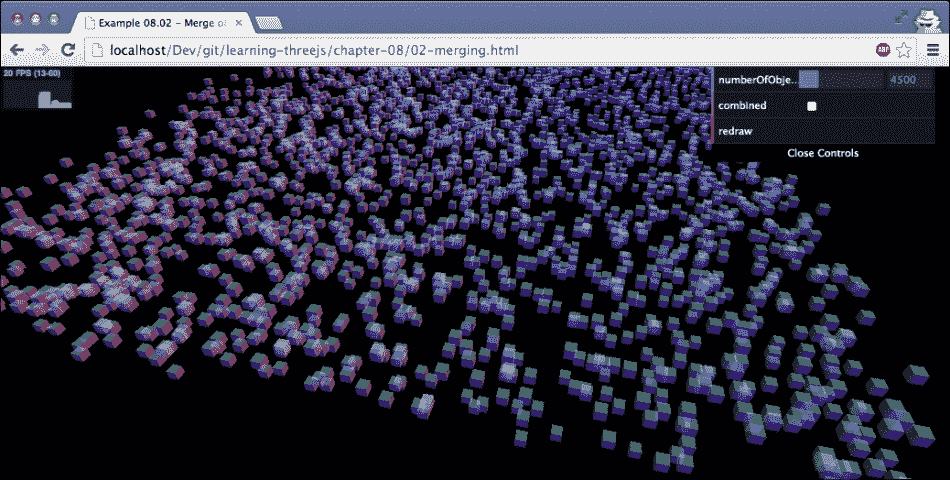
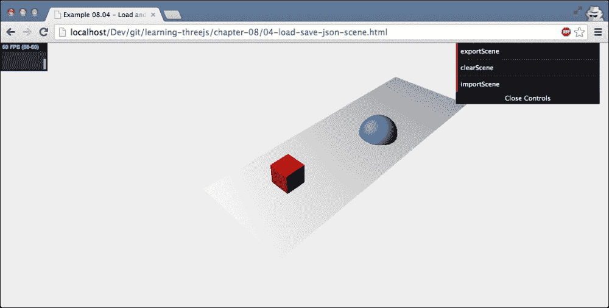
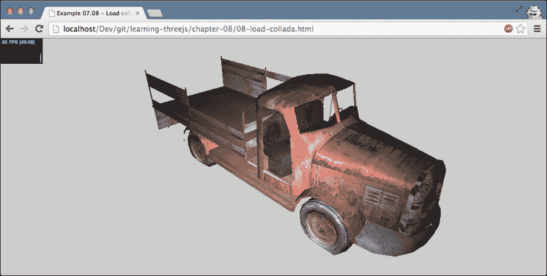
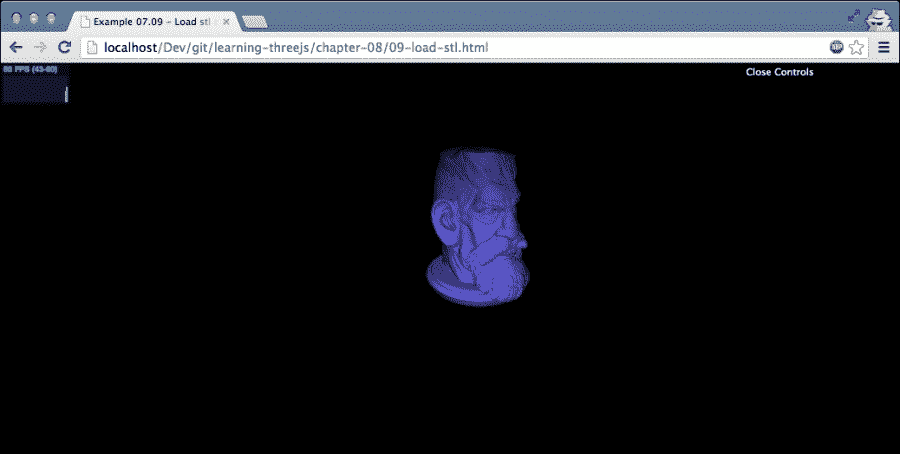
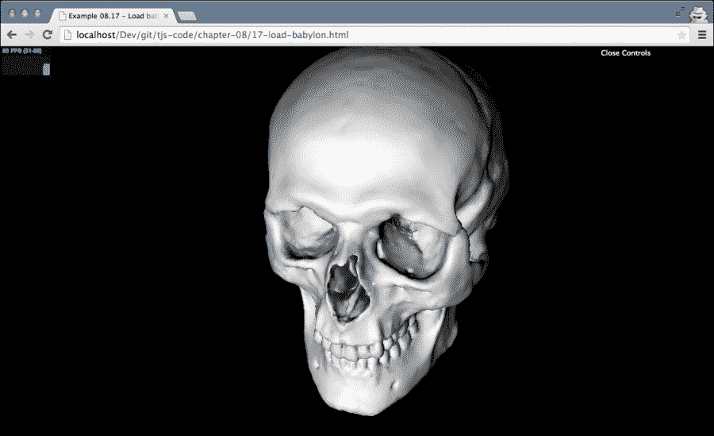
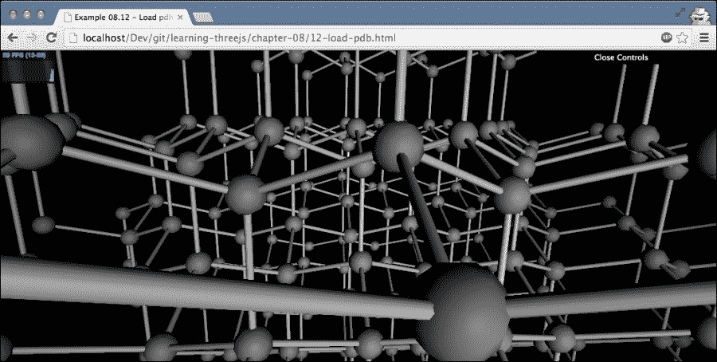

# 第八章。创建和加载高级网格和几何

在这一章中，我们将看一下创建高级和复杂几何和网格的几种不同方法。在第五章，“学习使用几何”，和第六章，“高级几何和二进制操作”中，我们向您展示了如何使用 Three.js 的内置对象创建一些高级几何。在这一章中，我们将使用以下两种方法来创建高级几何和网格：

+   **组合和合并**：我们解释的第一种方法使用了 Three.js 的内置功能来组合和合并现有的几何。这样可以从现有对象创建新的网格和几何。

+   **从外部加载**：在本节中，我们将解释如何从外部来源加载网格和几何。例如，我们将向您展示如何使用 Blender 以 Three.js 支持的格式导出网格。

我们从*组合和合并*方法开始。使用这种方法，我们使用标准的 Three.js 分组和`THREE.Geometry.merge()`函数来创建新对象。

# 几何组合和合并

在本节中，我们将介绍 Three.js 的两个基本功能：将对象组合在一起和将多个网格合并成单个网格。我们将从将对象组合在一起开始。

## 将对象组合在一起

在之前的一些章节中，当您使用多个材质时已经看到了这一点。当您使用多个材质从几何创建网格时，Three.js 会创建一个组。您的几何的多个副本被添加到这个组中，每个副本都有自己特定的材质。这个组被返回，所以看起来像是使用多个材质的网格。然而，实际上，它是一个包含多个网格的组。

创建组非常容易。您创建的每个网格都可以包含子元素，可以使用 add 函数添加子元素。将子对象添加到组中的效果是，您可以移动、缩放、旋转和平移父对象，所有子对象也会受到影响。让我们看一个例子（`01-grouping.html`）。以下屏幕截图显示了这个例子：


在这个例子中，您可以使用菜单来移动球体和立方体。如果您勾选**旋转**选项，您会看到这两个网格围绕它们的中心旋转。这并不是什么新鲜事，也不是很令人兴奋。然而，这两个对象并没有直接添加到场景中，而是作为一个组添加的。以下代码概括了这个讨论：

```js
sphere = createMesh(new THREE.SphereGeometry(5, 10, 10));
cube = createMesh(new THREE.BoxGeometry(6, 6, 6));

group = new THREE.Object3D();
group.add(sphere);
group.add(cube);

scene.add(group);
```

在这段代码片段中，您可以看到我们创建了`THREE.Object3D`。这是`THREE.Mesh`和`THREE.Scene`的基类，但本身并不包含任何内容或导致任何内容被渲染。请注意，在最新版本的 Three.js 中，引入了一个名为`THREE.Group`的新对象来支持分组。这个对象与`THREE.Object3D`对象完全相同，您可以用`new THREE.Group()`替换前面代码中的`new THREE.Object3D()`以获得相同的效果。在这个例子中，我们使用`add`函数将`sphere`和`cube`添加到这个对象，然后将它添加到`scene`中。如果您查看这个例子，您仍然可以移动立方体和球体，以及缩放和旋转这两个对象。您也可以在它们所在的组上进行这些操作。如果您查看组菜单，您会看到位置和缩放选项。您可以使用这些选项来缩放和移动整个组。这个组内部对象的缩放和位置是相对于组本身的缩放和位置的。

缩放和定位非常简单。但需要记住的一点是，当您旋转一个组时，它不会单独旋转其中的对象；它会围绕自己的中心旋转（在我们的示例中，您会围绕`group`对象的中心旋转整个组）。在这个示例中，我们使用`THREE.ArrowHelper`对象在组的中心放置了一个箭头，以指示旋转点：

```js
var arrow = new THREE.ArrowHelper(new THREE.Vector3(0, 1, 0), group.position, 10, 0x0000ff);
scene.add(arrow);
```

如果您同时选中**分组**和**旋转**复选框，组将会旋转。您会看到球体和立方体围绕组的中心旋转（由箭头指示），如下所示：


在使用组时，您仍然可以引用、修改和定位单个几何体。您需要记住的是，所有位置、旋转和平移都是相对于父对象进行的。在下一节中，我们将看看合并，您将合并多个单独的几何体，并最终得到一个单个的`THREE.Geometry`对象。

## 将多个网格合并成单个网格

在大多数情况下，使用组可以让您轻松操作和管理大量网格。然而，当您处理大量对象时，性能将成为一个问题。使用组时，您仍然在处理需要单独处理和渲染的单个对象。使用`THREE.Geometry.merge()`，您可以合并几何体并创建一个组合的几何体。在下面的示例中，您可以看到这是如何工作的，以及它对性能的影响。如果您打开`02-merging.html`示例，您会看到一个场景，其中有一组随机分布的半透明立方体。在菜单中使用滑块，您可以设置场景中立方体的数量，并通过单击**重绘**按钮重新绘制场景。根据您运行的硬件，随着立方体数量的增加，您会看到性能下降。在我们的案例中，如下截图所示，在大约 4,000 个对象时，刷新率会从正常的 60 fps 降至约 40 fps：



如您所见，您可以向场景中添加的网格数量存在一定限制。不过，通常情况下，您可能不需要那么多网格，但是在创建特定游戏（例如像*Minecraft*这样的游戏）或高级可视化时，您可能需要管理大量单独的网格。使用`THREE.Geometry.merge()`，您可以解决这个问题。在查看代码之前，让我们运行相同的示例，但这次选中**合并**框。通过标记此选项，我们将所有立方体合并为单个`THREE.Geometry`，并添加该对象，如下截图所示：


如您所见，我们可以轻松渲染 20,000 个立方体而不会出现性能下降。为此，我们使用以下几行代码：

```js
var geometry = new THREE.Geometry();
for (var i = 0; i < controls.numberOfObjects; i++) {
  var cubeMesh = addcube();
  cubeMesh.updateMatrix();
  geometry.merge(cubeMesh.geometry,cubeMesh.matrix);
}
scene.add(new THREE.Mesh(geometry, cubeMaterial));
```

在此代码片段中，`addCube()`函数返回`THREE.Mesh`。在较早版本的 Three.js 中，我们可以使用`THREE.GeometryUtils.merge`函数将`THREE.Mesh`对象合并到`THREE.Geometry`对象中。但在最新版本中，这个功能已经被弃用，取而代之的是`THREE.Geometry.merge`函数。为了确保合并的`THREE.Geometry`对象被正确定位和旋转，我们不仅向`merge`函数提供`THREE.Geometry`，还提供其变换矩阵。当我们将这个矩阵添加到`merge`函数时，我们合并的立方体将被正确定位。

我们这样做了 20,000 次，最后得到一个单一的几何图形，我们将其添加到场景中。如果您查看代码，您可能会看到这种方法的一些缺点。由于您得到了一个单一的几何图形，您无法为每个单独的立方体应用材质。然而，这可以通过使用`THREE.MeshFaceMaterial`来解决。然而，最大的缺点是您失去了对单个立方体的控制。如果您想要移动、旋转或缩放单个立方体，您无法做到（除非您搜索正确的面和顶点并单独定位它们）。

通过分组和合并方法，您可以使用 Three.js 提供的基本几何图形创建大型和复杂的几何图形。如果您想创建更高级的几何图形，那么使用 Three.js 提供的编程方法并不总是最佳和最简单的选择。幸运的是，Three.js 还提供了其他几种选项来创建几何图形。在下一节中，我们将看看如何从外部资源加载几何图形和网格。

## 从外部资源加载几何图形

Three.js 可以读取多种 3D 文件格式，并导入这些文件中定义的几何图形和网格。以下表格显示了 Three.js 支持的文件格式：

| 格式 | 描述 |
| --- | --- |
| JSON | Three.js 有自己的 JSON 格式，您可以用它来声明性地定义几何图形或场景。尽管这不是官方格式，但在想要重用复杂几何图形或场景时，它非常易于使用并非常方便。 |
| OBJ 或 MTL | OBJ 是由**Wavefront Technologies**首次开发的简单 3D 格式。它是最广泛采用的 3D 文件格式之一，用于定义对象的几何形状。MTL 是 OBJ 的伴随格式。在 MTL 文件中，指定了 OBJ 文件中对象的材质。Three.js 还有一个名为 OBJExporter.js 的自定义 OBJ 导出器，如果您想要从 Three.js 导出模型到 OBJ，可以使用它。 |
| Collada | Collada 是一种用于以基于 XML 的格式定义*数字资产*的格式。这也是一种被几乎所有 3D 应用程序和渲染引擎支持的广泛使用的格式。 |
| STL | **STL**代表**STereoLithography**，广泛用于快速原型制作。例如，3D 打印机的模型通常定义为 STL 文件。Three.js 还有一个名为 STLExporter.js 的自定义 STL 导出器，如果您想要从 Three.js 导出模型到 STL，可以使用它。 |
| CTM | CTM 是由**openCTM**创建的文件格式。它用作以紧凑格式存储 3D 三角形网格的格式。 |
| VTK | VTK 是由**可视化工具包**定义的文件格式，用于指定顶点和面。有两种可用格式：二进制格式和基于文本的 ASCII 格式。Three.js 仅支持基于 ASCII 的格式。 |
| AWD | AWD 是用于 3D 场景的二进制格式，最常与[`away3d.com/`](http://away3d.com/)引擎一起使用。请注意，此加载器不支持压缩的 AWD 文件。 |
| Assimp | 开放资产导入库（也称为**Assimp**）是导入各种 3D 模型格式的标准方式。使用此加载器，您可以导入使用**assimp2json**转换的大量 3D 格式的模型，有关详细信息，请访问[`github.com/acgessler/assimp2json`](https://github.com/acgessler/assimp2json)。 |
| VRML | **VRML**代表**虚拟现实建模语言**。这是一种基于文本的格式，允许您指定 3D 对象和世界。它已被 X3D 文件格式取代。Three.js 不支持加载 X3D 模型，但这些模型可以很容易地转换为其他格式。更多信息可以在[`www.x3dom.org/?page_id=532#`](http://www.x3dom.org/?page_id=532#)找到。 |
| Babylon | Babylon 是一个 3D JavaScript 游戏库。它以自己的内部格式存储模型。有关此内容的更多信息，请访问[`www.babylonjs.com/`](http://www.babylonjs.com/)。 |
| PDB | 这是一种非常专业的格式，由**蛋白质数据银行**创建，用于指定蛋白质的外观。Three.js 可以加载和可视化以这种格式指定的蛋白质。 |
| PLY | 这种格式被称为**多边形**文件格式。这通常用于存储来自 3D 扫描仪的信息。 |

在下一章中，当我们讨论动画时，我们将重新访问其中一些格式（并查看另外两种格式，MD2 和 glTF）。现在，我们从 Three.js 的内部格式开始。

## 以 Three.js JSON 格式保存和加载

你可以在 Three.js 中的两种不同场景中使用 Three.js 的 JSON 格式。你可以用它来保存和加载单个`THREE.Mesh`，或者你可以用它来保存和加载完整的场景。

### 保存和加载 THREE.Mesh

为了演示保存和加载，我们创建了一个基于`THREE.TorusKnotGeometry`的简单示例。通过这个示例，你可以创建一个环结，就像我们在第五章 *学习使用几何图形*中所做的那样，并使用**保存**按钮从**保存和加载**菜单中保存当前几何图形。对于这个例子，我们使用 HTML5 本地存储 API 进行保存。这个 API 允许我们在客户端的浏览器中轻松存储持久信息，并在以后的时间检索它（即使浏览器已关闭并重新启动）。

我们将查看`03-load-save-json-object.html`示例。以下截图显示了这个例子：


从 Three.js 中以 JSON 格式导出非常容易，不需要你包含任何额外的库。要将`THREE.Mesh`导出为 JSON，你需要做的唯一的事情是：

```js
var result = knot.toJSON();
localStorage.setItem("json", JSON.stringify(result));
```

在保存之前，我们首先将`toJSON`函数的结果，一个 JavaScript 对象，使用`JSON.stringify`函数转换为字符串。这将产生一个看起来像这样的 JSON 字符串（大部分顶点和面都被省略了）：

```js
{
  "metadata": {
    "version": 4.3,
    "type": "Object",
    "generator": "ObjectExporter"
  },
  "geometries": [{
    "uuid": "53E1B290-3EF3-4574-BD68-E65DFC618BA7",
    "type": "TorusKnotGeometry",
    "radius": 10,
    "tube": 1,
    "radialSegments": 64,
    "tubularSegments": 8,
    "p": 2,
    "q": 3,
    "heightScale": 1
  }],
  ...
}
```

正如你所看到的，Three.js 保存了关于`THREE.Mesh`的所有信息。要使用 HTML5 本地存储 API 保存这些信息，我们只需要调用`localStorage.setItem`函数。第一个参数是键值（`json`），我们稍后可以使用它来检索我们作为第二个参数传递的信息。

从本地存储中加载`THREE.Mesh`回到 Three.js 也只需要几行代码，如下所示：

```js
var json = localStorage.getItem("json");

if (json) {
  var loadedGeometry = JSON.parse(json);
  var loader = new THREE.ObjectLoader();

  loadedMesh = loader.parse(loadedGeometry);
  loadedMesh.position.x -= 50;
  scene.add(loadedMesh);
}
```

在这里，我们首先使用我们保存的名称（在本例中为`json`）从本地存储中获取 JSON。为此，我们使用 HTML5 本地存储 API 提供的`localStorage.getItem`函数。接下来，我们需要将字符串转换回 JavaScript 对象（`JSON.parse`），并将 JSON 对象转换回`THREE.Mesh`。Three.js 提供了一个名为`THREE.ObjectLoader`的辅助对象，你可以使用它将 JSON 转换为`THREE.Mesh`。在这个例子中，我们使用加载器上的`parse`方法直接解析 JSON 字符串。加载器还提供了一个`load`函数，你可以传入包含 JSON 定义的文件的 URL。

正如你在这里看到的，我们只保存了`THREE.Mesh`。我们失去了其他一切。如果你想保存完整的场景，包括灯光和相机，你可以使用`THREE.SceneExporter`。

### 保存和加载场景

如果你想保存完整的场景，你可以使用与我们在前一节中看到的相同方法来保存几何图形。`04-load-save-json-scene.html`是一个展示这一点的工作示例。以下截图显示了这个例子：



在这个例子中，您有三个选项：**exportScene**，**clearScene**和**importScene**。使用**exportScene**，场景的当前状态将保存在浏览器的本地存储中。要测试导入功能，您可以通过单击**clearScene**按钮来删除场景，并使用**importScene**按钮从本地存储加载它。执行所有这些操作的代码非常简单，但在使用之前，您必须从 Three.js 分发中导入所需的导出器和加载器（查看`examples/js/exporters`和`examples/js/loaders`目录）：

```js
<script type="text/javascript" src="../libs/SceneLoader.js"></script>
<script type="text/javascript" src="../libs/SceneExporter.js"></script>
```

在页面中包含这些 JavaScript 导入后，您可以使用以下代码导出一个场景：

```js
var exporter = new THREE.SceneExporter();
var sceneJson = JSON.stringify(exporter.parse(scene));
localStorage.setItem('scene', sceneJson);
```

这种方法与我们在上一节中使用的方法完全相同，只是这次我们使用`THREE.SceneExporter()`来导出完整的场景。生成的 JSON 如下：

```js
{
  "metadata": {
    "formatVersion": 3.2,
    "type": "scene",
    "generatedBy": "SceneExporter",
    "objects": 5,
    "geometries": 3,
    "materials": 3,
    "textures": 0
  },
  "urlBaseType": "relativeToScene", "objects": {
    "Object_78B22F27-C5D8-46BF-A539-A42207DDDCA8": {
      "geometry": "Geometry_5",
      "material": "Material_1",
      "position": [15, 0, 0],
      "rotation": [-1.5707963267948966, 0, 0],
      "scale": [1, 1, 1],
      "visible": true
    }
    ... // removed all the other objects for legibility
  },
  "geometries": {
    "Geometry_8235FC68-64F0-45E9-917F-5981B082D5BC": {
      "type": "cube",
      "width": 4,
      "height": 4,
      "depth": 4,
      "widthSegments": 1,
      "heightSegments": 1,
      "depthSegments": 1
    }
    ... // removed all the other objects for legibility
  }
  ... other scene information like textures
```

当您再次加载此 JSON 时，Three.js 会按原样重新创建对象。加载场景的方法如下：

```js
var json = (localStorage.getItem('scene'));
var sceneLoader = new THREE.SceneLoader();
sceneLoader.parse(JSON.parse(json), function(e) {
  scene = e.scene;
}, '.');
```

传递给加载程序的最后一个参数（`'.'`）定义了相对 URL。例如，如果您有使用纹理的材质（例如，外部图像），那么这些材质将使用此相对 URL 进行检索。在这个例子中，我们不使用纹理，所以只需传入当前目录。与`THREE.ObjectLoader`一样，您也可以使用`load`函数从 URL 加载 JSON 文件。

有许多不同的 3D 程序可以用来创建复杂的网格。一个流行的开源程序是 Blender（[www.blender.org](http://www.blender.org)）。Three.js 有一个针对 Blender（以及 Maya 和 3D Studio Max）的导出器，直接导出到 Three.js 的 JSON 格式。在接下来的部分中，我们将指导您配置 Blender 以使用此导出器，并向您展示如何在 Blender 中导出复杂模型并在 Three.js 中显示它。

## 使用 Blender

在开始配置之前，我们将展示我们将要实现的结果。在下面的截图中，您可以看到一个简单的 Blender 模型，我们使用 Three.js 插件导出，并在 Three.js 中使用`THREE.JSONLoader`导入：


### 在 Blender 中安装 Three.js 导出器

要让 Blender 导出 Three.js 模型，我们首先需要将 Three.js 导出器添加到 Blender 中。以下步骤适用于 Mac OS X，但在 Windows 和 Linux 上基本相同。您可以从[www.blender.org](http://www.blender.org)下载 Blender，并按照特定于平台的安装说明进行操作。安装后，您可以添加 Three.js 插件。首先，使用终端窗口找到 Blender 安装的`addons`目录：


在我的 Mac 上，它位于这里：`./blender.app/Contents/MacOS/2.70/scripts/addons`。对于 Windows，该目录可以在以下位置找到：`C:\Users\USERNAME\AppData\Roaming\Blender Foundation\Blender\2.7X\scripts\addons`。对于 Linux，您可以在此处找到此目录：`/home/USERNAME/.config/blender/2.7X/scripts/addons`。

接下来，您需要获取 Three.js 分发并在本地解压缩。在此分发中，您可以找到以下文件夹：`utils/exporters/blender/2.65/scripts/addons/`。在此目录中，有一个名为`io_mesh_threejs`的单个子目录。将此目录复制到您的 Blender 安装的`addons`文件夹中。

现在，我们只需要启动 Blender 并启用导出器。在 Blender 中，打开**Blender 用户首选项**（**文件** | **用户首选项**）。在打开的窗口中，选择**插件**选项卡，并在搜索框中输入`three`。这将显示以下屏幕：


此时，找到了 Three.js 插件，但它仍然被禁用。勾选右侧的小复选框，Three.js 导出器将被启用。最后，为了检查一切是否正常工作，打开**文件** | **导出**菜单选项，您将看到 Three.js 列为导出选项。如下截图所示：


安装了插件后，我们可以加载我们的第一个模型。

### 从 Blender 加载和导出模型

例如，我们在`assets/models`文件夹中添加了一个名为`misc_chair01.blend`的简单 Blender 模型，您可以在本书的源文件中找到。在本节中，我们将加载此模型，并展示将此模型导出到 Three.js 所需的最小步骤。

首先，我们需要在 Blender 中加载此模型。使用**文件** | **打开**并导航到包含`misc_chair01.blend`文件的文件夹。选择此文件，然后单击**打开**。这将显示一个看起来有点像这样的屏幕：


将此模型导出到 Three.js JSON 格式非常简单。从**文件**菜单中，打开**导出** | **Three.js**，输入导出文件的名称，然后选择**导出 Three.js**。这将创建一个 Three.js 理解的 JSON 文件。此文件的部分内容如下所示：

```js
{

  "metadata" :
  {
    "formatVersion" : 3.1,
    "generatedBy"   : "Blender 2.7 Exporter",
    "vertices"      : 208,
    "faces"         : 124,
    "normals"       : 115,
    "colors"        : 0,
    "uvs"           : [270,151],
    "materials"     : 1,
    "morphTargets"  : 0,
    "bones"         : 0
  },
...
```

然而，我们还没有完全完成。在前面的截图中，您可以看到椅子包含木纹理。如果您查看 JSON 导出，您会看到椅子的导出也指定了一个材质，如下所示：

```js
"materials": [{
  "DbgColor": 15658734,
  "DbgIndex": 0,
  "DbgName": "misc_chair01",
  "blending": "NormalBlending",
  "colorAmbient": [0.53132, 0.25074, 0.147919],
  "colorDiffuse": [0.53132, 0.25074, 0.147919],
  "colorSpecular": [0.0, 0.0, 0.0],
  "depthTest": true,
  "depthWrite": true,
  "mapDiffuse": "misc_chair01_col.jpg",
  "mapDiffuseWrap": ["repeat", "repeat"],
  "shading": "Lambert",
  "specularCoef": 50,
  "transparency": 1.0,
  "transparent": false,
  "vertexColors": false
}],
```

此材质为`mapDiffuse`属性指定了一个名为`misc_chair01_col.jpg`的纹理。因此，除了导出模型，我们还需要确保 Three.js 也可以使用纹理文件。幸运的是，我们可以直接从 Blender 保存这个纹理。

在 Blender 中，打开**UV/Image Editor**视图。您可以从**文件**菜单选项的左侧下拉菜单中选择此视图。这将用以下内容替换顶部菜单：


确保选择要导出的纹理，我们的情况下是`misc_chair_01_col.jpg`（您可以使用小图标选择不同的纹理）。接下来，单击**图像**菜单，使用**另存为图像**菜单选项保存图像。将其保存在与模型相同的文件夹中，使用 JSON 导出文件中指定的名称。此时，我们已经准备好将模型加载到 Three.js 中。

此时将加载到 Three.js 中的代码如下：

```js
var loader = new THREE.JSONLoader();
loader.load('../assets/models/misc_chair01.js', function (geometry, mat) {
  mesh = new THREE.Mesh(geometry, mat[0]);

  mesh.scale.x = 15;
  mesh.scale.y = 15;
  mesh.scale.z = 15;

  scene.add(mesh);

}, '../assets/models/');
```

我们之前已经见过`JSONLoader`，但这次我们使用`load`函数而不是`parse`函数。在此函数中，我们指定要加载的 URL（指向导出的 JSON 文件），一个在对象加载时调用的回调，以及纹理所在的位置`../assets/models/`（相对于页面）。此回调接受两个参数：`geometry`和`mat`。`geometry`参数包含模型，`mat`参数包含材质对象的数组。我们知道只有一个材质，因此当我们创建`THREE.Mesh`时，我们直接引用该材质。如果您打开`05-blender-from-json.html`示例，您可以看到我们刚刚从 Blender 导出的椅子。

使用 Three.js 导出器并不是从 Blender 加载模型到 Three.js 的唯一方法。Three.js 理解许多 3D 文件格式，而 Blender 可以导出其中的一些格式。然而，使用 Three.js 格式非常简单，如果出现问题，通常可以很快找到。 

在下一节中，我们将看一下 Three.js 支持的一些格式，并展示一个基于 Blender 的 OBJ 和 MTL 文件格式的示例。

## 从 3D 文件格式导入

在本章的开头，我们列出了 Three.js 支持的一些格式。在本节中，我们将快速浏览一些这些格式的例子。请注意，对于所有这些格式，都需要包含一个额外的 JavaScript 文件。您可以在 Three.js 分发的`examples/js/loaders`目录中找到所有这些文件。

### OBJ 和 MTL 格式

OBJ 和 MTL 是配套格式，经常一起使用。OBJ 文件定义了几何图形，而 MTL 文件定义了所使用的材质。OBJ 和 MTL 都是基于文本的格式。OBJ 文件的一部分看起来像这样：

```js
v -0.032442 0.010796 0.025935
v -0.028519 0.013697 0.026201
v -0.029086 0.014533 0.021409
usemtl Material
s 1
f 2731 2735 2736 2732
f 2732 2736 3043 3044
```

MTL 文件定义了材质，如下所示：

```js
newmtl Material
Ns 56.862745
Ka 0.000000 0.000000 0.000000
Kd 0.360725 0.227524 0.127497
Ks 0.010000 0.010000 0.010000
Ni 1.000000
d 1.000000
illum 2
```

Three.js 对 OBJ 和 MTL 格式有很好的理解，并且也受到 Blender 的支持。因此，作为一种替代方案，您可以选择以 OBJ/MTL 格式而不是 Three.js JSON 格式从 Blender 中导出模型。Three.js 有两种不同的加载器可供使用。如果您只想加载几何图形，可以使用`OBJLoader`。我们在我们的例子（`06-load-obj.html`）中使用了这个加载器。以下截图显示了这个例子：


要在 Three.js 中导入这个模型，您必须添加 OBJLoader JavaScript 文件：

```js
<script type="text/javascript" src="../libs/OBJLoader.js"></script>
```

像这样导入模型：

```js
var loader = new THREE.OBJLoader();
loader.load('../assets/models/pinecone.obj', function (loadedMesh) {
  var material = new THREE.MeshLambertMaterial({color: 0x5C3A21});

  // loadedMesh is a group of meshes. For
  // each mesh set the material, and compute the information
  // three.js needs for rendering.
  loadedMesh.children.forEach(function (child) {
    child.material = material;
    child.geometry.computeFaceNormals();
    child.geometry.computeVertexNormals();
  });

  mesh = loadedMesh;
  loadedMesh.scale.set(100, 100, 100);
  loadedMesh.rotation.x = -0.3;
  scene.add(loadedMesh);
});
```

在这段代码中，我们使用`OBJLoader`从 URL 加载模型。一旦模型加载完成，我们提供的回调就会被调用，并且我们将模型添加到场景中。

### 提示

通常，一个很好的第一步是将回调的响应打印到控制台上，以了解加载的对象是如何构建的。通常情况下，使用这些加载器，几何图形或网格会作为一组组的层次结构返回。了解这一点会使得更容易放置和应用正确的材质，并采取任何其他额外的步骤。此外，查看一些顶点的位置来确定是否需要缩放模型的大小以及摄像机的位置。在这个例子中，我们还调用了`computeFaceNormals`和`computeVertexNormals`。这是为了确保所使用的材质（`THREE.MeshLambertMaterial`）能够正确渲染。

下一个例子（`07-load-obj-mtl.html`）使用`OBJMTLLoader`加载模型并直接分配材质。以下截图显示了这个例子：


首先，我们需要将正确的加载器添加到页面上：

```js
<script type="text/javascript" src="../libs/OBJLoader.js"></script>
<script type="text/javascript" src="../libs/MTLLoader.js"></script>
<script type="text/javascript" src="../libs/OBJMTLLoader.js"></script>
```

我们可以这样从 OBJ 和 MTL 文件加载模型：

```js
var loader = new THREE.OBJMTLLoader();
loader.load('../assets/models/butterfly.obj', '../assets/models/butterfly.mtl', function(object) {
  // configure the wings
  var wing2 = object.children[5].children[0];
  var wing1 = object.children[4].children[0];

  wing1.material.opacity = 0.6;
  wing1.material.transparent = true;
  wing1.material.depthTest = false;
  wing1.material.side = THREE.DoubleSide;

  wing2.material.opacity = 0.6;
  wing2.material.depthTest = false;
  wing2.material.transparent = true;
  wing2.material.side = THREE.DoubleSide;

  object.scale.set(140, 140, 140);
  mesh = object;
  scene.add(mesh);

  mesh.rotation.x = 0.2;
  mesh.rotation.y = -1.3;
});
```

在查看代码之前，首先要提到的是，如果您收到了一个 OBJ 文件、一个 MTL 文件和所需的纹理文件，您需要检查 MTL 文件如何引用纹理。这些应该是相对于 MTL 文件的引用，而不是绝对路径。代码本身与我们为`THREE.ObjLoader`看到的代码并没有太大的不同。我们指定了 OBJ 文件的位置、MTL 文件的位置以及在加载模型时要调用的函数。在这种情况下，我们使用的模型是一个复杂的模型。因此，我们在回调中设置了一些特定的属性来修复一些渲染问题，如下所示：

+   源文件中的不透明度设置不正确，导致翅膀不可见。因此，为了解决这个问题，我们自己设置了`opacity`和`transparent`属性。

+   默认情况下，Three.js 只渲染对象的一面。由于我们从两个方向观察翅膀，我们需要将`side`属性设置为`THREE.DoubleSide`值。

+   当需要将翅膀渲染在彼此之上时，会导致一些不必要的伪影。我们通过将`depthTest`属性设置为`false`来解决这个问题。这对性能有轻微影响，但通常可以解决一些奇怪的渲染伪影。

但是，正如您所看到的，您可以轻松地直接将复杂的模型加载到 Three.js 中，并在浏览器中实时渲染它们。不过，您可能需要微调一些材质属性。

### 加载 Collada 模型

Collada 模型（扩展名为`.dae`）是另一种非常常见的格式，用于定义场景和模型（以及我们将在下一章中看到的动画）。在 Collada 模型中，不仅定义了几何形状，还定义了材料。甚至可以定义光源。

要加载 Collada 模型，您必须采取与 OBJ 和 MTL 模型几乎相同的步骤。首先要包括正确的加载程序：

```js
<script type="text/javascript" src="../libs/ColladaLoader.js"></script>
```

在这个例子中，我们将加载以下模型：



再次加载卡车模型非常简单：

```js
var mesh;
loader.load("../assets/models/dae/Truck_dae.dae", function (result) {
  mesh = result.scene.children[0].children[0].clone();
  mesh.scale.set(4, 4, 4);
  scene.add(mesh);
});
```

这里的主要区别是返回给回调的对象的结果。`result`对象具有以下结构：

```js
var result = {

  scene: scene,
  morphs: morphs,
  skins: skins,
  animations: animData,
  dae: {
    ...
  }
};
```

在本章中，我们对`scene`参数中的对象感兴趣。我首先将场景打印到控制台上，看看我感兴趣的网格在哪里，即`result.scene.children[0].children[0]`。剩下的就是将其缩放到合理的大小并添加到场景中。对于这个特定的例子，最后需要注意的是，当我第一次加载这个模型时，材料没有正确渲染。原因是纹理使用了`.tga`格式，这在 WebGL 中不受支持。为了解决这个问题，我不得不将`.tga`文件转换为`.png`并编辑`.dae`模型的 XML，指向这些`.png`文件。

正如你所看到的，对于大多数复杂模型，包括材料，通常需要采取一些额外的步骤才能获得所需的结果。通过仔细观察材料的配置（使用`console.log()`）或用测试材料替换它们，问题通常很容易发现。

### 加载 STL、CTM、VTK、AWD、Assimp、VRML 和 Babylon 模型

我们将快速浏览这些文件格式，因为它们都遵循相同的原则：

1.  在网页中包括`[NameOfFormat]Loader.js`。

1.  使用`[NameOfFormat]Loader.load()`加载 URL。

1.  检查回调的响应格式是什么样的，并渲染结果。

我们已经为所有这些格式包含了一个示例：

| 名称 | 示例 | 截图 |
| --- | --- | --- |
| STL | `08-load-STL.html` |  |
| CTM | `09-load-CTM.html` |  |
| VTK | `10-load-vtk.html` |  |
| AWD | `11-load-awd.html` |  |
| Assimp | `12-load-assimp.html` |  |
| VRML | `13-load-vrml.html` |  |
| Babylon | 巴比伦加载程序与表中的其他加载程序略有不同。使用此加载程序，您不会加载单个`THREE.Mesh`或`THREE.Geometry`实例，而是加载一个完整的场景，包括灯光。`14-load-babylon.html` |  |

如果您查看这些示例的源代码，您可能会发现，对于其中一些示例，我们需要在模型正确渲染之前更改一些材料属性或进行一些缩放。我们之所以需要这样做，是因为模型是在其外部应用程序中创建的方式不同，给它不同的尺寸和分组，而不是我们在 Three.js 中通常使用的。

我们几乎展示了所有支持的文件格式。在接下来的两个部分中，我们将采取不同的方法。首先，我们将看看如何从蛋白质数据银行（PDB 格式）渲染蛋白质，最后我们将使用 PLY 格式中定义的模型创建一个粒子系统。

### 显示来自蛋白质数据银行的蛋白质

蛋白质数据银行（[www.rcsb.org](http://www.rcsb.org)）包含许多不同分子和蛋白质的详细信息。除了这些蛋白质的解释外，它们还提供了以 PDB 格式下载这些分子结构的方法。Three.js 提供了一个用于 PDB 格式文件的加载器。在本节中，我们将举例说明如何解析 PDB 文件并使用 Three.js 进行可视化。

加载新文件格式时，我们总是需要在 Three.js 中包含正确的加载器，如下所示：

```js
<script type="text/javascript" src="../libs/PDBLoader.js"></script>
```

包含此加载器后，我们将创建以下分子描述的 3D 模型（请参阅`15-load-ptb.html`示例）：


加载 PDB 文件的方式与之前的格式相同，如下所示：

```js
var loader = new THREE.PDBLoader();
var group = new THREE.Object3D();
loader.load("../assets/models/diamond.pdb", function (geometry, geometryBonds) {
  var i = 0;

  geometry.vertices.forEach(function (position) {
    var sphere = new THREE.SphereGeometry(0.2);
    var material = new THREE.MeshPhongMaterial({color: geometry.colors[i++]});
    var mesh = new THREE.Mesh(sphere, material);
    mesh.position.copy(position);
    group.add(mesh);
  });

  for (var j = 0; j < geometryBonds.vertices.length; j += 2) {
    var path = new THREE.SplineCurve3([geometryBonds.vertices[j], geometryBonds.vertices[j + 1]]);
    var tube = new THREE.TubeGeometry(path, 1, 0.04)
    var material = new THREE.MeshPhongMaterial({color: 0xcccccc});
    var mesh = new THREE.Mesh(tube, material);
    group.add(mesh);
  }
  console.log(geometry);
  console.log(geometryBonds);

  scene.add(group);
});
```

如您从此示例中所见，我们实例化`THREE.PDBLoader`，传入我们想要加载的模型文件，并提供一个在加载模型时调用的回调函数。对于这个特定的加载器，回调函数被调用时带有两个参数：`geometry`和`geometryBonds`。`geometry`参数提供的顶点包含了单个原子的位置，而`geometryBounds`用于原子之间的连接。

对于每个顶点，我们创建一个颜色也由模型提供的球体：

```js
var sphere = new THREE.SphereGeometry(0.2);
var material = new THREE.MeshPhongMaterial({color: geometry.colors[i++]});
var mesh = new THREE.Mesh(sphere, material);
mesh.position.copy(position);
group.add(mesh)
```

每个连接都是这样定义的：

```js
var path = new THREE.SplineCurve3([geometryBonds.vertices[j], geometryBonds.vertices[j + 1]]);
var tube = new THREE.TubeGeometry(path, 1, 0.04)
var material = new THREE.MeshPhongMaterial({color: 0xcccccc});
var mesh = new THREE.Mesh(tube, material);
group.add(mesh);
```

对于连接，我们首先使用`THREE.SplineCurve3`对象创建一个 3D 路径。这个路径被用作`THREE.Tube`的输入，并用于创建原子之间的连接。所有连接和原子都被添加到一个组中，然后将该组添加到场景中。您可以从蛋白质数据银行下载许多模型。

以下图片显示了一颗钻石的结构：



### 从 PLY 模型创建粒子系统

与其他格式相比，使用 PLY 格式并没有太大的不同。您需要包含加载器，提供回调函数，并可视化模型。然而，在最后一个示例中，我们将做一些不同的事情。我们将使用此模型的信息创建一个粒子系统，而不是将模型呈现为网格（请参阅`15-load-ply.html`示例）。以下截图显示了这个示例：


渲染上述截图的 JavaScript 代码实际上非常简单，如下所示：

```js
var loader = new THREE.PLYLoader();
var group = new THREE.Object3D();
loader.load("../assets/models/test.ply", function (geometry) {
  var material = new THREE.PointCloudMaterial({
    color: 0xffffff,
    size: 0.4,
    opacity: 0.6,
    transparent: true,
    blending: THREE.AdditiveBlending,
    map: generateSprite()
  });

  group = new THREE.PointCloud(geometry, material);
  group.sortParticles = true;

  scene.add(group);
});
```

如您所见，我们使用`THREE.PLYLoader`来加载模型。回调函数返回`geometry`，我们将这个几何体作为`THREE.PointCloud`的输入。我们使用的材质与上一章中最后一个示例中使用的材质相同。如您所见，使用 Three.js，很容易将来自各种来源的模型组合在一起，并以不同的方式呈现它们，只需几行代码。

# 总结

在 Three.js 中使用外部来源的模型并不难。特别是对于简单的模型，您只需要采取几个简单的步骤。在处理外部模型或使用分组和合并创建模型时，有几件事情需要记住。首先，您需要记住的是，当您将对象分组时，它们仍然作为单独的对象可用。应用于父对象的变换也会影响子对象，但您仍然可以单独变换子对象。除了分组，您还可以将几何体合并在一起。通过这种方法，您会失去单独的几何体，并获得一个新的单一几何体。当您需要渲染成千上万个几何体并且遇到性能问题时，这种方法尤其有用。

Three.js 支持大量外部格式。在使用这些格式加载器时，最好查看源代码并记录回调中收到的信息。这将帮助您了解您需要采取的步骤，以获得正确的网格并将其设置到正确的位置和比例。通常，当模型显示不正确时，这是由其材质设置引起的。可能是使用了不兼容的纹理格式，不正确地定义了不透明度，或者格式包含了不正确的链接到纹理图像。通常最好使用测试材质来确定模型本身是否被正确加载，并记录加载的材质到 JavaScript 控制台以检查意外的值。还可以导出网格和场景，但请记住，Three.js 的`GeometryExporter`、`SceneExporter`和`SceneLoader`仍在进行中。

在本章和前几章中使用的模型大多是静态模型。它们不是动画的，不会四处移动，也不会改变形状。在下一章中，您将学习如何为模型添加动画，使其栩栩如生。除了动画，下一章还将解释 Three.js 提供的各种摄像机控制。通过摄像机控制，您可以在场景中移动、平移和旋转摄像机。
