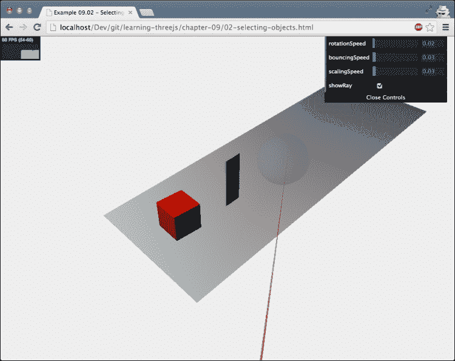
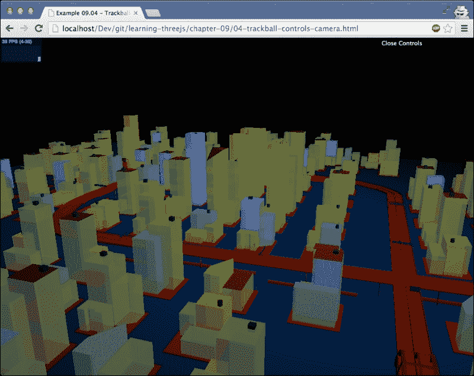
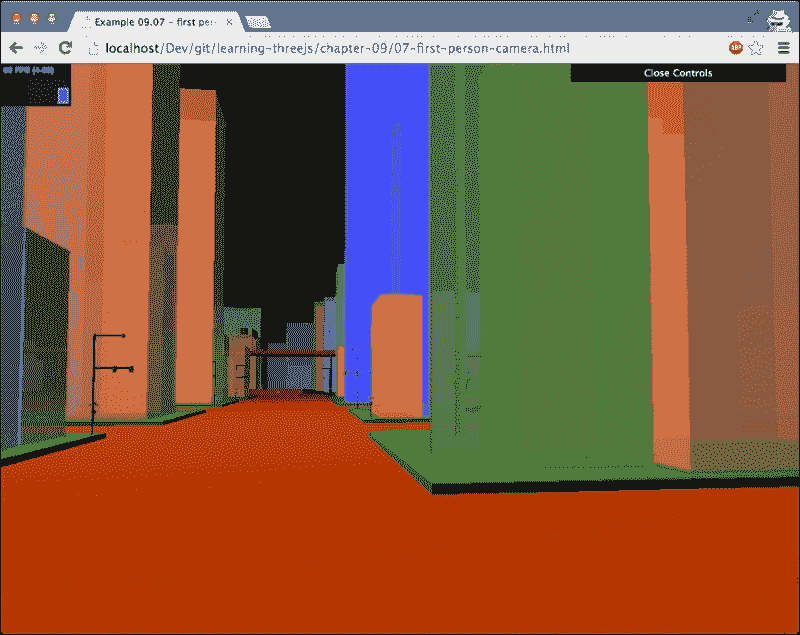
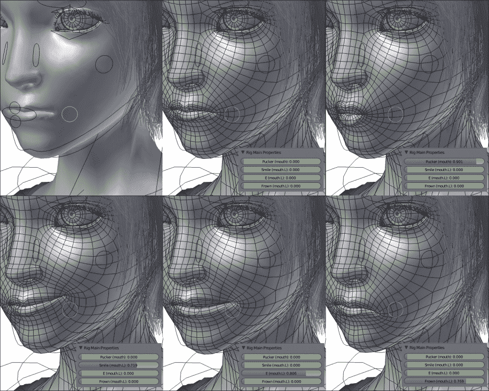
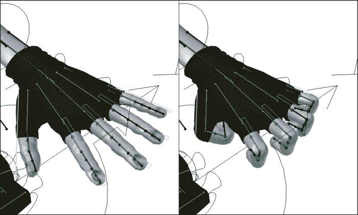
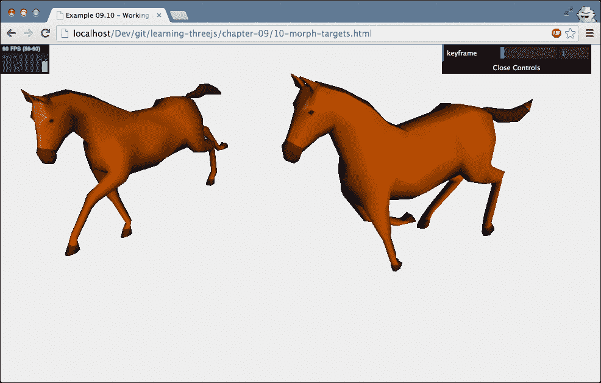
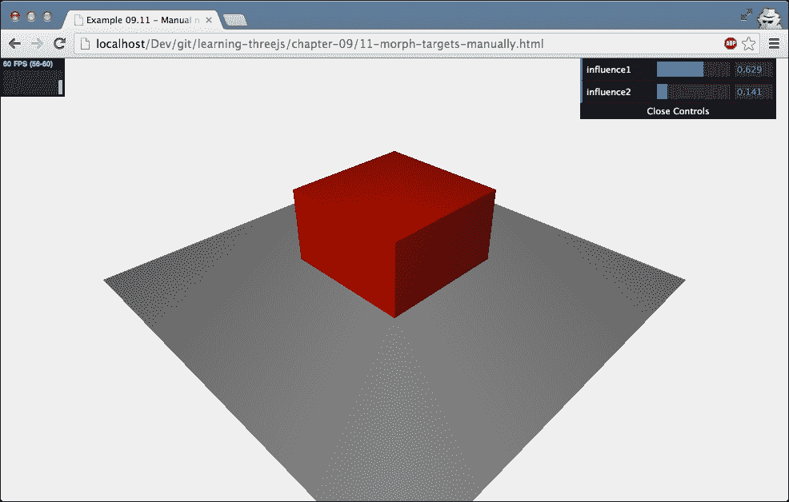

# 第九章。动画和移动相机

在前几章中，我们看到了一些简单的动画，但没有太复杂的。在第一章中，*使用 Three.js 创建您的第一个 3D 场景*，我们介绍了基本的渲染循环，在接下来的章节中，我们使用它来旋转一些简单的对象，并展示了一些其他基本的动画概念。在本章中，我们将更详细地了解 Three.js 如何支持动画。我们将详细讨论以下四个主题：

+   基本动画

+   移动相机

+   变形和皮肤

+   加载外部动画

我们从动画背后的基本概念开始。

# 基本动画

在我们看例子之前，让我们快速回顾一下在第一章中展示的渲染循环。为了支持动画，我们需要告诉 Three.js 每隔一段时间渲染一次场景。为此，我们使用标准的 HTML5 `requestAnimationFrame`功能，如下所示：

```js
render();

function render() {

  // render the scene
  renderer.render(scene, camera);
  // schedule the next rendering using requestAnimationFrame
  requestAnimationFrame(render);
}
```

使用这段代码，我们只需要在初始化场景完成后一次调用`render()`函数。在`render()`函数本身中，我们使用`requestAnimationFrame`来安排下一次渲染。这样，浏览器会确保`render()`函数以正确的间隔被调用（通常大约每秒 60 次）。在`requestAnimationFrame`添加到浏览器之前，使用`setInterval(function, interval)`或`setTimeout(function, interval)`。这些会在每个设置的间隔调用指定的函数。这种方法的问题在于它不考虑其他正在进行的事情。即使您的动画没有显示或在隐藏的标签中，它仍然被调用并且仍在使用资源。另一个问题是，这些函数在被调用时更新屏幕，而不是在浏览器最佳时机，这意味着更高的 CPU 使用率。使用`requestAnimationFrame`，我们不告诉浏览器何时需要更新屏幕；我们要求浏览器在最合适的时机运行提供的函数。通常，这会导致大约 60fps 的帧速率。使用`requestAnimationFrame`，您的动画将运行得更顺畅，对 CPU 和 GPU 更友好，而且您不必担心自己的时间问题。

## 简单动画

使用这种方法，我们可以通过改变它们的旋转、缩放、位置、材质、顶点、面和您能想象到的任何其他东西来非常容易地对对象进行动画处理。在下一个渲染循环中，Three.js 将渲染更改的属性。一个非常简单的例子，基于我们在第一章中已经看到的一个例子，可以在`01-basic-animation.html`中找到。以下截图显示了这个例子：


这个渲染循环非常简单。只需改变相关网格的属性，Three.js 会处理其余的。我们是这样做的：

```js
function render() {
  cube.rotation.x += controls.rotationSpeed;
  cube.rotation.y += controls.rotationSpeed;
  cube.rotation.z += controls.rotationSpeed;

  step += controls.bouncingSpeed;
  sphere.position.x = 20 + ( 10 * (Math.cos(step)));
  sphere.position.y = 2 + ( 10 * Math.abs(Math.sin(step)));

  scalingStep += controls.scalingSpeed;
  var scaleX = Math.abs(Math.sin(scalingStep / 4));
  var scaleY = Math.abs(Math.cos(scalingStep / 5));
  var scaleZ = Math.abs(Math.sin(scalingStep / 7));
  cylinder.scale.set(scaleX, scaleY, scaleZ);

  renderer.render(scene, camera);
  requestAnimationFrame(render);
}
```

这里没有什么特别的，但它很好地展示了我们在本书中讨论的基本动画背后的概念。在下一节中，我们将快速地进行一个侧步。除了动画，另一个重要的方面是，当在更复杂的场景中使用 Three.js 时，您将很快遇到的一个方面是使用鼠标在屏幕上选择对象的能力。

## 选择对象

尽管与动画没有直接关系，但由于我们将在本章中研究相机和动画，这是对本章中解释的主题的一个很好的补充。我们将展示如何使用鼠标从场景中选择对象。在我们查看示例之前，我们将首先看看所需的代码：

```js
var projector = new THREE.Projector();

function onDocumentMouseDown(event) {
  var vector = new THREE.Vector3(event.clientX / window.innerWidth ) * 2 - 1, -( event.clientY / window.innerHeight ) * 2 + 1, 0.5);
  vector = vector.unproject(camera);

  var raycaster = new THREE.Raycaster(camera.position, vector.sub(camera.position).normalize());

  var intersects = raycaster.intersectObjects([sphere, cylinder, cube]);

  if (intersects.length > 0) {
    intersects[ 0 ].object.material.transparent = true;
    intersects[ 0 ].object.material.opacity = 0.1;
  }
}
```

在这段代码中，我们使用`THREE.Projector`和`THREE.Raycaster`来确定我们是否点击了特定的对象。当我们点击屏幕时会发生以下情况：

1.  首先，根据我们在屏幕上点击的位置创建了`THREE.Vector3`。

1.  接下来，使用`vector.unproject`函数，我们将屏幕上的点击位置转换为我们 Three.js 场景中的坐标。换句话说，我们从屏幕坐标转换为世界坐标。

1.  接下来，我们创建`THREE.Raycaster`。使用`THREE.Raycaster`，我们可以在场景中发射射线。在这种情况下，我们从相机的位置（`camera.position`）发射射线到我们在场景中点击的位置。

1.  最后，我们使用`raycaster.intersectObjects`函数来确定射线是否击中了提供的任何对象。

最终步骤的结果包含了被射线击中的任何对象的信息。提供了以下信息：

```js
distance: 49.9047088522448
face: THREE.Face3
faceIndex: 4
object: THREE.Mesh
point: THREE.Vector3
```

被点击的网格是对象，`face`和`faceIndex`指向被选中的网格的面。`distance`值是从相机到点击对象的距离，`point`是点击网格的确切位置。您可以在`02-selecting-objects.html`示例中测试这一点。您点击的任何对象都将变为透明，并且选择的详细信息将被打印到控制台。

如果您想看到发射的射线路径，可以从菜单中启用`showRay`属性。以下屏幕截图显示了用于选择蓝色球体的射线：



现在我们完成了这个小插曲，让我们回到我们的动画中。到目前为止，我们已经在渲染循环中改变了属性以使对象动画化。在下一节中，我们将看一下一个小型库，它可以更轻松地定义动画。

## 使用 Tween.js 进行动画

Tween.js 是一个小型的 JavaScript 库，您可以从[`github.com/sole/tween.js/`](https://github.com/sole/tween.js/)下载，并且您可以使用它来轻松定义属性在两个值之间的过渡。所有开始和结束值之间的中间点都为您计算。这个过程称为**缓动**。

例如，您可以使用这个库来在 10 秒内将网格的*x*位置从 10 改变为 3，如下所示：

```js
var tween = new TWEEN.Tween({x: 10}).to({x: 3}, 10000).easing(TWEEN.Easing.Elastic.InOut).onUpdate( function () {
  // update the mesh
})
```

在这个例子中，我们创建了`TWEEN.Tween`。这个缓动将确保*x*属性在 10,000 毫秒的时间内从 10 改变为 3。Tween.js 还允许您定义属性随时间如何改变。这可以使用线性、二次或其他任何可能性来完成（请参阅[`sole.github.io/tween.js/examples/03_graphs.html`](http://sole.github.io/tween.js/examples/03_graphs.html)获取完整的概述）。随时间值的变化方式称为**缓动**。使用 Tween.js，您可以使用`easing()`函数进行配置。

从 Three.js 中使用这个库非常简单。如果您打开`03-animation-tween.html`示例，您可以看到 Tween.js 库的实际效果。以下屏幕截图显示了示例的静态图像：


在这个例子中，我们从第七章中取了一个粒子云，*粒子、精灵和点云*，并将所有粒子动画化到地面上。这些粒子的位置是基于使用 Tween.js 库创建的缓动动画，如下所示：

```js
// first create the tweens
var posSrc = {pos: 1}
var tween = new TWEEN.Tween(posSrc).to({pos: 0}, 5000);
tween.easing(TWEEN.Easing.Sinusoidal.InOut);

var tweenBack = new TWEEN.Tween(posSrc).to({pos: 1}, 5000);
tweenBack.easing(TWEEN.Easing.Sinusoidal.InOut);

tween.chain(tweenBack);
tweenBack.chain(tween);

var onUpdate = function () {
  var count = 0;
  var pos = this.pos;

  loadedGeometry.vertices.forEach(function (e) {
    var newY = ((e.y + 3.22544) * pos) - 3.22544;
    particleCloud.geometry.vertices[count++].set(e.x, newY, e.z);
  });

  particleCloud.sortParticles = true;
};

tween.onUpdate(onUpdate);
tweenBack.onUpdate(onUpdate);
```

通过这段代码，我们创建了两个缓动：`tween`和`tweenBack`。第一个定义了位置属性从 1 过渡到 0 的方式，第二个则相反。通过`chain()`函数，我们将这两个缓动链接在一起，因此这些缓动在启动时将开始循环。我们在这里定义的最后一件事是`onUpdate`方法。在这个方法中，我们遍历粒子系统的所有顶点，并根据缓动提供的位置（`this.pos`）来改变它们的位置。

我们在模型加载时启动缓动，因此在以下函数的末尾，我们调用了`tween.start()`函数：

```js
var loader = new THREE.PLYLoader();
loader.load( "../assets/models/test.ply", function (geometry) {
  ...
  tween.start()
  ...
});
```

当缓动开始时，我们需要告诉 Tween.js 库何时更新它所知道的所有缓动。我们通过调用`TWEEN.update()`函数来实现这一点：

```js
function render() {
  TWEEN.update();
  webGLRenderer.render(scene, camera);
  requestAnimationFrame(render);
}
```

有了这些步骤，缓动库将负责定位点云的各个点。正如你所看到的，使用这个库比自己管理过渡要容易得多。

除了通过动画和更改对象来动画场景，我们还可以通过移动相机来动画场景。在前几章中，我们已经多次通过手动更新相机的位置来实现这一点。Three.js 还提供了许多其他更新相机的方法。

# 与相机一起工作

Three.js 有许多相机控件可供您在整个场景中控制相机。这些控件位于 Three.js 发行版中，可以在`examples/js/controls`目录中找到。在本节中，我们将更详细地查看以下控件：

| 名称 | 描述 |
| --- | --- |
| `FirstPersonControls` | 这些控件的行为类似于第一人称射击游戏中的控件。使用键盘四处移动，用鼠标四处张望。 |
| `FlyControls` | 这些是类似飞行模拟器的控件。使用键盘和鼠标进行移动和转向。 |
| `RollControls` | 这是`FlyControls`的简化版本。允许您在*z*轴周围移动和翻滚。 |
| `TrackBallControls` | 这是最常用的控件，允许您使用鼠标（或轨迹球）轻松地在场景中移动、平移和缩放。 |
| `OrbitControls` | 这模拟了围绕特定场景轨道上的卫星。这允许您使用鼠标和键盘四处移动。 |

这些控件是最有用的控件。除此之外，Three.js 还提供了许多其他控件可供使用（但本书中未进行解释）。但是，使用这些控件的方式与前表中解释的方式相同：

| 名称 | 描述 |
| --- | --- |
| `DeviceOrientationControls` | 根据设备的方向控制摄像机的移动。它内部使用 HTML 设备方向 API ([`www.w3.org/TR/orientation-event/`](http://www.w3.org/TR/orientation-event/))。 |
| `EditorControls` | 这些控件是专门为在线 3D 编辑器创建的。这是由 Three.js 在线编辑器使用的，您可以在[`threejs.org/editor/`](http://threejs.org/editor/)找到。 |
| `OculusControls` | 这些是允许您使用 Oculus Rift 设备在场景中四处张望的控件。 |
| `OrthographicTrackballControls` | 这与`TrackBallControls`相同，但专门用于与`THREE.OrthographicCamera`一起使用。 |
| `PointerLockControls` | 这是一个简单的控制，可以使用渲染场景的 DOM 元素锁定鼠标。这为简单的 3D 游戏提供了基本功能。 |
| `TransformControls` | 这是 Three.js 编辑器使用的内部控件。 |
| `VRControls` | 这是一个使用`PositionSensorVRDevice` API 来控制场景的控制器。有关此标准的更多信息，请访问[`developer.mozilla.org/en-US/docs/Web/API/Navigator.getVRDevices`](https://developer.mozilla.org/en-US/docs/Web/API/Navigator.getVRDevices)。 |

除了使用这些相机控制，您当然也可以通过设置`position`来自行移动相机，并使用`lookAt()`函数更改其指向的位置。

### 提示

如果您曾经使用过较旧版本的 Three.js，您可能会错过一个名为`THREE.PathControls`的特定相机控件。使用此控件，可以定义路径（例如使用`THREE.Spline`）并沿该路径移动相机。在最新版本的 Three.js 中，由于代码复杂性，此控件已被移除。Three.js 背后的人目前正在开发替代方案，但目前还没有可用的替代方案。

我们将首先看一下`TrackballControls`控件。

## TrackballControls

在使用`TrackballControls`之前，您首先需要将正确的 JavaScript 文件包含到您的页面中：

```js
<script type="text/javascript" src="../libs/TrackballControls.js"></script>
```

包括这些内容后，我们可以创建控件并将其附加到相机上，如下所示：

```js
var trackballControls = new THREE.TrackballControls(camera);
trackballControls.rotateSpeed = 1.0;
trackballControls.zoomSpeed = 1.0;
trackballControls.panSpeed = 1.0;
```

更新相机的位置是我们在渲染循环中做的事情，如下所示：

```js
var clock = new THREE.Clock();
function render() {
  var delta = clock.getDelta();
  trackballControls.update(delta);
  requestAnimationFrame(render);
  webGLRenderer.render(scene, camera);
}
```

在上面的代码片段中，我们看到了一个新的 Three.js 对象，`THREE.Clock`。`THREE.Clock`对象可用于精确计算特定调用或渲染循环完成所需的经过时间。您可以通过调用`clock.getDelta()`函数来实现这一点。此函数将返回此调用和上一次调用`getDelta()`之间的经过时间。要更新相机的位置，我们调用`trackballControls.update()`函数。在此函数中，我们需要提供自上次调用此更新函数以来经过的时间。为此，我们使用`THREE.Clock`对象的`getDelta()`函数。您可能想知道为什么我们不只是将帧速率（1/60 秒）传递给`update`函数。原因是，使用`requestAnimationFrame`，我们可以期望 60 fps，但这并不是保证的。根据各种外部因素，帧速率可能会发生变化。为了确保相机平稳转动和旋转，我们需要传递确切的经过时间。

此示例的工作示例可以在`04-trackball-controls-camera.html`中找到。以下截图显示了此示例的静态图像：



您可以以以下方式控制相机：

| 控制 | 动作 |
| --- | --- |
| 左键并移动 | 围绕场景旋转和滚动相机 |
| 滚轮 | 放大和缩小 |
| 中键并移动 | 放大和缩小 |
| 右键并移动 | 在场景中移动 |

有一些属性可以用来微调相机的行为。例如，您可以通过设置`rotateSpeed`属性来设置相机旋转的速度，并通过将`noZoom`属性设置为`true`来禁用缩放。在本章中，我们不会详细介绍每个属性的作用，因为它们几乎是不言自明的。要了解可能性的完整概述，请查看`TrackballControls.js`文件的源代码，其中列出了这些属性。

## FlyControls

我们将要看的下一个控件是`FlyControls`。使用`FlyControls`，您可以使用在飞行模拟器中找到的控件在场景中飞行。示例可以在`05-fly-controls-camera.html`中找到。以下截图显示了此示例的静态图像：


启用`FlyControls`的方式与`TrackballControls`相同。首先，加载正确的 JavaScript 文件：

```js
<script type="text/javascript" src="../libs/FlyControls.js"></script>
```

接下来，我们配置控件并将其附加到相机上，如下所示：

```js
var flyControls = new THREE.FlyControls(camera);
flyControls.movementSpeed = 25;
flyControls.domElement = document.querySelector('#WebGL-output');
flyControls.rollSpeed = Math.PI / 24;
flyControls.autoForward = true;
flyControls.dragToLook = false;
```

再次，我们不会深入研究所有具体的属性。查看`FlyControls.js`文件的源代码。让我们只挑选出需要配置的属性来使控制器工作。需要正确设置的属性是`domElement`属性。该属性应指向我们渲染场景的元素。在本书的示例中，我们使用以下元素作为输出：

```js
<div id="WebGL-output"></div>
```

我们设置属性如下：

```js
flyControls.domElement = document.querySelector('#WebGL-output');
```

如果我们没有正确设置这个属性，鼠标移动会导致奇怪的行为。

你可以用`THREE.FlyControls`来控制相机：

| 控制 | 动作 |
| --- | --- |
| 左键和中键 | 开始向前移动 |
| 右鼠标按钮 | 向后移动 |
| 鼠标移动 | 四处看看 |
| W | 开始向前移动 |
| S | 向后移动 |
| A | 向左移动 |
| D | 向右移动 |
| R | 向上移动 |
| F | 向下移动 |
| 左、右、上、下箭头 | 向左、向右、向上、向下看 |
| G | 向左翻滚 |
| E | 向右翻滚 |

我们将要看的下一个控制是`THREE.RollControls`。

## RollControls

`RollControls`的行为与`FlyControls`基本相同，所以我们在这里不会详细介绍。`RollControls`可以这样创建：

```js
var rollControls = new THREE.RollControls(camera);
rollControls.movementSpeed = 25;
rollControls.lookSpeed = 3;
```

如果你想玩玩这个控制，看看`06-roll-controls-camera.html`的例子。请注意，如果你只看到一个黑屏，把鼠标移到浏览器底部，城市景观就会出现。这个相机可以用以下控制移动：

| 控制 | 动作 |
| --- | --- |
| 左鼠标按钮 | 向前移动 |
| 右鼠标按钮 | 向后移动 |
| 左、右、上、下箭头 | 向左、向右、向前、向后移动 |
| W | 向前移动 |
| A | 向左移动 |
| S | 向后移动 |
| D | 向右移动 |
| Q | 向左翻滚 |
| E | 向右翻滚 |
| R | 向上移动 |
| F | 向下移动 |

我们将要看的基本控制的最后一个是`FirstPersonControls`。

## FirstPersonControls

正如其名称所示，`FirstPersonControls`允许你像第一人称射击游戏一样控制相机。鼠标用来四处看看，键盘用来四处走动。你可以在`07-first-person-camera.html`中找到一个例子。以下截图显示了这个例子的静态图像：



创建这些控制遵循了我们到目前为止看到的其他控制所遵循的相同原则。我们刚刚展示的例子使用了以下配置：

```js
var camControls = new THREE.FirstPersonControls(camera);
camControls.lookSpeed = 0.4;
camControls.movementSpeed = 20;
camControls.noFly = true;
camControls.lookVertical = true;
camControls.constrainVertical = true;
camControls.verticalMin = 1.0;
camControls.verticalMax = 2.0;
camControls.lon = -150;
camControls.lat = 120;
```

当你自己使用这个控制时，你应该仔细看看的唯一属性是最后两个：`lon`和`lat`属性。这两个属性定义了当场景第一次渲染时相机指向的位置。

这个控制的控制非常简单：

| 控制 | 动作 |
| --- | --- |
| 鼠标移动 | 四处看看 |
| 左、右、上、下箭头 | 向左、向右、向前、向后移动 |
| W | 向前移动 |
| A | 向左移动 |
| S | 向后移动 |
| D | 向右移动 |
| R | 向上移动 |
| F | 向下移动 |
| Q | 停止所有移动 |

对于下一个控制，我们将从第一人称视角转向太空视角。

## OrbitControl

`OrbitControl`控制是围绕场景中心的物体旋转和平移的好方法。在`08-controls-orbit.html`中，我们包含了一个展示这个控制如何工作的例子。以下截图显示了这个例子的静态图像：


使用`OrbitControl`和使用其他控制一样简单。包括正确的 JavaScript 文件，设置控制与相机，再次使用`THREE.Clock`来更新控制：

```js
<script type="text/javascript" src="../libs/OrbitControls.js"></script>
...
var orbitControls = new THREE.OrbitControls(camera);
orbitControls.autoRotate = true;
var clock = new THREE.Clock();
...
var delta = clock.getDelta();
orbitControls.update(delta);
```

`THREE.OrbitControls`的控制集中在使用鼠标上，如下表所示：

| 控制 | 动作 |
| --- | --- |
| 左鼠标点击+移动 | 围绕场景中心旋转相机 |
| 滚轮或中键点击+移动 | 放大和缩小 |
| 右鼠标点击+移动 | 在场景中四处移动 |
| 左、右、上、下箭头 | 在场景中四处移动 |

摄像机和移动已经介绍完了。在这一部分，我们已经看到了许多控制，可以让你创建有趣的摄像机动作。在下一节中，我们将看一下更高级的动画方式：变形和蒙皮。

# 变形和骨骼动画

当您在外部程序（例如 Blender）中创建动画时，通常有两种主要选项来定义动画：

+   **变形目标**：使用变形目标，您定义了网格的变形版本，即关键位置。对于这个变形目标，存储了所有顶点位置。要使形状动画化，您需要将所有顶点从一个位置移动到另一个关键位置并重复该过程。以下屏幕截图显示了用于显示面部表情的各种变形目标（以下图像由 Blender 基金会提供）：

+   **骨骼动画**：另一种选择是使用骨骼动画。使用骨骼动画，您定义网格的骨架，即骨骼，并将顶点附加到特定的骨骼上。现在，当您移动一个骨骼时，任何连接的骨骼也会适当移动，并且根据骨骼的位置、移动和缩放移动和变形附加的顶点。下面再次由 Blender 基金会提供的屏幕截图显示了骨骼如何用于移动和变形对象的示例：

Three.js 支持这两种模式，但通常使用变形目标可能会获得更好的结果。骨骼动画的主要问题是从 Blender 等 3D 程序中获得可以在 Three.js 中进行动画处理的良好导出。使用变形目标比使用骨骼和皮肤更容易获得良好的工作模型。

在本节中，我们将研究这两种选项，并另外查看 Three.js 支持的一些外部格式，其中可以定义动画。

## 使用变形目标的动画

变形目标是定义动画的最直接方式。您为每个重要位置（也称为关键帧）定义所有顶点，并告诉 Three.js 将顶点从一个位置移动到另一个位置。然而，这种方法的缺点是，对于大型网格和大型动画，模型文件将变得非常庞大。原因是对于每个关键位置，所有顶点位置都会重复。

我们将向您展示如何使用两个示例处理变形目标。在第一个示例中，我们将让 Three.js 处理各个关键帧（或我们从现在开始称之为变形目标）之间的过渡，在第二个示例中，我们将手动完成这个过程。

### 使用 MorphAnimMesh 的动画

在我们的第一个变形示例中，我们将使用 Three.js 分发的模型之一——马。了解基于变形目标的动画如何工作的最简单方法是打开`10-morph-targets.html`示例。以下屏幕截图显示了此示例的静态图像：



在此示例中，右侧的马正在进行动画和奔跑，而左侧的马站在原地。左侧的这匹马是从基本模型即原始顶点集渲染的。在右上角的菜单中，您可以浏览所有可用的变形目标，并查看左侧马可以采取的不同位置。

Three.js 提供了一种从一个位置移动到另一个位置的方法，但这意味着我们必须手动跟踪我们所在的当前位置和我们想要变形成的目标，并且一旦达到目标位置，就要重复这个过程以达到其他位置。幸运的是，Three.js 还提供了一个特定的网格，即`THREE.MorphAnimMesh`，它会为我们处理这些细节。在我们继续之前，这里有关于 Three.js 提供的另一个与动画相关的网格`THREE.MorphBlendMesh`的快速说明。如果您浏览 Three.js 提供的对象，您可能会注意到这个对象。使用这个特定的网格，您可以做的事情几乎与`THREE.MorphAnimMesh`一样多，当您查看源代码时，甚至可以看到这两个对象之间的许多内容是重复的。然而，`THREE.MorphBlendMesh`似乎已经被弃用，并且在任何官方的 Three.js 示例中都没有使用。您可以使用`THREE.MorphAnimMesh`来完成`THREE.MorhpBlendMesh`可以完成的所有功能，因此请使用`THREE.MorphAnimMesh`来进行这种功能。以下代码片段显示了如何从模型加载并创建`THREE.MorphAnimMesh`：

```js
var loader = new THREE.JSONLoader();
loader.load('../assets/models/horse.js', function(geometry, mat) {

  var mat = new THREE.MeshLambertMaterial({ morphTargets: true, vertexColors: THREE.FaceColors});

  morphColorsToFaceColors(geometry);
  geometry.computeMorphNormals();
  meshAnim = new THREE.MorphAnimMesh(geometry, mat );
  scene.add(meshAnim);

},'../assets/models' );

function morphColorsToFaceColors(geometry) {

  if (geometry.morphColors && geometry.morphColors.length) {

    var colorMap = geometry.morphColors[ 0 ];
    for (var i = 0; i < colorMap.colors.length; i++) {
      geometry.faces[ i ].color = colorMap.colors[ i ];
      geometry.faces[ i ].color.offsetHSL(0, 0.3, 0);
    }
  }
}
```

这与我们加载其他模型时看到的方法相同。然而，这次外部模型还包含了变形目标。我们创建`THREE.MorphAnimMesh`而不是创建普通的`THREE.Mesh`对象。加载动画时需要考虑几件事情：

+   确保您使用的材质将`THREE.morphTargets`设置为`true`。如果没有设置，您的网格将不会动画。

+   在创建`THREE.MorphAnimMesh`之前，请确保在几何体上调用`computeMorphNormals`，以便计算所有变形目标的法线向量。这对于正确的光照和阴影效果是必需的。

+   还可以为特定变形目标的面定义颜色。这些可以从`morphColors`属性中获得。您可以使用这个来变形几何体的形状，也可以变形各个面的颜色。使用`morphColorsToFaceColors`辅助方法，我们只需将面的颜色固定为`morphColors`数组中的第一组颜色。

+   默认设置是一次性播放完整的动画。如果为同一几何体定义了多个动画，您可以使用`parseAnimations()`函数和`playAnimation(name,fps)`来播放其中一个定义的动画。我们将在本章的最后一节中使用这种方法，从 MD2 模型中加载动画。

剩下的就是在渲染循环中更新动画。为此，我们再次使用`THREE.Clock`来计算增量，并用它来更新动画，如下所示：

```js
function render() {

  var delta = clock.getDelta();
  webGLRenderer.clear();
  if (meshAnim) {
    meshAnim.updateAnimation(delta *1000);
    meshAnim.rotation.y += 0.01;
  }

  // render using requestAnimationFrame
  requestAnimationFrame(render);
  webGLRenderer.render(scene, camera);
}
```

这种方法是最简单的，可以让您快速设置来自具有定义变形目标的模型的动画。另一种方法是手动设置动画，我们将在下一节中展示。

### 通过设置 morphTargetInfluence 属性创建动画

我们将创建一个非常简单的示例，其中我们将一个立方体从一个形状变形为另一个形状。这一次，我们将手动控制我们将变形到哪个目标。您可以在`11-morph-targets-manually.html`中找到这个示例。以下截图显示了这个示例的静态图像：



在这个例子中，我们手动为一个简单的立方体创建了两个变形目标，如下所示：

```js
// create a cube
var cubeGeometry = new THREE.BoxGeometry(4, 4, 4);
var cubeMaterial = new THREE.MeshLambertMaterial({morphTargets: true, color: 0xff0000});

// define morphtargets, we'll use the vertices from these geometries
var cubeTarget1 = new THREE.CubeGeometry(2, 10, 2);
var cubeTarget2 = new THREE.CubeGeometry(8, 2, 8);

// define morphtargets and compute the morphnormal
cubeGeometry.morphTargets[0] = {name: 'mt1', vertices: cubeTarget2.vertices};
cubeGeometry.morphTargets[1] = {name: 'mt2', vertices: cubeTarget1.vertices};
cubeGeometry.computeMorphNormals();

var cube = new THREE.Mesh(cubeGeometry, cubeMaterial);
```

当您打开这个示例时，您会看到一个简单的立方体。在右上角的滑块中，您可以设置`morphTargetInfluences`。换句话说，您可以确定初始立方体应该变形成指定为`mt1`的立方体的程度，以及它应该变形成`mt2`的程度。当您手动创建变形目标时，您需要考虑到变形目标与源几何体具有相同数量的顶点。您可以使用网格的`morphTargetInfluences`属性来设置影响：

```js
var controls = new function () {
  // set to 0.01 to make sure dat.gui shows correct output
  this.influence1 = 0.01;
  this.influence2 = 0.01;

  this.update = function () {
    cube.morphTargetInfluences[0] = controls.influence1;
    cube.morphTargetInfluences[1] = controls.influence2;
  };
}
```

请注意，初始几何图形可以同时受多个形态目标的影响。这两个例子展示了形态目标动画背后的最重要的概念。在下一节中，我们将快速查看使用骨骼和蒙皮进行动画。

## 使用骨骼和蒙皮进行动画

形态动画非常直接。Three.js 知道所有目标顶点位置，只需要将每个顶点从一个位置过渡到下一个位置。对于骨骼和蒙皮，情况会变得有点复杂。当您使用骨骼进行动画时，您移动骨骼，Three.js 必须确定如何相应地转换附加的皮肤（一组顶点）。在这个例子中，我们使用从 Blender 导出到 Three.js 格式（`models`文件夹中的`hand-1.js`）的模型。这是一个手的模型，包括一组骨骼。通过移动骨骼，我们可以对整个模型进行动画。让我们首先看一下我们如何加载模型：

```js
var loader = new THREE.JSONLoader();
loader.load('../assets/models/hand-1.js', function (geometry, mat) {
  var mat = new THREE.MeshLambertMaterial({color: 0xF0C8C9, skinning: true});
  mesh = new THREE.SkinnedMesh(geometry, mat);

  // rotate the complete hand
  mesh.rotation.x = 0.5 * Math.PI;
  mesh.rotation.z = 0.7 * Math.PI;

  // add the mesh
  scene.add(mesh);

  // and start the animation
  tween.start();

}, '../assets/models');
```

加载用于骨骼动画的模型与加载任何其他模型并无太大不同。我们只需指定包含顶点、面和骨骼定义的模型文件，然后基于该几何图形创建一个网格。Three.js 还提供了一个特定的用于这样的蒙皮几何的网格，称为`THREE.SkinnedMesh`。确保模型得到更新的唯一一件事是将您使用的材质的`skinning`属性设置为`true`。如果不将其设置为`true`，则不会看到任何骨骼移动。我们在这里做的最后一件事是将所有骨骼的`useQuaternion`属性设置为`false`。在这个例子中，我们将使用一个`tween`对象来处理动画。这个`tween`实例定义如下：

```js
var tween = new TWEEN.Tween({pos: -1}).to({pos: 0}, 3000).easing(TWEEN.Easing.Cubic.InOut).yoyo(true).repeat(Infinity).onUpdate(onUpdate);
```

通过这个 Tween，我们将`pos`变量从`-1`过渡到`0`。我们还将`yoyo`属性设置为`true`，这会导致我们的动画在下一次运行时以相反的方式运行。为了确保我们的动画保持运行，我们将`repeat`设置为`Infinity`。您还可以看到我们指定了一个`onUpdate`方法。这个方法用于定位各个骨骼，接下来我们将看一下这个方法。

在我们移动骨骼之前，让我们先看一下`12-bones-manually.html`示例。以下屏幕截图显示了这个示例的静态图像：


当您打开此示例时，您会看到手做出抓取的动作。我们通过在从我们的 Tween 动画调用的`onUpdate`方法中设置手指骨骼的*z*旋转来实现这一点，如下所示：

```js
var onUpdate = function () {
  var pos = this.pos;

  // rotate the fingers
  mesh.skeleton.bones[5].rotation.set(0, 0, pos);
  mesh.skeleton.bones[6].rotation.set(0, 0, pos);
  mesh.skeleton.bones[10].rotation.set(0, 0, pos);
  mesh.skeleton.bones[11].rotation.set(0, 0, pos);
  mesh.skeleton.bones[15].rotation.set(0, 0, pos);
  mesh.skeleton.bones[16].rotation.set(0, 0, pos);
  mesh.skeleton.bones[20].rotation.set(0, 0, pos);
  mesh.skeleton.bones[21].rotation.set(0, 0, pos);

  // rotate the wrist
  mesh.skeleton.bones[1].rotation.set(pos, 0, 0);
};
```

每当调用此更新方法时，相关的骨骼都设置为`pos`位置。要确定需要移动哪根骨骼，最好打印出`mesh.skeleton`属性到控制台。这将列出所有骨骼及其名称。

### 提示

Three.js 提供了一个简单的辅助工具，您可以用它来显示模型的骨骼。将以下内容添加到代码中：

```js
helper = new THREE.SkeletonHelper( mesh );
helper.material.linewidth = 2;
helper.visible = false;
scene.add( helper );
```

骨骼被突出显示。您可以通过启用`12-bones-manually.html`示例中显示的`showHelper`属性来查看此示例。

正如您所看到的，使用骨骼需要更多的工作，但比固定的形态目标更灵活。在这个例子中，我们只移动了骨骼的旋转；您还可以移动位置或更改比例。在下一节中，我们将看一下从外部模型加载动画。在该部分，我们将重新访问这个例子，但现在，我们将从模型中运行预定义的动画，而不是手动移动骨骼。

# 使用外部模型创建动画

在第八章*创建和加载高级网格和几何体*中，我们看了一些 Three.js 支持的 3D 格式。其中一些格式也支持动画。在本章中，我们将看一下以下示例：

+   **使用 JSON 导出器的 Blender**：我们将从 Blender 中创建的动画开始，并将其导出到 Three.js JSON 格式。

+   **Collada 模型**：Collada 格式支持动画。在此示例中，我们将从 Collada 文件加载动画，并在 Three.js 中呈现它。

+   **MD2 模型**：MD2 模型是旧版 Quake 引擎中使用的简单格式。尽管该格式有点过时，但仍然是存储角色动画的非常好的格式。

我们将从 Blender 模型开始。

## 使用 Blender 创建骨骼动画

要开始使用 Blender 中的动画，您可以加载我们在 models 文件夹中包含的示例。您可以在那里找到`hand.blend`文件，然后将其加载到 Blender 中。以下截图显示了这个示例的静态图像：


在本书中，没有足够的空间详细介绍如何在 Blender 中创建动画，但有一些事情需要记住：

+   您的模型中的每个顶点至少必须分配给一个顶点组。

+   您在 Blender 中使用的顶点组的名称必须对应于控制它的骨骼的名称。这样，Three.js 可以确定移动骨骼时需要修改哪些顶点。

+   只有第一个“动作”被导出。因此，请确保要导出的动画是第一个。

+   在创建关键帧时，最好选择所有骨骼，即使它们没有改变。

+   在导出模型时，请确保模型处于静止姿势。如果不是这种情况，您将看到一个非常畸形的动画。

有关在 Blender 中创建和导出动画以及上述要点的原因的更多信息，您可以查看以下优秀资源：[`devmatrix.wordpress.com/2013/02/27/creating-skeletal-animation-in-blender-and-exporting-it-to-three-js/`](http://devmatrix.wordpress.com/2013/02/27/creating-skeletal-animation-in-blender-and-exporting-it-to-three-js/)。

当您在 Blender 中创建动画时，可以使用我们在上一章中使用的 Three.js 导出器导出文件。在使用 Three.js 导出器导出文件时，您必须确保检查以下属性：


这将导出您在 Blender 中指定的动画作为骨骼动画，而不是形变动画。使用骨骼动画，骨骼的移动被导出，我们可以在 Three.js 中重放。

在 Three.js 中加载模型与我们之前的示例相同；但是，现在模型加载后，我们还将创建一个动画，如下所示：

```js
var loader = new THREE.JSONLoader();
loader.load('../assets/models/hand-2.js', function (model, mat) {

  var mat = new THREE.MeshLambertMaterial({color: 0xF0C8C9, skinning: true});
  mesh = new THREE.SkinnedMesh(model, mat);

  var animation = new THREE.Animation(mesh, model.animation);

  mesh.rotation.x = 0.5 * Math.PI;
  mesh.rotation.z = 0.7 * Math.PI;
  scene.add(mesh);

  // start the animation
  animation.play();

}, '../assets/models');
```

要运行此动画，我们只需创建一个`THREE.Animation`实例，并在此动画上调用`play`方法。在看到动画之前，我们还需要执行一个额外的步骤。在我们的渲染循环中，我们调用`THREE.AnimationHandler.update(clock.getDelta())`函数来更新动画，Three.js 将使用骨骼来设置模型的正确位置。这个示例(`13-animation-from-blender.html`)的结果是一个简单的挥手。

以下截图显示了这个示例的静态图像：


除了 Three.js 自己的格式，我们还可以使用其他几种格式来定义动画。我们将首先看一下加载 Collada 模型。

## 从 Collada 模型加载动画

从 Collada 文件加载模型的工作方式与其他格式相同。首先，您必须包含正确的加载器 JavaScript 文件：

```js
<script type="text/javascript" src="../libs/ColladaLoader.js"></script>
```

接下来，我们创建一个加载器并使用它来加载模型文件：

```js
var loader = new THREE.ColladaLoader();
loader.load('../assets/models/monster.dae', function (collada) {

  var child = collada.skins[0];
  scene.add(child);

  var animation = new THREE.Animation(child, child.geometry.animation);
  animation.play();

  // position the mesh
  child.scale.set(0.15, 0.15, 0.15);
  child.rotation.x = -0.5 * Math.PI;
  child.position.x = -100;
  child.position.y = -60;
});
```

Collada 文件不仅可以包含单个模型，还可以存储完整的场景，包括摄像机、灯光、动画等。使用 Collada 模型的一个好方法是将`loader.load`函数的结果打印到控制台，并确定要使用的组件。在这种情况下，场景中只有一个`THREE.SkinnedMesh`（`child`）。要渲染和动画化这个模型，我们所要做的就是设置动画，就像我们为基于 Blender 的模型所做的那样；甚至渲染循环保持不变。以下是我们如何渲染和动画化模型的方法：

```js
function render() {
  ...
  meshAnim.updateAnimation( delta *1000 );
  ...
}
```

而这个特定 Collada 文件的结果看起来像这样：


另一个使用变形目标的外部模型的例子是 MD2 文件格式。

## 从 Quake 模型加载的动画

MD2 格式是为了对 Quake 中的角色进行建模而创建的，Quake 是一款 1996 年的伟大游戏。尽管新的引擎使用了不同的格式，但你仍然可以在 MD2 格式中找到许多有趣的模型。要使用这种格式的文件，我们首先必须将它们转换为 Three.js 的 JavaScript 格式。你可以在以下网站上在线进行转换：

[`oos.moxiecode.com/js_webgl/md2_converter/`](http://oos.moxiecode.com/js_webgl/md2_converter/)

转换后，你会得到一个以 Three.js 格式的 JavaScript 文件，你可以使用`MorphAnimMesh`加载和渲染。由于我们已经在前面的章节中看到了如何做到这一点，我们将跳过加载模型的代码。不过代码中有一件有趣的事情。我们不是播放完整的动画，而是提供需要播放的动画的名称：

```js
mesh.playAnimation('crattack', 10);
```

原因是 MD2 文件通常包含许多不同的角色动画。不过，Three.js 提供了功能来确定可用的动画并使用`playAnimation`函数播放它们。我们需要做的第一件事是告诉 Three.js 解析动画：

```js
mesh.parseAnimations();
```

这将导致一个动画名称列表，可以使用`playAnimation`函数播放。在我们的例子中，你可以在右上角的菜单中选择动画的名称。可用的动画是这样确定的：

```js
mesh.parseAnimations();

var animLabels = [];
for (var key in mesh.geometry.animations) {
  if (key === 'length' || !mesh.geometry.animations.hasOwnProperty(key)) continue;
  animLabels.push(key);
}

gui.add(controls,'animations',animLabels).onChange(function(e) {
  mesh.playAnimation(controls.animations,controls.fps);
});
```

每当从菜单中选择一个动画时，都会使用指定的动画名称调用`mesh.playAnimation`函数。演示这一点的例子可以在`15-animation-from-md2.html`中找到。以下截图显示了这个例子的静态图像：


# 摘要

在本章中，我们看了一些不同的方法，你可以为你的场景添加动画。我们从一些基本的动画技巧开始，然后转移到摄像机的移动和控制，最后使用变形目标和骨骼/骨骼动画来动画模型。当你有了渲染循环后，添加动画就变得非常容易。只需改变网格的属性，在下一个渲染步骤中，Three.js 将渲染更新后的网格。

在之前的章节中，我们看了一下你可以用来皮肤化你的物体的各种材料。例如，我们看到了如何改变这些材料的颜色、光泽和不透明度。然而，我们还没有详细讨论过的是如何使用外部图像（也称为纹理）与这些材料一起。使用纹理，你可以轻松地创建看起来像是由木头、金属、石头等制成的物体。在下一章中，我们将探讨纹理的各个方面以及它们在 Three.js 中的使用方式。
