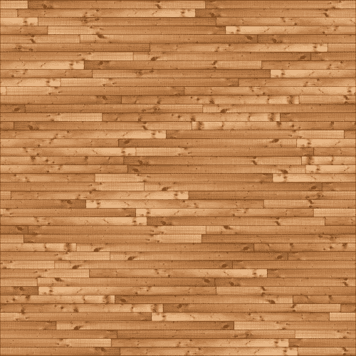
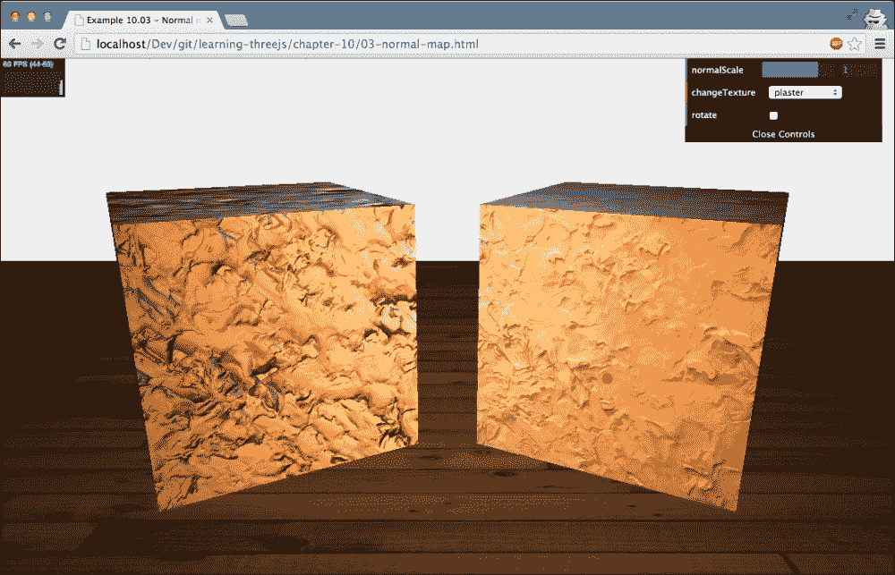
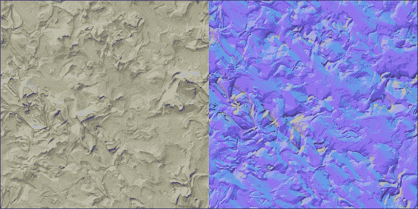
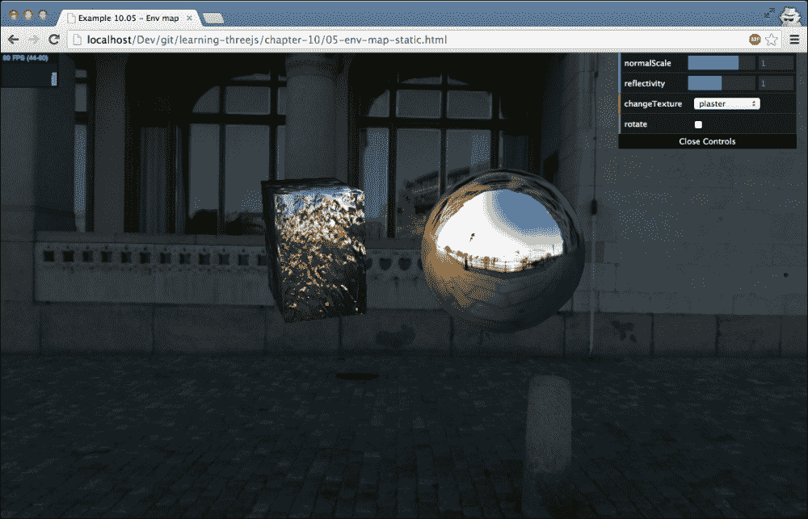
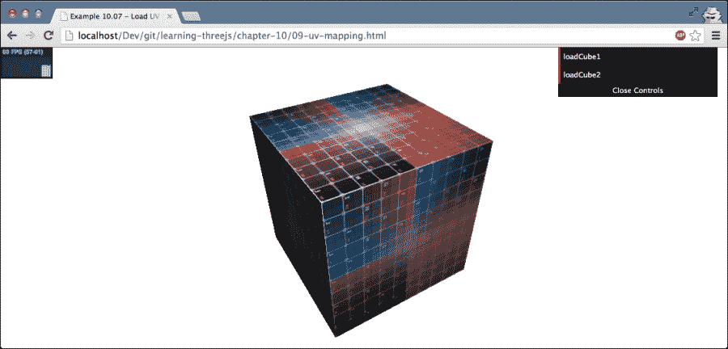
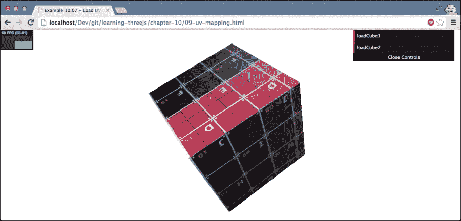
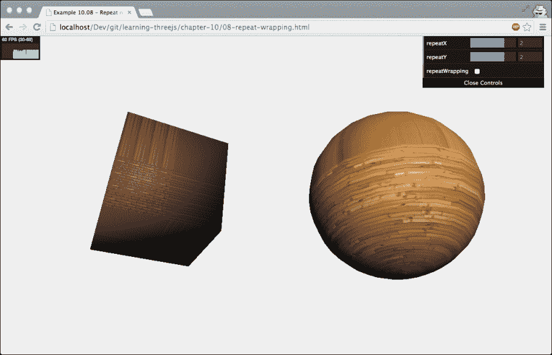
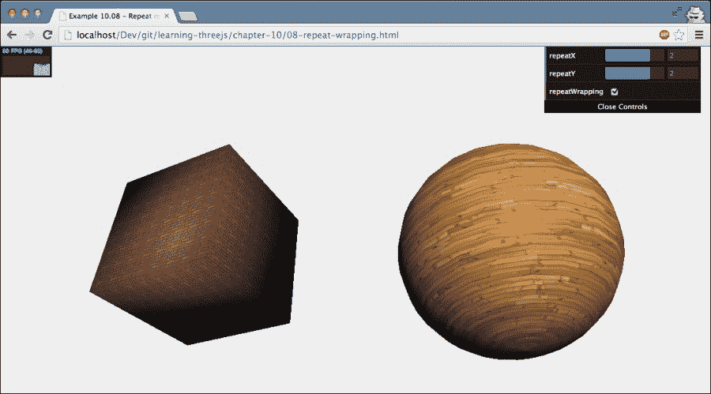
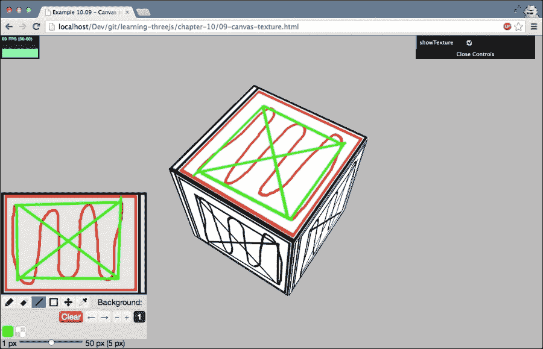
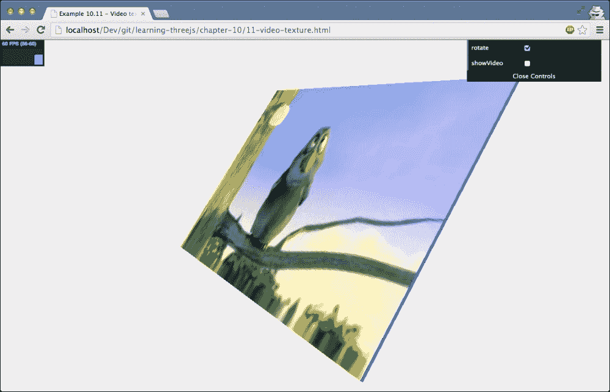

# 第十章。加载和使用纹理

在第四章中，*使用 Three.js 材质*，我们向您介绍了 Three.js 中可用的各种材质。然而，在那一章中，我们没有讨论如何将纹理应用到网格上。在本章中，我们将讨论这个主题。更具体地说，在本章中，我们将讨论以下主题：

+   在 Three.js 中加载纹理并将其应用于网格

+   使用凹凸和法线贴图为网格应用深度和细节

+   使用光照图创建假阴影

+   使用环境贴图为材质添加详细的反射

+   使用高光贴图来设置网格特定部分的*光泽*

+   微调和自定义网格的 UV 映射

+   使用 HTML5 画布和视频元素作为纹理的输入

让我们从最基本的示例开始，向您展示如何加载和应用纹理。

# 在材质中使用纹理

在 Three.js 中有不同的纹理使用方式。您可以使用它们来定义网格的颜色，但也可以使用它们来定义光泽、凹凸和反射。我们首先看的例子是最基本的方法，即使用纹理来定义网格的每个像素的颜色。

## 加载纹理并将其应用于网格

纹理的最基本用法是将其设置为材质上的映射。当您使用此材质创建网格时，网格的颜色将基于提供的纹理着色。

加载纹理并在网格上使用它可以通过以下方式完成：

```js
function createMesh(geom, imageFile) {
  var texture = THREE.ImageUtils.loadTexture("../assets/textures/general/" + imageFile)

  var mat = new THREE.MeshPhongMaterial();
  mat.map = texture;

  var mesh = new THREE.Mesh(geom, mat);
  return mesh;
}
```

在这个代码示例中，我们使用`THREE.ImageUtils.loadTexture`函数从特定位置加载图像文件。您可以使用 PNG、GIF 或 JPEG 图像作为纹理的输入。请注意，加载纹理是异步完成的。在我们的场景中，这不是一个问题，因为我们有一个`render`循环，每秒渲染大约 60 次。如果您想要等待直到纹理加载完成，您可以使用以下方法：

```js
texture = THREE.ImageUtils.loadTexture('texture.png', {}, function() { renderer.render(scene); });
```

在这个示例中，我们向`loadTexture`提供了一个回调函数。当纹理加载时，将调用此回调。在我们的示例中，我们不使用回调，而是依赖于`render`循环最终在加载纹理时显示纹理。

您几乎可以使用任何您喜欢的图像作为纹理。然而，最好的结果是当您使用一个边长是 2 的幂的正方形纹理时。因此，边长为 256 x 256、512 x 512、1024 x 1024 等尺寸效果最好。以下图像是一个正方形纹理的示例：



由于纹理的像素（也称为**texels**）通常不是一对一地映射到面的像素上，因此需要对纹理进行放大或缩小。为此，WebGL 和 Three.js 提供了一些不同的选项。您可以通过设置`magFilter`属性来指定纹理的放大方式，通过设置`minFilter`属性来指定缩小方式。这些属性可以设置为以下两个基本值：

| 名称 | 描述 |
| --- | --- |
| `THREE.NearestFilter` | 此滤镜使用它能找到的最近的像素的颜色。当用于放大时，这将导致块状，当用于缩小时，结果将丢失很多细节。 |
| `THREE.LinearFilter` | 此滤镜更先进，使用四个相邻像素的颜色值来确定正确的颜色。在缩小时仍会丢失很多细节，但放大会更加平滑，不那么块状。 |

除了这些基本值，我们还可以使用 mipmap。**Mipmap**是一组纹理图像，每个图像的尺寸都是前一个的一半。当加载纹理时会创建这些图像，并允许更平滑的过滤。因此，当您有一个正方形纹理（作为 2 的幂），您可以使用一些额外的方法来获得更好的过滤效果。这些属性可以使用以下值进行设置：

| 名称 | 描述 |
| --- | --- |
| `THREE.NearestMipMapNearestFilter` | 此属性选择最佳映射所需分辨率的 mipmap，并应用我们在前表中讨论的最近过滤原则。放大仍然很粗糙，但缩小看起来好多了。 |
| `THREE.NearestMipMapLinearFilter` | 此属性不仅选择单个 mipmap，还选择两个最接近的 mipmap 级别。在这两个级别上，应用最近的过滤器以获得两个中间结果。这两个结果通过线性过滤器传递以获得最终结果。 |
| `THREE.LinearMipMapNearestFilter` | 此属性选择最佳映射所需分辨率的 mipmap，并应用我们在前表中讨论的线性过滤原则。 |
| `THREE.LinearMipMapLinearFilter` | 此属性不仅选择单个 mipmap，还选择两个最接近的 mipmap 级别。在这两个级别上，应用线性过滤器以获得两个中间结果。这两个结果通过线性过滤器传递以获得最终结果。 |

如果您没有明确指定`magFilter`和`minFilter`属性，Three.js 将使用`THREE.LinearFilter`作为`magFilter`属性的默认值，并使用`THREE.LinearMipMapLinearFilter`作为`minFilter`属性的默认值。在我们的示例中，我们将使用这些默认属性。基本纹理的示例可以在`01-basic-texture.html`中找到。以下屏幕截图显示了此示例：


在此示例中，我们加载了一些纹理（使用您之前看到的代码）并将它们应用于各种形状。在此示例中，您可以看到纹理很好地包裹在形状周围。在 Three.js 中创建几何图形时，它会确保正确应用任何使用的纹理。这是通过一种称为**UV 映射**的东西完成的（本章后面将详细介绍）。通过 UV 映射，我们告诉渲染器应将纹理的哪一部分应用于特定的面。最简单的示例是立方体。其中一个面的 UV 映射如下所示：

```js
(0,1),(0,0),(1,0),(1,1)
```

这意味着我们对这个面使用完整的纹理（UV 值范围从 0 到 1）。

除了我们可以使用`THREE.ImageUtils.loadTexture`加载的标准图像格式之外，Three.js 还提供了一些自定义加载程序，您可以使用这些加载程序加载以不同格式提供的纹理。以下表格显示了您可以使用的其他加载程序：

| 名称 | 描述 |
| --- | --- |

| `THREE.DDSLoader` | 使用此加载程序，您可以加载以 DirectDraw Surface 格式提供的纹理。这种格式是一种专有的微软格式，用于存储压缩纹理。使用此加载程序非常简单。首先，在 HTML 页面中包含`DDSLoader.js`文件，然后使用以下内容使用纹理：

```js
var loader = new THREE.DDSLoader();
var texture = loader.load( '../assets/textures/  seafloor.dds' );

var mat = new THREE.MeshPhongMaterial();
mat.map = texture;
```

您可以在本章的源代码中看到此加载程序的示例：`01-basic-texture-dds.html`。在内部，此加载程序使用`THREE.CompressedTextureLoader`。|

| `THREE.PVRLoader` | Power VR 是另一种专有文件格式，用于存储压缩纹理。Three.js 支持 Power VR 3.0 文件格式，并可以使用以此格式提供的纹理。要使用此加载程序，请在 HTML 页面中包含`PVRLoader.js`文件，然后使用以下内容使用纹理：

```js
var loader = new THREE.DDSLoader();
var texture = loader.load( '../assets/textures/ seafloor.dds' );

var mat = new THREE.MeshPhongMaterial();
mat.map = texture;
```

您可以在本章的源代码中看到此加载程序的示例：`01-basic-texture-pvr.html`。请注意，并非所有的 WebGL 实现都支持此格式的纹理。因此，当您使用此格式但未看到纹理时，请检查控制台以查看错误。在内部，此加载程序还使用`THREE.CompressedTextureLoader`。|

| `THREE.TGALoader` | Targa 是一种光栅图形文件格式，仍然被大量 3D 软件程序使用。使用`THREE.TGALoader`对象，您可以在 3D 模型中使用以此格式提供的纹理。要使用这些图像文件，您首先必须在 HTML 中包含`TGALoader.js`文件，然后可以使用以下内容加载 TGA 纹理：

```js
var loader = new THREE.TGALoader();
var texture = loader.load( '../assets/textures/crate_color8.tga' );

var mat = new THREE.MeshPhongMaterial();
mat.map = texture;
```

本章的源代码中提供了此加载器的示例。您可以通过在浏览器中打开`01-basic-texture-tga.html`来查看此示例。|

在这些示例中，我们使用纹理来定义网格像素的颜色。我们还可以将纹理用于其他目的。以下两个示例用于定义如何应用阴影到材质上。您可以使用这个来在网格表面创建凸起和皱纹。

## 使用凸起贴图创建皱纹

**凸起贴图**用于增加材质的深度。您可以通过打开`02-bump-map.html`示例来看到其效果。请参考以下截图查看示例：


在此示例中，您可以看到左侧墙看起来比右侧墙更详细，并且在比较时似乎具有更多的深度。这是通过在材质上设置额外的纹理，所谓的凸起贴图来实现的：

```js
function createMesh(geom, imageFile, bump) {
  var texture = THREE.ImageUtils.loadTexture("../assets/textures/general/" + imageFile)
  var mat = new THREE.MeshPhongMaterial();
  mat.map = texture;

  var bump = THREE.ImageUtils.loadTexture(
    "../assets/textures/general/" + bump)
  mat.bumpMap = bump;
  mat.bumpScale = 0.2;

  var mesh = new THREE.Mesh(geom, mat);
  return mesh;
}
```

您可以在此代码中看到，除了设置`map`属性之外，我们还将`bumpMap`属性设置为纹理。另外，通过`bumpScale`属性，我们可以设置凸起的高度（或如果设置为负值则为深度）。此示例中使用的纹理如下所示：


凸起贴图是灰度图像，但您也可以使用彩色图像。像素的强度定义了凸起的高度。凸起贴图只包含像素的相对高度。它并不表示坡度的方向。因此，使用凸起贴图可以达到的细节水平和深度感知是有限的。要获得更多细节，您可以使用法线贴图。

## 使用法线贴图实现更详细的凸起和皱纹

在法线贴图中，高度（位移）不会被存储，而是存储了每个图像的法线方向。不详细介绍，使用法线贴图，您可以创建看起来非常详细的模型，而仍然只使用少量的顶点和面。例如，查看`03-normal-map.html`示例。以下截图显示了此示例：



在此截图中，您可以看到左侧有一个非常详细的抹灰立方体。光源在立方体周围移动，您可以看到纹理对光源的自然响应。这提供了一个非常逼真的模型，只需要一个非常简单的模型和几个纹理。以下代码片段显示了如何在 Three.js 中使用法线贴图：

```js
function createMesh(geom, imageFile, normal) {
  var t = THREE.ImageUtils.loadTexture("../assets/textures/general/" + imageFile);
  var m = THREE.ImageUtils.loadTexture("../assets/textures/general/" + normal);

  var mat2 = new THREE.MeshPhongMaterial();
  mat2.map = t;
  mat2.normalMap = m;

  var mesh = new THREE.Mesh(geom, mat2);
  return mesh;
}
```

这里使用的方法与凸起贴图相同。不过这次，我们将`normalMap`属性设置为法线纹理。我们还可以通过设置`normalScale`属性`mat.normalScale.set(1,1)`来定义凸起的外观。通过这两个属性，您可以沿着*x*和*y*轴进行缩放。不过，最好的方法是保持这些值相同以获得最佳效果。请注意，再次强调，当这些值低于零时，高度会反转。以下截图显示了纹理（左侧）和法线贴图（右侧）：



然而，法线贴图的问题在于它们不太容易创建。您需要使用专门的工具，如 Blender 或 Photoshop。它们可以使用高分辨率渲染或纹理作为输入，并从中创建法线贴图。

Three.js 还提供了一种在运行时执行此操作的方法。`THREE.ImageUtils`对象有一个名为`getNormalMap`的函数，它接受 JavaScript/DOM`Image`作为输入，并将其转换为法线贴图。

## 使用光照贴图创建虚假阴影

在之前的示例中，我们使用特定的贴图来创建看起来真实的阴影，这些阴影会对房间中的光照做出反应。还有另一种选择可以创建假阴影。在本节中，我们将使用光照贴图。**光照贴图**是一个预渲染的阴影（也称为预烘烤阴影），您可以使用它来营造真实阴影的错觉。以下截图来自`04-light-map.html`示例，展示了这个效果：


如果您看一下之前的示例，会发现有两个非常漂亮的阴影，似乎是由两个立方体投射出来的。然而，这些阴影是基于一个看起来像下面这样的光照贴图的：


正如您所看到的，光照贴图中指定的阴影也显示在地面上，营造出真实阴影的错觉。您可以使用这种技术创建高分辨率的阴影，而不会产生沉重的渲染惩罚。当然，这仅适用于静态场景。使用光照贴图与使用其他纹理基本相同，只有一些小差异。以下是我们使用光照贴图的方法：

```js
var lm = THREE.ImageUtils.loadTexture('../assets/textures/lightmap/lm-1.png');
var wood = THREE.ImageUtils.loadTexture('../assets/textures/general/floor-wood.jpg');
var groundMaterial = new THREE.MeshBasicMaterial({lightMap: lm, map: wood});
groundGeom.faceVertexUvs[1] = groundGeom.faceVertexUvs[0];
```

要应用光照贴图，我们只需要将材质的`lightMap`属性设置为我们刚刚展示的光照贴图。然而，还需要额外的步骤才能让光照贴图显示出来。我们需要明确定义 UV 映射（纹理在面上的哪一部分）以便独立应用和映射光照贴图。在我们的示例中，我们只使用了基本的 UV 映射，这是在创建地面时由 Three.js 自动创建的。更多信息和为什么需要明确定义 UV 映射的背景可以在[`stackoverflow.com/questions/15137695/three-js-lightmap-causes-an-error-webglrenderingcontext-gl-error-gl-invalid-op`](http://stackoverflow.com/questions/15137695/three-js-lightmap-causes-an-error-webglrenderingcontext-gl-error-gl-invalid-op)找到。

当阴影贴图正确放置后，我们需要将立方体放置在正确的位置，以便看起来阴影是由它们投射出来的。

Three.js 提供了另一种纹理，您可以使用它来模拟高级的 3D 效果。在下一节中，我们将看看如何使用环境贴图来模拟反射。

## 使用环境贴图创建假反射

计算环境反射非常消耗 CPU，并且通常需要使用光线追踪器方法。如果您想在 Three.js 中使用反射，仍然可以做到，但您需要模拟它。您可以通过创建对象所在环境的纹理并将其应用于特定对象来实现这一点。首先，我们将展示我们的目标结果（请参阅`05-env-map-static.html`，也显示在以下截图中）：



在这个截图中，您可以看到球体和立方体反射了环境。如果您移动鼠标，还可以看到反射与您在城市环境中的相机角度相对应。为了创建这个示例，我们执行以下步骤：

1.  **创建 CubeMap 对象**：我们需要做的第一件事是创建一个`CubeMap`对象。`CubeMap`是一组可以应用于立方体每一面的六个纹理。

1.  **使用这个 CubeMap 对象创建一个盒子**：带有`CubeMap`的盒子是您在移动相机时看到的环境。它给人一种错觉，好像您站在一个可以四处看的环境中。实际上，您是在一个立方体内部，内部渲染了纹理，给人一种空间的错觉。

1.  **将 CubeMap 对象应用为纹理**：我们用来模拟环境的`CubeMap`对象也可以作为网格的纹理。Three.js 会确保它看起来像环境的反射。

一旦您获得了源材料，创建`CubeMap`就非常简单。您需要的是六张图片，它们共同组成一个完整的环境。因此，您需要以下图片：向前看（`posz`）、向后看（`negz`）、向上看（`posy`）、向下看（`negy`）、向右看（`posx`）和向左看（`negx`）。Three.js 将这些拼接在一起，以创建一个无缝的环境映射。有几个网站可以下载这些图片。本例中使用的图片来自[`www.humus.name/index.php?page=Textures`](http://www.humus.name/index.php?page=Textures)。

一旦您获得了六张单独的图片，您可以按照以下代码片段中所示的方式加载它们：

```js
function createCubeMap() {

  var path = "../assets/textures/cubemap/parliament/";
  var format = '.jpg';
  var urls = [
    path + 'posx' + format, path + 'negx' + format,
    path + 'posy' + format, path + 'negy' + format,
    path + 'posz' + format, path + 'negz' + format
  ];

  var textureCube = THREE.ImageUtils.loadTextureCube( urls );
  return textureCube;
}
```

我们再次使用`THREE.ImageUtils` JavaScript 对象，但这次，我们传入一个纹理数组，并使用`loadTextureCube`函数创建`CubeMap`对象。如果您已经有了 360 度全景图像，您也可以将其转换为一组图像，以便创建`CubeMap`。只需转到[`gonchar.me/panorama/`](http://gonchar.me/panorama/)来转换图像，您最终会得到六张带有名称如`right.png`、`left.png`、`top.png`、`bottom.png`、`front.png`和`back.png`的图像。您可以通过创建以下方式的`urls`变量来使用这些图像：

```js
var urls = [
  'right.png',
  'left.png',
  'top.png',
  'bottom.png',
  'front.png',
  'back.png'
];
```

或者，您还可以在加载场景时让 Three.js 处理转换，方法是创建`textureCube`，如下所示：

```js
var textureCube = THREE.ImageUtils.loadTexture("360-degrees.png", new THREE.UVMapping());
```

使用`CubeMap`，我们首先创建一个盒子，可以这样创建：

```js
var textureCube = createCubeMap();
var shader = THREE.ShaderLib[ "cube" ];
shader.uniforms[ "tCube" ].value = textureCube;
var material = new THREE.ShaderMaterial( {
  fragmentShader: shader.fragmentShader,
  vertexShader: shader.vertexShader,
  uniforms: shader.uniforms,
  depthWrite: false,
  side: THREE.BackSide
});
cubeMesh = new THREE.Mesh(new THREE.BoxGeometry(100, 100, 100), material);
```

Three.js 提供了一个特定的着色器，我们可以使用`THREE.ShaderMaterial`来基于`CubeMap`创建一个环境（`var shader = THREE.ShaderLib[ "cube" ];`）。我们使用`CubeMap`配置此着色器，创建一个网格，并将其添加到场景中。如果从内部看，这个网格代表我们所处的虚假环境。

这个相同的`CubeMap`对象应该应用于我们想要渲染的网格，以创建虚假的反射：

```js
var sphere1 = createMesh(new THREE.SphereGeometry(10, 15, 15), "plaster.jpg");
sphere1.material.envMap = textureCube;
sphere1.rotation.y = -0.5;
sphere1.position.x = 12;
sphere1.position.y = 5;
scene.add(sphere1);

var cube = createMesh(new THREE.CubeGeometry(10, 15, 15), "plaster.jpg","plaster-normal.jpg");
sphere2.material.envMap = textureCube;
sphere2.rotation.y = 0.5;
sphere2.position.x = -12;
sphere2.position.y = 5;
scene.add(cube);
```

如您所见，我们将材质的`envMap`属性设置为我们创建的`cubeMap`对象。结果是一个场景，看起来我们站在一个宽阔的室外环境中，网格反映了这个环境。如果您使用滑块，可以设置材质的`reflectivity`属性，正如其名称所示，这决定了材质反射了多少环境。

除了反射，Three.js 还允许您为折射（类似玻璃的对象）使用`CubeMap`对象。以下屏幕截图显示了这一点：


要获得这种效果，我们只需要将纹理加载更改为以下内容：

```js
var textureCube = THREE.ImageUtils.loadTextureCube( urls, new THREE.CubeRefractionMapping());
```

您可以使用材质上的`refraction`属性来控制`refraction`比例，就像使用`reflection`属性一样。在本例中，我们为网格使用了静态环境映射。换句话说，我们只看到了环境反射，而没有看到环境中的其他网格。在下面的屏幕截图中（您可以通过在浏览器中打开`05-env-map-dynamic.html`来查看），我们将向您展示如何创建一个反射，同时还显示场景中的其他对象：


要显示场景中其他对象的反射，我们需要使用一些其他 Three.js 组件。我们需要的第一件事是一个名为`THREE.CubeCamera`的额外相机：

```js
Var cubeCamera = new THREE.CubeCamera(0.1, 20000, 256);
scene.add(cubeCamera);
```

我们将使用`THREE.CubeCamera`来拍摄包含所有渲染对象的场景快照，并使用它来设置`CubeMap`。您需要确保将此相机定位在您想要显示动态反射的`THREE.Mesh`的确切位置上。在本例中，我们将仅在中心球上显示反射（如前一个屏幕截图中所示）。该球位于位置 0, 0, 0，因此在本例中，我们不需要显式定位`THREE.CubeCamera`。

我们只将动态反射应用于球体，因此我们需要两种不同的材质：

```js
var dynamicEnvMaterial = new THREE.MeshBasicMaterial({envMap: cubeCamera.renderTarget });
var envMaterial = new THREE.MeshBasicMaterial({envMap: textureCube });
```

与我们之前的例子的主要区别是，对于动态反射，我们将`envMap`属性设置为`cubeCamera.renderTarget`，而不是我们之前创建的`textureCube`。对于这个例子，我们在中心球体上使用`dynamicEnvMaterial`，在其他两个对象上使用`envMaterial`：

```js
sphere = new THREE.Mesh(sphereGeometry, dynamicEnvMaterial);
sphere.name = 'sphere';
scene.add(sphere);

var cylinder = new THREE.Mesh(cylinderGeometry, envMaterial);
cylinder.name = 'cylinder';
scene.add(cylinder);
cylinder.position.set(10, 0, 0);

var cube = new THREE.Mesh(boxGeometry, envMaterial);
cube.name = 'cube';
scene.add(cube);
cube.position.set(-10, 0, 0);
```

现在剩下的就是确保`cubeCamera`渲染场景，这样我们就可以将其输出用作中心球体的输入。为此，我们更新`render`循环如下：

```js
function render() {
  sphere.visible = false;
  cubeCamera.updateCubeMap( renderer, scene );
  sphere.visible = true;
  renderer.render(scene, camera);
  ...
  requestAnimationFrame(render);
}
```

正如你所看到的，我们首先禁用了`sphere`的可见性。我们这样做是因为我们只想看到来自其他两个对象的反射。接下来，我们通过调用`updateCubeMap`函数使用`cubeCamera`渲染场景。之后，我们再次使`sphere`可见，并像平常一样渲染场景。结果是，在球体的反射中，你可以看到立方体和圆柱的反射。

我们将看到的基本材质的最后一个是高光贴图。

## 高光贴图

使用**高光贴图**，你可以指定一个定义材质光泽度和高光颜色的贴图。例如，在下面的截图中，我们使用了高光贴图和法线贴图来渲染一个地球。你可以在浏览器中打开`06-specular-map.html`来查看这个例子。其结果也显示在下面的截图中：


在这个截图中，你可以看到海洋被突出显示并反射光线。另一方面，大陆非常黑暗，不反射（太多）光线。为了达到这种效果，我们没有使用任何特定的法线纹理，而只使用了法线贴图来显示高度和以下高光贴图来突出显示海洋：


基本上，像素的值越高（从黑色到白色），表面看起来就越有光泽。高光贴图通常与`specular`属性一起使用，你可以用它来确定反射的颜色。在这种情况下，它被设置为红色：

```js
var specularTexture=THREE.ImageUtils.loadTexture("../assets/textures/planets/EarthSpec.png");
var normalTexture=THREE.ImageUtils.loadTexture("../assets/textures/planets/EarthNormal.png");

var planetMaterial = new THREE.MeshPhongMaterial();
planetMaterial.specularMap = specularTexture;
planetMaterial.specular = new THREE.Color( 0xff0000 );
planetMaterial.shininess = 1;

planetMaterial.normalMap = normalTexture;
```

还要注意的是，通常使用低光泽度可以实现最佳效果，但根据光照和你使用的高光贴图，你可能需要进行实验以获得期望的效果。

# 纹理的高级用法

在上一节中，我们看到了一些基本的纹理用法。Three.js 还提供了更高级纹理用法的选项。在本节中，我们将看一下 Three.js 提供的一些选项。

## 自定义 UV 映射

我们将从更深入地了解 UV 映射开始。我们之前解释过，使用 UV 映射，你可以指定纹理的哪一部分显示在特定的面上。当你在 Three.js 中创建几何体时，这些映射也会根据你创建的几何体类型自动创建。在大多数情况下，你不需要真正改变这个默认的 UV 映射。理解 UV 映射工作原理的一个好方法是看一个来自 Blender 的例子，如下面的截图所示：


在这个例子中，你可以看到两个窗口。左侧的窗口包含一个立方体几何体。右侧的窗口是 UV 映射，我们加载了一个示例纹理来展示映射的方式。在这个例子中，我们选择了左侧窗口的一个单独面，并且右侧窗口显示了这个面的 UV 映射。你可以看到，面的每个顶点都位于右侧 UV 映射的一个角落（小圆圈）。这意味着完整的纹理将被用于这个面。这个立方体的所有其他面也以相同的方式映射，因此结果将显示一个每个面都显示完整纹理的立方体；参见`07-uv-mapping.html`，也显示在下面的截图中：



这是 Blender 中（也是 Three.js 中）立方体的默认设置。让我们通过只选择纹理的三分之二来改变 UV（在下面的截图中看到所选区域）：


如果我们现在在 Three.js 中展示这个，你会看到纹理被应用的方式不同，如下截图所示：



自定义 UV 映射通常是从诸如 Blender 之类的程序中完成的，特别是当模型变得更加复杂时。这里最重要的部分是记住 UV 映射在两个维度上运行，从 0 到 1。要自定义 UV 映射，你需要为每个面定义应该显示纹理的部分。你需要通过定义组成面的每个顶点的`u`和`v`坐标来实现这一点。你可以使用以下代码来设置`u`和`v`值：

```js
geom.faceVertexUvs[0][0][0].x = 0.5;
geom.faceVertexUvs[0][0][0].y = 0.7;
geom.faceVertexUvs[0][0][1].x = 0.4;
geom.faceVertexUvs[0][0][1].y = 0.1;
geom.faceVertexUvs[0][0][2].x = 0.4;
geom.faceVertexUvs[0][0][2].y = 0.5;
```

这段代码将把第一个面的`uv`属性设置为指定的值。记住每个面由三个顶点定义，所以要设置一个面的所有`uv`值，我们需要设置六个属性。如果你打开`07-uv-mapping-manual.html`例子，你可以看到当你手动改变`uv`映射时会发生什么。以下截图展示了这个例子：


接下来，我们将看一下纹理如何通过一些内部 UV 映射技巧来重复。

## 重复包装

当你在 Three.js 中应用纹理到一个几何体上时，Three.js 会尽可能地优化应用纹理。例如，对于立方体，这意味着每一面都会显示完整的纹理，对于球体，完整的纹理会被包裹在球体周围。然而，有些情况下你可能不希望纹理在整个面或整个几何体上展开，而是希望纹理重复出现。Three.js 提供了详细的功能来控制这一点。一个可以用来调整重复属性的例子在`08-repeat-wrapping.html`中提供。以下截图展示了这个例子：



在这个例子中，你可以设置控制纹理重复的属性。

在这个属性产生期望效果之前，你需要确保你将纹理的包装设置为`THREE.RepeatWrapping`，如下代码片段所示：

```js
cube.material.map.wrapS = THREE.RepeatWrapping;
cube.material.map.wrapT = THREE.RepeatWrapping;
```

`wrapS`属性定义了你希望纹理在*x*轴上的行为，`wrapT`属性定义了纹理在*y*轴上的行为。Three.js 为此提供了两个选项，如下所示：

+   `THREE.RepeatWrapping`允许纹理重复出现。

+   `THREE.ClampToEdgeWrapping`是默认设置。使用`THREE.ClampToEdgeWrapping`，纹理不会整体重复，而只有边缘的像素会重复。

如果你禁用了**repeatWrapping**菜单选项，将会使用`THREE.ClampToEdgeWrapping`选项，如下所示：



如果我们使用`THREE.RepeatWrapping`，我们可以设置`repeat`属性，如下代码片段所示：

```js
cube.material.map.repeat.set(repeatX, repeatY);
```

`repeatX`变量定义了纹理在*x*轴上重复的次数，`repeatY`变量定义了在*y*轴上的重复次数。如果这些值设置为`1`，纹理就不会重复；如果设置为更高的值，你会看到纹理开始重复。你也可以使用小于 1 的值。在这种情况下，你会看到你会放大纹理。如果你将重复值设置为负值，纹理会被镜像。

当你改变`repeat`属性时，Three.js 会自动更新纹理并使用新的设置进行渲染。如果你从`THREE.RepeatWrapping`改变到`THREE.ClampToEdgeWrapping`，你需要显式地更新纹理：

```js
cube.material.map.needsUpdate = true;
```

到目前为止，我们只使用了静态图像作为纹理。然而，Three.js 也有选项可以使用 HTML5 画布作为纹理。

## 渲染到画布并将其用作纹理

在本节中，我们将看两个不同的示例。首先，我们将看一下如何使用画布创建一个简单的纹理并将其应用于网格，然后，我们将进一步创建一个可以用作凹凸贴图的画布，使用随机生成的图案。

### 使用画布作为纹理

在第一个示例中，我们将使用**Literally**库（来自[`literallycanvas.com/`](http://literallycanvas.com/)）创建一个交互式画布，您可以在其上绘制；请参见以下截图的左下角。您可以在`09-canvas-texture`中查看此示例。随后的截图显示了此示例：



您在此画布上绘制的任何内容都会直接呈现在立方体上作为纹理。在 Three.js 中实现这一点非常简单，只需要几个步骤。我们需要做的第一件事是创建一个画布元素，并且对于这个特定的示例，配置它以便与`Literally`库一起使用，如下所示：

```js
<div class="fs-container">
  <div id="canvas-output" style="float:left">
  </div>
</div>
...
var canvas = document.createElement("canvas");
$('#canvas-output')[0].appendChild(canvas);
$('#canvas-output').literallycanvas(
  {imageURLPrefix: '../libs/literally/img'});
```

我们只需从 JavaScript 中创建一个`canvas`元素，并将其添加到特定的`div`元素中。通过`literallycanvas`调用，我们可以创建绘图工具，您可以直接在画布上绘制。接下来，我们需要创建一个使用画布绘制作为其输入的纹理：

```js
function createMesh(geom) {

  var canvasMap = new THREE.Texture(canvas);
  var mat = new THREE.MeshPhongMaterial();
  mat.map = canvasMap;
  var mesh = new THREE.Mesh(geom,mat);

  return mesh;
}
```

正如代码所示，您在创建新纹理时所需做的唯一事情就是在传入画布元素的引用时，`new THREE.Texture(canvas)`。这将创建一个使用画布元素作为其材质的纹理。剩下的就是在每次渲染时更新材质，以便在立方体上显示画布绘制的最新版本，如下所示：

```js
function render() {
  stats.update();

  cube.rotation.y += 0.01;
  cube.rotation.x += 0.01;

  cube.material.map.needsUpdate = true;
  requestAnimationFrame(render);
  webGLRenderer.render(scene, camera);
}
```

为了通知 Three.js 我们想要更新纹理，我们只需将纹理的`needsUpdate`属性设置为`true`。在这个示例中，我们已经将画布元素用作最简单的纹理输入。当然，我们可以使用相同的思路来处理到目前为止看到的所有不同类型的地图。在下一个示例中，我们将把它用作凹凸贴图。

### 使用画布作为凹凸贴图

正如我们在本章前面看到的，我们可以使用凹凸贴图创建一个简单的皱纹纹理。在这个地图中，像素的强度越高，皱纹越深。由于凹凸贴图只是一个简单的黑白图像，所以我们可以在画布上创建这个图像，并将该画布用作凹凸贴图的输入。

在下一个示例中，我们使用画布生成一个随机灰度图像，并将该图像用作我们应用于立方体的凹凸贴图的输入。请参见`09-canvas-texture-bumpmap.html`示例。以下截图显示了此示例：


这需要的 JavaScript 代码与我们之前解释的示例并没有太大不同。我们需要创建一个画布元素，并用一些随机噪声填充这个画布。对于噪声，我们使用**Perlin noise**。Perlin noise ([`en.wikipedia.org/wiki/Perlin_noise`](http://en.wikipedia.org/wiki/Perlin_noise)) 生成一个非常自然的随机纹理，正如您在前面的截图中所看到的。我们使用来自[`github.com/wwwtyro/perlin.js`](https://github.com/wwwtyro/perlin.js)的 Perlin noise 函数来实现这一点：

```js
var ctx = canvas.getContext("2d");
function fillWithPerlin(perlin, ctx) {

  for (var x = 0; x < 512; x++) {
    for (var y = 0; y < 512; y++) {
      var base = new THREE.Color(0xffffff);
      var value = perlin.noise(x / 10, y / 10, 0);
      base.multiplyScalar(value);
      ctx.fillStyle = "#" + base.getHexString();
      ctx.fillRect(x, y, 1, 1);
    }
  }
}
```

我们使用`perlin.noise`函数根据画布元素的*x*和*y*坐标创建一个从 0 到 1 的值。这个值用于在画布元素上绘制一个单个像素。对所有像素执行此操作会创建一个随机地图，您也可以在上一张截图的左下角看到。然后可以轻松地将此地图用作凹凸贴图。以下是创建随机地图的方法：

```js
var bumpMap = new THREE.Texture(canvas);

var mat = new THREE.MeshPhongMaterial();
mat.color = new THREE.Color(0x77ff77);
mat.bumpMap = bumpMap;
bumpMap.needsUpdate = true;

var mesh = new THREE.Mesh(geom, mat);
return mesh;
```

### 提示

在这个例子中，我们使用 HTML 画布元素渲染了 Perlin 噪声。Three.js 还提供了一种动态创建纹理的替代方法。`THREE.ImageUtils`对象有一个`generateDataTexture`函数，你可以使用它来创建特定大小的`THREE.DataTexture`纹理。这个纹理包含在`image.data`属性中的`Uint8Array`，你可以直接使用它来设置这个纹理的 RGB 值。

我们用于纹理的最终输入是另一个 HTML 元素：HTML5 视频元素。

## 使用视频输出作为纹理

如果你读过前面关于渲染到画布的段落，你可能会考虑将视频渲染到画布并将其用作纹理的输入。这是一个选择，但是 Three.js（通过 WebGL）已经直接支持使用 HTML5 视频元素。查看`11-video-texture.html`。参考以下截图，了解这个例子的静态图像：



使用视频作为纹理的输入，就像使用画布元素一样，非常容易。首先，我们需要有一个视频元素来播放视频：

```js
<video  id="video"
  style="display: none;
  position: absolute; left: 15px; top: 75px;"
  src="../assets/movies/Big_Buck_Bunny_small.ogv"
  controls="true" autoplay="true">
</video>
```

这只是一个基本的 HTML5 视频元素，我们设置为自动播放。接下来，我们可以配置 Three.js 以将此视频用作纹理的输入，如下所示：

```js
var video  = document.getElementById('video');
texture = new THREE.Texture(video);
texture.minFilter = THREE.LinearFilter;
texture.magFilter = THREE.LinearFilter;
texture.generateMipmaps = false;
```

由于我们的视频不是正方形的，我们需要确保在材质上禁用 mipmap 生成。我们还设置了一些简单的高性能滤镜，因为材质经常变化。现在剩下的就是创建一个网格并设置纹理。在这个例子中，我们使用了`MeshFaceMaterial`和`MeshBasicMaterial`：

```js
var materialArray = [];
materialArray.push(new THREE.MeshBasicMaterial({color: 0x0051ba}));
materialArray.push(new THREE.MeshBasicMaterial({color: 0x0051ba}));
materialArray.push(new THREE.MeshBasicMaterial({color: 0x0051ba}));
materialArray.push(new THREE.MeshBasicMaterial({color: 0x0051ba}));
materialArray.push(new THREE.MeshBasicMaterial({map: texture }));
materialArray.push(new THREE.MeshBasicMaterial({color: 0xff51ba}));

var faceMaterial = new THREE.MeshFaceMaterial(materialArray);
var mesh = new THREE.Mesh(geom,faceMaterial);
```

现在剩下的就是确保在我们的`render`循环中更新纹理，如下所示：

```js
if ( video.readyState === video.HAVE_ENOUGH_DATA ) {
  if (texture) texture.needsUpdate = true;
}
```

在这个例子中，我们只是将视频渲染到立方体的一侧，但由于这是一个普通的纹理，我们可以随心所欲地使用它。例如，我们可以使用自定义 UV 映射沿着立方体的边缘分割它，或者甚至将视频输入用作凹凸贴图或法线贴图的输入。

在 Three.js 版本 r69 中，引入了一个专门用于处理视频的纹理。这个纹理（`THREE.VideoTexture`）包装了你在本节中看到的代码，你可以使用`THREE.VideoTexture`方法作为一种替代方法。以下代码片段显示了如何使用`THREE.VideoTexture`创建纹理（你可以通过查看`11-video-texture.html`示例来查看这个过程）：

```js
var video = document.getElementById('video');
texture = new THREE.VideoTexture(video);
```

# 总结

因此，我们结束了关于纹理的这一章。正如你所看到的，Three.js 中有许多不同类型的纹理，每种都有不同的用途。你可以使用 PNG、JPG、GIF、TGA、DDS 或 PVR 格式的任何图像作为纹理。加载这些图像是异步进行的，所以记得要么使用渲染循环，要么在加载纹理时添加回调。使用纹理，你可以从低多边形模型创建出色的对象，甚至可以使用凹凸贴图和法线贴图添加虚假的详细深度。使用 Three.js，还可以使用 HTML5 画布元素或视频元素轻松创建动态纹理。只需定义一个以这些元素为输入的纹理，并在需要更新纹理时将`needsUpdate`属性设置为`true`。

通过这一章，我们基本上涵盖了 Three.js 的所有重要概念。然而，我们还没有看到 Three.js 提供的一个有趣的功能——**后期处理**。通过后期处理，你可以在场景渲染后添加效果。例如，你可以模糊或着色你的场景，或者使用扫描线添加类似电视的效果。在下一章中，我们将看看后期处理以及如何将其应用到你的场景中。
