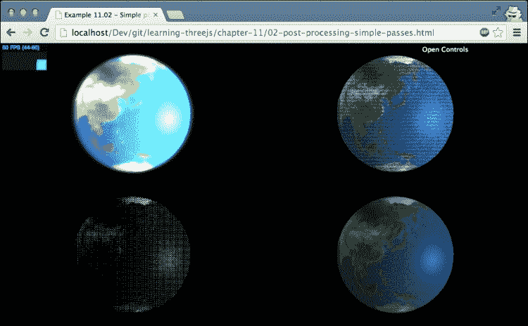
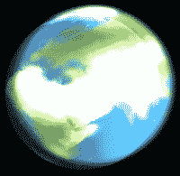
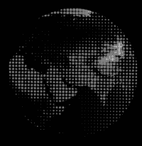
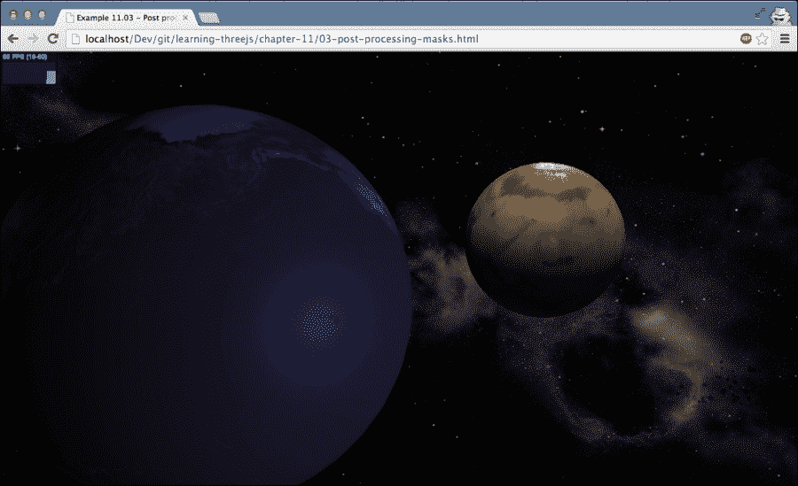
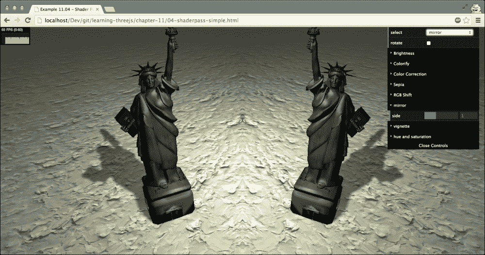
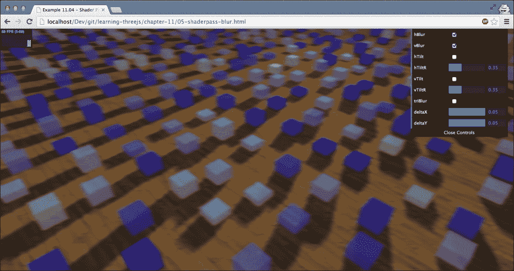
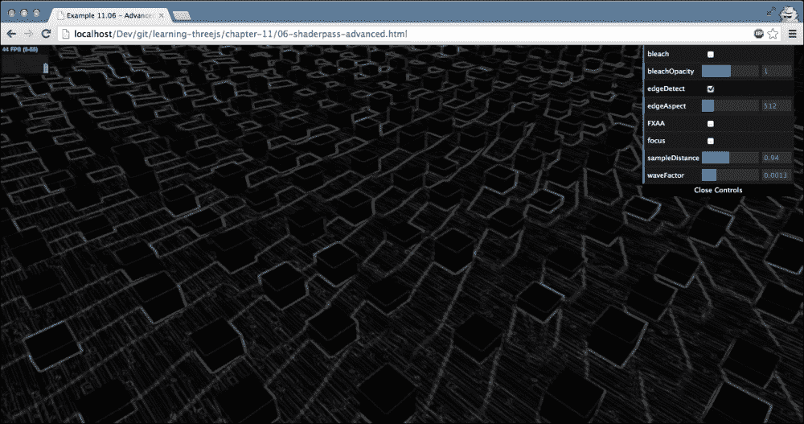
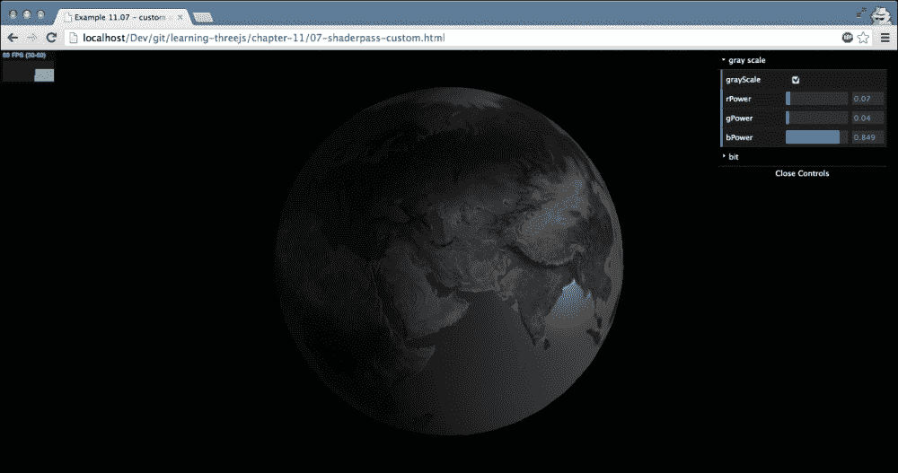

# 第十一章：自定义着色器和渲染后期处理

我们即将结束这本书，在本章中，我们将看一下我们尚未涉及的 Three.js 的主要特性：渲染后期处理。除此之外，在本章中，我们还将介绍如何创建自定义着色器。本章我们将讨论的主要内容如下：

+   为后期处理设置 Three.js

+   讨论 Three.js 提供的基本后期处理通道，比如`THREE.BloomPass`和`THREE.FilmPass`

+   使用蒙版将效果应用于场景的一部分

+   使用`THREE.TexturePass`来存储渲染结果

+   使用`THREE.ShaderPass`添加更基本的后期处理效果，比如棕褐色滤镜，镜像效果和颜色调整

+   使用`THREE.ShaderPass`进行各种模糊效果和更高级的滤镜

+   通过编写一个简单的着色器创建自定义后期处理效果

在第一章的*介绍 requestAnimationFrame*部分，*使用 Three.js 创建您的第一个 3D 场景*，我们设置了一个渲染循环，我们在整本书中都用来渲染和动画我们的场景。对于后期处理，我们需要对这个设置进行一些更改，以允许 Three.js 对最终渲染进行后期处理。在第一部分中，我们将看看如何做到这一点。

# 为后期处理设置 Three.js

为了为后期处理设置 Three.js，我们需要对我们当前的设置进行一些更改。我们需要采取以下步骤：

1.  创建`THREE.EffectComposer`，我们可以用来添加后期处理通道。

1.  配置`THREE.EffectComposer`，使其渲染我们的场景并应用任何额外的后期处理步骤。

1.  在渲染循环中，使用`THREE.EffectComposer`来渲染场景，应用通道，并显示输出。

和往常一样，我们有一个可以用来实验并用于自己用途的例子。本章的第一个例子可以从`01-basic-effect-composer.html`中访问。您可以使用右上角的菜单修改此示例中使用的后期处理步骤的属性。在这个例子中，我们渲染了一个简单的地球，并为其添加了类似旧电视的效果。这个电视效果是在使用`THREE.EffectComposer`渲染场景之后添加的。以下截图显示了这个例子：


## 创建 THREE.EffectComposer

让我们首先看一下您需要包含的额外 JavaScript 文件。这些文件可以在 Three.js 分发的`examples/js/postprocessing`和`examples/js/shaders`目录中找到。

使`THREE.EffectComposer`工作所需的最小设置如下：

```js
<script type="text/javascript" src="../libs/postprocessing/EffectComposer.js"></script>
<script type="text/javascript" src="../libs/postprocessing/MaskPass.js"></script>
<script type="text/javascript" src="../libs/postprocessing/RenderPass.js"></script>
<script type="text/javascript" src="../libs/shaders/CopyShader.js"></script>
<script type="text/javascript" src="../libs/postprocessing/ShaderPass.js"></script>
```

`EffectComposer.js`文件提供了`THREE.EffectComposer`对象，允许我们添加后期处理步骤。`MaskPass.js`，`ShaderPass.js`和`CopyShader.js`在`THREE.EffectComposer`内部使用，`RenderPass.js`允许我们向`THREE.EffectComposer`添加渲染通道。没有这个通道，我们的场景将根本不会被渲染。

在这个例子中，我们添加了两个额外的 JavaScript 文件，为我们的场景添加了类似电影的效果：

```js
<script type="text/javascript" src="../libs/postprocessing/FilmPass.js"></script>
<script type="text/javascript" src="../libs/shaders/FilmShader.js"></script>
```

我们需要做的第一件事是创建`THREE.EffectComposer`。您可以通过将`THREE.WebGLRenderer`传递给它的构造函数来实现：

```js
var webGLRenderer = new THREE.WebGLRenderer();
var composer = new THREE.EffectComposer(webGLRenderer);
```

接下来，我们向这个合成器添加各种*通道*。

### 为后期处理配置 THREE.EffectComposer

每个通道按照添加到`THREE.EffectComposer`的顺序执行。我们添加的第一个通道是`THREE.RenderPass`。接下来的通道渲染了我们的场景，但还没有输出到屏幕上：

```js
var renderPass = new THREE.RenderPass(scene, camera);
composer.addPass(renderPass);
```

要创建`THREE.RenderPass`，我们传入要渲染的场景和要使用的相机。使用`addPass`函数，我们将`THREE.RenderPass`添加到`THREE.EffectComposer`中。下一步是添加另一个通行证，将其结果输出到屏幕上。并非所有可用的通行证都允许这样做——稍后会详细介绍——但是在这个例子中使用的`THREE.FilmPass`允许我们将其通行证的结果输出到屏幕上。要添加`THREE.FilmPass`，我们首先需要创建它并将其添加到 composer 中。生成的代码如下：

```js
var renderPass = new THREE.RenderPass(scene,camera);
var effectFilm = new THREE.FilmPass(0.8, 0.325, 256, false);
effectFilm.renderToScreen = true;

var composer = new THREE.EffectComposer(webGLRenderer);
composer.addPass(renderPass);
composer.addPass(effectFilm);
```

正如您所看到的，我们创建了`THREE.FilmPass`并将`renderToScreen`属性设置为`true`。这个通行证被添加到`THREE.EffectComposer`之后的`renderPass`之后，所以当使用这个 composer 时，首先渲染场景，通过`THREE.FilmPass`，我们也可以在屏幕上看到输出。

### 更新渲染循环

现在我们只需要对渲染循环进行一点修改，以使用 composer 而不是`THREE.WebGLRenderer`：

```js
var clock = new THREE.Clock();
function render() {
  stats.update();

  var delta = clock.getDelta();
  orbitControls.update(delta);

  sphere.rotation.y += 0.002;

  requestAnimationFrame(render);
  composer.render(delta);
}
```

我们唯一的修改是删除了`webGLRenderer.render(scene, camera)`，并用`composer.render(delta)`替换它。这将在`EffectComposer`上调用渲染函数，而`EffectComposer`又使用传入的`THREE.WebGLRenderer`，由于我们将`FilmPass`的`renderToScreen`设置为`true`，因此`FilmPass`的结果显示在屏幕上。

有了这个基本设置，我们将在接下来的几节中看看可用的后期处理通行证。

# 后期处理通行证

Three.js 提供了许多后期处理通行证，您可以直接在`THREE.EffectComposer`中使用。请注意，最好尝试本章中的示例，以查看这些通行证的结果并理解发生了什么。以下表格概述了可用的通行证：

| 通行证名称 | 描述 |
| --- | --- |
| `THREE.BloomPass` | 这是一种效果，使光亮区域渗入较暗区域。这模拟了相机被极其明亮的光所淹没的效果。 |
| `THREE.DotScreenPass` | 这在屏幕上应用了一层代表原始图像的黑点。 |
| `THREE.FilmPass` | 这通过应用扫描线和失真来模拟电视屏幕。 |
| `THREE.GlitchPass` | 这在屏幕上显示一个电子故障，以随机时间间隔。 |
| `THREE.MaskPass` | 这允许您对当前图像应用蒙版。后续通行证仅应用于蒙版区域。 |
| `THREE.RenderPass` | 这根据提供的场景和相机渲染场景。 |
| `THREE.SavePass` | 当执行此通行证时，它会复制当前的渲染步骤，以便以后使用。这个通行证在实践中并不那么有用，我们不会在任何示例中使用它。 |
| `THREE.ShaderPass` | 这允许您为高级或自定义后期处理通行证传递自定义着色器。 |
| `THREE.TexturePass` | 这将当前 composer 的状态存储在一个纹理中，您可以将其用作其他`EffectComposer`实例的输入。 |

让我们从一些简单的通行证开始。

## 简单的后期处理通行证

对于简单的通行证，我们将看看我们可以用`THREE.FilmPass`，`THREE.BloomPass`和`THREE.DotScreenPass`做些什么。对于这些通行证，有一个例子可用，`02-post-processing-simple`，允许您尝试这些通行证，并查看它们如何以不同的方式影响原始输出。以下屏幕截图显示了这个例子：



在这个例子中，我们同时显示了四个场景，并且在每个场景中，添加了不同的后期处理通行证。左上角的一个显示了`THREE.BloomPass`，右上角的一个显示了`THREE.FilmPass`，左下角的一个显示了`THREE.DotScreenPass`，右下角的一个显示了原始渲染。

在这个例子中，我们还使用`THREE.ShaderPass`和`THREE.TexturePass`来重用原始渲染的输出作为其他三个场景的输入。因此，在我们查看各个 pass 之前，让我们先看看这两个 pass：

```js
var renderPass = new THREE.RenderPass(scene, camera);
var effectCopy = new THREE.ShaderPass(THREE.CopyShader);
effectCopy.renderToScreen = true;

var composer = new THREE.EffectComposer(webGLRenderer);
composer.addPass(renderPass);
composer.addPass(effectCopy);

var renderScene = new THREE.TexturePass(composer.renderTarget2);
```

在这段代码中，我们设置了`THREE.EffectComposer`，它将输出默认场景（右下角的场景）。这个 composer 有两个 passes。`THREE.RenderPass`渲染场景，而`THREE.ShaderPass`在配置为`THREE.CopyShader`时，如果将`renderToScreen`属性设置为`true`，则将输出渲染到屏幕上。如果你看例子，你会发现我们展示了同一个场景四次，但每次都应用了不同的效果。我们可以使用`THREE.RenderPass`从头开始渲染场景四次，但这样有点浪费，因为我们可以重用第一个 composer 的输出。为此，我们创建了`THREE.TexturePass`并传入了`composer.renderTarget2`的值。现在我们可以使用`renderScene`变量作为其他 composer 的输入，而无需从头开始渲染场景。让我们首先重新审视`THREE.FilmPass`，看看我们如何使用`THREE.TexturePass`作为输入。

### 使用 THREE.FilmPass 创建类似电视的效果

在本章的第一部分，我们已经看过如何创建`THREE.FilmPass`，现在让我们看看如何将这个效果与上一节的`THREE.TexturePass`一起使用：

```js
var effectFilm = new THREE.FilmPass(0.8, 0.325, 256, false);
effectFilm.renderToScreen = true;

var composer4 = new THREE.EffectComposer(webGLRenderer);
**composer4.addPass(renderScene);**
composer4.addPass(effectFilm);
```

使用`THREE.TexturePass`的唯一步骤是将它作为你的 composer 中的第一个 pass 添加。接下来，我们只需添加`THREE.FilmPass`，效果就会应用上。`THREE.FilmPass`本身有四个参数：

| 属性 | 描述 |
| --- | --- |
| `noiseIntensity` | 这个属性允许你控制场景看起来有多粗糙。 |
| `scanlinesIntensity` | `THREE.FilmPass`向场景添加了一些扫描线。使用这个属性，你可以定义这些扫描线的显示程度。 |
| `scanLinesCount` | 可以使用这个属性控制显示的扫描线数量。 |
| `grayscale` | 如果设置为`true`，输出将被转换为灰度。 |

实际上，你可以有两种方式传入这些参数。在这个例子中，我们将它们作为构造函数的参数传入，但你也可以直接设置它们，如下所示：

```js
effectFilm.uniforms.grayscale.value = controls.grayscale;
effectFilm.uniforms.nIntensity.value = controls.noiseIntensity;
effectFilm.uniforms.sIntensity.value = controls.scanlinesIntensity;
effectFilm.uniforms.sCount.value = controls.scanlinesCount;
```

在这种方法中，我们使用了`uniforms`属性，它用于直接与 WebGL 通信。在本章稍后讨论创建自定义着色器时，我们将更深入地了解`uniforms`；现在你只需要知道，通过这种方式，你可以直接更新后处理 passes 和着色器的配置，并直接看到结果。

### 使用 THREE.BloomPass 向场景添加泛光效果

你在左上角看到的效果称为泛光效果。当应用泛光效果时，场景的亮区域会更加突出，并且“渗透”到暗区域。创建`THREE.BloomPass`的代码如下所示：

```js
var effectCopy = new THREE.ShaderPass(THREE.CopyShader);
effectCopy.renderToScreen = true;
...
var bloomPass = new THREE.BloomPass(3, 25, 5, 256);
var composer3 = new THREE.EffectComposer(webGLRenderer);
composer3.addPass(renderScene);
composer3.addPass(bloomPass);
composer3.addPass(effectCopy);
```

如果你将这个与我们用`THREE.FilmPass`使用的`THREE.EffectComposer`进行比较，你会注意到我们添加了一个额外的 pass，`effectCopy`。这一步，我们也用于正常的输出，不会添加任何特殊效果，只是将最后一个 pass 的输出复制到屏幕上。我们需要添加这一步，因为`THREE.BloomPass`不能直接渲染到屏幕上。

下表列出了你可以在`THREE.BloomPass`上设置的属性：

| 属性 | 描述 |
| --- | --- |
| `Strength` | 这是泛光效果的强度。数值越高，亮区域就会更亮，而且会“渗透”到暗区域。 |
| `kernelSize` | 这个属性控制泛光效果的偏移量。 |
| `sigma` | 使用`sigma`属性，你可以控制泛光效果的锐度。数值越高，泛光效果看起来就越模糊。 |
| `分辨率` | `分辨率` 属性定义了绽放效果的创建精度。如果设置得太低，结果会显得有点方块。 |

更好地理解这些属性的方法就是使用之前提到的例子`02-post-processing-simple`进行实验。以下截图显示了具有高内核和 sigma 大小以及低强度的绽放效果：



我们将要看的最后一个简单效果是 `THREE.DotScreenPass`。

### 将场景输出为一组点

使用 `THREE.DotScreenPass` 与使用 `THREE.BloomPass` 非常相似。我们刚刚看到了 `THREE.BloomPass` 的效果。现在让我们看看 `THREE.DotScreenPass` 的代码：

```js
var dotScreenPass = new THREE.DotScreenPass();
var composer1 = new THREE.EffectComposer(webGLRenderer);
composer1.addPass(renderScene);
composer1.addPass(dotScreenPass);
composer1.addPass(effectCopy);
```

通过这种效果，我们再次必须添加 `effectCopy` 将结果输出到屏幕。`THREE.DotScreenPass` 也可以通过一些属性进行配置，如下所示：

| 属性 | 描述 |
| --- | --- |
| `中心` | 通过 `中心` 属性，你可以微调点的偏移方式。 |
| `角度` | 点是以一定的方式对齐的。通过 `角度` 属性，你可以改变这种对齐方式。 |
| `缩放` | 通过这个，我们可以设置要使用的点的大小。`缩放`越低，点就越大。 |

对其他着色器适用于这个着色器。通过实验，更容易找到正确的设置。



### 在同一屏幕上显示多个渲染器的输出

本节不涉及如何使用后期处理效果的细节，而是解释如何在同一屏幕上获取所有四个 `THREE.EffectComposer` 实例的输出。首先，让我们看看用于此示例的渲染循环：

```js
function render() {
  stats.update();

  var delta = clock.getDelta();
  orbitControls.update(delta);

  sphere.rotation.y += 0.002;

  requestAnimationFrame(render);

  webGLRenderer.autoClear = false;
  webGLRenderer.clear();

  webGLRenderer.setViewport(0, 0, 2 * halfWidth, 2 * halfHeight);
  composer.render(delta);

  webGLRenderer.setViewport(0, 0, halfWidth, halfHeight);
  composer1.render(delta);

  webGLRenderer.setViewport(halfWidth, 0, halfWidth, halfHeight);
  composer2.render(delta);

  webGLRenderer.setViewport(0, halfHeight, halfWidth, halfHeight);
  composer3.render(delta);

  webGLRenderer.setViewport(halfWidth, halfHeight, halfWidth, halfHeight);
  composer4.render(delta);
}
```

这里要注意的第一件事是，我们将 `webGLRenderer.autoClear` 属性设置为 `false`，然后显式调用 `clear()` 函数。如果我们不在每次在 composer 上调用 `render()` 函数时这样做，之前渲染的场景将被清除。通过这种方法，我们只在渲染循环的开始清除一切。

为了避免所有的 composer 在同一空间渲染，我们将`webGLRenderer`的视口设置为屏幕的不同部分。这个函数接受四个参数：`x`、`y`、`宽度`和`高度`。正如你在代码示例中看到的，我们使用这个函数将屏幕分成四个区域，并让 composer 分别渲染到它们的个别区域。请注意，如果需要，你也可以在多个场景、相机和`WebGLRenderer`上使用这种方法。

在本节开始的表格中，我们还提到了 `THREE.GlitchPass`。使用这个渲染通道，你可以为你的场景添加一种电子故障效果。这种效果和你之前看到的其他效果一样容易使用。要使用它，首先在你的 HTML 页面中包含以下两个文件：

```js
<script type="text/javascript" src="../libs/postprocessing/GlitchPass.js"></script>
<script type="text/javascript" src="../libs/postprocessing/DigitalGlitch.js"></script>
```

然后，创建 `THREE.GlitchPass` 对象，如下所示：

```js
var effectGlitch = new THREE.GlitchPass(64);
effectGlitch.renderToScreen = true;
```

结果是一个场景，其中结果被正常渲染，只是在随机间隔发生故障，如下截图所示：


到目前为止，我们只链接了一些简单的通道。在下一个例子中，我们将配置一个更复杂的 `THREE.EffectComposer` 并使用蒙版将效果应用到屏幕的一部分。

## 使用蒙版创建高级 EffectComposer 流

在之前的例子中，我们将后期处理通道应用到了整个屏幕上。然而，Three.js 也有能力只将通道应用到特定区域。在本节中，我们将执行以下步骤：

1.  创建一个用作背景图像的场景。

1.  创建一个看起来像地球的球体的场景。

1.  创建一个看起来像火星的球体的场景。

1.  创建 `EffectComposer`，将这三个场景渲染成一个单一的图像。

1.  将 *colorify* 效果应用到渲染为火星的球体上。

1.  对渲染为地球的球体应用棕褐色效果。

这可能听起来很复杂，但实际上实现起来非常容易。首先，让我们来看看我们在`03-post-processing-masks.html`示例中的目标结果。以下截图显示了这些步骤的结果：


首先，我们需要做的是设置我们将渲染的各种场景，如下所示：

```js
var sceneEarth = new THREE.Scene();
var sceneMars = new THREE.Scene();
var sceneBG = new THREE.Scene();
```

要创建地球和火星球体，我们只需使用正确的材质和纹理创建球体，并将它们添加到各自的场景中，如下面的代码所示：

```js
var sphere = createEarthMesh(new THREE.SphereGeometry(10, 40, 40));
sphere.position.x = -10;
var sphere2 = createMarshMesh(new THREE.SphereGeometry(5, 40, 40));
sphere2.position.x = 10;
sceneEarth.add(sphere);
sceneMars.add(sphere2);
```

我们还需要像对待普通场景一样向场景中添加一些灯光，但我们不会在这里展示（有关更多详细信息，请参见第三章，“Three.js 中可用的不同光源”，）。唯一需要记住的是，灯光不能添加到不同的场景，因此您需要为两个场景创建单独的灯光。这就是我们需要为这两个场景做的所有设置。

对于背景图像，我们创建`THREE.OrthoGraphicCamera`。请记住，从第二章，“Three.js 场景的基本组件”中，正交投影中对象的大小不取决于距离，因此这也是创建固定背景的好方法。以下是我们创建`THREE.OrthoGraphicCamera`的方法：

```js
var cameraBG = new THREE.OrthographicCamera(-window.innerWidth, window.innerWidth, window.innerHeight, -window.innerHeight, -10000, 10000);
cameraBG.position.z = 50;

var materialColor = new THREE.MeshBasicMaterial({ map: THREE.ImageUtils.loadTexture("../assets/textures/starry-deep-outer-space-galaxy.jpg"), depthTest: false });
var bgPlane = new THREE.Mesh(new THREE.PlaneGeometry(1, 1), materialColor);
bgPlane.position.z = -100;
bgPlane.scale.set(window.innerWidth * 2, window.innerHeight * 2, 1);
sceneBG.add(bgPlane);
```

我们不会对这部分详细说明，但我们必须采取一些步骤来创建背景图像。首先，我们从背景图像创建材质，并将此材质应用于简单的平面。接下来，我们将此平面添加到场景中，并将其缩放以完全填满整个屏幕。因此，当我们使用这个相机渲染这个场景时，我们的背景图像会被拉伸到屏幕的宽度。

现在我们有了三个场景，我们可以开始设置我们的通道和`THREE.EffectComposer`。让我们首先看一下完整的通道链，之后我们再看看各个通道：

```js
var composer = new THREE.EffectComposer(webGLRenderer);
composer.renderTarget1.stencilBuffer = true;
composer.renderTarget2.stencilBuffer = true;

composer.addPass(bgPass);
composer.addPass(renderPass);
composer.addPass(renderPass2);

composer.addPass(marsMask);
composer.addPass(effectColorify1);
composer.addPass(clearMask);

composer.addPass(earthMask);
composer.addPass(effectSepia);
composer.addPass(clearMask);

composer.addPass(effectCopy);
```

要使用蒙版，我们需要以不同的方式创建`THREE.EffectComposer`。在这种情况下，我们需要创建一个新的`THREE.WebGLRenderTarget`，并将内部使用的渲染目标的`stencilBuffer`属性设置为`true`。模板缓冲区是一种特殊类型的缓冲区，用于限制渲染区域。因此，通过启用模板缓冲区，我们可以使用我们的蒙版。首先，让我们来看一下添加的前三个通道。这三个通道分别渲染背景、地球场景和火星场景，如下所示：

```js
var bgPass = new THREE.RenderPass(sceneBG, cameraBG);
var renderPass = new THREE.RenderPass(sceneEarth, camera);
renderPass.clear = false;
var renderPass2 = new THREE.RenderPass(sceneMars, camera);
renderPass2.clear = false;
```

这里没有什么新的，除了我们将两个通道的`clear`属性设置为`false`。如果我们不这样做，我们只会看到`renderPass2`的输出，因为它会在开始渲染之前清除一切。如果你回顾一下`THREE.EffectComposer`的代码，接下来的三个通道是`marsMask`，`effectColorify`和`clearMask`。首先，我们来看一下这三个通道是如何定义的：

```js
var marsMask = new THREE.MaskPass(sceneMars, camera );
var clearMask = new THREE.ClearMaskPass();
var effectColorify = new THREE.ShaderPass(THREE.ColorifyShader );
effectColorify.uniforms['color'].value.setRGB(0.5, 0.5, 1);
```

这三个通道中的第一个是`THREE.MaskPass`。创建`THREE.MaskPass`时，您需要像为`THREE.RenderPass`一样传入一个场景和一个相机。`THREE.MaskPass`将在内部渲染此场景，但不会在屏幕上显示，而是使用此信息创建蒙版。当`THREE.MaskPass`添加到`THREE.EffectComposer`时，所有后续通道将仅应用于`THREE.MaskPass`定义的蒙版，直到遇到`THREE.ClearMaskPass`。在这个例子中，这意味着`effectColorify`通道，它添加了蓝色的发光效果，仅应用于`sceneMars`中渲染的对象。

我们使用相同的方法在地球对象上应用了一个棕褐色滤镜。我们首先基于地球场景创建一个蒙版，并在`THREE.EffectComposer`中使用这个蒙版。在`THREE.MaskPass`之后，我们添加我们想要应用的效果（在这种情况下是`effectSepia`），一旦完成，我们添加`THREE.ClearMaskPass`来移除蒙版。对于这个特定的`THREE.EffectComposer`的最后一步是我们已经看到的。我们需要将最终结果复制到屏幕上，我们再次使用`effectCopy`通道来实现。

在使用`THREE.MaskPass`时还有一个有趣的额外属性，那就是`inverse`属性。如果将此属性设置为`true`，则蒙版将被反转。换句话说，效果将应用于除传入`THREE.MaskPass`的场景之外的所有内容。这在下面的截图中显示出来：



到目前为止，我们已经使用了 Three.js 提供的标准通道来实现我们的效果。Three.js 还提供了`THREE.ShaderPass`，可以用于自定义效果，并带有大量可以使用和实验的着色器。 

## 使用 THREE.ShaderPass 进行自定义效果

使用`THREE.ShaderPass`，我们可以通过传入自定义着色器为我们的场景应用大量额外的效果。这一部分分为三个部分。首先，我们将看一下以下一组简单着色器：

| 名称 | 描述 |
| --- | --- |
| `THREE.MirrorShader` | 这会为屏幕的一部分创建一个镜像效果。 |
| `THREE.HueSaturationShader` | 这允许你改变颜色的*色调*和*饱和度*。 |
| `THREE.VignetteShader` | 这应用了一个晕影效果。这个效果在图像中心周围显示出暗色边框。 |
| `THREE.ColorCorrectionShader` | 使用这个着色器，你可以改变颜色分布。 |
| `THREE.RGBShiftShader` | 这个着色器分离了颜色的红色、绿色和蓝色分量。 |
| `THREE.BrightnessContrastShader` | 这改变了图像的亮度和对比度。 |
| `THREE.ColorifyShader` | 这将在屏幕上应用颜色叠加。 |
| `THREE.SepiaShader` | 这在屏幕上创建了一个棕褐色的效果。 |
| `THREE.KaleidoShader` | 这为场景添加了一个万花筒效果，围绕场景中心提供了径向反射。 |
| `THREE.LuminosityShader` | 这提供了一个亮度效果，显示了场景的亮度。 |
| `THREE.TechnicolorShader` | 这模拟了旧电影中可以看到的双色技术色彩效果。 |

接下来，我们将看一些提供一些模糊相关效果的着色器：

| 名称 | 描述 |
| --- | --- |
| `THREE.HorizontalBlurShader` 和 `THREE.VerticalBlurShader` | 这些将模糊效果应用到整个场景。 |
| `THREE.HorizontalTiltShiftShader` 和 `THREE.VerticalTiltShiftShader` | 这些重新创建了*移轴*效果。使用移轴效果，可以确保只有图像的一部分是清晰的，从而创建看起来像微缩的场景。 |
| `THREE.TriangleBlurShader` | 这使用基于三角形的方法应用了模糊效果。 |

最后，我们将看一些提供高级效果的着色器：

| 名称 | 描述 |
| --- | --- |
| `THREE.BleachBypassShader` | 这会创建一个*漂白副本*效果。使用这个效果，图像上会应用一个类似银色的叠加。 |
| `THREE.EdgeShader` | 这个着色器可以用来检测图像中的锐利边缘并突出显示它们。 |
| `THREE.FXAAShader` | 这个着色器在后期处理阶段应用了抗锯齿效果。如果在渲染过程中应用抗锯齿效果太昂贵，可以使用这个。 |
| `THREE.FocusShader` | 这是一个简单的着色器，可以使中心区域清晰渲染，边缘模糊。 |

我们不会详细介绍所有的着色器，因为如果您了解了一个着色器的工作原理，您基本上就知道了其他着色器的工作原理。在接下来的章节中，我们将重点介绍一些有趣的着色器。您可以使用每个章节提供的交互式示例来尝试其他着色器。

### 提示

Three.js 还提供了两种高级的后期处理效果，允许您在场景中应用*bokeh*效果。Bokeh 效果可以使场景的一部分产生模糊效果，同时使主要主题非常清晰。Three.js 提供了`THREE.BrokerPass`，您可以使用它来实现这一点，或者使用`THREE.BokehShader2`和`THREE.DOFMipMapShader`，您可以与`THREE.ShaderPass`一起使用。这些着色器的示例可以在 Three.js 网站上找到，网址为[`threejs.org/examples/webgl_postprocessing_dof2.html`](http://threejs.org/examples/webgl_postprocessing_dof2.html)和[`threejs.org/examples/webgl_postprocessing_dof.html`](http://threejs.org/examples/webgl_postprocessing_dof.html)。

我们先从一些简单的着色器开始。

### 简单着色器

为了尝试基本的着色器，我们创建了一个示例，您可以在其中玩耍着色器，并直接在场景中看到效果。您可以在`04-shaderpass-simple.html`中找到这个示例。以下截图显示了这个示例：


通过右上角的菜单，您可以选择要应用的特定着色器，并通过各种下拉菜单设置所选着色器的属性。例如，下面的截图显示了`RGBShiftShader`的效果：


当您改变着色器的属性之一时，结果会直接更新。对于这个例子，我们直接在着色器上设置了改变的值。例如，当`RGBShiftShader`的值发生变化时，我们会像这样更新着色器：

```js
this.changeRGBShifter = function() {
  rgbShift.uniforms.amount.value = controls.rgbAmount;
  rgbShift.uniforms.angle.value = controls.angle;
}
```

让我们来看看其他一些着色器。以下图像显示了`VignetteShader`的结果：


`MirrorShader`有以下效果：



通过后期处理，我们还可以应用极端的效果。`THREE.KaleidoShader`就是一个很好的例子。如果您从右上角的菜单中选择这个着色器，您会看到以下效果：


简单着色器就介绍到这里。正如您所看到的，它们非常多才多艺，可以创造出非常有趣的效果。在这个例子中，我们每次应用了一个着色器，但您可以向`THREE.EffectComposer`添加尽可能多的`THREE.ShaderPass`步骤。

### 模糊着色器

在这一部分，我们不会深入代码；我们只会展示各种模糊着色器的结果。您可以使用`05-shaderpass-blur.html`示例来进行实验。以下场景使用`HorizontalBlurShader`和`VerticalBlurShader`进行了模糊处理，您将在接下来的段落中了解到这两种着色器：



前面的图像显示了`THREE.HorizontalBlurShader`和`THREE.VerticalBlurShader`。您可以看到效果是一个模糊的场景。除了这两种模糊效果，Three.js 还提供了另一个着色器来模糊图像，即`THREE.TriangleShader`，如下所示。例如，您可以使用这个着色器来描绘运动模糊，就像下面的截图所示：


最后一个类似模糊的效果是由`THREE.HorizontalTiltShiftShader`和`THREE.VerticalTiltShiftShader`提供的。这个着色器不会使整个场景模糊，而只会模糊一个小区域。这提供了一种称为*tilt shift*的效果。这经常用于从普通照片中创建微缩场景。以下图像显示了这种效果：


### 高级着色器

对于高级着色器，我们将做与之前的模糊着色器相同的事情。我们只会展示着色器的输出。有关如何配置它们的详细信息，请查看`06-shaderpass-advanced.html`示例。以下截图显示了这个示例：



前面的例子展示了`THREE.EdgeShader`。使用这个着色器，您可以检测场景中物体的边缘。

下一个着色器是`THREE.FocusShader`。这个着色器只在屏幕中心呈现焦点，如下截图所示：


到目前为止，我们只使用了 Three.js 提供的着色器。但是，自己创建着色器也非常容易。

# 创建自定义后期处理着色器

在本节中，您将学习如何创建一个自定义着色器，可以在后期处理中使用。我们将创建两种不同的着色器。第一个将把当前图像转换为灰度图像，第二个将通过减少可用颜色的数量将图像转换为 8 位图像。请注意，创建顶点和片段着色器是一个非常广泛的主题。在本节中，我们只是触及了这些着色器可以做什么以及它们是如何工作的表面。有关更深入的信息，您可以在[`www.khronos.org/webgl/`](http://www.khronos.org/webgl/)找到 WebGL 规范。一个充满示例的额外好资源是 Shadertoy，网址为[`www.shadertoy.com/`](https://www.shadertoy.com/)。

## 自定义灰度着色器

要为 Three.js（以及其他 WebGL 库）创建自定义着色器，您需要实现两个组件：顶点着色器和片段着色器。顶点着色器可用于更改单个顶点的位置，片段着色器用于确定单个像素的颜色。对于后期处理着色器，我们只需要实现片段着色器，并且可以保留 Three.js 提供的默认顶点着色器。在查看代码之前要强调的一个重要点是，GPU 通常支持多个着色器管线。这意味着在顶点着色器步骤中，多个着色器可以并行运行，这也适用于片段着色器步骤。

让我们首先看一下应用灰度效果到我们的图像的着色器的完整源代码（`custom-shader.js`）：

```js
THREE.CustomGrayScaleShader = {

  uniforms: {

    "tDiffuse": { type: "t", value: null },
    "rPower":  { type: "f", value: 0.2126 },
    "gPower":  { type: "f", value: 0.7152 },
    "bPower":  { type: "f", value: 0.0722 }

  },

  vertexShader: [
    "varying vec2 vUv;",
    "void main() {",
      "vUv = uv;",
      "gl_Position = projectionMatrix * modelViewMatrix * vec4( position, 1.0 );",
    "}"
  ].join("\n"),

  fragmentShader: [

    "uniform float rPower;",
    "uniform float gPower;",
    "uniform float bPower;",
    "uniform sampler2D tDiffuse;",

    "varying vec2 vUv;",

    "void main() {",
      "vec4 texel = texture2D( tDiffuse, vUv );",
      "float gray = texel.r*rPower + texel.g*gPower+ texel.b*bPower;",
      "gl_FragColor = vec4( vec3(gray), texel.w );",
    "}"
  ].join("\n")
};
```

从代码中可以看出，这不是 JavaScript。当您编写着色器时，您会用**OpenGL 着色语言**（**GLSL**）编写它们，它看起来很像 C 编程语言。有关 GLSL 的更多信息，请访问[`www.khronos.org/opengles/sdk/docs/manglsl/`](http://www.khronos.org/opengles/sdk/docs/manglsl/)。

让我们首先看一下这个顶点着色器：

```js
"varying vec2 vUv;","void main() {",
  "vUv = uv;",
  "gl_Position = projectionMatrix * modelViewMatrix * vec4( position, 1.0 );",
  "}"
```

对于后期处理，这个着色器实际上不需要做任何事情。您在上面看到的代码是 Three.js 实现顶点着色器的标准方式。它使用`projectionMatrix`，这是从相机的投影，以及`modelViewMatrix`，它将对象的位置映射到世界位置，来确定在屏幕上渲染对象的位置。

对于后期处理，这段代码中唯一有趣的事情是`uv`值，它指示从纹理中读取的 texel，通过"`varying` `vec2` `vUv`"变量传递到片段着色器。我们将使用`vUV`值在片段着色器中获取正确的像素进行处理。让我们看看片段着色器并了解代码在做什么。我们从以下变量声明开始：

```js
"uniform float rPower;",
"uniform float gPower;",
"uniform float bPower;",
"uniform sampler2D tDiffuse;",

"varying vec2 vUv;",
```

在这里，我们看到`uniforms`属性的四个实例。`uniforms`属性的实例具有从 JavaScript 传递到着色器的值，并且对于处理的每个片段都是相同的。在这种情况下，我们传递了三个浮点数，由`f`类型标识（用于确定要包含在最终灰度图像中的颜色的比例），以及一个纹理（`tDiffuse`），由`t`类型标识。此纹理包含来自`THREE.EffectComposer`的上一次传递的图像。Three.js 确保它正确地传递给此着色器，我们可以从 JavaScript 自己设置`uniforms`属性的其他实例。在我们可以从 JavaScript 使用这些 uniforms 之前，我们必须定义此着色器可用的`uniforms`属性。这是在着色器文件的顶部完成的：

```js
uniforms: {

  "tDiffuse": { type: "t", value: null },
  "rPower":  { type: "f", value: 0.2126 },
  "gPower":  { type: "f", value: 0.7152 },
  "bPower":  { type: "f", value: 0.0722 }

},
```

此时，我们可以从 Three.js 接收配置参数，并已经接收到我们想要修改的图像。让我们来看一下将每个像素转换为灰色像素的代码：

```js
"void main() {",
  "vec4 texel = texture2D( tDiffuse, vUv );",
  "float gray = texel.r*rPower + texel.g*gPower + texel.b*bPower;",
  "gl_FragColor = vec4( vec3(gray), texel.w );"
```

这里发生的是，我们从传入的纹理中获取正确的像素。我们通过使用`texture2D`函数来实现这一点，其中我们传入我们当前的图像（`tDiffuse`）和我们想要分析的像素（`vUv`）的位置。结果是一个包含颜色和不透明度（`texel.w`）的纹素（纹理中的像素）。

接下来，我们使用此`texel`的`r`、`g`和`b`属性来计算灰度值。此灰度值设置为`gl_FragColor`变量，最终显示在屏幕上。有了这个，我们就有了自己的自定义着色器。使用此着色器就像使用其他着色器一样。首先，我们只需要设置`THREE.EffectComposer`：

```js
var renderPass = new THREE.RenderPass(scene, camera);

var effectCopy = new THREE.ShaderPass(THREE.CopyShader);
effectCopy.renderToScreen = true;

var shaderPass = new THREE.ShaderPass(THREE.CustomGrayScaleShader);

var composer = new THREE.EffectComposer(webGLRenderer);
composer.addPass(renderPass);
composer.addPass(shaderPass);
composer.addPass(effectCopy);
```

在渲染循环中调用`composer.render(delta)`。如果我们想在运行时更改此着色器的属性，我们只需更新我们定义的`uniforms`属性：

```js
shaderPass.enabled = controls.grayScale;
shaderPass.uniforms.rPower.value = controls.rPower;
shaderPass.uniforms.gPower.value = controls.gPower;
shaderPass.uniforms.bPower.value = controls.bPower;
```

结果可以在`07-shaderpass-custom.html`中看到。以下屏幕截图显示了此示例：



让我们创建另一个自定义着色器。这次，我们将把 24 位输出减少到较低的位数。

## 创建自定义位着色器

通常，颜色表示为 24 位值，给我们大约 1600 万种不同的颜色。在计算机的早期，这是不可能的，颜色通常表示为 8 位或 16 位颜色。使用此着色器，我们将自动将我们的 24 位输出转换为 8 位的颜色深度（或任何您想要的）。

由于它与我们之前的示例没有变化，我们将跳过顶点着色器，直接列出`uniforms`属性的实例：

```js
uniforms: {

  "tDiffuse": { type: "t", value: null },
  "bitSize":  { type: "i", value: 4 }

}
```

以下是片段着色器本身：

```js
fragmentShader: [

  "uniform int bitSize;",

  "uniform sampler2D tDiffuse;",

  "varying vec2 vUv;",

  "void main() {",

    "vec4 texel = texture2D( tDiffuse, vUv );",
    "float n = pow(float(bitSize),2.0);",
    "float newR = floor(texel.r*n)/n;",
    "float newG = floor(texel.g*n)/n;",
    "float newB = floor(texel.b*n)/n;",

    "gl_FragColor = vec4(newR, newG, newB, texel.w );",

  "}"

].join("\n")
```

我们定义了两个`uniforms`属性的实例，用于配置此着色器。第一个是 Three.js 用于传递当前屏幕的实例，第二个是我们自己定义的整数（`type:` `"i"`），用作我们希望以颜色深度渲染结果的实例。代码本身非常简单：

+   我们首先从纹理和基于传入的`vUv`像素位置的`tDiffuse`中获取`texel`。

+   通过计算`bitSize`属性的 2 的`bitSize`次幂（`pow(float(bitSize),2.0))`来计算我们可以拥有的颜色数量。

+   接下来，我们通过将值乘以`n`，四舍五入，`(floor(texel.r*n))`，然后再除以`n`，来计算`texel`的颜色的新值。

+   结果设置为`gl_FragColor`（红色、绿色和蓝色值以及不透明度），并显示在屏幕上。

您可以在与我们之前的自定义着色器相同的示例中查看此自定义着色器的结果，即`07-shaderpass-custom.html`。以下屏幕截图显示了此示例：


这就是关于后期处理的章节。

# 总结

在本章中，我们讨论了许多不同的后期处理选项。正如你所看到的，创建`THREE.EffectComposer`并将通道链接在一起实际上非常容易。你只需要记住一些事情。并非所有的通道都会输出到屏幕上。如果你想要输出到屏幕，你可以始终使用`THREE.ShaderPass`和`THREE.CopyShader`。向 composer 添加通道的顺序很重要。效果是按照这个顺序应用的。如果你想要重用来自特定`THREE.EffectComposer`实例的结果，你可以使用`THREE.TexturePass`。当你的`THREE.EffectComposer`中有多个`THREE.RenderPass`时，确保将`clear`属性设置为`false`。如果不这样做，你只会看到最后一个`THREE.RenderPass`步骤的输出。如果你只想对特定对象应用效果，你可以使用`THREE.MaskPass`。当你完成遮罩后，用`THREE.ClearMaskPass`清除遮罩。除了 Three.js 提供的标准通道之外，还有大量的标准着色器可用。你可以将这些与`THREE.ShaderPass`一起使用。使用 Three.js 的标准方法非常容易创建用于后期处理的自定义着色器。你只需要创建一个片段着色器。

到目前为止，我们基本上涵盖了关于 Three.js 的所有知识。在下一章，也就是最后一章，我们将看一看一个名为**Physijs**的库，你可以用它来扩展 Three.js 的物理功能，并应用碰撞、重力和约束。
