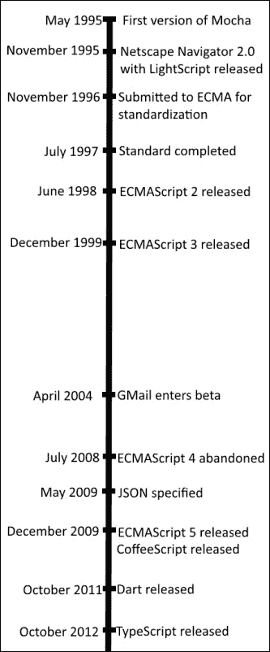
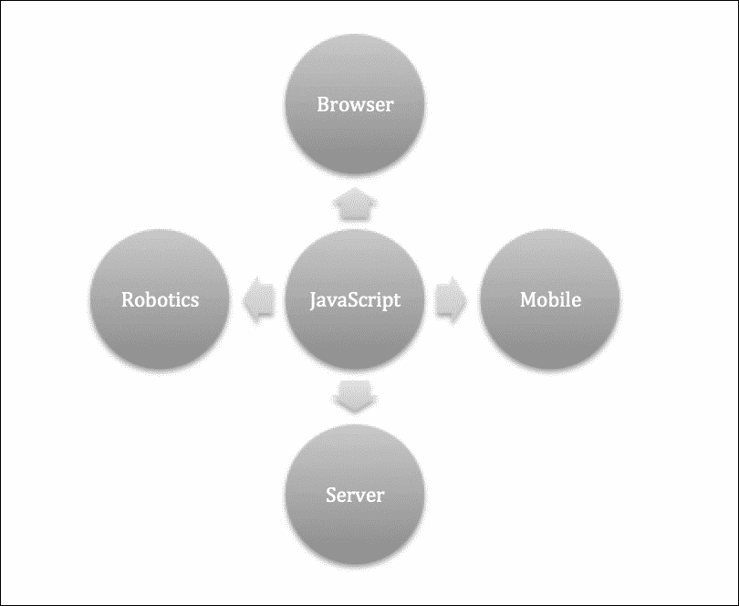

# 第一章。为了乐趣和利润而设计

JavaScript 是一种不断发展的语言，从诞生以来已经走过了很长的路。可能比其他任何一种编程语言都更随着万维网的发展而成长和变化。本书的主题是探索如何使用良好的设计原则编写 JavaScript。本书的前言包含了对书中各节的详细解释。

在本章的前半部分，我们将探讨 JavaScript 的历史，以及它如何成为今天重要的语言。随着 JavaScript 的发展和重要性的增长，对其构建应用严格方法的需求也在增长。设计模式可以是一个非常有用的工具，帮助开发可维护的代码。本章的后半部分将专门讨论设计模式的理论。最后，我们将简要地看一下反模式。

本章的主题如下：

+   JavaScript 的历史

+   什么是设计模式？

+   反模式

# 通往 JavaScript 的道路

我们永远不会知道语言最初是如何产生的。它是从一系列在梳理仪式中发出的咕哝声和喉音慢慢演变而来的吗？也许它是为了让母亲和她们的后代进行交流而发展起来的。这两种理论都是不可能证明的。在那个重要的时期，没有人在场观察我们的祖先。事实上，缺乏经验证据导致巴黎语言学会禁止进一步讨论这个话题，认为它不适合进行严肃的研究。

## 早期

幸运的是，编程语言在最近的历史中得到了发展，我们能够看到它们的成长和变化。JavaScript 是现代编程语言中历史最有趣的之一。在 1995 年 5 月的 10 天里，网景的一名程序员写下了现代 JavaScript 的基础。

当时，网景正参与与微软的浏览器战争。网景的愿景远不止于开发一个浏览器。他们想要创建一个完整的分布式操作系统，利用 Sun Microsystems 最近发布的 Java 编程语言。Java 是 C++的更现代的替代品。然而，网景没有对 Visual Basic 有所回应。Visual Basic 是一种更容易使用的编程语言，面向经验较少的开发人员。它避开了 C 和 C++编程中的一些困难，如内存管理。Visual Basic 也避免了严格的类型检查，总体上更加灵活。下面是 JavaScript 的时间线图：

Brendan Eich 被委托开发网景的回应 VB。该项目最初被命名为 Mocha，但在网景 2.0 测试版发布之前被更名为 LiveScript。到全面发布时，Mocha/LiveScript 已更名为 JavaScript，以便与 Java 小程序集成。Java 小程序是在浏览器中运行的小型应用程序。它们与浏览器本身有不同的安全模型，因此在与浏览器和本地系统的交互方面受到限制。如今很少见到小程序，因为它们的许多功能已经成为浏览器的一部分。当时 Java 正处于流行的浪潮中，与之有关的任何关系都被夸大了。

多年来，这个名称引起了很多混淆。JavaScript 是一种与 Java 非常不同的语言。JavaScript 是一种解释性语言，具有松散的类型，主要在浏览器上运行。Java 是一种编译成字节码的语言，然后在 Java 虚拟机上执行。它在许多场景中都有适用性，从浏览器（通过 Java 小程序的使用）到服务器（Tomcat，JBoss 等），到完整的桌面应用程序（Eclipse，OpenOffice 等）。在大多数外行人的想法中，混淆仍然存在。

JavaScript 原来真的非常有用，可以与 Web 浏览器进行交互。很快，微软也将 JavaScript 引入其 Internet Explorer 中，以补充 VBScript。微软的实现被称为 JScript。

到 1996 年末，很明显 JavaScript 将成为不久的将来的获胜网络语言。为了限制实现之间的语言偏差，Sun 和 Netscape 开始与**欧洲计算机制造商协会**（**ECMA**）合作，制定了未来版本的 JavaScript 需要遵守的标准。标准很快发布（从标准组织的运作速度来看，非常快），于 1997 年 7 月发布。如果你还没有看到 JavaScript 的足够多的名称，标准版本被称为**ECMAScript**，这个名称在一些圈子里仍然存在。

不幸的是，标准只规定了 JavaScript 的核心部分。在浏览器战争激烈的同时，很明显，任何坚持只使用 JavaScript 基本实现的供应商都会很快被抛在后面。与此同时，还在进行大量工作，以建立浏览器的标准**文档对象模型**（**DOM**）。DOM 实际上是一个可以使用 JavaScript 进行操作的网页 API。

多年来，每个 JavaScript 脚本都会尝试确定其运行的浏览器。这将决定如何处理 DOM 中的元素，因为每个浏览器之间存在显著的差异。执行简单操作所需的代码混乱程度是传奇的。我记得曾经阅读过一篇为期一年的 20 篇系列文章，介绍如何开发一个在 Internet Explorer 和 Netscape Navigator 上都能工作的**Dynamic HTML**（**DHTML**）下拉菜单。现在，可以通过纯 CSS 实现相同的功能，甚至无需使用 JavaScript。

### 注意

DHTML 在 20 世纪 90 年代末和 21 世纪初是一个流行的术语。它实际上指的是在客户端执行某种动态内容的任何网页。随着 JavaScript 的流行，几乎每个页面都变得动态化，这个术语已经不再使用。

幸运的是，JavaScript 标准化的努力在幕后继续进行。ECMAScript 的第 2 版和第 3 版分别在 1998 年和 1999 年发布。看起来各方对 JavaScript 感兴趣的各方可能终于达成了一些共识。2000 年初开始了 ECMAScript 4 的工作，这将是一个重大的新版本。

## 暂停

然后，灾难来临了。ECMAScript 工作中涉及的各个团体对 JavaScript 的发展方向存在重大分歧。微软似乎对标准化工作失去了兴趣。这在一定程度上是可以理解的，因为那个时候 Netscape 自毁了，Internet Explorer 成为了事实上的标准。微软实现了 ECMAScript 4 的部分内容，但并非全部。其他人实现了更全面的支持，但由于市场领导者不支持，开发人员也不愿意使用它们。

多年过去了，没有达成共识，也没有新的 ECMAScript 发布。然而，正如经常发生的那样，互联网的发展无法被主要参与者之间的意见分歧所阻止。诸如 jQuery，Prototype，Dojo 和 Mootools 等库弥合了浏览器之间的主要差异，使跨浏览器开发变得更加容易。与此同时，应用程序中使用的 JavaScript 数量大幅增加。

## GMail 的方式

转折点也许是 2004 年 Google 发布 GMail 应用程序。尽管**异步 JavaScript 和 XML**（**AJAX**）背后的技术在 GMail 发布时已经存在了大约五年，但它并没有被广泛使用。当 GMail 发布时，我完全被它的流畅度所震撼。我们已经习惯了避免完整重新加载的应用程序，但在当时，这是一场革命。为了使这样的应用程序工作，需要大量的 JavaScript。

### 注

AJAX 是一种通过客户端从服务器检索小数据块而不是刷新整个页面的方法。这种技术允许更具交互性的页面，避免了完整页面重新加载的冲击。

GMail 的流行是一个正在酝酿已久的变革的触发器。不断增加的 JavaScript 接受度和标准化推动我们超越了 JavaScript 作为一种合适语言的临界点。直到那时，JavaScript 的使用大多用于对页面进行微小更改和验证表单输入。我和人们开玩笑说，在 JavaScript 的早期，唯一使用的函数名称是`Validate()`。

诸如 GMail 这样对 AJAX 有很大依赖并且避免完整页面重新加载的应用程序被称为**单页面应用**或**SPA**。通过最小化页面内容的更改，用户可以获得更流畅的体验。通过仅传输**JavaScript 对象表示**（**JSON**）负载而不是 HTML，还可以最小化所需的带宽。这使得应用程序看起来更加敏捷。近年来，关于简化 SPA 创建的框架取得了巨大进步。AngularJS，backbone.js 和 ember 都是模型视图控制器风格的框架。它们在过去两三年里获得了极大的流行，并提供了一些有趣的模式使用。这些框架是多年来一些非常聪明的人对 JavaScript 最佳实践进行实验的演变。

### 注

JSON 是 JavaScript 的一种人类可读的序列化格式。近年来它变得非常流行，因为它比以前流行的 XML 格式更容易和不那么繁琐。它缺少 XML 的许多伴随技术和严格的语法规则，但在简单性方面弥补了这一点。

与使用 JavaScript 的框架同时，语言本身也在不断发展。2015 年发布了一个备受瞩目的 JavaScript 新版本，这个版本已经在开发了一些年头。最初被称为 ECMAScript 6，最终的名称变成了 ECMAScript-2015。它带来了一些对生态系统的重大改进。浏览器供应商们正在争相采用这一标准。由于向代码库添加新的语言特性的复杂性，再加上并非所有人都在浏览器的前沿，一些其他编译成 JavaScript 的语言正在变得流行。CoffeeScript 是一种类似 Python 的语言，旨在提高 JavaScript 的可读性和简洁性。由 Google 开发的 Dart 被谷歌推广为 JavaScript 的最终替代品。它的构造解决了传统 JavaScript 中不可能的一些优化。在 Dart 运行时足够流行之前，谷歌提供了一个 Dart 到 JavaScript 的转换器。TypeScript 是微软的一个项目，它向 JavaScript 添加了一些 ECMAScript-2015 甚至一些 ECMAScript-201X 的语法，以及一个有趣的类型系统。它旨在解决大型 JavaScript 项目所面临的一些问题。

讨论 JavaScript 历史的目的有两个：首先，重要的是要记住语言不是在真空中发展的。人类语言和计算机编程语言都会根据使用环境而发生变异。人们普遍认为因纽特人有很多词来描述“雪”，因为在他们的环境中雪是如此普遍。这可能是真的，也可能不是，这取决于你对这个词的定义，以及谁构成了因纽特人。然而，在狭窄领域中，有很多例子表明特定领域的词汇会不断演变以满足精确定义的要求。我们只需看一下专业烹饪店，就会看到许多我们这样的外行人会称之为平底锅的各种变体。

萨皮尔-沃夫假说是语言学领域内的一种假设，它认为语言不仅受到使用环境的影响，而且语言也会影响其环境。也被称为语言相对论，该理论认为一个人的认知过程会因语言的构造方式而有所不同。认知心理学家基思·陈提出了一个引人入胜的例子。在一次观看量极高的 TED 演讲中，陈博士提出了一种有力的正相关关系，即缺乏未来时态的语言与高储蓄率之间存在着强烈的正相关关系（[`www.ted.com/talks/keith_chen_could_your_language_affect_your_ability_to_save_money/transcript`](https://www.ted.com/talks/keith_chen_could_your_language_affect_your_ability_to_save_money/transcript)）。陈博士得出的假设是，当你的语言没有很强的将现在和未来联系起来的意识时，这会导致更加鲁莽的行为。

因此，了解 JavaScript 的历史将使人更好地理解何时何地使用 JavaScript。

我探索 JavaScript 历史的第二个原因是，看到如此受欢迎的工具如何迅速地发展是非常迷人的。在撰写本文时，距离 JavaScript 首次构建已经大约 20 年了，它的流行程度增长迅猛。还有什么比在一个不断发展的语言中工作更令人兴奋的呢？

## JavaScript 无处不在

自 GMail 革命以来，JavaScript 已经大幅增长。重新燃起的浏览器战争，将 Internet Explorer 和 Edge 对抗 Chrome 和 Firefox，导致了构建许多非常快速的 JavaScript 解释器。全新的优化技术已经部署，不足以看到 JavaScript 编译为机器本地代码以获得额外的性能。然而，随着 JavaScript 的速度增加，使用它构建的应用程序的复杂性也在增加。

JavaScript 不再仅仅是用于操作浏览器的语言。流行的 Chrome 浏览器背后的 JavaScript 引擎已经被提取出来，现在是许多有趣项目的核心，比如 Node.js。Node.js 最初是一种高度异步的编写服务器端应用程序的方法。它已经大大发展，并有一个非常活跃的社区支持。使用 Node.js 运行时已经构建了各种各样的应用程序。从构建工具到编辑器都是基于 Node.js 构建的。最近，微软 Edge 的 JavaScript 引擎 ChakraCore 也开源，并可以嵌入 Node.js 作为 Google 的 V8 的替代品。Firefox 的等效物 SpiderMonkey 也是开源的，并正在进入更多的工具中。

JavaScript 甚至可以用来控制微控制器。Johnny-Five 框架是非常流行的 Arduino 的编程框架。它为编程这些设备带来了比传统的低级语言更简单的方法。使用 JavaScript 和 Arduino 打开了一系列可能性，从构建机器人到与现实世界的传感器进行交互。

所有主要的智能手机平台（iOS、Android 和 Windows Phone）都有使用 JavaScript 构建应用程序的选项。平板电脑领域也大同小异，支持使用 JavaScript 进行编程。甚至最新版本的 Windows 提供了使用 JavaScript 构建应用程序的机制。这个插图展示了 JavaScript 可能的一些事情：

JavaScript 正在成为世界上最重要的语言之一。尽管语言使用统计数据 notoriously difficult to calculate，但每一个试图开发排名的来源都将 JavaScript 列在前十名中：

| 语言指数 | JavaScript 的排名 |
| --- | --- |
| Langpop.com | 4 |
| Statisticbrain.com | 4 |
| Codeval.com | 6 |
| TIOBE | 8 |

更有趣的是，大多数这些排名表明 JavaScript 的使用正在上升。

长话短说，JavaScript 将在未来几年成为一种重要的语言。越来越多的应用程序是用 JavaScript 编写的，它是任何类型的 Web 开发的通用语言。流行的 Stack Overflow 网站的开发者 Jeff Atwood 创建了 Atwood's Law，关于 JavaScript 的广泛应用：

> *"任何可以用 JavaScript 编写的应用程序，最终都会用 JavaScript 编写" - Atwood's Law, Jeff Atwood*

这一观点一次又一次地被证明是正确的。现在有编译器、电子表格、文字处理器——你说的都有——都是用 JavaScript 编写的。

随着使用 JavaScript 的应用程序变得越来越复杂，开发人员可能会遇到许多与传统编程语言中相同的问题：我们如何编写这个应用程序以适应变化？

这引出了对应用程序进行适当设计的需求。我们不能再简单地把一堆 JavaScript 放入一个文件中，然后希望它能正常工作。我们也不能依赖于 jQuery 等库来拯救自己。库只能提供额外的功能，对应用程序的结构没有任何贡献。现在必须要注意如何构建应用程序以使其具有可扩展性和适应性。现实世界是不断变化的，任何不能适应变化世界的应用程序都可能被抛在脑后。设计模式在构建适应性强的应用程序方面提供了一些指导，这些应用程序可以随着业务需求的变化而变化。

# 什么是设计模式？

在大多数情况下，想法只适用于一个地方。例如，在烹饪中添加花生酱确实只是一个好主意，而在缝纫中不是。然而，偶尔也可能会发现一个好主意在原始用途之外也有适用性。这就是设计模式背后的故事。

1977 年，克里斯托弗·亚历山大、Sara Ishikawa 和 Murray Silverstein 撰写了一本关于城市规划中所谓的设计模式的重要书籍，名为《模式语言：城镇、建筑、建筑》。

这本书描述了一种用于讨论设计共性的语言。在书中，模式被描述如下：

> “这种语言的元素被称为模式实体。每个模式描述了我们环境中反复出现的问题，然后以这样一种方式描述了解决这个问题的核心，以便您可以使用这个解决方案一百万次，而不必两次以相同的方式做。” ——克里斯托弗·亚历山大

这些设计模式是如何布局城市以提供城市和乡村生活的混合，或者如何在住宅区中建造环路道路作为交通缓和措施的，如下图所示。

即使对于那些对城市规划不感兴趣的人来说，这本书也提出了一些关于如何构建我们的世界以促进健康社会的迷人想法。

Erich Gamma、Richard Helm、Ralph Johnson 和 John Vlissides 利用克里斯托弗·亚历山大和其他作者的作品作为灵感来源，写了一本名为《设计模式：可重用面向对象软件的元素》的书。当一本书在计算机科学课程中非常有影响力时，通常会被赋予一个昵称。例如，大多数计算机科学毕业生会知道，如果你谈论《龙书》（《编译原理》, 1986），你指的是哪本书。在企业软件中，《蓝皮书》是众所周知的埃里克·埃文斯关于领域驱动设计的书。设计模式书是如此重要，以至于通常被称为 GoF 书，或者四人帮书，因为它有四位作者。

这本书概述了 23 种用于面向对象设计的模式。它将这些模式分为三大类：

+   **创建**：这些模式概述了对象可以被创建和它们的生命周期如何被管理的多种方式

+   **行为**：这些模式描述了对象如何相互交互

+   **结构**：这些模式描述了向现有对象添加功能的各种不同方式

设计模式的目的不是指导你如何构建软件，而是提供解决常见问题的方法。例如，许多应用程序需要提供某种撤销功能。这个问题在文本编辑器、绘图程序甚至电子邮件客户端中都很常见。解决这个问题已经做过很多次了，因此有一个通用的解决方案会很好。命令模式提供了这样一个通用解决方案。它建议跟踪应用程序中执行的所有操作，作为命令的实例。这个命令将有前进和后退操作。每次处理一个命令时，它都会被放入队列中。当需要撤销一个命令时，只需简单地从命令队列中弹出顶部的命令并执行其撤销操作。

设计模式提供了一些关于如何解决常见问题的提示，比如撤销问题。它们是从解决同一个问题的数百次迭代中提炼出来的。设计模式可能并不完全是你所面临问题的正确解决方案，但至少应该提供一些指导，以更轻松地实现解决方案。

### 注意

我的一位顾问朋友曾经告诉我一个关于在新公司开始任务的故事。经理告诉他们，他认为团队没有太多工作要做，因为他们早早地为开发人员购买了《设计模式》一书，并且他们实现了每一个设计模式。我的朋友听到这个消息很高兴，因为他按小时收费。错误应用设计模式支付了他的长子大学教育的大部分费用。

自《设计模式》一书出版以来，有大量文献涉及列举和描述设计模式。有关特定领域的设计模式的书籍，也有涉及大型企业系统模式的书籍。维基百科的软件设计模式类别包含了 130 种不同的设计模式。然而，我认为许多条目并不是真正的设计模式，而是编程范式。

在大多数情况下，设计模式是简单的构造，不需要复杂的库支持。虽然大多数语言都有模式库，但你不需要花大量金钱购买这些库。根据需要实现模式。拥有一本昂贵的库会让你盲目地应用模式，只是为了证明花了钱。即使你有钱，我也不知道有任何用于提供模式支持的 JavaScript 库。当然，GitHub 上有大量有趣的 JavaScript 项目，所以可能有一些我不知道的库。

有人建议设计模式应该是自发的。也就是说，通过以智能的方式编写软件，可以看到模式从实现中出现。我认为这可能是一个准确的说法，但它忽略了通过试错来实现这些实现的实际成本。了解设计模式的人更有可能早期发现自发的模式。教导初级程序员有关模式是一个非常有用的练习。早期了解可以应用哪种模式或模式作为一种捷径。完整的解决方案可以更早地到达，并且减少错误。

# 反模式

如果在良好的软件设计中可以找到常见模式，那么在糟糕的软件设计中也可以找到模式吗？当然可以！有许多方法可以做错事情，但大多数都已经做过。要以前所未有的方式搞砸，需要真正的创造力。

可惜的是，很难记住多年来人们犯过的所有错误。在许多重大项目结束时，团队会坐下来撰写一份名为“经验教训”的文件。这份文件包含了项目中可能出现的问题，甚至可能概述了如何避免这些问题的建议。不幸的是，这些文件只在项目结束时才被制作。到那时，许多关键人员已经离开，剩下的人必须试图记住项目早期的经验教训，这可能是几年前的事了。最好在项目进行过程中制作这份文件。

一旦完成，文件就会被归档，准备供下一个项目使用。至少，这是理论。大部分情况下，文件被归档后就再也没有被使用过。很难创造出全球适用的经验教训。所学到的经验教训往往只对当前项目或完全相同的项目有用，而这几乎不会发生。

然而，通过查看来自各种项目的多份文件，模式开始显现。正是通过这种方法，威廉·布朗、拉斐尔·马尔沃、斯基普·麦考密克和汤姆·莫布雷，合称为“新生四杰”，参照了最初的四杰，撰写了关于反模式的最初著作。这本书《反模式：重构软件、架构和危机项目》不仅概述了代码问题，还概述了围绕代码的管理过程中的反模式。

概述的模式包括一些幽默命名的模式，如“Blob 和 Lava Flow”。Blob，也被称为上帝对象，是指一个对象不断增长，承担了应用程序逻辑的大部分责任。Lava Flow 是一种随着项目变老而出现的模式，没有人知道代码是否仍在使用。开发人员不敢删除代码，因为它可能在某处被使用，或者将来可能会再次有用。书中还描述了许多其他值得探索的模式。与模式一样，反模式也是从编写代码中出现的，但在这种情况下，是失控的代码。

本书不涵盖 JavaScript 反模式，但值得记住的是，过度应用设计模式是一种反模式之一。

# 摘要

设计模式有着丰富而有趣的历史。从最初作为帮助描述如何构建结构以让人们共同生活的工具，它们已经发展成适用于许多领域。

自从将设计模式应用于编程的开创性工作以来已经过去了十年。此后，已经开发出了大量新的模式。其中一些模式是通用模式，如《设计模式》一书中概述的那些，但更多的是非常具体的模式，专为在狭窄领域中使用而设计。

JavaScript 也有着有趣的历史，正在迎来成熟。随着服务器端 JavaScript 的兴起和大型 JavaScript 应用程序变得普遍，构建 JavaScript 应用程序需要更多的细心。在大多数现代 JavaScript 代码中很少看到模式被正确地应用。

依靠设计模式提供的教导来构建现代 JavaScript 模式，可以让我们兼得两全。正如艾萨克·牛顿所说：

> “如果我看得更远一些，那是因为我站在巨人的肩膀上。”

模式为我们提供了易于访问的支持。 

在下一章中，我们将探讨一些在 JavaScript 中构建结构的技术。JavaScript 的继承系统与大多数其他面向对象的语言不同，这为我们提供了机会和限制。我们将看到如何在 JavaScript 世界中构建类和模块。
