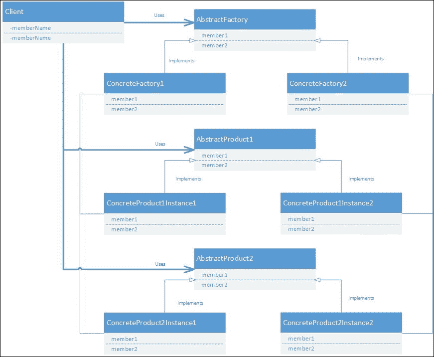

# 第三章：创建模式

在上一章中，我们详细研究了如何构建一个类。在本章中，我们将研究如何创建类的实例。表面上看，这似乎是一个简单的问题，但我们如何创建类的实例可能非常重要。

我们非常努力地创建我们的代码，使其尽可能解耦。确保类对其他类的依赖最小是构建一个可以随着使用软件的人的需求变化而流畅变化的系统的关键。允许类之间关系过于紧密意味着变化会像涟漪一样在它们之间传播。

一个涟漪并不是一个巨大的问题，但随着你不断引入更多的变化，涟漪会累积并产生干涉模式。很快，曾经平静的表面就变成了无法辨认的添加和破坏节点的混乱。我们的应用程序中也会出现同样的问题：变化会放大并以意想不到的方式相互作用。我们经常忽视耦合的一个地方就是在对象的创建中：

```js
let Westeros;
(function (Westeros) {
  let Ruler = (function () {
    function Ruler() {
      this.house = new Westeros.Houses.Targaryen();
    }
    return Ruler;
  })();
  Westeros.Ruler = Ruler;
})(Westeros || (Westeros = {}));
```

在这个类中，你可以看到统治者的家与`Targaryen`类紧密耦合。如果这种情况发生改变，那么这种紧密耦合就必须在很多地方进行改变。本章讨论了一些模式，这些模式最初是在《设计模式：可复用面向对象软件的元素》一书中提出的。这些模式的目标是改善应用程序中的耦合程度，并增加代码重用的机会。这些模式如下：

+   抽象工厂

+   建造者

+   工厂方法

+   单例

+   原型

当然，并非所有这些都适用于 JavaScript，但随着我们逐步了解创建模式，我们会了解到这一切。

# 抽象工厂

这里介绍的第一个模式是一种创建对象套件的方法，而不需要知道对象的具体类型。让我们继续使用前一节中介绍的统治王国的系统。

对于所讨论的王国，统治家族的更换频率相当高。很可能在更换家族时会有一定程度的战斗和斗争，但我们暂且不予理会。每个家族都会以不同的方式统治王国。有些人看重和平与宁静，以仁慈的领导者统治，而另一些则以铁腕统治。一个王国的统治对于一个人来说太大了，所以国王会将一些决定交给一个叫做国王之手的副手。国王也会在一些事务上得到一个由一些精明的领主和贵妇组成的议会的建议。

我们描述的类的图表如下：


### 提示

**统一建模语言**（**UML**）是由对象管理组开发的标准化语言，用于描述计算机系统。该语言中有用于创建用户交互图、序列图和状态机等的词汇。对于本书的目的，我们最感兴趣的是类图，它描述了一组类之间的关系。

整个 UML 类图词汇量很大，超出了本书的范围。然而，维基百科上的文章[`en.wikipedia.org/wiki/Class_diagram`](https://en.wikipedia.org/wiki/Class_diagram)以及 Derek Banas 的优秀视频教程[`www.youtube.com/watch?v=3cmzqZzwNDM`](https://www.youtube.com/watch?v=3cmzqZzwNDM)都是很好的介绍。

问题在于，由于统治家族甚至统治家族成员经常变动，与 Targaryen 或 Lannister 等具体家族耦合会使我们的应用程序变得脆弱。脆弱的应用程序在不断变化的世界中表现不佳。

解决这个问题的方法是利用抽象工厂模式。抽象工厂声明了一个接口，用于创建与统治家族相关的各种类。

这种模式的类图相当令人生畏：



抽象工厂类可能对统治家族的各个实现有多个。这些被称为具体工厂，它们每个都将实现抽象工厂提供的接口。具体工厂将返回各种统治类的具体实现。这些具体类被称为产品。

让我们首先看一下抽象工厂接口的代码。

没有代码？实际上确实如此。JavaScript 的动态特性消除了描述类所需的接口的需要。我们将直接创建类，而不是使用接口：


JavaScript 不使用接口，而是相信您提供的类实现了所有适当的方法。在运行时，解释器将尝试调用您请求的方法，并且如果找到该方法，就会调用它。解释器只是假设如果您的类实现了该方法，那么它就是该类。这就是所谓的**鸭子类型**。

### 注意

**鸭子类型**

鸭子类型的名称来源于 Alex Martelli 在 2000 年发布的一篇文章，他在*comp.lang.python*新闻组中写道：

*换句话说，不要检查它是否是一只鸭子：检查它是否像一只鸭子一样嘎嘎叫，像一只鸭子一样走路，等等，具体取决于您需要用来玩语言游戏的鸭子行为的子集。*

我喜欢 Martelli 可能是从*Monty Python and the Holy Grail*的巫师狩猎片段中借用了这个术语。虽然我找不到任何证据，但我认为这很可能，因为 Python 编程语言的名称就来自于 Monty Python。

鸭子类型是动态语言中的强大工具，可以大大减少实现类层次结构的开销。然而，它确实引入了一些不确定性。如果两个类实现了具有根本不同含义的同名方法，那么就无法知道调用的是正确的方法。例如，考虑以下代码：

```js
class Boxer{
  function punch(){}
}
class TicketMachine{
  function punch(){}
}
```

这两个类都有一个`punch()`方法，但显然意义不同。JavaScript 解释器不知道它们是不同的类，并且会愉快地在任何一个类上调用 punch，即使其中一个没有意义。

一些动态语言支持一种通用方法，当调用未定义的方法时会调用该方法。例如，Ruby 有`missing_method`，在许多情况下都被证明非常有用。截至目前，JavaScript 目前不支持`missing_method`。然而，ECMAScript 2016，即 ECMAScript 2015 的后续版本，定义了一个称为`Proxy`的新构造，它将支持动态包装对象，借助它可以实现一个等价的`missing_method`。

## 实现

为了演示抽象工厂的实现，我们首先需要一个`King`类的实现。这段代码提供了该实现：

```js
let KingJoffery= (function () {
  function KingJoffery() {
  }
  KingJoffery.prototype.makeDecision = function () {
    …
  };
  KingJoffery.prototype.marry = function () {
    …
  };
  return KingJoffery;
})();
```

### 注意

这段代码不包括第二章*组织代码*中建议的模块结构。在每个示例中包含模块代码是乏味的，你们都是聪明的人，所以如果你们要真正使用它，就知道把它放在模块中。完全模块化的代码可以在分发的源代码中找到。

这只是一个普通的具体类，实际上可以包含任何实现细节。我们还需要一个同样不起眼的`HandOfTheKing`类的实现：

```js
let LordTywin = (function () {
  function LordTywin() {
  }
  LordTywin.prototype.makeDecision = function () {
  };
  return LordTywin;
})();
```

具体的工厂方法如下：

```js
let LannisterFactory = (function () {
  function LannisterFactory() {
  }
  LannisterFactory.prototype.getKing = function () {
    return new KingJoffery();
  };
  LannisterFactory.prototype.getHandOfTheKing = function ()
  {
    return new LordTywin();
  };
  return LannisterFactory;
})();
```

这段代码只是实例化所需类的新实例并返回它们。不同统治家族的另一种实现将遵循相同的一般形式，可能如下所示：

```js
let TargaryenFactory = (function () {
  function TargaryenFactory() {
  }
  TargaryenFactory.prototype.getKing = function () {
    return new KingAerys();
  };
  TargaryenFactory.prototype.getHandOfTheKing = function () {
    return new LordConnington();
  };
  return TargaryenFactory;
})();
```

在 JavaScript 中实现抽象工厂比其他语言要容易得多。然而，这样做的代价是失去了编译器检查，它强制要求对工厂或产品进行完整的实现。随着我们继续学习其他模式，你会注意到这是一个常见的主题。在静态类型语言中有很多管道的模式要简单得多，但会增加运行时失败的风险。适当的单元测试或 JavaScript 编译器可以缓解这种情况。

要使用抽象工厂，我们首先需要一个需要使用某个统治家族的类：

```js
let CourtSession = (function () {
  function CourtSession(abstractFactory) {
    this.abstractFactory = abstractFactory;
    this.COMPLAINT_THRESHOLD = 10;
  }
  CourtSession.prototype.complaintPresented = function (complaint) {
    if (complaint.severity < this.COMPLAINT_THRESHOLD) {
      this.abstractFactory.getHandOfTheKing().makeDecision();
    } else
    this.abstractFactory.getKing().makeDecision();
  };
  return CourtSession;
})();
```

现在我们可以调用这个`CourtSession`类，并根据传入的工厂注入不同的功能：

```js
let courtSession1 = new CourtSession(new TargaryenFactory());
courtSession1.complaintPresented({ severity: 8 });
courtSession1.complaintPresented({ severity: 12 });

let courtSession2 = new CourtSession(new LannisterFactory());
courtSession2.complaintPresented({ severity: 8 });
courtSession2.complaintPresented({ severity: 12 });
```

尽管静态语言和 JavaScript 之间存在差异，但这种模式在 JavaScript 应用程序中仍然适用且有用。创建一组共同工作的对象对于许多情况都是有用的；每当一组对象需要协作提供功能但可能需要整体替换时。当试图确保一组对象一起使用而不进行替换时，这也可能是一个有用的模式。

# 建造者

在我们的虚构世界中，有时需要构建一些相当复杂的类。这些类包含了根据构建方式不同的接口实现。为了简化这些类的构建并将构建类的知识封装在消费者之外，可以使用建造者。多个具体建造者降低了实现中构造函数的复杂性。当需要新的建造者时，不需要添加构造函数，只需要插入一个新的建造者。

锦标赛是一个复杂类的例子。每个锦标赛都有一个复杂的设置，涉及事件、参与者和奖品。这些锦标赛的大部分设置都是相似的：每一个都有比武、射箭和混战。从代码中的多个位置创建锦标赛意味着构建锦标赛的责任被分散。如果需要更改初始化代码，那么必须在许多不同的地方进行更改。

通过使用构建器模式，可以避免这个问题，因为它集中了构建对象所需的逻辑。不同的具体构建器可以插入到构建器中，以构建不同的复杂对象。构建器模式中各个类之间的关系如下所示：


## 实施

让我们进去看一些代码。首先，我们将创建一些实用类，它们将表示比赛的各个部分，如下面的代码所示：

```js
let Event = (function () {
  function Event(name) {
    this.name = name;
  }
  return Event;
})();
Westeros.Event = Event;

let Prize = (function () {
  function Prize(name) {
    this.name = name;
  }
  return Prize;
})();
Westeros.Prize = Prize;

let Attendee = (function () {
  function Attendee(name) {
    this.name = name;
  }
  return Attendee;
})();
Westeros.Attendee = Attendee;
```

比赛本身是一个非常简单的类，因为我们不需要显式地分配任何公共属性：

```js
let Tournament = (function () {
  this.Events = [];
  function Tournament() {
  }
  return Tournament;
})();
Westeros.Tournament = Tournament;
```

我们将实现两个创建不同比赛的构建器。下面的代码中可以看到：

```js
let LannisterTournamentBuilder = (function () {
  function LannisterTournamentBuilder() {
  }
  LannisterTournamentBuilder.prototype.build = function () {
    var tournament = new Tournament();
    tournament.events.push(new Event("Joust"));
    tournament.events.push(new Event("Melee"));
    tournament.attendees.push(new Attendee("Jamie"));
    tournament.prizes.push(new Prize("Gold"));
    tournament.prizes.push(new Prize("More Gold"));
    return tournament;
  };
  return LannisterTournamentBuilder;
})();
Westeros.LannisterTournamentBuilder = LannisterTournamentBuilder;

let BaratheonTournamentBuilder = (function () {
  function BaratheonTournamentBuilder() {
  }
  BaratheonTournamentBuilder.prototype.build = function () {
    let tournament = new Tournament();
    tournament.events.push(new Event("Joust"));
    tournament.events.push(new Event("Melee"));
    tournament.attendees.push(new Attendee("Stannis"));
    tournament.attendees.push(new Attendee("Robert"));
    return tournament;
  };
  return BaratheonTournamentBuilder;
})();
Westeros.BaratheonTournamentBuilder = BaratheonTournamentBuilder;
```

最后，导演，或者我们称之为`TournamentBuilder`，只需拿起一个构建器并执行它：

```js
let TournamentBuilder = (function () {
  function TournamentBuilder() {
  }
  TournamentBuilder.prototype.build = function (builder) {
    return builder.build();
  };
  return TournamentBuilder;
})();
Westeros.TournamentBuilder = TournamentBuilder;
```

再次，您会看到 JavaScript 的实现比传统的实现要简单得多，因为不需要接口。

构建器不需要返回一个完全实现的对象。这意味着您可以创建一个部分填充对象的构建器，然后允许对象传递给另一个构建器来完成。一个很好的现实世界类比可能是汽车的制造过程。在装配线上的每个工位都只组装汽车的一部分，然后将其传递给下一个工位组装另一部分。这种方法允许将构建对象的工作分配给几个具有有限责任的类。在我们上面的例子中，我们可以有一个负责填充事件的构建器，另一个负责填充参与者的构建器。

在 JavaScript 的原型扩展模型中，构建器模式是否仍然有意义？我认为是的。仍然存在需要根据不同的方法创建复杂对象的情况。

# 工厂方法

我们已经看过抽象工厂和构建器。抽象工厂构建了一组相关的类，而构建器使用不同的策略创建复杂对象。工厂方法模式允许类请求接口的新实例，而不是类决定使用接口的哪个实现。工厂可能使用某种策略来选择要返回的实现：


有时，这种策略只是接受一个字符串参数或检查一些全局设置来充当开关。

## 实施

在我们的 Westworld 示例世界中，有很多时候我们希望将实现的选择推迟到工厂。就像现实世界一样，Westworld 拥有丰富多彩的宗教文化，有数十种不同的宗教崇拜各种各样的神。在每种宗教中祈祷时，必须遵循不同的规则。有些宗教要求献祭，而其他宗教只要求给予礼物。祈祷类不想知道所有不同的宗教以及如何构建它们。

让我们开始创建一些不同的神，可以向他们献祷。这段代码创建了三个神，包括一个默认的神，如果没有指定其他神，祷告就会落在他身上：

```js
let WateryGod = (function () {
  function WateryGod() {
  }
  WateryGod.prototype.prayTo = function () {
  };
  return WateryGod;
})();
Religion.WateryGod = WateryGod;
let AncientGods = (function () {
  function AncientGods() {
  }
  AncientGods.prototype.prayTo = function () {
  };
  return AncientGods;
})();
Religion.AncientGods = AncientGods;

let DefaultGod = (function () {
  function DefaultGod() {
  }
  DefaultGod.prototype.prayTo = function () {
  };
  return DefaultGod;
})();
Religion.DefaultGod = DefaultGod;
```

我避免了为每个神明的任何实现细节。您可以想象任何您想要填充`prayTo`方法的传统。也没有必要确保每个神都实现了`IGod`接口。接下来，我们需要一个工厂，负责构建不同的神：

```js
let GodFactory = (function () {
  function GodFactory() {
  }
  GodFactory.Build = function (godName) {
    if (godName === "watery")
      return new WateryGod();
    if (godName === "ancient")
      return new AncientGods();
    return new DefaultGod();
  };
  return GodFactory;
})();
```

您可以看到，在这个例子中，我们接受一个简单的字符串来决定如何创建一个神。它可以通过全局或更复杂的对象来完成。在 Westeros 的一些多神教中，神明有明确定的角色，如勇气之神、美丽之神或其他方面的神。必须祈祷的神不仅由宗教决定，还由祈祷的目的决定。我们可以用`GodDeterminant`类来表示这一点，如下所示：

```js
let GodDeterminant = (function () {
  function GodDeterminant(religionName, prayerPurpose) {
    this.religionName = religionName;
    this.prayerPurpose = prayerPurpose;
  }
  return GodDeterminant;
})();
```

工厂将被更新以接受这个类，而不是简单的字符串。

最后，最后一步是看看这个工厂将如何被使用。这很简单，我们只需要传入一个表示我们希望观察的宗教的字符串，工厂将构造正确的神并返回它。这段代码演示了如何调用工厂：

```js
let Prayer = (function () {
  function Prayer() {
  }
  Prayer.prototype.pray = function (godName) {
  GodFactory.Build(godName).prayTo();
  };
  return Prayer;
})();
```

再次，JavaScript 中肯定需要这样的模式。有很多时候，将实例化与使用分开是有用的。由于关注点的分离和注入假工厂以允许测试`Prayer`也很容易，测试实例化也非常简单。

继续创建不带接口的更简单模式的趋势，我们可以忽略模式的接口部分，直接使用类型，这要归功于鸭子类型。

工厂方法是一种非常有用的模式：它允许类将实例化的实现选择推迟到另一个类。当存在多个类似的实现时，这种模式非常有用，比如策略模式（参见第五章 ，*行为模式*），并且通常与抽象工厂模式一起使用。工厂方法用于在抽象工厂的具体实现中构建具体对象。抽象工厂模式可能包含多个工厂方法。工厂方法无疑是一种在 JavaScript 领域仍然适用的模式。

# 单例

单例模式可能是最常被滥用的模式。它也是近年来不受青睐的模式。为了看到为什么人们开始建议不要使用单例模式，让我们看看这个模式是如何工作的。

当需要全局变量时使用单例是可取的，但单例提供了防止意外创建复杂对象的保护。它还允许推迟对象实例化直到第一次使用。

单例的 UML 图如下所示：


这显然是一种非常简单的模式。单例充当类的实例的包装器，单例本身作为全局变量存在。在访问实例时，我们只需向单例请求包装类的当前实例。如果类在单例中尚不存在，通常会在那时创建一个新实例。

## 实施

在我们在维斯特洛大陆的持续示例中，我们需要找到一个只能有一个东西的情况。不幸的是，这是一个经常发生冲突和敌对的土地，所以我最初想到的将国王作为单例的想法根本行不通。这也意味着我们不能利用其他明显的候选人（首都，王后，将军等）。然而，在维斯特洛大陆的最北部，有一堵巨大的墙，用来阻挡一位古老的敌人。这样的墙只有一堵，将其放在全局范围内应该没有问题。

让我们继续在 JavaScript 中创建一个单例：

```js
let Westros;
(function (Westeros) {
  var Wall = (function () {
 **function Wall() {** 

 **this.height = 0;** 

 **if (Wall._instance)** 

 **return Wall._instance;** 

 **Wall._instance = this;** 

 **}** 

    Wall.prototype.setHeight = function (height) {
      this.height = height;
    };
    Wall.prototype.getStatus = function () {
      console.log("Wall is " + this.height + " meters tall");
    };
 **Wall.getInstance = function () {** 

 **if (!Wall._instance) {** 

 **Wall._instance = new Wall();** 

 **}** 

 **return Wall._instance;** 

 **};** 

    Wall._instance = null;
    return Wall;
  })();
  Westeros.Wall = Wall;
})(Westeros || (Westeros = {}));
```

该代码创建了墙的轻量级表示。单例在两个突出显示的部分中进行了演示。在像 C#或 Java 这样的语言中，我们通常会将构造函数设置为私有，以便只能通过静态方法`getInstance`来调用它。然而，在 JavaScript 中我们没有这个能力：构造函数不能是私有的。因此，我们尽力而为，从构造函数中返回当前实例。这可能看起来很奇怪，但在我们构造类的方式中，构造函数与任何其他方法没有区别，因此可以从中返回一些东西。

在第二个突出部分中，我们将静态变量`_instance`设置为 Wall 的新实例（如果还没有）。如果`_instance`已经存在，我们将返回它。在 C#和 Java 中，这个函数需要一些复杂的锁定逻辑，以避免两个不同的线程同时尝试访问实例时出现竞争条件。幸运的是，在 JavaScript 中不需要担心这个问题，因为多线程的情况不同。

## 缺点

单例在过去几年中声名狼藉。它们实际上是被吹捧的全局变量。正如我们讨论过的，全局变量是不合理的，可能导致许多错误。它们也很难通过单元测试进行测试，因为实例的创建不能轻易被覆盖，测试运行器中的任何并行性都可能引入难以诊断的竞争条件。我对它们最大的担忧是单例承担了太多的责任。它们不仅控制自己，还控制它们的实例化。这是对单一责任原则的明显违反。几乎每一个可以使用单例解决的问题，都可以通过其他机制更好地解决。

JavaScript 使问题变得更糟。由于构造函数的限制，无法创建单例的清晰实现。这与单例的一般问题结合在一起，使我建议在 JavaScript 中应避免使用单例模式。

# 原型

本章中的最后一个创建模式是原型模式。也许这个名字听起来很熟悉。它确实应该：这是 JavaScript 支持继承的机制。

我们研究了用于继承的原型，但原型的适用性不一定局限于继承。复制现有对象可以是一个非常有用的模式。有许多情况下，能够复制构造对象是很方便的。例如，通过保存利用某种克隆创建的先前实例，很容易地维护对象状态的历史。

## 实施

在维斯特洛，我们发现家庭成员经常非常相似；正如谚语所说：“有其父必有其子”。随着每一代的诞生，通过复制和修改现有家庭成员来创建新一代比从头开始建造要容易得多。

在第二章中，*组织代码*，我们看了如何复制现有对象，并介绍了一个非常简单的克隆代码：

```js
function clone(source, destination) {
  for(var attr in source.prototype){
    destination.prototype[attr] = source.prototype[attr];}
}
```

这段代码可以很容易地改变，以便在类内部使用，返回自身的副本：

```js
var Westeros;
(function (Westeros) {
  (function (Families) {
    var Lannister = (function () {
      function Lannister() {
      }
      **Lannister.prototype.clone = function () {** 

 **var clone = new Lannister();** 

 **for (var attr in this) {** 

 **clone[attr] = this[attr];** 

 **}** 

 **return clone;** 

 **};** 

      return Lannister;
    })();
    Families.Lannister = Lannister;
  })(Westeros.Families || (Westeros.Families = {}));
  var Families = Westeros.Families;
})(Westeros || (Westeros = {}));
```

代码的突出部分是修改后的克隆方法。它可以这样使用：

```js
let jamie = new Westeros.Families.Lannister();
jamie.swordSkills = 9;
jamie.charm = 6;
jamie.wealth = 10;

let tyrion = jamie.clone();
tyrion.charm = 10;
//tyrion.wealth == 10
//tyrion.swordSkill == 9
```

原型模式允许只构造一次复杂对象，然后克隆成任意数量的仅略有不同的对象。如果源对象不复杂，那么采用克隆方法就没有太多好处。在使用原型方法时，必须注意依赖对象。克隆是否应该是深层的？

原型显然是一个有用的模式，也是 JavaScript 从一开始就形成的一个组成部分。因此，它肯定是任何规模可观的 JavaScript 应用程序中会看到一些使用的模式。

# 提示和技巧

创建模式允许在创建对象时实现特定行为。在许多情况下，比如工厂，它们提供了可以放置横切逻辑的扩展点。也就是说，适用于许多不同类型对象的逻辑。如果你想要在整个应用程序中注入日志，那么能够连接到工厂是非常有用的。

尽管这些创建模式非常有用，但不应该经常使用。您的大部分对象实例化仍应该是改进对象的正常方法。虽然当你有了新的工具时，把一切都视为钉子是很诱人的，但事实是每种情况都需要有一个具体的策略。所有这些模式都比简单使用`new`更复杂，而复杂的代码更容易出现错误。尽量使用`new`。

# 总结

本章介绍了创建对象的多种不同策略。这些方法提供了对创建对象的典型方法的抽象。抽象工厂提供了构建可互换的工具包或相关对象集合的方法。建造者模式提供了解决参数问题的解决方案。它使得构建大型复杂对象变得更加容易。工厂方法是抽象工厂的有用补充，允许通过静态工厂创建不同的实现。单例是一种提供整个解决方案可用的类的单个副本的模式。这是迄今为止我们所见过的唯一一个在现代软件中存在一些适用性问题的模式。原型模式是 JavaScript 中常用的一种模式，用于基于其他现有对象构建对象。

我们将在下一章继续对经典设计模式进行考察，重点关注结构模式。

